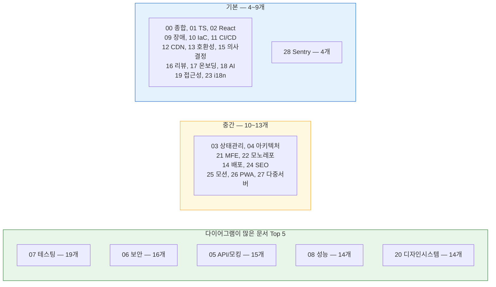
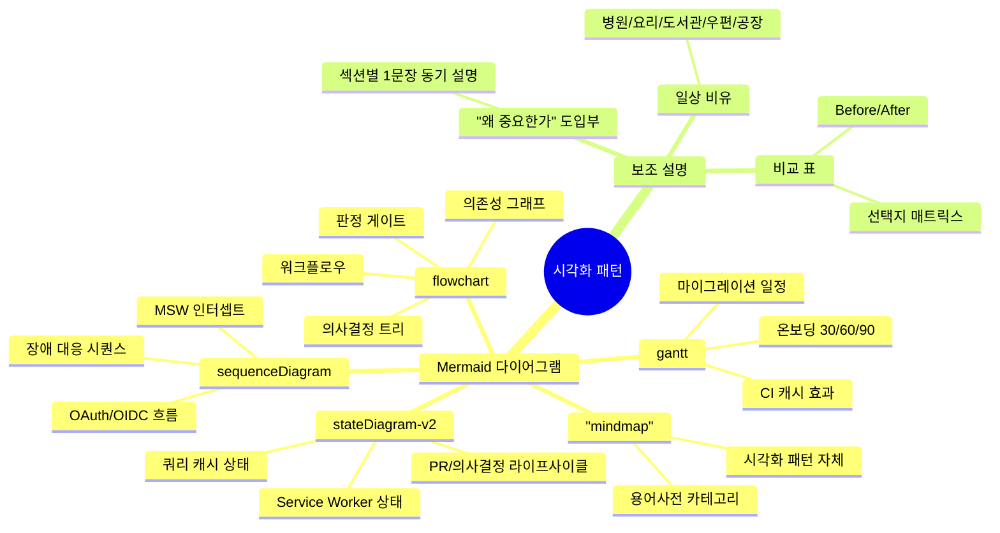
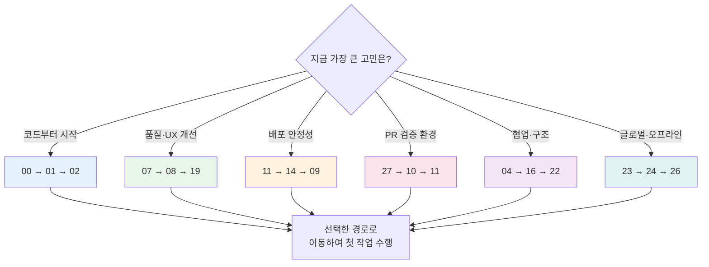

# AI-First Frontend Development Guide

> https://heejun.store

프론트엔드 개발을 처음 설계할 때부터 배포, 운영, 접근성, 성능, 보안, AI 협업까지 한 흐름으로 이어서 볼 수 있는 실무형 개발 가이드입니다. 문서는 특정 회사나 도구에 맞춘 규정집이 아니라, 실제 프로젝트에서 바로 확인하고 적용할 수 있는 판단 기준, 구현 순서, 검증 방법을 중심으로 정리합니다.

## 한눈에 보는 가이드 현황

| 영역                        |                    수치                     |
| :-------------------------- | :-----------------------------------------: |
| 개발 가이드 문서            |                  **29개**                   |
| 시각화 다이어그램 (Mermaid) |                  **301개**                  |
| 문서당 평균 다이어그램      |                 **10.4개**                  |
| 일상 비유 도입 문서         |                  **29/29**                  |
| 검증 자동화 (CI/Verify)     | `node scripts/validate-dev-guides.mjs` 통과 |

### 문서별 다이어그램 분포

### 도입한 시각화 유형

## 빠른 사용법

| 상황                                 | 먼저 볼 문서                                                                                                                                                                                           | 바로 할 일                                                                           |
| ------------------------------------ | ------------------------------------------------------------------------------------------------------------------------------------------------------------------------------------------------------ | ------------------------------------------------------------------------------------ |
| 새 프로젝트를 시작한다               | [00. 종합 가이드](public/개발가이드/00_종합_가이드_목차.md) -> [01. TypeScript](public/개발가이드/01_TypeScript_심화_가이드.md) -> [02. React](public/개발가이드/02_React19_실무_가이드.md)            | 런타임, 타입 strictness, 라우팅, 상태 관리, 테스트 명령을 먼저 고정                  |
| 기존 서비스 품질을 올린다            | [07. 테스트](public/개발가이드/07_테스팅_가이드.md) -> [08. 성능](public/개발가이드/08_성능_최적화_가이드.md) -> [19. 접근성](public/개발가이드/19_웹_접근성_가이드.md)                                | 핵심 사용자 흐름 3개를 정하고 실패 증거를 남기는 테스트부터 추가                     |
| 배포가 불안정하다                    | [11. CI/CD](public/개발가이드/11_CICD_파이프라인_표준.md) -> [14. 배포](public/개발가이드/14_배포_프로세스_체크리스트.md) -> [09. 장애 대응](public/개발가이드/09_장애_대응_및_관측성_표준.md)         | build once, deploy many, rollback artifact, release health를 먼저 확인               |
| Sentry를 운영에 붙인다               | [09. 장애 대응](public/개발가이드/09_장애_대응_및_관측성_표준.md) -> [28. Sentry](public/개발가이드/28_Sentry_모니터링_활용_가이드.md) -> [14. 배포](public/개발가이드/14_배포_프로세스_체크리스트.md) | SDK, source map, release health, trace/replay, alert owner를 배포 기준에 연결        |
| 리액트 빌드가 흔들린다               | [11. CI/CD](public/개발가이드/11_CICD_파이프라인_표준.md) -> [02. React 19 실무](public/개발가이드/02_React19_실무_가이드.md)                                                                          | 앱/라이브러리 빌드 스크립트, Storybook 10, PR 게이트 순서를 통합 점검                |
| PR마다 검증 URL이 필요하다           | [27. 다중 개발 서버](public/개발가이드/27_다중_개발_서버_구축_가이드.md) -> [10. 인프라](public/개발가이드/10_인프라_IaC_가이드.md) -> [11. CI/CD](public/개발가이드/11_CICD_파이프라인_표준.md)       | preview/staging/production 환경 매트릭스, OIDC role, cleanup, smoke test를 먼저 설계 |
| 여러 팀이 같은 코드를 만진다         | [04. 아키텍처](public/개발가이드/04_아키텍처_설계_패턴.md) -> [16. 코드리뷰](public/개발가이드/16_AI_협업_코드리뷰_가이드.md) -> [22. 모노레포](public/개발가이드/22_모노레포_운영_가이드.md)          | import boundary, owner, package release 규칙을 문서와 CI에 동시에 반영               |
| 글로벌/검색/오프라인 경험이 필요하다 | [23. 국제화](public/개발가이드/23_국제화_가이드.md) -> [24. SEO](public/개발가이드/24_SEO_메타데이터_가이드.md) -> [26. PWA](public/개발가이드/26_PWA_오프라인_전략_가이드.md)                         | locale routing, metadata, offline fallback을 기능 설계 단계에서 함께 결정            |

### 상황별 문서 선택 결정 트리

> 비유: 이 결정 트리는 **응급실 분류대**와 같습니다 — 가장 급한 증상부터 먼저 보고 그에 맞는 처치(문서)로 안내합니다.

### 가이드 전체 흐름 한눈에 보기

```mermaid
flowchart LR
  subgraph Core["Core Engineering"]
    direction TB
    C01[01 TS]
    C02[02 React]
    C03[03 상태]
    C04[04 아키]
    C05[05 API]
    C06[06 보안]
  end

  subgraph Quality["Quality Gates"]
    direction TB
    Q07[07 테스트]
    Q08[08 성능]
    Q13[13 호환성]
    Q19[19 접근성]
  end

  subgraph Ops["Delivery & Ops"]
    direction TB
    O09[09 장애]
    O10[10 IaC]
    O11[11 CI/CD]
    O12[12 CDN]
    O14[14 배포]
    O22[22 모노레포]
    O27[27 다중서버]
    O28[28 Sentry]
  end

  subgraph Gov["Governance & AI"]
    direction TB
    G15[15 의사결정/WG]
    G16[16 리뷰]
    G17[17 온보딩]
    G18[18 AI]
  end

  subgraph UX["Product UX"]
    direction TB
    U20[20 디자인]
    U21[21 MFE]
    U23[23 i18n]
    U24[24 SEO]
    U25[25 모션]
    U26[26 PWA]
  end

  Core --> Quality
  Quality --> Ops
  Core --> Ops
  Quality --> UX
  Ops --> Gov

  style Core fill:#e8f5e9
  style Quality fill:#fff8e1
  style Ops fill:#fce4ec
  style Gov fill:#f3e5f5
  style UX fill:#e0f2f1
```

## 작성 원칙

- **쉽게 시작**: 각 문서는 "언제 이 기준을 쓰는지", "처음 적용할 순서", "PR에 남길 증거"를 포함합니다.
- **공식 출처 우선**: 버전, 표준, 보안 권고는 React, TypeScript, W3C, OWASP, web.dev, RFC 같은 1차 출처를 기준으로 둡니다.
- **도구보다 계약**: 특정 SaaS나 클라우드 메뉴얼 대신 팀이 바꿔도 유지되어야 하는 입력, 출력, 실패 조건, 롤백 조건을 설명합니다.
- **실행 가능한 예시**: 설정, 테스트, CI, 배포 예시는 실제 프로젝트에 옮길 수 있는 형태를 우선합니다. 의사코드는 의사코드라고 표시합니다.
- **AI는 보조자**: AI가 만든 코드나 문서는 초안입니다. 타입 검사, 테스트, 보안 검토, 사람 리뷰 중 하나 이상으로 확인한 뒤 반영합니다.

## 최신 기술 기준 요약

| 영역            | 현재 가이드의 기본 판단                                                                                                                                                        |
| --------------- | ------------------------------------------------------------------------------------------------------------------------------------------------------------------------------ |
| React           | React 19 라인, Actions, Server Components, React Compiler, Error Boundary/Suspense 경계를 실무 기준으로 다룹니다. canary API는 별도 플래그와 철회 조건이 있을 때만 사용합니다. |
| TypeScript      | TypeScript 6 안정 라인을 기본으로 보고, TypeScript 7 native toolchain은 별도 검증 명령으로 병행 확인합니다. `any`보다 boundary validation과 `satisfies`를 우선합니다.          |
| Framework/Build | Next.js App Router, Vite/Rolldown 계열, Tailwind CSS v4처럼 현재 주류 도구를 다루되 lockfile과 공식 release note로 검증합니다.                                                 |
| Testing         | Vitest, Playwright, Storybook, MSW, contract test를 조합하고, 핵심 사용자 흐름의 실패 trace를 반드시 보관합니다.                                                               |
| Security        | OWASP, OAuth Security BCP, CSP, Trusted Types, secret scan, SBOM/provenance를 프론트엔드 배포의 일부로 봅니다.                                                                 |
| Performance     | Core Web Vitals는 lab 점수보다 실제 사용자 p75를 우선합니다. LCP, INP, CLS, bundle budget, third-party script를 함께 봅니다.                                                   |
| Accessibility   | WCAG 2.2 AA, 키보드 조작, focus order, screen reader 흐름, reduced motion을 release gate로 연결합니다.                                                                         |
| Operations      | deploy와 release를 분리하고, feature flag, canary, rollback artifact, release health, postmortem action을 한 묶음으로 관리합니다.                                              |

## 문서 구성

### System Map

| No  | Document                                                     | Focus                                |
| --- | ------------------------------------------------------------ | ------------------------------------ |
| 00  | [종합 가이드 목차](public/개발가이드/00_종합_가이드_목차.md) | 전체 구조, 읽는 순서, 공통 완료 기준 |

### Core Engineering

| No  | Document                                                                                | Focus                                                           |
| --- | --------------------------------------------------------------------------------------- | --------------------------------------------------------------- |
| 01  | [TypeScript 심화 가이드](public/개발가이드/01_TypeScript_심화_가이드.md)                | strict mode, boundary validation, schema, native toolchain 전환 |
| 02  | [React 19 실무 가이드](public/개발가이드/02_React19_실무_가이드.md)                     | Actions, Compiler, Server Components, Suspense/Error Boundary   |
| 03  | [상태관리 패턴 가이드](public/개발가이드/03_상태관리_패턴_가이드.md)                    | 서버 상태, UI 상태, URL state, optimistic update                |
| 04  | [아키텍처 설계 패턴](public/개발가이드/04_아키텍처_설계_패턴.md)                        | feature boundary, Clean Architecture, server/client 경계        |
| 05  | [API 통신 및 모킹 가이드](public/개발가이드/05_API_통신_및_모킹_가이드.md)              | OpenAPI, codegen, MSW, Result pattern, contract test            |
| 06  | [웹 보안 심화 가이드](public/개발가이드/06_웹_보안_심화_가이드.md)                      | 인증, CSP, Trusted Types, dependency, supply chain              |
| 29  | [표준 라이브러리 스택 가이드](public/개발가이드/29_표준_라이브러리_스택_가이드.md)      | HTTP/상태/URL/검증/로깅/스타일 표준 라이브러리와 선택 이유      |
| 30  | [사례 회고: 저장소 일관성 정렬](public/개발가이드/30_사례_전저장소_일관성_정렬_회고.md) | 여러 저장소 표준 수렴 과정·공유 config 메커니즘·롤아웃 회고     |

### Quality Gates

| No  | Document                                                                 | Focus                                                       |
| --- | ------------------------------------------------------------------------ | ----------------------------------------------------------- |
| 07  | [테스팅 가이드](public/개발가이드/07_테스팅_가이드.md)                   | unit, integration, E2E, visual regression, mutation testing |
| 08  | [성능 최적화 가이드](public/개발가이드/08_성능_최적화_가이드.md)         | Core Web Vitals, bundle budget, RUM, attribution            |
| 13  | [브라우저 호환성 가이드](public/개발가이드/13_브라우저_호환성_가이드.md) | Baseline, feature detection, polyfill, cross-browser smoke  |
| 19  | [웹 접근성 가이드](public/개발가이드/19_웹_접근성_가이드.md)             | WCAG, ARIA, keyboard, screen reader, evidence               |

### Delivery And Operations

| No  | Document                                                                           | Focus                                                                                                                                                           |
| --- | ---------------------------------------------------------------------------------- | --------------------------------------------------------------------------------------------------------------------------------------------------------------- |
| 09  | [장애 대응 및 관측성 표준](public/개발가이드/09_장애_대응_및_관측성_표준.md)       | RUM, error tracking, alert, severity, postmortem                                                                                                                |
| 10  | [인프라 및 IaC 가이드](public/개발가이드/10_인프라_IaC_가이드.md)                  | IaC, preview environment, workload identity, drift, cost                                                                                                        |
| 11  | [CI/CD 파이프라인 표준](public/개발가이드/11_CICD_파이프라인_표준.md)              | React 빌드/Storybook 빌드 가이드, deterministic install, timeout/concurrency/permissions, Dependabot safe auto-merge, CodeRabbit review gate, branch protection |
| 12  | [CDN 캐시 전략](public/개발가이드/12_CDN_캐시_전략.md)                             | cache-control, immutable asset, invalidation, security header                                                                                                   |
| 14  | [배포 프로세스 체크리스트](public/개발가이드/14_배포_프로세스_체크리스트.md)       | canary, feature flag, rollback, post-deploy monitor                                                                                                             |
| 22  | [모노레포 운영 가이드](public/개발가이드/22_모노레포_운영_가이드.md)               | package boundary, task graph, cache, release ownership                                                                                                          |
| 27  | [다중 개발 서버 구축 가이드](public/개발가이드/27_다중_개발_서버_구축_가이드.md)   | multi-environment, PR preview, Amplify, S3 artifact, GitHub Actions                                                                                             |
| 28  | [Sentry 모니터링 활용 가이드](public/개발가이드/28_Sentry_모니터링_활용_가이드.md) | Sentry SDK, source map, release health, tracing, replay, alert routing                                                                                          |

### Governance And AI

| No  | Document                                                                       | Focus                                                 |
| --- | ------------------------------------------------------------------------------ | ----------------------------------------------------- |
| 15  | [기술 의사결정과 워킹그룹 운영](public/개발가이드/15_RFC_의사결정_프로세스.md) | working group, RFC, ADR, PoC, risk, rollback criteria |
| 16  | [AI 협업 코드리뷰 가이드](public/개발가이드/16_AI_협업_코드리뷰_가이드.md)     | small PR, review evidence, AI finding triage          |
| 17  | [신규 입사자 온보딩 가이드](public/개발가이드/17_신규_입사자_온보딩_가이드.md) | dev setup, first PR, permission, mentoring            |
| 18  | [AI 개발 워크플로우 종합](public/개발가이드/18_AI_개발_워크플로우_종합.md)     | context policy, AI task boundary, verification        |

### Product Architecture And Experience

| No  | Document                                                                         | Focus                                                       |
| --- | -------------------------------------------------------------------------------- | ----------------------------------------------------------- |
| 20  | [디자인 시스템 가이드](public/개발가이드/20_디자인_시스템_가이드.md)             | token, component API, headless primitive, migration         |
| 21  | [마이크로 프론트엔드 가이드](public/개발가이드/21_마이크로_프론트엔드_가이드.md) | host/remote contract, shared dependency, independent deploy |
| 23  | [국제화 가이드](public/개발가이드/23_국제화_가이드.md)                           | ICU message, placeholder, RTL, pseudo-localization          |
| 24  | [SEO 및 메타데이터 가이드](public/개발가이드/24_SEO_메타데이터_가이드.md)        | metadata, structured data, sitemap, indexing                |
| 25  | [웹 애니메이션 모션 가이드](public/개발가이드/25_웹_애니메이션_모션_가이드.md)   | motion budget, View Transitions, reduced motion             |
| 26  | [PWA 오프라인 전략 가이드](public/개발가이드/26_PWA_오프라인_전략_가이드.md)     | service worker, offline cache, sync, push, fallback         |

## PR에 남길 공통 증거

| 변경 유형     | 최소 증거                                                                                                                   |
| ------------- | --------------------------------------------------------------------------------------------------------------------------- |
| 타입/아키텍처 | `tsc --noEmit`, boundary lint, 변경한 계층 설명                                                                             |
| UI/상태       | unit/integration test, loading/error/empty 상태 캡처 또는 trace                                                             |
| API           | contract diff, MSW handler, 실패 응답 처리 테스트                                                                           |
| 접근성        | axe 결과, keyboard smoke, focus order 확인                                                                                  |
| 성능          | bundle diff, Lighthouse 또는 RUM p75 영향                                                                                   |
| 보안          | secret scan, dependency audit, CSP/header 영향                                                                              |
| 배포          | build artifact, rollback 방법, release health 확인 기준                                                                     |
| 리뷰 자동화   | CodeRabbit review gate 통과, finding 처리 결과, path instruction 영향, required conversation resolution, 사람 reviewer 확인 |
| 커밋 품질     | commitlint 결과, Husky hook 범위, 우회 사유                                                                                 |
| 주석/문서     | `TODO/FIXME` owner, inline comment 사유, 문서 업데이트                                                                      |

## 공식 출처

- [Frontend Fundamentals: 같이 실행되지 않는 코드 분리하기](https://frontend-fundamentals.com/code-quality/code/examples/submit-button.html)
- [Frontend Fundamentals: 구현 상세 추상화하기](https://frontend-fundamentals.com/code-quality/code/examples/login-start-page.html)
- [Frontend Fundamentals: 로직 종류에 따라 합쳐진 함수 쪼개기](https://frontend-fundamentals.com/code-quality/code/examples/use-page-state-readability.html)
- [Frontend Fundamentals: 복잡한 조건에 이름 붙이기](https://frontend-fundamentals.com/code-quality/code/examples/condition-name.html)
- [Frontend Fundamentals: 매직 넘버에 이름 붙이기](https://frontend-fundamentals.com/code-quality/code/examples/magic-number-readability.html)
- [Frontend Fundamentals: 시점 이동 줄이기](https://frontend-fundamentals.com/code-quality/code/examples/user-policy.html)
- [Frontend Fundamentals: 삼항 연산자 단순하게 하기](https://frontend-fundamentals.com/code-quality/code/examples/ternary-operator.html)
- [Frontend Fundamentals: 왼쪽에서 오른쪽으로 읽히게 하기](https://frontend-fundamentals.com/code-quality/code/examples/comparison-order.html)
- [Frontend Fundamentals: 이름 겹치지 않게 관리하기](https://frontend-fundamentals.com/code-quality/code/examples/http.html)
- [Frontend Fundamentals: 같은 종류의 함수는 반환 타입 통일하기](https://frontend-fundamentals.com/code-quality/code/examples/use-user.html)
- [Frontend Fundamentals: 숨은 로직 드러내기](https://frontend-fundamentals.com/code-quality/code/examples/hidden-logic.html)
- [Frontend Fundamentals: 함께 수정되는 파일을 같은 디렉토리에 두기](https://frontend-fundamentals.com/code-quality/code/examples/code-directory.html)
- [Frontend Fundamentals: 매직 넘버 없애기](https://frontend-fundamentals.com/code-quality/code/examples/magic-number-cohesion.html)
- [Frontend Fundamentals: 폼의 응집도 생각하기](https://frontend-fundamentals.com/code-quality/code/examples/form-fields.html)
- [Frontend Fundamentals: 책임을 하나씩 관리하기](https://frontend-fundamentals.com/code-quality/code/examples/use-page-state-coupling.html)
- [Frontend Fundamentals: 중복 코드 허용하기](https://frontend-fundamentals.com/code-quality/code/examples/use-bottom-sheet.html)
- [Frontend Fundamentals: Props Drilling 지우기](https://frontend-fundamentals.com/code-quality/code/examples/item-edit-modal.html)
- [CodeRabbit YAML configuration](https://docs.coderabbit.ai/getting-started/yaml-configuration)
- [CodeRabbit path-based review instructions](https://docs.coderabbit.ai/configuration/path-instructions)
- [CodeRabbit third-party tools overview](https://docs.coderabbit.ai/tools)
- [secretlint](https://github.com/secretlint/secretlint)
- [MSW Node.js integration](https://mswjs.io/docs/integrations/node)
- [commitlint getting started](https://commitlint.js.org/guides/getting-started.html)
- [commitlint configuration](https://commitlint.js.org/reference/configuration.html)
- [Husky get started](https://typicode.github.io/husky/get-started.html)
- [ESLint no-warning-comments](https://eslint.org/docs/latest/rules/no-warning-comments)
- [ESLint no-inline-comments](https://eslint.org/docs/latest/rules/no-inline-comments)
- [React 19.2 release](https://react.dev/blog/2025/10/01/react-19-2)
- [React Compiler v1.0](https://react.dev/blog/2025/10/07/react-compiler-1)
- [React Server Components security advisory](https://react.dev/blog/2025/12/11/denial-of-service-and-source-code-exposure-in-react-server-components)
- [React ViewTransition canary reference](https://react.dev/reference/react/ViewTransition)
- [TypeScript 6.0 announcement](https://devblogs.microsoft.com/typescript/announcing-typescript-6-0/)
- [TypeScript 7.0 Beta announcement](https://devblogs.microsoft.com/typescript/announcing-typescript-7-0-beta/)
- [TypeScript 5.9 announcement](https://devblogs.microsoft.com/typescript/announcing-typescript-5-9/)
- [Zod 4 release notes](https://zod.dev/v4)
- [Standard Schema](https://standardschema.dev/)
- [Next.js 16 release](https://nextjs.org/blog/next-16)
- [Vite 8 announcement](https://vite.dev/blog/announcing-vite8)
- [Tailwind CSS v4.0](https://tailwindcss.com/blog/tailwindcss-v4)
- [Vitest 4.0 release](https://vitest.dev/blog/vitest-4)
- [Playwright release notes](https://playwright.dev/docs/release-notes)
- [Playwright Test Agents](https://playwright.dev/docs/test-agents)
- [Storybook 9](https://storybook.js.org/blog/storybook-9/)
- [Core Web Vitals thresholds](https://developers.google.com/search/docs/appearance/core-web-vitals)
- [Interaction to Next Paint](https://web.dev/inp/)
- [Find slow interactions in the field](https://web.dev/articles/find-slow-interactions-in-the-field)
- [OWASP Top 10:2025](https://owasp.org/Top10/2025/0x00_2025-Introduction/)
- [RFC 9700 OAuth 2.0 Security BCP](https://www.rfc-editor.org/rfc/rfc9700)
- [NIST SSDF SP 800-218](https://csrc.nist.gov/pubs/sp/800/218/final)
- [WCAG 2.2 ISO/IEC 40500:2025](https://www.w3.org/press-releases/2025/wcag22-iso-pas/)
- [WAI-ARIA 1.3 Working Draft](https://www.w3.org/TR/wai-aria-1.3/)
- [ADA Title II web accessibility rule](https://www.ada.gov/resources/2024-03-08-web-rule/)
- [Web Platform Baseline](https://web.dev/baseline)
- [OpenTelemetry JavaScript](https://opentelemetry.io/docs/languages/js/)
- [SLSA specification](https://slsa.dev/spec/)
- [GitHub artifact attestations](https://docs.github.com/en/actions/how-tos/secure-your-work/use-artifact-attestations/use-artifact-attestations)
- [GitHub Actions OIDC](https://docs.github.com/en/actions/concepts/security/openid-connect)
- [AWS Amplify web previews for pull requests](https://docs.aws.amazon.com/amplify/latest/userguide/pr-previews.html)
- [AWS Amplify pattern-based feature branch deployments](https://docs.aws.amazon.com/amplify/latest/userguide/pattern-based-feature-branch-deployments.html)
- [AWS Amplify manual deployments](https://docs.aws.amazon.com/amplify/latest/userguide/manual-deploys.html)
- [AWS CLI amplify start-deployment](https://docs.aws.amazon.com/cli/latest/reference/amplify/start-deployment.html)
- [AWS Amplify environment variables](https://docs.aws.amazon.com/amplify/latest/userguide/environment-variables.html)
- [AWS Amplify deploying Next.js SSR applications](https://docs.aws.amazon.com/amplify/latest/userguide/deploy-nextjs-app.html)
- [AWS Amplify support for Next.js](https://docs.aws.amazon.com/amplify/latest/userguide/ssr-amplify-support.html)
- [Next.js static export guide](https://nextjs.org/docs/14/app/building-your-application/deploying/static-exports)
- [GitHub Actions deployments](https://docs.github.com/en/actions/how-tos/deploy/configure-and-manage-deployments/control-deployments)
- [GitHub Actions OIDC in AWS](https://docs.github.com/en/actions/how-tos/secure-your-work/security-harden-deployments/oidc-in-aws)
- [aws-actions configure-aws-credentials](https://github.com/aws-actions/configure-aws-credentials)
- [AWS CLI s3 sync](https://docs.aws.amazon.com/cli/latest/reference/s3/sync.html)
- [CloudFront invalidation paths](https://docs.aws.amazon.com/AmazonCloudFront/latest/DeveloperGuide/invalidation-specifying-objects.html)
- [S3 and CloudFront cache-control](https://docs.aws.amazon.com/whitepapers/latest/build-static-websites-aws/controlling-how-long-amazon-s3-content-is-cached-by-amazon-cloudfront.html)
- [S3 static website hosting](https://docs.aws.amazon.com/AmazonS3/latest/userguide/WebsiteHosting.html)
- [AWS Amplify Hosting from S3 announcement](https://aws.amazon.com/blogs/aws/simplify-and-enhance-amazon-s3-static-website-hosting-with-aws-amplify/)

## 유지보수

- `node scripts/validate-dev-guides.mjs`로 문서 개수, 로컬 링크, 내부 앵커, 금지 표현, 필수 실무 섹션, 공식 출처 레지스트리를 확인합니다.
- 새 기술은 "stable / preview / deprecated" 상태와 철회 조건을 함께 적습니다.
- 가이드가 너무 추상적으로 변하면 예시, 체크리스트, PR 증거, 흔한 실수를 먼저 보강합니다.
- 오래된 버전명은 문서 전체에 흩어두지 말고 이 README와 00번 문서의 요약만 갱신합니다.

## License

This project is for personal portfolio and reference purposes.
