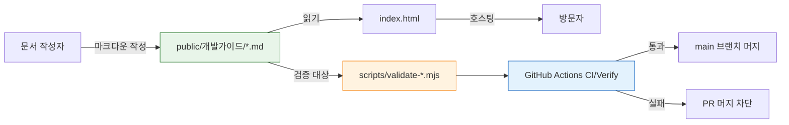
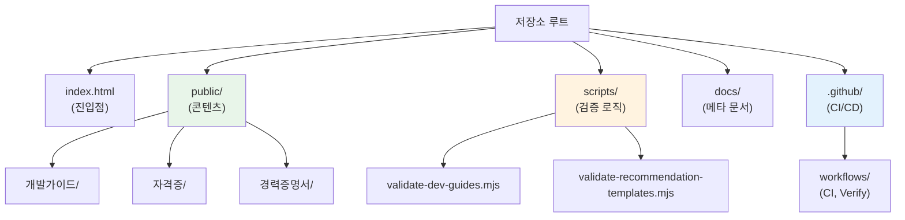
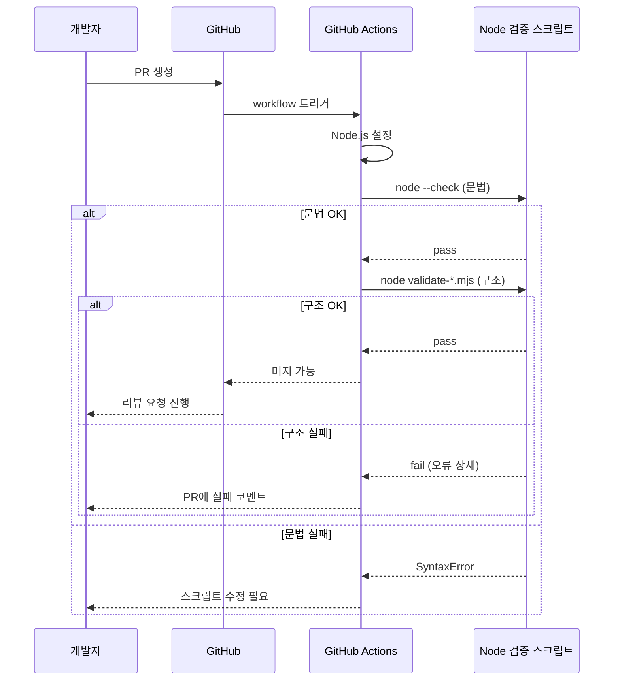
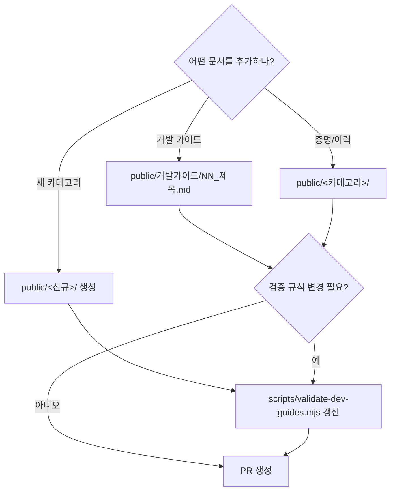

# Heejun Site Architecture

이 저장소는 정적 HTML 사이트와 개발 가이드 문서를 관리합니다. 별도 패키지 매니저 런타임 없이 Node.js 검증 스크립트로 문서 구조와 추천 항목을 점검합니다.

> 비유: **도서관**과 비슷합니다 — `public/`은 책장(콘텐츠), `scripts/`는 사서(검증), `index.html`은 입구 안내판, GitHub Actions는 야간 자동 점검 직원입니다.

## 설계 원칙

1. **정적 배포 우선** - `index.html`과 `public/` 아래 문서를 그대로 배포 가능한 형태로 유지합니다.
2. **문서 검증 자동화** - 개발 가이드와 추천 템플릿은 `scripts/`의 Node.js 검증기로 구조를 확인합니다.
3. **콘텐츠와 검증 분리** - 실제 문서는 `public/`에 두고, 검증 로직은 `scripts/`에만 둡니다.
4. **CI 표준화** - GitHub Actions의 `CI`와 `Verify` 워크플로우는 Node.js 설정 후 검증 스크립트를 실행합니다.

### 시스템 데이터 흐름



## 구조

```text
.
├── index.html
├── README.md
├── public/
│   ├── 개발가이드/
│   ├── 경력증명서/
│   ├── 연봉 협의/
│   ├── 자격증/
│   └── 졸업증명서/
└── scripts/
    ├── validate-dev-guides.mjs
    └── validate-recommendation-templates.mjs
```

### 디렉토리 책임 분리



## 품질 게이트

| 명령 | 목적 |
| --- | --- |
| `node --check scripts/validate-dev-guides.mjs` | 개발 가이드 검증기 문법 확인 |
| `node scripts/validate-dev-guides.mjs` | 개발 가이드 구조와 링크 검증 |
| `node --check scripts/validate-recommendation-templates.mjs` | 추천 템플릿 검증기 문법 확인 |
| `node scripts/validate-recommendation-templates.mjs` | 추천 템플릿 구조 검증 |

### 검증 파이프라인 흐름



## 확장 규칙

새 문서 카테고리는 `public/<category>/` 아래에 추가합니다. 문서 구조나 링크 규칙을 바꿀 때는 `scripts/validate-dev-guides.mjs`를 함께 갱신하고, 추천 템플릿 형식이 바뀌면 `scripts/validate-recommendation-templates.mjs`를 갱신합니다.

### 새 문서 추가 결정 트리


