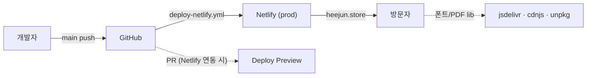

# 배포 가이드 (DEPLOYMENT)

이 문서는 `heejun` 저장소의 **전체 배포 경로**를 기술합니다. 아키텍처, 정확한
빌드/배포 명령, 필요한 환경변수와 GitHub Secrets, 프리뷰와 프로덕션의 차이,
그리고 유지보수자가 대시보드에서 **직접** 해야 하는 단계를 포함합니다.

> 이 저장소는 실제 설정 파일(`netlify.toml`, `.github/workflows/deploy-netlify.yml`)을
> 그대로 반영해 작성했습니다. 추측한 제공자나 가공의 단계는 없습니다.

---

## 1. 아키텍처 — 어떤 티어가 어디로 가는가

`heejun`은 **정적 단일 페이지 사이트**입니다. 별도의 백엔드/서버 티어가 없습니다.

| 티어           | 내용                                        | 호스팅                       |
| -------------- | ------------------------------------------- | ---------------------------- |
| Frontend(정적) | `index.html` + `public/**` (문서·증빙 자산) | **Netlify** (`heejun.store`) |
| Backend(API)   | **없음** — 서버/DB/런타임 없음              | 해당 없음                    |

- 페이지는 손으로 작성한 단일 `index.html`이며, 외부 자원은 CDN에서만 로드합니다:
  - html2pdf.js — `cdnjs.cloudflare.com`(실패 시 `unpkg.com`으로 폴백)
  - Pretendard 가변 폰트 CSS·woff2 — `cdn.jsdelivr.net`
- 동적 API 호출, 인증, 데이터베이스, 환경변수 기반 런타임 비밀이 **전혀 없습니다.**
  따라서 백엔드 Dockerfile / render.yaml / fly.toml 같은 서버 배포 산출물은
  이 저장소에 **의도적으로 두지 않습니다**(추가하면 실제 형상과 어긋남).



---

## 2. 빌드 & 배포 — 정확한 명령

### 2.1 발행 디렉터리 주의 (중요)

이 저장소에는 두 가지 "빌드"가 공존하며 **목적이 다릅니다.**

| 명령         | 출력             | 용도                                                             |
| ------------ | ---------------- | ---------------------------------------------------------------- |
| `pnpm build` | `dist/`          | **CI 스모크 체크** — Vite가 `index.html`을 파싱할 수 있는지 확인 |
| Netlify 발행 | 저장소 루트(`.`) | **실제 서빙 대상** — 원본 `index.html` + `public/`을 그대로 배포 |

> Netlify의 `publish = "."`이고 배포 워크플로의 `--dir "."`이므로, 사이트는
> `dist/`가 아니라 **저장소 루트의 원본 `index.html`**을 서빙합니다. `pnpm build`는
> 회귀 감지용 스모크 체크일 뿐이며, 발행 산출물을 만들지 않습니다.
> CSP에 nonce를 주입할 수 없는 이유도 이것입니다(원본 HTML을 손대지 않고 서빙).

### 2.2 Netlify 빌드 단계 (`netlify.toml`)

```toml
[build]
  publish = "."
  command = "node scripts/validate-dev-guides.mjs && node scripts/validate-recommendation-templates.mjs"
[build.environment]
  NODE_VERSION = "24"
```

Netlify가 사이트를 연동했다면(저장소 import) 위 `command`로 문서 검증을 돌린 뒤
루트를 발행합니다. 이 경로는 GitHub Action **없이도** Netlify Git 연동만으로 동작합니다.

### 2.3 GitHub Actions 배포 (`.github/workflows/deploy-netlify.yml`)

`main`에 콘텐츠 파일이 push되면(또는 수동 `workflow_dispatch`) 실행됩니다:

```bash
pnpm install --frozen-lockfile
node scripts/validate-dev-guides.mjs
node scripts/validate-recommendation-templates.mjs
npm i -g netlify-cli@latest
netlify deploy --auth "$NETLIFY_AUTH_TOKEN" --site "$NETLIFY_SITE_ID" \
  --prod --dir "." --message "deploy($GITHUB_SHA)"
```

**Secret 게이트:** `NETLIFY_AUTH_TOKEN` 또는 `NETLIFY_SITE_ID`가 비어 있으면
워크플로는 배포 스텝을 **모두 스킵**하고 안내 메시지만 출력합니다(빌드는 실패하지
않음). 즉 시크릿이 없으면 CI는 초록불이지만 실제 배포는 일어나지 않습니다.

### 2.4 로컬 미리보기

```bash
pnpm install
pnpm run dev        # Vite dev 서버
pnpm run verify     # 배포 전 전체 게이트(아키텍처+검증기)
```

---

## 3. 환경변수 & GitHub Secrets

런타임 비밀은 없습니다(서버가 없음). **배포에만** 다음 두 시크릿이 필요합니다.

| 이름                 | 위치               | 용도                  | 발급처                                                           |
| -------------------- | ------------------ | --------------------- | ---------------------------------------------------------------- |
| `NETLIFY_AUTH_TOKEN` | GitHub repo secret | Netlify CLI 인증      | https://app.netlify.com/user/applications#personal-access-tokens |
| `NETLIFY_SITE_ID`    | GitHub repo secret | 배포 대상 사이트 식별 | Netlify 사이트 → Site configuration → Site ID                    |

> 빌드 환경의 `NODE_VERSION=24`는 `netlify.toml`과 워크플로 양쪽에 고정돼 있습니다.

---

## 4. 프리뷰 vs 프로덕션

| 구분     | 트리거                                   | 명령/효과                                          |
| -------- | ---------------------------------------- | -------------------------------------------------- |
| 프로덕션 | `main` push(콘텐츠 경로) · 수동 dispatch | `netlify deploy --prod --dir "."` → `heejun.store` |
| 프리뷰   | PR (Netlify Git 연동을 켠 경우)          | Netlify가 PR별 Deploy Preview URL 생성             |

- 현재 GitHub Action은 **프로덕션 배포만** 수행합니다(`--prod`). PR 프리뷰는
  Netlify 대시보드에서 저장소를 연동했을 때 Netlify가 자체적으로 만들어 줍니다.
- 배포 워크플로는 `concurrency`로 `cancel-in-progress: false`라서 동시 배포가
  서로를 취소하지 않고 순차 실행됩니다(콘텐츠 유실 방지).

---

## 5. 유지보수자가 대시보드에서 직접 해야 하는 단계

CI 배포 스텝은 시크릿이 없으면 스킵되므로, 최초 1회는 수동 설정이 필요합니다.

1. **Netlify 사이트 생성/연동**: app.netlify.com → 저장소 import 또는 빈 사이트 생성.
   - 연동형이면 `netlify.toml`의 `publish="."`·`command`가 자동 적용됩니다.
2. **GitHub Secrets 등록**: 저장소 Settings → Secrets and variables → Actions →
   `NETLIFY_AUTH_TOKEN`, `NETLIFY_SITE_ID` 추가. (등록 전까지 Action 배포는 스킵)
3. **커스텀 도메인 / DNS**: Netlify에서 `heejun.store` 도메인 추가 후, 도메인
   레지스트라(가비아)에서 A 레코드를 `75.2.60.5`로, `www`는 `<site>.netlify.app`
   CNAME으로 지정. Let's Encrypt 인증서는 Netlify가 자동 발급합니다.
   - 점검: `bash scripts/check-dns-ssl.sh`
4. **검증 루틴**: `workflow_dispatch`로 배포 실행 → 최근 실행에서 `Deploy production
site` 스텝이 `skipped`가 아닌 `success`인지 확인 → `https://heejun.store` 로드 확인.

---

## 6. 보안 헤더 / CSP

배포 시 적용되는 보안 헤더는 `netlify.toml`의 `[[headers]]`에 정의됩니다. HSTS,
`X-Frame-Options: DENY`, `X-Content-Type-Options`, `Referrer-Policy`,
`Permissions-Policy`, `Cross-Origin-Opener-Policy`, 그리고 **Content-Security-Policy**가
포함됩니다.

CSP는 `index.html`이 실제로 사용하는 출처만 허용하도록 좁게 작성돼 있습니다:

- `script-src`: `'self'` + html2pdf용 `cdnjs.cloudflare.com`·`unpkg.com`.
  인라인 `'unsafe-inline'`은 JSON-LD·인라인 `<script>`·`onclick` 핸들러 때문이며,
  원본 HTML을 빌드 없이 서빙해 nonce를 주입할 수 없어 불가피합니다.
- `style-src`: `'self'` + Pretendard CSS용 `cdn.jsdelivr.net`. 인라인 `<style>`·
  `style=` 속성 때문에 `'unsafe-inline'` 포함.
- `font-src`: `cdn.jsdelivr.net`(woff2). `object-src 'none'`, `frame-ancestors 'none'`,
  `base-uri 'self'`, `form-action 'self'`, `upgrade-insecure-requests`로 추가 강화.

> **새 외부 자원(CDN, 폰트, 스크립트)을 추가할 때는 반드시 `netlify.toml`의 CSP
> directive도 함께 갱신해야 합니다.** 누락하면 브라우저가 해당 자원을 차단합니다.

배포 후 헤더 확인:

```bash
curl -sI https://heejun.store | grep -i 'content-security-policy\|strict-transport'
```
