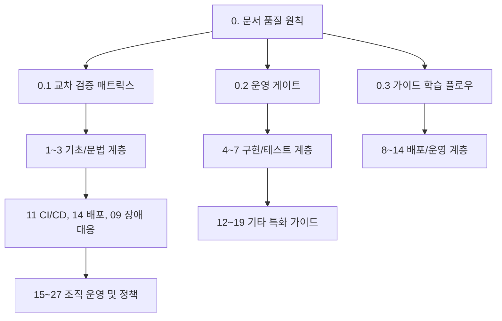
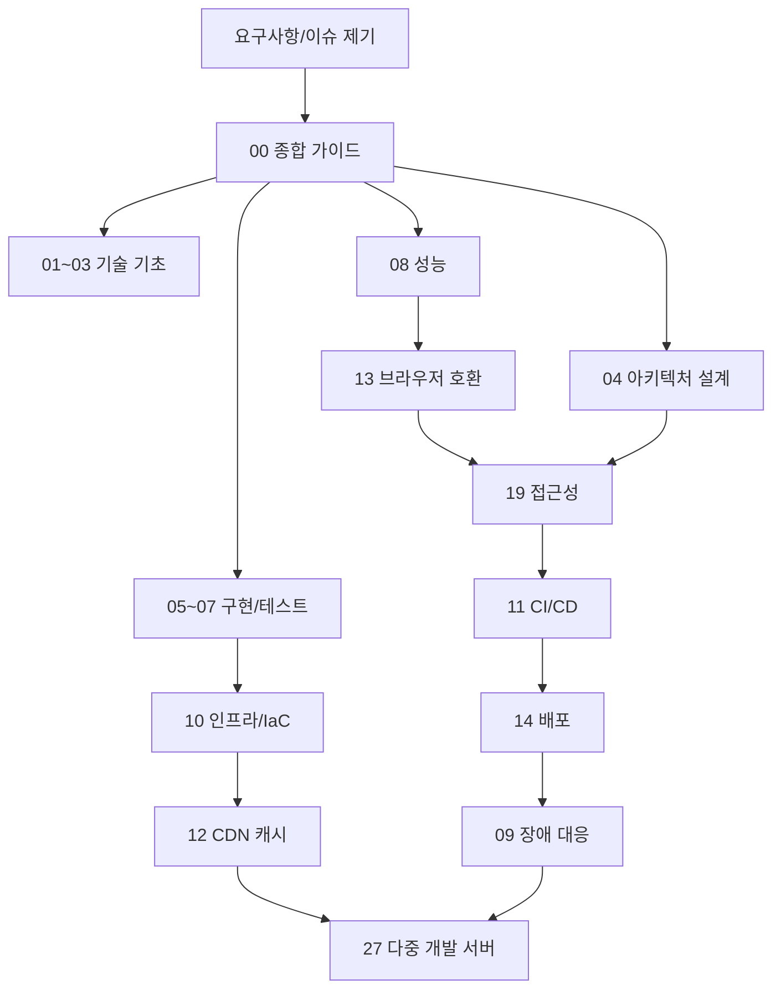
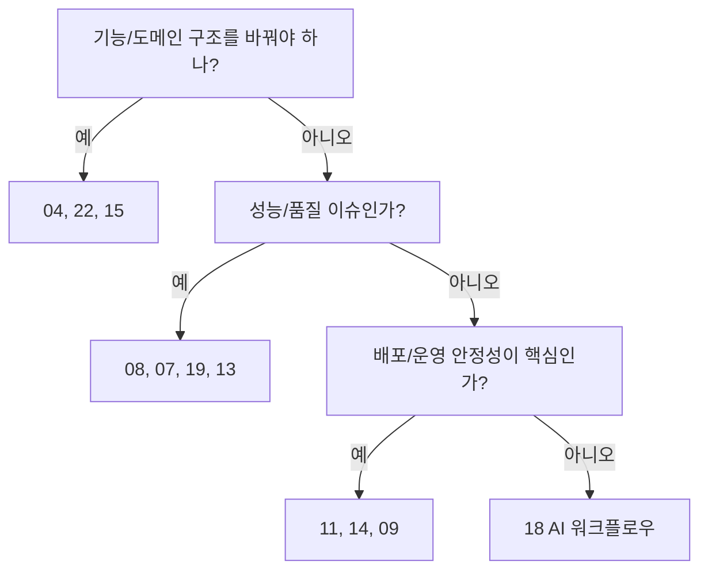

# AI-First 프론트엔드 개발 종합 가이드

> **쉽게 읽기 안내**: 이 문서는 전문 용어가 많을 수 있어요.
> 이해가 어려우면 [공통 용어사전](./00_개발가이드_용어사전.md)에서 먼저 용어 뜻을 확인하고 본문을 이어서 읽으면 이해가 훨씬 빨라집니다.
> 특히 실무에서 자주 쓰이는 `배포`, `CI/CD`, `롤백`, `스키마`처럼 동작이 중요한 용어부터 먼저 익혀보세요.
## 0. 먼저 알고 가기 (30초 요약)

- 이 문서는 모든 가이드를 읽는 `출발 지도`입니다.
- 먼저 문서 책임 범위를 확인하고 그다음 각 영역(상태/테스트/운영/보안)을 순서대로 보세요.
- 충돌 규칙은 바로 적용 가능한 기준(게이트/예외/승인자)으로 정리되어 있습니다.

## 초심자용 한눈에 보기

이 문서를 처음 볼 때는 아래 순서로 읽으면 훨씬 빨라집니다.
1. `문서 품질 원칙`에서 기준을 정하고
2. `문서 아키텍처`에서 내가 어디를 먼저 봐야 할지 선택하고
3. 마지막에 `공통 PR 완료 기준`으로 체크하세요.

### 핵심 용어 빠르게 정리

| 용어 | 쉬운 뜻 |
| --- | --- |
| `문서 책임` | 누가 어떤 기준을 정했는지, 어디를 신뢰할지 명확히 정해둔 규칙 |
| `게이트` | 다음 단계로 가기 전에 통과해야 하는 검사 |
| `레이어` | 문서를 주제별로 묶은 큰 덩어리(기술/테스트/운영 등) |
| `운영 기준` | 실제로 배포/장애/회복까지 이어지는 규칙 |
| `공통 PR 기준` | 수정 후 리뷰에서 누구나 체크해야 하는 최소 기준 |


> 00부터 27까지, 프론트엔드 개발의 설계, 구현, 검증, 배포, 운영을 하나의 실무 흐름으로 연결하는 문서 허브입니다.

---


## 추천 항목 (실무 우선순위)

- **현재팀에 먼저 적용**: 현재 팀의 문서 책임 범위와 PR 완료 기준을 기준점으로 잡아, 00-27 각 문서의 충돌 규칙을 1회 정리하세요.
- **다음으로 고정**: 01/02/03 문서를 기준으로 타입·상태·비동기 핵심 규칙을 팀 위키에 묶어서 공유하세요.
- **반복 고도화**: 월 1회 14/11/09 문서의 운영 게이트를 샘플 PR에 적용해 기준의 누락 항목을 찾아 제거하세요.


## 추천 항목 고도화 체크

- `즉시 적용` — 추천 항목 1개를 이번 주 내에 실제 작업 1건에 반영한다.
- `1주 내 정리` — 적용 결과를 PR 본문이나 회고 노트에 간단히 기록한다.
- `1개월 내 점검` — 재작업률/리뷰 충돌/배포 이슈 중 적어도 한 항목이 개선되었는지 확인한다.


## 추천 항목 실행 기록 템플릿

- `담당자` : 항목 적용 주체(문서 오너/팀원)를 명시
- `적용일` : 실제 반영된 날짜 및 작업 ID를 남김
- `측정 지표` : 리뷰 충돌/재작업/버그 재발 중 1개 이상 수치로 기록
- `보류 사유` : 적용을 못한 경우 이유를 1줄 기록하고 다음 액션을 지정

## 문서 책임 범위

| 이 문서가 결정하는 것 | 단일 출처로 따르는 문서 |
| :--- | :--- |
| 전체 문서 구조, 읽는 순서, 공통 완료 기준 | 이 문서 |
| 개별 기술의 구현 세부 기준 | 각 도메인 문서 01-27 |
| 코드 품질 판단 기준 | Frontend Fundamentals의 가독성, 예측 가능성, 응집도, 결합도 기준 |
| 구조 변경, RFC/ADR, 표준 승격/폐기 | [15. RFC 의사결정 프로세스](./15_RFC_의사결정_프로세스.md) |
| AI 사용 범위와 검증 책임 | [18. AI 개발 워크플로우](./18_AI_개발_워크플로우_종합.md) |

---

## 0. 문서 품질 원칙

이 가이드는 기술 목록이 아니라 **변경하기 쉬운 프론트엔드 코드와 운영 가능한 개발 프로세스**를 만들기 위한 기준입니다. 좋은 코드는 새 요구사항이 왔을 때 어디를 고치면 되는지 빨리 찾을 수 있고, 변경 범위와 검증 방법이 분명해야 합니다.

| 원칙 | 실무 적용 |
| :--- | :--- |
| **가독성** | 한 파일에서 한 번에 이해해야 하는 맥락을 줄입니다. 복잡한 조건, 매직 넘버, 숨은 분기를 이름 붙이고 위에서 아래로 읽히게 구성합니다. |
| **예측 가능성** | 함수명, 파라미터, 반환값만 보고 동작을 예상할 수 있게 합니다. 같은 종류의 함수는 같은 반환 타입과 에러 처리 방식을 유지합니다. |
| **응집도** | 함께 수정되는 파일은 같은 디렉토리에 둡니다. 컴포넌트, hook, API, 타입, 테스트가 같은 기능에 속하면 기능 폴더 안에 가깝게 배치합니다. |
| **낮은 결합도** | 수정 영향 범위가 작아야 합니다. 공통화가 오히려 여러 기능을 동시에 깨뜨리면 중복을 허용하고 기능별로 분리합니다. |
| **검증 가능성** | 권고는 테스트, lint, 타입 검사, 접근성 검사, 성능 지표, 배포 증거 중 하나 이상으로 확인 가능해야 합니다. |

### 0.0 문서 네비게이션 맵



### 0.1 교차 검증 매트릭스

| 권고 | 1차 출처 | 실행 증거 | 운영 증거 | 철회 조건 |
| :--- | :--- | :--- | :--- | :--- |
| 기술 버전과 표준 상태는 공식 문서를 우선한다 | React, TypeScript, W3C, OWASP, RFC, web.dev | 링크와 문서 기준 섹션 | stale guide 감소 | 공식 문서로 확인되지 않으면 preview 또는 삭제 |
| 함께 바뀌는 코드는 함께 둔다 | Frontend Fundamentals code-directory 원칙 | import boundary lint, 폴더 구조 diff | 삭제 누락, dead code 감소 | 한 폴더가 과도하게 커지면 하위 도메인으로 분리 |
| 공통 정책은 한 곳에서만 결정한다 | README, 00, 단일 출처 문서 | 로컬 링크 검사, 중복 섹션 검사 | 리뷰 중 상충 기준 감소 | 상충하면 00/15 기준으로 정리 |
| 실험 기능은 되돌릴 수 있어야 한다 | 프레임워크 release note, RFC/ADR | flag on/off test, rollback 절차 | 배포 회귀율 | rollback 경로가 없으면 production 채택 금지 |
| 검증 서버는 자동 소멸해야 한다 | Amplify PR preview, GitHub Actions deployment | preview URL, cleanup log | orphan 환경, preview 비용 | TTL/cleanup 없는 preview는 생성 차단 |

### 0.2 운영 게이트

| Gate | Evidence | Owner | Rollback |
| :--- | :--- | :--- | :--- |
| 문서 구조 변경 | 문서 인덱스, 링크 검사, 변경 범위 요약 | Documentation owner | 이전 구조로 되돌리거나 변경 범위 축소 |
| 기술 기준 갱신 | 공식 출처 링크, 영향 범위, 대체안 | Section owner | preview로 강등하거나 권고 삭제 |
| 코드 구조 권고 | 함께 수정되는 파일 목록, import boundary, 삭제 범위 | Architecture owner | 기능 폴더로 되돌리거나 shared 승격 취소 |
| 실무 예시 추가 | 실행 가능한 명령, 테스트, PR 증거 | Guide owner | 의사코드로 표시하거나 예시 제거 |

### 0.3 가이드 학습 플로우 도식

도입부에서 먼저 전체 흐름을 잡고 들어가면 각 문서를 읽는 순서가 고정됩니다.

```text
[요구사항/이슈 제기]
      │
      ▼
[00 종합 가이드]
  · 문서 품질 원칙
  · 운영 게이트
      │
      │ 1차 탐색
      ▼
 [01~03 기술 기초]
       │
       ▼
 [04 아키텍처 설계]
 [05~07 구현/테스트]
 [08 성능] ──────→ [13 브라우저 호환]
       │                │
       │                ▼
       └──→ [19 접근성] ──┐
                            │
                            ▼
 [11 CI/CD] → [14 배포] → [09 장애 대응]
       │
       ▼
 [10 인프라/IaC] → [12 CDN 캐시] → [27 다중 개발 서버]
```

```text
실무 판단의 출발점별 분기:

            +--------------------------+
            | 기능/도메인 구조를 바꿔야 하나? |
            +--------------------------+
                        │
                        ├─예→ 04, 22, 15
                        └─아니오
                                 │
                                 ▼
                    +----------------------------+
                    | 성능/품질 이슈인가?       |
                    +----------------------------+
                                 │
                                 ├─예→ 08, 07, 19, 13
                                 └─아니오
                                              │
                                              ▼
                               +---------------------+
                               | 배포/운영 안정성이 핵심인가? |
                               +---------------------+
                                              │
                                              ├─예→ 11, 14, 09
                                              └─아니오
                                                       │
                                                       ▼
                                                     18 AI 워크플로우
```





---

## 1. 먼저 정할 것

새 프로젝트나 큰 리팩터링을 시작할 때는 기술 선택보다 아래 결정을 먼저 문장으로 씁니다.

| 질문 | 결정 예시 | 관련 문서 |
| :--- | :--- | :--- |
| 어떤 기능 단위로 코드를 찾고 삭제할 수 있어야 하는가 | `checkout`, `profile`, `search` 단위로 컴포넌트/API/hook/test를 함께 둔다 | [04](./04_아키텍처_설계_패턴.md), [22](./22_모노레포_운영_가이드.md) |
| 외부 입력은 어디서 검증하는가 | API 응답, URL, localStorage, postMessage는 boundary adapter에서 schema로 검증한다 | [01](./01_TypeScript_심화_가이드.md), [05](./05_API_통신_및_모킹_가이드.md) |
| 서버 상태와 UI 상태는 어떻게 나누는가 | 서버 데이터는 query cache, 화면 조작 상태는 URL/form/local state로 분리한다 | [03](./03_상태관리_패턴_가이드.md) |
| 실패하면 사용자가 어떻게 복구하는가 | route/widget 단위 error boundary와 retry/fallback UI를 둔다 | [02](./02_React19_실무_가이드.md), [09](./09_장애_대응_및_관측성_표준.md) |
| 배포한 코드를 어떻게 되돌리는가 | build artifact와 feature flag를 분리하고 rollback artifact를 보관한다 | [11](./11_CICD_파이프라인_표준.md), [14](./14_배포_프로세스_체크리스트.md) |

---

## 2. 디렉토리 구조 원칙

파일 종류별 폴더만으로 프로젝트를 구성하면 처음에는 단순하지만, 규모가 커질수록 어떤 기능의 컴포넌트, hook, API, 타입, 테스트가 서로 연결되는지 찾기 어려워집니다. 이 가이드는 Frontend Fundamentals의 code-directory 원칙을 따라 **함께 수정되는 파일을 같은 디렉토리에 둔다**를 기본값으로 삼습니다.

### 2.1 피해야 할 구조

```text
src/
  components/
  hooks/
  utils/
  constants/
  remotes/
  contexts/
```

이 구조는 파일 종류는 잘 보이지만 변경 단위가 보이지 않습니다. `checkout` 기능을 삭제하거나 수정할 때 여러 폴더를 뒤져야 하고, 사용되지 않는 hook이나 util이 남기 쉽습니다.

### 2.2 권장 구조

```text
src/
  app/
    providers/
    routes/
  features/
    checkout/
      api/
      components/
      hooks/
      model/
      tests/
      index.ts
    profile/
      api/
      components/
      hooks/
      model/
      tests/
      index.ts
  shared/
    ui/
    lib/
    config/
```

기능 내부에서만 쓰는 코드는 기능 폴더에 둡니다. 여러 기능에서 실제로 재사용되고, 도메인 의존이 없으며, 독립 테스트가 있는 코드만 `shared`로 올립니다.

### 2.3 이동 판단표

| 상황 | 위치 |
| :--- | :--- |
| 한 기능에서만 쓰는 컴포넌트, hook, util | `features/<feature>/...` |
| 두 기능에서 같은 목적과 같은 변경 주기로 쓰는 코드 | 먼저 중복 허용, 세 번째 사용처에서 `shared` 후보 검토 |
| 디자인 시스템 primitive | `shared/ui` 또는 별도 package |
| API endpoint별 client, schema, mock | 해당 feature의 `api` 또는 `model` |
| 전역 provider, route shell, error boundary | `app` |
| 런타임 설정, feature flag, 환경 변수 schema | `shared/config` 또는 `app/config` |

---

## 3. Frontend Fundamentals 코드 품질 매트릭스

아래 17개 예시는 모든 PR에서 같은 방식으로 묻는 공통 리뷰 질문입니다. 특정 도구 규칙으로 전부 강제하기보다, 코드 배치, 이름, 반환 타입, 모킹, 주석, 컴포넌트 경계의 판단 기준으로 사용합니다.

| 기준 | 예시 | 가이드 반영 | 리뷰 질문 |
| :--- | :--- | :--- | :--- |
| 가독성 | [같이 실행되지 않는 코드 분리하기](https://frontend-fundamentals.com/code-quality/code/examples/submit-button.html) | 조건별 컴포넌트 분리, effect 격리 | 한 컴포넌트 안에서 동시에 실행되지 않는 분기가 섞여 있지 않은가 |
| 가독성 | [구현 상세 추상화하기](https://frontend-fundamentals.com/code-quality/code/examples/login-start-page.html) | guard/wrapper/HOC, 버튼 단위 추상화 | 화면의 핵심 의도보다 인증, 확인 dialog, 부수 효과가 먼저 보이지 않는가 |
| 가독성 | [로직 종류에 따라 합쳐진 함수 쪼개기](https://frontend-fundamentals.com/code-quality/code/examples/use-page-state-readability.html) | URL query hook을 필드별로 분리 | `usePageState` 같은 넓은 hook이 모든 상태를 떠안고 있지 않은가 |
| 가독성 | [복잡한 조건에 이름 붙이기](https://frontend-fundamentals.com/code-quality/code/examples/condition-name.html) | 조건식 변수, predicate 함수, 단위 테스트 | `filter/some/&&`가 중첩된 조건의 의도가 이름으로 드러나는가 |
| 가독성 | [매직 넘버에 이름 붙이기](https://frontend-fundamentals.com/code-quality/code/examples/magic-number-readability.html) | 시간, 길이, 제한값 상수화 | 숫자의 단위와 변경 이유가 이름에서 보이는가 |
| 가독성 | [시점 이동 줄이기](https://frontend-fundamentals.com/code-quality/code/examples/user-policy.html) | 단순 정책은 가까이에 펼치고 복잡 정책만 분리 | 조건을 이해하려고 여러 함수와 파일을 왕복하지 않아도 되는가 |
| 가독성 | [삼항 연산자 단순하게 하기](https://frontend-fundamentals.com/code-quality/code/examples/ternary-operator.html) | 중첩 삼항을 guard clause나 즉시 실행 함수로 풀기 | 조건의 우선순위가 눈으로 바로 읽히는가 |
| 가독성 | [왼쪽에서 오른쪽으로 읽히게 하기](https://frontend-fundamentals.com/code-quality/code/examples/comparison-order.html) | 범위 조건을 `min <= value && value <= max`로 작성 | 범위 조건이 수학적 순서처럼 읽히는가 |
| 예측 가능성 | [이름 겹치지 않게 관리하기](https://frontend-fundamentals.com/code-quality/code/examples/http.html) | wrapper 이름에 추가 동작 표시 | `http.get`처럼 보이지만 인증, 로깅, retry가 숨어 있지 않은가 |
| 예측 가능성 | [같은 종류의 함수는 반환 타입 통일하기](https://frontend-fundamentals.com/code-quality/code/examples/use-user.html) | query hook, validation 함수 반환 계약 통일 | 같은 계열 함수가 boolean, 객체, query object를 섞어 반환하지 않는가 |
| 예측 가능성 | [숨은 로직 드러내기](https://frontend-fundamentals.com/code-quality/code/examples/hidden-logic.html) | logging/analytics/sync를 호출부 또는 명시적 wrapper로 이동 | 함수명과 반환 타입으로 알 수 없는 부수 효과가 없는가 |
| 응집도 | [함께 수정되는 파일을 같은 디렉토리에 두기](https://frontend-fundamentals.com/code-quality/code/examples/code-directory.html) | feature/domain 폴더, public API, deep import 차단 | 함께 바뀌는 component/hook/API/test가 가까이 있는가 |
| 응집도 | [매직 넘버 없애기](https://frontend-fundamentals.com/code-quality/code/examples/magic-number-cohesion.html) | animation duration, retry delay, policy limit을 같은 변경 단위에 둠 | 값이 바뀔 때 관련 로직도 함께 수정되는 위치인가 |
| 응집도 | [폼의 응집도 생각하기](https://frontend-fundamentals.com/code-quality/code/examples/form-fields.html) | 필드 단위 검증과 폼 전체 schema를 상황별 선택 | 검증 변경 단위가 field인지 form인지 명확한가 |
| 결합도 | [책임을 하나씩 관리하기](https://frontend-fundamentals.com/code-quality/code/examples/use-page-state-coupling.html) | query param, form, server state hook을 책임별 분리 | 한 hook 수정이 페이지 전체 리렌더링과 테스트 범위를 넓히지 않는가 |
| 결합도 | [중복 코드 허용하기](https://frontend-fundamentals.com/code-quality/code/examples/use-bottom-sheet.html) | shared 승격 전 변경 가능성 확인 | 비슷해 보여 공통화한 코드가 페이지별 정책을 강제로 묶지 않는가 |
| 결합도 | [Props Drilling 지우기](https://frontend-fundamentals.com/code-quality/code/examples/item-edit-modal.html) | composition 우선, 필요한 경우 Context API | 중간 컴포넌트가 쓰지 않는 prop을 전달만 하고 있지 않은가 |

---

## 4. 도구 기반 품질 게이트

도구는 코드 품질 기준을 대체하지 않고, 사람이 놓치기 쉬운 반복 검증을 빠르게 실패시키는 장치입니다.

| 도구 | 적용 위치 | 운영 기준 |
| :--- | :--- | :--- |
| CodeRabbit | PR review 보조 | `.coderabbit.yaml`은 root에 두고, path instruction으로 문서/테스트/보안 경로별 리뷰 관점을 분리합니다. AI finding은 사람이 accept/reject/follow-up으로 triage합니다. |
| secretlint | pre-commit, CI, PR gate | `.secretlintrc`와 `.secretlintignore`를 저장소에 두고, secret scan 실패는 merge 차단으로 둡니다. 허용 목록은 message id와 만료 이유를 남깁니다. |
| MSW | local dev, unit/integration test, Storybook | handler, fixture, schema, contract test를 feature 가까이에 두고, Node 테스트에서는 `setupServer` lifecycle을 test setup에 고정합니다. |
| commitlint | commit-msg hook, CI | Conventional Commits를 기본으로 하되, release/changelog 자동화와 같은 downstream 소비자가 있을 때 type/scope 정책을 더 엄격히 합니다. |
| Husky | local Git hook | `pre-commit`에는 빠른 staged lint/format/secret scan만 두고, 느린 E2E/build는 CI gate로 둡니다. `HUSKY=0` 우회는 긴급 상황에서만 기록합니다. |
| 주석 룰 | ESLint, review checklist | `TODO/FIXME`는 owner 또는 issue가 있을 때만 허용하고, inline comment는 코드 의도를 가리는 경우 차단합니다. 복잡한 로직 설명보다 이름 붙이기와 함수 분리를 우선합니다. |

---

## 5. 문서 아키텍처

### Layer 1: System Map

- **[00. 종합 가이드](./00_종합_가이드_목차.md)**: 전체 구조, 읽는 순서, 공통 완료 기준.

### Layer 2: Core Engineering

- **[01. TypeScript 심화](./01_TypeScript_심화_가이드.md)**: strict mode, runtime boundary, generated type, schema.
- **[02. React 19 실무](./02_React19_실무_가이드.md)**: Actions, Server Components, Compiler, Suspense/Error Boundary.
- **[03. 상태 관리 패턴](./03_상태관리_패턴_가이드.md)**: server state, UI state, URL state, optimistic update.
- **[04. 아키텍처 설계 패턴](./04_아키텍처_설계_패턴.md)**: 기능 단위 폴더, public API, import boundary, server/client 경계.
- **[05. API 통신 및 모킹](./05_API_통신_및_모킹_가이드.md)**: contract-first, codegen, MSW, error model.
- **[06. 웹 보안 심화](./06_웹_보안_심화_가이드.md)**: authentication, CSP, Trusted Types, supply chain.

### Layer 3: Quality Gates

- **[07. 테스팅](./07_테스팅_가이드.md)**: unit, integration, E2E, visual regression, mutation testing.
- **[08. 성능 최적화](./08_성능_최적화_가이드.md)**: Core Web Vitals, bundle budget, RUM, attribution.
- **[13. 브라우저 호환성](./13_브라우저_호환성_가이드.md)**: Baseline, feature detection, polyfill, cross-browser smoke.
- **[19. 웹 접근성](./19_웹_접근성_가이드.md)**: WCAG, ARIA, keyboard, screen reader, release evidence.

### Layer 4: Delivery & Operations

- **[09. 장애 대응 및 관측성](./09_장애_대응_및_관측성_표준.md)**: error tracking, RUM, trace, severity, postmortem.
- **[10. 인프라 및 IaC](./10_인프라_IaC_가이드.md)**: IaC, preview, workload identity, drift, cost.
- **[11. CI/CD 파이프라인](./11_CICD_파이프라인_표준.md)**: deterministic install, quality gate, artifact, attestation.
- **[12. CDN 캐시 전략](./12_CDN_캐시_전략.md)**: cache-control, immutable assets, invalidation, security headers.
- **[14. 배포 프로세스](./14_배포_프로세스_체크리스트.md)**: deploy/release 분리, canary, rollback, monitoring.
- **[22. 모노레포 운영](./22_모노레포_운영_가이드.md)**: package boundary, ownership, task graph, cache, release.
- **[27. 다중 개발 서버 구축](./27_다중_개발_서버_구축_가이드.md)**: PR preview, branch deploy, Amplify, S3 artifact, GitHub Actions, cleanup.

### Layer 5: Governance & AI

- **[15. RFC 의사결정](./15_RFC_의사결정_프로세스.md)**: RFC, ADR, PoC, risk, exit criteria.
- **[16. AI 협업 코드리뷰](./16_AI_협업_코드리뷰_가이드.md)**: PR size, review evidence, AI finding triage.
- **[17. 신규 입사자 온보딩](./17_신규_입사자_온보딩_가이드.md)**: dev setup, permission, first PR, mentoring.
- **[18. AI 개발 워크플로우](./18_AI_개발_워크플로우_종합.md)**: task boundary, context policy, verification.

### Layer 6: Product Architecture & Experience

- **[20. 디자인 시스템](./20_디자인_시스템_가이드.md)**: token, component API, primitive, migration.
- **[21. 마이크로 프론트엔드](./21_마이크로_프론트엔드_가이드.md)**: host/remote contract, shared dependency, independent deploy.
- **[23. 국제화](./23_국제화_가이드.md)**: ICU message, placeholder, RTL, pseudo-localization.
- **[24. SEO 및 메타데이터](./24_SEO_메타데이터_가이드.md)**: metadata, structured data, sitemap, indexing.
- **[25. 웹 애니메이션 모션](./25_웹_애니메이션_모션_가이드.md)**: motion budget, View Transitions, reduced motion.
- **[26. PWA 오프라인 전략](./26_PWA_오프라인_전략_가이드.md)**: service worker, offline cache, sync, push, fallback.

---

## 6. 추천 학습 경로

| 목표 | 읽는 순서 | 완료 기준 |
| :--- | :--- | :--- |
| 신규 프로젝트 표준 수립 | 00 -> 01 -> 02 -> 04 -> 05 -> 07 -> 11 -> 14 | 폴더 구조, tsconfig, API contract, 테스트 명령, 배포 artifact가 정해짐 |
| 기존 프로젝트 품질 개선 | 04 -> 07 -> 08 -> 13 -> 19 -> 20 | 핵심 flow 테스트, 성능 예산, 접근성 smoke, shared/component 경계가 생김 |
| 배포/운영 안정화 | 09 -> 10 -> 11 -> 12 -> 14 | release health, rollback, cache purge, incident runbook이 준비됨 |
| 다중 개발 서버 구축 | 27 -> 10 -> 11 -> 12 -> 14 | PR preview URL, OIDC role, artifact registry, smoke test, cleanup이 준비됨 |
| AI 협업 도입 | 16 -> 18 -> 07 -> 15 | AI가 맡을 작업과 사람이 승인할 작업, 검증 명령이 분리됨 |
| 글로벌 제품 준비 | 19 -> 20 -> 23 -> 24 -> 26 | locale, metadata, offline, keyboard/screen reader 증거가 함께 준비됨 |

---

## 7. 공통 PR 완료 기준

| 변경 유형 | PR에 남길 증거 |
| :--- | :--- |
| 타입/계약 | `tsc --noEmit`, schema test, generated diff |
| React/UI | 핵심 상태 캡처, loading/error/empty 처리, interaction test |
| 상태 관리 | cache invalidation, optimistic rollback, URL state 동작 |
| API | contract diff, MSW handler, 실패 응답 테스트 |
| 아키텍처 | 함께 수정되는 파일 목록, import boundary, 삭제 범위 |
| 성능 | bundle diff, Core Web Vitals 또는 trace |
| 접근성 | keyboard smoke, axe, focus order, screen reader 메모 |
| 보안 | secret scan, dependency audit, CSP/header 영향 |
| 배포 | build artifact, rollback 방법, post-deploy monitor |

---

## 8. 공식 출처 기준

| 주제 | 기준 문서 |
| :--- | :--- |
| React 19.2 | [React 19.2 release](https://react.dev/blog/2025/10/01/react-19-2) |
| React Compiler | [React Compiler v1.0](https://react.dev/blog/2025/10/07/react-compiler-1) |
| React RSC 보안 | [React Server Components security advisory](https://react.dev/blog/2025/12/11/denial-of-service-and-source-code-exposure-in-react-server-components) |
| React ViewTransition | [React ViewTransition canary reference](https://react.dev/reference/react/ViewTransition) |
| TypeScript 6.0 | [Announcing TypeScript 6.0](https://devblogs.microsoft.com/typescript/announcing-typescript-6-0/) |
| TypeScript 7.0 Beta | [Announcing TypeScript 7.0 Beta](https://devblogs.microsoft.com/typescript/announcing-typescript-7-0-beta/) |
| TypeScript 5.9 | [Announcing TypeScript 5.9](https://devblogs.microsoft.com/typescript/announcing-typescript-5-9/) |
| Zod 4 | [Zod 4 release notes](https://zod.dev/v4) |
| Standard Schema | [Standard Schema](https://standardschema.dev/) |
| Next.js 16 | [Next.js 16 release](https://nextjs.org/blog/next-16) |
| Vite 8 | [Vite 8 release](https://vite.dev/blog/announcing-vite8) |
| Tailwind CSS v4 | [Tailwind CSS v4.0](https://tailwindcss.com/blog/tailwindcss-v4) |
| Vitest 4 | [Vitest 4.0 release](https://vitest.dev/blog/vitest-4) |
| Playwright release notes | [Playwright release notes](https://playwright.dev/docs/release-notes) |
| Playwright Test Agents | [Playwright Test Agents](https://playwright.dev/docs/test-agents) |
| Storybook 9 | [Storybook 9](https://storybook.js.org/blog/storybook-9/) |
| Core Web Vitals | [Core Web Vitals official thresholds](https://developers.google.com/search/docs/appearance/core-web-vitals) |
| INP | [Interaction to Next Paint](https://web.dev/inp/) |
| Web Vitals field debugging | [Find slow interactions in the field](https://web.dev/articles/find-slow-interactions-in-the-field) |
| OWASP Top 10 | [OWASP Top 10:2025](https://owasp.org/Top10/2025/0x00_2025-Introduction/) |
| OAuth Security BCP | [RFC 9700 OAuth 2.0 Security BCP](https://www.rfc-editor.org/rfc/rfc9700) |
| NIST SSDF | [NIST SSDF SP 800-218](https://csrc.nist.gov/pubs/sp/800/218/final) |
| WCAG 2.2 | [WCAG 2.2 ISO/IEC 40500:2025](https://www.w3.org/press-releases/2025/wcag22-iso-pas/) |
| WAI-ARIA 1.3 | [WAI-ARIA 1.3 Working Draft](https://www.w3.org/TR/wai-aria-1.3/) |
| ADA Title II | [DOJ ADA Title II web accessibility rule](https://www.ada.gov/resources/2024-03-08-web-rule/) |
| Web Platform Baseline | [web.dev Baseline](https://web.dev/baseline) |
| OpenTelemetry JavaScript | [OpenTelemetry JavaScript status](https://opentelemetry.io/docs/languages/js/) |
| SLSA | [SLSA specification](https://slsa.dev/spec/) |
| Artifact attestations | [GitHub artifact attestations](https://docs.github.com/en/actions/how-tos/secure-your-work/use-artifact-attestations/use-artifact-attestations) |
| CI OIDC | [GitHub Actions OIDC](https://docs.github.com/en/actions/concepts/security/openid-connect) |
| Multi-environment | [AWS Amplify web previews for pull requests](https://docs.aws.amazon.com/amplify/latest/userguide/pr-previews.html) |
| Multi-environment | [AWS Amplify pattern-based feature branch deployments](https://docs.aws.amazon.com/amplify/latest/userguide/pattern-based-feature-branch-deployments.html) |
| Multi-environment | [AWS Amplify manual deployments](https://docs.aws.amazon.com/amplify/latest/userguide/manual-deploys.html) |
| Multi-environment | [AWS CLI amplify start-deployment](https://docs.aws.amazon.com/cli/latest/reference/amplify/start-deployment.html) |
| Multi-environment | [AWS Amplify environment variables](https://docs.aws.amazon.com/amplify/latest/userguide/environment-variables.html) |
| Next.js hosting | [AWS Amplify deploying Next.js SSR applications](https://docs.aws.amazon.com/amplify/latest/userguide/deploy-nextjs-app.html) |
| Next.js hosting | [AWS Amplify support for Next.js](https://docs.aws.amazon.com/amplify/latest/userguide/ssr-amplify-support.html) |
| Next.js hosting | [Next.js static export guide](https://nextjs.org/docs/14/app/building-your-application/deploying/static-exports) |
| GitHub Actions | [GitHub Actions deployments](https://docs.github.com/en/actions/how-tos/deploy/configure-and-manage-deployments/control-deployments) |
| GitHub Actions | [GitHub Actions OIDC in AWS](https://docs.github.com/en/actions/how-tos/secure-your-work/security-harden-deployments/oidc-in-aws) |
| AWS OIDC | [aws-actions configure-aws-credentials](https://github.com/aws-actions/configure-aws-credentials) |
| Static hosting | [AWS CLI s3 sync](https://docs.aws.amazon.com/cli/latest/reference/s3/sync.html) |
| Static hosting | [CloudFront invalidation paths](https://docs.aws.amazon.com/AmazonCloudFront/latest/DeveloperGuide/invalidation-specifying-objects.html) |
| Static hosting | [S3 and CloudFront cache-control](https://docs.aws.amazon.com/whitepapers/latest/build-static-websites-aws/controlling-how-long-amazon-s3-content-is-cached-by-amazon-cloudfront.html) |
| Static hosting | [S3 static website hosting](https://docs.aws.amazon.com/AmazonS3/latest/userguide/WebsiteHosting.html) |
| Static hosting | [AWS Amplify Hosting from S3 announcement](https://aws.amazon.com/blogs/aws/simplify-and-enhance-amazon-s3-static-website-hosting-with-aws-amplify/) |
| Frontend Fundamentals | [같이 실행되지 않는 코드 분리하기](https://frontend-fundamentals.com/code-quality/code/examples/submit-button.html) |
| Frontend Fundamentals | [구현 상세 추상화하기](https://frontend-fundamentals.com/code-quality/code/examples/login-start-page.html) |
| Frontend Fundamentals | [로직 종류에 따라 합쳐진 함수 쪼개기](https://frontend-fundamentals.com/code-quality/code/examples/use-page-state-readability.html) |
| Frontend Fundamentals | [복잡한 조건에 이름 붙이기](https://frontend-fundamentals.com/code-quality/code/examples/condition-name.html) |
| Frontend Fundamentals | [매직 넘버에 이름 붙이기](https://frontend-fundamentals.com/code-quality/code/examples/magic-number-readability.html) |
| Frontend Fundamentals | [시점 이동 줄이기](https://frontend-fundamentals.com/code-quality/code/examples/user-policy.html) |
| Frontend Fundamentals | [삼항 연산자 단순하게 하기](https://frontend-fundamentals.com/code-quality/code/examples/ternary-operator.html) |
| Frontend Fundamentals | [왼쪽에서 오른쪽으로 읽히게 하기](https://frontend-fundamentals.com/code-quality/code/examples/comparison-order.html) |
| Frontend Fundamentals | [이름 겹치지 않게 관리하기](https://frontend-fundamentals.com/code-quality/code/examples/http.html) |
| Frontend Fundamentals | [같은 종류의 함수는 반환 타입 통일하기](https://frontend-fundamentals.com/code-quality/code/examples/use-user.html) |
| Frontend Fundamentals | [숨은 로직 드러내기](https://frontend-fundamentals.com/code-quality/code/examples/hidden-logic.html) |
| Frontend Fundamentals | [함께 수정되는 파일을 같은 디렉토리에 두기](https://frontend-fundamentals.com/code-quality/code/examples/code-directory.html) |
| Frontend Fundamentals | [매직 넘버 없애기](https://frontend-fundamentals.com/code-quality/code/examples/magic-number-cohesion.html) |
| Frontend Fundamentals | [폼의 응집도 생각하기](https://frontend-fundamentals.com/code-quality/code/examples/form-fields.html) |
| Frontend Fundamentals | [책임을 하나씩 관리하기](https://frontend-fundamentals.com/code-quality/code/examples/use-page-state-coupling.html) |
| Frontend Fundamentals | [중복 코드 허용하기](https://frontend-fundamentals.com/code-quality/code/examples/use-bottom-sheet.html) |
| Frontend Fundamentals | [Props Drilling 지우기](https://frontend-fundamentals.com/code-quality/code/examples/item-edit-modal.html) |
| CodeRabbit | [YAML configuration](https://docs.coderabbit.ai/getting-started/yaml-configuration) |
| CodeRabbit | [Path-based review instructions](https://docs.coderabbit.ai/configuration/path-instructions) |
| CodeRabbit | [Third-party tools overview](https://docs.coderabbit.ai/tools) |
| Secret scan | [secretlint](https://github.com/secretlint/secretlint) |
| Mocking | [MSW Node.js integration](https://mswjs.io/docs/integrations/node) |
| Commit policy | [commitlint getting started](https://commitlint.js.org/guides/getting-started.html) |
| Commit policy | [commitlint configuration](https://commitlint.js.org/reference/configuration.html) |
| Git hooks | [Husky get started](https://typicode.github.io/husky/get-started.html) |
| Comment rules | [ESLint no-warning-comments](https://eslint.org/docs/latest/rules/no-warning-comments) |
| Comment rules | [ESLint no-inline-comments](https://eslint.org/docs/latest/rules/no-inline-comments) |

---

## 실무 적용 가이드

### 언제 이 문서를 펼칠까

- 새 프로젝트의 기본 구조를 정할 때
- 기능 폴더, shared 폴더, package 경계를 어디에 둘지 논쟁이 생겼을 때
- 문서가 너무 추상적이라 실제 PR 완료 기준이 필요할 때
- 기존 가이드에서 오래된 연도 중심 문구를 걷어내고 최신 공식 기준으로 다시 맞출 때

### 적용 순서

1. 기능을 기준으로 디렉토리를 먼저 나눕니다.
2. 각 기능 안에 컴포넌트, hook, API, 타입, 테스트를 함께 둡니다.
3. 실제로 여러 기능에서 같은 목적으로 반복될 때만 `shared`로 승격합니다.
4. 승격된 코드는 public API, 테스트, 접근성/성능 영향 범위를 함께 적습니다.
5. PR에는 변경한 기능 폴더, 검증 명령, 되돌리는 방법을 남깁니다.

### 함께 두는 파일

- feature의 API client, schema, hook, component, test는 같은 변경 단위로 둡니다.
- route 전용 loading/error/empty UI는 route 또는 feature 가까이에 둡니다.
- 여러 기능에서 재사용되는 코드는 테스트와 public API가 준비된 뒤에만 `shared`로 올립니다.

```text
features/search/
  api/searchClient.ts
  api/searchClient.test.ts
  components/SearchResultList.tsx
  hooks/useSearchQuery.ts
  model/searchSchema.ts
  tests/search.e2e.ts
  index.ts
```

같은 기능을 수정할 때 함께 열어야 하는 파일은 같은 디렉토리에 둡니다. 반대로 한 파일을 고칠 때 여러 기능이 동시에 깨진다면, 공통화가 너무 이른 신호일 수 있습니다.

### 흔한 실수

- 파일 종류별 폴더만 두고 기능별 소유권을 표시하지 않음
- 한 번 재사용됐다는 이유로 바로 `shared`로 올림
- 테스트와 mock을 기능 폴더 밖에 둬서 삭제 시 누락됨
- `shared/ui`에 도메인 용어, API 호출, feature flag가 섞임
- import 경계를 문서에만 쓰고 lint나 graph 검사로 막지 않음

### PR 완료 기준

- [ ] 새 파일이 기능 단위로 모여 있거나, `shared` 승격 이유가 적혀 있다.
- [ ] 삭제할 때 함께 지워야 할 파일 범위가 명확하다.
- [ ] 다른 도메인 deep import가 없다.
- [ ] 테스트, mock, schema, story가 기능과 같은 변경 단위에 있다.
- [ ] 검증 명령과 실패 시 되돌리는 방법이 PR에 남아 있다.

## 추천 항목 실행 우선순위 매핑

- `P1(7일 내)` — 추천 항목 1개를 우선 적용하고 1회 사용자 관측 신호(에러율/실패율/지연)와 연결한다.
- `P2(30일 내)` — 추천 항목 1개를 팀 내 표준/템플릿에 반영해 재사용성을 확보한다.
- `P3(90일 내)` — 추천 항목 1개를 다른 관련 문서에 역링크로 연동해 중복 작업을 줄인다.
- `완료 기준` — 각 항목별 산출물(예: PR 링크/체크리스트/회고 노트)을 1개 이상 남긴다.
