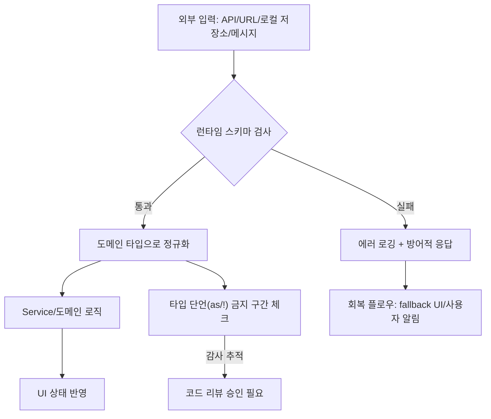

# 01. TypeScript 심화 가이드

| 분류 | 핵심 기술 | 상태 | Stable |
| :--- | :--- | :--- | :--- |
| **연관 가이드** | [05. API 통신](./05_API_통신_및_모킹_가이드.md), [02. React 19](./02_React19_실무_가이드.md), [07. 테스팅](./07_테스팅_가이드.md) | **도구 원칙** | 벤더 중립 |
| **핵심 테마** | Type Branding, Zod 4 Validation, Standard Schema, Discriminated Unions, Type Guard, Generics | **Update** | 최신 기준 |

> **본 가이드는 현재 공식 문서 기준 TypeScript 6.0 안정판을 기본선으로 둡니다.** TypeScript 5.8/5.9의 `--erasableSyntaxOnly`, `--module node20`, `import defer`는 지원 런타임과 번들러가 확인된 경우에만 opt-in합니다. TypeScript 7.0 Beta는 Go 기반 native toolchain 전환 후보로, 기존 `tsc`와 side-by-side로 검증한 뒤 채택합니다.

---

> **"타입은 단순한 주석이 아니라, 런타임의 안전성을 보장하는 살아있는 명세서다."**
> 본 가이드는 단순한 문법을 넘어, 대규모 프로젝트에서 타입 시스템을 설계하는 고도화된 전략을 다룹니다.
> 각 섹션은 **왜 필요한지**, **어떻게 사용하는지**, **흔한 실수는 무엇인지**를 중심으로 구성되어 있습니다.

---

## 문서 책임 범위

| 이 문서가 결정하는 것 | 단일 출처로 따르는 문서 |
| :--- | :--- |
| TypeScript strictness, branded type, type guard, runtime boundary typing | [05. API 통신](./05_API_통신_및_모킹_가이드.md), [06. 보안](./06_웹_보안_심화_가이드.md) |
| 생성 타입, contract type, schema inference 정책 | [05. API 통신](./05_API_통신_및_모킹_가이드.md) |
| 타입 테스트와 CI 품질 게이트 | [07. 테스팅](./07_테스팅_가이드.md), [11. CI/CD](./11_CICD_파이프라인_표준.md) |
| AI가 제안한 타입 리팩터의 검증 책임 | [18. AI 개발 워크플로우](./18_AI_개발_워크플로우_종합.md) |

---

## 0. 모든 프론트엔드 그룹 공통 Baseline

TypeScript 표준은 팀 규모와 도메인에 상관없이 **런타임 경계의 안전성**을 보장하는 데 초점을 둡니다.

| 기준 | 최소 적용 |
| :--- | :--- |
| **Strict Mode** | `strict: true`, `noUncheckedIndexedAccess`, `exactOptionalPropertyTypes`를 신규 패키지 기본값으로 둡니다. |
| **런타임 입력 검증** | API 응답, URL 파라미터, localStorage, feature flag, postMessage payload는 타입 단언이 아니라 스키마로 검증합니다. |
| **타입 단언 제한** | `as`, non-null assertion(`!`), `any`는 boundary adapter 또는 legacy migration 파일로 격리하고 PR에서 근거를 요구합니다. |
| **공유 타입 출처** | 백엔드 계약은 OpenAPI/GraphQL/protobuf 등 계약 파일에서 생성하고, 수동 복제 타입을 금지합니다. |
| **도메인 ID 구분** | UserId, OrderId처럼 구조가 같은 식별자는 branded type으로 섞임을 방지합니다. |
| **타입 테스트** | 공용 유틸/SDK/디자인 시스템 타입은 `tsd`, `expectTypeOf`, `vitest` type test 중 하나로 회귀를 막습니다. |

### 0.0 타입 가드/경계 흐름



### 0.1 교차 검증 매트릭스

| 권고 | 1차 출처 | 실행 증거 | 운영 증거 | 철회 조건 |
| :--- | :--- | :--- | :--- | :--- |
| `strict` + 경계 검증 | TypeScript 공식 릴리스와 tsconfig 문서 | `tsc --noEmit`, runtime schema test | API validation failure rate | legacy package는 migration ADR과 만료일 필요 |
| 생성 타입 우선 | OpenAPI/GraphQL/protobuf 스펙 | contract test, generated diff review | API mismatch incident 감소 | codegen 실패 시 수동 타입 임시 허용 후 제거 |
| `any/as` 통제 | TypeScript 타입 시스템 한계 명시 | lint rule, type test | runtime type error 추적 | migration boundary 외 사용 금지 |

### 0.2 운영 게이트

| Gate | Evidence | Owner | Rollback |
| :--- | :--- | :--- | :--- |
| Strict type gate | `tsc --noEmit`, strict tsconfig diff | Package owner | migration ADR로 예외 범위와 만료일 설정 |
| Runtime boundary gate | schema test, invalid payload fixture | API/FE owner | schema enforcement를 warning mode로 낮추고 incident backlog 생성 |
| Type generation gate | generated diff, contract test | API contract owner | 이전 generated artifact pinning |
| Unsafe escape hatch gate | `any/as/!` lint report, PR rationale | Tech lead | escape hatch를 adapter 파일로 격리 |

### 0.3 TypeScript 6/7 전환 계약

TypeScript 버전 정책은 "새 기능을 빠르게 쓰기"보다 **타입 안정성, 빌드 재현성, 런타임 호환성**을 우선합니다. 신규 패키지는 TypeScript 6.0 안정판을 기준으로 하고, TypeScript 7.0 Beta는 성능과 호환성 증거가 필요한 실험 채널로 분리합니다.

| 구분 | 채택 기준 | 검증 증거 |
| :--- | :--- | :--- |
| **TypeScript 6.0 stable** | 신규 패키지 기본선. `strict`를 켜고, `types`는 필요한 전역 타입만 명시합니다. `target/lib`는 evergreen 브라우저와 Node 지원 정책에 맞춰 `es2025` 이상을 우선 검토합니다. | `tsc --noEmit`, `tsc --showConfig`, DOM/Node type smoke test |
| **6.0 마이그레이션 정리** | `target: es5`, `downlevelIteration`, `moduleResolution: node/node10/classic`, `module: amd/umd/systemjs/none`, `baseUrl` 의존을 제거합니다. | deprecation diff, tsconfig migration PR, build artifact 비교 |
| **Module resolution** | 번들러 기반 웹 앱은 `moduleResolution: bundler` + `module: preserve`/`esnext`를 우선합니다. Node 런타임 패키지는 `node20` 또는 `nodenext` 중 배포 런타임과 맞는 옵션만 사용합니다. | runtime smoke, package exports/imports test, ESM/CJS interop test |
| **`--erasableSyntaxOnly`** | Node의 type stripping 또는 타입 전용 소스 실행을 목표로 하는 패키지에서만 사용합니다. enum, runtime namespace, parameter property, `import =` 패턴은 신규 코드에서 금지합니다. | `tsc --erasableSyntaxOnly --noEmit`, lint rule, migration ADR |
| **`import defer`** | `preserve`/`esnext` 모듈 출력과 런타임/번들러 지원이 모두 확인된 경우에만 사용합니다. 성능 최적화 목적이면 dynamic import, route split, prefetch와 비교합니다. | bundle output diff, browser/runtime smoke, startup metric |
| **TypeScript 7.0 Beta** | 대형 코드베이스의 빌드/에디터 성능 검증용으로 `@typescript/native-preview@beta`와 `tsgo`를 기존 `tsc` 옆에서 실행합니다. 안정 API가 필요한 도구는 6.x에 남깁니다. | `tsc` vs `tsgo` diagnostics diff, build time p50/p95, editor smoke |

#### 전환 원칙

- **Stable first**: 제품 빌드와 릴리스 게이트는 안정판 TypeScript를 기준으로 합니다.
- **Beta as shadow CI**: TypeScript 7.0 Beta는 빠른 피드백을 위해 nightly/optional CI에 연결하되, 실패가 제품 배포를 막는 게이트가 되려면 RFC와 롤백 기준이 필요합니다.
- **No silent config drift**: `tsconfig.base.json`, 패키지별 override, generated type 설정은 변경 시 diff와 근거를 PR에 남깁니다.
- **Runtime boundary first**: TypeScript 버전을 올려도 외부 입력은 여전히 `unknown`에서 시작하고 Standard Schema 호환 스키마로 검증합니다.

---


## 1. 런타임 안전성: Zod 4 기반의 스키마 검증

### 왜 중요한가

TypeScript의 타입은 **컴파일 타임에만 존재**합니다. 빌드가 완료된 JavaScript에는 타입 정보가 전혀 남아 있지 않습니다. 이 말은 외부 API, localStorage, URL 파라미터, 사용자 입력 등 **런타임에 들어오는 모든 데이터**에 대해 TypeScript가 아무런 보호도 제공하지 못한다는 뜻입니다.

`as` 키워드로 타입을 강제 캐스팅하면 컴파일러는 만족하지만, 실제 데이터 구조가 다를 경우 런타임에서 예측 불가능한 오류가 발생합니다. Zod는 **스키마 정의 한 번으로 런타임 검증과 타입 추론을 동시에** 해결해주는 라이브러리입니다.

### Zod 4 (2025년 GA) 주요 변경점

- **성능 개선**: 파싱 속도가 v3 대비 약 3~4배 향상되고, 컴파일 타임 타입 인스턴스화도 빨라졌습니다.
- **트리쉐이킹 가능한 `zod/v4-mini`**: 함수형 API 방식의 별도 엔트리포인트로, 번들 크기에 민감한 환경에서 사용합니다.
- **Standard Schema 인터페이스 구현**: Zod 4부터 `~standard` 프로퍼티를 통해 `Standard Schema v1` 스펙을 만족하므로, TanStack Form, Next.js Server Actions 등 Standard Schema 기반 라이브러리와 어댑터 없이 호환됩니다.
- **`z.discriminatedUnion`/`z.object` API 정비**: 에러 트리(`error.issues`), `prettifyError` 헬퍼 등 디버깅 친화 기능이 추가됐습니다.

### 1.1 유효성 검증 및 타입 추론

```typescript
import { z } from "zod";

// 1. 스키마 정의 (런타임 검증용)
// Zod 스키마가 곧 "진짜 타입"의 역할을 합니다.
const UserSchema = z.object({
  id: z.string().uuid(),                    // UUID 형식 강제
  email: z.string().email(),                // 이메일 형식 검증
  age: z.number().min(18).max(120),         // 범위 제한으로 논리적 오류 방지
  role: z.enum(["admin", "user", "guest"]), // 허용된 값만 통과
  createdAt: z.string().datetime(),         // ISO 8601 날짜 형식 검증
});

// 2. 타입 추출 (컴파일 타임용)
// 스키마에서 타입을 자동 추론하므로 타입과 검증 로직이 항상 동기화됩니다.
type User = z.infer<typeof UserSchema>;

// 3. API 응답을 안전하게 처리하는 함수
async function fetchUser(id: string): Promise<User> {
  const response = await fetch(`/api/user/${id}`).then((res) => res.json());

  // safeParse()는 에러를 던지지 않고 결과 객체를 반환합니다.
  // parse()는 유효하지 않으면 ZodError를 던집니다.
  const result = UserSchema.safeParse(response);

  if (!result.success) {
    // 어떤 필드가 어떻게 잘못되었는지 상세하게 로깅
    console.error("API 스펙 불일치:", result.error.format());
    throw new Error("Invalid User Data");
  }

  // result.data는 이미 User 타입으로 추론됩니다.
  return result.data;
}
```

### 1.2 Bad Practice vs Good Practice

```typescript
// ❌ Bad: as 키워드로 타입 강제 캐스팅
// API 응답이 실제로 User 구조가 아니어도 컴파일러가 통과시킴
async function fetchUserBad(id: string): Promise<User> {
  const response = await fetch(`/api/user/${id}`).then((res) => res.json());
  return response as User; // 위험! 런타임에서 아무런 검증도 하지 않음
}

// ✅ Good: Zod를 사용한 런타임 검증
// 데이터 구조가 다르면 즉시 에러를 감지할 수 있음
async function fetchUserGood(id: string): Promise<User> {
  const response = await fetch(`/api/user/${id}`).then((res) => res.json());
  return UserSchema.parse(response); // 유효하지 않으면 명확한 에러 발생
}
```

### 1.3 Zod 스키마 조합과 변환

```typescript
// 기존 스키마를 확장하여 새로운 스키마를 만들 수 있습니다.
const CreateUserSchema = UserSchema.omit({ id: true, createdAt: true });
type CreateUserInput = z.infer<typeof CreateUserSchema>;

// 부분 업데이트를 위한 Partial 스키마
const UpdateUserSchema = UserSchema.partial().omit({ id: true });
type UpdateUserInput = z.infer<typeof UpdateUserSchema>;

// transform()으로 데이터 변환과 검증을 동시에 수행
const DateStringSchema = z.string().transform((val) => new Date(val));

// 기본값 설정
const PaginationSchema = z.object({
  page: z.number().min(1).default(1),        // 기본값 1
  limit: z.number().min(1).max(100).default(20), // 기본값 20
});
```

### 1.4 Standard Schema: 라이브러리 종속성 분리

`Standard Schema`는 Zod, Valibot, ArkType의 메인테이너들이 함께 만든 **60줄짜리 TypeScript 인터페이스 스펙**입니다. 검증 라이브러리가 아니라 "각 라이브러리가 공통으로 노출하는 형태"의 명세입니다. TanStack Form, Next.js Server Actions, tRPC 등은 이미 Standard Schema를 채택하여 사용자가 원하는 검증 라이브러리를 자유롭게 골라 쓸 수 있습니다.

```typescript
// 라이브러리에 종속되지 않는 유틸리티 작성 가능
import type { StandardSchemaV1 } from "@standard-schema/spec";

// Zod, Valibot, ArkType 어느 것이든 받을 수 있는 검증 헬퍼
async function safeValidate<T extends StandardSchemaV1>(
  schema: T,
  input: unknown,
): Promise<StandardSchemaV1.InferOutput<T>> {
  let result = schema["~standard"].validate(input);
  if (result instanceof Promise) result = await result;
  if (result.issues) {
    throw new Error(result.issues.map((i) => i.message).join("\n"));
  }
  return result.value;
}

// 이제 Zod든 Valibot이든 동일한 함수로 검증 가능
const zodUser = await safeValidate(UserSchema, input);
// const valibotUser = await safeValidate(v.object({ ... }), input);
```

### 1.5 검증 라이브러리 선택 가이드 (현재 기준)

| 라이브러리 | 번들 크기 (gzip) | 성능 | 권장 시점 |
| :--- | :--- | :--- | :--- |
| **Zod 4** | 약 13~17KB | 표준 | 가장 풍부한 생태계, 학습 자료 다수. 일반적인 백오피스/SaaS에 적합 |
| **Zod 4 Mini** | 약 4~5KB | 표준 | 클라이언트 번들 민감 + Zod 친숙도 유지 |
| **Valibot 1.x** | 약 1~2KB | 빠름 | 트리쉐이킹 극대화가 중요한 엣지/엔드유저 번들 |
| **ArkType 2.x** | 약 5~6KB | 매우 빠름 | TypeScript 문법을 그대로 쓰고 싶을 때, 대량 데이터 검증 |

**핵심 결론**: 라이브러리는 Standard Schema 호환 여부로 고르면 추후 교체 비용이 거의 없습니다. 신규 프로젝트는 **Zod 4 + 필요 시 `zod/v4-mini`** 조합이 가장 무난합니다.

### 흔한 실수

```typescript
// ❌ 실수 1: parse()와 safeParse()를 혼동
// parse()는 에러를 throw하므로 try-catch가 필요합니다.
try {
  const user = UserSchema.parse(data); // 실패 시 ZodError throw
} catch (e) {
  // 반드시 에러 처리 필요
}

// ❌ 실수 2: z.infer 타입을 별도로 수동 정의
// 스키마와 타입이 서로 달라질 위험이 있습니다.
interface UserManual {
  id: string;
  email: string;
  // age 필드를 빼먹어도 컴파일러가 경고하지 않음!
}

// ✅ 올바른 방법: 항상 z.infer로 타입을 추출
type UserCorrect = z.infer<typeof UserSchema>;
```

---

## 2. Branded Types: 논리적 구분 강화

### 왜 중요한가

TypeScript의 타입 시스템은 **구조적 타이핑(Structural Typing)**을 사용합니다. 즉, 두 타입의 구조(형태)가 같으면 호환되는 것으로 판단합니다. 이 때문에 `UserId`와 `OrderId`가 둘 다 `string`이면 실수로 섞어 사용해도 컴파일러가 잡아주지 못합니다.

대규모 프로젝트에서 이런 실수는 **조용한 버그**로 이어집니다. 잘못된 ID로 API를 호출하면 데이터가 삭제되거나 잘못된 정보가 반환될 수 있습니다. **Branded Types**는 구조가 같은 타입이라도 논리적으로 구분되도록 "표식(brand)"을 붙여주는 패턴입니다.

### 2.1 브랜드 타입 구현 예시

```typescript
// 브랜드 유틸리티 타입 정의
// __brand는 실제 런타임에는 존재하지 않지만, 컴파일러가 타입을 구분하는 데 사용합니다.
type Brand<K, T> = K & { readonly __brand: T };

// 고유 ID 타입 정의
type UserId = Brand<string, "UserId">;
type OrderId = Brand<string, "OrderId">;
type ProductId = Brand<string, "ProductId">;

// 타입 안전한 생성 함수
// 외부 입력을 받아 브랜드 타입으로 변환하는 유일한 진입점
function asUserId(id: string): UserId {
  // 필요 시 여기서 UUID 형식 검증도 가능
  if (!id.startsWith("user-")) {
    throw new Error(`잘못된 UserId 형식: ${id}`);
  }
  return id as UserId;
}

function asOrderId(id: string): OrderId {
  return id as OrderId;
}

// 사용 예시: 컴파일러가 잘못된 ID 사용을 잡아냄
function deleteUser(id: UserId): void {
  console.log(`유저 삭제: ${id}`);
}

function cancelOrder(id: OrderId): void {
  console.log(`주문 취소: ${id}`);
}

const myUserId = asUserId("user-123");
const myOrderId = asOrderId("order-456");

deleteUser(myUserId);    // ✅ 정상
cancelOrder(myOrderId);  // ✅ 정상

// deleteUser(myOrderId);  // ❌ 컴파일 에러! OrderId는 UserId에 할당 불가
// cancelOrder(myUserId);  // ❌ 컴파일 에러! UserId는 OrderId에 할당 불가
```

### 2.2 Bad Practice vs Good Practice

```typescript
// ❌ Bad: 일반 string 타입 사용
// userId와 orderId가 모두 string이므로 실수로 바꿔 넣어도 에러 없음
function deleteUserBad(userId: string): void { /* ... */ }
function cancelOrderBad(orderId: string): void { /* ... */ }

const userId = "user-123";
const orderId = "order-456";

deleteUserBad(orderId); // 컴파일 통과! 하지만 런타임에서 잘못된 유저 삭제 시도

// ✅ Good: Branded Types 사용
// 논리적으로 다른 ID를 타입 수준에서 구분
function deleteUserGood(userId: UserId): void { /* ... */ }
function cancelOrderGood(orderId: OrderId): void { /* ... */ }

const safeUserId = asUserId("user-123");
const safeOrderId = asOrderId("order-456");

// deleteUserGood(safeOrderId); // ❌ 컴파일 에러로 실수 방지
```

### 2.3 Zod와 Branded Types 결합

```typescript
// Zod의 .brand()를 사용하면 더 간결하게 브랜드 타입을 만들 수 있습니다.
const UserIdSchema = z.string().uuid().brand<"UserId">();
type ZodUserId = z.infer<typeof UserIdSchema>;

const OrderIdSchema = z.string().uuid().brand<"OrderId">();
type ZodOrderId = z.infer<typeof OrderIdSchema>;

// 런타임 검증과 브랜딩을 동시에!
const validUserId = UserIdSchema.parse("550e8400-e29b-41d4-a716-446655440000");
```

### 흔한 실수

```typescript
// ❌ 실수: 브랜드 타입을 직접 as 캐스팅으로 생성
// 생성 함수를 거치지 않으면 브랜드 타입의 의미가 없어집니다.
const unsafeId = "아무값이나" as UserId; // 검증 없이 브랜딩 → 무의미

// ✅ 올바른 방법: 반드시 생성 함수(팩토리)를 통해 생성
const safeId = asUserId("user-789"); // 검증 로직을 거쳐 안전하게 생성
```

---

## 3. 고급 유틸리티 타입: 템플릿 리터럴과 매핑

### 왜 중요한가

TypeScript의 **템플릿 리터럴 타입(Template Literal Types)**과 **매핑된 타입(Mapped Types)**은 반복적인 타입 정의를 자동화하고, 오타와 불일치를 컴파일 타임에 잡아주는 강력한 도구입니다.

예를 들어, CSS 색상 코드가 반드시 `#`으로 시작해야 한다거나, 이벤트 핸들러 이름이 `on`으로 시작해야 한다거나 하는 **패턴 기반 규칙**을 타입으로 표현할 수 있습니다. 이를 통해 IDE 자동완성과 컴파일러 검증을 동시에 활용할 수 있습니다.

### 3.1 템플릿 리터럴 타입

```typescript
// 특정 접두사를 강제하는 타입
type ColorHex = `#${string}`;
const validColor: ColorHex = "#ff0000";   // ✅ 올바른 형식
// const invalidColor: ColorHex = "ff0000"; // ❌ '#'이 없으므로 에러

// API 엔드포인트 경로를 타입으로 제한
type ApiPath = `/api/${string}`;
const usersEndpoint: ApiPath = "/api/users";     // ✅
// const badEndpoint: ApiPath = "/users";          // ❌ '/api/'로 시작하지 않음

// CSS 단위를 포함한 값 타입
type CSSLength = `${number}${"px" | "rem" | "em" | "%"}`;
const fontSize: CSSLength = "16px";   // ✅
const margin: CSSLength = "1.5rem";   // ✅
// const bad: CSSLength = "16";        // ❌ 단위 없음

// 이벤트 이름 패턴
type EventName = `on${Capitalize<string>}`;
const clickHandler: EventName = "onClick";     // ✅
const changeHandler: EventName = "onChange";   // ✅
```

### 3.2 매핑된 타입 (Mapped Types)

```typescript
// 객체의 모든 키를 특정 형식으로 변환하는 유틸리티
// Getter 패턴: 각 프로퍼티에 대해 get 접두사가 붙은 메서드를 자동 생성
type Getter<T> = {
  [K in keyof T as `get${Capitalize<string & K>}`]: () => T[K];
};

// Setter 패턴도 동일하게 구현 가능
type Setter<T> = {
  [K in keyof T as `set${Capitalize<string & K>}`]: (value: T[K]) => void;
};

interface UserState {
  name: string;
  age: number;
  email: string;
}

// Getter<UserState>의 결과:
// {
//   getName: () => string;
//   getAge: () => number;
//   getEmail: () => string;
// }
type UserGetter = Getter<UserState>;

// Getter와 Setter를 합쳐서 사용
type UserAccessor = Getter<UserState> & Setter<UserState>;
```

### 3.3 조건부 타입과 키 필터링

```typescript
// 특정 타입의 키만 추출하는 유틸리티
// T의 프로퍼티 중 값 타입이 V인 것만 골라냅니다.
type KeysOfType<T, V> = {
  [K in keyof T]: T[K] extends V ? K : never;
}[keyof T];

interface MixedData {
  id: number;
  name: string;
  email: string;
  age: number;
  isActive: boolean;
}

// string 타입인 키만 추출: "name" | "email"
type StringKeys = KeysOfType<MixedData, string>;

// number 타입인 키만 추출: "id" | "age"
type NumberKeys = KeysOfType<MixedData, number>;

// 이를 활용해 문자열 필드만 검색 가능하게 만드는 함수
function searchByStringField<K extends StringKeys>(
  data: MixedData,
  field: K,
  query: string
): boolean {
  return data[field].includes(query);
}
```

### Bad Practice vs Good Practice

```typescript
// ❌ Bad: 수동으로 Getter 인터페이스를 정의
// 원본 인터페이스가 변경되면 동기화를 잊기 쉬움
interface UserGetterManual {
  getName: () => string;
  getAge: () => number;
  // getEmail을 추가하는 것을 잊어버림!
}

// ✅ Good: Mapped Types로 자동 생성
// 원본 인터페이스가 변경되면 자동으로 반영됨
type UserGetterAuto = Getter<UserState>;
```

### 흔한 실수

```typescript
// ❌ 실수: 템플릿 리터럴 타입에서 너무 넓은 타입 사용
type TooWide = `${string}-${string}`; // 거의 모든 문자열이 통과됨
// "abc-def" ✅, "a-b" ✅ → 의미 없는 검증

// ✅ 개선: 가능하면 유니온 타입으로 범위를 좁힙니다.
type Locale = `${"ko" | "en" | "ja"}-${"KR" | "US" | "JP"}`;
// "ko-KR" ✅, "en-US" ✅, "fr-FR" ❌
```

---

## 4. `satisfies` 연산자의 실무 활용 (TypeScript 5.0+)

### 왜 중요한가

TypeScript에서 변수에 타입을 명시적으로 선언하면(`: Type`) 컴파일러는 해당 타입으로 값을 **넓혀서(widen)** 인식합니다. 이 과정에서 우리가 실제로 넣은 **구체적인 값 정보가 사라질** 수 있습니다.

`satisfies` 연산자는 **"이 값이 특정 타입을 만족하는지 검사하되, 원래의 구체적인 타입 추론은 유지해줘"**라는 의미입니다. 타입 안전성과 타입 추론의 정밀함을 동시에 얻을 수 있는 매우 유용한 기능입니다.

> **현재 적용 기준**: `satisfies`는 TypeScript 5.0 이후 안정적으로 사용할 수 있는 타입 검증 문법입니다. TypeScript 6.0/7.0 전환기에도 config 차이로 리터럴 타입이 넓어지는 문제를 줄이기 위해, 상수 설정·라우트 맵·디자인 토큰·API status map에는 `as`보다 `satisfies`를 우선합니다.

### 4.1 기본 사용법

```typescript
type Palette = "primary" | "secondary" | "accent";
type ColorHex = `#${string}`;

// ❌ Bad: 타입을 직접 선언하면 값의 구체적 타입이 사라짐
const paletteAnnotated: Record<Palette, ColorHex> = {
  primary: "#007bff",
  secondary: "#6c757d",
  accent: "#ffc107",
};
// paletteAnnotated.primary의 타입: ColorHex (= `#${string}`)
// → "#007bff"라는 구체적인 값을 알 수 없음

// ✅ Good: satisfies를 사용하면 검증과 추론을 동시에
const paletteSatisfies = {
  primary: "#007bff",
  secondary: "#6c757d",
  accent: "#ffc107",
} satisfies Record<Palette, ColorHex>;
// paletteSatisfies.primary의 타입: "#007bff" (리터럴 타입 유지!)
// → substring, toUpperCase 등 string 메서드도 자동완성됨

paletteSatisfies.primary.substring(1); // ✅ 타입 추론이 살아있어 string 메서드 사용 가능
```

### 4.2 실무에서의 활용 패턴

```typescript
// 라우트 설정에서 satisfies 활용
interface RouteConfig {
  path: string;
  component: React.ComponentType;
  auth: boolean;
}

// satisfies를 사용하면 각 라우트의 path가 리터럴 타입으로 유지됩니다.
const routes = {
  home: { path: "/", component: HomePage, auth: false },
  dashboard: { path: "/dashboard", component: DashboardPage, auth: true },
  profile: { path: "/profile", component: ProfilePage, auth: true },
} satisfies Record<string, RouteConfig>;

// routes.home.path의 타입: "/" (리터럴!)
// 다른 곳에서 이 경로를 참조할 때 오타를 방지할 수 있습니다.

// 에러 메시지 맵에서 satisfies 활용
type ErrorCode = "NOT_FOUND" | "UNAUTHORIZED" | "SERVER_ERROR";

const errorMessages = {
  NOT_FOUND: "요청한 리소스를 찾을 수 없습니다.",
  UNAUTHORIZED: "인증이 필요합니다. 다시 로그인해 주세요.",
  SERVER_ERROR: "서버 오류가 발생했습니다. 잠시 후 다시 시도해 주세요.",
} satisfies Record<ErrorCode, string>;
// 만약 ErrorCode에 새 코드가 추가되면, 여기서 컴파일 에러 발생 → 빠뜨림 방지
```

### 흔한 실수

```typescript
// ❌ 실수: satisfies와 as const를 혼동
// as const는 모든 값을 readonly 리터럴로 만들고, 타입 호환성 검사를 하지 않음
const colorsConst = {
  primary: "#007bff",
  typo: "#ffffff", // 키가 잘못되어도 에러 없음!
} as const;

// ✅ satisfies는 타입 호환성을 검사하면서도 리터럴 추론을 유지
const colorsSatisfies = {
  primary: "#007bff",
  // typo: "#ffffff", // ❌ 에러! 'typo'는 Palette 타입의 키가 아님
  secondary: "#6c757d",
  accent: "#ffc107",
} satisfies Record<Palette, ColorHex>;

// ✅ 둘을 합쳐서 사용할 수도 있음: 검증 + 완전한 불변 리터럴
const colorsImmutable = {
  primary: "#007bff",
  secondary: "#6c757d",
  accent: "#ffc107",
} as const satisfies Record<Palette, ColorHex>;
```

---

## 5. Discriminated Unions: 조건부 타입 설계

### 왜 중요한가

**Discriminated Unions(판별 유니온)**은 하나의 "판별자(discriminant)" 프로퍼티를 기준으로 여러 타입 중 하나를 선택하는 패턴입니다. React 컴포넌트 Props 설계에서 특히 강력한데, `variant`나 `type` 같은 프로퍼티 값에 따라 다른 프로퍼티가 필수/금지되는 조건을 **타입 수준에서 강제**할 수 있습니다.

이 패턴을 사용하면 "이 prop 조합은 허용하면 안 되는데..." 같은 런타임 버그를 컴파일 타임에 예방할 수 있습니다.

### 5.1 컴포넌트 Props에 적용

```typescript
// 버튼 컴포넌트: variant에 따라 허용되는 props가 달라짐
// "primary"일 때는 size가 필수, "link"일 때는 size가 없어야 하고 href가 필수

type PrimaryButtonProps = {
  variant: "primary";
  size: "sm" | "md" | "lg"; // 필수
  href?: never;              // 금지 (never로 사용 불가능하게)
  children: React.ReactNode;
  onClick?: () => void;
};

type LinkButtonProps = {
  variant: "link";
  size?: never;              // 금지
  href: string;              // 필수
  children: React.ReactNode;
  onClick?: () => void;
};

type GhostButtonProps = {
  variant: "ghost";
  size?: "sm" | "md" | "lg"; // 선택
  href?: never;
  children: React.ReactNode;
  onClick?: () => void;
};

// 유니온으로 합침
type ButtonProps = PrimaryButtonProps | LinkButtonProps | GhostButtonProps;

function Button(props: ButtonProps) {
  // variant로 분기하면 TypeScript가 자동으로 타입을 좁혀줌
  switch (props.variant) {
    case "primary":
      // 여기서 props.size는 "sm" | "md" | "lg" (필수)
      return <button className={`btn-primary btn-${props.size}`}>{props.children}</button>;
    case "link":
      // 여기서 props.href는 string (필수)
      return <a href={props.href} className="btn-link">{props.children}</a>;
    case "ghost":
      // 여기서 props.size는 선택적
      return <button className={`btn-ghost ${props.size ? `btn-${props.size}` : ""}`}>{props.children}</button>;
  }
}

// ✅ 올바른 사용
<Button variant="primary" size="lg">확인</Button>
<Button variant="link" href="/about">더 알아보기</Button>

// ❌ 컴파일 에러: "primary"인데 size가 없음
// <Button variant="primary">확인</Button>

// ❌ 컴파일 에러: "link"인데 href가 없음
// <Button variant="link">더 알아보기</Button>

// ❌ 컴파일 에러: "link"인데 size를 전달함
// <Button variant="link" href="/about" size="lg">더 알아보기</Button>
```

### 5.2 API 응답 타입에 적용

```typescript
// API 응답을 성공/실패로 명확하게 구분
type ApiResponse<T> =
  | { status: "success"; data: T; error?: never }
  | { status: "error"; data?: never; error: { code: number; message: string } }
  | { status: "loading"; data?: never; error?: never };

function handleResponse<T>(response: ApiResponse<T>) {
  switch (response.status) {
    case "success":
      // response.data가 T 타입으로 안전하게 접근 가능
      console.log("데이터:", response.data);
      break;
    case "error":
      // response.error가 { code, message }로 안전하게 접근 가능
      console.error(`에러 ${response.error.code}: ${response.error.message}`);
      break;
    case "loading":
      // data도 error도 없음
      console.log("로딩 중...");
      break;
  }
}
```

### 5.3 exhaustiveness 검사 (모든 케이스 처리 보장)

```typescript
// never 타입을 활용하여 switch문에서 모든 케이스를 처리했는지 검사
function assertNever(value: never): never {
  throw new Error(`처리되지 않은 케이스: ${JSON.stringify(value)}`);
}

type Shape =
  | { kind: "circle"; radius: number }
  | { kind: "rectangle"; width: number; height: number }
  | { kind: "triangle"; base: number; height: number };

function getArea(shape: Shape): number {
  switch (shape.kind) {
    case "circle":
      return Math.PI * shape.radius ** 2;
    case "rectangle":
      return shape.width * shape.height;
    case "triangle":
      return (shape.base * shape.height) / 2;
    default:
      // 만약 Shape에 새로운 kind가 추가되면 여기서 컴파일 에러 발생!
      return assertNever(shape);
  }
}
```

### 흔한 실수

```typescript
// ❌ 실수: 판별자 없이 유니온 타입 사용
// TypeScript가 어떤 타입인지 자동으로 좁혀줄 수 없음
type BadUnion = { name: string; age: number } | { name: string; email: string };
// name이 두 타입 모두에 있어서 구분이 불가능

// ✅ 올바른 방법: 공통 판별자 프로퍼티를 추가
type GoodUnion =
  | { type: "person"; name: string; age: number }
  | { type: "contact"; name: string; email: string };
// type 프로퍼티로 명확하게 구분 가능
```

---

## 6. 타입 가드(Type Guard)와 타입 내로잉(Narrowing)

### 왜 중요한가

TypeScript의 타입 시스템은 **제어 흐름 분석(Control Flow Analysis)**을 통해 조건문 내부에서 타입을 자동으로 좁혀줍니다. 하지만 복잡한 비즈니스 로직에서는 기본 제공 연산자(`typeof`, `instanceof`, `in`)만으로는 부족할 때가 있습니다.

**사용자 정의 타입 가드(User-Defined Type Guard)**를 사용하면 개발자가 직접 타입 좁힘 로직을 정의하고, 이를 재사용 가능한 함수로 만들 수 있습니다. 타입 가드를 잘 활용하면 `as` 키워드 사용을 거의 없앨 수 있습니다.

### 6.1 기본 내로잉: typeof / instanceof / in

```typescript
// typeof: 원시 타입 구분
function processValue(value: string | number) {
  if (typeof value === "string") {
    // 이 블록 안에서 value는 string 타입
    console.log(value.toUpperCase());
  } else {
    // 이 블록 안에서 value는 number 타입
    console.log(value.toFixed(2));
  }
}

// instanceof: 클래스 인스턴스 구분
class ApiError extends Error {
  constructor(public code: number, message: string) {
    super(message);
  }
}

class NetworkError extends Error {
  constructor(public retryable: boolean, message: string) {
    super(message);
  }
}

function handleError(error: ApiError | NetworkError) {
  if (error instanceof ApiError) {
    // error.code에 안전하게 접근 가능
    console.error(`API 에러 ${error.code}: ${error.message}`);
  } else {
    // error.retryable에 안전하게 접근 가능
    if (error.retryable) {
      console.log("재시도 가능한 네트워크 오류");
    }
  }
}

// in: 특정 프로퍼티 존재 여부로 구분
interface Dog {
  bark: () => void;
  breed: string;
}

interface Cat {
  meow: () => void;
  color: string;
}

function interact(animal: Dog | Cat) {
  if ("bark" in animal) {
    // animal은 Dog 타입
    animal.bark();
    console.log(`품종: ${animal.breed}`);
  } else {
    // animal은 Cat 타입
    animal.meow();
    console.log(`색상: ${animal.color}`);
  }
}
```

### 6.2 사용자 정의 타입 가드 (`is` 키워드)

```typescript
// 반환 타입에 "is" 키워드를 사용하면 TypeScript에게 타입 좁힘 정보를 알려줌
interface Admin {
  role: "admin";
  permissions: string[];
  department: string;
}

interface RegularUser {
  role: "user";
  subscriptionTier: "free" | "pro";
}

type AppUser = Admin | RegularUser;

// 사용자 정의 타입 가드 함수
// 반환 타입 "user is Admin"이 핵심
function isAdmin(user: AppUser): user is Admin {
  return user.role === "admin";
}

function renderDashboard(user: AppUser) {
  if (isAdmin(user)) {
    // 이 블록에서 user는 Admin 타입
    console.log(`관리자 부서: ${user.department}`);
    console.log(`권한: ${user.permissions.join(", ")}`);
  } else {
    // 이 블록에서 user는 RegularUser 타입
    console.log(`구독 등급: ${user.subscriptionTier}`);
  }
}

// 배열 필터링에서 타입 가드 활용
const users: AppUser[] = [
  { role: "admin", permissions: ["read", "write"], department: "Engineering" },
  { role: "user", subscriptionTier: "pro" },
  { role: "admin", permissions: ["read"], department: "Marketing" },
];

// isAdmin을 타입 가드로 사용하면 filter 결과가 Admin[] 타입으로 추론됨!
const admins: Admin[] = users.filter(isAdmin);
```

### 6.3 null/undefined 필터링 타입 가드

```typescript
// 실무에서 매우 자주 사용하는 패턴: null/undefined 제거
function isNotNullish<T>(value: T | null | undefined): value is T {
  return value != null; // null과 undefined를 동시에 체크
}

const mixedArray: (string | null | undefined)[] = ["hello", null, "world", undefined, "!"];

// filter(Boolean)은 타입을 좁혀주지 않지만, 커스텀 가드는 가능!
const cleanArray: string[] = mixedArray.filter(isNotNullish);
// cleanArray: ["hello", "world", "!"]
// 타입도 string[]으로 정확하게 추론됨
```

### Bad Practice vs Good Practice

```typescript
// ❌ Bad: 타입 단언(as)으로 강제 캐스팅
function getAdminPermissions(user: AppUser): string[] {
  return (user as Admin).permissions; // Admin이 아니면 런타임 에러!
}

// ✅ Good: 타입 가드로 안전하게 좁힘
function getAdminPermissionsSafe(user: AppUser): string[] | null {
  if (isAdmin(user)) {
    return user.permissions; // 안전하게 접근
  }
  return null;
}
```

### 흔한 실수

```typescript
// ❌ 실수: 타입 가드 함수에서 반환 타입 "is"를 빼먹음
// boolean만 반환하면 TypeScript가 타입을 좁혀주지 않음
function isAdminBad(user: AppUser): boolean {
  return user.role === "admin";
}

if (isAdminBad(user)) {
  // user는 여전히 AppUser 타입 → Admin의 프로퍼티에 접근 불가!
  // user.permissions; // ❌ 에러
}

// ✅ 올바른 방법: 반환 타입에 "is" 명시
function isAdminGood(user: AppUser): user is Admin {
  return user.role === "admin";
}

if (isAdminGood(user)) {
  user.permissions; // ✅ 안전하게 접근 가능
}
```

---

## 7. 제네릭 실전 패턴

### 왜 중요한가

**제네릭(Generics)**은 "타입을 매개변수처럼" 사용하는 기능입니다. 함수나 클래스를 작성할 때 특정 타입에 종속되지 않으면서도 타입 안전성을 유지할 수 있게 해줍니다.

제네릭이 없다면 범용 유틸리티 함수를 만들 때 `any`를 사용하게 되고, 이는 타입 안전성을 완전히 포기하는 것입니다. 제네릭을 올바르게 활용하면 **재사용성과 타입 안전성을 동시에** 확보할 수 있습니다.

### 7.1 제네릭 제약 조건 (Constraints)

```typescript
// extends를 사용하여 제네릭 타입에 제약 조건을 부여
// "T는 반드시 id 프로퍼티를 가진 객체여야 한다"
interface HasId {
  id: string | number;
}

// T extends HasId: T는 HasId를 만족하는 타입만 허용
function findById<T extends HasId>(items: T[], id: T["id"]): T | undefined {
  return items.find((item) => item.id === id);
}

interface User {
  id: string;
  name: string;
}

interface Product {
  id: number;
  title: string;
  price: number;
}

const users: User[] = [{ id: "u1", name: "김철수" }];
const products: Product[] = [{ id: 1, title: "키보드", price: 50000 }];

const user = findById(users, "u1");       // 반환 타입: User | undefined
const product = findById(products, 1);     // 반환 타입: Product | undefined
// findById(products, "u1");               // ❌ 에러: number 타입에 string 할당 불가
```

### 7.2 제네릭 커스텀 훅

```typescript
import { useState, useCallback } from "react";

// 비동기 작업을 위한 제네릭 훅
// T: 성공 시 데이터 타입, E: 에러 타입
function useAsync<T, E = Error>() {
  const [data, setData] = useState<T | null>(null);
  const [error, setError] = useState<E | null>(null);
  const [loading, setLoading] = useState(false);

  // execute는 Promise<T>를 반환하는 함수를 받아 실행
  const execute = useCallback(async (asyncFn: () => Promise<T>) => {
    setLoading(true);
    setError(null);
    try {
      const result = await asyncFn();
      setData(result);
      return result;
    } catch (err) {
      setError(err as E);
      throw err;
    } finally {
      setLoading(false);
    }
  }, []);

  return { data, error, loading, execute } as const;
}

// 사용 예시: 타입이 자동으로 추론됨
function UserProfile({ userId }: { userId: string }) {
  const { data, error, loading, execute } = useAsync<User>();

  useEffect(() => {
    execute(() => fetchUser(userId));
  }, [userId, execute]);

  if (loading) return <div>로딩 중...</div>;
  if (error) return <div>에러 발생</div>;
  if (!data) return null;

  // data는 User 타입으로 안전하게 사용 가능
  return <div>{data.name}</div>;
}
```

### 7.3 keyof와 제네릭 조합

```typescript
// 객체에서 특정 키의 값을 안전하게 가져오는 유틸리티
function getProperty<T, K extends keyof T>(obj: T, key: K): T[K] {
  return obj[key];
}

const user = { name: "김철수", age: 30, email: "kim@test.com" };

const name = getProperty(user, "name");   // 타입: string
const age = getProperty(user, "age");     // 타입: number
// getProperty(user, "phone");            // ❌ 에러: "phone"은 keyof User가 아님

// 여러 키를 동시에 가져오는 pick 유틸리티
function pick<T, K extends keyof T>(obj: T, keys: K[]): Pick<T, K> {
  const result = {} as Pick<T, K>;
  keys.forEach((key) => {
    result[key] = obj[key];
  });
  return result;
}

const nameAndAge = pick(user, ["name", "age"]);
// 타입: Pick<typeof user, "name" | "age"> = { name: string; age: number }
```

### 7.4 제네릭 팩토리 패턴

```typescript
// API 엔드포인트별 CRUD 함수를 자동 생성하는 팩토리
function createApi<T extends HasId>(endpoint: string) {
  return {
    // 전체 목록 조회
    async getAll(): Promise<T[]> {
      const res = await fetch(`/api/${endpoint}`);
      return res.json();
    },

    // 단건 조회
    async getById(id: T["id"]): Promise<T> {
      const res = await fetch(`/api/${endpoint}/${id}`);
      return res.json();
    },

    // 생성 (id 제외)
    async create(data: Omit<T, "id">): Promise<T> {
      const res = await fetch(`/api/${endpoint}`, {
        method: "POST",
        body: JSON.stringify(data),
      });
      return res.json();
    },

    // 부분 수정
    async update(id: T["id"], data: Partial<Omit<T, "id">>): Promise<T> {
      const res = await fetch(`/api/${endpoint}/${id}`, {
        method: "PATCH",
        body: JSON.stringify(data),
      });
      return res.json();
    },
  };
}

// 사용: 타입 안전한 API 클라이언트가 자동 생성됨
const userApi = createApi<User>("users");
const productApi = createApi<Product>("products");

// userApi.getById의 인자는 string (User의 id 타입)
// productApi.getById의 인자는 number (Product의 id 타입)
```

### Bad Practice vs Good Practice

```typescript
// ❌ Bad: any를 사용한 범용 함수
function getPropertyBad(obj: any, key: string): any {
  return obj[key]; // 타입 안전성 전혀 없음
}
const value = getPropertyBad(user, "nonexistent"); // 에러 없이 undefined 반환

// ✅ Good: 제네릭을 사용한 타입 안전 함수
function getPropertyGood<T, K extends keyof T>(obj: T, key: K): T[K] {
  return obj[key]; // 존재하는 키만 허용, 반환 타입도 정확
}
// getPropertyGood(user, "nonexistent"); // ❌ 컴파일 에러
```

### 흔한 실수

```typescript
// ❌ 실수 1: 불필요한 제네릭 (제네릭이 한 번만 사용됨)
// T가 반환 타입에만 사용되면 그냥 구체 타입을 쓰는 게 나음
function badGeneric<T>(value: T): void {
  console.log(value); // T를 반환하지 않으므로 제네릭이 의미 없음
}

// ✅ 개선: 제네릭 없이도 충분
function goodSimple(value: unknown): void {
  console.log(value);
}

// ❌ 실수 2: 제네릭 기본값을 설정하지 않아 사용처마다 타입을 명시해야 함
function useFetchBad<T>() { /* ... */ }
// 매번 useFetchBad<User>()로 타입을 명시해야 함

// ✅ 개선: 기본값 설정
function useFetchGood<T = unknown>() { /* ... */ }
// 타입 없이 useFetchGood()만으로도 사용 가능 (unknown으로 추론)

// ❌ 실수 3: extends 제약 조건을 너무 넓게 잡음
function processBad<T extends object>(data: T) { /* ... */ }
// object는 너무 넓음 → 배열, 함수, Date 등 모든 객체가 들어올 수 있음

// ✅ 개선: 필요한 구조를 명확하게 제약
function processGood<T extends { id: string; name: string }>(data: T) { /* ... */ }
```

---

## 8. TypeScript 5.8-7.0 기능 채택 가이드

### 8.1 `--erasableSyntaxOnly` (5.8)

Node.js의 type stripping 계열 실행, Deno, Bun처럼 "타입 주석만 제거하고 그대로 실행"하는 환경이 늘었습니다. `--erasableSyntaxOnly`를 켜면 `enum`, 네임스페이스, 파라미터 프로퍼티(`constructor(public name: string)`)처럼 **런타임 코드를 발생시키는 TS 전용 문법**을 즉시 컴파일 에러로 잡아줍니다.

```jsonc
// tsconfig.json
{
  "compilerOptions": {
    "erasableSyntaxOnly": true,
    "verbatimModuleSyntax": true
  }
}
```

```typescript
// ❌ enum, namespace, parameter properties는 모두 컴파일 에러
enum Status { Active, Inactive }
class User {
  constructor(public name: string) {} // ❌ parameter property
}

// ✅ as const 객체 + class 안에서 명시적 할당
const Status = { Active: "active", Inactive: "inactive" } as const;
class UserOk {
  name: string;
  constructor(name: string) { this.name = name; }
}
```

### 8.2 `import defer` (5.9)

ECMAScript의 **Deferred Module Evaluation** 제안에 대응하는 신규 구문입니다. 모듈을 임포트하되 실제 평가(코드 실행)는 첫 사용 시점까지 미룰 수 있어, 콜드 스타트 시간을 줄이는 데 효과적입니다.

```typescript
// 모듈은 로드하지만, 실제 실행은 첫 접근까지 지연
import defer * as Charts from "./charts";

function renderDashboard(showCharts: boolean) {
  if (showCharts) {
    // 이 시점에 charts 모듈이 처음 평가됨
    return Charts.render();
  }
  return null;
}
```

TypeScript는 `import defer`를 변환하거나 downlevel하지 않습니다. 따라서 `--module preserve` 또는 `--module esnext` 출력과 실제 런타임/번들러 지원이 모두 확인된 경우에만 사용합니다. 단순 성능 최적화 목적이라면 dynamic import, route-level code splitting, prefetch와 먼저 비교합니다.

### 8.3 TypeScript 6.0 전환 점검

TypeScript 6.0은 7.0 native toolchain으로 넘어가기 위한 전환 릴리스입니다. 새 프로젝트는 6.0의 기본값을 기준으로 두고, 기존 프로젝트는 deprecated option을 명시적으로 제거합니다.

| 항목 | 6.0 기준 |
| :--- | :--- |
| `types` | 전역 타입 자동 포함에 의존하지 말고 `["node"]`, `["vitest"]`처럼 필요한 타입만 명시합니다. |
| `rootDir` | 추론에 의존하지 말고 `./src` 등 실제 소스 루트를 명시합니다. |
| module resolution | 브라우저 번들 앱은 `bundler`, Node 런타임 패키지는 `node20`/`nodenext`를 사용합니다. |
| legacy output | ES5, AMD/UMD/SystemJS, classic/node10 resolution은 신규 표준에서 제외합니다. |
| declaration emit | public package는 declaration diff와 API extractor/타입 테스트를 함께 확인합니다. |

### 8.4 TypeScript 7.0 Beta shadow CI

TypeScript 7.0 Beta는 Go 기반 native compiler/toolchain으로, 대형 코드베이스에서 빌드와 에디터 응답성을 크게 줄이는 것이 목표입니다. 다만 안정 programmatic API는 후속 릴리스에서 제공될 수 있으므로, 제품 게이트는 다음처럼 분리합니다.

```bash
# 기존 안정판 게이트
pnpm exec tsc --noEmit

# optional/shadow 게이트
pnpm exec tsgo --noEmit
```

| 검증 | 통과 기준 |
| :--- | :--- |
| diagnostics diff | `tsc`와 `tsgo`의 에러 차이를 0건 또는 승인된 known issue로 관리 |
| 성능 | cold/warm build p50/p95와 editor diagnostics latency를 기록 |
| 리소스 | CI runner CPU/메모리에서 `--checkers`, `--builders`, `--singleThreaded` 옵션을 비교 |
| tooling | typescript-eslint, API extractor, bundler plugin처럼 TypeScript API에 의존하는 도구는 6.x 호환 경로 유지 |

### 8.5 모범 설정 (6.0+)

신규 브라우저 번들 앱은 TypeScript 6.0 기준으로 아래 설정을 기본값에 가깝게 둡니다. Node 라이브러리, SSR 서버, CLI 패키지는 `module`, `moduleResolution`, `types`, `target`을 실제 배포 런타임에 맞게 별도 override합니다.

```jsonc
// tsconfig.json (현재 권장 기본값)
{
  "compilerOptions": {
    "target": "es2025",
    "lib": ["dom", "dom.iterable", "es2025"],
    "module": "preserve",
    "moduleResolution": "bundler",
    "strict": true,
    "noUncheckedIndexedAccess": true,
    "exactOptionalPropertyTypes": true,
    "noUncheckedSideEffectImports": true,
    "types": [],
    "verbatimModuleSyntax": true,
    "isolatedModules": true,
    "skipLibCheck": true
  }
}
```

---

## 9. 주의사항 및 흔한 실수

이 섹션은 TypeScript를 사용하면서 실무에서 자주 마주치는 실수와 안티패턴을 모아놓은 것입니다. 각 항목을 숙지하면 디버깅 시간을 크게 줄일 수 있습니다.

### 9.1 `any` 남용

```typescript
// ❌ any는 타입 시스템을 완전히 비활성화합니다.
function parseData(data: any) {
  return data.users.map((u: any) => u.name); // 런타임 에러 위험
}

// ✅ unknown을 사용하고 타입 가드로 좁히세요.
function parseDataSafe(data: unknown) {
  if (
    typeof data === "object" &&
    data !== null &&
    "users" in data &&
    Array.isArray((data as { users: unknown }).users)
  ) {
    // 안전하게 처리
  }
}

// ✅ 더 나은 방법: Zod 스키마로 검증
const DataSchema = z.object({
  users: z.array(z.object({ name: z.string() })),
});

function parseDataBest(data: unknown) {
  const result = DataSchema.parse(data);
  return result.users.map((u) => u.name); // 완전히 타입 안전
}
```

### 9.2 `!` (Non-null assertion) 남용

```typescript
// ❌ 느낌표(!)는 "이 값은 절대 null이 아니야"라고 컴파일러에게 거짓말하는 것
function getUserName(user: User | null) {
  return user!.name; // user가 null이면 런타임 에러
}

// ✅ 올바르게 null 체크
function getUserNameSafe(user: User | null): string {
  if (!user) {
    throw new Error("유저 정보가 없습니다.");
  }
  return user.name; // TypeScript가 자동으로 null 제거
}

// ✅ 옵셔널 체이닝과 기본값 활용
function getUserNameDefault(user: User | null): string {
  return user?.name ?? "알 수 없음";
}
```

### 9.3 `enum` 대신 `as const` 유니온 사용

> **경고 **: `enum`은 (1) 트리쉐이킹이 어렵고, (2) TS 5.8의 `--erasableSyntaxOnly` 환경에서 사용 불가하며, (3) Node.js 22+/Deno/Bun의 네이티브 TS 실행과 호환되지 않습니다. **신규 코드는 모두 `as const` 객체 또는 리터럴 유니온으로 작성하세요.**

```typescript
// ❌ enum은 트리쉐이킹이 안 되고, --erasableSyntaxOnly에서 빌드 실패
enum StatusBad {
  Active = "active",
  Inactive = "inactive",
  Pending = "pending",
}

// ✅ as const + 유니온 타입이 더 가벼움
const STATUS = {
  Active: "active",
  Inactive: "inactive",
  Pending: "pending",
} as const;

type Status = (typeof STATUS)[keyof typeof STATUS];
// 타입: "active" | "inactive" | "pending"

// 혹은 더 간단하게 (값 목록이 작을 때)
type StatusSimple = "active" | "inactive" | "pending";
```

### 9.4 인덱스 시그니처 남용

```typescript
// ❌ Record<string, any>는 어떤 키든 어떤 값이든 허용
const configBad: Record<string, any> = {
  apiUrl: "https://api.example.com",
  timeout: 5000,
  // 오타가 있어도 에러 없음
  tiemout: 3000,
};

// ✅ 구체적인 타입을 정의하세요
interface AppConfig {
  apiUrl: string;
  timeout: number;
  retryCount: number;
  debug: boolean;
}

const configGood: AppConfig = {
  apiUrl: "https://api.example.com",
  timeout: 5000,
  retryCount: 3,
  debug: false,
  // tiemout: 3000, // ❌ 컴파일 에러! 오타 즉시 발견
};
```

### 9.5 타입 단언(as) 체인

```typescript
// ❌ as를 체인으로 사용하면 거의 모든 타입 검사를 우회할 수 있음
const value = "hello" as unknown as number; // 문자열을 숫자로?!

// ❌ API 응답에 as를 직접 사용
const user = response.data as User; // 실제 데이터가 User가 아닐 수 있음

// ✅ Zod로 검증하거나 타입 가드를 사용
const validatedUser = UserSchema.parse(response.data);
```

### 9.6 옵셔널 프로퍼티 vs undefined 유니온

```typescript
// 이 두 가지는 다릅니다!
interface WithOptional {
  name?: string; // 키 자체가 없어도 됨
}

interface WithUndefined {
  name: string | undefined; // 키는 반드시 있어야 하고, 값이 undefined일 수 있음
}

const a: WithOptional = {};              // ✅ name 키 자체가 없어도 OK
const b: WithUndefined = {};             // ❌ 에러: name이 필수
const c: WithUndefined = { name: undefined }; // ✅ 키는 있되 값이 undefined

// 실무 팁: exactOptionalPropertyTypes 컴파일러 옵션을 켜면
// 옵셔널 프로퍼티에 명시적으로 undefined를 할당하는 것도 에러가 됩니다.
```

---

## AI 보조 타입 설계 검증

AI 사용 정책과 검증 책임은 [18. AI 개발 워크플로우](./18_AI_개발_워크플로우_종합.md)를 따릅니다. TypeScript 산출물은 타입이 통과하는지만 보지 않고, 런타임 경계와 유지보수성을 함께 확인합니다.

| 시나리오 | 입력 | AI 산출물 | 필수 검증 |
| :--- | :--- | :--- | :--- |
| Props 유니온 설계 | variant별 요구사항, 금지 조합 | discriminated union 초안 | `tsd`/`expectTypeOf`, 잘못된 조합 fixture |
| 제네릭 API 설계 | 엔티티 타입, CRUD 계약 | generic factory 후보 | public API type test, inference snapshot |
| 스키마 전환 | 기존 interface, 실제 payload fixture | Zod/Standard Schema 초안 | invalid payload test, bundle diff |
| unsafe cast 제거 | `any/as/!` 사용 위치 | type guard/refinement 후보 | lint report, runtime branch test |

---

## 체크리스트

### 런타임 안전성
- [ ] API 응답에 `as` 대신 `Zod 4`(혹은 Valibot/ArkType) 스키마 검증을 적용했나요?
- [ ] 외부 입력(URL 파라미터, localStorage, 사용자 입력)에 대한 검증이 있나요?
- [ ] `z.infer`로 타입을 추출하여 스키마와 타입의 동기화를 보장하나요?
- [ ] 라이브러리 간 호환을 위해 **Standard Schema** 인터페이스를 노출하고 있나요?
- [ ] 클라이언트 번들 크기가 중요한 경우 `zod/v4-mini` 또는 Valibot 도입을 검토했나요?

### 타입 설계
- [ ] ID 값들에 대해 **Branded Types** 적용을 검토했나요?
- [ ] `Record<string, any>` 대신 구체적인 인덱스 시그니처나 유니온 타입을 사용했나요?
- [ ] 라이브러리 설계 시 `satisfies`를 활용해 타입 추론을 극대화했나요?
- [ ] Props에 조건부 요구사항이 있으면 **Discriminated Unions**을 사용했나요?

### 타입 안전성
- [ ] `any` 대신 `unknown`을 사용하고 타입 가드로 좁히고 있나요?
- [ ] `!` (non-null assertion)을 남용하지 않고 적절한 null 체크를 하고 있나요?
- [ ] `as` 타입 단언을 최소화하고 타입 가드를 활용하고 있나요?
- [ ] `enum` 대신 `as const` 유니온 타입을 사용하고 있나요?

### 제네릭과 유틸리티
- [ ] 제네릭에 적절한 `extends` 제약 조건을 걸었나요?
- [ ] `keyof`, `Pick`, `Omit` 등 내장 유틸리티 타입을 활용하고 있나요?
- [ ] 커스텀 타입 가드 함수에 `is` 반환 타입을 명시했나요?
- [ ] switch문에서 `assertNever`로 exhaustiveness 검사를 하고 있나요?

### 코드 품질
- [ ] 옵셔널 프로퍼티(`?`)와 `undefined` 유니온의 차이를 이해하고 적절히 사용했나요?
- [ ] 템플릿 리터럴 타입으로 문자열 패턴을 강제하고 있나요?
- [ ] 매핑된 타입으로 반복적인 타입 정의를 자동화했나요?

### 모던 컴파일러 설정 (TS 6.0+)
- [ ] `strict`, `noUncheckedIndexedAccess`, `exactOptionalPropertyTypes`를 켰나요?
- [ ] `types`, `rootDir`, `moduleResolution`을 TypeScript 6.0 기준에 맞게 명시했나요?
- [ ] type stripping 실행 호환이 필요한 패키지에서만 `--erasableSyntaxOnly`를 검토했나요?
- [ ] `enum` 사용처를 `as const` 객체로 마이그레이션했나요?
- [ ] `import defer`를 사용한다면 런타임/번들러 지원과 대체안(dynamic import, route split)을 비교했나요?
- [ ] TypeScript 7.0 Beta를 도입한다면 기존 `tsc`와 `tsgo` diagnostics diff를 shadow CI에서 비교하나요?

---

## 13. Frontend Fundamentals 기반 타입 코드 품질

TypeScript 코드는 타입이 있다는 이유만으로 예측 가능해지지 않습니다. 조건, 상수, 반환 타입, 주석이 실제 동작과 같은 언어를 써야 합니다.

### 13.1 복잡한 조건에는 이름을 붙인다

- `filter`, `some`, `every`, `&&`, `||`가 두 단계 이상 중첩되면 `isSameCategory`, `isPriceInRange`처럼 조건의 목적을 드러냅니다.
- 같은 predicate가 두 번 이상 쓰이거나 정책 변경 가능성이 있으면 함수로 분리하고 단위 테스트를 붙입니다.
- 한 번만 쓰이고 한 줄로 읽히는 단순 변환은 이름을 늘리지 않아도 됩니다. 이름은 맥락을 줄일 때만 추가합니다.

```typescript
const matchedProducts = products.filter((product) => {
  const isSameCategory = product.categoryId === targetCategoryId;
  const isPriceInRange = minPrice <= product.price && product.price <= maxPrice;

  return isSameCategory && isPriceInRange;
});
```

### 13.2 매직 넘버는 단위와 변경 이유를 이름에 담는다

- 시간값은 `_MS`, `_SEC`, `_MIN`처럼 단위를 붙입니다.
- 정책값은 `MAX_NAME_LENGTH`, `MIN_AGE`, `RETRY_DELAY_MS`처럼 도메인 의미를 드러냅니다.
- animation duration, retry delay, API timeout처럼 관련 구현이 함께 바뀌는 값은 해당 feature 폴더에 둡니다.

### 13.3 같은 종류의 함수는 반환 타입을 통일한다

- `useUser`, `useServerTime` 같은 query hook은 `UseQueryResult`를 반환할지, `data`만 반환할지 팀 단위로 통일합니다.
- validation 함수는 boolean과 `{ ok, reason }` 객체를 섞지 않습니다. 실패 이유가 필요하면 discriminated union으로 통일합니다.
- 반환 타입을 명시해 호출자가 `if (result)` 같은 암묵적 truthy 판단에 기대지 않게 합니다.

```typescript
type ValidationResult = { ok: true } | { ok: false; reason: string };

function checkIsNameValid(name: string): ValidationResult {
  if (name.length === 0) {
    return { ok: false, reason: 'name is required' };
  }

  if (name.length >= MAX_NAME_LENGTH) {
    return { ok: false, reason: 'name is too long' };
  }

  return { ok: true };
}
```

### 13.4 주석은 타입과 이름으로 표현할 수 없는 맥락만 남긴다

- "무엇을 하는지" 설명하는 주석은 함수명, 변수명, 타입명으로 옮깁니다.
- "왜 이렇게 해야 하는지", "언제 제거해야 하는지", "어떤 외부 제약 때문인지"는 주석으로 남길 수 있습니다.
- `eslint-disable`, `TODO`, `FIXME`는 owner, issue, 만료 조건 없이 남기지 않습니다.

---

## 실무 적용 가이드

### 언제 이 문서를 펼칠까

- API 응답, URL 파라미터, localStorage처럼 외부 입력을 타입만 믿고 쓰고 있을 때
- `any`, `as`, `!`가 늘어나 타입 오류가 런타임 오류로 넘어갈 때
- 백엔드 계약과 프론트 타입이 따로 놀아 배포 후 mismatch가 발생할 때

### 적용 순서

1. 외부 입력 지점을 `unknown`으로 받는 boundary adapter로 모은다.
2. Zod 또는 Standard Schema 호환 스키마로 런타임 검증을 추가한다.
3. 검증된 값에서만 도메인 타입과 branded type을 만든다.
4. 공용 타입 유틸은 타입 테스트를 붙이고, 예외 타입 단언은 파일 단위로 격리한다.
5. generated type diff와 `tsc --noEmit` 결과를 PR에 남긴다.

### 함께 두는 파일

- 기능별 `model/schema.ts`, `model/types.ts`, `api/*.ts`, `*.test.ts`를 같은 feature 폴더에 둔다.
- 여러 기능에서 재사용되는 타입은 값 객체, validator, 테스트가 함께 있을 때만 `shared`로 올린다.
- generated type은 수동 도메인 타입과 섞지 않고 `api/generated`처럼 출처가 드러나는 위치에 둔다.

### 흔한 실수

- API 응답에 `as User`를 바로 붙인다.
- 도메인 ID를 모두 `string`으로 둬 서로 섞이게 만든다.
- 타입 유틸을 `shared/types`에 모아 변경 범위를 추적할 수 없게 만든다.
- 런타임 검증 없이 TypeScript 버전 업그레이드만으로 안전해졌다고 판단한다.

### PR 완료 기준

- [ ] `tsc --noEmit`이 통과한다.
- [ ] 외부 입력 boundary에 성공/실패 fixture 테스트가 있다.
- [ ] `any/as/!` 신규 사용은 이유와 제거 계획이 있다.
- [ ] 함께 바뀌는 schema/type/client/test가 가까이 있다.
