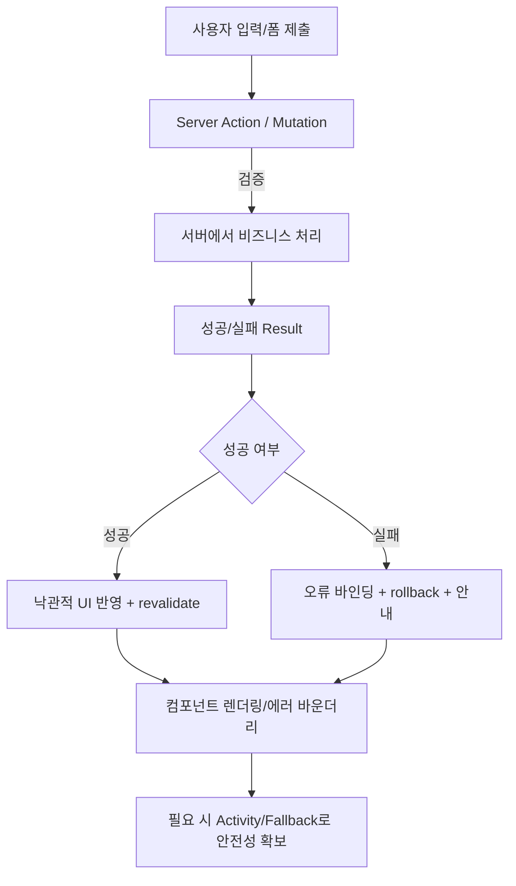
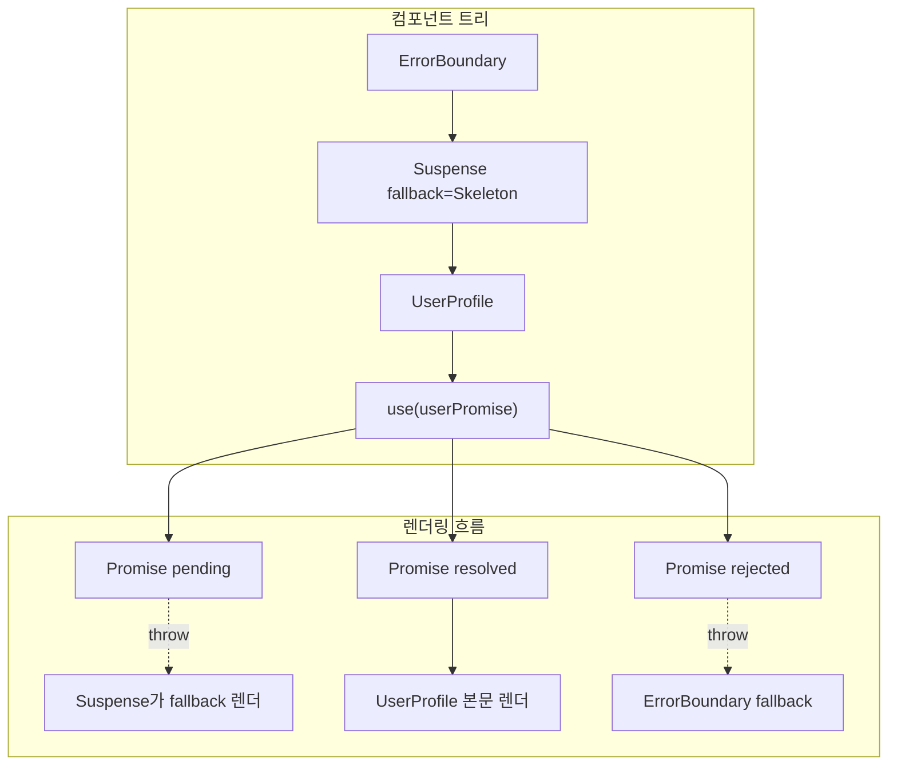
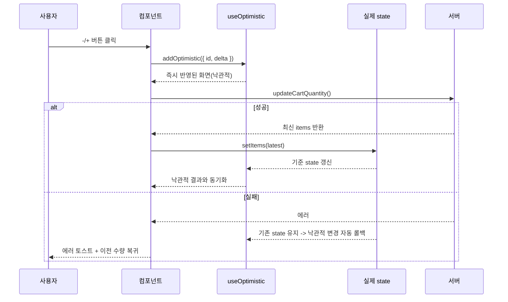
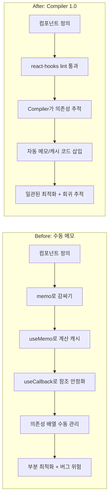
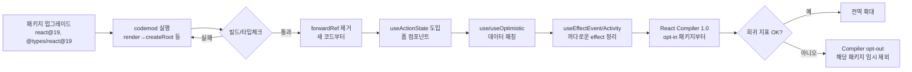

# 02. React 19 실무 가이드

## 초심자용 한눈에 보기

이 문서는 “복잡한 비동기 화면이 어떻게 흐르는지”를 보기 쉬운 구조로 정리합니다.

### 핵심 용어 빠르게 정리

| 용어              | 쉬운 뜻                                              |
| ----------------- | ---------------------------------------------------- |
| `컴포넌트`        | 화면의 작은 조각                                     |
| `폼 액션`         | 폼 제출 시 서버/서버액션으로 전달되는 동작 단위      |
| `액션 상태`       | 제출 진행 중인지, 성공/실패인지 저장해두는 값        |
| `낙관적 업데이트` | 응답이 오기 전에 화면을 먼저 반영해 체감 속도 높이기 |
| `에러 바운더리`   | UI 오류가 터져도 앱 전체가 죽지 않게 잡아주는 안전망 |

| 분류            | 핵심 기술                                                                                                                                     | 상태          | Stable    |
| :-------------- | :-------------------------------------------------------------------------------------------------------------------------------------------- | :------------ | :-------- |
| **연관 가이드** | [05. API 통신](./05_API_통신_및_모킹_가이드.md), [03. 상태 관리](./03_상태관리_패턴_가이드.md), [08. 성능 최적화](./08_성능_최적화_가이드.md) | **도구 원칙** | 벤더 중립 |
| **핵심 테마**   | Actions, Server Functions, useActionState, useOptimistic, Ref as Props, React Compiler 1.0, Activity, useEffectEvent                          | **Update**    | 최신 기준 |

---

> **"React 19은 클라이언트와 서버의 경계를 허물고, 비동기 데이터 흐름을 프레임워크 수준에서 네이티브하게 처리한다."**
> 본 가이드는 수동으로 관리하던 비동기 상태를 React 엔진에 맡기고, 더 간결하고 안전한 코드를 작성하는 방법을 다룹니다.
>
> **현재 공식 문서 기준 메이저 마일스톤**
>
> - **React 19.2 (2025-10 릴리스)**: `<Activity>` 컴포넌트, `useEffectEvent`, `cacheSignal`, Suspense SSR 배칭, Partial Pre-rendering, Node 환경 `renderToReadableStream` 안정화
> - **React Compiler 1.0 (2025-10 GA)**: 안정 채널 배포. `babel-plugin-react-compiler`와 주요 프레임워크/빌드 도구 adapter를 기준으로 점진 도입합니다.
> - **RSC 보안 패치 기준**: React Server Components를 사용하는 프레임워크/번들러는 `react-server-dom-webpack`, `react-server-dom-parcel`, `react-server-dom-turbopack` 19.2.4 이상을 기준으로 고정합니다.
> - `<ViewTransition>` 은 아직 **canary**입니다(현재 공식 문서 기준). `useDeferredValue`/`startTransition`/Suspense 콜백 ↔ 콘텐츠 전환에서만 트리거됩니다.

## 0. 먼저 알고 가기 (30초 요약)

이 문서의 흐름은 아래 3개만 기억하면 거의 충분합니다.

1. **클라이언트가 복잡한 상태를 직접 다루는 일을 줄이고, 액션으로 상태 변경을 넘긴다.**
   - `useActionState`, `useFormStatus`, `useOptimistic`을 핵심 동작으로 봅니다.
2. **서버/클라이언트 경계를 구분한다.**
   - 화면에서 무거운 계산/보안은 서버로, 즉각적인 상호작용은 클라이언트로.
3. **새 기능은 먼저 Canary로 실험하고, 정식 배포는 조건이 맞을 때만.**

아래 용어를 먼저 넘기고 읽으면 섹션 간 이동이 빨라집니다.

## 쉬운 말로 보는 용어 정리 (이 문서 중심)

| 용어            | 평소 말투로 바꿔 말하면                                           |
| --------------- | ----------------------------------------------------------------- |
| `Server Action` | 서버에 바로 “실행 요청”을 보내는 작업 함수                        |
| `Pending`       | 지금 어떤 요청이 진행 중인지 나타내는 상태                        |
| `Suspense`      | 데이터가 늦게 오더라도 깨지지 않게 잠깐 화면을 대기/전환하는 패턴 |
| `Rollback`      | 요청 실패 시 화면 변경을 되돌리는 처리                            |
| `Fallback`      | 실패나 지연 시 잠깐 보여줄 대체 화면                              |

---

## 추천 항목 (실무 우선순위)

- **시작 추천**: 폼/클릭 액션은 `pending`/`error`/`done` 상태를 먼저 명시하고 동작 플로우를 고정합니다.
- **안정 추천**: 제출 중복과 낙관적 UI는 rollback 조건을 문서화해 실제 동작을 예측 가능하게 만듭니다.
- **운영 추천**: 서버/클라이언트 경계를 기준으로 컴포넌트를 나눠 재사용 전환 전에 의존 방향을 점검하세요.

## 추천 항목 고도화 체크

- `첫 적용` — React 19 기능 채택과 RSC 보안 경계 중 하나를 실제 PR이나 운영 이슈에 붙이고, 변경 전 기준을 먼저 적는다.
- `증거 정리` — React 버전 diff, compiler lint 결과, RSC 패치 확인를 같은 작업 기록에 남긴다.
- `재점검` — hydration 오류, Suspense fallback 회귀, compiler 제외 파일 수가 나아졌는지 30일 안에 확인하고 기준을 유지, 수정, 폐기 중 하나로 판정한다.

## 추천 항목 실행 기록 템플릿

- `작업` : React 19 기능 채택과 RSC 보안 경계 적용 범위를 어느 화면, 패키지, 문서에 둘지 적는다.
- `증거` : React 버전 diff, compiler lint 결과, RSC 패치 확인 중 실제로 남긴 항목만 링크한다.
- `판정` : 유지/수정/폐기 중 하나와 이유를 한 문장으로 남긴다.
- `다음 점검` : hydration 오류, Suspense fallback 회귀, compiler 제외 파일 수를 다시 볼 날짜와 담당자를 지정한다.

## 문서 책임 범위

| 이 문서가 결정하는 것                                                 | 단일 출처로 따르는 문서                                                                           |
| :-------------------------------------------------------------------- | :------------------------------------------------------------------------------------------------ |
| React API 채택, Server/Client 경계, Suspense/Error Boundary 운영 기준 | [04. 아키텍처](./04_아키텍처_설계_패턴.md), [08. 성능](./08_성능_최적화_가이드.md)                |
| Server Action, form action, optimistic UI의 실패/rollback 조건        | [05. API 통신](./05_API_통신_및_모킹_가이드.md), [14. 배포](./14_배포_프로세스_체크리스트.md)     |
| 컴포넌트 접근성과 motion/reduced-motion 기준                          | [19. 웹 접근성](./19_웹_접근성_가이드.md), [25. 웹 애니메이션](./25_웹_애니메이션_모션_가이드.md) |
| React 마이그레이션에 AI를 사용할 때의 검증 책임                       | [18. AI 개발 워크플로우](./18_AI_개발_워크플로우_종합.md)                                         |

---

## 0. 모든 프론트엔드 그룹 공통 Baseline

React 표준은 특정 프레임워크나 회사 도구보다 **렌더링 경계, 비동기 UX, 장애 격리**를 일관되게 만드는 데 목적이 있습니다.

| 기준                          | 최소 적용                                                                                                       |
| :---------------------------- | :-------------------------------------------------------------------------------------------------------------- |
| **Server/Client 경계**        | 서버에서 가능한 데이터 준비와 클라이언트 인터랙션을 분리하고, 클라이언트 컴포넌트는 필요한 경계에만 둡니다.     |
| **Suspense + Error Boundary** | 비동기 UI에는 fallback과 오류 복구 경로를 함께 설계합니다. 로딩만 있고 실패 상태가 없는 UI는 미완성으로 봅니다. |
| **Forms/Actions 규칙**        | 제출 중 상태, 중복 제출 방지, 서버 검증 오류 표시, 낙관적 업데이트 롤백을 기본 플로우로 포함합니다.             |
| **Compiler 친화 코드**        | Hooks 규칙, 순수 렌더링, 안정적인 의존성 규칙을 `eslint-plugin-react-hooks@latest`로 자동 검증합니다.           |
| **성능 기본값**               | `memo` 남발보다 데이터 경계, 리스트 가상화, 이미지/폰트 최적화, transition 분리를 우선합니다.                   |
| **접근성 기본값**             | 네이티브 요소, 포커스 관리, 키보드 조작, reduced motion 대응을 컴포넌트 완료 조건에 포함합니다.                 |

### 0.0 React 19 요청/상태 흐름



### 0.1 교차 검증 매트릭스

| 권고                 | 1차 출처                       | 실행 증거                             | 운영 증거                         | 철회 조건                              |
| :------------------- | :----------------------------- | :------------------------------------ | :-------------------------------- | :------------------------------------- |
| React 19.2 기능 채택 | React 19.2 공식 릴리스         | component test, hydration/E2E smoke   | route error rate, INP p75         | canary 기능은 flag와 fallback 필요     |
| React Compiler       | React Compiler 1.0 공식 릴리스 | hooks/compiler lint, build 비교       | render count, interaction latency | compile time 또는 회귀 증가 시 opt-out |
| RSC 보안 기준        | React RSC 보안 권고            | dependency audit, patched range check | server action error/incident 추적 | 미패치 프레임워크는 RSC 사용 중단      |

### 0.2 운영 게이트

| Gate                        | Evidence                                         | Owner          | Rollback                                |
| :-------------------------- | :----------------------------------------------- | :------------- | :-------------------------------------- |
| React upgrade gate          | migration diff, component smoke, hydration trace | App owner      | 이전 React minor pinning                |
| Compiler adoption gate      | hooks lint, build diff, render count comparison  | Platform owner | compiler opt-out 또는 package별 disable |
| Server/client boundary gate | RSC/RCC boundary review, serialization test      | Feature owner  | client boundary로 회귀 후 RFC 재검토    |
| Form action gate            | pending/error/rollback E2E                       | Feature owner  | 기존 client mutation path 유지          |

### 0.3 React 기능 안정성 계약

React 19 이후의 기능은 stable, stable-but-opt-in, security-gated, canary를 구분해서 채택합니다. 이 구분을 하지 않으면 실험 기능이 제품 표준으로 오해되거나, RSC 패치 누락처럼 보안 리스크가 릴리스 게이트를 통과할 수 있습니다.

| 등급                   | 기능/범위                                                                                                                   | 채택 기준                                                                                                                                     | 필수 증거                                                            |
| :--------------------- | :-------------------------------------------------------------------------------------------------------------------------- | :-------------------------------------------------------------------------------------------------------------------------------------------- | :------------------------------------------------------------------- |
| **Stable baseline**    | Actions, `useActionState`, `useFormStatus`, `useOptimistic`, ref as prop, document metadata, `<Activity>`, `useEffectEvent` | React 19.2 라인에서 컴포넌트 테스트와 hydration smoke를 통과한 뒤 기본 패턴으로 사용합니다.                                                   | component test, E2E smoke, hydration warning 0건                     |
| **Stable but opt-in**  | React Compiler 1.0                                                                                                          | 전역 적용보다 패키지/route 단위로 시작하고, Hooks/Compiler lint와 render count 비교를 함께 둡니다.                                            | `eslint-plugin-react-hooks`, build diff, interaction latency 비교    |
| **RSC 보안 패치**      | `react-server-dom-webpack`, `react-server-dom-parcel`, `react-server-dom-turbopack`                                         | RSC/Server Functions를 사용하는 경우 19.2.4 이상 또는 동등한 backport(19.0.4, 19.1.5)를 강제합니다.                                           | lockfile audit, framework advisory check, dependency override diff   |
| **Framework mediated** | Partial Pre-rendering, cache contract, Server Functions routing                                                             | React API만으로 판단하지 않고 Next.js/Remix/React Router 등 실제 프레임워크의 안정 채널과 배포 런타임을 함께 검토합니다.                      | framework release note, preview deployment smoke, rollback path      |
| **Canary only**        | `<ViewTransition>`, `addTransitionType`                                                                                     | React Canary/Experimental 채널 기능입니다. 제품 기본값으로 쓰지 않고 feature flag, reduced-motion fallback, 브라우저 지원 검사를 함께 둡니다. | canary pinning ADR, visual regression, `prefers-reduced-motion` test |

#### 채택 체크리스트

- **서버 기능은 보안부터 확인**: RSC 또는 Server Functions를 켠 앱은 기능 테스트보다 먼저 취약 버전이 lockfile에 남아 있지 않은지 확인합니다.
- **Compiler는 성능 증거와 함께 도입**: 빌드 성공만으로 채택하지 않고, re-render 감소, INP/interaction latency, bundle diff를 함께 비교합니다.
- **Canary는 사용자 영향면을 제한**: `<ViewTransition>`은 시각적 향상으로만 사용하고, 실패해도 핵심 플로우가 유지되어야 합니다.
- **프레임워크 기능은 프레임워크 문서가 기준**: React stable API와 프레임워크의 캐시/라우팅/런타임 안정성은 별도 판단합니다.

---

## 1. Actions: 비동기 상태 관리 패턴

### 왜 중요한가

과거에는 데이터 갱신 시 `isLoading`, `error`, `data` 상태를 각각 `useState`로 직접 관리해야 했습니다. 상태 3종 + try/catch/finally 보일러플레이트가 매 폼마다 반복되었고, 진행 중 중복 클릭 차단·낙관적 업데이트·롤백을 손으로 일일이 다뤄야 했습니다. React 19의 **Actions**를 사용하면 비동기 함수의 시작과 끝을 React가 추적하여 자동으로 상태를 관리해줍니다.

> **일상 비유**: 배달앱에서 "주문하기"를 누르면 버튼이 자동으로 비활성화되고 진행 표시가 뜨며, 실패 시 메시지가 알아서 나타납니다. Actions는 React에서 같은 UX를 한 줄로 만들어줍니다.

#### Actions 처리 시퀀스

```mermaid
sequenceDiagram
  participant U as 사용자
  participant Form as <form action={fn}>
  participant React as React 19 런타임
  participant Action as Action 함수
  participant Server as 서버/Mutation

  U->>Form: submit
  Form->>React: action 호출 + FormData
  React->>React: isPending = true
  React-->>Form: 자식들의 useFormStatus 갱신
  React->>Action: action(prevState, formData)
  Action->>Server: 비동기 요청
  Server-->>Action: 결과/오류
  Action-->>React: 새 state 반환 (throw 금지)
  React->>React: isPending = false
  React-->>Form: state/isPending 업데이트
  Form-->>U: 성공/실패 UI 반영
```



### 1.1 `useActionState`: 비동기 작업과 상태의 결합

`useActionState`는 폼 제출이나 비동기 작업에서 `useState` + `useTransition`을 조합하던 패턴을 단일 Hook으로 대체합니다. **상태(state)**, **디스패치 함수(action)**, **진행 여부(isPending)** 를 한 번에 반환합니다.

#### Before (React 18) - 여러 useState를 수동 관리

```tsx
import { useState } from 'react'

function ProfileEditor() {
  // 3개의 상태를 개별적으로 선언하고 관리해야 함
  const [isLoading, setIsLoading] = useState(false)
  const [error, setError] = useState<string | null>(null)
  const [result, setResult] = useState<ProfileResult | null>(null)

  const handleSubmit = async (e: React.FormEvent<HTMLFormElement>) => {
    e.preventDefault()
    setIsLoading(true) // 로딩 시작
    setError(null) // 이전 에러 초기화

    try {
      const formData = new FormData(e.currentTarget)
      const res = await updateProfile(formData)
      setResult(res) // 성공 결과 반영
    } catch (err) {
      setError((err as Error).message) // 에러 상태 반영
    } finally {
      setIsLoading(false) // 로딩 종료
    }
  }

  return (
    <form onSubmit={handleSubmit}>
      <input name="displayName" disabled={isLoading} />
      <input name="email" disabled={isLoading} />
      <button disabled={isLoading}>{isLoading ? '저장 중...' : '프로필 저장'}</button>
      {error && <p className="text-error">{error}</p>}
      {result?.success && <p className="text-success">프로필이 업데이트되었습니다.</p>}
    </form>
  )
}
```

#### After (React 19) - useActionState로 통합

```tsx
import { useActionState } from 'react'

// Action 함수: 이전 상태(prevState)와 FormData를 받아 새 상태를 반환
async function updateProfileAction(
  prevState: ProfileState | null,
  formData: FormData,
): Promise<ProfileState> {
  try {
    const result = await updateProfile({
      displayName: formData.get('displayName') as string,
      email: formData.get('email') as string,
    })
    return { success: true, message: '프로필이 업데이트되었습니다.', data: result }
  } catch (err) {
    // 에러 발생 시에도 상태로 반환 (throw 하지 않음)
    return { success: false, message: (err as Error).message }
  }
}

function ProfileEditor() {
  // state: 작업 결과값, action: form에 바인딩할 함수, isPending: 실행 중 여부
  const [state, action, isPending] = useActionState(updateProfileAction, null)

  return (
    // form의 action 속성에 직접 바인딩 - onSubmit 불필요
    <form action={action}>
      <input name="displayName" disabled={isPending} />
      <input name="email" disabled={isPending} />
      <button disabled={isPending}>{isPending ? '저장 중...' : '프로필 저장'}</button>
      {/* state는 Action 함수의 반환값 */}
      {state?.success === false && <p className="text-error">{state.message}</p>}
      {state?.success && <p className="text-success">{state.message}</p>}
    </form>
  )
}
```

> **핵심 차이**: `useState` 3개 + `try/catch/finally` 보일러플레이트가 사라지고, `useActionState` 하나로 **상태**, **에러**, **로딩**을 모두 관리합니다. `form action`에 바인딩하므로 Progressive Enhancement(JS 없이도 폼 제출 가능)도 자연스럽게 지원됩니다.

### 1.2 `useFormStatus`: 하위 컴포넌트에서 폼 상태 공유

`useFormStatus`는 가장 가까운 부모 `<form>` 의 제출 상태를 읽어옵니다. Context를 별도로 만들지 않아도 됩니다. **반드시 `<form>` 내부의 자식 컴포넌트에서 호출해야** 합니다(같은 컴포넌트에서 `<form>`을 렌더링하면서 호출하면 동작하지 않음).

```tsx
import { useFormStatus } from 'react-dom'

// 재사용 가능한 제출 버튼 컴포넌트
// 반드시 <form> 자식으로 렌더링되어야 함
function SubmitButton({ label = '저장' }: { label?: string }) {
  // pending: 부모 form이 제출 중인지 여부
  // data: 제출 중인 FormData
  // method: "get" | "post"
  // action: form에 바인딩된 action 함수 참조
  const { pending, data, method, action } = useFormStatus()

  return (
    <button type="submit" disabled={pending} aria-busy={pending}>
      {pending ? '처리 중...' : label}
    </button>
  )
}

// 폼 전체 로딩 오버레이
function FormOverlay() {
  const { pending } = useFormStatus()

  if (!pending) return null
  return (
    <div className="absolute inset-0 bg-white/60 flex items-center justify-center">
      <Spinner />
    </div>
  )
}

// 부모 폼 컴포넌트
function CreatePostForm() {
  const [state, action] = useActionState(createPostAction, null)

  return (
    <form action={action} className="relative">
      <FormOverlay />
      <input name="title" placeholder="제목" />
      <textarea name="content" placeholder="내용을 입력하세요" />
      {state?.error && <p className="text-error">{state.error}</p>}
      {/* SubmitButton은 form의 자식이므로 useFormStatus가 동작함 */}
      <SubmitButton label="게시글 작성" />
    </form>
  )
}
```

> **Context-like 동작 원리**: `useFormStatus`는 내부적으로 React의 Fiber 트리를 거슬러 올라가 가장 가까운 `<form>` 노드를 찾습니다. 별도의 Provider 없이도 깊은 자식 컴포넌트에서 폼 상태를 읽을 수 있어, 재사용 가능한 UI 컴포넌트를 만들기에 적합합니다.

---

## 2. 간소화된 API: ForwardRef 제거

### 2.1 Ref as a Prop

React 18까지는 함수 컴포넌트에서 `ref`를 받으려면 반드시 `forwardRef`로 감싸야 했습니다. React 19에서는 `ref`가 일반 prop처럼 전달되므로 래퍼가 필요 없어졌습니다.

#### Before (React 18) - forwardRef 필수

```tsx
import { forwardRef, useRef } from 'react'

// forwardRef로 감싸야만 ref를 받을 수 있음
const TextInput = forwardRef<HTMLInputElement, TextInputProps>(function TextInput(
  { label, error, ...props },
  ref,
) {
  return (
    <div className="field">
      <label>{label}</label>
      <input ref={ref} {...props} />
      {error && <span className="text-error">{error}</span>}
    </div>
  )
})

// 제네릭 컴포넌트는 forwardRef와 함께 쓰기 매우 번거로움
const GenericList = forwardRef<HTMLUListElement, GenericListProps<unknown>>(function GenericList(
  { items, renderItem },
  ref,
) {
  return (
    <ul ref={ref}>
      {items.map((item, i) => (
        <li key={i}>{renderItem(item)}</li>
      ))}
    </ul>
  )
})
// 제네릭 타입 정보가 forwardRef에 의해 소실됨!
```

#### After (React 19) - ref를 일반 prop으로 전달

```tsx
import { useRef } from 'react'

// ref가 props의 일부로 직접 전달됨 - forwardRef 불필요
function TextInput({
  label,
  error,
  ref,
  ...props
}: TextInputProps & { ref?: React.Ref<HTMLInputElement> }) {
  return (
    <div className="field">
      <label>{label}</label>
      <input ref={ref} {...props} />
      {error && <span className="text-error">{error}</span>}
    </div>
  )
}

// 제네릭 컴포넌트도 자연스럽게 동작
function GenericList<T>({
  items,
  renderItem,
  ref,
}: GenericListProps<T> & { ref?: React.Ref<HTMLUListElement> }) {
  return (
    <ul ref={ref}>
      {items.map((item, i) => (
        <li key={i}>{renderItem(item)}</li>
      ))}
    </ul>
  )
}

// 사용 시: 일반 prop처럼 전달
function ParentComponent() {
  const inputRef = useRef<HTMLInputElement>(null)
  const listRef = useRef<HTMLUListElement>(null)

  return (
    <>
      <TextInput ref={inputRef} label="이름" />
      <GenericList<User> ref={listRef} items={users} renderItem={(u) => u.name} />
      <button onClick={() => inputRef.current?.focus()}>입력란 포커스</button>
    </>
  )
}
```

> **설계 간소화 포인트**: `forwardRef` 제거로 (1) 컴포넌트 정의가 단순해지고, (2) 제네릭 타입이 보존되며, (3) HOC/래퍼 패턴 설계가 쉬워집니다. 기존 `forwardRef` 코드는 React 19에서도 동작하지만 점진적으로 제거를 권장합니다.

---

## 3. `use` Hook: 조건부 리소스 소비

### 왜 중요한가

`use`는 React 19에서 새로 도입된 Hook으로, **Promise**나 **Context**를 렌더링 도중 읽을 수 있습니다. 기존 Hook들과 달리 `if`문, `for`문, `try/catch` 안에서도 호출 가능한 유일한 Hook입니다. 즉, 조건이 명확해진 시점에만 데이터를 "꺼내" 쓸 수 있어 불필요한 패칭과 중첩 Suspense를 줄여줍니다.

> **일상 비유**: 카페에서 진동벨을 받아두고 자리를 잡은 뒤 필요할 때만 카운터로 가서 음료를 가져오는 것과 같습니다. `use(promise)`는 "준비됐을 때만 가져온다"는 패턴을 컴포넌트에 직접 표현합니다.

#### Suspense + ErrorBoundary 계층 다이어그램



### 3.1 Promise와 함께 사용 (Suspense 통합)

```tsx
import { use, Suspense } from 'react'

// 데이터 패칭 함수 (Promise를 반환)
async function fetchUserProfile(userId: string): Promise<UserProfile> {
  const res = await fetch(`/api/users/${userId}`)
  if (!res.ok) throw new Error('프로필을 불러올 수 없습니다.')
  return res.json()
}

// use()로 Promise를 읽는 컴포넌트
function UserProfile({ userPromise }: { userPromise: Promise<UserProfile> }) {
  // use()는 Promise가 resolve될 때까지 Suspense를 트리거함
  const user = use(userPromise)

  return (
    <div className="profile-card">
      <h2>{user.name}</h2>
      <p>{user.email}</p>
      <p>가입일: {new Date(user.createdAt).toLocaleDateString('ko-KR')}</p>
    </div>
  )
}

// 부모에서 Promise를 생성하고 Suspense로 감싸기
function UserPage({ userId }: { userId: string }) {
  // Promise는 부모에서 생성 (렌더링마다 새로 생성하지 않도록 주의)
  const userPromise = fetchUserProfile(userId)

  return (
    <ErrorBoundary fallback={<p>프로필 로딩 실패</p>}>
      <Suspense fallback={<ProfileSkeleton />}>
        <UserProfile userPromise={userPromise} />
      </Suspense>
    </ErrorBoundary>
  )
}
```

### 3.2 조건부 호출 - 기존 Hook과의 차이점

```tsx
function DashboardWidget({ featureFlags }: { featureFlags: Promise<FeatureFlags> }) {
  const flags = use(featureFlags)

  // 조건문 내부에서 use() 호출 가능 - 다른 Hook으로는 불가능!
  if (flags.showAnalytics) {
    const analytics = use(fetchAnalyticsData())
    return <AnalyticsPanel data={analytics} />
  }

  if (flags.showReports) {
    const reports = use(fetchReportsSummary())
    return <ReportsSummary data={reports} />
  }

  return <DefaultDashboard />
}
```

### 3.3 Context와 함께 사용

```tsx
import { use, createContext } from 'react'

const ThemeContext = createContext<Theme>({ mode: 'light', primary: '#3b82f6' })

function ThemedButton({ showIcon }: { showIcon: boolean }) {
  // useContext 대신 use(Context)를 사용 가능
  // 조건부 호출이 필요할 때 유용
  const theme = use(ThemeContext)

  return (
    <button
      style={{ backgroundColor: theme.primary, color: theme.mode === 'dark' ? '#fff' : '#000' }}
    >
      {showIcon && <Icon color={theme.primary} />}
      테마 버튼
    </button>
  )
}
```

> **주의**: `use(promise)`를 사용할 때 Promise는 렌더링 바깥에서 생성하거나 캐싱해야 합니다. 렌더링 중 매번 새 Promise를 생성하면 무한 Suspense에 빠질 수 있습니다.

---

## 4. Server Functions & Actions

### 왜 중요한가

`"use server"` 지시어로 선언된 함수는 서버에서만 실행되며, 클라이언트에서는 자동 생성된 RPC 참조를 통해 호출합니다. 네트워크 호출, 직렬화/역직렬화를 React가 자동으로 처리합니다. fetch 보일러플레이트 대신 함수 호출로 mutate를 표현할 수 있어 코드가 짧아지고, 서버 검증 결과를 그대로 폼 상태로 받아 표시할 수 있습니다.

> **일상 비유**: 사내 인트라넷 신청서에서 "결재 올리기" 버튼이 사실은 멀리 떨어진 사내 서버에 요청을 보내지만, 사용자는 그저 양식만 채우면 됩니다. Server Functions는 클라이언트 코드에서 마치 로컬 함수처럼 보이지만 실제로는 서버에서 실행됩니다.

#### Server Action 처리 시퀀스

```mermaid
sequenceDiagram
  autonumber
  participant Browser as 브라우저
  participant Form as <form action={createArticle}>
  participant RSC as React Server Runtime
  participant Action as "use server" 함수
  participant DB as DB / 외부 시스템

  Browser->>Form: submit (FormData)
  Form->>RSC: action 참조 호출 + payload 직렬화
  RSC->>Action: 서버에서 함수 실행
  Action->>Action: Zod로 입력 검증
  alt 검증 실패
    Action-->>RSC: { success: false, fieldErrors }
  else 검증 통과
    Action->>DB: 데이터 변경
    DB-->>Action: result
    Action->>RSC: revalidatePath / tag 무효화
    Action-->>RSC: { success: true, id }
  end
  RSC-->>Form: 결과 직렬화 응답
  Form-->>Browser: useActionState 상태 갱신 + UI 반영
```



### 4.1 기본 사용법: 폼 액션

```tsx
// actions.ts - 서버 전용 로직
'use server'

import { revalidatePath } from 'next/cache'
import { z } from 'zod'

// 입력값 검증 스키마
const CreateArticleSchema = z.object({
  title: z.string().min(1, '제목을 입력해주세요').max(100),
  content: z.string().min(10, '내용을 10자 이상 입력해주세요'),
  categoryId: z.string().uuid('유효하지 않은 카테고리입니다'),
})

export async function createArticle(
  prevState: ArticleFormState | null,
  formData: FormData,
): Promise<ArticleFormState> {
  // 1. 서버에서 입력값 검증
  const parsed = CreateArticleSchema.safeParse({
    title: formData.get('title'),
    content: formData.get('content'),
    categoryId: formData.get('categoryId'),
  })

  if (!parsed.success) {
    // 필드별 에러 메시지 반환
    return {
      success: false,
      fieldErrors: parsed.error.flatten().fieldErrors,
    }
  }

  try {
    // 2. DB 저장
    const article = await db.article.create({ data: parsed.data })

    // 3. 관련 페이지 캐시 무효화 (ISR 재생성 트리거)
    revalidatePath('/articles')
    revalidatePath(`/articles/${article.id}`)

    return { success: true, articleId: article.id }
  } catch (err) {
    // 4. 서버 에러를 안전하게 클라이언트에 전달
    console.error('게시글 생성 실패:', err)
    return {
      success: false,
      serverError: '게시글 생성에 실패했습니다. 잠시 후 다시 시도해주세요.',
    }
  }
}
```

### 4.2 클라이언트에서 Server Action 사용

```tsx
'use client'

import { useActionState } from 'react'
import { createArticle } from './actions'

function ArticleForm() {
  const [state, action, isPending] = useActionState(createArticle, null)

  return (
    <form action={action}>
      <div>
        <input name="title" placeholder="제목" />
        {/* 필드별 에러 표시 */}
        {state?.fieldErrors?.title && (
          <p className="text-error text-sm">{state.fieldErrors.title[0]}</p>
        )}
      </div>

      <div>
        <textarea name="content" placeholder="내용" rows={10} />
        {state?.fieldErrors?.content && (
          <p className="text-error text-sm">{state.fieldErrors.content[0]}</p>
        )}
      </div>

      <select name="categoryId">
        <option value="">카테고리 선택</option>
        {/* 카테고리 옵션들 */}
      </select>

      {/* 서버 에러 표시 */}
      {state?.serverError && <div className="bg-red-50 p-3 rounded">{state.serverError}</div>}

      <button type="submit" disabled={isPending}>
        {isPending ? '게시 중...' : '게시글 작성'}
      </button>
    </form>
  )
}
```

### 4.3 이벤트 핸들러에서 Server Action 호출

```tsx
'use client'

import { useTransition } from 'react'
import { deleteArticle } from './actions'

function DeleteButton({ articleId }: { articleId: string }) {
  const [isPending, startTransition] = useTransition()

  const handleDelete = () => {
    if (!confirm('정말 삭제하시겠습니까?')) return

    // useTransition으로 감싸면 isPending 상태를 추적 가능
    startTransition(async () => {
      await deleteArticle(articleId)
    })
  }

  return (
    <button onClick={handleDelete} disabled={isPending} className="text-red-600">
      {isPending ? '삭제 중...' : '삭제'}
    </button>
  )
}
```

---

## 5. `useOptimistic`: 낙관적 업데이트

### 왜 중요한가

네트워크 응답을 기다리지 않고 UI를 즉시 업데이트한 뒤, 서버 응답이 오면 실제 상태로 동기화합니다. 사용자 체감 속도를 극적으로 향상시킵니다.

> **일상 비유**: 메신저에서 메시지를 보내면 회색 체크와 함께 즉시 화면에 표시됩니다. 서버가 응답하면 파란 체크로 바뀌고, 실패하면 빨간 느낌표로 변합니다. `useOptimistic`은 그 "즉시 회색 체크"를 React에서 표현하는 방법입니다.

#### 낙관적 업데이트 시퀀스(성공/실패 분기)



### 5.1 장바구니 수량 변경 예제

```tsx
import { useOptimistic, useActionState } from 'react'

interface CartItem {
  id: string
  name: string
  price: number
  quantity: number
}

function ShoppingCart({ initialItems }: { initialItems: CartItem[] }) {
  const [items, setItems] = useState(initialItems)

  // optimisticItems: 화면에 보여줄 낙관적 상태
  // addOptimistic: 낙관적 업데이트를 적용하는 함수
  const [optimisticItems, addOptimistic] = useOptimistic(
    items,
    // 리듀서: 현재 상태 + 업데이트 정보 → 낙관적 상태
    (currentItems: CartItem[], update: { id: string; delta: number }) =>
      currentItems.map((item) =>
        item.id === update.id
          ? { ...item, quantity: Math.max(0, item.quantity + update.delta) }
          : item,
      ),
  )

  const handleQuantityChange = async (itemId: string, delta: number) => {
    // 1. UI를 즉시 업데이트 (낙관적)
    addOptimistic({ id: itemId, delta })

    // 2. 서버에 실제 요청
    try {
      const updatedItems = await updateCartQuantity(itemId, delta)
      setItems(updatedItems) // 서버 응답으로 실제 상태 동기화
    } catch {
      // 실패 시 낙관적 상태가 자동으로 롤백됨 (items가 원래 값이므로)
      toast.error('수량 변경에 실패했습니다.')
    }
  }

  const totalPrice = optimisticItems.reduce((sum, item) => sum + item.price * item.quantity, 0)

  return (
    <div className="cart">
      <h2>장바구니</h2>
      {optimisticItems.map((item) => (
        <div key={item.id} className="cart-item flex items-center gap-4">
          <span className="flex-1">{item.name}</span>
          <span>{item.price.toLocaleString()}원</span>
          <div className="flex items-center gap-2">
            <button onClick={() => handleQuantityChange(item.id, -1)}>-</button>
            <span>{item.quantity}</span>
            <button onClick={() => handleQuantityChange(item.id, +1)}>+</button>
          </div>
        </div>
      ))}
      <div className="cart-total font-bold text-lg">합계: {totalPrice.toLocaleString()}원</div>
    </div>
  )
}
```

### 5.2 좋아요 토글 예제 (Server Action 조합)

```tsx
'use client'

import { useOptimistic } from 'react'

function LikeButton({ articleId, initialLiked, initialCount }: LikeButtonProps) {
  const [{ liked, count }, setLikeState] = useState({
    liked: initialLiked,
    count: initialCount,
  })

  const [optimistic, addOptimistic] = useOptimistic(
    { liked, count },
    (current, newLiked: boolean) => ({
      liked: newLiked,
      count: current.count + (newLiked ? 1 : -1),
    }),
  )

  const handleToggle = async () => {
    const next = !optimistic.liked
    addOptimistic(next) // 즉시 UI 반영

    const result = await toggleLike(articleId) // 서버 요청
    setLikeState({ liked: result.liked, count: result.count }) // 실제 반영
  }

  return (
    <button onClick={handleToggle} className={optimistic.liked ? 'text-red-500' : 'text-gray-400'}>
      {optimistic.liked ? '♥' : '♡'} {optimistic.count}
    </button>
  )
}
```

---

## 6. React Compiler 1.0 시대의 변화

### 왜 중요한가

React Compiler(구 React Forget)는 빌드 타임에 컴포넌트를 자동 메모이제이션합니다. 수동으로 `memo`, `useMemo`, `useCallback`을 작성할 필요가 사라집니다.

> **2025년 10월: React Compiler 1.0 안정화 (GA)**
> 1.0에서는 옵셔널 체이닝/배열 인덱스 의존성 분석, 라이브러리 호환성, 점진적 롤아웃 가이드가 정식화됐습니다. 실제 도입 효과는 공식 벤치마크 수치가 아니라 각 제품의 trace, interaction latency, bundle/hydration 지표로 검증합니다.

> **일상 비유**: 자동변속기와 같습니다. 수동 변속(memo/useMemo/useCallback)도 잘 다루면 효율적이지만, 자동변속(Compiler)이면 운전자는 도로 상황(렌더링 의도)에만 집중할 수 있습니다. 단, 차종(라이브러리 호환성)이 자동변속을 지원해야 합니다.

#### Compiler 최적화 흐름 비교



### 6.1 무엇이 바뀌나

```tsx
// === Before: 수동 메모이제이션 지옥 ===
import { memo, useMemo, useCallback } from 'react'

const ExpensiveList = memo(function ExpensiveList({ items, onSelect }: Props) {
  const sorted = useMemo(() => [...items].sort((a, b) => b.score - a.score), [items])

  const handleSelect = useCallback(
    (id: string) => {
      onSelect(id)
    },
    [onSelect],
  )

  return (
    <ul>
      {sorted.map((item) => (
        <ListItem key={item.id} item={item} onSelect={handleSelect} />
      ))}
    </ul>
  )
})

const ListItem = memo(function ListItem({ item, onSelect }: ItemProps) {
  return (
    <li onClick={() => onSelect(item.id)}>
      {item.name}: {item.score}
    </li>
  )
})

// === After: React Compiler가 자동 처리 ===
// memo, useMemo, useCallback 제거 — 컴파일러가 동일한 최적화를 자동 적용
function ExpensiveList({ items, onSelect }: Props) {
  const sorted = [...items].sort((a, b) => b.score - a.score)

  return (
    <ul>
      {sorted.map((item) => (
        <ListItem key={item.id} item={item} onSelect={onSelect} />
      ))}
    </ul>
  )
}

function ListItem({ item, onSelect }: ItemProps) {
  return (
    <li onClick={() => onSelect(item.id)}>
      {item.name}: {item.score}
    </li>
  )
}
```

### 6.2 React Compiler 1.0 도입 가이드

```bash
# 1.0 안정 채널 설치 (실험 플래그 불필요)
npm install -D babel-plugin-react-compiler eslint-plugin-react-hooks
```

```ts
// Next.js 16+ (App Router 권장)
// next.config.ts — experimental 키가 아닌 최상위 옵션으로 승격됨
const nextConfig = {
  reactCompiler: true,
}

// Vite — @vitejs/plugin-react 또는 plugin-react-swc 모두 지원
// vite.config.ts
import react from '@vitejs/plugin-react'
export default {
  plugins: [
    react({
      babel: { plugins: [['babel-plugin-react-compiler', {}]] },
    }),
  ],
}
```

**React Compiler 1.0이 처리하는 것:**

- 컴포넌트 리렌더링 스킵 (`memo` 대체)
- 계산값 캐싱 (`useMemo` 대체)
- 콜백 참조 안정성 (`useCallback` 대체)
- JSX 엘리먼트 캐싱
- **옵셔널 체이닝 / 배열 인덱스도 의존성으로 자동 추적** (1.0 신규)

**React Compiler가 처리하지 않는 것:**

- 부수 효과 (`useEffect`)는 여전히 수동 관리 → `useEffectEvent` 활용 권장 (7장 참고)
- 외부 스토어 구독 (`useSyncExternalStore`)
- 의도적인 매번 재계산이 필요한 경우

> **점진적 롤아웃 (공식 권장)**: 디렉터리 단위로 `"use no memo"` 디렉티브를 활용하여 일부 모듈만 컴파일러 적용을 제외할 수 있습니다. 새 화면부터 점진 적용 → `eslint-plugin-react-hooks@latest`의 compiler-powered 규칙으로 안티패턴 모니터링 → 전사 적용 순서가 일반적입니다.
>
> **마이그레이션 전략**: 기존 `memo`/`useMemo`/`useCallback`은 즉시 제거할 필요 없습니다. React Compiler가 활성화되면 중복 최적화가 될 뿐 오류는 발생하지 않습니다. 새 코드부터 작성하지 않으면 됩니다.

---

## 7. Document Metadata: `<title>`, `<meta>`, `<link>`

React 19에서는 컴포넌트 내부에서 직접 `<title>`, `<meta>`, `<link>` 등을 렌더링하면 React가 자동으로 `<head>`에 호이스팅합니다. `react-helmet` 같은 서드파티 라이브러리가 불필요해집니다.

```tsx
// 이전: react-helmet 또는 next/head 필요
// 이후: 컴포넌트 JSX에 직접 선언

function ArticlePage({ article }: { article: Article }) {
  return (
    <article>
      {/* React 19이 자동으로 <head>에 호이스팅 */}
      <title>{article.title} | 우리 블로그</title>
      <meta name="description" content={article.summary} />
      <meta property="og:title" content={article.title} />
      <meta property="og:description" content={article.summary} />
      <meta property="og:image" content={article.thumbnailUrl} />
      <link rel="canonical" href={`https://blog.example.com/articles/${article.slug}`} />

      {/* 페이지 본문 */}
      <h1>{article.title}</h1>
      <p>{article.content}</p>
    </article>
  )
}

// 중첩 레이아웃에서도 동작 — 자식의 <title>이 부모를 덮어씀
function ProductLayout({ children }: { children: React.ReactNode }) {
  return (
    <div>
      <title>상품 목록 | 쇼핑몰</title>
      <meta name="robots" content="index,follow" />
      {children}
    </div>
  )
}

function ProductDetail({ product }: { product: Product }) {
  return (
    <div>
      {/* 이 title이 ProductLayout의 title을 덮어씀 */}
      <title>{product.name} | 쇼핑몰</title>
      <meta name="description" content={product.description} />
      <p>{product.description}</p>
    </div>
  )
}
```

> **참고**: Next.js App Router를 사용하는 경우 `generateMetadata`와 혼용하지 마세요. 순수 React 프로젝트(Vite 등)에서 특히 유용합니다. SEO 관련 상세 내용은 [24. SEO 메타데이터 가이드](./24_SEO_메타데이터_가이드.md)를 참고하세요.

---

## 8. React 19.2 신규 안정 기능 (2025-10 릴리스)

React 19.2는 19.x 라인의 메이저 기능 추가 릴리스로, 그동안 실험적이었던 **Activity API**, **useEffectEvent**, **cacheSignal**, **SSR Suspense 배칭**, **Partial Pre-rendering** 등이 한꺼번에 안정화됐습니다.

### 8.1 `useEffectEvent`: 이벤트 로직과 반응형 Effect 분리

`useEffect` 안에서 최신 props/state를 읽고 싶지만, 그 값 때문에 의존성에 포함하면 Effect가 매번 재실행되는 문제가 있었습니다. `useEffectEvent`는 **"이벤트성 로직"** 만 추출해 항상 최신 값을 보장하면서도, 의존성으로 추가할 필요가 없게 만듭니다.

```tsx
import { useEffect } from 'react'
import { useEffectEvent } from 'react' // 19.2부터 안정 export

function ChatRoom({ roomId, theme }: { roomId: string; theme: 'light' | 'dark' }) {
  // theme은 변할 수 있지만, 이 변경 때문에 채팅방 재연결이 일어나서는 안 됨
  const onConnected = useEffectEvent((connectedRoomId: string) => {
    // 항상 최신 theme/roomId를 읽지만, 의존성에 들어가지 않음
    showNotification(`${connectedRoomId} 입장`, theme)
  })

  useEffect(() => {
    const conn = createConnection(roomId)
    conn.on('connected', () => onConnected(roomId))
    conn.connect()
    return () => conn.disconnect()
    // ✅ theme이 deps에 없어도 ESLint 경고 없음 (eslint-plugin-react-hooks 5.x+ 대응)
  }, [roomId])

  return <h1>방 {roomId}</h1>
}
```

> **린트 규칙**: React 19.2와 함께 출시된 `eslint-plugin-react-hooks` 업데이트가 `useEffectEvent` 반환값을 의존성 배열에 강제하지 않도록 수정됐습니다. 구버전 린트를 쓰는 팀은 업데이트를 잊지 마세요.

### 8.2 `<Activity>`: 상태를 보존한 채로 UI 숨기기

`<Activity mode="hidden">`은 자식 트리를 **언마운트하지 않고 화면에서 감추면서, 이펙트는 일시 정지하고 우선순위를 낮춥니다.** 탭 전환, 단계형 폼, 모달 캐싱 등 "다시 돌아왔을 때 상태가 살아 있어야 하는" 패턴에 적합합니다.

```tsx
import { Activity, useState } from 'react'

function TabbedDashboard() {
  const [active, setActive] = useState<'overview' | 'analytics' | 'settings'>('overview')

  return (
    <>
      <Tabs current={active} onChange={setActive} />

      {/* 탭을 바꿔도 상태/스크롤/입력값이 살아 있음 */}
      <Activity mode={active === 'overview' ? 'visible' : 'hidden'}>
        <OverviewPanel />
      </Activity>
      <Activity mode={active === 'analytics' ? 'visible' : 'hidden'}>
        <AnalyticsPanel />
      </Activity>
      <Activity mode={active === 'settings' ? 'visible' : 'hidden'}>
        <SettingsPanel />
      </Activity>
    </>
  )
}
```

- `mode="hidden"`: Effect를 정리(cleanup)하고 렌더링 우선순위를 낮춥니다. state는 보존됩니다.
- `mode="visible"`: 다시 Effect를 실행하고 정상 우선순위로 렌더링됩니다.
- 단순 `display: none`과의 차이: 자식의 비동기 작업/Effect가 정확히 일시정지되어 자원 낭비가 없습니다.

### 8.3 `cacheSignal`: Server Component 캐시 라이프사이클에 AbortSignal 연결

React Server Components의 `cache()`로 메모이즈된 함수 안에서, **해당 캐시 항목이 폐기될 때 함께 취소되는 `AbortSignal`** 을 받아올 수 있습니다. 요청별 비용이 큰 외부 호출(LLM, 결제 API 등)을 안전하게 중단할 수 있습니다.

```ts
// app/lib/recommend.ts (RSC)
import { cache, cacheSignal } from 'react'

export const getRecommendations = cache(async (userId: string) => {
  const signal = cacheSignal() // 이 캐시 엔트리의 수명에 묶인 AbortSignal
  const res = await fetch(`https://ml.example.com/recommend?u=${userId}`, { signal })
  return res.json()
})
```

### 8.4 SSR Suspense 배칭 & Partial Pre-rendering

- **SSR Suspense 배칭**: 19.2부터 거의 동시에 해소되는 Suspense 경계를 묶어 한 번에 노출합니다. 깜빡임이 줄어 클라이언트 동작과 일관됩니다. 공식 Core Web Vitals LCP good 기준인 2.5초에 근접하면 배칭을 중단해 초기 표시 지연을 제한합니다.
- **Partial Pre-rendering (PPR)**: 정적 셸을 CDN/엣지에서 즉시 응답하고, 동적 영역만 스트리밍으로 채워 넣는 방식입니다. Next.js 16의 Cache Components와 함께 production 운영 패턴으로 정리되었습니다.
- **Node `renderToReadableStream`**: 19.2부터 Node 환경에서도 Web Streams 기반 SSR이 안정 지원됩니다. Edge 런타임과 코드를 공유하기 쉬워졌습니다.

### 8.5 `<ViewTransition>` (canary, 현재 공식 문서 기준 미안정)

`<ViewTransition>` 컴포넌트는 여전히 **canary 채널**에 머물러 있습니다. 다만 트리거 조건이 명확히 정리됐습니다.

- `setState` 즉시 업데이트는 트랜지션을 발동시키지 **않음**
- `startTransition`, `useDeferredValue`, Action, Suspense fallback → content 전환만 발동
- 브라우저 지원은 View Transition API와 프로젝트의 Baseline 정책을 함께 확인하고, feature detection과 `prefers-reduced-motion` fallback을 둡니다.
- Next.js 16.x에서는 PPR/Cache Components와 클라이언트 전환 전략을 분리해 설계합니다.

```tsx
// 안정 채널로 진입 전까지는 react@canary, react-dom@canary 사용 필요
import { ViewTransition, useDeferredValue } from 'react'

function Gallery({ id }: { id: string }) {
  const deferredId = useDeferredValue(id)
  return (
    <ViewTransition>
      <Photo id={deferredId} />
    </ViewTransition>
  )
}
```

---

## 9. 마이그레이션 가이드: React 18 → 19

### 왜 중요한가

새 버전에서 사라진 API(`ReactDOM.render`, string ref 등)를 모른 채 업그레이드하면 빌드가 통째로 실패합니다. 단계별 게이트를 명확히 두면 회귀를 작은 단위로 잡고, 큰 일정 한 번보다 작은 점진 일정 여러 번이 안전합니다.

#### 마이그레이션 단계 흐름



### 9.1 단계별 업그레이드

```bash
# 1단계: 패키지 업그레이드 (19.2가 현재 안정 라인)
npm install react@latest react-dom@latest

# RSC를 직접 의존하는 경우 보안 패치 기준을 별도로 확인
npm install react-server-dom-webpack@^19.2.4
npm install -D @types/react@^19 @types/react-dom@^19

# 2단계: React Compiler 1.0 도입 (안정 채널)
npm install -D babel-plugin-react-compiler eslint-plugin-react-hooks

# 3단계: 린트 규칙 업데이트 (useEffectEvent 호환)
npm install -D eslint-plugin-react-hooks@latest
```

### 9.2 주요 Breaking Changes 대응

| 변경 사항         | React 18          | React 19                | 대응 방법                                  |
| :---------------- | :---------------- | :---------------------- | :----------------------------------------- |
| `forwardRef`      | 필수              | 선택 (점진적 제거)      | 새 코드는 ref를 prop으로, 기존 코드는 유지 |
| `useContext`      | 유일한 방법       | `use(Context)` 도 가능  | 조건부 호출이 필요한 곳만 `use`로 전환     |
| `ReactDOM.render` | 지원 (deprecated) | **제거됨**              | `createRoot` 사용 필수                     |
| `React.lazy`      | 유일한 방법       | `use(import(...))` 가능 | 기존 코드 유지 가능, 새 코드는 `use` 활용  |
| `ref` 콜백 반환값 | 무시됨            | 클린업 함수로 사용      | ref 콜백에서 의도치 않은 return 제거       |
| `string ref`      | deprecated        | **제거됨**              | `useRef` 또는 콜백 ref로 전환              |

### 9.3 Codemod 활용

```bash
# React 공식 codemod로 자동 변환
npx @react-codemod/v19 ./src

# 주요 변환 항목:
# - ReactDOM.render → createRoot
# - forwardRef 제거
# - useContext → use(Context) (선택적)
# - string ref → useRef
```

### 9.4 점진적 마이그레이션 전략

1. **1주차**: 패키지 업그레이드 + codemod 실행 + 빌드 오류 해결 (React 19.2 라인)
2. **2주차**: `forwardRef` 제거 (새 코드부터 적용, 기존 코드는 lint 규칙으로 점진 전환)
3. **3주차**: `useActionState` 도입 (폼 관련 컴포넌트 우선)
4. **4주차**: `use` Hook, `useOptimistic` 적용 (데이터 패칭 레이어)
5. **5주차**: `useEffectEvent` 도입으로 까다로운 `useEffect` 정리, `<Activity>` 로 탭/모달 상태 캐싱
6. **6주차 이후**: React Compiler **1.0** 안정 채널 도입 → `memo`/`useMemo`/`useCallback` 점진적 제거

---

## 10. 주의사항 및 흔한 실수

### 10.1 `use(promise)`에서 무한 Suspense

```tsx
// 잘못된 예: 렌더링마다 새 Promise 생성 → 무한 Suspense
function BadExample({ userId }: { userId: string }) {
  // 렌더링할 때마다 fetch가 호출되어 새 Promise가 생성됨
  const user = use(fetch(`/api/users/${userId}`).then((r) => r.json()))
  return <p>{user.name}</p>
}

// 올바른 예: Promise를 컴포넌트 바깥에서 생성
function GoodExample({ userPromise }: { userPromise: Promise<User> }) {
  const user = use(userPromise)
  return <p>{user.name}</p>
}

// 또는 캐시된 패칭 함수 사용 (React.cache 또는 라이브러리)
const fetchUser = cache(async (userId: string) => {
  const res = await fetch(`/api/users/${userId}`)
  return res.json()
})
```

### 10.2 `useFormStatus`를 form 바깥에서 호출

```tsx
// 잘못된 예: form을 렌더링하는 컴포넌트에서 직접 호출
function BrokenForm() {
  const { pending } = useFormStatus() // 항상 pending: false

  return (
    <form action={someAction}>
      <button disabled={pending}>저장</button> {/* 동작 안 함! */}
    </form>
  )
}

// 올바른 예: form의 자식 컴포넌트에서 호출
function WorkingForm() {
  return (
    <form action={someAction}>
      <SubmitButton /> {/* 자식 컴포넌트에서 useFormStatus 호출 */}
    </form>
  )
}

function SubmitButton() {
  const { pending } = useFormStatus() // 정상 동작
  return <button disabled={pending}>저장</button>
}
```

### 10.3 Server Action에서 민감한 정보 노출

```tsx
// 잘못된 예: 서버 에러를 그대로 클라이언트에 전달
'use server'
export async function riskyAction(formData: FormData) {
  try {
    await db.query('INSERT INTO ...')
  } catch (err) {
    // DB 에러 메시지가 클라이언트에 노출됨!
    return { error: (err as Error).message }
  }
}

// 올바른 예: 에러를 로깅하고 일반적인 메시지만 반환
;('use server')
export async function safeAction(formData: FormData) {
  try {
    await db.query('INSERT INTO ...')
    return { success: true }
  } catch (err) {
    console.error('DB 오류:', err) // 서버 로그에만 기록
    return { success: false, error: '처리 중 오류가 발생했습니다.' }
  }
}
```

### 10.4 `useActionState`의 초기값 타입 불일치

```tsx
// 잘못된 예: 초기값 null인데 state를 바로 접근
const [state, action, isPending] = useActionState(myAction, null)
return <p>{state.message}</p> // TypeError: Cannot read property 'message' of null

// 올바른 예: null 체크 후 접근
const [state, action, isPending] = useActionState(myAction, null)
return state ? <p>{state.message}</p> : null
```

### 10.5 `useEffectEvent`를 일반 콜백처럼 외부에 전달

`useEffectEvent`가 반환하는 함수는 **Effect 내부에서만 호출해야 합니다.** props로 자식에 전달하거나 이벤트 핸들러로 직접 쓰면 렌더링 단계에서의 안정성이 보장되지 않습니다.

```tsx
// ❌ 잘못된 예: 자식 컴포넌트에 props로 전달
const onLog = useEffectEvent(() => log(value))
return <Child onLog={onLog} /> // ❌ 권장하지 않음

// ✅ 올바른 예: Effect 안에서만 호출
const onLog = useEffectEvent(() => log(value))
useEffect(() => {
  const id = setInterval(onLog, 1000)
  return () => clearInterval(id)
}, [])
```

### 10.6 `<Activity mode="hidden">` 의 Effect 정지를 일반 데이터 패칭에 의존

`mode="hidden"` 으로 진입하면 자식의 `useEffect` cleanup이 호출됩니다. 즉, **WebSocket/SSE 같은 장기 연결은 자동으로 끊기고 다시 visible될 때 재연결**됩니다. 이를 영구 연결 유지로 오해하지 마세요. 영구 유지가 필요하면 상위 컴포넌트나 store 레벨에 두어야 합니다.

---

## AI 보조 React 마이그레이션 검증

AI 사용 정책과 검증 책임은 [18. AI 개발 워크플로우](./18_AI_개발_워크플로우_종합.md)를 따릅니다. React 마이그레이션 초안은 hydration, accessibility, form failure path를 통과해야 병합합니다.

| 시나리오             | 입력                                | AI 산출물                               | 필수 검증                        |
| :------------------- | :---------------------------------- | :-------------------------------------- | :------------------------------- |
| React 18 -> 19 전환  | 컴포넌트 코드, 사용 중인 API        | ref-as-prop, action, optimistic UI 후보 | component test, hydration smoke  |
| Server Action 설계   | API 계약, validation schema         | action + form wiring 초안               | pending/error/rollback E2E       |
| Compiler 친화 리팩터 | lint report, render hotspot         | rules-of-react 위반 수정안              | compiler lint, render count 비교 |
| RSC 경계 검토        | route data flow, client interaction | server/client split 후보                | serialization test, bundle diff  |

---

## 체크리스트

### 기본 적용

- [ ] 비동기 작업 상태 관리에 `useActionState`를 도입하여 불필요한 `useState` 보일러플레이트를 제거했나요?
- [ ] 재사용 가능한 폼 UI 컴포넌트에서 `useFormStatus`를 활용하고 있나요?
- [ ] 새로운 컴포넌트에서 `forwardRef` 없이 `ref`를 prop으로 직접 받고 있나요?
- [ ] 렌더링 도중의 데이터 의존성을 `use(promise)` 패턴으로 해결했나요?

### 서버 통합

- [ ] 서버 레이어 로직을 `Server Functions`로 격리하여 보안과 성능을 최적화했나요?
- [ ] Server Action에서 Zod 등으로 입력값을 검증하고 있나요?
- [ ] Server Action의 에러 메시지가 민감한 정보를 노출하지 않나요?
- [ ] `revalidatePath`/`revalidateTag`로 캐시 무효화를 처리하고 있나요?

### 사용자 경험

- [ ] 즉각적인 피드백이 필요한 인터랙션에 `useOptimistic`을 적용했나요?
- [ ] `use(promise)` 사용 시 Suspense 폴백과 ErrorBoundary를 함께 설정했나요?
- [ ] Document Metadata를 컴포넌트 내에서 직접 관리하고 있나요?

### 성능 및 마이그레이션

- [ ] React Compiler **1.0**(안정 채널)을 도입했고, `eslint-plugin-react-hooks@latest`의 compiler-powered 규칙으로 안티패턴을 모니터링하나요?
- [ ] `use(promise)`에서 렌더링마다 새 Promise를 생성하지 않도록 주의했나요?
- [ ] `ReactDOM.render`, `string ref` 등 제거된 API를 사용하고 있지 않나요?
- [ ] React 18 → 19 codemod를 실행하여 자동 마이그레이션을 완료했나요?

### React 19.2 신규 기능

- [ ] 최신 props/state를 읽어야 하지만 재실행은 막고 싶은 Effect에 `useEffectEvent`를 적용했나요?
- [ ] 탭/마법사/모달처럼 상태 보존이 필요한 화면에 `<Activity>` 도입을 검토했나요?
- [ ] RSC의 `cache()` 안에서 외부 호출을 할 때 `cacheSignal`로 취소 가능성을 확보했나요?
- [ ] SSR Suspense 배칭과 Partial Pre-rendering(PPR)이 LCP에 미치는 영향을 측정했나요?
- [ ] `<ViewTransition>`은 아직 canary임을 인지하고, 안정 채널이 아닌 곳에서만 실험하고 있나요?

---

> **연관 가이드**: [01. TypeScript 심화](./01_TypeScript_심화_가이드.md) | [03. 상태 관리 패턴](./03_상태관리_패턴_가이드.md) | [05. API 통신](./05_API_통신_및_모킹_가이드.md) | [08. 성능 최적화](./08_성능_최적화_가이드.md) | [24. SEO 메타데이터](./24_SEO_메타데이터_가이드.md)

---

## 12. React 컴포넌트 가독성/결합도 규칙

React 컴포넌트는 UI와 부수 효과가 한 파일에 쉽게 섞입니다. Frontend Fundamentals의 예시를 React 리뷰 기준으로 바꾸면 다음 규칙이 됩니다.

### 12.1 같이 실행되지 않는 코드는 컴포넌트로 분리한다

- 권한, feature flag, 상태에 따라 완전히 다른 UI와 effect가 실행되면 wrapper만 분기를 갖고 하위 컴포넌트는 한 경로만 담당합니다.
- disabled UI와 interactive UI가 서로 다른 effect를 가진다면 `ViewerSubmitButton`, `AdminSubmitButton`처럼 분리합니다.
- 분리 후 각 컴포넌트의 test는 자기 경로만 검증하고, 상위 wrapper test는 분기 선택만 검증합니다.

### 12.2 구현 상세는 화면 의도 밖으로 밀어낸다

- 로그인 여부 확인 후 redirect, 권한 guard, confirm dialog 같은 흐름 제어는 route guard, wrapper, HOC, 전용 버튼 컴포넌트로 옮깁니다.
- 화면 컴포넌트는 "무엇을 보여주는지"가 먼저 읽혀야 하고, 인증/동의/로깅 구현은 이름 있는 경계 안에 있어야 합니다.
- 단, wrapper가 너무 많은 정책을 숨기면 예측 가능성이 떨어지므로 props와 반환값에서 부수 효과가 드러나야 합니다.

### 12.3 Props Drilling은 composition을 먼저 검토한다

- 중간 컴포넌트가 사용하지 않는 prop을 넘기기만 한다면 `children` composition으로 depth를 줄입니다.
- 깊이가 깊고 같은 데이터를 여러 하위 컴포넌트가 직접 사용한다면 Context API를 검토합니다.
- Context는 모든 prop 전달의 대체제가 아닙니다. 컴포넌트 역할을 드러내는 핵심 prop은 그대로 두는 편이 낫습니다.

### 12.4 중첩 삼항과 숨은 effect를 리뷰에서 차단한다

- 세 가지 이상 상태를 계산하는 중첩 삼항은 `if` 또는 상태 계산 함수로 풀어 조건 순서를 드러냅니다.
- 클릭 handler 안에서 logging, analytics, mutation, navigation이 함께 실행되면 순서와 실패 정책을 명시합니다.
- 이름이 단순 조회처럼 보이는 함수 안에 logging, sync, navigation을 숨기지 않습니다.

---

## 13. 리액트 빌드 도입 가이드

React를 새로 도입하거나 버전을 올린 뒤에는 기능 구현 이전에 빌드 파이프라인을 먼저 고정해야 배포 리스크를 줄일 수 있습니다.

가장 먼저 정해야 할 것은 **동일한 기준에서 같은 빌드가 실패 없이 반복 실행되는지**입니다.

### 13.1 앱/라이브러리별 최소 빌드 스크립트

현재 레포 구조에서 최소 기준은 아래입니다.

| 구분       | `package.json` 스크립트                                  | 설명                                       |
| ---------- | -------------------------------------------------------- | ------------------------------------------ |
| 앱         | `build: "tsc -b && vite build"`                          | 타입체크를 build와 동일 커밋 기준으로 고정 |
| 앱         | `typecheck: "tsc -b"`                                    | `build` 이전 실패 재현용, CI 분리 실행     |
| 앱         | `preview: "vite preview"`                                | 빌드 산출물 확인용 로컬 점검               |
| 라이브러리 | `build: "vite build"`                                    | 번들 output만 산출                         |
| 라이브러리 | `typecheck: "tsc --noEmit"` 또는 `tsc -b --pretty false` | TS 설정을 소비 프로젝트 기준으로 재현      |

요구사항이 있는 패키지(예: monorepo shared package)는 위 기준에서 시작하고, 필요 시 `build.lib`/`build.lib.formats`를 추가합니다.

### 13.2 빌드 스택 고정

- `vite.config.ts` 또는 빌드 설정 파일에 `@vitejs/plugin-react`를 넣고, React 19 런타임 기준으로 `jsx: "react-jsx"`가 동작하는지 확인합니다.
- React 19 기준 새 규칙을 사용한다면 `react-refresh` 의존성을 앱 코드에서 중복 선언하지 말고 공통 규칙/설정에서 일원화합니다.
- 컴포넌트 라이브러리는 소비 앱이 의존성 충돌을 피할 수 있도록 `peerDependencies`와 `peerDependenciesMeta`를 맞추고, 외부 번들링(`external`) 범위를 명시합니다.

### 13.3 도입 체크 순서

1. 의존성 고정
   - `pnpm add` 또는 `pnpm up --latest`로 정렬 후 root/패키지 lockfile 갱신
   - React/ReactDOM/빌드도구는 동일 패턴(같은 minor 라인)으로 맞춤
2. 로컬 재현 빌드
   - `pnpm lint`
   - `pnpm typecheck`
   - `pnpm test:run`(가능하면 기존 smoke 테스트 포함)
   - `pnpm build`
3. 산출물 점검
   - 빌드 결과 크기 추세를 저장 (`node_modules/.cache`는 제외한 dist/폴더만 비교)
   - 에러가 생기면 `pnpm build --mode development`로 sourcemap 로그를 남겨 회귀 원인 추적
4. CI 연결
   - PR 게이트에서 `build`를 의무 단계로 두고, 병렬 실행이 가능하면 `lint`/`test`/`build`를 분리
   - Storybook 빌드가 필요하면 `build-storybook`을 별도 job으로 분리해 타임아웃과 메모리 리소스를 분리

### 13.4 실패 대처 기준

- **번들 크기 급증**: 트리 흔들기(tree-shaking) 실패, 중복 의존성 증식부터 확인합니다.
- **SSR/CSR 경계 오류**: `use client`, `window`/`document` 직접 접근 위치를 다시 점검하고 boundary를 더 작게 나눕니다.
- **타입 체인 실패**: `tsc -b`에서 `skipLibCheck` 남용 여부를 확인하고, `skipLibCheck`를 빌드 게이트에서 점점 줄입니다.
- **증분 빌드 불안정**: 캐시 키 입력(`package.json`, lockfile, `tsconfig`, 빌드 설정)을 재정의하여 캐시 오염을 방지합니다.

### 13.5 PR 게이트 제출 포맷(최소)

해당 변경을 PR에 올릴 때는 아래 증거를 최소 1개씩 남깁니다.

- `pnpm lint`, `pnpm typecheck`, `pnpm build` 실행 로그
- 실패한 경우 원인 코드/설정 diff + rollback plan
- 배포 전에 `build` artifact 위치(예: `dist/`, storybook dist) 저장 경로

### 13.6 프로젝트별 빌드 도입 실행 템플릿

실서비스/템플릿 레포에서 가장 많이 쓰는 형태로 정리하면 아래 절차를 그대로 가져가면 됩니다.

1. 대상 패키지의 빌드 스크립트 정합성 점검
   - `build`는 항상 `tsc`/`vite` 결과를 같은 커밋 기준으로 묶어야 한다.
   - `typecheck`는 `--noEmit` 또는 `tsc -b --noEmit`으로 분리 실행 가능하게 둔다.
   - `preview`는 PR에서 산출물 검증을 위해 옵션만 고정해 둔다.

   ```bash
   # 예시: monorepo에서 app 패키지 기준
   pnpm --filter @scope/app run typecheck
   pnpm --filter @scope/app run build
   pnpm --filter @scope/app run preview -- --host 127.0.0.1 --port 4173
   ```

2. 루트 게이트에 반영
   - `lint + typecheck + test + build`를 한 번에 통과하는 경로를 마련한다.
   - Storybook이 있으면 `build-storybook`은 독립 job으로 분리해 리소스·시간 상한을 다르게 둔다.

   ```bash
   pnpm lint
   pnpm typecheck
   pnpm build
   pnpm build-storybook
   ```

3. 실패 대응 기준 공유
   - 번들 급증: 의존성 중복, `external` 누락, `peerDependencies` 과도 의존 여부를 우선 점검
   - 타입 체인 실패: lockfile/tsconfig/base 경로 우선순위를 맞춘 뒤 재현
   - SSR/CSR 경계 오류: server-only import를 `use client` 경계 밖으로 빼거나 boundary 분리

4. PR 증빙 최소 양식
   - `pnpm build` 로그, 배포 산출물 경로(`dist`, `storybook-static`)
   - 회귀 포인트(예: `hydrate` 경고, bundle size diff)
   - 롤백 가능 조건(기능 플래그/경로 복귀 포함)

### 13.7 Storybook 10 도입 가이드(React 프로젝트 공통)

React 앱에서 Storybook 10을 병행할 때는 앱 빌드와 분리된 독립 배포 산출물로 관리한다.

#### 13.7.1 필수 스크립트

최소 아래 스크립트를 맞춘다.

| 목적               | 권장 스크립트                                        |
| ------------------ | ---------------------------------------------------- |
| 앱 번들 빌드       | `build: "tsc -b && vite build"`                      |
| 앱 타입체크        | `typecheck: "tsc -b --pretty false --noEmit"`        |
| 앱 미리보기        | `preview: "vite preview --host 0.0.0.0 --port 4173"` |
| Storybook 빌드     | `build-storybook: "storybook build"`                 |
| Storybook 미리보기 | `storybook: "storybook dev --port 6006"`             |

> 실제 패키지 스크립트명은 팀 규칙에 맞춰 유지하되, PR에서 `build-storybook`이 반드시 독립적으로 재현되어야 한다.

#### 13.7.2 Storybook 10으로 업그레이드 전 점검

- 설치 버전은 `storybook@10` 계열로 고정하고, 런타임 설정은 `framework: "@storybook/react-vite"` 또는 `storybook/test`와 동일하게 적용한다.
- `main.ts`(혹은 `main.ts` 대체 파일)에서 `stories`, `addons`, `typescript.checker`를 프로젝트 경계 기준으로 고정한다.
- `vite.config.ts`를 직접 수정할 때는 스토리북 번들러와 앱 번들러에서 JSX 런타임 설정(`react-jsx`)이 일치하는지 확인한다.
- alias/path alias는 앱과 Storybook에서 동일한 경로 해석을 쓰도록 `viteFinal` 또는 `webpackFinal`에 공통 테이블을 둔다.

#### 13.7.3 Storybook + CI 권장 패턴

- 앱 빌드보다 Storybook 빌드는 독립 job으로 실행한다.
- `build`와 `build-storybook` 실패를 분리하면 회귀 원인(컴파일/번들 vs CSF/Addon) 파악이 쉬워진다.
- PR 병합은 앱 빌드가 통과된 뒤 storybook 빌드도 통과하도록 게이트를 나눌 수 있다.

예시(순차 실행):

```bash
pnpm lint
pnpm typecheck
pnpm build
pnpm build-storybook
```

예시(CI 병렬 실행):

```yaml
jobs:
  - name: lint-and-typecheck
  - name: build
  - name: build-storybook
```

예시 산출물 경로 규칙:

- 앱: `dist/`
- 스토리북: `storybook-static/`

#### 13.7.4 실패 대응 기준

- Storybook 타입 오류: `tsconfig.d.ts`를 앱과 같은 기준 경로(`types`, `paths`)로 맞춘 뒤 `storybook build`를 재실행.
- 번들 충돌: storybook의 `addons` 캐시/의존성 충돌은 `node_modules` 삭제 후 락파일 동기화부터 재설치.
- 렌더링 불일치: 해당 스토리 단위에 `play`/`playwright` smoke를 추가해 스냅샷 회귀를 줄인다.

### 13.8 저장소별 React 빌드 도입 템플릿

React 도입/업그레이드 작업을 저장소 단위로 정형화할 때는 아래 템플릿을 그대로 가져가고, 프로젝트 이름만 바꿔 쓰면 된다.

#### 공통 최소 스크립트(저장소 루트/패키지 기준)

| 레벨        | 스크립트                                        | 목적                                             |
| ----------- | ----------------------------------------------- | ------------------------------------------------ |
| 앱 패키지   | `build`, `typecheck`, `preview`, `lint`, `test` | 앱 빌드/타입체크/로컬 확인/정적 검사/테스트 통합 |
| 공통 패키지 | `build`, `typecheck`, `test`                    | 번들 타입 안정성 확보                            |
| 스토리북    | `build-storybook` (+ 필요 시 `storybook`)       | 컴포넌트 카탈로그 독립 산출물                    |
| 루트        | `verify` 또는 `verify:push`                     | PR/Push 전 일괄 게이트                           |

#### PR 제출 직전 고정 체크리스트

```text
1. 의존성 정렬: pnpm up --latest --filter <target>... && lockfile 동기화
2. 앱/패키지: lint -> typecheck -> test -> build -> build-storybook (로그 보관)
3. Husky 훅 검증: pre-commit/pre-push 실행 결과가 CI와 동일해야 함
4. 산출물 증빙: dist/ 또는 storybook-static/ 경로와 번들 크기 추이 기록
5. 실패 시 즉시 롤백 조건과 대체 전략 문서화
```

#### 권장 분리 기준(React + Storybook 공존 환경)

- 앱 빌드와 스토리북 빌드는 서로 다른 CI 잡으로 나눠 실패 원인을 분리한다.
- PR 병합 전, 앱 빌드가 통과되었고 스토리북 빌드도 별도 통과를 만족해야 한다.
- Storybook 설정은 앱 런타임 번들러(`vite`/`react-jsx`)와 `paths`/`aliases`를 공유한다.

이 항목까지 반영하면 React 빌드와 Storybook 10 빌드가 서로 섞이지 않고, 롤백 및 증적 수집이 가능한 루틴이 완성됩니다.

이 체크가 끝나면 "React 기능 변경 -> 테스트 -> 빌드 -> 배포"가 한 루틴이 됩니다.

## 실무 적용 가이드

### 언제 이 문서를 펼칠까

- 서버/클라이언트 컴포넌트 경계가 흐려져 hydration mismatch가 생길 때
- form action, optimistic UI, error boundary를 어떤 단위로 둘지 결정해야 할 때
- React Compiler나 canary API 도입 전 안전한 적용 범위가 필요할 때

### 적용 순서

1. route를 server shell, client interaction, fallback/error boundary로 나눈다.
2. 서버에서 가져온 데이터와 클라이언트 상호작용 상태를 분리한다.
3. form action은 성공, validation error, 네트워크 실패, optimistic rollback을 함께 설계한다.
4. client component는 필요한 곳에만 두고 bundle diff를 확인한다.
5. 핵심 flow E2E와 hydration/error trace를 PR에 남긴다.

### 함께 두는 파일

- 한 화면의 form 컴포넌트, action, validation schema, optimistic hook, test를 같은 feature 폴더에 둔다.
- route 전용 loading/error/empty UI는 route 가까이에 둔다.
- 여러 화면에서 재사용되는 headless UI만 `shared/ui`로 올린다.

### 흔한 실수

- 모든 컴포넌트에 `use client`를 붙인다.
- error boundary를 앱 최상단 하나로만 둬 전체 화면을 잃는다.
- optimistic update의 실패 복구를 테스트하지 않는다.
- compiler가 해결해줄 것이라 기대하고 불안정한 hook 패턴을 방치한다.

### PR 완료 기준

- [ ] server/client 경계와 이유가 설명되어 있다.
- [ ] loading/error/empty/rollback 상태가 있다.
- [ ] 핵심 interaction E2E가 통과한다.
- [ ] client bundle 증가가 확인되었거나 허용 근거가 있다.

## 추천 항목 실행 우선순위 매핑

- `P1(7일 내)` — React 19 기능 채택과 RSC 보안 경계 중 하나를 작은 변경 1건에 적용하고 증거(React 버전 diff)를 남긴다.
- `P2(30일 내)` — React 런타임 기준을 팀 템플릿, 체크리스트, CI 중 한 곳에 고정한다.
- `P3(90일 내)` — hydration 오류, Suspense fallback 회귀, compiler 제외 파일 수 추이를 보고 기준을 유지할지 조정할지 결정한다.
- `완료 기준` — React 플랫폼 오너가 증거와 철회 조건을 확인했다는 기록을 남긴다.

## 추천 항목 실행 체크리스트

- [ ] `1단계(7일)` : React 19 기능 채택과 RSC 보안 경계 적용 대상을 1개로 좁힌다.
- [ ] `2단계(30일)` : 증거(React 버전 diff, compiler lint 결과, RSC 패치 확인)를 PR, ADR, 회고 중 한 곳에 연결한다.
- [ ] `3단계(60일)` : hydration 오류, Suspense fallback 회귀, compiler 제외 파일 수가 기준 안에 들어왔는지 확인한다.
- [ ] `문제 대응` : 미달성 사유와 다음 조치, 중단 여부를 같은 기록에 남긴다.

## 추천 항목 실행 운영 규칙

- `실행 게이트` : stable, opt-in, security-gated, canary 구분을 PR에 남긴다.
- `승인 체계` : React 플랫폼 오너가 영향 범위와 rollback 담당자를 적용 전에 확인한다.
- `재개 조건` : fallback, error boundary, rollback flag가 확인되면 다음 route로 확장한다.
- `정지 조건` : RSC 보안 패치나 canary 철회 조건이 빠지면 배포 채택을 멈춘다.
- `리스크 점수` : route 수, server action 수, canary API 수로 산정한다.
- `리더 승인자` : React 기술 리드가 최종 승인 책임을 맡는다.
- `승인 역할` : React 런타임 작성자, 검토자, 운영 확인자를 분리해 기록한다.
- `재평가 주기` : React release note 갱신 때마다 기능 등급을 재검토한다.
