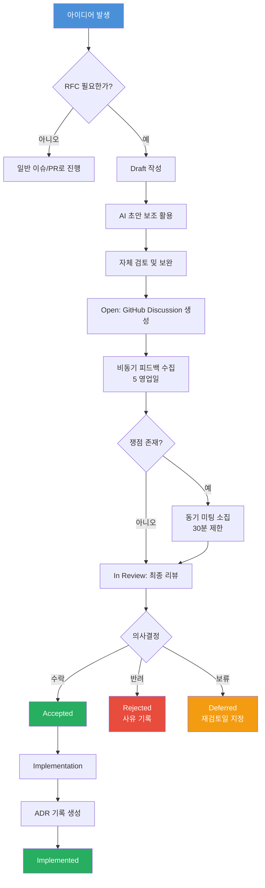
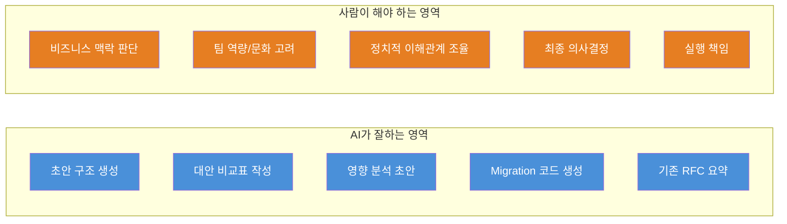
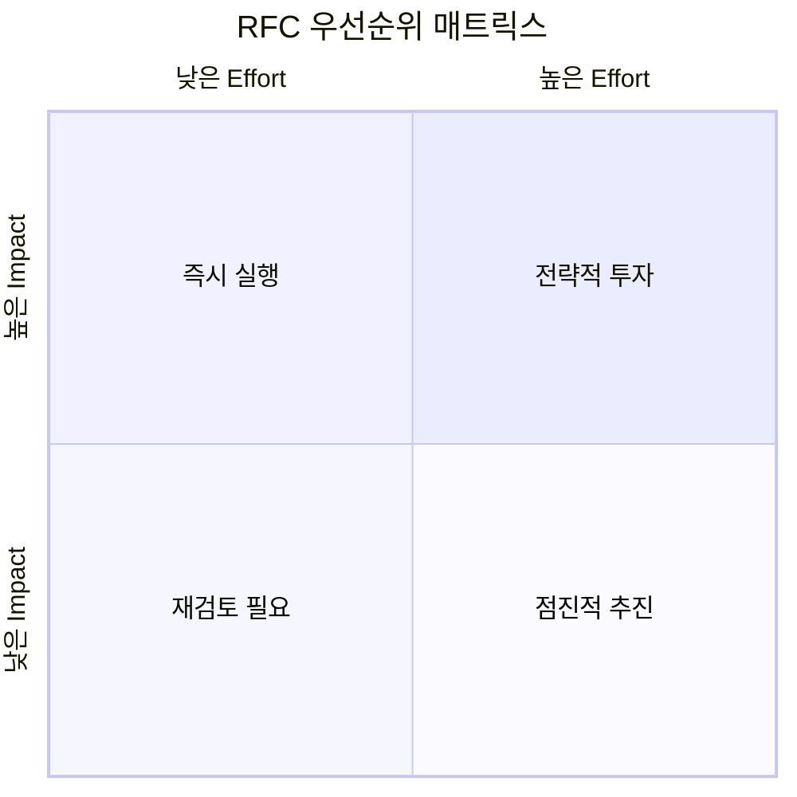
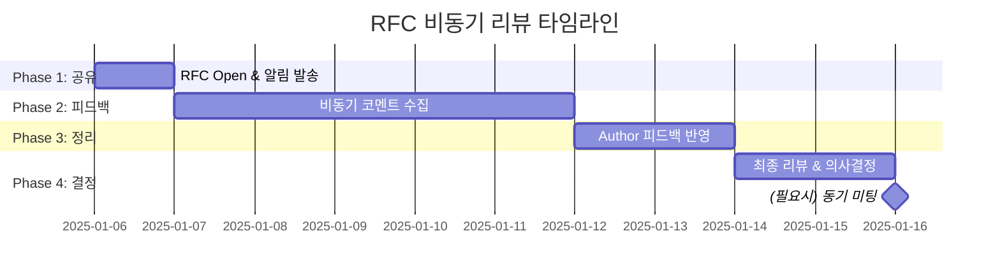
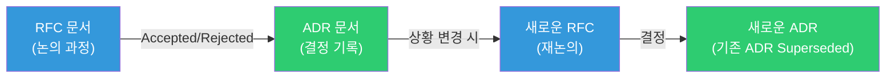

# Frontend RFC 프로세스 가이드 (2025-2026)

> 기술 의사결정의 투명성과 품질을 높이기 위한 체계적 RFC(Request for Comments) 운영 가이드

---

## 목차

1. [RFC란 무엇인가](#1-rfc란-무엇인가)
2. [RFC Lifecycle](#2-rfc-lifecycle)
3. [RFC 작성 템플릿](#3-rfc-작성-템플릿)
4. [AI-Assisted RFC 워크플로우](#4-ai-assisted-rfc-워크플로우)
5. [RFC 평가 및 우선순위 프레임워크](#5-rfc-평가-및-우선순위-프레임워크)
6. [비동기 우선 리뷰 프로세스](#6-비동기-우선-리뷰-프로세스)
7. [도구 및 자동화](#7-도구-및-자동화)
8. [ADR 연동](#8-adr-연동)
9. [실전 RFC 사례](#9-실전-rfc-사례)
10. [안티패턴과 트러블슈팅](#10-안티패턴과-트러블슈팅)

---

## 1. RFC란 무엇인가

### 1.1 정의

RFC(Request for Comments)는 프론트엔드 팀의 기술적 의사결정을 **문서화하고, 공유하고, 합의**하기 위한 공식 프로세스이다. 단순한 제안서가 아니라, 의사결정의 맥락(context)과 근거(rationale)를 조직의 자산으로 남기는 행위이다.

### 1.2 RFC가 필요한 경우

| 구분 | 예시 | RFC 필요 여부 |
|------|------|:---:|
| **아키텍처 변경** | 렌더링 전략 변경(CSR -> SSR), 모노레포 전환 | 필수 |
| **핵심 라이브러리 교체** | 상태 관리, 빌드 도구, 테스트 프레임워크 변경 | 필수 |
| **팀 전체 표준 도입** | 코드 스타일, 컴포넌트 설계 원칙, API 호출 패턴 | 필수 |
| **개발 프로세스 변경** | 브랜치 전략, 코드 리뷰 정책, 배포 파이프라인 | 권장 |
| **새로운 패턴 실험** | 서버 컴포넌트 도입, micro-frontend 검토 | 권장 |
| **소규모 개선** | 유틸 함수 추가, 단일 컴포넌트 리팩토링 | 불필요 |

### 1.3 핵심 원칙

- **Write things down** -- 구두 합의는 자산이 아니다
- **Disagree and commit** -- 충분한 논의 후에는 결정을 존중한다
- **Reversibility matters** -- 되돌리기 어려운 결정일수록 더 신중하게 논의한다
- **Bias for action** -- RFC가 실행을 가로막는 병목이 되어서는 안 된다

---

## 2. RFC Lifecycle

### 2.1 상태 정의

```
Draft -> Open -> In Review -> Accepted / Rejected / Deferred -> Implemented -> Superseded
```

| 상태 | 설명 | 기간 가이드 |
|------|------|-------------|
| `Draft` | 작성 중. 아직 공식 리뷰 요청 전 | 제한 없음 |
| `Open` | 리뷰 요청 완료. 팀원 피드백 수집 중 | 최대 5 영업일 |
| `In Review` | 핵심 이해관계자 리뷰 진행 중 | 최대 5 영업일 |
| `Accepted` | 합의 완료. 실행 단계로 진입 | - |
| `Rejected` | 반려. 사유와 대안 기록 | - |
| `Deferred` | 보류. 재검토 시점 명시 | 최대 90일 |
| `Implemented` | 구현 완료. ADR로 전환 | - |
| `Superseded` | 후속 RFC에 의해 대체됨 | - |

### 2.2 프로세스 흐름도



### 2.3 역할 정의

| 역할 | 책임 |
|------|------|
| **Author** | RFC 작성, 피드백 반영, 구현 리드 |
| **Reviewer** | 기술적 피드백 제공, 대안 제시 |
| **Shepherd** | 프로세스 진행 관리, 합의 도출 촉진 |
| **Stakeholder** | 영향받는 영역의 대표로서 승인/반대 의견 제시 |

---

## 3. RFC 작성 템플릿

### 3.1 기본 템플릿

```markdown
---
rfc_id: RFC-YYYY-NNN
title: "[제목]"
author: "[작성자]"
status: Draft
created: YYYY-MM-DD
updated: YYYY-MM-DD
shepherd: "[진행 담당자]"
stakeholders: ["팀A", "팀B"]
tags: [architecture, dx, performance]
---

# RFC-YYYY-NNN: [제목]

## 1. 요약 (Summary)
> 2-3문장으로 이 RFC가 제안하는 바를 설명한다.

## 2. 동기 (Motivation)
### 현재 상황
- 현재 어떤 방식으로 동작하고 있는가?
- 어떤 문제를 겪고 있는가?

### 해결하고자 하는 문제
- 구체적인 pain point를 나열한다
- 가능하면 정량적 데이터를 포함한다 (번들 크기, 빌드 시간, 에러율 등)

## 3. 상세 설계 (Detailed Design)
### 제안하는 접근 방식
- 기술적 상세 설명
- 코드 예시 (필요시)
- 영향받는 시스템/컴포넌트

### Migration 전략
- 단계별 전환 계획
- 병행 운영 기간
- Rollback 계획

## 4. 검토한 대안 (Alternatives Considered)
| 대안 | 장점 | 단점 | 미채택 사유 |
|------|------|------|-------------|
| 대안 A | ... | ... | ... |
| 대안 B | ... | ... | ... |

## 5. 영향 분석 (Impact Analysis)
### 긍정적 영향
- ...

### 위험 요소
- ...

### 호환성
- 기존 코드와의 호환성
- 브라우저 지원 범위
- 관련 의존성 영향

## 6. 실행 계획 (Implementation Plan)
- [ ] Phase 1: ...
- [ ] Phase 2: ...
- [ ] Phase 3: ...

### 예상 일정
| Phase | 기간 | 산출물 |
|-------|------|--------|
| Phase 1 | 2주 | ... |

## 7. 미해결 질문 (Open Questions)
- [ ] 질문 1
- [ ] 질문 2

## 8. 참고 자료 (References)
- [관련 문서 링크]
- [벤치마크 결과]
```

### 3.2 Lightweight RFC 템플릿 (소규모 변경용)

영향 범위가 작은 변경에는 간소화된 템플릿을 사용한다.

```markdown
---
rfc_id: RFC-YYYY-NNN
title: "[제목]"
author: "[작성자]"
status: Draft
created: YYYY-MM-DD
type: lightweight
---

# RFC-YYYY-NNN: [제목]

## 무엇을, 왜 (What & Why)
> 제안 내용과 동기를 간결하게 기술한다.

## 제안 (Proposal)
> 구체적인 변경 내용을 기술한다. 코드 예시를 포함할 수 있다.

## 고려한 대안 (Alternatives)
> 왜 다른 방법 대신 이 방법을 선택했는가?

## 체크리스트
- [ ] 기존 코드 호환성 확인
- [ ] 영향받는 팀 확인
- [ ] Rollback 가능 여부 확인
```

---

## 4. AI-Assisted RFC 워크플로우

### 4.1 AI 활용이 효과적인 RFC 작업

AI 도구(Claude, ChatGPT 등)는 RFC 프로세스의 여러 단계에서 생산성을 높여준다. 다만 AI 출력물은 반드시 사람이 검증해야 한다.



### 4.2 RFC 초안 생성 프롬프트 예시

RFC를 처음 작성할 때, AI에게 다음과 같은 구조화된 프롬프트를 제공하면 양질의 초안을 빠르게 얻을 수 있다.

```text
당신은 시니어 프론트엔드 아키텍트입니다.

다음 조건으로 RFC 초안을 작성해주세요:

## 맥락
- 현재 상태: [현재 사용 중인 기술/패턴]
- 문제점: [구체적 pain point]
- 팀 규모: [인원수]
- 코드베이스 규모: [대략적 크기]

## 요청 사항
1. 위 RFC 템플릿 형식에 맞춰 초안을 작성해주세요
2. 최소 3개의 대안을 비교 분석해주세요
3. 각 대안의 Migration 복잡도를 상/중/하로 평가해주세요
4. 현실적인 실행 계획을 Phase별로 나눠주세요

## 제약 조건
- 브라우저 지원 범위: [지원 범위]
- 사용 중인 프레임워크: [React/Vue/Angular 등]
- 번들 크기 제한: [있다면 명시]
```

### 4.3 AI 기반 영향 분석 (Impact Analysis)

기존 코드베이스에 대한 변경 영향을 AI로 사전 분석하는 워크플로우이다.

```bash
# 1. 영향받는 파일 목록 추출
grep -rl "import.*from 'old-library'" src/ > affected-files.txt

# 2. AI에게 영향 분석 요청 (CLI 도구 활용)
cat affected-files.txt | claude -p "
이 파일 목록은 old-library를 import하는 모든 파일입니다.
new-library로 마이그레이션할 때:
1. 각 파일의 변경 복잡도를 상/중/하로 분류해주세요
2. API 호환성이 깨지는 부분을 식별해주세요
3. 자동 변환이 가능한 패턴과 수동 변경이 필요한 패턴을 구분해주세요
"
```

### 4.4 AI 리뷰 보조

RFC 리뷰 시 AI를 활용하여 놓칠 수 있는 관점을 보완한다.

```text
다음 RFC를 리뷰해주세요. 특히 아래 관점에서 빠진 내용이 있는지 확인해주세요:

1. 보안 영향 (XSS, CSRF, CSP 등)
2. 접근성(a11y) 영향
3. 성능 회귀 가능성
4. 번들 크기 변화
5. 개발자 경험(DX) 변화
6. 테스트 전략 변경 필요성
7. 문서화 필요 사항

[RFC 내용 붙여넣기]
```

---

## 5. RFC 평가 및 우선순위 프레임워크

### 5.1 RICE 기반 RFC 스코어링

각 RFC를 객관적으로 평가하기 위해 RICE 프레임워크를 변형하여 사용한다.

| 평가 항목 | 설명 | 점수 범위 |
|-----------|------|-----------|
| **Reach** (영향 범위) | 몇 명의 개발자 / 몇 개의 프로젝트에 영향을 미치는가? | 1-5 |
| **Impact** (영향도) | DX, 성능, 유지보수성 개선 정도 | 1-5 |
| **Confidence** (확신도) | 제안의 성공 가능성에 대한 확신 | 0.5 / 0.8 / 1.0 |
| **Effort** (노력) | 구현에 필요한 인력-주(person-weeks) | 숫자 |

```
RFC Score = (Reach x Impact x Confidence) / Effort
```

### 5.2 스코어링 기준 상세

#### Reach (영향 범위)

| 점수 | 기준 |
|:---:|------|
| 1 | 단일 프로젝트 내 일부 기능 |
| 2 | 단일 프로젝트 전체 |
| 3 | 2-3개 프로젝트 |
| 4 | 대부분의 프로젝트 |
| 5 | 모든 프로젝트 + 외부 의존 시스템 |

#### Impact (영향도)

| 점수 | 기준 |
|:---:|------|
| 1 | 미미한 개선 (nice-to-have) |
| 2 | 소폭 개선 (개발 속도 10% 이내) |
| 3 | 의미 있는 개선 (개발 속도 10-30%) |
| 4 | 큰 개선 (개발 속도 30-50% 또는 심각한 문제 해결) |
| 5 | 혁신적 개선 (패러다임 변경 수준) |

### 5.3 우선순위 매트릭스



| 사분면 | 전략 |
|--------|------|
| **즉시 실행** (High Impact, Low Effort) | 바로 Accepted 처리하고 구현 착수 |
| **전략적 투자** (High Impact, High Effort) | 충분한 논의 후 Phase별 실행 계획 수립 |
| **점진적 추진** (Low Impact, High Effort) | Deferred 처리 후 분기별 재검토 |
| **재검토 필요** (Low Impact, Low Effort) | 정말 필요한지 재검토. 필요하면 빠르게 실행 |

---

## 6. 비동기 우선 리뷰 프로세스

분산 팀 환경에서 RFC 논의가 특정 시간대나 미팅에 의존하지 않도록 비동기 우선(async-first) 원칙을 적용한다.

### 6.1 비동기 리뷰 원칙

```
1. 글로 먼저 쓴다 (Write-first)
2. 충분한 시간을 준다 (최소 3 영업일)
3. 의견에는 근거를 붙인다 (Opinion + Evidence)
4. 동기 미팅은 교착 상태 해소용으로만 사용한다
```

### 6.2 리뷰 타임라인



### 6.3 효과적인 비동기 피드백 작성법

리뷰어는 자신의 피드백을 다음 라벨 중 하나로 분류하여 작성한다.

| 라벨 | 의미 | 예시 |
|------|------|------|
| `[MUST]` | 이 부분이 해결되지 않으면 수락 불가 | `[MUST] SSR 환경에서의 hydration mismatch 대응이 빠져있습니다` |
| `[SHOULD]` | 강하게 권장하지만 blocking은 아님 | `[SHOULD] 에러 바운더리 전략도 함께 정의하면 좋겠습니다` |
| `[CONSIDER]` | 고려해볼 만한 제안 | `[CONSIDER] Zustand 외에 Jotai도 비교 대상에 포함해보면 어떨까요?` |
| `[QUESTION]` | 이해를 위한 질문 | `[QUESTION] 기존 Redux 코드와의 병행 운영 기간은 어느 정도로 예상하시나요?` |
| `[PRAISE]` | 좋은 점에 대한 인정 | `[PRAISE] Migration 전략이 매우 현실적이고 단계적이어서 좋습니다` |

### 6.4 의사결정 규칙

| 조건 | 결과 |
|------|------|
| `MUST` 코멘트가 0건이고, Stakeholder 과반수 동의 | **Accepted** |
| `MUST` 코멘트가 존재하지만 Author가 모두 해소 | **재리뷰 후 Accepted** |
| `MUST` 코멘트에 대한 합의 불가 | **동기 미팅 소집 (30분 제한)** |
| 리뷰 기간 내 응답 부재 (Stakeholder 과반수 미참여) | **기간 연장 3 영업일** |
| 연장 후에도 응답 부재 | **참여자 기준으로 결정 진행** |

---

## 7. 도구 및 자동화

### 7.1 GitHub Discussions 기반 RFC 관리

GitHub Discussions를 RFC 논의의 중심 플랫폼으로 사용한다.

#### Discussion Category 설정

```
RFC/
  ├── Draft        (초안 공유)
  ├── Open         (리뷰 진행 중)
  ├── Accepted     (수락됨)
  ├── Rejected     (반려됨)
  └── Deferred     (보류됨)
```

#### Label 체계

```
rfc/status:draft
rfc/status:open
rfc/status:accepted
rfc/status:rejected
rfc/status:deferred
rfc/status:implemented

rfc/area:architecture
rfc/area:dx
rfc/area:performance
rfc/area:testing
rfc/area:styling
rfc/area:state-management
rfc/area:build-tooling

rfc/size:small      (1주 이내)
rfc/size:medium     (1-4주)
rfc/size:large      (1개월 이상)
```

### 7.2 자동화된 RFC Tracking

GitHub Actions를 활용하여 RFC 상태를 자동으로 추적하고 알림을 보낸다.

```yaml
# .github/workflows/rfc-tracker.yml
name: RFC Status Tracker

on:
  discussion:
    types: [created, edited, category_changed, labeled]
  schedule:
    - cron: '0 9 * * 1'  # 매주 월요일 오전 9시

jobs:
  track-rfc:
    runs-on: ubuntu-latest
    steps:
      - name: Check stale RFCs
        uses: actions/github-script@v7
        with:
          script: |
            const discussions = await github.graphql(`
              query {
                repository(owner: context.repo.owner, name: context.repo.repo) {
                  discussions(
                    categoryId: "RFC_CATEGORY_ID",
                    first: 50,
                    orderBy: { field: UPDATED_AT, direction: DESC }
                  ) {
                    nodes {
                      id
                      title
                      updatedAt
                      labels(first: 10) {
                        nodes { name }
                      }
                    }
                  }
                }
              }
            `);

            const now = new Date();
            const staleThreshold = 14; // 14일 이상 업데이트 없으면 stale

            for (const d of discussions.repository.discussions.nodes) {
              const daysSinceUpdate =
                (now - new Date(d.updatedAt)) / (1000 * 60 * 60 * 24);

              const isOpen = d.labels.nodes
                .some(l => l.name === 'rfc/status:open');

              if (isOpen && daysSinceUpdate > staleThreshold) {
                console.log(`Stale RFC: ${d.title} (${daysSinceUpdate.toFixed(0)} days)`);
                // Slack/Discord 알림 전송 로직
              }
            }

      - name: Generate weekly RFC digest
        uses: actions/github-script@v7
        with:
          script: |
            // 주간 RFC 현황 요약 생성
            const summary = {
              new: [],      // 이번 주 신규
              updated: [],  // 이번 주 업데이트
              decided: [],  // 이번 주 결정됨
              stale: []     // 정체 중
            };
            console.log('Weekly RFC Digest:', JSON.stringify(summary, null, 2));
```

### 7.3 RFC 번호 자동 채번

```bash
#!/bin/bash
# scripts/new-rfc.sh
# 새 RFC 생성 스크립트

YEAR=$(date +%Y)
EXISTING=$(ls docs/rfcs/${YEAR}-*.md 2>/dev/null | wc -l | tr -d ' ')
NEXT_NUM=$(printf "%03d" $((EXISTING + 1)))
RFC_ID="RFC-${YEAR}-${NEXT_NUM}"
FILENAME="docs/rfcs/${YEAR}-${NEXT_NUM}-$(echo "$1" | tr ' ' '-' | tr '[:upper:]' '[:lower:]').md"

cat > "$FILENAME" << EOF
---
rfc_id: ${RFC_ID}
title: "$1"
author: "$(git config user.name)"
status: Draft
created: $(date +%Y-%m-%d)
updated: $(date +%Y-%m-%d)
shepherd: ""
stakeholders: []
tags: []
---

# ${RFC_ID}: $1

## 1. 요약 (Summary)

## 2. 동기 (Motivation)

## 3. 상세 설계 (Detailed Design)

## 4. 검토한 대안 (Alternatives Considered)

## 5. 영향 분석 (Impact Analysis)

## 6. 실행 계획 (Implementation Plan)

## 7. 미해결 질문 (Open Questions)

## 8. 참고 자료 (References)
EOF

echo "Created: ${FILENAME}"
echo "RFC ID: ${RFC_ID}"
```

사용법:

```bash
./scripts/new-rfc.sh "Zustand 기반 상태 관리 전환"
# -> docs/rfcs/2025-001-zustand-기반-상태-관리-전환.md
```

---

## 8. ADR 연동

### 8.1 RFC와 ADR의 관계

RFC가 **의사결정 과정**을 담는다면, ADR(Architecture Decision Record)은 **의사결정 결과**를 담는다. RFC가 Accepted 또는 Rejected 상태가 되면 ADR을 생성한다.



### 8.2 ADR 템플릿

```markdown
---
adr_id: ADR-YYYY-NNN
title: "[결정 제목]"
status: Accepted | Superseded by ADR-YYYY-NNN
date: YYYY-MM-DD
rfc_ref: RFC-YYYY-NNN
---

# ADR-YYYY-NNN: [결정 제목]

## 상태 (Status)
Accepted

## 맥락 (Context)
[이 결정이 필요했던 배경. RFC의 Motivation 섹션 요약]

## 결정 (Decision)
[무엇을 결정했는가. 핵심만 간결하게]

## 근거 (Rationale)
[왜 이 결정을 내렸는가. 검토한 대안 대비 선택 이유]

## 결과 (Consequences)
### 긍정적
- ...

### 부정적
- ...

### 중립적
- ...
```

### 8.3 디렉토리 구조

```
docs/
├── rfcs/
│   ├── 2025-001-state-management-migration.md
│   ├── 2025-002-build-tool-migration.md
│   └── 2025-003-design-system-adoption.md
├── adrs/
│   ├── 2025-001-adopt-zustand-for-state-management.md
│   ├── 2025-002-migrate-to-vite.md
│   └── 2025-003-adopt-internal-design-system.md
└── templates/
    ├── rfc-template.md
    ├── rfc-lightweight-template.md
    └── adr-template.md
```

---

## 9. 실전 RFC 사례

### 9.1 사례: 상태 관리 라이브러리 전환

```markdown
---
rfc_id: RFC-2025-012
title: "Redux에서 Zustand로 전역 상태 관리 전환"
status: Accepted
created: 2025-03-01
---

# RFC-2025-012: Redux에서 Zustand로 전역 상태 관리 전환

## 요약
현재 Redux + Redux Toolkit 기반의 전역 상태 관리를 Zustand로 단계적으로
전환한다. 보일러플레이트 감소, 번들 크기 축소, 개발 생산성 향상을 목표로 한다.

## 동기
### 현재 상황
- Redux store 파일 142개, 총 slice 38개 운영 중
- 새로운 feature 하나에 action/reducer/selector/thunk 등 평균 5개 파일 생성 필요
- Redux DevTools 외 디버깅 도구 부재

### 문제점
- 신규 개발자 온보딩 시 Redux 패턴 학습에 평균 2주 소요
- 보일러플레이트 코드가 전체 상태 관리 코드의 약 40% 차지
- redux 관련 패키지 번들 크기: 약 42KB (gzipped)

## 상세 설계
### Zustand Store 설계 원칙

기존 Redux 코드:

```typescript
// store/userSlice.ts (Redux)
import { createSlice, createAsyncThunk } from '@reduxjs/toolkit';

export const fetchUser = createAsyncThunk(
  'user/fetch',
  async (userId: string) => {
    const response = await api.getUser(userId);
    return response.data;
  }
);

const userSlice = createSlice({
  name: 'user',
  initialState: { data: null, loading: false, error: null },
  reducers: {
    clearUser: (state) => { state.data = null; },
  },
  extraReducers: (builder) => {
    builder
      .addCase(fetchUser.pending, (state) => { state.loading = true; })
      .addCase(fetchUser.fulfilled, (state, action) => {
        state.loading = false;
        state.data = action.payload;
      })
      .addCase(fetchUser.rejected, (state, action) => {
        state.loading = false;
        state.error = action.error.message ?? null;
      });
  },
});

// 컴포넌트에서 사용
const user = useSelector((state: RootState) => state.user.data);
const dispatch = useDispatch();
dispatch(fetchUser('123'));
```

전환 후 Zustand 코드:

```typescript
// stores/useUserStore.ts (Zustand)
import { create } from 'zustand';
import { devtools } from 'zustand/middleware';

interface UserState {
  data: User | null;
  loading: boolean;
  error: string | null;
  fetchUser: (userId: string) => Promise<void>;
  clearUser: () => void;
}

export const useUserStore = create<UserState>()(
  devtools(
    (set) => ({
      data: null,
      loading: false,
      error: null,

      fetchUser: async (userId: string) => {
        set({ loading: true, error: null });
        try {
          const response = await api.getUser(userId);
          set({ data: response.data, loading: false });
        } catch (error) {
          set({ error: error.message, loading: false });
        }
      },

      clearUser: () => set({ data: null }),
    }),
    { name: 'user-store' }
  )
);

// 컴포넌트에서 사용
const { data: user, fetchUser } = useUserStore();
fetchUser('123');
```

### Migration 전략

Phase 1 (2주): 신규 feature는 Zustand로 작성
Phase 2 (4주): 독립된 소규모 store부터 순차 전환 (10개)
Phase 3 (6주): 나머지 store 전환 + 통합 테스트
Phase 4 (2주): Redux 완전 제거 및 정리

## 검토한 대안
| 대안 | 장점 | 단점 | 미채택 사유 |
|------|------|------|-------------|
| Jotai | 원자적 상태 관리, 작은 번들 | 러닝커브, 대규모 store 관리 복잡 | 기존 store 구조와 패러다임 차이가 큼 |
| Valtio | proxy 기반 직관적 API | 생태계 상대적으로 작음 | 프로덕션 레퍼런스 부족 |
| Redux 유지 + 개선 | 전환 비용 없음 | 근본적 문제 해결 안 됨 | 보일러플레이트 문제 지속 |

## RICE 스코어
- Reach: 5 (모든 프로젝트)
- Impact: 3 (의미 있는 DX 개선)
- Confidence: 0.8
- Effort: 4 person-weeks
- **Score: 3.0**
```

### 9.2 사례: 빌드 도구 전환

```markdown
---
rfc_id: RFC-2025-018
title: "webpack에서 Vite로 빌드 도구 전환"
status: Accepted
---

# RFC-2025-018: webpack에서 Vite로 빌드 도구 전환

## 요약
모든 프론트엔드 프로젝트의 빌드 도구를 webpack 5에서 Vite 6으로 전환한다.
로컬 개발 서버 시작 시간과 HMR 속도를 대폭 개선하여 개발자 경험을 향상시킨다.

## 동기
### 정량적 데이터
| 지표 | webpack 5 (현재) | Vite 6 (PoC 측정) | 개선율 |
|------|:-:|:-:|:-:|
| Cold start | 48초 | 1.2초 | 97.5% |
| HMR | 3.2초 | 0.1초 | 96.9% |
| Production build | 180초 | 95초 | 47.2% |
| 번들 크기 | 2.1MB | 1.8MB | 14.3% |

## 상세 설계
### Vite 설정 기본 구조

```typescript
// vite.config.ts
import { defineConfig } from 'vite';
import react from '@vitejs/plugin-react-swc';
import tsconfigPaths from 'vite-tsconfig-paths';
import { visualizer } from 'rollup-plugin-visualizer';

export default defineConfig(({ mode }) => ({
  plugins: [
    react(),
    tsconfigPaths(),
    mode === 'analyze' && visualizer({
      open: true,
      gzipSize: true,
    }),
  ],
  build: {
    rollupOptions: {
      output: {
        manualChunks: {
          vendor: ['react', 'react-dom'],
          router: ['react-router-dom'],
        },
      },
    },
    sourcemap: mode !== 'production',
  },
  server: {
    proxy: {
      '/api': {
        target: 'http://localhost:8080',
        changeOrigin: true,
      },
    },
  },
}));
```

### webpack 커스텀 설정 대응표
| webpack 설정 | Vite 대응 | 비고 |
|---|---|---|
| `DefinePlugin` | `define` 옵션 | 자동 지원 |
| `HtmlWebpackPlugin` | 내장 지원 | index.html 루트 배치 |
| `CopyWebpackPlugin` | `public/` 디렉토리 | 자동 복사 |
| `webpack-dev-server proxy` | `server.proxy` | 설정 유사 |
| `Module Federation` | `@originjs/vite-plugin-federation` | 플러그인 필요 |
```

### 9.3 사례: Design System 도입

```markdown
---
rfc_id: RFC-2025-024
title: "통합 Design System 도입 및 적용 전략"
status: Accepted
---

# RFC-2025-024: 통합 Design System 도입

## 요약
프로젝트별로 산재된 UI 컴포넌트를 통합 Design System 패키지로 일원화한다.
일관된 사용자 경험, 중복 코드 제거, 디자인-개발 간 소통 비용 감소를 목표로 한다.

## 동기
### 현재 문제
- Button 컴포넌트가 5개 프로젝트에 각각 다른 구현으로 존재
- 동일한 디자인 수정에 5곳 동시 반영 필요
- 디자이너-개발자 간 컴포넌트 명칭/규격 불일치

## 상세 설계
### 패키지 구조

```
packages/
├── design-tokens/        # 디자인 토큰 (색상, 타이포, 스페이싱)
│   ├── tokens.json       # Figma에서 추출한 원본
│   └── generated/        # 빌드된 CSS/TS 변수
├── ui-components/        # React 컴포넌트
│   ├── src/
│   │   ├── Button/
│   │   │   ├── Button.tsx
│   │   │   ├── Button.test.tsx
│   │   │   ├── Button.stories.tsx
│   │   │   └── index.ts
│   │   └── ...
│   └── package.json
└── ui-icons/             # 아이콘 컴포넌트
```

### 컴포넌트 설계 원칙

```tsx
// Compound Component 패턴 적용 예시
import { Tabs } from '@shared/ui-components';

function SettingsPage() {
  return (
    <Tabs defaultValue="general">
      <Tabs.List>
        <Tabs.Trigger value="general">일반</Tabs.Trigger>
        <Tabs.Trigger value="security">보안</Tabs.Trigger>
        <Tabs.Trigger value="notifications">알림</Tabs.Trigger>
      </Tabs.List>
      <Tabs.Content value="general">
        <GeneralSettings />
      </Tabs.Content>
      <Tabs.Content value="security">
        <SecuritySettings />
      </Tabs.Content>
      <Tabs.Content value="notifications">
        <NotificationSettings />
      </Tabs.Content>
    </Tabs>
  );
}
```

### 도입 전략
Phase 1: 디자인 토큰 추출 및 패키지 구성 (2주)
Phase 2: 핵심 컴포넌트 10종 개발 (Button, Input, Modal 등) (4주)
Phase 3: Storybook 문서화 및 Chromatic 시각적 테스트 연동 (2주)
Phase 4: 파일럿 프로젝트 1개 적용 (2주)
Phase 5: 전체 프로젝트 순차 적용 (8주)
```

### 9.4 사례: 테스트 전략 수립

```markdown
---
rfc_id: RFC-2025-031
title: "프론트엔드 테스트 전략 표준화"
status: Accepted
---

# RFC-2025-031: 프론트엔드 테스트 전략 표준화

## 요약
테스트 피라미드를 프론트엔드에 맞게 재정의하고, 도구 선택과 커버리지
기준을 표준화한다.

## 상세 설계
### 테스트 트로피 (Testing Trophy) 채택

```
          ╱ ╲               E2E (Playwright)
         ╱   ╲              소수의 핵심 사용자 시나리오
        ╱─────╲
       ╱       ╲            Integration (Vitest + Testing Library)
      ╱         ╲           컴포넌트 간 상호작용, 페이지 단위
     ╱───────────╲
    ╱             ╲         Unit (Vitest)
   ╱               ╲        유틸, 훅, 순수 로직
  ╱─────────────────╲
 ╱                   ╲      Static (TypeScript + ESLint)
╱─────────────────────╲     타입 검사, 린트 규칙
```

### 도구 선택

| 계층 | 도구 | 용도 |
|------|------|------|
| Static | TypeScript (strict mode) | 타입 안전성 |
| Static | ESLint + custom rules | 코드 품질 |
| Unit | Vitest | 유틸, 훅, 순수 함수 |
| Integration | Vitest + React Testing Library | 컴포넌트 통합 테스트 |
| E2E | Playwright | 핵심 사용자 플로우 |
| Visual | Chromatic | 시각적 회귀 테스트 |

### 커버리지 기준

| 계층 | 목표 커버리지 | 필수 대상 |
|------|:---:|------|
| Unit | 80% | 공유 유틸, custom hooks |
| Integration | 핵심 시나리오 100% | 폼 제출, 인증 플로우, 결제 |
| E2E | 핵심 경로 100% | 회원가입, 로그인, 주요 CRUD |

### 테스트 작성 가이드

```tsx
// 좋은 통합 테스트 예시: 사용자 행위 중심
import { render, screen } from '@testing-library/react';
import userEvent from '@testing-library/user-event';
import { LoginForm } from './LoginForm';

describe('LoginForm', () => {
  it('유효한 이메일과 비밀번호 입력 후 제출하면 onSubmit이 호출된다', async () => {
    const user = userEvent.setup();
    const handleSubmit = vi.fn();

    render(<LoginForm onSubmit={handleSubmit} />);

    await user.type(
      screen.getByLabelText('이메일'),
      'user@example.com'
    );
    await user.type(
      screen.getByLabelText('비밀번호'),
      'securePassword123'
    );
    await user.click(
      screen.getByRole('button', { name: '로그인' })
    );

    expect(handleSubmit).toHaveBeenCalledWith({
      email: 'user@example.com',
      password: 'securePassword123',
    });
  });

  it('이메일 형식이 잘못되면 에러 메시지를 표시한다', async () => {
    const user = userEvent.setup();

    render(<LoginForm onSubmit={vi.fn()} />);

    await user.type(screen.getByLabelText('이메일'), 'invalid');
    await user.click(screen.getByRole('button', { name: '로그인' }));

    expect(
      screen.getByText('올바른 이메일 형식을 입력해주세요')
    ).toBeInTheDocument();
  });
});
```
```

---

## 10. 안티패턴과 트러블슈팅

### 10.1 RFC 안티패턴

| 안티패턴 | 증상 | 해결책 |
|----------|------|--------|
| **Ghost RFC** | 작성 후 아무도 리뷰하지 않음 | Shepherd 지정 의무화, 리뷰 기한 설정 |
| **Bikeshedding** | 사소한 부분에서 논의가 길어짐 | 30분 타임박스 미팅으로 전환, Shepherd가 중재 |
| **LGTM Rubber Stamp** | 내용을 읽지 않고 승인 | 최소 1개의 구체적 피드백 의무화 |
| **RFC as Blocker** | RFC 프로세스가 실행을 과도하게 지연 | Lightweight RFC 도입, 크기별 프로세스 차등 |
| **결론 없는 RFC** | Open 상태로 몇 달째 방치 | 자동 stale 알림, 14일 이상 방치 시 Deferred 전환 |
| **Author 독주** | 피드백을 무시하고 원안 고수 | Shepherd가 합의 과정 중재, 투표 절차 활용 |

### 10.2 FAQ

**Q: 긴급한 기술 결정도 RFC를 거쳐야 하나요?**

긴급 상황에서는 먼저 결정하고 실행한 뒤, 사후에 RFC를 작성한다. 단, 이 경우 RFC 상태를 `Retrospective`로 표기하고 결정 배경과 시간 제약을 명시한다.

**Q: RFC가 Rejected되면 같은 주제로 다시 제출할 수 있나요?**

가능하다. 단, 이전 RFC에서 제기된 반대 의견을 어떻게 해소했는지 명시해야 한다. 최소 30일 이후 재제출을 권장한다.

**Q: 누가 RFC의 최종 결정권을 가지나요?**

원칙적으로 합의(consensus) 기반이다. 합의에 도달하지 못할 경우, Shepherd가 Stakeholder 의견을 종합하여 최종 결정한다. 결정에 동의하지 않더라도 "disagree and commit" 원칙에 따라 결정을 존중한다.

**Q: PoC(Proof of Concept) 없이 RFC를 제출해도 되나요?**

가능하지만, 기술적 실현 가능성에 대한 의문이 제기될 수 있다. Impact가 큰 RFC일수록 PoC 결과나 벤치마크 데이터를 포함하는 것을 강력히 권장한다.

**Q: RFC 템플릿을 꼭 그대로 따라야 하나요?**

템플릿은 가이드라인이다. 핵심은 **동기, 제안, 대안 비교, 영향 분석**이 포함되는 것이다. Lightweight RFC 템플릿을 활용하거나, 필요한 섹션을 자유롭게 조정할 수 있다.

---

## 부록: 빠른 참조 체크리스트

### RFC Author 체크리스트

```
RFC 작성 전
  [ ] RFC가 필요한 변경인지 확인 (섹션 1.2 참조)
  [ ] 관련 기존 RFC/ADR 검색

RFC 작성 중
  [ ] 동기와 문제 정의가 명확한가?
  [ ] 최소 2개 이상의 대안을 비교했는가?
  [ ] 정량적 데이터(벤치마크, 번들 크기 등)를 포함했는가?
  [ ] Migration 전략과 Rollback 계획이 있는가?
  [ ] 미해결 질문을 명시했는가?

RFC 제출 후
  [ ] Shepherd를 지정했는가?
  [ ] Stakeholder에게 알림을 보냈는가?
  [ ] 리뷰 기한을 설정했는가?
  [ ] 피드백에 3 영업일 이내 응답하고 있는가?
```

### RFC Reviewer 체크리스트

```
리뷰 시
  [ ] 피드백에 라벨을 붙였는가? (MUST/SHOULD/CONSIDER/QUESTION)
  [ ] 반대 의견에 구체적 근거를 제시했는가?
  [ ] 대안을 제시할 때 trade-off도 함께 설명했는가?
  [ ] 좋은 점에 대한 인정(PRAISE)도 포함했는가?
```
