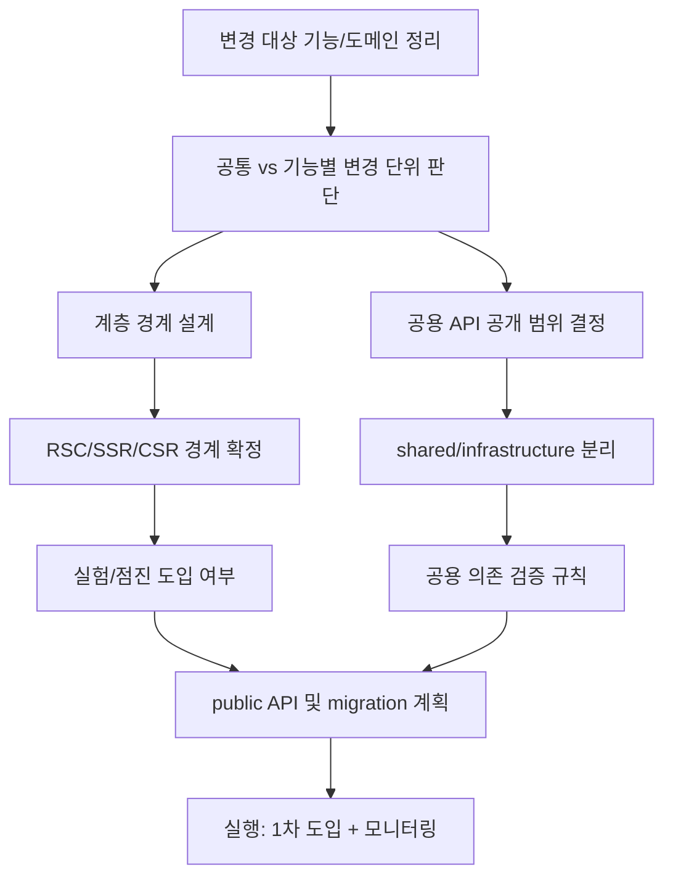
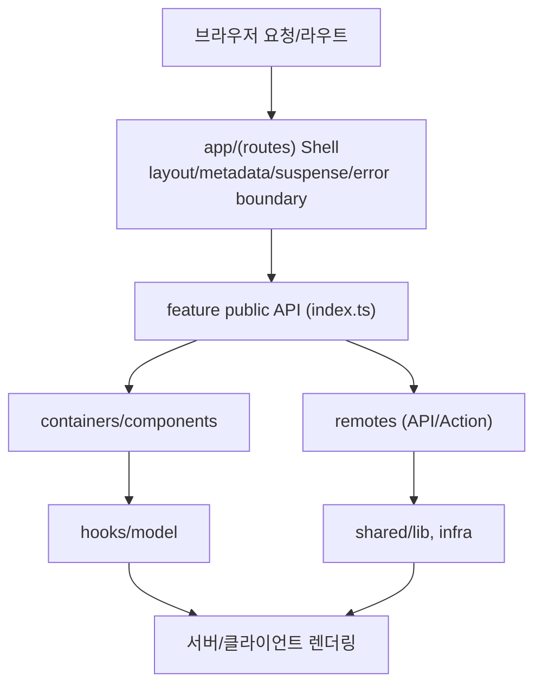

# 04. 아키텍처 설계 패턴

> **쉽게 읽기 안내**: 이 문서는 전문 용어가 많을 수 있어요.
> 이해가 어려우면 [공통 용어사전](./00_개발가이드_용어사전.md)에서 먼저 용어 뜻을 확인하고 본문을 이어서 읽으면 이해가 훨씬 빨라집니다.
> 특히 실무에서 자주 쓰이는 `배포`, `CI/CD`, `롤백`, `스키마`처럼 동작이 중요한 용어부터 먼저 익혀보세요.
## 0. 먼저 알고 가기 (30초 요약)

- 기능을 어디에 두는지부터 정하면, 구조 변경 폭발을 줄일 수 있습니다.
- 공유 규칙은 빨리 정하고, 공유 범위는 작게 시작하세요.
- 의존 경계가 분명하면 새 기능 추가 시 영향 범위가 줄어듭니다.

## 초심자용 한눈에 보기

이 문서는 파일을 기능 단위로 배치해 변경 범위를 줄이는 방법을 다룹니다.

### 핵심 용어 빠르게 정리

| 용어 | 쉬운 뜻 |
| --- | --- |
| `기능 단위` | feature 단위로 관련 코드(컴포넌트/API/테스트)를 같이 묶는 기준 |
| `공유 레이어` | 여러 기능이 같이 쓰는 코드만 올려두는 계층 |
| `import` 경계 | 의존을 어디에서 참조할지 제한해 결합도를 낮추는 규칙 |
| `deep import` | 내부 파일 경로를 깊게 직접 참조하는 방식(과하게 쓰면 위험) |
| `public API` | 밖으로 노출할 공개 진입점 |


`
| 분류 | 아키텍처 | 상태 | Stable |
| :--- | :--- | :--- | :--- |
| **연관 가이드** | [02. React 19](./02_React19_실무_가이드.md), [07. 테스팅](./07_테스팅_가이드.md), [03. 상태관리](./03_상태관리_패턴_가이드.md) | **도구 원칙** | 벤더 중립 |
| **핵심 테마** | 기능 중심 co-location, 변경 단위 기반 폴더 구조, Public API, RSC 계층 설계, PPR | **Update** | 최신 기준 |

---

> **"좋은 아키텍처는 함께 바뀌는 파일을 함께 찾고, 함께 검증하고, 함께 삭제할 수 있게 만든다."**
> 본 가이드는 파일 종류가 아니라 변경 단위와 의존 경계를 기준으로 프론트엔드 구조를 설계하는 기준을 제시합니다.

---


## 추천 항목 (실무 우선순위)

- **시작 추천**: 기능 단위 기준으로 폴더를 다시 나누고, public API를 가장 밖에만 노출합니다.
- **안정 추천**: import 경계를 lint 규칙으로 강제하고 불필요한 deep import를 줄입니다.
- **운영 추천**: 변경 시마다 문서 책임이 바뀌는지 체크해 01/03/07 문서와 같이 연쇄 규칙을 갱신합니다.


## 추천 항목 고도화 체크

- `즉시 적용` — 추천 항목 1개를 이번 주 내에 실제 작업 1건에 반영한다.
- `1주 내 정리` — 적용 결과를 PR 본문이나 회고 노트에 간단히 기록한다.
- `1개월 내 점검` — 재작업률/리뷰 충돌/배포 이슈 중 적어도 한 항목이 개선되었는지 확인한다.

## 문서 책임 범위

| 이 문서가 결정하는 것 | 단일 출처로 따르는 문서 |
| :--- | :--- |
| 계층 경계, public API, feature slice, module dependency rule | [22. 모노레포](./22_모노레포_운영_가이드.md), [11. CI/CD](./11_CICD_파이프라인_표준.md) |
| Server/Client/RSC/SSR/CSR 경계 설계 | [02. React 19](./02_React19_실무_가이드.md), [08. 성능](./08_성능_최적화_가이드.md) |
| MFE, monorepo, package boundary의 선택 기준 | [21. 마이크로 프론트엔드](./21_마이크로_프론트엔드_가이드.md), [22. 모노레포](./22_모노레포_운영_가이드.md) |
| 되돌리기 어려운 구조 변경의 승인/폐기 기준 | [15. RFC 의사결정 프로세스](./15_RFC_의사결정_프로세스.md) |

---

## 0. 모든 프론트엔드 그룹 공통 기술 표준

기술 표준은 특정 회사의 취향이 아니라 **변경 비용, 장애 격리, 협업 가능성**을 낮추는 최소 합의입니다.

| 기준 | 최소 적용 |
| :--- | :--- |
| **계층 경계** | 라우트, 기능, 도메인, 공유 코드의 책임을 분리하고 역방향 의존을 린트로 차단합니다. |
| **공용 API** | 모듈 외부 노출은 `index.ts` 또는 명시된 public API로 제한하고 내부 파일 deep import를 금지합니다. |
| **계약 우선** | API, 이벤트, URL, 환경 변수, feature flag는 타입과 런타임 검증이 가능한 계약으로 관리합니다. |
| **실험 기능 격리** | 신규 프레임워크 기능, AI 생성 코드, 대규모 리팩터링은 feature flag 또는 별도 slice로 격리합니다. |
| **운영 경계** | 로깅, 에러 바운더리, fallback UI, 권한 실패, 네트워크 실패를 아키텍처 설계에 포함합니다. |
| **문서화 기준** | 새 표준은 RFC/ADR로 배경, 대안, 결정, 철회 조건을 남깁니다. |

### 0.0 아키텍처 의사결정 시작점



### 0.1 교차 검증 매트릭스

| 권고 | 1차 출처 | 실행 증거 | 운영 증거 | 철회 조건 |
| :--- | :--- | :--- | :--- | :--- |
| 계층 경계는 문서가 아니라 lint/graph로 강제한다 | FSD/Clean Architecture 공식 원칙, 패키지 매니저 workspace 기능 | import boundary lint, circular dependency check | 변경 영향 범위, 리뷰 지연 시간 | 경계 규칙이 실제 변경 속도보다 높은 유지비를 만들 때 |
| public API를 통하지 않는 deep import를 금지한다 | 모듈 시스템/번들러 공식 문서 | forbidden import rule, package export test | tree-shaking 실패, breaking change 빈도 | shared 내부 API가 안정 계약으로 승격될 때 |
| 실험 기능은 feature flag와 slice 경계 안에 둔다 | 프레임워크 release note, RFC/ADR | flag on/off E2E, rollback rehearsal | 실험별 error rate, adoption funnel | 공식 stable이 되고 rollback 필요성이 사라질 때 |
| RSC/SSR/CSR 경계는 데이터 소유권 기준으로 결정한다 | React/프레임워크 공식 문서 | hydration mismatch test, bundle 분석 | TTFB, LCP, client JS size | 서버 비용이나 상호작용 지연이 UX 목표를 넘을 때 |

### 0.2 운영 게이트

| Gate | Evidence | Owner | Rollback |
| :--- | :--- | :--- | :--- |
| Boundary lint gate | import rule report, dependency graph | Architecture owner | exception allowlist에 만료일 부여 |
| Public API gate | export map diff, consumer smoke | Package owner | internal import 차단 rule 복구 |
| Architecture RFC gate | alternatives, migration plan, exit criteria | Tech lead | 이전 folder boundary 유지 |
| Shared component gate | story, accessibility smoke, domain dependency check | Design system owner | domain-specific component로 이동 |

### 0.3 기본값: 기능 중심 co-location

이 문서의 기본값은 엄격한 6계층 분리가 아니라 **기능 중심 co-location**입니다. 컴포넌트, hook, remote call, 타입, 상수, MSW handler, 테스트가 같은 이유로 바뀐다면 같은 feature/domain 폴더 아래에 둡니다. 라우트는 얇은 조합 계층으로 유지하고, 실제 변경 책임은 domain feature가 가집니다.

```
src/
├── app/
│   ├── (routes)/                 # 라우트, layout, loading, error
│   └── providers/                # 전역 provider 조합
├── domains/
│   ├── account/
│   │   ├── list/
│   │   │   ├── components/
│   │   │   ├── hooks/
│   │   │   ├── remotes/
│   │   │   ├── model/
│   │   │   ├── mocks/
│   │   │   ├── tests/
│   │   │   └── index.ts
│   │   └── transfer/
│   │       ├── components/
│   │       ├── hooks/
│   │       ├── remotes/
│   │       ├── model/
│   │       ├── mocks/
│   │       ├── tests/
│   │       └── index.ts
│   └── profile/
│       └── edit/
├── shared/
│   ├── ui/                       # 도메인 단어가 없는 디자인 시스템 컴포넌트
│   ├── lib/                      # 순수 유틸, formatter, invariant
│   └── config/                   # 앱 전역 상수와 feature flag 계약
└── infrastructure/
    ├── http/                     # 인증 HTTP client, retry, error mapping
    ├── analytics/                # logging adapter
    └── storage/                  # browser/server storage adapter
```

| 배치 위치 | 넣는 코드 | 리뷰 질문 |
| :--- | :--- | :--- |
| `app/(routes)` | URL, layout, metadata, server/client 조합 | 라우트가 기능 구현을 직접 떠안지 않는가? |
| `domains/{domain}/{feature}` | 해당 기능의 UI, hook, remote call, query, mutation, model, MSW handler, 테스트 | 이 기능을 삭제할 때 폴더 하나를 지우면 충분한가? |
| `shared/ui` | 도메인 단어가 없는 재사용 UI | props가 특정 업무 흐름을 암시하지 않는가? |
| `shared/lib` | 순수 함수, formatter, parser | 외부 side effect나 feature flag가 숨어 있지 않은가? |
| `infrastructure` | HTTP, logging, storage, monitoring adapter | 추가 동작이 이름과 타입에 드러나는가? |

변경 단위 기반 폴더 구조는 다음 원칙을 따릅니다.

1. 최근 PR 5개에서 함께 수정된 파일 묶음을 먼저 확인합니다.
2. 같은 묶음이 2회 이상 반복되면 `domains/{domain}/{feature}` 아래로 모읍니다.
3. feature 밖에서 사용할 수 있는 것은 `index.ts`로만 노출합니다.
4. feature 내부 파일 deep import는 lint로 차단합니다.
5. 테스트와 MSW handler도 기능 폴더에 같이 둬서 삭제 누락을 줄입니다.

FSD는 참조 패턴입니다. Public API, 단방향 의존, slice 자율성 같은 규칙은 유용하지만, `widgets/features/entities/shared` 6계층을 모든 프로젝트의 기본 구조로 강제하지 않습니다. 이미 FSD를 채택한 저장소에서는 이 문서의 co-location 원칙을 FSD의 Pages-first 규칙과 결합하고, 새 프로젝트나 기능 단위가 작은 저장소에서는 `domains/{domain}/{feature}` 구조를 우선합니다.

### 0.4 Frontend Fundamentals 아키텍처 매핑

Frontend Fundamentals의 17개 예시는 개별 코드 스타일이 아니라 폴더 구조와 리뷰 경계의 판단 기준으로도 사용합니다. PR 리뷰에서는 아래 질문이 모두 답변 가능해야 합니다.

| 기준 | 예시 | 아키텍처 반영 | 리뷰 질문 |
| :--- | :--- | :--- | :--- |
| 가독성 | [같이 실행되지 않는 코드 분리하기](https://frontend-fundamentals.com/code-quality/code/examples/submit-button.html) | 권한/상태별 UI를 별도 컴포넌트로 분리하고 같은 feature 안에 둡니다. | 한 컴포넌트가 동시에 실행되지 않는 분기를 여러 곳에서 섞고 있지 않은가? |
| 가독성 | [구현 상세 추상화하기](https://frontend-fundamentals.com/code-quality/code/examples/login-start-page.html) | guard, dialog, orchestration을 feature 내부 하위 컴포넌트나 hook으로 이름 붙입니다. | 페이지가 인증, overlay, navigation 세부 구현을 직접 노출하지 않는가? |
| 가독성 | [로직 종류에 따라 합쳐진 함수 쪼개기](https://frontend-fundamentals.com/code-quality/code/examples/use-page-state-readability.html) | `usePageState`처럼 페이지 전체 상태를 모으지 말고 query param, filter, selection 단위 hook으로 나눕니다. | hook 이름이 책임 하나를 말하는가, 아니면 페이지 전체를 포괄하는가? |
| 가독성 | [복잡한 조건에 이름 붙이기](https://frontend-fundamentals.com/code-quality/code/examples/condition-name.html) | domain rule은 `model/` 또는 `lib/`에 이름 있는 predicate로 둡니다. | 조건을 읽기 위해 중첩된 배열/boolean 표현을 따라가야 하는가? |
| 가독성 | [매직 넘버에 이름 붙이기](https://frontend-fundamentals.com/code-quality/code/examples/magic-number-readability.html) | 시간, 크기, threshold는 feature local constant로 먼저 두고 공통 의미가 검증될 때 shared로 승격합니다. | 숫자가 어떤 UI/비즈니스 동작과 함께 바뀌는지 파일 위치가 말하는가? |
| 가독성 | [시점 이동 줄이기](https://frontend-fundamentals.com/code-quality/code/examples/user-policy.html) | 정책, 예외, fallback은 호출 흐름 근처에 두고 public API로 노출합니다. | 코드를 이해하려고 파일과 시간을 앞뒤로 오가야 하는가? |
| 가독성 | [삼항 연산자 단순하게 하기](https://frontend-fundamentals.com/code-quality/code/examples/ternary-operator.html) | UI 상태별 분기는 작은 컴포넌트 또는 named render 함수로 분리합니다. | JSX가 조건식 해석을 요구하는가, 상태별 UI 이름을 보여주는가? |
| 가독성 | [왼쪽에서 오른쪽으로 읽히게 하기](https://frontend-fundamentals.com/code-quality/code/examples/comparison-order.html) | range, policy, validation 함수는 도메인 언어 순서대로 이름과 인자를 정렬합니다. | 조건식과 API 인자가 업무 문장처럼 읽히는가? |
| 예측 가능성 | [이름 겹치지 않게 관리하기](https://frontend-fundamentals.com/code-quality/code/examples/http.html) | `http` 같은 인프라 wrapper는 추가 동작을 이름에 포함합니다. | 인증, 로깅, retry 같은 숨은 동작이 함수명에 드러나는가? |
| 예측 가능성 | [같은 종류의 함수는 반환 타입 통일하기](https://frontend-fundamentals.com/code-quality/code/examples/use-user.html) | query hook, command, validator는 feature 안에서 반환 계약을 통일합니다. | 같은 범주의 hook이 `data`와 `query object`를 섞어 반환하지 않는가? |
| 예측 가능성 | [숨은 로직 드러내기](https://frontend-fundamentals.com/code-quality/code/examples/hidden-logic.html) | logging, navigation, closeView, storage write는 adapter나 orchestration 함수에 명시합니다. | 호출자가 side effect를 이름과 타입만 보고 예측할 수 있는가? |
| 응집도 | [함께 수정되는 파일을 같은 디렉토리에 두기](https://frontend-fundamentals.com/code-quality/code/examples/code-directory.html) | feature/domain 폴더 안에 UI, hook, remote call, mock, test를 같이 둡니다. | 삭제나 롤백이 여러 종류별 폴더를 수색해야 가능한가? |
| 응집도 | [매직 넘버 없애기](https://frontend-fundamentals.com/code-quality/code/examples/magic-number-cohesion.html) | 숫자와 그것이 제어하는 애니메이션/timeout/정책을 같은 feature에 둡니다. | 한쪽만 바뀌면 조용히 깨지는 상수 관계가 흩어져 있지 않은가? |
| 응집도 | [폼의 응집도 생각하기](https://frontend-fundamentals.com/code-quality/code/examples/form-fields.html) | 필드 단위 검증과 폼 전체 schema를 변경 단위에 맞게 배치합니다. | 필드가 독립 변경되는가, 폼 전체 정책으로 함께 바뀌는가? |
| 결합도 | [책임을 하나씩 관리하기](https://frontend-fundamentals.com/code-quality/code/examples/use-page-state-coupling.html) | URL param, remote state, local UI state를 하나의 전역 hook에 합치지 않습니다. | 특정 값 하나가 바뀔 때 불필요한 consumer까지 리렌더링되는가? |
| 결합도 | [중복 코드 허용하기](https://frontend-fundamentals.com/code-quality/code/examples/use-bottom-sheet.html) | 요구사항이 갈라질 가능성이 있으면 shared 승격보다 feature local 중복을 허용합니다. | 공통 hook의 option bag이 페이지별 예외를 흡수하고 있지 않은가? |
| 결합도 | [Props Drilling 지우기](https://frontend-fundamentals.com/code-quality/code/examples/item-edit-modal.html) | 멀리 전달되는 props는 feature provider, compound component, local context로 닫습니다. | 중간 컴포넌트가 자신이 쓰지 않는 props 이름 변경에 결합되어 있지 않은가? |

### 0.5 구조 경계와 품질 도구 연결

아키텍처 규칙은 문서만으로 유지되지 않습니다. 아래 도구를 feature/domain 경계와 연결해 PR에서 자동 검증합니다.

| 도구 | 아키텍처 적용 | 실패 시 처리 |
| :--- | :--- | :--- |
| Husky | `pre-commit`에서 formatter, lint, secretlint, affected test를 실행합니다. | hook 우회는 PR 본문에 사유와 후속 검증 명령을 남깁니다. |
| commitlint | `commit-msg`에서 Conventional Commits와 scope를 검증합니다. | scope는 가능하면 `domain-feature` 또는 package 이름과 맞춥니다. |
| secretlint | feature local mock, fixture, `.env.example`까지 secret scan 대상에 포함합니다. | allowlist는 만료일, owner, 외부 티켓을 요구합니다. |
| MSW 목업 테스트 | `domains/{domain}/{feature}/mocks`에 handler를 두고 API 계약 테스트와 함께 수정합니다. | handler가 실제 API 계약과 달라진 경우 테스트 fixture를 같이 갱신합니다. |
| CodeRabbit | `.coderabbit.yaml`의 `path_instructions`로 public API, deep import, 주석 룰을 경로별로 리뷰하게 합니다. | 자동 리뷰가 놓친 경계 변경은 사람 리뷰에서 dependency graph로 보완합니다. |
| 주석 룰 | 설명 주석보다 이름, 폴더 위치, 테스트명, public API로 의도를 표현합니다. | `TODO/FIXME`는 owner, issue, 제거 조건이 없으면 머지하지 않습니다. |

---


## 1. 제품/도메인 중심 폴더 구조

이 문서의 표준 구조는 **전역 타입별 폴더가 아니라 제품/도메인 내부 co-location**입니다. `components`, `hooks`, `utils`, `remotes` 같은 분류는 루트에 펼치지 않고, 실제로 함께 수정되는 domain feature 안에서만 사용합니다.

### 1.0 요청-렌더링-의존 흐름 한눈에 보기

요청이 들어온 뒤, 도메인 feature가 어떤 순서로 조립되는지 한 번에 정리한 도식입니다.

```text
                  ┌─────────────────────┐
                  │ 브라우저 요청/라우트 │
                  └──────────┬──────────┘
                             │
                             ▼
                   ┌───────────────────────┐
                   │ app/(routes) Shell    │
                   │ - layout/metadata     │
                   │ - suspense/error 경계  │
                   └───────────┬───────────┘
                               │
                               ▼
                ┌─────────────────────────────────┐
                │ feature public API (index.ts)   │
                └───────────┬──────┬─────────────┘
                            │      │
                            │      ├───────────────────┐
                            │                          │
                            ▼                          ▼
                   ┌────────────────┐         ┌──────────────────────┐
                   │ containers/    │         │ remotes (API/Action)│
                   │ components     │         │ - 인증, 캐시, 서버   │
                   └───────┬────────┘         └───────────┬──────────┘
                           │                               │
                           ▼                               ▼
                   ┌──────────────────┐            ┌────────────────────┐
                   │ hooks/model      │            │ shared/lib, infra  │
                   │ - 상태/도메인 규칙│            │ - adapter          │
                   └───────┬──────────┘            └──────────┬────────┘
                           │                               │
                           └───────────────┬───────────────┘
                                           ▼
                                ┌────────────────────────┐
                                │ 서버/클라이언트 렌더링 │
                                └────────────────────────┘
```



핵심은 `app/(routes)`는 오케스트레이션에 집중하고, 실제 업무 로직은 `domains/{domain}/{feature}`로만 모으는 점입니다.

### 1.1 기본 토폴로지

```
src/
├── app/
│   ├── (routes)/
│   │   ├── account/
│   │   │   └── page.tsx                 # route shell
│   │   └── transfer/
│   │       ├── page.tsx                 # public API 조합만 수행
│   │       └── loading.tsx
│   ├── providers.tsx
│   └── layout.tsx
├── domains/
│   ├── account/
│   │   ├── _shared/                     # account 도메인 안에서만 공유
│   │   │   ├── components/
│   │   │   ├── hooks/
│   │   │   └── model/
│   │   ├── list/
│   │   │   ├── components/
│   │   │   ├── containers/
│   │   │   ├── hooks/
│   │   │   ├── remotes/
│   │   │   ├── model/
│   │   │   ├── constants/
│   │   │   ├── utils/
│   │   │   ├── mocks/
│   │   │   ├── tests/
│   │   │   └── index.ts
│   │   └── detail/
│   │       └── ...
│   └── transfer/
│       ├── _shared/
│       ├── send/
│       ├── history/
│       └── limit/
├── shared/
│   ├── ui/                             # 도메인 단어 없는 디자인 시스템
│   ├── lib/                            # 순수 함수와 범용 adapter helper
│   └── config/                         # 앱 전역 설정 계약
└── infrastructure/
    ├── http/
    ├── analytics/
    ├── storage/
    └── monitoring/
```

| 위치 | 책임 | 금지 |
| :--- | :--- | :--- |
| `app/(routes)` | URL, layout, metadata, suspense/error boundary, domain public API 조합 | 업무 로직, mutation, 복잡한 조건식 |
| `domains/{domain}/{feature}` | 특정 사용자 흐름의 UI, hook, remote call, model, mock, test | 다른 feature 내부 파일 deep import |
| `domains/{domain}/_shared` | 같은 domain 안의 2개 이상 feature가 함께 쓰는 코드 | 다른 domain 또는 전역 `shared`에서 import |
| `shared/ui` | Button, Modal, Field 같은 도메인 무관 UI | API 호출, feature flag, 업무 단어 |
| `shared/lib` | 날짜/숫자/문자열 처리, invariant, 순수 parser | logging, navigation, storage write 같은 side effect |
| `infrastructure` | HTTP, analytics, storage, monitoring adapter | 특정 feature UI나 domain model 직접 참조 |

### 1.2 feature 내부 폴더 규칙

feature 내부 폴더는 역할을 나누되, 역할 폴더를 루트로 끌어올리지 않습니다. 같은 feature 안의 `components`, `hooks`, `remotes`, `model`, `mocks`, `tests`가 함께 이동하고 함께 삭제되는 것이 목표입니다.

| 폴더 | 넣는 파일 | 예시 |
| :--- | :--- | :--- |
| `components/` | feature 전용 UI 컴포넌트 | `TransferAmountField.tsx`, `AccountList.tsx` |
| `containers/` | 데이터와 UI를 묶는 얇은 조합 컴포넌트 | `TransferSendContainer.tsx` |
| `hooks/` | 브라우저 상태, query param, interaction hook | `useTransferAmount.ts`, `useAccountSelection.ts` |
| `remotes/` | API client, server action, query/mutation function | `createTransfer.ts`, `getAccounts.ts` |
| `model/` | schema, type, predicate, state machine, domain rule | `schema.ts`, `canTransfer.ts` |
| `constants/` | feature 동작과 함께 바뀌는 상수 | `limits.ts`, `messages.ts` |
| `utils/` | feature 내부 전용 순수 함수 | `formatTransferPreview.ts` |
| `mocks/` | MSW handler, fixture, fake repository | `handlers.ts`, `fixtures/success.json` |
| `tests/` | feature behavior, contract, accessibility smoke | `transfer-send.test.tsx` |

### 1.3 route shell은 public API만 조합한다

라우트 파일은 URL과 렌더링 경계를 표현하는 shell입니다. domain feature의 내부 폴더를 직접 import하지 않고 `index.ts` public API만 사용합니다.

```tsx
// app/(routes)/transfer/page.tsx
import { TransferSendPage } from '@/domains/transfer/send';

export default function Page() {
  return <TransferSendPage />;
}
```

```typescript
// domains/transfer/send/index.ts
export { TransferSendPage } from './containers/TransferSendPage';
export type { TransferSendForm } from './model/schema';
```

```typescript
// 올바름: feature public API 사용
import { TransferSendPage } from '@/domains/transfer/send';

// 잘못됨: feature 내부 구현 deep import
import { TransferSendPage } from '@/domains/transfer/send/containers/TransferSendPage';
```

### 1.4 도메인 간 의존 규칙

도메인 간 직접 참조는 제품 결합도를 빠르게 높입니다. 한 도메인이 다른 도메인의 내부 model, hook, component를 직접 import해야 한다면 구조 변경 신호로 봅니다.

| 상황 | 허용 방식 | 예시 |
| :--- | :--- | :--- |
| 라우트에서 여러 도메인 feature를 조합 | `app/(routes)`에서 각 feature public API 조합 | account summary + transfer form |
| 한 feature가 다른 domain 데이터가 필요 | 서버/API 계약 또는 orchestration hook을 별도로 둠 | `remotes/getTransferContext.ts` |
| 같은 domain 안 2개 feature가 같은 UI 사용 | `domains/{domain}/_shared`로 승격 | account selector |
| 전 제품에서 쓰는 UI 사용 | `shared/ui`로 승격하되 도메인 단어 제거 | generic field, modal |
| 순환 의존 발생 | 공통 계약을 `shared/lib` 또는 서버 계약으로 분리 | `Money`, `CurrencyCode` |

### 1.5 _shared 승격 조건

`_shared`는 "나중에 쓸 것 같아서" 만드는 폴더가 아닙니다. 다음 조건을 모두 만족할 때만 feature 밖으로 올립니다.

1. 같은 domain 안에서 2개 이상 feature가 실제로 사용합니다.
2. 소비 feature들의 변경 이유가 같습니다.
3. props가 feature별 option bag으로 커지지 않습니다.
4. MSW handler나 테스트 fixture가 어느 feature 소유인지 불명확해지지 않습니다.
5. `_shared`로 올린 뒤에도 삭제 owner가 명확합니다.

### 1.6 FSD와의 관계

FSD는 public API와 단방향 의존 규칙을 참고할 수 있는 패턴입니다. 다만 이 문서의 기본값은 `widgets/features/entities` 계층 분리가 아니라 **제품/도메인 중심 co-location**입니다. 이미 FSD를 채택한 저장소에서도 새 코드를 기계적으로 계층별로 흩뜨리지 말고, 함께 수정되는 파일이 먼저 한 feature 안에 모이는지 확인합니다.

---

## 2. React 19 Server Components (RSC) 배치

React 19 시대의 아키텍처에서는 서버/클라이언트 경계를 의식적으로 설계해야 합니다. route, domain feature, infrastructure 경계와 RSC 배치를 결합하면 데이터 소유권과 번들 경계가 자연스러워집니다.

> 상세 내용은 [02. React 19 실무 가이드](./02_React19_실무_가이드.md)를 참고하세요.

### 2.1 feature/domain 경계별 RSC/RCC 배치 전략

| 영역 | 기본 배치 | 이유 |
| :--- | :--- | :--- |
| **app/(routes)** | Server | routing, layout, metadata, initial fetch를 서버에서 처리 |
| **domains/{domain}/{feature}/remotes** | Server | DB/API secret, cache tag, server action을 클라이언트 번들에서 격리 |
| **domains/{domain}/{feature}/components** | 혼합 | 데이터 표시 shell은 Server, 상호작용 leaf는 Client |
| **domains/{domain}/{feature}/hooks** | Client | 사용자 입력, local state, browser API가 핵심 |
| **shared/ui** | 혼합 | 순수 presentational UI는 Client가 될 수 있으나 도메인 side effect는 금지 |
| **infrastructure** | Server 우선 | 인증 HTTP, logging, storage adapter는 실행 환경을 명시 |

### 2.2 Server Component 예시

```tsx
// domains/project/list/components/ProjectList.tsx
// 서버 컴포넌트 - 'use client' 없음 → 기본적으로 서버에서 실행
import { DeleteProjectButton } from '@/domains/project/delete';
import { getProjects } from '../remotes/getProjects';
import { ProjectCard } from './ProjectCard';

// 서버 컴포넌트에서 직접 async/await로 데이터 페칭
export async function ProjectList() {
  const projects = await getProjects();

  return (
    <ul>
      {projects.map((project) => (
        <li key={project.id}>
          {/* 서버 컴포넌트 안에서 클라이언트 컴포넌트를 렌더링 */}
          <ProjectCard name={project.name} description={project.description} />
          <DeleteProjectButton projectId={project.id} />
        </li>
      ))}
    </ul>
  );
}
```

### 2.3 Client Component 예시

```tsx
// domains/project/delete/components/DeleteProjectButton.tsx
'use client'; // ← 클라이언트 컴포넌트 선언

import { useState, useTransition } from 'react';
import { Button } from '@/shared/ui/button';
import { deleteProjectAction } from '../remotes/deleteProjectAction';

interface Props {
  projectId: string;
}

export function DeleteProjectButton({ projectId }: Props) {
  const [isPending, startTransition] = useTransition();
  const [error, setError] = useState<string | null>(null);

  const handleDelete = () => {
    startTransition(async () => {
      try {
        // Server Action 호출
        await deleteProjectAction(projectId);
      } catch (e) {
        setError('삭제에 실패했습니다.');
      }
    });
  };

  return (
    <>
      <Button onClick={handleDelete} disabled={isPending} variant="destructive">
        {isPending ? '삭제 중...' : '삭제'}
      </Button>
      {error && <p className="text-red-500 text-sm">{error}</p>}
    </>
  );
}
```

### 2.4 직렬화 경계 (Serialization Boundary)

서버 → 클라이언트로 props를 전달할 때, **직렬화 가능한 데이터만** 넘길 수 있습니다.

```tsx
// ✅ 직렬화 가능: string, number, boolean, null, 배열, 순수 객체, Date(문자열로 변환)
<ClientComponent
  name="프로젝트 A"
  count={42}
  tags={['react', 'next']}
  metadata={{ version: '1.0' }}
/>

// ❌ 직렬화 불가: 함수, 클래스 인스턴스, Map, Set, Symbol
<ClientComponent
  onClick={() => {}}        // 함수 전달 불가
  formatter={new Intl.NumberFormat()}  // 클래스 인스턴스 불가
/>

// ✅ 해결 방법: 클라이언트 컴포넌트 내부에서 함수를 정의
// ClientComponent.tsx
'use client';
export function ClientComponent({ name }: { name: string }) {
  // 함수는 클라이언트 내부에서 정의
  const handleClick = () => console.log(name);
  return <button onClick={handleClick}>{name}</button>;
}
```

### 2.5 데이터 페칭 패턴

```tsx
// domains/project/detail/remotes/getProject.ts
// 서버 전용 데이터 페칭 함수 (import 'server-only'로 클라이언트 번들 유입 방지)
import 'server-only';

import { cache } from 'react';

// React.cache로 동일 렌더 사이클 내 중복 요청 제거
export const getProject = cache(async (id: string) => {
  const res = await fetch(`${process.env.API_URL}/projects/${id}`, {
    next: { tags: [`project-${id}`] }, // ISR: 태그 기반 재검증
  });

  if (!res.ok) throw new Error('프로젝트를 찾을 수 없습니다.');
  return res.json() as Promise<Project>;
});
```

### 2.6 RSC + TanStack Query 하이브리드 (현재 표준 패턴)

Next.js App Router에서 자주 쓰이는 운영 패턴은 **"서버에서 핵심 데이터 + 클라이언트에서 인터랙티브 갱신"** 하이브리드입니다. 서버 컴포넌트가 첫 페이로드를 prefetch한 뒤 `HydrationBoundary`로 캐시를 전달하면, 클라이언트는 동일한 쿼리 키로 즉시 hydrate되고 이후 mutation/filter/실시간 갱신만 클라이언트가 담당합니다. Next.js 15+ App Router 프로젝트에도 같은 패턴을 점진 적용할 수 있습니다.

```tsx
// app/(routes)/projects/page.tsx — 서버 컴포넌트에서 prefetch
import { dehydrate, HydrationBoundary, QueryClient } from '@tanstack/react-query';
import { getProjects, ProjectListClient } from '@/domains/project/list';

export default async function ProjectsPage() {
  const queryClient = new QueryClient();

  // 1) 서버에서 미리 데이터를 채워둔다 (SSR/RSC 단계)
  await queryClient.prefetchQuery({
    queryKey: ['projects', 'list'],
    queryFn: () => getProjects(),
  });

  // 2) 클라이언트로 직렬화 가능한 캐시 스냅샷 전달
  return (
    <HydrationBoundary state={dehydrate(queryClient)}>
      <ProjectListClient />
    </HydrationBoundary>
  );
}
```

> **Partial Prerendering(PPR) 권장 (Next.js 16)**: 정적 셸을 빌드 타임에 미리 렌더하여 CDN 엣지에서 즉시 서빙하고, 동적 영역(`Suspense`)만 스트리밍합니다. Next.js 16에서는 Cache Components와 함께 PPR을 설계하고, Next.js 15에서는 `experimental_ppr` 기반으로 제한 도입합니다.

```tsx
// app/(routes)/dashboard/page.tsx
export const experimental_ppr = true;

export default function Dashboard() {
  return (
    <>
      {/* 정적 영역 — 빌드 타임에 prerender → 엣지 캐시에서 즉시 응답 */}
      <DashboardHeader />

      {/* 동적 영역 - 요청 시점에 스트리밍 */}
      <Suspense fallback={<ProjectListSkeleton />}>
        <ProjectList />
      </Suspense>
    </>
  );
}
```

---

## 3. 의존성 역전 (DIP)과 어댑터 패턴

API 통신이나 외부 라이브러리 의존성은 직접 구현체에 의존하지 않고 **인터페이스를 통해 분리**합니다. 이를 통해 테스트 용이성과 구현체 교체 유연성을 확보합니다.

> 관련: [05. API 통신 및 모킹 가이드](./05_API_통신_및_모킹_가이드.md), [07. 테스팅 가이드](./07_테스팅_가이드.md)

### 3.1 기본 패턴

```typescript
// domains/user/profile/model/repository.ts (인터페이스 - 추상)
export interface UserRepository {
  getUser(id: string): Promise<User>;
  updateUser(id: string, data: Partial<User>): Promise<User>;
  deleteUser(id: string): Promise<void>;
}
```

```typescript
// domains/user/profile/remotes/apiUserRepository.ts (실제 구현체)
import type { UserRepository } from '../model/repository';

export class ApiUserRepository implements UserRepository {
  private baseUrl: string;

  constructor(baseUrl = '/api') {
    this.baseUrl = baseUrl;
  }

  async getUser(id: string): Promise<User> {
    const res = await fetch(`${this.baseUrl}/users/${id}`);
    if (!res.ok) throw new Error('사용자를 찾을 수 없습니다.');
    return res.json();
  }

  async updateUser(id: string, data: Partial<User>): Promise<User> {
    const res = await fetch(`${this.baseUrl}/users/${id}`, {
      method: 'PATCH',
      headers: { 'Content-Type': 'application/json' },
      body: JSON.stringify(data),
    });
    return res.json();
  }

  async deleteUser(id: string): Promise<void> {
    await fetch(`${this.baseUrl}/users/${id}`, { method: 'DELETE' });
  }
}
```

### 3.2 테스트에서의 Mock 구현체

```typescript
// domains/user/profile/mocks/mockUserRepository.ts
import type { UserRepository } from '../../model/repository';

// 테스트 전용 Mock 구현체 - 네트워크 없이 동작
export class MockUserRepository implements UserRepository {
  private users: Map<string, User> = new Map([
    ['1', { id: '1', name: '홍길동', email: 'hong@test.com' }],
    ['2', { id: '2', name: '김철수', email: 'kim@test.com' }],
  ]);

  async getUser(id: string): Promise<User> {
    const user = this.users.get(id);
    if (!user) throw new Error('사용자를 찾을 수 없습니다.');
    return user;
  }

  async updateUser(id: string, data: Partial<User>): Promise<User> {
    const user = this.users.get(id);
    if (!user) throw new Error('사용자를 찾을 수 없습니다.');
    const updated = { ...user, ...data };
    this.users.set(id, updated);
    return updated;
  }

  async deleteUser(id: string): Promise<void> {
    this.users.delete(id);
  }
}
```

```typescript
// domains/user/edit/tests/useEditUser.test.ts
import { renderHook, act } from '@testing-library/react';
import { MockUserRepository } from '@/domains/user/profile/mocks/mockUserRepository';
import { useEditUser } from '../hooks/useEditUser';

describe('useEditUser', () => {
  it('사용자 이름을 업데이트한다', async () => {
    const repo = new MockUserRepository();
    const { result } = renderHook(() => useEditUser(repo, '1'));

    await act(async () => {
      await result.current.updateName('이몽룡');
    });

    // Mock 구현체 덕분에 네트워크 호출 없이 빠르게 테스트
    expect(result.current.user?.name).toBe('이몽룡');
  });
});
```

### 3.3 사용부 (인터페이스에 의존)

```typescript
// domains/user/edit/hooks/useEditUser.ts
import type { UserRepository } from '@/domains/user/profile';

// 실제 구현체가 아닌 인터페이스에 의존 → 테스트 시 Mock 주입 가능
export function useEditUser(repo: UserRepository, userId: string) {
  const [user, setUser] = useState<User | null>(null);

  useEffect(() => {
    repo.getUser(userId).then(setUser);
  }, [repo, userId]);

  const updateName = async (name: string) => {
    if (!user) return;
    const updated = await repo.updateUser(userId, { name });
    setUser(updated);
  };

  return { user, updateName };
}
```

### 3.4 DIP vs 직접 Import: 언제 무엇을 쓸까?

| 상황 | 추천 방식 | 이유 |
| :--- | :--- | :--- |
| 외부 API 통신 | **DIP (인터페이스)** | 테스트 시 Mock 필요, 서버 변경 가능성 |
| 외부 라이브러리 래핑 | **DIP (어댑터)** | 라이브러리 교체 가능성 (예: dayjs → date-fns) |
| shared 유틸 함수 | **직접 import** | 변경 가능성 낮음, 추상화 오버헤드 불필요 |
| 컴포넌트 간 조합 | **직접 import** | React 컴포넌트는 props로 충분히 유연 |
| 환경별 분기 (dev/prod) | **DIP (팩토리)** | 환경에 따라 다른 구현체 주입 |

---

## 4. 모듈 경계 검증 (Module Boundary)

아키텍처 규칙이 코드 리뷰에만 의존하면 쉽게 무너집니다. **자동화된 검증**으로 feature/domain 경계 위반과 deep import를 사전에 차단해야 합니다.

> 관련: [11. CI/CD 파이프라인 표준](./11_CICD_파이프라인_표준.md)

### 4.1 eslint-plugin-boundaries 기본 설정

```json
// .eslintrc.json
{
  "plugins": ["boundaries"],
  "settings": {
    "boundaries/elements": [
      { "type": "app",            "pattern": "src/app/**/*" },
      { "type": "domainFeature",  "pattern": "src/domains/*/*/**/*" },
      { "type": "shared",         "pattern": "src/shared/**/*" },
      { "type": "infrastructure", "pattern": "src/infrastructure/**/*" }
    ]
  },
  "rules": {
    "boundaries/element-types": [2, {
      "default": "disallow",
      "rules": [
        {
          "from": "app",
          "allow": ["domainFeature", "shared", "infrastructure"]
        },
        {
          "from": "domainFeature",
          "allow": ["shared", "infrastructure"]
        },
        {
          "from": "infrastructure",
          "allow": ["shared"]
        },
        {
          "from": "shared",
          "allow": []
        }
      ]
    }],
    "boundaries/no-private": [2, {
      "allowUncles": false
    }]
  }
}
```

domain feature 간 참조가 필요하면 내부 파일을 직접 import하지 말고 각 feature의 `index.ts` public API를 통해 상위 orchestration에서 조합합니다. 같은 domain 아래 feature끼리도 기본은 직접 의존 금지입니다.

### 4.2 Biome를 사용한 import 정렬 및 검증

Biome는 ESLint/Prettier를 대체하는 고속 도구입니다. 계층별 import 정렬로 의존 방향을 시각적으로도 파악할 수 있습니다.

```json
// biome.json
{
  "organizeImports": {
    "enabled": true
  },
  "linter": {
    "rules": {
      "correctness": {
        "noUndeclaredDependencies": "error"
      },
      "suspicious": {
        "noExplicitAny": "warn"
      },
      "style": {
        "noNamespaceImport": "warn",
        "useImportType": "error"
      }
    }
  }
}
```

> **참고**: Biome는 `eslint-plugin-boundaries`와 같은 계층 간 import 제한 기능을 아직 내장하지 않습니다. 따라서 **Biome(포맷팅/린트) + eslint-plugin-boundaries(계층 검증)** 조합을 권장합니다.

### 4.3 Steiger — FSD 저장소에서만 사용하는 전용 린터

`Steiger`는 Feature-Sliced Design 팀이 공식 관리하는 전용 정적 분석기로, FSD 2.1 규칙(슬라이스 격리, Public API, `@x` 크로스 임포트, 단방향 의존)을 ESLint 룰 없이도 검증해 줍니다. 다만 이 문서의 기본 구조는 기능 중심 co-location이므로, `Steiger`는 이미 FSD를 명시적으로 채택한 저장소에만 적용합니다.

```bash
# 설치
npm install --save-dev steiger

# 실행 (FSD 규칙 검증)
npx steiger ./src

# 감시 모드 — 파일 변경 시 즉시 검증
npx steiger ./src --watch
```

```jsonc
// steiger.config.json — 룰 커스터마이징 예시
{
  "rules": {
    "fsd/public-api": "error",
    "fsd/no-public-api-sidestep": "error",
    "fsd/no-cross-imports": "error",
    "fsd/insignificant-slice": "warn"
  }
}
```

> **권장 조합**: 기본은 **eslint-plugin-boundaries(일반 계층 의존) + Biome(포맷·일반 린트) + dependency graph**입니다. FSD 저장소에서는 여기에 **Steiger(FSD 규칙)**를 추가합니다.

### 4.4 CI에서 검증 자동화

```yaml
# .ci/workflows/arch-check.yml
name: Architecture Check
on: [pull_request]

jobs:
  boundary-check:
    runs-on: ubuntu-latest
    steps:
      - uses: actions/checkout@v4
      - uses: actions/setup-node@v4
      - run: npm ci
      - run: npx steiger ./src           # FSD 저장소에서만 실행
      - run: npx eslint src/ --rule 'boundaries/element-types: error'
      - run: npx biome check src/
      - run: npm run test:mock           # MSW handler와 fixture 계약 검증
      - run: npm run secretlint          # fixture, env example, 문서 secret scan
```

---

## 5. 실제 프로젝트 디렉토리 구조 예시

아래는 Next.js App Router + 기능 중심 co-location을 적용한 기본 구조입니다. 핵심은 라우트가 얇고, 실제 변경 파일은 `domains/{domain}/{feature}` 아래에 모이는 것입니다.

```
my-project/
├── public/
│   └── assets/
├── src/
│   ├── app/
│   │   ├── (routes)/
│   │   │   ├── (auth)/
│   │   │   │   └── login/
│   │   │   │       ├── page.tsx       # domains/auth/login 조합
│   │   │   │       └── loading.tsx
│   │   │   ├── dashboard/
│   │   │   │   ├── page.tsx
│   │   │   │   └── error.tsx
│   │   │   └── projects/
│   │   │       ├── page.tsx
│   │   │       └── [id]/
│   │   │           ├── page.tsx
│   │   │           └── edit/
│   │   │               └── page.tsx
│   │   ├── layout.tsx
│   │   ├── providers.tsx
│   │   └── global.css
│   │
│   ├── domains/
│   │   ├── auth/
│   │   │   └── login/
│   │   │       ├── components/
│   │   │       │   ├── LoginForm.tsx
│   │   │       │   └── LoginGuard.tsx
│   │   │       ├── hooks/
│   │   │       │   └── useLogin.ts
│   │   │       ├── remotes/
│   │   │       │   └── loginAction.ts
│   │   │       ├── model/
│   │   │       │   ├── schema.ts
│   │   │       │   └── types.ts
│   │   │       ├── mocks/
│   │   │       │   └── handlers.ts
│   │   │       ├── tests/
│   │   │       │   └── login.test.tsx
│   │   │       └── index.ts
│   │   ├── project/
│   │   │   ├── list/
│   │   │   │   ├── components/
│   │   │   │   ├── hooks/
│   │   │   │   ├── remotes/
│   │   │   │   ├── model/
│   │   │   │   ├── mocks/
│   │   │   │   ├── tests/
│   │   │   │   └── index.ts
│   │   │   └── edit/
│   │   │       ├── components/
│   │   │       ├── hooks/
│   │   │       ├── remotes/
│   │   │       ├── model/
│   │   │       ├── mocks/
│   │   │       ├── tests/
│   │   │       └── index.ts
│   │   └── dashboard/
│   │       └── overview/
│   │           ├── components/
│   │           ├── remotes/
│   │           ├── model/
│   │           └── index.ts
│   │
│   ├── shared/
│   │   ├── ui/
│   │   │   ├── button/
│   │   │   ├── input/
│   │   │   └── modal/
│   │   ├── lib/
│   │   │   ├── cn.ts
│   │   │   └── formatDate.ts
│   │   └── config/
│   │       └── constants.ts
│   │
│   └── infrastructure/
│       ├── http/
│       │   ├── authHttp.ts
│       │   └── errorMapping.ts
│       ├── analytics/
│       │   └── eventLogger.ts
│       └── testing/
│           ├── setupMsw.ts
│           └── renderWithProviders.tsx
│
├── biome.json
├── eslint.config.mjs
├── .coderabbit.yaml
├── .secretlintrc
├── commitlint.config.cjs
├── next.config.ts
├── tsconfig.json
└── package.json
```

이미 FSD를 채택한 저장소라면 `domains/{domain}/{feature}`를 `features`, `entities`, `widgets`로 기계적으로 다시 쪼개지 않습니다. 실제 변경 단위가 하나라면 한 slice 안에 두고, 외부 공개는 `index.ts`로 제한합니다.

---

## 6. Type-based 구조 vs 기능 중심 co-location vs FSD

### 6.1 구조 비교

```
# 기존 구조 (Flat pages/components)
src/
├── components/          # 모든 컴포넌트가 한 곳에
│   ├── Header.tsx
│   ├── ProjectCard.tsx
│   ├── LoginForm.tsx
│   └── Button.tsx       # 공통 vs 도메인 구분 없음
├── pages/
│   ├── Dashboard.tsx
│   └── Settings.tsx
├── hooks/               # 모든 훅이 한 곳에
│   ├── useAuth.ts
│   └── useProject.ts
├── utils/
│   └── format.ts
└── api/                 # 모든 API 호출이 한 곳에
    ├── auth.ts
    └── project.ts

# 기능 중심 co-location 구조 (기본값)
src/
├── app/(routes)/login/page.tsx       # 얇은 조합
├── domains/auth/login/               # 함께 수정되는 코드
│   ├── components/LoginForm.tsx
│   ├── hooks/useLogin.ts
│   ├── remotes/loginAction.ts
│   ├── model/schema.ts
│   ├── mocks/handlers.ts
│   ├── tests/login.test.tsx
│   └── index.ts
├── domains/project/list/
│   ├── components/ProjectList.tsx
│   ├── remotes/getProjects.ts
│   ├── model/types.ts
│   └── index.ts
└── shared/ui/button/           # 도메인 무관 공통
    ├── Button.tsx
    └── index.ts

# FSD 구조 (이미 채택한 대규모 저장소의 선택지)
src/
├── app/
├── pages/
├── widgets/
├── features/
├── entities/
└── shared/
```

### 6.2 장단점 비교

| 관점 | Type-based 구조 | 기능 중심 co-location | FSD |
| :--- | :--- | :--- | :--- |
| **학습 비용** | 낮음 | 낮음~중간 | 중간~높음 |
| **소규모 프로젝트** | 처음에는 적합하지만 빠르게 커짐 | 기본값으로 적합 | 오버 엔지니어링 가능 |
| **대규모 프로젝트** | 의존성과 삭제 범위 파악이 어려움 | 도메인/기능 단위로 확장 | 계층 규칙이 필요한 대규모 조직에 적합 |
| **기능 삭제** | 여러 종류별 폴더를 수색 | feature 폴더 하나를 삭제 | slice 폴더 삭제, 단 계층 분산 시 비용 증가 |
| **팀 협업** | 같은 공통 폴더 충돌 빈번 | feature owner가 명확 | 계층 owner와 slice owner가 모두 필요 |
| **도구 검증** | import boundary를 만들기 어려움 | boundaries, export map, dependency graph로 충분 | Steiger 같은 전용 도구 활용 가능 |
| **변경 비용** | 기능이 커질수록 비선형 증가 | 변경 단위가 폴더에 드러남 | 규칙 준수 시 안정적이나 초기 설계 비용 큼 |

### 6.3 마이그레이션 가이드 (기존 → 기능 중심 co-location)

단계적으로 전환하는 것을 권장합니다. 한 번에 전부 바꾸려 하면 실패합니다.

**1단계: shared 추출 (1~2일)**
```
# 도메인과 무관한 공통 코드를 shared/로 이동
components/Button.tsx      → shared/ui/button/Button.tsx
components/Input.tsx       → shared/ui/input/Input.tsx
utils/format.ts            → shared/lib/format.ts
```

**2단계: 최근 변경 단위로 domain feature 만들기 (3~5일)**
```
# 최근 PR에서 함께 바뀐 파일을 하나의 feature 폴더로 이동
components/LoginForm.tsx   → domains/auth/login/components/LoginForm.tsx
hooks/useLogin.ts          → domains/auth/login/hooks/useLogin.ts
api/auth.ts (login 부분)   → domains/auth/login/remotes/loginAction.ts
tests/login.test.tsx       → domains/auth/login/tests/login.test.tsx
```

**3단계: mocks와 계약 테스트 co-location (1~2주)**
```
# API handler, fixture, contract test를 기능 폴더에 붙인다
mocks/auth.ts              → domains/auth/login/mocks/handlers.ts
fixtures/login.json        → domains/auth/login/mocks/fixtures/login.json
tests/auth-api.test.ts     → domains/auth/login/tests/login-api.test.ts
```

**4단계: public API와 boundary lint 정리**
```
# domains/auth/login/index.ts에 외부 공개 API만 export
# 다른 feature 내부 파일 deep import를 lint로 차단
```

> **팁**: 마이그레이션 중에는 기존 경로에서 `export { ... } from '새경로'`로 re-export하여 점진적으로 전환하면 대규모 diff를 피할 수 있습니다.

---

## 7. 공통 컴포넌트 설계 원칙

shared 계층의 UI 컴포넌트는 **유연하고 재사용 가능**하게 설계해야 합니다.

> 관련: [20. 디자인 시스템 가이드](./20_디자인_시스템_가이드.md)

### 7.1 Compound Components 패턴

관련 컴포넌트를 하나의 네임스페이스로 묶어 유연한 조합을 가능하게 합니다.

```tsx
// shared/ui/card/Card.tsx
import { createContext, useContext, type ReactNode } from 'react';

// 카드 컨텍스트 (내부 상태 공유가 필요한 경우)
const CardContext = createContext<{ variant: 'default' | 'outlined' }>({
  variant: 'default',
});

// 루트 컴포넌트
function CardRoot({
  children,
  variant = 'default',
}: {
  children: ReactNode;
  variant?: 'default' | 'outlined';
}) {
  return (
    <CardContext.Provider value={{ variant }}>
      <div className={cn('rounded-lg p-4', variant === 'outlined' && 'border')}>
        {children}
      </div>
    </CardContext.Provider>
  );
}

// 서브 컴포넌트들
function CardHeader({ children }: { children: ReactNode }) {
  return <div className="mb-2 font-semibold">{children}</div>;
}

function CardBody({ children }: { children: ReactNode }) {
  return <div className="text-sm text-gray-600">{children}</div>;
}

function CardFooter({ children }: { children: ReactNode }) {
  return <div className="mt-4 flex justify-end gap-2">{children}</div>;
}

// Compound Component로 export
export const Card = Object.assign(CardRoot, {
  Header: CardHeader,
  Body: CardBody,
  Footer: CardFooter,
});
```

```tsx
// 사용 예시 - 조합이 자유롭다
<Card variant="outlined">
  <Card.Header>프로젝트 설정</Card.Header>
  <Card.Body>프로젝트의 기본 정보를 수정합니다.</Card.Body>
  <Card.Footer>
    <Button variant="ghost">취소</Button>
    <Button>저장</Button>
  </Card.Footer>
</Card>

// Footer 없이도 사용 가능
<Card>
  <Card.Header>알림</Card.Header>
  <Card.Body>새 메시지가 도착했습니다.</Card.Body>
</Card>
```

### 7.2 Headless UI 패턴

**로직과 UI를 완전히 분리**하여, 로직만 재사용하고 UI는 소비자가 자유롭게 구현하는 패턴입니다.

```tsx
// shared/lib/use-toggle.ts
// 로직만 제공하는 Headless Hook
import { useState, useCallback } from 'react';

export function useToggle(initialState = false) {
  const [isOpen, setIsOpen] = useState(initialState);

  const toggle = useCallback(() => setIsOpen((prev) => !prev), []);
  const open = useCallback(() => setIsOpen(true), []);
  const close = useCallback(() => setIsOpen(false), []);

  return { isOpen, toggle, open, close } as const;
}
```

```tsx
// shared/ui/disclosure/Disclosure.tsx
'use client';

import { useToggle } from '@/shared/lib/use-toggle';
import type { ReactNode } from 'react';

interface DisclosureProps {
  defaultOpen?: boolean;
  // Render Props 패턴으로 UI를 소비자에게 위임
  children: (props: {
    isOpen: boolean;
    toggle: () => void;
  }) => ReactNode;
}

export function Disclosure({ defaultOpen = false, children }: DisclosureProps) {
  const { isOpen, toggle } = useToggle(defaultOpen);
  return <>{children({ isOpen, toggle })}</>;
}
```

```tsx
// 사용 예시 - UI는 완전히 소비자가 결정
<Disclosure>
  {({ isOpen, toggle }) => (
    <div>
      <button onClick={toggle}>
        {isOpen ? '접기 ▲' : '펼치기 ▼'}
      </button>
      {isOpen && (
        <div className="mt-2 p-4 bg-gray-50 rounded">
          숨겨진 콘텐츠가 여기에 표시됩니다.
        </div>
      )}
    </div>
  )}
</Disclosure>
```

### 7.3 설계 원칙 요약

| 원칙 | 설명 |
| :--- | :--- |
| **단일 책임** | 하나의 컴포넌트는 하나의 역할만 수행 |
| **인터페이스 우선** | Props 타입을 먼저 설계하고, 구현은 나중에 |
| **합성 가능** | children, render props, slots로 조합 가능하게 |
| **도메인 무관** | shared 컴포넌트에 비즈니스 로직 절대 금지 |
| **접근성 내장** | aria 속성, 키보드 내비게이션을 기본 포함 ([19. 접근성 가이드](./19_웹_접근성_가이드.md) 참고) |

---

## 8. 주의사항 및 흔한 실수

### 8.1 과도한 추상화 (Over-Engineering)

```
❌ 잘못된 예: 한두 곳에서만 쓰이는 함수를 위해 인터페이스 + 어댑터 + 팩토리 작성
   → 파일 5개 추가, 이해 비용만 증가

✅ 올바른 접근: YAGNI (You Aren't Gonna Need It)
   → 실제로 2개 이상의 구현체가 필요하거나, 테스트 격리가 필요한 경우에만 DIP 적용
   → 처음에는 직접 import, 필요할 때 리팩터링
```

### 8.2 잘못된 계층 배치

```
❌ shared에 비즈니스 로직 배치
   shared/lib/calculate-project-score.ts  (프로젝트 점수 계산은 도메인 로직)
   → domains/project/{feature}/model/calculateScore.ts 로 이동

❌ domain feature에 순수 UI 컴포넌트 배치
   domains/project/list/components/FancyButton.tsx  (도메인 무관 UI)
   → shared/ui/fancy-button/FancyButton.tsx 로 이동

❌ 도메인 feature 내부 파일끼리 직접 참조
   domains/order/checkout/model/types.ts 에서 domains/user/profile/model/types.ts를 deep import
   → 각 feature의 index.ts를 통하거나 상위 orchestration에서 조합
```

### 8.3 거대한 feature 폴더

```
❌ domains/dashboard/overview/ 에 10개의 기능이 뭉쳐있음
   → 실제로는 domains/project/create, domains/project/filter,
     domains/report/export 등으로 분리해야 함

✅ 판단 기준: "이 기능만 독립적으로 삭제/수정할 수 있는가?"
   → 아니라면 분리 필요
```

### 8.4 Public API 우회

```typescript
// ❌ index.ts를 거치지 않고 내부 파일 직접 참조
import { validateProjectName } from '@/domains/project/create/lib/validateProjectName';

// ✅ Public API(index.ts)를 통해 접근
// 먼저 domains/project/create/index.ts에 export를 추가한 후:
import { validateProjectName } from '@/domains/project/create';
```

### 8.5 'use client' 남용

```tsx
// ❌ 데이터 페칭만 하는 컴포넌트에 'use client' 선언
'use client';  // 불필요!
export function ProjectList() {
  const { data } = useQuery({ queryKey: ['projects'], queryFn: getProjects });
  return <ul>{data?.map(...)}</ul>;
}

// ✅ 서버 컴포넌트로 전환 → 번들 크기 감소 + 성능 향상
export async function ProjectList() {
  const projects = await getProjects();  // 서버에서 직접 데이터 페칭
  return <ul>{projects.map(...)}</ul>;
}

// 인터랙션이 필요한 부분만 클라이언트 컴포넌트로 분리
```

### 8.6 소규모 프로젝트에 FSD 풀스택 적용

```
❌ 페이지 3개, 컴포넌트 10개인 프로젝트에 6계층 전부 적용
   → 디렉토리만 20개, 파일보다 폴더가 많은 상황

✅ 소규모에서는 간소화된 구조 사용:
   src/
   ├── app/          # 라우팅 + 레이아웃
   ├── domains/      # 기능별 분리
   └── shared/       # 공통 UI + 유틸

   규모가 커지고 계층 규칙이 필요할 때만 FSD 계층을 검토
```

---

## AI 보조 아키텍처 진단

AI 사용 정책과 검증 책임은 [18. AI 개발 워크플로우](./18_AI_개발_워크플로우_종합.md)를 따릅니다. AI의 구조 제안은 dependency graph와 실제 변경 비용으로 검증합니다.

| 시나리오 | 입력 | AI 산출물 | 필수 검증 |
| :--- | :--- | :--- | :--- |
| 계층 위반 탐지 | import graph, folder map | boundary violation 후보 | lint rule, circular dependency check |
| 새 기능 배치 | 요구사항, route/data flow | layer/slice/file 배치안 | owner review, public API diff |
| God component 분해 | component code, side effect 목록 | UI/domain/API 분리 후보 | behavior-preserving test |
| 구조 변경 RFC | 현재 구조, 대안, migration cost | RFC 초안 | [15. RFC](./15_RFC_의사결정_프로세스.md) 기준 검토 |

---

## 체크리스트

### 계층 구조

- [ ] 함께 수정되는 파일이 하나의 feature/domain 폴더 안에서 대부분 발견되나요?
- [ ] 라우트가 기능 구현을 직접 떠안지 않고 조합 계층으로 남아 있나요?
- [ ] 모든 외부 공개 경계에 `index.ts` 또는 명시적 Public API가 존재하나요?
- [ ] feature/domain 외부에서 내부 파일을 deep import하고 있지 않나요?

### RSC 배치

- [ ] 데이터 페칭 로직이 `domains/{domain}/{feature}/remotes` 또는 route-level prefetch에 집중되어 있나요?
- [ ] 인터랙션이 필요한 부분만 정확히 `'use client'`로 분리했나요?
- [ ] 서버 → 클라이언트 props에 직렬화 불가능한 값(함수, 클래스)이 없나요?
- [ ] 서버 전용 코드에 `import 'server-only'`를 선언했나요?

### DIP / 어댑터

- [ ] 외부 API 의존성을 인터페이스(DIP)로 분리했나요?
- [ ] 테스트에서 Mock 구현체를 주입하여 네트워크 없이 테스트 가능한가요?
- [ ] 불필요한 추상화를 하고 있지는 않나요? (YAGNI 원칙)

### 모듈 경계

- [ ] `eslint-plugin-boundaries`로 계층 위반을 자동 검출하고 있나요?
- [ ] dependency graph에서 feature/domain 간 순환 의존이 없나요?
- [ ] FSD 프로젝트라면 `Steiger`로 슬라이스/Public API 규칙을 추가 검증하고 있나요?
- [ ] 동일 계층 간 의존은 public API, orchestration 계층, 또는 명시적 예외 채널로만 표현되었나요?
- [ ] CI 파이프라인에서 아키텍처 규칙 검증이 실행되나요?

### RSC + 클라이언트 데이터 통신

- [ ] 서버 컴포넌트에서 `prefetchQuery` + `HydrationBoundary`로 첫 페이로드를 채우고 있나요?
- [ ] 정적 셸이 있는 라우트는 Partial Prerendering(PPR)을 활성화했나요?
- [ ] 페이지 단위로만 사용되는 코드를 shared나 별도 계층으로 성급히 끌어올리지 않았나요?

### 공통 컴포넌트

- [ ] shared 컴포넌트에 비즈니스(도메인) 로직이 포함되어 있지 않나요?
- [ ] 복합 컴포넌트에 Compound Components 패턴을 적용했나요?
- [ ] 접근성(a11y) 속성이 기본 포함되어 있나요?

### 프로젝트 규모 적합성

- [ ] 프로젝트 규모에 맞는 수준의 폴더 경계를 적용하고 있나요? (소규모는 `app/domains/shared`로 충분)
- [ ] 새 기능 추가 시 어떤 domain feature에 넣을지 팀 내 합의가 있나요?

---

## 10. 공통화와 중복 허용 결정 규칙

아키텍처에서 가장 흔한 실패는 비슷해 보인다는 이유로 너무 빨리 shared로 올리는 것입니다. 중복 제거보다 변경 가능성을 먼저 봅니다.

### 10.1 shared 승격 전 확인 질문

- 두 코드가 같은 이유로 변경되는가, 아니면 현재 우연히 모양만 같은가?
- 페이지마다 로깅, 닫기 동작, copy, analytics, permission이 달라질 가능성이 있는가?
- 공통 hook을 수정할 때 모든 consumer를 테스트할 수 있는가?
- 공통화 후 API가 option bag으로 커진다면 중복을 허용하는 편이 더 낮은 결합도인가?

### 10.2 숨은 의존성을 public API로 드러낸다

- 인증 HTTP wrapper는 `http.get`이 아니라 `authHttp.getWithAuth`처럼 추가 동작을 이름에 드러냅니다.
- feature 내부 파일은 public `index.ts`를 통해서만 외부로 노출합니다.
- logging, navigation, closeView 같은 side effect는 domain service 안에 숨기지 말고 호출부나 명시적 orchestration 함수에서 보이게 합니다.

### 10.3 주석보다 구조로 의도를 남긴다

- 코드 설명 주석이 길어지면 함수 이름, 파일 위치, public API, 테스트 이름으로 의도를 옮깁니다.
- 예외 주석은 "왜", "누가", "언제 제거할지"가 있어야 합니다.
- 주석으로 변경 책임을 설명해야 한다면 디렉토리 구조나 이름이 충분히 말하지 못하고 있다는 신호입니다.

---

## 실무 적용 가이드

### 언제 이 문서를 펼칠까

- components/hooks/utils 폴더가 커져 기능 변경 범위를 찾기 어려울 때
- shared에 비즈니스 로직이 섞여 여러 화면이 동시에 깨질 때
- 기능 중심 co-location, FSD, package boundary 중 어느 구조가 맞는지 판단해야 할 때

### 적용 순서

1. 최근 변경 PR 5개에서 함께 수정된 파일 묶음을 뽑는다.
2. 그 묶음을 기준으로 feature/domain 폴더를 만들고 컴포넌트, hook, remote call, 타입, 테스트를 이동한다.
3. 기능 밖에서 쓸 수 있는 public API를 `index.ts`로 제한한다.
4. 다른 feature 내부 파일 deep import를 lint로 막는다.
5. MSW handler, fixture, 목업 테스트도 같은 feature 폴더에 붙인다.
6. 삭제 시 한 폴더 단위로 제거 가능한지 점검한다.

### 함께 두는 파일

- 함께 수정되는 파일을 같은 디렉토리에 둔다.
- 기능 내부 전용 컴포넌트와 hook은 `shared`로 올리지 않는다.
- 공통 컴포넌트는 도메인 단어, API 호출, feature flag가 제거된 뒤에만 승격한다.
- 주석으로 구조 의도를 설명해야 한다면 이름, 위치, public API, 테스트명으로 옮긴다.

### 흔한 실수

- 파일 종류별 폴더를 아키텍처라고 착각한다.
- 첫 번째 중복을 보자마자 공통화한다.
- public API 없이 내부 파일을 상대 경로로 깊게 import한다.
- 테스트와 mock을 기능 폴더 밖에 둬 삭제 누락을 만든다.
- CodeRabbit, secretlint, commitlint, Husky 설정을 문서와 다르게 운영해 리뷰/커밋 품질 게이트가 우회된다.

### PR 완료 기준

- [ ] 새 기능은 하나의 feature 폴더에서 대부분 찾을 수 있다.
- [ ] feature 간 내부 파일 import가 없다.
- [ ] shared 승격 기준과 consumer가 명확하다.
- [ ] dependency graph 또는 boundary lint 결과가 있다.
- [ ] 목업 테스트, MSW handler, secret scan, commitlint/Husky 결과가 PR에 남아 있다.
