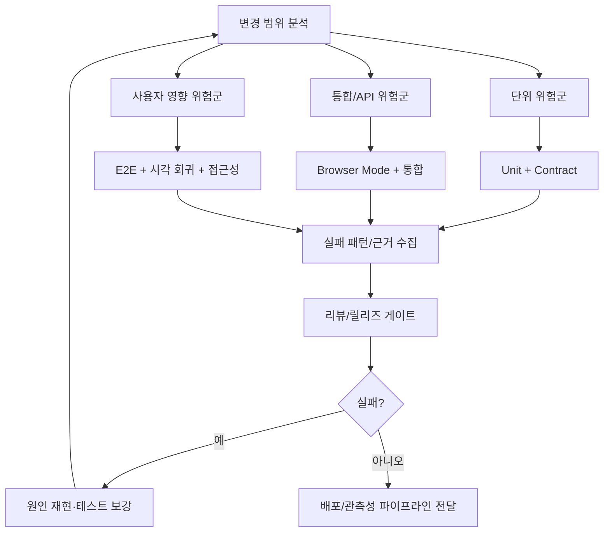
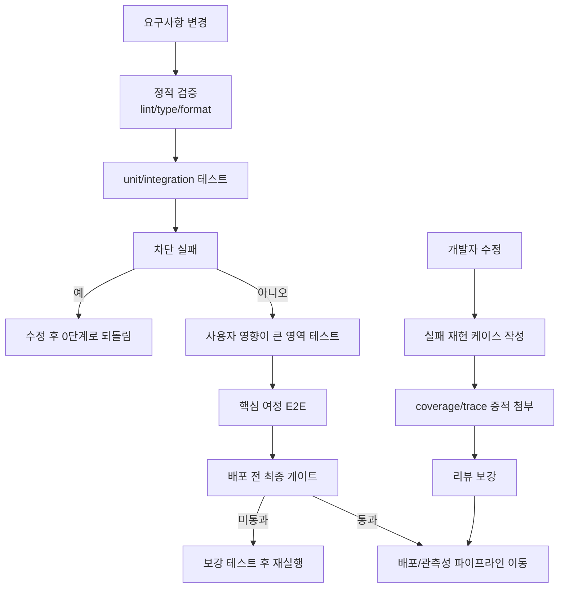

# 07. 테스팅 가이드

> **쉽게 읽기 안내**: 이 문서는 전문 용어가 많을 수 있어요.
> 이해가 어려우면 [공통 용어사전](./00_개발가이드_용어사전.md)에서 먼저 용어 뜻을 확인하고 본문을 이어서 읽으면 이해가 훨씬 빨라집니다.
> 특히 실무에서 자주 쓰이는 `배포`, `CI/CD`, `롤백`, `스키마`처럼 동작이 중요한 용어부터 먼저 익혀보세요.
## 0. 먼저 알고 가기 (30초 요약)

- 실패하는 테스트를 먼저 만들면 버그를 빨리 잡을 수 있습니다.
- `단위 -> 통합 -> E2E` 순으로 점점 넓은 범위를 검증하세요.
- 자동화가 실패하면 배포 전 단계에서 바로 멈추는 게 핵심입니다.

## 초심자용 한눈에 보기

이 문서는 “무엇이 실패했는지, 왜 다시 안 터져야 하는지”를 미리 검증하도록 설계합니다.

### 핵심 용어 빠르게 정리

| 용어 | 쉬운 뜻 |
| --- | --- |
| `단위 테스트` | 함수/컴포넌트 하나를 독립적으로 검증 |
| `통합 테스트` | 여러 모듈이 함께 작동할 때 검증 |
| `E2E` | 브라우저 실제 사용자 동선을 끝에서 끝까지 재현 |
| `회귀 테스트` | 배포 후 이전 기능이 깨졌는지 확인 |
| `스모크 테스트` | 핵심 동작만 빠르게 확인하는 최소 테스트 |


| 분류 | 품질 & 성능 | 상태 | Stable |
| :--- | :--- | :--- | :--- |
| **연관 가이드** | [04. 아키텍처](./04_아키텍처_설계_패턴.md), [10. 인프라](./10_인프라_IaC_가이드.md), [11. CI/CD](./11_CICD_파이프라인_표준.md) | **도구 원칙** | 벤더 중립 |
| **핵심 테마** | Vitest Browser Mode 안정화, Playwright Agents(Planner/Generator/Healer), AI 테스트 생성, 시각 회귀, 뮤테이션 테스팅 | **Update** | 최신 기준 |

---

> **"테스트는 단순한 검증을 넘어 시스템 설계를 구체화하는 프로세스입니다."**
> 본 가이드는 AI 협업 테스팅과 고립된 환경에서의 자동화된 검증 체계를 다룹니다.

---


## 추천 항목 (실무 우선순위)

- **시작 추천**: 신규 기능은 단위/통합/E2E 순으로 최소 1개씩부터 붙이고 실패 신호를 빠르게 확인하세요.
- **안정 추천**: 공용 query/mutation은 데이터셋 스냅샷 테스트로 회귀를 먼저 잡고, 테스트 네이밍은 사용자 행동 기준으로 정렬하세요.
- **운영 추천**: 실패한 체크리스트는 CI 게이트에 연결해 반복 수정을 예방합니다.


## 추천 항목 고도화 체크

- `즉시 적용` — 추천 항목 1개를 이번 주 내에 실제 작업 1건에 반영한다.
- `1주 내 정리` — 적용 결과를 PR 본문이나 회고 노트에 간단히 기록한다.
- `1개월 내 점검` — 재작업률/리뷰 충돌/배포 이슈 중 적어도 한 항목이 개선되었는지 확인한다.


## 추천 항목 실행 기록 템플릿

- `담당자` : 항목 적용 주체(문서 오너/팀원)를 명시
- `적용일` : 실제 반영된 날짜 및 작업 ID를 남김
- `측정 지표` : 리뷰 충돌/재작업/버그 재발 중 1개 이상 수치로 기록
- `보류 사유` : 적용을 못한 경우 이유를 1줄 기록하고 다음 액션을 지정

## 문서 책임 범위

| 이 문서가 결정하는 것 | 단일 출처로 따르는 문서 |
| :--- | :--- |
| unit/integration/E2E/contract/visual regression의 적용 기준 | [11. CI/CD](./11_CICD_파이프라인_표준.md), [16. 코드리뷰](./16_AI_협업_코드리뷰_가이드.md) |
| 접근성, 성능, 브라우저 호환성 테스트의 실행 기준 | [19. 웹 접근성](./19_웹_접근성_가이드.md), [08. 성능](./08_성능_최적화_가이드.md), [13. 브라우저 호환성](./13_브라우저_호환성_가이드.md) |
| API/mock/contract 테스트 기준 | [05. API 통신](./05_API_통신_및_모킹_가이드.md) |
| AI가 생성한 테스트의 승인 기준 | [18. AI 개발 워크플로우](./18_AI_개발_워크플로우_종합.md) |

---

## 0. 모든 프론트엔드 그룹 공통 Baseline

테스트 표준은 도구보다 **어떤 위험을 어떤 레벨에서 막을지**를 먼저 정의합니다.

| 기준 | 최소 적용 |
| :--- | :--- |
| **테스트 피라미드** | 유틸/훅은 단위 테스트, API 연동은 MSW 기반 통합 테스트, 핵심 사용자 여정은 E2E로 검증합니다. |
| **핵심 플로우 보호** | 로그인, 검색, 상세 조회, 생성/수정/삭제, 결제/제출 등 제품 핵심 플로우는 배포 전 자동 검증합니다. |
| **네트워크 모킹** | 테스트가 외부 API 상태에 의존하지 않도록 MSW 또는 동등한 mock server를 사용합니다. |
| **시각 회귀** | 공통 컴포넌트, 결제/가입/대시보드처럼 레이아웃 회귀 비용이 큰 화면은 screenshot baseline을 둡니다. |
| **실패 증거 보관** | E2E 실패 시 trace, screenshot, video, console log를 artifact로 저장합니다. |
| **불안정 테스트 관리** | flaky test는 재시도만 늘리지 않고 원인, 임시 격리, 복구 기한을 기록합니다. |

### 0.0 테스트 체계 맵



### 0.1 교차 검증 매트릭스

| 권고 | 1차 출처 | 실행 증거 | 운영 증거 | 철회 조건 |
| :--- | :--- | :--- | :--- | :--- |
| 테스트 피라미드 | 테스트 도구 공식 문서와 프로젝트 위험 모델 | unit/integration/E2E report | escaped defect, flaky rate | 느린 E2E는 하위 레벨 테스트로 재배치 |
| 브라우저 모드/시각 회귀 | Vitest 4 공식 릴리스, Playwright trace 문서 | screenshot baseline, trace artifact | UI incident, layout regression | false positive가 높으면 범위 축소 |
| AI 테스트 생성 | Playwright Test Agents 공식 문서, [18. AI 워크플로우](./18_AI_개발_워크플로우_종합.md) 정책 | generated test가 실제 결함에서 실패 | 누락 케이스 감소 | 재현/검증 없는 테스트는 merge 금지 |

### 0.2 운영 게이트

| Gate | Evidence | Owner | Rollback |
| :--- | :--- | :--- | :--- |
| Test pyramid gate | unit/integration/E2E distribution report | QA/FE owner | slow E2E를 integration test로 재배치 |
| Critical flow gate | trace, screenshot, business flow assertion | Feature owner | release hold 또는 feature flag off |
| Visual regression gate | screenshot baseline diff, review note | Design system owner | baseline revert 또는 threshold 조정 ADR |
| Flaky test gate | retry history, quarantine issue, due date | QA owner | flaky test quarantine 후 복구 SLA 적용 |

---

### 0.3 공식 출처 기반 테스트 도구 승격 기준

테스트 도구의 기능을 production gate로 승격할 때는 README와 [00. 종합 가이드](./00_종합_가이드_목차.md)의 공식 출처 레지스트리에 근거가 있어야 합니다. 도입 기준은 "새 기능이 있다"가 아니라 어떤 결함 유형을 더 안정적으로 막는지입니다.

| 도구/기능 | 공식 근거 | production 적용 조건 | 제한 |
| :--- | :--- | :--- | :--- |
| Vitest 4 Browser Mode | Browser Mode stable, `toMatchScreenshot`, Playwright trace 지원 | 레이아웃, 포인터 이벤트, IntersectionObserver, canvas처럼 jsdom 신뢰도가 낮은 컴포넌트에 적용 | 전체 제품 journey E2E를 대체하지 않음 |
| Playwright Test Agents | Planner/Generator/Healer agent 정의와 `init-agents` 흐름 | seed test, PRD 또는 spec, 생성 테스트 PR, trace 기반 실패 증거가 함께 있을 때 사용 | Healer 수정은 자동 머지하지 않고 사람이 locator와 비즈니스 assertion을 검토 |
| Storybook 9 Test | Vitest/Playwright 기반 Storybook Test와 coverage workflow | 디자인 시스템과 공통 컴포넌트의 상태 matrix, interaction, accessibility, visual test를 story 단위로 관리 | backend 계약과 실제 배포 환경 흐름은 contract/E2E로 별도 검증 |

---


### 0.4 테스트 레벨별 검증 흐름

`어떤 위험을 어느 단계에서 먼저 잡을지`를 도식으로 정리하면 같은 팀 기준을 유지하기 쉽습니다.

```text
요구사항 변경
        │
        v
┌───────────────────────────────────────────┐
│ 0. 정적 검증: lint + type + formatting    │
└───────────────────────────────────────────┘
        │
        v
┌───────────────────────────────────────────┐
│ 1. 빠른 테스트: unit / integration       │
│   - 유틸, hook, 모델 규칙                │
│   - MSW 계약 test                         │
└───────────────────────────────────────────┘
        │
        v
차단 실패? ──예──▶ 수정 후 0 단계로 되돌림
        │
        └─아니오─▶
                 v
┌───────────────────────────────────────────┐
│ 2. 사용자 영향이 큰 영역                  │
│   - Browser Mode 시각/포인터/레이아웃     │
│   - 핵심 접근성 smoke                      │
│   - API 에러 경계                         │
└───────────────────────────────────────────┘
        │
        v
┌───────────────────────────────────────────┐
│ 3. 핵심 여정 E2E                        │
│   - 로그인/결제/조회/저장 flow            │
│   - 장애 주입 + 성능/브라우저 smoke         │
└───────────────────────────────────────────┘
        │
        v
배포 전 최종 게이트 통과 여부
    ├─ 미통과: 보강 테스트 + 재실행
    └─ 통과: 배포/관측성 파이프라인 이동
```

```text
기능 소유자 확인 포인트

개발자 수정
   │
   ├─ 실패 재현 케이스 작성
   ├─ 커버리지/trace 증적 첨부
   └─ 리뷰에서 누락 케이스 토의
         │
         v
       테스트 보강 후 다시 배포 게이트
```



---

## 1. 단위 및 통합 테스트: Vitest 4 & MSW 2.x

Vite 생태계에 최적화된 **Vitest 4**와 네트워크 레이어 모킹인 **MSW 2.x**를 결합하여 신속하고 정확한 테스트 환경을 구축합니다. 2025년 10월 출시된 **Vitest 4**는 **Browser Mode의 experimental 태그를 제거**했고, `toMatchScreenshot()` 기반의 **시각 회귀 테스트**와 **Playwright Trace 통합**을 제공합니다. MSW 2.x는 REST/GraphQL에 더해 **WebSocket 모킹**까지 1급으로 지원합니다.

### 1.0 Vitest 설정

```ts
// vitest.config.ts
import { defineConfig } from 'vitest/config';
import react from '@vitejs/plugin-react';
import tsconfigPaths from 'vite-tsconfig-paths';

export default defineConfig({
  plugins: [react(), tsconfigPaths()],
  test: {
    // 테스트 환경: jsdom으로 브라우저 API 시뮬레이션
    environment: 'jsdom',

    // 전역 설정 파일 (Testing Library 등 공통 설정)
    setupFiles: ['./src/test/setup.ts'],

    // glob 패턴으로 테스트 파일 탐색
    include: ['src/**/*.{test,spec}.{ts,tsx}'],

    // 커버리지 설정
    coverage: {
      provider: 'v8',
      reporter: ['text', 'json', 'html', 'lcov'],
      include: ['src/**/*.{ts,tsx}'],
      exclude: [
        'src/**/*.d.ts',
        'src/**/*.test.{ts,tsx}',
        'src/**/*.spec.{ts,tsx}',
        'src/**/index.ts',        // 배럴 파일 제외
        'src/test/**',            // 테스트 유틸 제외
        'src/**/*.stories.tsx',   // 스토리북 제외
      ],
      // 커버리지 임계값 — CI에서 이 기준 미달 시 실패
      thresholds: {
        branches: 80,
        functions: 80,
        lines: 80,
        statements: 80,
      },
    },

    // CSS 모듈 모킹 (스타일 파일이 테스트를 방해하지 않도록)
    css: { modules: { classNameStrategy: 'non-scoped' } },

    // 타임아웃 설정 (ms)
    testTimeout: 10_000,
    hookTimeout: 10_000,
  },
});
```

```ts
// src/test/setup.ts — 전역 테스트 설정
import '@testing-library/jest-dom/vitest';
import { cleanup } from '@testing-library/react';
import { afterEach } from 'vitest';

// 매 테스트 후 DOM 정리
afterEach(() => {
  cleanup();
});
```

### Vitest 4 Browser Mode (Stable, 최신)

기존 jsdom/happy-dom 기반 단위 테스트는 실제 브라우저 API(레이아웃, 포인터 이벤트, IntersectionObserver 정확도 등)와 차이가 있습니다. **Vitest 4부터 Browser Mode가 Stable로 승격**되어, 동일한 `vitest` 명령으로 Playwright/WebdriverIO 위에서 실제 브라우저에 컴포넌트를 마운트해 테스트할 수 있습니다.

```ts
// vitest.config.ts — Browser Mode 사용 시 projects 필드로 구성
import { defineConfig } from 'vitest/config';
import { playwright } from '@vitest/browser-playwright';

export default defineConfig({
  test: {
    projects: [
      {
        // 1) 기존 jsdom 기반 단위 테스트 프로젝트
        extends: true,
        test: {
          name: 'unit',
          environment: 'jsdom',
          include: ['src/**/*.test.{ts,tsx}'],
        },
      },
      {
        // 2) 실제 브라우저에서 실행되는 컴포넌트 테스트 프로젝트
        extends: true,
        test: {
          name: 'browser',
          include: ['src/**/*.browser.test.{ts,tsx}'],
          browser: {
            enabled: true,
            provider: playwright({
              launchOptions: { headless: true },
            }),
            instances: [
              { browser: 'chromium' },
              { browser: 'firefox' },
            ],
          },
        },
      },
    ],
  },
});
```

```tsx
// src/components/Tooltip.browser.test.tsx — 실제 브라우저 환경 필요
import { render } from 'vitest-browser-react';
import { page } from 'vitest/browser';
import { expect, test } from 'vitest';
import { Tooltip } from './Tooltip';

test('hover 시 툴팁이 실제 위치에 표시된다', async () => {
  render(<Tooltip text="안내 메시지">버튼</Tooltip>);

  // 실제 브라우저의 포인터 이벤트 사용 — jsdom으로는 불가능
  await page.getByRole('button', { name: '버튼' }).hover();

  // 시각 회귀 검증 — Vitest 4 신규 toMatchScreenshot
  await expect(page).toMatchScreenshot('tooltip-visible.png', {
    maxDiffPixelRatio: 0.002,
  });
});
```

> **사용 기준**: 로직 중심 단위 테스트는 jsdom 프로젝트, 레이아웃/포인터/IntersectionObserver처럼 브라우저 정확도가 중요한 컴포넌트는 `*.browser.test.tsx`로 분리합니다.

### In-source Testing (소스 내 테스트)

작은 유틸 함수의 경우 테스트 파일을 별도로 두는 대신, **모듈 끝에 `import.meta.vitest` 블록**으로 직접 작성해 응집도를 높일 수 있습니다.

```ts
// src/utils/formatCurrency.ts
export function formatCurrency(value: number, locale = 'ko-KR'): string {
  return new Intl.NumberFormat(locale, { style: 'currency', currency: 'KRW' })
    .format(value);
}

// in-source 테스트 — 빌드 시 자동으로 제거됨
if (import.meta.vitest) {
  const { describe, it, expect } = import.meta.vitest;

  describe('formatCurrency', () => {
    it('한국어 로케일에서 원화로 포맷한다', () => {
      expect(formatCurrency(1500000)).toBe('₩1,500,000');
    });
  });
}
```

```ts
// vitest.config.ts — in-source 테스트 활성화
export default defineConfig({
  test: {
    includeSource: ['src/**/*.{ts,tsx}'],
  },
  define: {
    'import.meta.vitest': 'undefined', // 프로덕션 빌드에서 제거
  },
});
```

### 테스트 파일 네이밍 규칙

| 종류 | 패턴 | 예시 |
| :--- | :--- | :--- |
| 단위 테스트 (jsdom) | `*.test.ts(x)` | `useAuth.test.ts`, `Button.test.tsx` |
| 브라우저 테스트 (Vitest 4 Browser Mode) | `*.browser.test.ts(x)` | `Tooltip.browser.test.tsx` |
| In-source 테스트 | 모듈 내 `import.meta.vitest` 블록 | 소형 유틸 함수 |
| 통합 테스트 | `*.integration.test.ts(x)` | `checkout.integration.test.tsx` |
| E2E 테스트 | `*.e2e.ts` (Playwright) | `login.e2e.ts` |
| 테스트 유틸 | `src/test/*.ts` | `src/test/render.tsx`, `src/test/handlers.ts` |

### 단위 테스트 예시: React 컴포넌트

```tsx
// src/components/Counter.tsx
import { useState } from 'react';

interface CounterProps {
  initialCount?: number;
  step?: number;
}

export function Counter({ initialCount = 0, step = 1 }: CounterProps) {
  const [count, setCount] = useState(initialCount);

  return (
    <div>
      <span role="status" aria-label="현재 카운트">
        {count}
      </span>
      <button onClick={() => setCount((c) => c - step)}>감소</button>
      <button onClick={() => setCount((c) => c + step)}>증가</button>
      <button onClick={() => setCount(initialCount)}>초기화</button>
    </div>
  );
}
```

```tsx
// src/components/Counter.test.tsx
import { render, screen } from '@testing-library/react';
import userEvent from '@testing-library/user-event';
import { describe, it, expect } from 'vitest';
import { Counter } from './Counter';

describe('Counter', () => {
  it('초기값을 올바르게 렌더링한다', () => {
    render(<Counter initialCount={5} />);
    expect(screen.getByRole('status')).toHaveTextContent('5');
  });

  it('증가 버튼 클릭 시 카운트가 증가한다', async () => {
    const user = userEvent.setup();
    render(<Counter initialCount={0} step={3} />);

    await user.click(screen.getByRole('button', { name: '증가' }));

    expect(screen.getByRole('status')).toHaveTextContent('3');
  });

  it('감소 버튼 클릭 시 카운트가 감소한다', async () => {
    const user = userEvent.setup();
    render(<Counter initialCount={10} step={2} />);

    await user.click(screen.getByRole('button', { name: '감소' }));

    expect(screen.getByRole('status')).toHaveTextContent('8');
  });

  it('초기화 버튼 클릭 시 initialCount로 복귀한다', async () => {
    const user = userEvent.setup();
    render(<Counter initialCount={5} />);

    // 여러 번 증가 후 초기화
    await user.click(screen.getByRole('button', { name: '증가' }));
    await user.click(screen.getByRole('button', { name: '증가' }));
    await user.click(screen.getByRole('button', { name: '초기화' }));

    expect(screen.getByRole('status')).toHaveTextContent('5');
  });
});
```

### MSW 통합 테스트 예시

```ts
// src/test/handlers.ts — MSW 핸들러 정의
import { http, HttpResponse } from 'msw';

// API 응답에 대한 타입 정의
interface User {
  id: string;
  name: string;
  email: string;
}

export const handlers = [
  // 사용자 목록 조회
  http.get('/api/users', () => {
    return HttpResponse.json<User[]>([
      { id: '1', name: '김희준', email: 'hj@example.com' },
      { id: '2', name: '이지은', email: 'je@example.com' },
    ]);
  }),

  // 사용자 생성
  http.post('/api/users', async ({ request }) => {
    const body = (await request.json()) as Omit<User, 'id'>;
    return HttpResponse.json<User>(
      { id: crypto.randomUUID(), ...body },
      { status: 201 },
    );
  }),

  // 에러 시나리오 핸들러
  http.get('/api/users/error', () => {
    return HttpResponse.json(
      { message: '서버 내부 오류' },
      { status: 500 },
    );
  }),
];
```

```ts
// src/test/server.ts — 테스트용 MSW 서버 설정
import { setupServer } from 'msw/node';
import { handlers } from './handlers';

// 노드 환경용 서버 생성
export const server = setupServer(...handlers);
```

```ts
// src/test/setup.ts — MSW 서버 라이프사이클 관리 (기존 setup에 추가)
import '@testing-library/jest-dom/vitest';
import { cleanup } from '@testing-library/react';
import { afterAll, afterEach, beforeAll } from 'vitest';
import { server } from './server';

// 전체 테스트 시작 전 MSW 서버 가동
beforeAll(() => server.listen({ onUnhandledRequest: 'error' }));

// 매 테스트 후 핸들러 초기화 & DOM 정리
afterEach(() => {
  server.resetHandlers();
  cleanup();
});

// 모든 테스트 완료 후 서버 종료
afterAll(() => server.close());
```

```tsx
// src/features/users/UserList.integration.test.tsx
import { render, screen, waitFor } from '@testing-library/react';
import userEvent from '@testing-library/user-event';
import { describe, it, expect } from 'vitest';
import { http, HttpResponse } from 'msw';
import { server } from '@/test/server';
import { UserList } from './UserList';
import { QueryClient, QueryClientProvider } from '@tanstack/react-query';

// 테스트 전용 QueryClient (재시도 비활성화로 빠른 실패 확인)
function createTestQueryClient() {
  return new QueryClient({
    defaultOptions: {
      queries: { retry: false },
      mutations: { retry: false },
    },
  });
}

// 테스트용 래퍼 — Provider 주입
function renderWithProviders(ui: React.ReactElement) {
  const queryClient = createTestQueryClient();
  return render(
    <QueryClientProvider client={queryClient}>{ui}</QueryClientProvider>,
  );
}

describe('UserList 통합 테스트', () => {
  it('서버에서 사용자 목록을 불러와 렌더링한다', async () => {
    renderWithProviders(<UserList />);

    // 로딩 상태 확인
    expect(screen.getByText('로딩 중...')).toBeInTheDocument();

    // 데이터 로딩 완료 후 사용자 표시 확인
    expect(await screen.findByText('김희준')).toBeInTheDocument();
    expect(screen.getByText('이지은')).toBeInTheDocument();
  });

  it('서버 에러 시 에러 메시지를 표시한다', async () => {
    // 이 테스트에서만 에러 응답 반환하도록 오버라이드
    server.use(
      http.get('/api/users', () => {
        return HttpResponse.json(
          { message: '서버 오류 발생' },
          { status: 500 },
        );
      }),
    );

    renderWithProviders(<UserList />);

    // 에러 메시지가 표시될 때까지 대기
    await waitFor(() => {
      expect(screen.getByRole('alert')).toHaveTextContent('서버 오류');
    });
  });

  it('빈 목록일 때 안내 메시지를 표시한다', async () => {
    server.use(
      http.get('/api/users', () => {
        return HttpResponse.json([]);
      }),
    );

    renderWithProviders(<UserList />);

    expect(await screen.findByText('사용자가 없습니다')).toBeInTheDocument();
  });
});
```

### 1.1 사용자 관점의 테스트 (Testing Library)

구현의 세부 사항이 아닌, 시스템이 제공하는 기능과 사용자 인터랙션을 중심으로 검증합니다.

#### 쿼리 우선순위

Testing Library는 접근성 기반의 쿼리 우선순위를 권장합니다:

| 우선순위 | 쿼리 | 사용 시점 |
| :--- | :--- | :--- |
| 1 (최우선) | `getByRole` | 접근성 역할로 요소 찾기 (button, textbox, heading 등) |
| 2 | `getByLabelText` | 폼 요소를 라벨로 찾기 |
| 3 | `getByPlaceholderText` | placeholder 텍스트로 찾기 |
| 4 | `getByText` | 화면에 보이는 텍스트로 찾기 |
| 5 | `getByDisplayValue` | 입력 필드의 현재 값으로 찾기 |
| 6 (비권장) | `getByTestId` | 다른 방법이 불가능할 때만 사용 |

#### 쿼리 접두사 차이

| 접두사 | 반환 | 대기 | 용도 |
| :--- | :--- | :--- | :--- |
| `getBy*` | 요소 / throw | X | 동기적으로 존재하는 요소 |
| `queryBy*` | 요소 / null | X | 요소가 **없음**을 검증할 때 |
| `findBy*` | Promise | O | 비동기로 나타나는 요소 (내부적으로 `waitFor` + `getBy`) |

#### 폼 제출 테스트 예시

```tsx
// src/features/auth/LoginForm.test.tsx
import { render, screen, waitFor } from '@testing-library/react';
import userEvent from '@testing-library/user-event';
import { describe, it, expect, vi } from 'vitest';
import { LoginForm } from './LoginForm';

describe('LoginForm', () => {
  it('유효한 자격증명으로 폼을 제출하면 onSubmit이 호출된다', async () => {
    const handleSubmit = vi.fn();
    const user = userEvent.setup();

    render(<LoginForm onSubmit={handleSubmit} />);

    // getByRole로 폼 요소 접근 — 접근성 역할 기반
    const emailInput = screen.getByRole('textbox', { name: /이메일/i });
    const passwordInput = screen.getByLabelText(/비밀번호/i);
    const submitButton = screen.getByRole('button', { name: /로그인/i });

    // 사용자 인터랙션 시뮬레이션
    await user.type(emailInput, 'test@example.com');
    await user.type(passwordInput, 'securePassword123!');
    await user.click(submitButton);

    // 콜백 호출 검증
    expect(handleSubmit).toHaveBeenCalledWith({
      email: 'test@example.com',
      password: 'securePassword123!',
    });
  });

  it('이메일이 비어있으면 유효성 검사 에러를 표시한다', async () => {
    const user = userEvent.setup();
    render(<LoginForm onSubmit={vi.fn()} />);

    // 이메일 입력 없이 바로 제출
    await user.click(screen.getByRole('button', { name: /로그인/i }));

    // 에러 메시지가 비동기로 표시될 수 있으므로 findByText 사용
    const errorMessage = await screen.findByText(/이메일을 입력해주세요/i);
    expect(errorMessage).toBeInTheDocument();
  });

  it('로그인 진행 중에는 버튼이 비활성화된다', async () => {
    const user = userEvent.setup();
    // 제출 핸들러가 resolve되지 않는 Promise를 반환하여 로딩 상태 유지
    const handleSubmit = vi.fn(() => new Promise(() => {}));

    render(<LoginForm onSubmit={handleSubmit} />);

    await user.type(screen.getByRole('textbox', { name: /이메일/i }), 'a@b.com');
    await user.type(screen.getByLabelText(/비밀번호/i), 'pw123456!');
    await user.click(screen.getByRole('button', { name: /로그인/i }));

    // waitFor로 비동기 상태 변화 대기
    await waitFor(() => {
      expect(screen.getByRole('button', { name: /로그인/i })).toBeDisabled();
    });
  });

  it('비밀번호 표시/숨기기 토글이 동작한다', async () => {
    const user = userEvent.setup();
    render(<LoginForm onSubmit={vi.fn()} />);

    const passwordInput = screen.getByLabelText(/비밀번호/i);
    const toggleButton = screen.getByRole('button', { name: /비밀번호 표시/i });

    // 초기 상태: 비밀번호 숨김
    expect(passwordInput).toHaveAttribute('type', 'password');

    // 토글 클릭 후: 비밀번호 표시
    await user.click(toggleButton);
    expect(passwordInput).toHaveAttribute('type', 'text');
  });
});
```

---

## 2. 시나리오 테스트: Playwright 1.60 라인 & Test Agents

독립적으로 구성된 Preview 환경을 대상으로 실제 런타임 환경에서의 비즈니스 흐름을 검증합니다. 현재 공식 문서 기준 최신 Playwright 문서는 1.60 라인을 기준으로 보되, **Test Agents(Planner / Generator / Healer)** 는 1.56에서 도입된 공식 agent definition 흐름으로 관리합니다. AI 기반 테스트 생성과 자가 복구는 trace, seed test, 사람 리뷰가 있을 때만 제한적으로 사용합니다.

### 2.0 Playwright 설정

```ts
// playwright.config.ts
import { defineConfig, devices } from '@playwright/test';

export default defineConfig({
  // 테스트 디렉토리
  testDir: './e2e',

  // 테스트 파일 패턴
  testMatch: '**/*.e2e.ts',

  // 최대 실패 횟수 — CI에서 조기 종료용
  maxFailures: process.env.CI ? 5 : undefined,

  // 병렬 실행 — CI에서는 워커 수 제한
  fullyParallel: true,
  workers: process.env.CI ? 2 : undefined,

  // 실패 시 재시도 — 불안정한(flaky) 테스트 대응
  retries: process.env.CI ? 2 : 0,

  // 리포터 설정
  reporter: process.env.CI
    ? [['html', { open: 'never' }], ['default']]
    : [['html', { open: 'on-failure' }]],

  // 전역 설정
  use: {
    // 테스트 대상 URL
    baseURL: process.env.BASE_URL ?? 'http://localhost:3000',

    // 실패 시 트레이스 기록 (디버깅용)
    trace: 'on-first-retry',

    // 스크린샷 설정
    screenshot: 'only-on-failure',

    // 뷰포트 기본값
    viewport: { width: 1280, height: 720 },

    // 브라우저 로케일 (한국어)
    locale: 'ko-KR',
  },

  // 브라우저별 프로젝트 설정
  projects: [
    {
      name: 'chromium',
      use: { ...devices['Desktop Chrome'] },
    },
    {
      name: 'firefox',
      use: { ...devices['Desktop Firefox'] },
    },
    {
      name: 'webkit',
      use: { ...devices['Desktop Safari'] },
    },
    // 모바일 뷰포트 테스트
    {
      name: 'mobile-chrome',
      use: { ...devices['Pixel 5'] },
    },
  ],

  // 로컬 개발 서버 자동 실행
  webServer: {
    command: 'npm run preview',
    port: 3000,
    reuseExistingServer: !process.env.CI,
    timeout: 120_000,
  },
});
```

### E2E 테스트 예시: 페이지 네비게이션 및 검증

```ts
// e2e/navigation.e2e.ts
import { test, expect } from '@playwright/test';

test.describe('메인 네비게이션', () => {
  test('홈페이지가 올바르게 로드된다', async ({ page }) => {
    await page.goto('/');

    // 제목 확인
    await expect(page).toHaveTitle(/홈/);

    // 주요 네비게이션 요소 존재 확인
    const nav = page.getByRole('navigation');
    await expect(nav).toBeVisible();

    // 네비게이션 링크 확인
    await expect(nav.getByRole('link', { name: '대시보드' })).toBeVisible();
    await expect(nav.getByRole('link', { name: '설정' })).toBeVisible();
  });

  test('대시보드로 이동하면 데이터가 표시된다', async ({ page }) => {
    await page.goto('/');

    // 대시보드 링크 클릭
    await page.getByRole('link', { name: '대시보드' }).click();

    // URL 변경 확인
    await expect(page).toHaveURL(/\/dashboard/);

    // 대시보드 콘텐츠 로딩 대기 및 확인
    const heading = page.getByRole('heading', { name: '대시보드' });
    await expect(heading).toBeVisible();

    // 데이터 테이블이 로드될 때까지 대기
    const table = page.getByRole('table');
    await expect(table).toBeVisible();

    // 최소 1행 이상의 데이터 확인
    const rows = table.getByRole('row');
    await expect(rows).toHaveCount(await rows.count()); // 최소 헤더 행
    expect(await rows.count()).toBeGreaterThan(1);
  });
});

test.describe('로그인 흐름', () => {
  test('유효한 자격증명으로 로그인하면 대시보드로 리다이렉트된다', async ({ page }) => {
    await page.goto('/login');

    // 폼 입력
    await page.getByLabel('이메일').fill('admin@example.com');
    await page.getByLabel('비밀번호').fill('password123');

    // 로그인 버튼 클릭
    await page.getByRole('button', { name: '로그인' }).click();

    // 대시보드로 리다이렉트 확인
    await expect(page).toHaveURL(/\/dashboard/);

    // 사용자 이름이 헤더에 표시되는지 확인
    await expect(page.getByText('admin@example.com')).toBeVisible();
  });

  test('잘못된 비밀번호로 로그인하면 에러 메시지가 표시된다', async ({ page }) => {
    await page.goto('/login');

    await page.getByLabel('이메일').fill('admin@example.com');
    await page.getByLabel('비밀번호').fill('wrong-password');
    await page.getByRole('button', { name: '로그인' }).click();

    // 에러 메시지 확인
    await expect(page.getByRole('alert')).toContainText('인증 실패');

    // URL이 변경되지 않았음을 확인
    await expect(page).toHaveURL(/\/login/);
  });
});
```

### 시각적 회귀 테스트 (Visual Regression)

UI의 미세한 변화를 감지하여 의도치 않은 디자인 깨짐을 방지합니다.

```ts
// e2e/visual-regression.e2e.ts
import { test, expect } from '@playwright/test';

test.describe('시각적 회귀 테스트', () => {
  // 스냅샷 비교를 통한 시각적 검증
  test('홈페이지 레이아웃이 변경되지 않았다', async ({ page }) => {
    await page.goto('/');

    // 페이지 전체 스크린샷 비교
    // 첫 실행 시 기준 스냅샷 생성, 이후 실행 시 비교
    await expect(page).toHaveScreenshot('home-page.png', {
      // 허용 픽셀 차이 비율 (0.2% 이하)
      maxDiffPixelRatio: 0.002,

      // 애니메이션 완료 대기
      animations: 'disabled',

      // 전체 페이지 캡처 (스크롤 포함)
      fullPage: true,
    });
  });

  test('다크 모드 전환 시 UI가 올바르게 변경된다', async ({ page }) => {
    await page.goto('/');

    // 다크 모드 토글
    await page.getByRole('button', { name: '다크 모드' }).click();

    await expect(page).toHaveScreenshot('home-page-dark.png', {
      maxDiffPixelRatio: 0.002,
      animations: 'disabled',
    });
  });

  // 특정 컴포넌트만 캡처하여 비교
  test('헤더 컴포넌트가 변경되지 않았다', async ({ page }) => {
    await page.goto('/');

    const header = page.getByRole('banner');
    await expect(header).toHaveScreenshot('header-component.png');
  });
});
```

```bash
# 시각적 회귀 테스트 스냅샷 갱신 (디자인 변경 후)
npx playwright test --update-snapshots
```

### 테스트 Fixture 활용

```ts
// e2e/fixtures.ts — 커스텀 Fixture 정의
import { test as base, expect } from '@playwright/test';

// 인증된 사용자 상태를 공유하는 Fixture
interface AuthFixtures {
  authenticatedPage: ReturnType<typeof base['page']> extends Promise<infer T> ? T : never;
}

export const test = base.extend<AuthFixtures>({
  // 인증 완료된 페이지를 제공하는 Fixture
  authenticatedPage: async ({ page }, use) => {
    // 로그인 수행
    await page.goto('/login');
    await page.getByLabel('이메일').fill('test@example.com');
    await page.getByLabel('비밀번호').fill('password123');
    await page.getByRole('button', { name: '로그인' }).click();

    // 대시보드 도달 확인
    await expect(page).toHaveURL(/\/dashboard/);

    // 인증된 페이지를 테스트에 전달
    await use(page);
  },
});

export { expect };
```

```ts
// e2e/authenticated-flow.e2e.ts — Fixture 사용
import { test, expect } from './fixtures';

test('인증된 사용자가 설정 페이지에 접근할 수 있다', async ({ authenticatedPage }) => {
  await authenticatedPage.goto('/settings');
  await expect(authenticatedPage.getByRole('heading', { name: '설정' })).toBeVisible();
});
```

---

## 3. AI 기반 품질 보증 (QA)

AI 보조 도구를 활용하여 엣지 케이스를 탐지하고 테스트 코드 초안을 생성할 수 있습니다. 다만 테스트의 책임은 AI가 아니라 팀에 있으므로, 생성된 테스트는 실제 결함에서 실패하는지, assertion이 비즈니스 규칙을 검증하는지, mock이 실제 contract와 맞는지 확인한 뒤 병합합니다.

### 3.0 Playwright Test Agents

Playwright Test Agents는 Planner, Generator, Healer 세 가지 공식 agent definition을 제공합니다. 에이전트 정의는 Playwright 버전이 바뀔 때 재생성하고, 생성된 테스트 플랜과 코드 변경은 일반 PR과 동일한 리뷰 게이트를 통과시킵니다.

| 에이전트 | 역할 | 출력 |
| :--- | :--- | :--- |
| **Planner** | 앱을 탐색하며 검증할 흐름을 도출 | 마크다운 테스트 플랜 |
| **Generator** | 테스트 플랜을 실행 가능한 Playwright 코드로 변환 | role 기반 locator 사용 `*.e2e.ts` |
| **Healer** | 실패한 테스트를 자동 진단·수정 | 변경된 UI에 맞춘 locator/스텝 |

```bash
# Playwright 버전 업데이트 후 공식 agent definition 재생성
npx playwright init-agents --loop=vscode
npx playwright init-agents --loop=claude
npx playwright init-agents --loop=opencode
```

> **운영 원칙**: Generator가 만든 초안은 반드시 사람이 비즈니스 규칙 정합성을 리뷰한 뒤 머지합니다. Healer가 수정한 locator는 PR로 자동 제안되도록 설정해 무분별한 자동 머지를 막습니다.

### 3.1 테스트 생성 자동화

복잡한 비즈니스 로직에 대해 AI가 다양한 입력값과 기대 결과값을 도출하여 테스트 코드를 제안합니다.

#### AI 보조 테스트 생성 입력

AI 사용 정책과 검증 책임은 [18. AI 개발 워크플로우](./18_AI_개발_워크플로우_종합.md)를 따릅니다. 테스트 생성 요청에는 구현 코드만이 아니라 실패해야 하는 버그, 기대 assertion, mock 경계, 검증 명령을 함께 제공합니다.

```markdown
목표: 다음 컴포넌트에 대한 Vitest + Testing Library 테스트 후보를 작성한다.
- 파일: src/features/payment/PaymentForm.tsx
- 테스트 범위:
  1. 정상적인 결제 흐름 (카드번호, 만료일, CVC 입력 → 결제 버튼 클릭)
  2. 유효성 검사 실패 케이스 (빈 필드, 잘못된 카드번호 형식)
  3. 결제 API 에러 시 에러 메시지 표시
  4. 결제 진행 중 중복 클릭 방지
  5. 접근성: 스크린 리더로 에러 메시지 인식 가능 여부
- MSW로 /api/payment 엔드포인트를 모킹해줘
- 엣지 케이스도 포함해줘 (네트워크 타임아웃, 만료된 카드 등)
- 검증 명령: pnpm test PaymentForm
```

#### AI 생성 테스트 출력 예시

```tsx
// src/features/payment/PaymentForm.test.tsx (AI가 생성한 테스트)
import { render, screen, waitFor } from '@testing-library/react';
import userEvent from '@testing-library/user-event';
import { describe, it, expect } from 'vitest';
import { http, HttpResponse, delay } from 'msw';
import { server } from '@/test/server';
import { PaymentForm } from './PaymentForm';

describe('PaymentForm', () => {
  // --- 정상 흐름 ---
  it('유효한 카드 정보로 결제하면 성공 메시지를 표시한다', async () => {
    const user = userEvent.setup();
    render(<PaymentForm />);

    await user.type(screen.getByLabelText(/카드 번호/i), '4242424242424242');
    await user.type(screen.getByLabelText(/만료일/i), '12/28');
    await user.type(screen.getByLabelText(/CVC/i), '123');
    await user.click(screen.getByRole('button', { name: /결제/i }));

    expect(await screen.findByText(/결제가 완료되었습니다/i)).toBeInTheDocument();
  });

  // --- 유효성 검사 ---
  it('카드 번호가 비어있으면 에러를 표시한다', async () => {
    const user = userEvent.setup();
    render(<PaymentForm />);

    await user.click(screen.getByRole('button', { name: /결제/i }));

    expect(await screen.findByText(/카드 번호를 입력해주세요/i)).toBeInTheDocument();
  });

  it('잘못된 카드 번호 형식이면 에러를 표시한다', async () => {
    const user = userEvent.setup();
    render(<PaymentForm />);

    await user.type(screen.getByLabelText(/카드 번호/i), '1234');
    await user.click(screen.getByRole('button', { name: /결제/i }));

    expect(await screen.findByText(/유효한 카드 번호를 입력해주세요/i)).toBeInTheDocument();
  });

  // --- API 에러 ---
  it('서버 에러 시 에러 메시지를 표시한다', async () => {
    server.use(
      http.post('/api/payment', () => {
        return HttpResponse.json({ error: '결제 처리 실패' }, { status: 500 });
      }),
    );

    const user = userEvent.setup();
    render(<PaymentForm />);

    await user.type(screen.getByLabelText(/카드 번호/i), '4242424242424242');
    await user.type(screen.getByLabelText(/만료일/i), '12/28');
    await user.type(screen.getByLabelText(/CVC/i), '123');
    await user.click(screen.getByRole('button', { name: /결제/i }));

    // 에러 메시지가 role="alert"로 접근 가능한지 확인
    const alert = await screen.findByRole('alert');
    expect(alert).toHaveTextContent(/결제 처리 실패/i);
  });

  // --- 엣지 케이스: 네트워크 타임아웃 ---
  it('네트워크 타임아웃 시 재시도 안내를 표시한다', async () => {
    server.use(
      http.post('/api/payment', async () => {
        // 무한 대기로 타임아웃 시뮬레이션
        await delay('infinite');
        return new HttpResponse(null);
      }),
    );

    const user = userEvent.setup();
    render(<PaymentForm />);

    await user.type(screen.getByLabelText(/카드 번호/i), '4242424242424242');
    await user.type(screen.getByLabelText(/만료일/i), '12/28');
    await user.type(screen.getByLabelText(/CVC/i), '123');
    await user.click(screen.getByRole('button', { name: /결제/i }));

    // 타임아웃 후 재시도 안내
    expect(await screen.findByText(/다시 시도해주세요/i, {}, { timeout: 15_000 }))
      .toBeInTheDocument();
  });

  // --- 중복 클릭 방지 ---
  it('결제 진행 중 버튼이 비활성화된다', async () => {
    server.use(
      http.post('/api/payment', async () => {
        await delay(1000); // 1초 지연
        return HttpResponse.json({ success: true });
      }),
    );

    const user = userEvent.setup();
    render(<PaymentForm />);

    await user.type(screen.getByLabelText(/카드 번호/i), '4242424242424242');
    await user.type(screen.getByLabelText(/만료일/i), '12/28');
    await user.type(screen.getByLabelText(/CVC/i), '123');
    await user.click(screen.getByRole('button', { name: /결제/i }));

    // 결제 진행 중 버튼 비활성화 확인
    await waitFor(() => {
      expect(screen.getByRole('button', { name: /처리 중/i })).toBeDisabled();
    });
  });
});
```

#### AI 생성 테스트 리뷰 포인트

AI가 생성한 테스트를 수락하기 전에 반드시 다음을 확인합니다:

1. **실제 동작과 일치하는가**: AI가 추측한 텍스트/라벨이 실제 컴포넌트와 일치하는지 확인
2. **비즈니스 규칙이 정확한가**: 도메인 지식이 필요한 검증 로직이 올바른지 확인
3. **불필요한 구현 세부사항 테스트는 없는가**: 내부 상태나 메서드를 직접 테스트하고 있지 않은지 확인
4. **테스트 간 독립성**: 테스트 순서에 의존하는 공유 상태가 없는지 확인
5. **경고 없이 실행되는가**: `act(...)` 경고 등이 발생하지 않는지 실행 확인

---

## 4. 고도화된 품질 지표: 뮤테이션 테스팅

테스트 코드 자체의 유효성을 검증하기 위해 코드를 의도적으로 변형시킨 후 테스트가 실패하는지 확인하여 테스트의 견고함을 평가합니다. 현재 기준 CI actions에서 80% 임계값을 강제한 팀들에서 거짓 음성(false negative)이 약 60% 감소했다는 사례가 보고되고 있습니다.

### Stryker 설정

```json5
// stryker.config.json
{
  "$schema": "https://raw.githubusercontent.com/stryker-mutator/stryker4s/master/stryker-js/packages/core/schema/stryker-schema.json",
  // 변형 대상 파일
  "mutate": [
    "src/**/*.ts",
    "src/**/*.tsx",
    "!src/**/*.test.{ts,tsx}",
    "!src/**/*.spec.{ts,tsx}",
    "!src/**/*.d.ts",
    "!src/test/**"
  ],
  // Vitest를 테스트 러너로 사용
  "testRunner": "@stryker-mutator/vitest-runner",
  // 리포터 설정
  "reporters": ["html", "clear-text", "progress"],
  // 타임아웃 배수 (원본 대비 몇 배까지 허용)
  "timeoutMS": 60000,
  "timeoutFactor": 1.5,
  // 병렬 실행 (CPU 코어 수에 맞춤)
  "concurrency": 4,
  // 커버리지 분석으로 관련 테스트만 실행 (성능 최적화)
  "coverageAnalysis": "perTest"
}
```

### 주요 뮤테이션 연산자

| 연산자 | 원본 코드 | 변형 코드 | 의미 |
| :--- | :--- | :--- | :--- |
| 산술 연산자 | `a + b` | `a - b` | 연산 결과 검증 여부 |
| 조건 부정 | `if (x > 0)` | `if (x <= 0)` | 분기 조건 검증 여부 |
| 블록 제거 | `{ doSomething(); }` | `{}` | 사이드이펙트 검증 여부 |
| 문자열 변형 | `"hello"` | `""` | 문자열 값 검증 여부 |
| 배열 선언 | `[item]` | `[]` | 배열 내용 검증 여부 |
| 논리 연산자 | `a && b` | `a \|\| b` | 논리 조합 검증 여부 |
| 등호 연산자 | `a === b` | `a !== b` | 동등 비교 검증 여부 |

### 뮤테이션 점수 해석

```
Mutation testing  [====================] 100%

Kill:    192  (뮤턴트가 테스트에 의해 탐지됨 ✓)
Survived: 12  (뮤턴트가 살아남음 — 테스트 보강 필요 ⚠)
Timeout:   3  (실행 시간 초과)
No cov:    8  (테스트 커버리지 밖)

Mutation Score: 94.1% (목표: 80% 이상)
```

- **Kill (잡힘)**: 변형된 코드가 테스트 실패를 유발함 → 테스트가 해당 로직을 잘 검증하고 있음
- **Survived (생존)**: 변형되었는데도 모든 테스트가 통과함 → 해당 로직에 대한 테스트가 부족
- **Mutation Score**: `Kill / (Kill + Survived)` — 80% 이상을 목표로 설정

생존한 뮤턴트는 HTML 리포트에서 확인하여 해당 코드에 대한 테스트를 추가합니다:

```bash
# Stryker 실행 후 리포트 확인
npx stryker run
open reports/mutation/html/index.html
```

---

## 4-A. 컴포넌트 테스트 허브: Storybook 9 + Vitest 통합

2025년 출시된 **Storybook 9**는 Vitest와의 공식 파트너십(**Storybook Test**)을 통해, 모든 스토리를 단일 위젯에서 일괄 실행하고 파일 저장 시 자동 재실행하는 watch 모드를 제공합니다. 또한 시각 회귀 테스트가 기본 내장되었고, 플랫 의존성 구조로 설치 사이즈가 크게 줄어 SSR/모노레포 환경에서 더 가벼워졌습니다.

```ts
// .storybook/vitest.setup.ts
import { setProjectAnnotations } from '@storybook/react';
import { beforeAll } from 'vitest';
import projectAnnotations from './preview';

// Storybook 스토리를 Vitest 테스트로 재사용
const project = setProjectAnnotations([projectAnnotations]);
beforeAll(project.beforeAll);
```

```ts
// vitest.config.ts — Storybook Test 프로젝트 추가
import { storybookTest } from '@storybook/addon-vitest/vitest-plugin';
import { playwright } from '@vitest/browser-playwright';

export default defineConfig({
  test: {
    projects: [
      // ... 위의 unit / browser 프로젝트
      {
        plugins: [storybookTest({ configDir: '.storybook' })],
        test: {
          name: 'storybook',
          browser: {
            enabled: true,
            provider: playwright({
              launchOptions: { headless: true },
            }),
          },
          setupFiles: ['./.storybook/vitest.setup.ts'],
        },
      },
    ],
  },
});
```

> **장점**: 스토리에서 정의한 args/play 함수를 그대로 Vitest 테스트로 재사용하기 때문에, "디자인 카탈로그 = 시각/행동 테스트"가 한 곳에서 관리됩니다.

---

## 5. 테스트 전략: 테스트 피라미드

효과적인 테스트 전략은 비용과 속도의 균형을 맞추는 것에서 시작합니다.

```
          ╱ ╲
         ╱ E2E ╲         느림 · 비쌈 · 높은 신뢰도
        ╱  (10%) ╲
       ╱───────────╲
      ╱  통합 테스트  ╲
     ╱    (20~30%)    ╲
    ╱───────────────────╲
   ╱    단위 테스트       ╲    빠름 · 저렴 · 높은 격리
  ╱      (60~70%)         ╲
 ╱─────────────────────────╲
```

| 계층 | 도구 | 비율 | 목적 | 실행 시간 |
| :--- | :--- | :--- | :--- | :--- |
| 단위 테스트 | Vitest | 60~70% | 개별 함수/컴포넌트의 정확성 검증 | ms 단위 |
| 통합 테스트 | Vitest + MSW | 20~30% | 모듈 간 상호작용, API 호출 흐름 검증 | 수백 ms |
| E2E 테스트 | Playwright | ~10% | 핵심 비즈니스 흐름의 전체 동작 검증 | 수 초 |

### 테스트 계층별 원칙

- **단위 테스트**: 순수 함수, 유틸리티, 커스텀 훅, 개별 컴포넌트 렌더링
- **통합 테스트**: 여러 컴포넌트 조합, API 호출이 포함된 화면, 상태 관리 흐름
- **E2E 테스트**: 로그인 → 결제 같은 핵심 사용자 시나리오, 크로스 브라우저 동작

> **원칙**: E2E에서 단위 테스트로 검증할 수 있는 것을 테스트하지 않는다. 피라미드 아래쪽에서 잡을 수 있는 버그는 아래쪽에서 잡는다.

---

## 6. 커버리지 목표와 측정

### Vitest 커버리지 설정 및 실행

```bash
# 커버리지 리포트 생성
npx vitest run --coverage

# 워치 모드에서 커버리지 확인
npx vitest --coverage
```

커버리지 설정은 `vitest.config.ts`의 `test.coverage` 섹션에서 관리합니다 (1.0절 참고).

### 의미 있는 커버리지 지표

| 지표 | 목표 | 설명 |
| :--- | :--- | :--- |
| Line Coverage | 80%+ | 실행된 코드 라인 비율 |
| Branch Coverage | 80%+ | 분기(if/else, switch) 커버리지 |
| Function Coverage | 80%+ | 호출된 함수 비율 |
| Statement Coverage | 80%+ | 실행된 구문 비율 |

### 커버리지에 대한 올바른 관점

커버리지 수치 자체가 목표가 되어서는 안 됩니다:

- **높은 커버리지 ≠ 좋은 테스트**: 100% 커버리지여도 assertion이 없으면 무의미
- **커버리지가 낮은 영역 우선 확인**: 새로 작성한 코드, 핵심 비즈니스 로직에 집중
- **커버리지 감소 방지**: CI에서 커버리지가 이전 대비 감소하면 경고/실패 처리

```bash
# 변경된 파일에 대해서만 커버리지 확인 (PR 기반)
npx vitest related --coverage $(git diff --name-only HEAD~1)
```

---

## 7. 테스트 더블(Test Double) 패턴

테스트에서 외부 의존성을 대체하는 다양한 패턴을 이해하고 적절히 사용합니다.

### 종류별 차이점

| 종류 | 설명 | 검증 대상 | Vitest 도구 |
| :--- | :--- | :--- | :--- |
| **Stub** | 미리 정해진 값을 반환 | 반환값 기반 로직 | `vi.fn().mockReturnValue()` |
| **Mock** | 호출 여부·인자를 기록하고 검증 | 상호작용 (호출됐는가) | `vi.fn()` + `expect().toHaveBeenCalled()` |
| **Spy** | 원본 구현을 유지하면서 호출을 감시 | 호출 감시 + 원본 동작 | `vi.spyOn()` |
| **Fake** | 실제와 유사하게 동작하는 간소화된 구현 | 통합 시나리오 | 직접 구현 |

### 예시

```ts
// src/services/analytics.test.ts
import { describe, it, expect, vi } from 'vitest';
import { trackEvent, AnalyticsService } from './analytics';

describe('테스트 더블 패턴 예시', () => {
  // --- Stub: 고정된 반환값 제공 ---
  it('Stub - 특정 값을 반환하도록 설정', () => {
    const getUser = vi.fn().mockReturnValue({ id: '1', name: '테스터' });

    const user = getUser();
    expect(user.name).toBe('테스터');
  });

  // --- Mock: 호출 여부와 인자 검증 ---
  it('Mock - 함수 호출 여부와 인자를 검증', () => {
    const sendEmail = vi.fn();

    // 테스트 대상 로직에서 sendEmail 호출
    sendEmail('user@test.com', '가입을 환영합니다');

    expect(sendEmail).toHaveBeenCalledTimes(1);
    expect(sendEmail).toHaveBeenCalledWith('user@test.com', '가입을 환영합니다');
  });

  // --- Spy: 원본 동작을 유지하면서 감시 ---
  it('Spy - 원본 메서드를 유지하면서 호출을 기록', () => {
    const service = new AnalyticsService();

    // 원본 track 메서드를 감시 (동작은 그대로)
    const spy = vi.spyOn(service, 'track');

    service.track('page_view', { page: '/home' });

    // 원본이 실행되면서 동시에 호출 기록도 남음
    expect(spy).toHaveBeenCalledWith('page_view', { page: '/home' });

    spy.mockRestore(); // 감시 해제
  });

  // --- Fake: 간소화된 대체 구현 ---
  it('Fake - InMemory 저장소로 실제와 유사하게 동작', () => {
    // 실제 DB 대신 메모리 기반 구현
    class FakeUserRepository {
      private users = new Map<string, { id: string; name: string }>();

      save(user: { id: string; name: string }) {
        this.users.set(user.id, user);
      }

      findById(id: string) {
        return this.users.get(id) ?? null;
      }
    }

    const repo = new FakeUserRepository();
    repo.save({ id: '1', name: '희준' });

    expect(repo.findById('1')).toEqual({ id: '1', name: '희준' });
    expect(repo.findById('999')).toBeNull();
  });
});
```

### 모듈 모킹

```ts
// 외부 모듈 전체를 모킹
vi.mock('@/lib/api', () => ({
  fetchUsers: vi.fn().mockResolvedValue([
    { id: '1', name: '사용자1' },
  ]),
}));

// 특정 export만 모킹 (나머지는 원본 유지)
vi.mock('@/lib/utils', async (importOriginal) => {
  const original = await importOriginal<typeof import('@/lib/utils')>();
  return {
    ...original,
    formatDate: vi.fn().mockReturnValue('2025-01-01'), // 이것만 모킹
  };
});
```

---

## 8. CI에서의 테스트 자동화

[11. CI/CD 파이프라인 표준](./11_CICD_파이프라인_표준.md)과 연계하여 자동화된 테스트 파이프라인을 구성합니다.

### CI 워크플로우

```yaml
# .ci/workflows/test.yml
name: Test Pipeline

on:
  pull_request:
    branches: [main, develop]
  push:
    branches: [main]

# 동일 PR에 대한 중복 실행 방지
concurrency:
  group: test-${{ ci.head_ref || ci.ref }}
  cancel-in-progress: true

jobs:
  # --- 단위 + 통합 테스트 ---
  unit-integration:
    name: Unit & Integration Tests
    runs-on: ubuntu-latest
    steps:
      - uses: actions/checkout@v4

      - uses: actions/setup-node@v4
        with:
          node-version: 20
          cache: 'pnpm'

      - run: pnpm install --frozen-lockfile

      # Vitest 병렬 실행 (샤딩)
      - name: 테스트 실행
        run: pnpm vitest run --coverage --reporter=default

      # 커버리지 리포트 업로드
      - uses: actions/upload-artifact@v4
        if: always()
        with:
          name: coverage-report
          path: coverage/

      # PR에 커버리지 코멘트 추가
      - uses: davelosert/vitest-coverage-report-action@v2
        if: ci.event_name == 'pull_request'

  # --- E2E 테스트 (Playwright) ---
  e2e:
    name: E2E Tests
    runs-on: ubuntu-latest
    strategy:
      fail-fast: false
      matrix:
        # 샤딩으로 병렬 실행 (4개 분할)
        shard: [1/4, 2/4, 3/4, 4/4]
    steps:
      - uses: actions/checkout@v4

      - uses: actions/setup-node@v4
        with:
          node-version: 20
          cache: 'pnpm'

      - run: pnpm install --frozen-lockfile

      # Playwright 브라우저 캐시
      - name: Playwright 브라우저 캐시
        uses: actions/cache@v4
        with:
          path: ~/.cache/ms-playwright
          key: playwright-${{ hashFiles('pnpm-lock.yaml') }}

      - name: Playwright 브라우저 설치
        run: pnpm exec playwright install --with-deps chromium

      # 애플리케이션 빌드
      - run: pnpm build

      # E2E 테스트 실행 (샤딩)
      - name: E2E 테스트 실행
        run: pnpm exec playwright test --shard=${{ matrix.shard }}

      # 실패 시 트레이스 업로드 (디버깅용)
      - uses: actions/upload-artifact@v4
        if: failure()
        with:
          name: playwright-traces-${{ strategy.job-index }}
          path: test-results/
          retention-days: 7

  # --- Flaky 테스트 감지 ---
  flaky-detection:
    name: Flaky Test Detection
    runs-on: ubuntu-latest
    if: ci.ref == 'refs/heads/main'
    steps:
      - uses: actions/checkout@v4

      - uses: actions/setup-node@v4
        with:
          node-version: 20
          cache: 'pnpm'

      - run: pnpm install --frozen-lockfile

      # 동일 테스트를 5회 반복 실행하여 불안정 테스트 탐지
      - name: Flaky 테스트 탐지
        run: |
          for i in {1..5}; do
            echo "=== 실행 $i/5 ==="
            pnpm vitest run --reporter=json --outputFile=result-$i.json || true
          done

      # 결과 비교 스크립트
      - name: Flaky 결과 분석
        run: node scripts/detect-flaky-tests.js
```

### 병렬 테스트 실행 전략

```bash
# Vitest 샤딩 — CI에서 워커별 분할 실행
pnpm vitest run --shard=1/3  # 워커 1: 전체의 1/3
pnpm vitest run --shard=2/3  # 워커 2: 전체의 2/3
pnpm vitest run --shard=3/3  # 워커 3: 전체의 3/3

# Playwright 샤딩
pnpm exec playwright test --shard=1/4
```

### Flaky 테스트 대응 전략

1. **재시도(retry)**: `retries: 2` 설정으로 일시적 실패 수용 (근본 해결 아님)
2. **격리**: 공유 상태, 전역 변수, 시간 의존성 제거
3. **타임아웃 조정**: 네트워크 의존 테스트에 충분한 타임아웃 부여
4. **태깅**: 지속적으로 불안정한 테스트에 `@flaky` 태그 → 별도 관리

```ts
// Playwright: 특정 테스트에만 재시도 설정
test('간헐적으로 느린 API를 호출하는 테스트', async ({ page }) => {
  test.info().annotations.push({ type: 'flaky', description: '외부 API 의존' });
  // ...
});
```

---

## 9. 주의사항 및 흔한 실수

### 9.1 구현 세부사항 테스트 금지

```tsx
// ❌ 나쁜 예: 내부 상태를 직접 검증
it('상태가 변경된다', () => {
  const { result } = renderHook(() => useState(0));
  act(() => result.current[1](5));
  expect(result.current[0]).toBe(5); // 단순 useState 래핑 테스트 — 무의미
});

// ✅ 좋은 예: 사용자가 보는 결과를 검증
it('증가 버튼을 누르면 화면에 증가된 값이 표시된다', async () => {
  const user = userEvent.setup();
  render(<Counter />);
  await user.click(screen.getByRole('button', { name: '증가' }));
  expect(screen.getByRole('status')).toHaveTextContent('1');
});
```

### 9.2 스냅샷 남용 금지

```tsx
// ❌ 나쁜 예: 전체 컴포넌트 스냅샷 — 깨지기 쉽고, 리뷰 시 의미 파악 어려움
it('컴포넌트가 렌더링된다', () => {
  const { container } = render(<UserProfile user={mockUser} />);
  expect(container).toMatchSnapshot(); // CSS 클래스 하나 변경에도 실패
});

// ✅ 좋은 예: 특정 출력값만 스냅샷 or 명시적 assertion
it('사용자 이름과 이메일이 표시된다', () => {
  render(<UserProfile user={mockUser} />);
  expect(screen.getByText('김희준')).toBeInTheDocument();
  expect(screen.getByText('hj@example.com')).toBeInTheDocument();
});

// ✅ 인라인 스냅샷은 소규모 데이터에 적합
it('날짜를 올바른 형식으로 변환한다', () => {
  expect(formatDate(new Date('2025-03-15'))).toMatchInlineSnapshot('"2025년 3월 15일"');
});
```

### 9.3 테스트 간 의존성 금지

```ts
// ❌ 나쁜 예: 테스트 순서에 의존
let sharedUser: User;

it('사용자를 생성한다', () => {
  sharedUser = createUser('테스터');   // 다음 테스트에서 이 값을 기대
  expect(sharedUser).toBeDefined();
});

it('생성된 사용자를 조회한다', () => {
  const found = findUser(sharedUser.id);  // 위 테스트가 먼저 실행돼야 함
  expect(found).toBeDefined();
});

// ✅ 좋은 예: 각 테스트가 독립적
it('생성된 사용자를 조회한다', () => {
  const user = createUser('테스터');  // 필요한 데이터를 직접 생성
  const found = findUser(user.id);
  expect(found).toEqual(user);
});
```

### 9.4 act() 경고 무시 금지

`act()` 경고는 테스트 외부에서 상태 업데이트가 발생하고 있다는 신호입니다. 무시하지 말고 원인을 찾아 해결합니다:

- `findBy*` 쿼리 사용 (내부적으로 `waitFor` 포함)
- `waitFor` 명시적 사용
- 비동기 작업 완료 후 assertion 수행

### 9.5 타이머/시간 의존 테스트

```ts
// ❌ 나쁜 예: 실제 시간 대기 — 느리고 불안정
it('3초 후 알림가 사라진다', async () => {
  render(<Toast message="완료" />);
  await new Promise((r) => setTimeout(r, 3100)); // 실제 3초 대기
  expect(screen.queryByText('완료')).not.toBeInTheDocument();
});

// ✅ 좋은 예: 가짜 타이머로 시간을 제어
it('3초 후 알림가 사라진다', async () => {
  vi.useFakeTimers();
  render(<Toast message="완료" />);

  expect(screen.getByText('완료')).toBeInTheDocument();

  // 시간을 3초 앞으로 진행
  await vi.advanceTimersByTimeAsync(3000);

  expect(screen.queryByText('완료')).not.toBeInTheDocument();

  vi.useRealTimers(); // 실제 타이머 복원
});
```

---

## 12. 목업 테스트 신뢰도 기준

목업 테스트는 외부 의존성을 줄이지만, 계약과 멀어지면 거짓 안정감을 줍니다.

### 12.1 MSW lifecycle

- `src/test/setup.ts`에서 `server.listen`, `server.resetHandlers`, `server.close`를 한 곳에 둡니다.
- 테스트별 예외 응답은 `server.use`로 추가하고, 테스트가 끝나면 reset되어야 합니다.
- 처리되지 않은 요청은 실패시키고, 우회가 필요한 요청은 왜 실제 네트워크로 나가도 되는지 적습니다.

### 12.2 fixture 전략

- success fixture와 함께 validation error, auth error, timeout, empty response를 기본으로 둡니다.
- fixture는 snapshot처럼 큰 JSON을 복사하지 말고 schema builder 또는 factory로 의도를 드러냅니다.
- mock handler가 실제 API 계약에서 생성된 type/schema를 쓰는지 확인합니다.

### 12.3 과한 mocking 방지

- React component가 API client 구현 detail을 mock하지 않게 MSW로 HTTP 경계를 가로챕니다.
- domain pure function은 MSW 없이 unit test로 검증합니다.
- Playwright E2E에서는 핵심 happy path는 실제 preview API smoke를 두고, 에러/희귀 상태만 mock route로 보완합니다.

---

## 체크리스트

### 기본 테스트 환경

- [ ] `vitest.config.ts`에 environment, setupFiles, coverage가 올바르게 설정되었나요?
- [ ] Vitest 4의 `projects` 필드로 jsdom / browser / Storybook 테스트가 분리되었나요?
- [ ] 브라우저 정확도가 필요한 컴포넌트는 `*.browser.test.tsx`로 Browser Mode에서 실행하나요?
- [ ] `src/test/setup.ts`에 Testing Library cleanup과 MSW 서버 라이프사이클이 포함되었나요?
- [ ] 테스트 파일 네이밍이 `*.test.ts(x)` 규칙을 따르나요?

### 단위 및 통합 테스트

- [ ] 시스템의 핵심 상태 전이(State Transition) 로직이 테스트에 포함되었나요?
- [ ] 네트워크 레이어를 모킹(MSW)하여 외부 의존성 없이 테스트가 가능한가요?
- [ ] Testing Library 쿼리가 접근성 우선순위를 따르나요? (`getByRole` > `getByText` > `getByTestId`)
- [ ] `userEvent`를 사용하여 실제 사용자 인터랙션을 시뮬레이션하고 있나요? (`fireEvent` 대신)
- [ ] 비동기 테스트에서 `findBy*` 또는 `waitFor`를 적절히 사용하고 있나요?

### E2E 테스트

- [ ] `playwright.config.ts`에 크로스 브라우저 프로젝트가 설정되었나요?
- [ ] 빌드 파이프라인에서 시각적 회귀 테스트가 자동으로 실행되나요?
- [ ] E2E 테스트가 핵심 비즈니스 흐름에 집중하고 있나요? (단위 테스트로 충분한 것은 E2E에서 제외)
- [ ] 테스트 Fixture로 반복되는 설정(인증 등)을 재사용하고 있나요?

### AI 기반 QA

- [ ] AI를 활용하여 사람이 놓치기 쉬운 엣지 케이스를 테스트에 반영했나요?
- [ ] AI가 생성한 테스트를 리뷰하여 실제 컴포넌트와 일치하는지 확인했나요?
- [ ] Playwright Agents(Planner/Generator/Healer)로 E2E 초안 생성·자가 복구 워크플로우를 구축했나요?
- [ ] Healer가 수정한 locator는 자동 머지가 아니라 PR로 제안되도록 설정했나요?

### 품질 지표

- [ ] 커버리지가 80% 임계값을 충족하나요? (Line, Branch, Function, Statement)
- [ ] 뮤테이션 점수가 80% 이상인가요?
- [ ] 커버리지 수치만 높이는 것이 아니라, 의미 있는 assertion이 포함되어 있나요?

### CI 자동화

- [ ] CI actions에서 단위/통합/E2E 테스트가 PR마다 자동 실행되나요?
- [ ] 테스트 샤딩으로 병렬 실행이 설정되었나요?
- [ ] Flaky 테스트 모니터링 및 대응 프로세스가 있나요?

### 코드 품질

- [ ] 구현 세부사항이 아닌 사용자 행동 관점에서 테스트를 작성했나요?
- [ ] 스냅샷 테스트를 남용하고 있지 않나요?
- [ ] 각 테스트가 독립적이며 실행 순서에 의존하지 않나요?
- [ ] `act()` 경고가 발생하지 않나요?
- [ ] 시간 의존 테스트에 `vi.useFakeTimers()`를 사용하고 있나요?

---

## 실무 적용 가이드

### 언제 이 문서를 펼칠까

- 테스트는 많은데 배포 후 핵심 flow가 계속 깨질 때
- 무엇을 unit, integration, E2E로 나눌지 결정해야 할 때
- AI가 만든 테스트의 신뢰도를 검증해야 할 때

### 적용 순서

1. 사용자에게 중요한 flow 3개를 먼저 적는다.
2. 도메인 계산은 unit, 컴포넌트와 API 조합은 integration, 실제 전환은 E2E로 나눈다.
3. fixture와 mock을 기능 폴더 가까이에 둔다.
4. 실패 trace, screenshot, video를 CI artifact로 남긴다.
5. flaky test는 owner와 만료일 없이 quarantine하지 않는다.

### 함께 두는 파일

- feature test, fixture, MSW handler를 feature 폴더 또는 바로 옆 test 폴더에 둔다.
- 공통 test util은 user-event setup, render provider처럼 도메인 무관한 것만 둔다.
- E2E page object는 route 또는 feature 기준으로 나눈다.

### 흔한 실수

- 구현 detail만 검증하고 사용자 결과를 검증하지 않는다.
- mock이 실제 API 계약과 달라도 방치한다.
- flaky test를 삭제하고 원인을 추적하지 않는다.
- 시각/접근성 회귀를 수동 QA에만 맡긴다.

### PR 완료 기준

- [ ] 핵심 flow E2E가 있다.
- [ ] 실패 artifact가 저장된다.
- [ ] mock과 contract가 연결되어 있다.
- [ ] 새 기능의 테스트 파일이 기능 코드와 가까이 있다.

## 추천 항목 실행 우선순위 매핑

- `P1(7일 내)` — 추천 항목 1개를 우선 적용하고 1회 사용자 관측 신호(에러율/실패율/지연)와 연결한다.
- `P2(30일 내)` — 추천 항목 1개를 팀 내 표준/템플릿에 반영해 재사용성을 확보한다.
- `P3(90일 내)` — 추천 항목 1개를 다른 관련 문서에 역링크로 연동해 중복 작업을 줄인다.
- `완료 기준` — 각 항목별 산출물(예: PR 링크/체크리스트/회고 노트)을 1개 이상 남긴다.

## 추천 항목 실행 체크리스트

- [ ] `1단계(7일)` : 추천 항목 1개를 실제 작업으로 전환
- [ ] `2단계(30일)` : 전환 결과를 팀 산출물(ADR/PR/체크리스트)에 반영
- [ ] `3단계(60일)` : 정적 지표 1개 이상으로 효과 검증
- [ ] `문제 대응` : 미달성 시 보류 사유와 다음 실행 액션을 문서화
