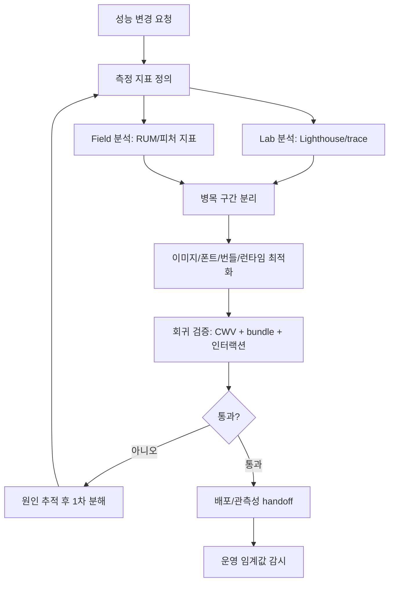
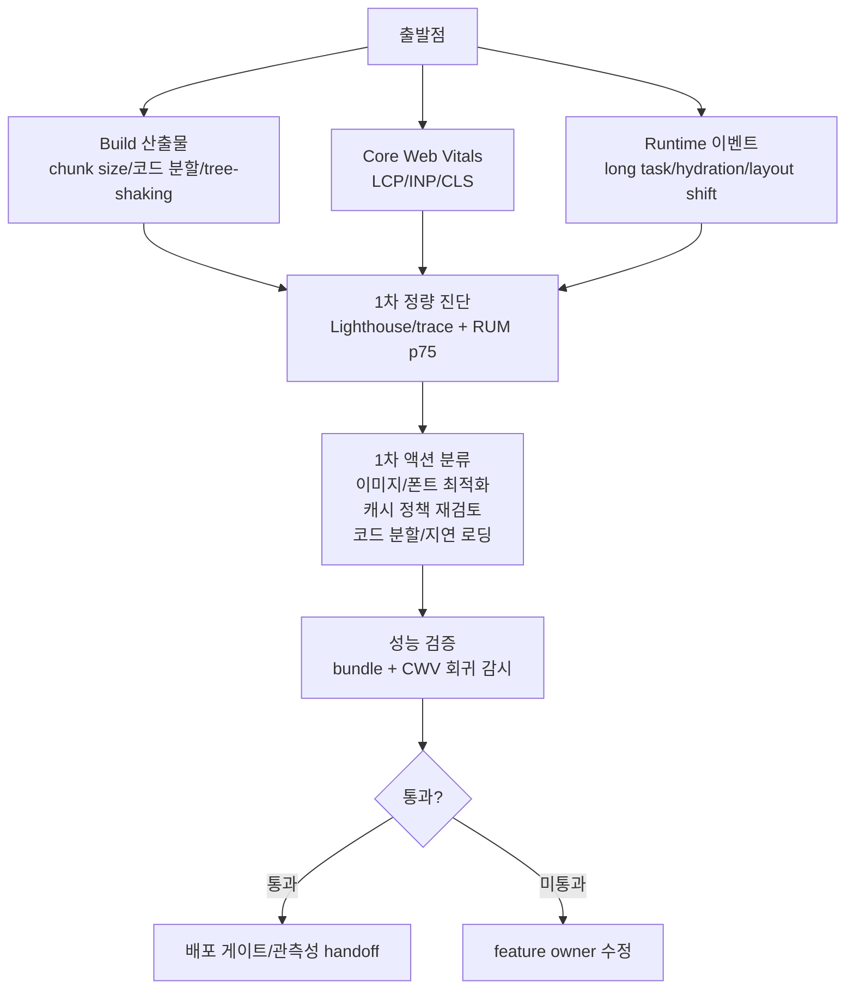
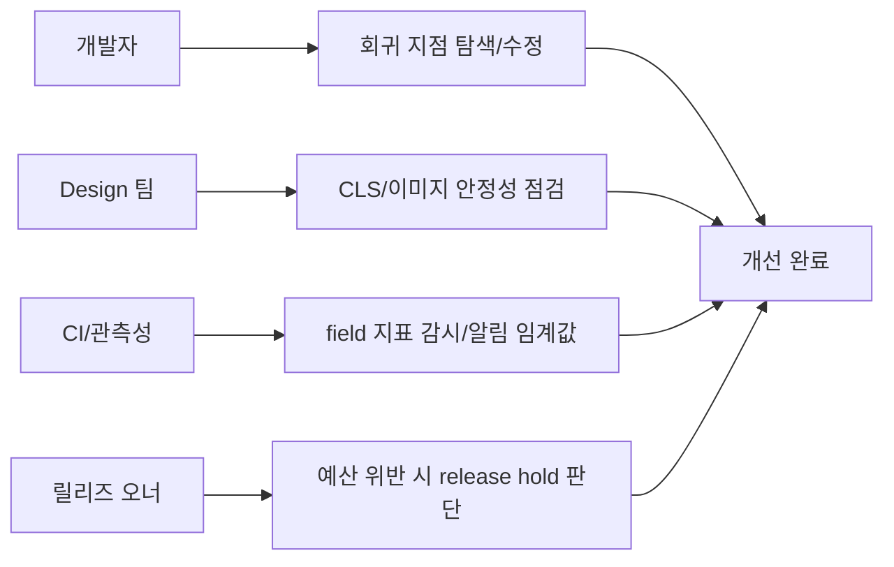

# 08. 성능 최적화 가이드

> **쉽게 읽기 안내**: 이 문서는 전문 용어가 많을 수 있어요.
> 이해가 어려우면 [공통 용어사전](./00_개발가이드_용어사전.md)에서 먼저 용어 뜻을 확인하고 본문을 이어서 읽으면 이해가 훨씬 빨라집니다.
> 특히 실무에서 자주 쓰이는 `배포`, `CI/CD`, `롤백`, `스키마`처럼 동작이 중요한 용어부터 먼저 익혀보세요.
## 0. 먼저 알고 가기 (30초 요약)

- 먼저 느린 구간을 정하고, 체감 영향이 큰 경로부터 고치세요.
- 코드 최적화보다 네트워크/캐시/번들 크기 개선이 먼저인 경우가 많습니다.
- 측정하지 않으면 최적화는 추측이므로 지표를 먼저 정의하세요.

## 초심자용 한눈에 보기

성능은 “빠른 화면”보다 “느린 구간이 어디인지 먼저 찾는 것”이 핵심입니다.

### 핵심 용어 빠르게 정리

| 용어 | 쉬운 뜻 |
| --- | --- |
| `Core Web Vitals` | 웹 체감속도/반응성/안정성의 핵심 지표 |
| `LCP` | 페이지에서 가장 큰 내용이 나타나는 속도 |
| `INP` | 사용자 입력 후 반응하는 데 걸린 시간 |
| `CLS` | 레이아웃 흔들림 여부 지표 |
| `번들 크기` | 브라우저로 내려가는 코드 양 |


| 분류 | 품질 & 성능 | 상태 | Stable |
| :--- | :--- | :--- | :--- |
| **연관 가이드** | [10. 인프라](./10_인프라_IaC_가이드.md), [02. React 19](./02_React19_실무_가이드.md), [11. CI/CD](./11_CICD_파이프라인_표준.md), [12. CDN 캐시](./12_CDN_캐시_전략.md) | **도구 원칙** | 벤더 중립 |
| **핵심 테마** | Vite 8 (Rolldown/Oxc), Core Web Vitals, React Compiler 1.0, View Transitions, Speculation Rules | **Update** | 최신 기준 |

---

> **"성능은 기능이 아니라 인프라다. 현재의 프론트엔드는 툴체인이 대신 최적화하고, 개발자는 지표를 관리한다."**
> 본 가이드는 Vite 8(Rolldown/Oxc)과 React Compiler 1.0, 공식 Core Web Vitals 임계값에 맞춘 최신 성능 최적화 전략을 다룹니다. 공식 good 기준은 LCP 2.5초 / INP 200ms / CLS 0.1이며, 제품 내부 성능 예산은 LCP 2.0초 이하를 권장합니다.

---

## 문서 책임 범위

| 이 문서가 결정하는 것 | 단일 출처로 따르는 문서 |
| :--- | :--- |
| Core Web Vitals, bundle budget, runtime cost, image/font 예산 | [11. CI/CD](./11_CICD_파이프라인_표준.md), [09. 관측성](./09_장애_대응_및_관측성_표준.md) |
| React 렌더링/컴파일러/서버 렌더링 성능 기준 | [02. React 19](./02_React19_실무_가이드.md), [04. 아키텍처](./04_아키텍처_설계_패턴.md) |
| CDN, cache, entry/asset freshness와 성능 계약 | [12. CDN 캐시](./12_CDN_캐시_전략.md) |
| 성능 회귀 테스트와 배포 차단 기준 | [07. 테스팅](./07_테스팅_가이드.md), [14. 배포](./14_배포_프로세스_체크리스트.md) |

---

## 0. 모든 프론트엔드 그룹 공통 Baseline

성능 표준은 “빠르게 만들기”가 아니라 **사용자 경험 회귀를 지속적으로 막는 운영 체계**입니다.

| 기준 | 최소 적용 |
| :--- | :--- |
| **측정 기준** | Core Web Vitals는 p75 기준으로 관리하고, lab 지표(Lighthouse)와 field 지표(RUM)를 분리해 봅니다. |
| **성능 예산** | JS/CSS 총량, 초기 route chunk, 이미지 크기, LCP element, INP long task 예산을 PR 게이트로 둡니다. |
| **이미지/폰트 기본값** | 이미지 크기 명시, lazy loading, AVIF/WebP, font-display, preload 남용 금지를 기본 규칙으로 둡니다. |
| **번들 회귀 방지** | 번들 분석 리포트를 CI artifact로 보관하고, 신규 대형 의존성은 대체안과 tree-shaking 결과를 요구합니다. |
| **런타임 최적화** | 메인 스레드 long task, layout shift, hydration cost, list virtualization 필요 여부를 기능 완료 조건에 포함합니다. |
| **배포 후 감시** | 배포 전 Lighthouse 통과와 배포 후 RUM p75 회귀 감지를 모두 둡니다. |

### 0.0 성능 개선 의사결정 루프



### 0.1 교차 검증 매트릭스

| 권고 | 1차 출처 | 실행 증거 | 운영 증거 | 철회 조건 |
| :--- | :--- | :--- | :--- | :--- |
| Core Web Vitals 예산 | Web Vitals 공식 기준 | Lighthouse/trace/bundle report | RUM p75 LCP/INP/CLS | lab 개선이 field 악화면 보류 |
| 최신 빌드 도구 | Vite 공식 릴리스와 migration guide | build time, chunk diff, visual smoke | JS error, route performance | plugin 호환성 회귀 시 이전 toolchain 유지 |
| React Compiler 성능 | React Compiler 공식 릴리스 | lint/build/render 비교 | interaction latency, CPU long task | compile cost 또는 hydration 회귀 시 opt-out |

### 0.2 운영 게이트

| Gate | Evidence | Owner | Rollback |
| :--- | :--- | :--- | :--- |
| Web Vitals gate | Lighthouse trace, RUM p75 dashboard | Performance owner | release hold 또는 performance flag off |
| Bundle budget gate | chunk diff, dependency justification | Feature owner | dependency removal 또는 lazy loading |
| Build migration gate | build time, plugin compatibility, smoke test | Platform owner | previous toolchain pinning |
| Runtime cost gate | long task trace, INP comparison | FE owner | worker/offscreen/lazy path 또는 feature rollback |

---

### 0.3 Field 성능 증거 계약

Core Web Vitals는 lab 점수가 아니라 실제 사용자 경험을 관리하기 위한 지표입니다. Lighthouse는 재현과 디버깅에 사용하고, release gate의 최종 판단은 RUM 또는 CrUX 같은 field data를 우선합니다.

| 지표 | 공식 기준 | field attribution | lab 재현 | 조치 기준 |
| :--- | :--- | :--- | :--- | :--- |
| LCP | p75 2.5s 이하 | element, URL, navigation type, connection hint | Lighthouse trace, network waterfall | LCP element preload/priority, 이미지 크기, SSR/cache 개선 |
| INP | p75 200ms 이하 | interaction target, event type, input delay, processing duration, presentation delay | Chrome Performance trace, Long Animation Frame 분석 | long task 분리, handler 축소, transition/worker 적용 |
| CLS | p75 0.1 이하 | shifted element, previous/current rect, session window | layout shift track, screenshot diff | 이미지/광고/폰트 크기 예약, late injection 제거 |

| 데이터 소스 | 사용 목적 | 병합 기준 |
| :--- | :--- | :--- |
| RUM | release별 실제 사용자 회귀 차단 | route, device class, connection, release id로 segment |
| CrUX/PageSpeed Insights | 충분한 트래픽이 있는 공개 URL의 외부 기준 확인 | URL 단위와 origin 단위를 분리해서 해석 |
| Lighthouse/trace | 원인 재현과 PR 단위 회귀 감지 | field p75를 대체하지 않고 before/after 증거로만 사용 |

---


### 0.4 성능 진단/개선 플로우

성능 목표를 한 번에 기억하려면 지표 수집 → 병목 진단 → 사용자 영향 제거 순서를 같이 본다.

```text
출발점
  ├─ Build 결과물
  │   - chunk size
  │   - 코드 분할
  │   - Tree-shaking
  ├─ Core Web Vitals
  │   - LCP, INP, CLS
  └─ Runtime 이벤트
      - long task
      - hydration delay
      - layout shift
              │
              v
      ┌───────────────────────────┐
      │ 1차 정량 진단            │
      │ - Lighthouse / trace      │
      │ - RUM p75                 │
      └───────────────────────────┘
              │
              v
      ┌───────────────────────────┐
      │ 1차 액션 분류            │
      │ - 이미지/폰트 최적화      │
      │ - 캐시 정책 재검토        │
      │ - 코드 분할/지연 로딩     │
      └───────────────────────────┘
              │
              v
      ┌───────────────────────────┐
      │ 성능 검증                  │
      │ - bundle + CWV 회귀 감시    │
      │ - field vs lab 비교        │
      └───────────────────────────┘
              │
              v
      통과 ── 미통과
              │       │
              │       ├─ 회귀면 feature owner 수정
              └─ pass ▶ 배포 게이트/관측성 handoff
```

```text
성능 조직 내 역할 예시

개발자      => 회귀 지점 탐색과 수정
Design 팀   => CLS/이미지 안정성 점검
CI/관측성   => field 지표 감시, 알림 임계값 관리
릴리즈 오너 => 예산 위반 시 release hold 판단
```





## 1. 빌드 도구: Vite 8 & Rolldown/Oxc

현재 기준 **Vite 8**은 Rolldown과 Oxc 기반 도구 체인으로 전환되었습니다. `rolldown-vite`로 사전 검증하던 팀은 Vite 8 마이그레이션 가이드에 맞춰 `vite` 단일 패키지 기준으로 플러그인 호환성, 청크 결과, CSS 처리 결과를 다시 검증합니다. 성능 수치는 프로젝트 구조와 플러그인에 따라 달라지므로, 마이그레이션 PR에는 빌드 시간/번들 크기/런타임 지표 비교를 반드시 첨부합니다.

### 1.1 트리쉐이킹(Tree-shaking) 고도화

Rolldown은 기존 Rollup보다 더 정밀하게 미사용 코드를 제거합니다.

*   **전략**: 라이브러리 선택 시 `sideEffects: false`가 명시된 ESM 지원 패키지를 우선순위로 둡니다.
*   **Vite 설정**: `build.target`을 `esnext`로 설정하여 현대적 브라우저 기능을 최대한 활용하세요.

#### 완전한 vite.config.ts 최적화 설정

```typescript
// vite.config.ts - 프로덕션 빌드 최적화 설정
import { defineConfig } from 'vite';
import react from '@vitejs/plugin-react';
import { visualizer } from 'rollup-plugin-visualizer';

export default defineConfig(({ mode }) => ({
  plugins: [
    react({
      // React Compiler 활성화 (babel 플러그인)
      babel: {
        plugins: [['babel-plugin-react-compiler', {}]],
      },
    }),
    // 번들 분석 리포트 생성 (빌드 시에만)
    mode === 'analyze' &&
      visualizer({
        open: true,
        filename: 'dist/bundle-report.html',
        gzipSize: true,
        brotliSize: true,
        template: 'treemap', // 'treemap' | 'sunburst' | 'network'
      }),
  ].filter(Boolean),

  build: {
    // 최신 브라우저 타겟으로 폴리필 최소화
    target: 'esnext',
    // 소스맵은 프로덕션에서 hidden으로 (관측성 업로드용)
    sourcemap: 'hidden',
    // CSS 코드 분할 활성화
    cssCodeSplit: true,
    // 청크 사이즈 경고 임계값 (KB)
    chunkSizeWarningLimit: 300,

    rollupOptions: {
      output: {
        // 수동 청크 분리 전략
        manualChunks: {
          // React 코어는 별도 청크로 분리 (캐시 효율)
          'react-vendor': ['react', 'react-dom'],
          // 라우터 별도 분리
          'router': ['react-router-dom'],
          // UI 라이브러리 별도 분리
          'ui-vendor': ['@radix-ui/react-dialog', '@radix-ui/react-popover'],
          // 유틸리티 라이브러리 분리
          'utils': ['date-fns', 'lodash-es'],
        },
      },
    },
  },

  // 의존성 사전 번들링 최적화
  optimizeDeps: {
    include: [
      'react',
      'react-dom',
      'react-router-dom',
    ],
    // 변경이 잦은 로컬 패키지는 제외
    exclude: ['@my-org/shared-utils'],
  },

  css: {
    // Lightning CSS 트랜스포머 활성화
    transformer: 'lightningcss',
    lightningcss: {
      // 타겟 브라우저 설정
      targets: {
        chrome: 110,
        firefox: 115,
        safari: 16,
      },
      // CSS 모듈 설정
      cssModules: {
        // 프로덕션에서 짧은 클래스명 생성
        pattern: mode === 'production' ? '[hash]_[local]' : '[name]_[local]_[hash]',
      },
    },
  },
}));
```

#### 번들 분석 실행

```bash
# 번들 분석 리포트 생성
VITE_MODE=analyze npx vite build --mode analyze

# 또는 package.json 스크립트로 등록
# "analyze": "vite build --mode analyze"
```

### 1.2 Lightning CSS 도입

Vite 8에서는 Rolldown/Oxc 기반 파이프라인과 Lightning CSS 옵션을 함께 검토합니다. CSS 변환 결과는 브라우저 타깃과 PostCSS 플러그인 의존성에 영향을 받으므로, `css.transformer` 전환 전후의 산출 CSS와 sourcemap을 반드시 비교합니다.

#### Lightning CSS의 주요 이점

| 기능 | PostCSS | Lightning CSS |
| :--- | :--- | :--- |
| CSS 미니피케이션 | cssnano 플러그인 필요 | 내장 |
| 벤더 프리픽스 | autoprefixer 플러그인 필요 | 내장 (targets 기반) |
| CSS Nesting | postcss-nesting 플러그인 필요 | 네이티브 지원 |
| 빌드 속도 | 느림 (JS 기반) | 10~100x 빠름 (Rust 기반) |

#### Lightning CSS 설정 예시

```typescript
// vite.config.ts 내 CSS 설정
css: {
  transformer: 'lightningcss',
  lightningcss: {
    targets: {
      chrome: 110,
      firefox: 115,
      safari: 16,
    },
    // CSS Nesting 자동 변환
    drafts: {
      customMedia: true,
    },
  },
},
```

### 1.3 코드 스플리팅 전략

라우트 기반 코드 스플리팅으로 초기 로드를 최소화합니다.

```typescript
// 라우트 기반 동적 임포트
import { lazy, Suspense } from 'react';

// 각 페이지를 lazy로 분리 — 해당 라우트 진입 시에만 로드됨
const Dashboard = lazy(() => import('./pages/Dashboard'));
const Settings = lazy(() => import('./pages/Settings'));
const Analytics = lazy(() => import('./pages/Analytics'));

// 라우트 설정
function AppRoutes() {
  return (
    <Suspense fallback={<PageSkeleton />}>
      <Routes>
        <Route path="/dashboard" element={<Dashboard />} />
        <Route path="/settings" element={<Settings />} />
        <Route path="/analytics" element={<Analytics />} />
      </Routes>
    </Suspense>
  );
}
```

---

## 2. 렌더링 최적화: React Compiler 1.0 시대

**React Compiler v1.0**이 2025년 10월 7일 정식 출시되어 stable 단계로 진입했습니다. 현재 공식 문서 기준 운영 baseline은 React 19.2 라인이며, RSC를 사용하는 경우 `react-server-dom-*` 패키지 19.2.4 이상 보안 패치를 별도 확인합니다. Compiler 도입 여부는 lint 결과, hydration 안정성, 실제 interaction trace 개선으로 판단합니다.

### 2.1 수동 최적화 제거: Before / After

React Compiler 도입 전후를 비교합니다.

#### Before (수동 메모이제이션)

```tsx
import { memo, useMemo, useCallback } from 'react';

// 매번 memo로 감싸야 했음
const UserCard = memo(({ user, onSelect }: UserCardProps) => {
  return (
    <div onClick={() => onSelect(user.id)}>
      <h3>{user.name}</h3>
      <p>{user.email}</p>
    </div>
  );
});

function UserList({ users, filter }: UserListProps) {
  // useMemo로 필터 결과를 수동 캐싱
  const filteredUsers = useMemo(
    () => users.filter((u) => u.name.includes(filter)),
    [users, filter]
  );

  // useCallback으로 콜백 안정성 확보
  const handleSelect = useCallback((id: string) => {
    console.log('선택된 유저:', id);
  }, []);

  return (
    <ul>
      {filteredUsers.map((user) => (
        <UserCard key={user.id} user={user} onSelect={handleSelect} />
      ))}
    </ul>
  );
}
```

#### After (React Compiler 자동 최적화)

```tsx
// memo, useMemo, useCallback 모두 제거 가능!
// 컴파일러가 의존성을 분석하여 자동으로 메모이제이션 적용

function UserCard({ user, onSelect }: UserCardProps) {
  return (
    <div onClick={() => onSelect(user.id)}>
      <h3>{user.name}</h3>
      <p>{user.email}</p>
    </div>
  );
}

function UserList({ users, filter }: UserListProps) {
  // 컴파일러가 자동으로 메모이제이션 — 의존성도 자동 추적
  const filteredUsers = users.filter((u) => u.name.includes(filter));

  const handleSelect = (id: string) => {
    console.log('선택된 유저:', id);
  };

  return (
    <ul>
      {filteredUsers.map((user) => (
        <UserCard key={user.id} user={user} onSelect={handleSelect} />
      ))}
    </ul>
  );
}
```

### 2.2 React Hooks compiler-powered lint 설정

컴파일러가 올바르게 동작하려면 "React의 규칙"을 지켜야 합니다. ESLint 플러그인으로 위반을 사전에 잡아냅니다.

```bash
npm install eslint-plugin-react-hooks --save-dev
```

```javascript
// eslint.config.js (Flat Config)
import reactHooks from 'eslint-plugin-react-hooks';
import { defineConfig } from 'eslint/config';

export default defineConfig([
  // React Compiler 관련 Rules of React 검사가 recommended preset에 포함됩니다.
  reactHooks.configs.flat.recommended,
]);
```

### 2.3 "Rules of React" — 컴파일러를 깨뜨리는 패턴

컴파일러는 React의 규칙을 전제로 동작합니다. 아래 패턴은 컴파일러 최적화를 무효화하거나 버그를 유발합니다.

```tsx
// ❌ 잘못된 패턴 1: 렌더링 중 외부 변수 직접 변경
let globalCounter = 0;

function BadComponent() {
  // 렌더링 도중 외부 상태 변경 — 컴파일러가 순수 함수로 가정하기 때문에 버그 발생
  globalCounter++;
  return <div>{globalCounter}</div>;
}

// ✅ 올바른 패턴: useState로 상태 관리
function GoodComponent() {
  const [counter, setCounter] = useState(0);
  return <div>{counter}</div>;
}
```

```tsx
// ❌ 잘못된 패턴 2: props나 state를 직접 변이(mutate)
function BadList({ items }: { items: string[] }) {
  // props를 직접 정렬하면 원본 배열이 변경됨
  items.sort();
  return <ul>{items.map((item) => <li key={item}>{item}</li>)}</ul>;
}

// ✅ 올바른 패턴: 새 배열을 만들어 정렬
function GoodList({ items }: { items: string[] }) {
  const sorted = [...items].sort();
  return <ul>{sorted.map((item) => <li key={item}>{item}</li>)}</ul>;
}
```

```tsx
// ❌ 잘못된 패턴 3: Hook을 조건문/반복문 안에서 호출
function BadConditionalHook({ isEnabled }: { isEnabled: boolean }) {
  if (isEnabled) {
    // 조건부 Hook 호출 — Hook 호출 순서가 바뀌면 컴파일러/런타임 모두 오류
    const [value, setValue] = useState('');
  }
  return <div />;
}

// ✅ 올바른 패턴: Hook은 항상 최상위에서 호출
function GoodConditionalHook({ isEnabled }: { isEnabled: boolean }) {
  const [value, setValue] = useState('');
  return <div>{isEnabled ? value : null}</div>;
}
```

---

## 3. 핵심 사용자 지표: Core Web Vitals

Web Vitals 공식 good 기준은 **LCP 2.5초 이하, INP 200ms 이하, CLS 0.1 이하**입니다. 이 문서에서는 검색/사용자 경험 기준을 공식 임계값으로 두고, 제품 내부 성능 예산은 더 보수적으로 LCP 2.0초 이하를 권장합니다. **INP는 FID를 대체한 핵심 상호작용 지표**이므로, 렌더링 최적화와 메인 스레드 제어의 1순위 지표로 관리합니다.

### 3.0 임계값 표

| 지표 | Good | Needs Improvement | Poor | 비고 |
| :--- | :--- | :--- | :--- | :--- |
| **LCP** | **≤ 2.5s** | 2.5s ~ 4.0s | > 4.0s | 내부 권장 예산은 ≤ 2.0s |
| **INP** | ≤ 200ms | 200ms ~ 500ms | > 500ms | FID는 2024년에 폐기, INP가 핵심 랭킹 시그널 |
| **CLS** | ≤ 0.1 | 0.1 ~ 0.25 | > 0.25 | 변동 없음 |
| TTFB | ≤ 800ms | 800ms ~ 1800ms | > 1800ms | 보조 지표 |
| FCP | ≤ 1.8s | 1.8s ~ 3.0s | > 3.0s | 보조 지표 |

> **권장 운영 기준**: 75퍼센타일(p75) 모바일 사용자 기준으로 공식 good 기준을 반드시 통과하고, 핵심 유입/전환 페이지는 내부 예산(LCP 2.0s, INP 200ms, CLS 0.1)을 별도 게이트로 둡니다.

### 3.1 메인 스레드 점유 차단 방지: `scheduler.yield()`

`scheduler.yield()`는 긴 작업(Long Task) 중간에 메인 스레드를 브라우저에 양보하여 사용자 입력을 즉시 처리할 수 있게 합니다.

```typescript
// scheduler.yield()를 활용한 점진적 데이터 처리
async function processLargeDataset(items: DataItem[]) {
  const BATCH_SIZE = 50; // 한 번에 처리할 항목 수
  const results: ProcessedItem[] = [];

  for (let i = 0; i < items.length; i += BATCH_SIZE) {
    const batch = items.slice(i, i + BATCH_SIZE);

    // 배치 단위로 처리
    for (const item of batch) {
      results.push(transformItem(item));
    }

    // 각 배치 후 메인 스레드에 양보
    // 브라우저가 대기 중인 사용자 입력, 페인팅 등을 먼저 처리
    if ('scheduler' in globalThis && 'yield' in scheduler) {
      await scheduler.yield();
    } else {
      // 폴백: setTimeout(0)으로 양보
      await new Promise((resolve) => setTimeout(resolve, 0));
    }
  }

  return results;
}
```

### 3.2 `startTransition`으로 입력 응답성 보장

사용자 입력(타이핑)과 무거운 UI 업데이트(검색 결과 렌더링)를 분리하여 입력이 끊기지 않게 합니다.

```tsx
import { useState, useTransition } from 'react';

function SearchPage() {
  // 입력값 — 즉시 반영되어야 하는 긴급 상태
  const [query, setQuery] = useState('');
  // 검색 결과 — 약간 늦어도 괜찮은 전환 상태
  const [results, setResults] = useState<SearchResult[]>([]);
  const [isPending, startTransition] = useTransition();

  function handleSearch(e: React.ChangeEvent<HTMLInputElement>) {
    const value = e.target.value;

    // 입력값은 즉시 반영 (사용자가 타이핑 지연을 느끼지 않도록)
    setQuery(value);

    // 검색 결과 업데이트는 낮은 우선순위로 전환
    // 새 입력이 들어오면 이전 전환은 자동 중단됨
    startTransition(() => {
      const filtered = performExpensiveSearch(value);
      setResults(filtered);
    });
  }

  return (
    <div>
      <input
        value={query}
        onChange={handleSearch}
        placeholder="검색어를 입력하세요..."
      />
      {/* 전환 중일 때 시각적 피드백 제공 */}
      {isPending && <Spinner />}
      <SearchResultList results={results} />
    </div>
  );
}
```

### 3.3 Web Worker로 무거운 연산 분리

메인 스레드에서 실행하면 UI가 멈추는 무거운 연산은 Web Worker로 분리합니다.

```typescript
// workers/data-processor.worker.ts
// Web Worker 내부 — 메인 스레드와 별도의 스레드에서 실행됨
self.onmessage = (event: MessageEvent<{ data: RawData[] }>) => {
  const { data } = event.data;

  // 무거운 연산 수행 (메인 스레드 차단 없음)
  const processed = data
    .map((item) => ({
      ...item,
      score: calculateComplexScore(item),   // CPU 집약적 계산
      category: classifyItem(item),          // 분류 로직
    }))
    .sort((a, b) => b.score - a.score);

  // 결과를 메인 스레드로 전달
  self.postMessage({ processed });
};

function calculateComplexScore(item: RawData): number {
  // 복잡한 점수 계산 로직 (예: 통계 분석, ML 추론 등)
  let score = 0;
  for (let i = 0; i < 10000; i++) {
    score += Math.sin(item.value * i) * Math.cos(item.weight * i);
  }
  return score;
}
```

```tsx
// hooks/useWorkerProcessor.ts
// 메인 스레드에서 Worker를 사용하는 커스텀 Hook
import { useCallback, useRef, useState } from 'react';

export function useWorkerProcessor() {
  const [result, setResult] = useState<ProcessedData[] | null>(null);
  const [isProcessing, setIsProcessing] = useState(false);
  const workerRef = useRef<Worker | null>(null);

  const process = useCallback((data: RawData[]) => {
    // 이전 Worker가 있으면 종료
    workerRef.current?.terminate();

    // 새 Worker 생성 (Vite가 자동으로 번들링)
    const worker = new Worker(
      new URL('../workers/data-processor.worker.ts', import.meta.url),
      { type: 'module' }
    );
    workerRef.current = worker;

    setIsProcessing(true);

    worker.onmessage = (event) => {
      setResult(event.data.processed);
      setIsProcessing(false);
      worker.terminate();
    };

    worker.onerror = (error) => {
      console.error('Worker 에러:', error);
      setIsProcessing(false);
    };

    // Worker에 데이터 전송
    worker.postMessage({ data });
  }, []);

  return { result, isProcessing, process };
}
```

---

## 4. 브라우저 레벨의 선제적 최적화

### 4.1 Speculation Rules API

사용자가 다음 페이지를 클릭하기 전에 브라우저가 미리 페이지를 가져오거나(Prefetch) 렌더링(Prerender)하도록 명령합니다.

```html
<!-- 문서 기반 규칙: 패턴 매칭으로 일괄 적용 -->
<script type="speculationrules">
{
  "prerender": [
    {
      "source": "document",
      "where": {
        "and": [
          { "href_matches": "/products/*" },
          { "not": { "href_matches": "/products/*/edit" } }
        ]
      },
      "eagerness": "moderate"
    }
  ],
  "prefetch": [
    {
      "source": "document",
      "where": { "href_matches": "/api/v1/*" },
      "eagerness": "conservative"
    }
  ]
}
</script>
```

```html
<!-- URL 목록 기반 규칙: 특정 페이지를 명시적으로 지정 -->
<script type="speculationrules">
{
  "prerender": [
    {
      "source": "list",
      "urls": ["/dashboard", "/settings"],
      "eagerness": "eager"
    }
  ]
}
</script>
```

**Eagerness 단계 설명:**

| 값 | 동작 | 사용 시점 |
| :--- | :--- | :--- |
| `eager` | 즉시 프리렌더 | 거의 확실히 이동할 페이지 (CTA 버튼 대상) |
| `moderate` | 링크에 hover 시 프리렌더 | 가능성이 높은 네비게이션 |
| `conservative` | 링크 클릭 직전(pointerdown)에 프리렌더 | 대부분의 일반 링크 |

#### Speculation Rules + View Transitions Level 2 결합 (현재 권장)

현재 기준 **View Transitions Level 2(cross-document)** 가 Chrome·Edge·Safari 18.2 모두에서 안정 지원됩니다. Speculation Rules의 prerender와 `@view-transition` 규칙을 결합하면 MPA에서도 SPA 수준의 부드러운 전환을 얻을 수 있어, "SPA 없이도 즉각적 네비게이션"이 가능해졌습니다.

```css
/* 대상 문서에서 cross-document 전환 활성화 */
@view-transition {
  navigation: auto;
}

/* 영역별 view-transition-name으로 공유 요소 트랜지션 정의 */
.hero-image {
  view-transition-name: hero;
}
```

```html
<!-- prerender + cross-document view transition 콤보 -->
<script type="speculationrules">
{
  "prerender": [
    { "source": "document", "where": { "href_matches": "/articles/*" }, "eagerness": "moderate" }
  ]
}
</script>
```

> **효과**: 사용자가 링크를 호버하면 다음 페이지를 미리 렌더하고, 클릭 순간 `@view-transition`이 화면을 자연스럽게 교체합니다. 구형 브라우저는 즉시 일반 네비게이션으로 graceful degrade 됩니다.

### 4.2 Fetch Priority API

중요한 자산(LCP 이미지 등)의 로드 우선순위를 명시적으로 높입니다.

```tsx
{/* LCP 대상 히어로 이미지 — 최우선 로드 */}


{/* 스크롤 아래에 있는 이미지 — 우선순위 낮춤 */}

```

### 4.3 Lazy Loading 패턴

#### React.lazy + Suspense (라우트 레벨)

```tsx
import { lazy, Suspense } from 'react';

// 모달처럼 조건부로 표시되는 컴포넌트를 lazy로 분리
const HeavyModal = lazy(() => import('./components/HeavyModal'));

function App() {
  const [showModal, setShowModal] = useState(false);

  return (
    <div>
      <button onClick={() => setShowModal(true)}>모달 열기</button>
      {showModal && (
        <Suspense fallback={<ModalSkeleton />}>
          <HeavyModal onClose={() => setShowModal(false)} />
        </Suspense>
      )}
    </div>
  );
}
```

#### 이미지 지연 로딩

```tsx
// 네이티브 lazy loading — 뷰포트에 진입할 때 로드

```

### 4.4 이미지 최적화: 포맷 선택과 반응형

```tsx
{/* picture 태그로 최적 포맷 선택 */}
<picture>
  {/* AVIF: 가장 작은 크기, 최신 브라우저 지원 */}
  <source srcSet="/hero.avif" type="image/avif" />
  {/* WebP: 넓은 브라우저 지원 */}
  <source srcSet="/hero.webp" type="image/webp" />
  {/* JPEG: 폴백 */}
  
</picture>

{/* 반응형 이미지: 뷰포트에 따라 적절한 크기 로드 */}

```

---

## 5. 번들 사이즈 최적화

### 5.1 동적 임포트(Dynamic Import)로 초기 번들 줄이기

```typescript
// 무거운 라이브러리는 사용 시점에 동적 임포트
async function exportToExcel(data: ExportData[]) {
  // xlsx 라이브러리를 사용할 때만 로드 (~200KB 절약)
  const { utils, writeFile } = await import('xlsx');

  const worksheet = utils.json_to_sheet(data);
  const workbook = utils.book_new();
  utils.book_append_sheet(workbook, worksheet, 'Report');
  writeFile(workbook, 'report.xlsx');
}

// 차트는 해당 탭 진입 시에만 로드
async function loadChart(container: HTMLElement, config: ChartConfig) {
  const { Chart, registerables } = await import('chart.js');
  Chart.register(...registerables);
  return new Chart(container, config);
}
```

### 5.2 트리쉐이킹 검증

```bash
# 번들에 포함된 모듈 확인 (source-map-explorer 사용)
npx source-map-explorer dist/assets/*.js

# 또는 vite-bundle-visualizer
npx vite-bundle-visualizer
```

```typescript
// ❌ 잘못된 패턴: 전체 라이브러리 임포트
import _ from 'lodash';
const result = _.groupBy(data, 'category');

// ✅ 올바른 패턴: lodash-es에서 개별 함수만 임포트
import { groupBy } from 'lodash-es';
const result = groupBy(data, 'category');

// ❌ 잘못된 패턴: 아이콘 전체 임포트
import * as Icons from 'lucide-react';

// ✅ 올바른 패턴: 개별 아이콘만 임포트
import { Search, Menu, X } from 'lucide-react';
```

### 5.3 번들 버짓 CI 게이트

CI 파이프라인에서 번들 크기를 자동으로 검증합니다.

```javascript
// bundle-budget.config.js
// CI에서 빌드 후 이 스크립트로 번들 크기 체크
import { readFileSync, readdirSync } from 'fs';
import { join } from 'path';
import { gzipSync } from 'zlib';

const BUDGET = {
  // gzip 기준 최대 허용 크기 (bytes)
  'index': 150_000,        // 메인 번들: 150KB
  'react-vendor': 50_000,  // React 벤더: 50KB
  'total': 350_000,        // 전체 JS: 350KB
};

function checkBudget() {
  const distDir = 'dist/assets';
  const files = readdirSync(distDir).filter((f) => f.endsWith('.js'));
  let totalSize = 0;
  const violations: string[] = [];

  for (const file of files) {
    const content = readFileSync(join(distDir, file));
    const gzippedSize = gzipSync(content).length;
    totalSize += gzippedSize;

    // 청크 이름 매칭
    for (const [name, limit] of Object.entries(BUDGET)) {
      if (name !== 'total' && file.includes(name) && gzippedSize > limit) {
        violations.push(
          `❌ ${file}: ${(gzippedSize / 1024).toFixed(1)}KB > ${(limit / 1024).toFixed(1)}KB 제한 초과`
        );
      }
    }
  }

  if (totalSize > BUDGET.total) {
    violations.push(
      `❌ 전체 JS: ${(totalSize / 1024).toFixed(1)}KB > ${(BUDGET.total / 1024).toFixed(1)}KB 제한 초과`
    );
  }

  if (violations.length > 0) {
    console.error('번들 버짓 초과!\n' + violations.join('\n'));
    process.exit(1); // CI 실패
  } else {
    console.log(`✅ 번들 버짓 통과 (전체: ${(totalSize / 1024).toFixed(1)}KB)`);
  }
}

checkBudget();
```

---

## 6. 이미지 및 미디어 최적화

### 6.1 포맷 선택 가이드

| 포맷 | 압축률 | 브라우저 지원 | 용도 |
| :--- | :--- | :--- | :--- |
| **AVIF** | 최고 (JPEG 대비 50%↓) | Chrome, Firefox, Safari 16.4+ | 사진, 복잡한 이미지 |
| **WebP** | 우수 (JPEG 대비 25-35%↓) | 모든 최신 브라우저 | 범용 (사진+그래픽) |
| **SVG** | 벡터 (해상도 무관) | 전체 | 아이콘, 로고, 일러스트 |
| **JPEG** | 보통 | 전체 | 폴백용 |

### 6.2 Next.js Image 컴포넌트 활용

```tsx
import Image from 'next/image';

// Next.js Image: 자동 최적화, 포맷 변환, 반응형 처리
function ProductCard({ product }: { product: Product }) {
  return (
    <div>
      <Image
        src={product.imageUrl}
        alt={product.name}
        width={400}
        height={300}
        // 뷰포트 대비 사이즈 힌트 (반응형 최적화)
        sizes="(max-width: 768px) 100vw, (max-width: 1200px) 50vw, 33vw"
        // LCP 대상이면 priority 설정
        priority={product.isFeatured}
        // 기본적으로 lazy loading 적용됨
        placeholder="blur"
        blurDataURL={product.blurHash}
      />
      <h3>{product.name}</h3>
    </div>
  );
}
```

### 6.3 이미지 빌드 파이프라인

```bash
# sharp를 사용한 이미지 변환 스크립트 예시
# scripts/optimize-images.sh

# WebP 변환 (품질 80)
npx sharp-cli --input "src/assets/images/*.{jpg,png}" --output "public/images" --format webp --quality 80

# AVIF 변환 (품질 60 — AVIF는 낮은 품질에서도 좋은 화질)
npx sharp-cli --input "src/assets/images/*.{jpg,png}" --output "public/images" --format avif --quality 60
```

---

## 7. 가상 스크롤(Virtualization)

수천~수만 개의 항목을 렌더링할 때 **보이는 영역의 항목만** DOM에 존재하도록 하여 성능을 확보합니다.

### 7.1 TanStack Virtual 활용 예시

```tsx
import { useVirtualizer } from '@tanstack/react-virtual';
import { useRef } from 'react';

interface VirtualListProps {
  items: ListItem[];
  itemHeight: number;
}

function VirtualList({ items, itemHeight }: VirtualListProps) {
  // 스크롤 컨테이너 ref
  const parentRef = useRef<HTMLDivElement>(null);

  const virtualizer = useVirtualizer({
    count: items.length,
    getScrollElement: () => parentRef.current,
    // 각 항목의 예상 높이 (고정 높이인 경우)
    estimateSize: () => itemHeight,
    // 뷰포트 바깥으로 미리 렌더링할 항목 수 (스크롤 부드러움 향상)
    overscan: 5,
  });

  return (
    <div
      ref={parentRef}
      style={{
        height: '600px',
        overflow: 'auto',
      }}
    >
      {/* 전체 높이를 확보하여 스크롤바가 올바르게 표시되도록 함 */}
      <div
        style={{
          height: `${virtualizer.getTotalSize()}px`,
          width: '100%',
          position: 'relative',
        }}
      >
        {virtualizer.getVirtualItems().map((virtualRow) => (
          <div
            key={virtualRow.key}
            style={{
              position: 'absolute',
              top: 0,
              left: 0,
              width: '100%',
              height: `${virtualRow.size}px`,
              // translateY로 위치 지정 (layout thrashing 방지)
              transform: `translateY(${virtualRow.start}px)`,
            }}
          >
            <ListItemComponent item={items[virtualRow.index]} />
          </div>
        ))}
      </div>
    </div>
  );
}
```

### 7.2 가변 높이 가상 스크롤

```tsx
function DynamicHeightVirtualList({ items }: { items: ChatMessage[] }) {
  const parentRef = useRef<HTMLDivElement>(null);

  const virtualizer = useVirtualizer({
    count: items.length,
    getScrollElement: () => parentRef.current,
    // 가변 높이: 예상치만 제공하면 실제 렌더 후 자동 측정됨
    estimateSize: (index) => {
      // 메시지 길이에 따른 높이 추정
      const messageLength = items[index].content.length;
      return Math.max(60, Math.ceil(messageLength / 50) * 24 + 40);
    },
    // 가변 높이일 때 측정 활성화
    measureElement: (el) => el.getBoundingClientRect().height,
  });

  return (
    <div ref={parentRef} style={{ height: '100%', overflow: 'auto' }}>
      <div
        style={{
          height: `${virtualizer.getTotalSize()}px`,
          position: 'relative',
        }}
      >
        {virtualizer.getVirtualItems().map((virtualRow) => (
          <div
            key={virtualRow.key}
            // ref를 연결하면 자동으로 실제 높이를 측정함
            ref={virtualizer.measureElement}
            data-index={virtualRow.index}
            style={{
              position: 'absolute',
              top: 0,
              width: '100%',
              transform: `translateY(${virtualRow.start}px)`,
            }}
          >
            <ChatBubble message={items[virtualRow.index]} />
          </div>
        ))}
      </div>
    </div>
  );
}
```

---

## 8. 성능 모니터링 및 측정

### 8.1 web-vitals 라이브러리로 Core Web Vitals 수집

```typescript
// lib/performance.ts
import type { Metric } from 'web-vitals';
import { onCLS, onINP, onLCP, onFCP, onTTFB } from 'web-vitals/attribution';

type MetricWithAttribution = Metric & {
  attribution?: Record<string, unknown>;
};

function getDeviceClass(): 'mobile' | 'tablet' | 'desktop' {
  const width = window.innerWidth;
  if (width < 768) return 'mobile';
  if (width < 1024) return 'tablet';
  return 'desktop';
}

function getConnectionHint(): string | undefined {
  if (!('connection' in navigator)) return undefined;
  return (navigator as Navigator & { connection?: { effectiveType?: string } })
    .connection?.effectiveType;
}

// 성능 지표 수집 및 전송
function sendMetric(metric: MetricWithAttribution) {
  // 분석 서비스로 전송 (예: 자체 분석 API)
  const payload = {
    name: metric.name,
    value: metric.value,
    rating: metric.rating,  // 'good' | 'needs-improvement' | 'poor'
    delta: metric.delta,
    id: metric.id,
    navigationType: metric.navigationType,
    attribution: metric.attribution,
    release: document.documentElement.dataset.release ?? 'unknown',
    route: window.location.pathname,
    deviceClass: getDeviceClass(),
    connection: getConnectionHint(),
    url: window.location.href,
    timestamp: Date.now(),
  };

  // Navigator.sendBeacon으로 페이지 언로드 시에도 안정적으로 전송
  if (navigator.sendBeacon) {
    navigator.sendBeacon('/api/metrics', JSON.stringify(payload));
  } else {
    fetch('/api/metrics', {
      method: 'POST',
      body: JSON.stringify(payload),
      keepalive: true,
    });
  }
}

// Core Web Vitals 수집 시작
export function initPerformanceMonitoring() {
  onCLS(sendMetric);   // Cumulative Layout Shift
  onINP(sendMetric);   // Interaction to Next Paint
  onLCP(sendMetric);   // Largest Contentful Paint
  onFCP(sendMetric);   // First Contentful Paint
  onTTFB(sendMetric);  // Time to First Byte
}
```

```tsx
// main.tsx 또는 App.tsx 에서 초기화
import { initPerformanceMonitoring } from './lib/performance';

// 앱 마운트 후 성능 모니터링 시작
initPerformanceMonitoring();
```

### 8.2 Lighthouse CI 설정

CI 파이프라인에 Lighthouse를 통합하여 성능 회귀를 자동 감지합니다.

```javascript
// lighthouserc.js
module.exports = {
  ci: {
    collect: {
      // 테스트 대상 URL
      url: ['http://localhost:3000/', 'http://localhost:3000/products'],
      // 3회 실행하여 중앙값 사용
      numberOfRuns: 3,
      startServerCommand: 'npm run preview',
      startServerReadyPattern: 'Local',
    },
    assert: {
      assertions: {
        // Core Web Vitals 임계값 설정 (공식 good 기준 + 내부 예산)
        'categories:performance': ['error', { minScore: 0.9 }],
        'categories:accessibility': ['warn', { minScore: 0.95 }],
        // 개별 지표 기준 — 공식 LCP good은 2.5s, 핵심 페이지는 2.0s 예산을 별도 운영
        'largest-contentful-paint': ['error', { maxNumericValue: 2500 }],
        'interaction-to-next-paint': ['error', { maxNumericValue: 200 }],
        'interactive': ['error', { maxNumericValue: 3500 }],
        'cumulative-layout-shift': ['error', { maxNumericValue: 0.1 }],
        // 번들 관련
        'total-byte-weight': ['warn', { maxNumericValue: 500000 }],
        'unused-javascript': ['warn', { maxNumericValue: 50000 }],
      },
    },
    upload: {
      // 결과 저장 (임시 서버 또는 자체 LHCI 서버)
      target: 'temporary-public-storage',
    },
  },
};
```

```yaml
# .ci/workflows/lighthouse.yml (CI 예시)
name: Lighthouse CI
on: [pull_request]
jobs:
  lighthouse:
    runs-on: ubuntu-latest
    steps:
      - uses: actions/checkout@v4
      - uses: actions/setup-node@v4
        with:
          node-version: 20
      - run: npm ci
      - run: npm run build
      - name: Lighthouse CI
        run: |
          npm install -g @lhci/cli
          lhci autorun
```

### 8.3 Performance Budget 대시보드

```typescript
// 성능 버짓 기준 정의
const PERFORMANCE_BUDGET = {
  // Core Web Vitals 공식 good 기준
  LCP: 2500,    // ms — Good: ≤2.5s
  INP: 200,     // ms — Good: ≤200ms (핵심 랭킹 시그널)
  CLS: 0.1,     // 점수 — Good: ≤0.1

  // 핵심 전환 페이지 내부 권장 예산
  TARGET_LCP: 2000,

  // 리소스 버짓
  totalJS: 350,     // KB (gzip)
  totalCSS: 50,     // KB (gzip)
  totalImages: 500, // KB
  totalFonts: 100,  // KB

  // 네트워크 요청 수
  maxRequests: 50,

  // 로드 타임
  TTFB: 800,    // ms
  FCP: 1800,    // ms
} as const;
```

---

## 9. 주의사항 및 흔한 실수

### 9.1 조기 최적화(Premature Optimization)

```tsx
// ❌ 잘못된 예: 모든 컴포넌트에 일괄 memo 적용 (React Compiler 이전 시대 습관)
// React Compiler 환경에서는 수동 memo가 불필요하며, 오히려 코드 복잡성만 증가
const SimpleButton = memo(({ label, onClick }) => (
  <button onClick={onClick}>{label}</button>
));

// ✅ 올바른 접근: 먼저 측정하고, 병목이 확인된 곳만 최적화
// React DevTools Profiler → 렌더링 시간 확인 → 실제 느린 컴포넌트만 대응
```

**원칙**: 측정 없는 최적화는 하지 않습니다. Profiler, Lighthouse, web-vitals로 문제를 먼저 확인하세요.

### 9.2 잘못된 지표 추적

| 잘못된 지표 | 올바른 지표 | 이유 |
| :--- | :--- | :--- |
| 페이지 로드 이벤트 시간 | LCP (공식 good ≤ 2.5s, 내부 예산 ≤ 2.0s) | 실제 사용자가 콘텐츠를 보는 시점 |
| FID (First Input Delay) | INP (Interaction to Next Paint) | FID는 2024년 폐기, 최신 코어 업데이트에서 INP가 핵심 시그널 |
| 단일 인터랙션의 빠른 지연 | 세션 p75 INP | INP는 세션 전체에서 가장 느린 인터랙션을 반영 |
| 번들 사이즈 (raw) | 번들 사이즈 (gzip/brotli) | 실제 전송 크기가 중요 |
| 개발 서버 속도 | 프로덕션 빌드 후 측정 | Vite dev는 미번들 ESM — 프로덕션과 다름 |

### 9.3 메모리 누수 패턴

```tsx
// ❌ 잘못된 예: 이벤트 리스너 정리 누락
function WindowSizeTracker() {
  const [size, setSize] = useState({ width: 0, height: 0 });

  useEffect(() => {
    const handler = () => {
      setSize({ width: window.innerWidth, height: window.innerHeight });
    };
    window.addEventListener('resize', handler);
    // 클린업 함수 누락 — 컴포넌트 언마운트 후에도 리스너가 남아 메모리 누수
  }, []);

  return <div>{size.width} x {size.height}</div>;
}

// ✅ 올바른 예: 클린업 함수로 리스너 제거
function WindowSizeTracker() {
  const [size, setSize] = useState({ width: 0, height: 0 });

  useEffect(() => {
    const handler = () => {
      setSize({ width: window.innerWidth, height: window.innerHeight });
    };
    window.addEventListener('resize', handler);

    // 언마운트 시 리스너 정리
    return () => window.removeEventListener('resize', handler);
  }, []);

  return <div>{size.width} x {size.height}</div>;
}
```

### 9.4 잘못된 코드 스플리팅

```tsx
// ❌ 잘못된 예: 너무 작은 단위로 분할 — 오히려 HTTP 요청 증가로 역효과
const Button = lazy(() => import('./Button'));
const Icon = lazy(() => import('./Icon'));

// ✅ 올바른 기준: 라우트 단위 또는 50KB 이상의 독립 기능 단위로 분할
const AdminPanel = lazy(() => import('./features/admin/AdminPanel'));
const ReportViewer = lazy(() => import('./features/reports/ReportViewer'));
```

### 9.5 이미지 최적화 누락

```tsx
// ❌ 흔한 실수: 원본 이미지를 그대로 사용

// → 4000x3000 원본을 다운로드한 후 브라우저가 400x300으로 축소 — 데이터 낭비

// ✅ 올바른 접근: 표시 크기에 맞는 이미지 제공

```

---

## AI 보조 성능 튜닝 검증

AI 사용 정책과 검증 책임은 [18. AI 개발 워크플로우](./18_AI_개발_워크플로우_종합.md)를 따릅니다. 성능 제안은 코드 변경 전후의 trace와 RUM 지표로 검증할 때만 채택합니다.

| 시나리오 | 입력 | AI 산출물 | 필수 검증 |
| :--- | :--- | :--- | :--- |
| INP 병목 분석 | performance trace, interaction flow | long task 분리 후보 | INP/long task before-after |
| 번들 감량 | bundle report, dependency graph | dynamic import/tree-shaking 후보 | chunk diff, route smoke |
| Compiler 친화 리팩터 | lint report, component code | rules-of-react 수정안 | compiler lint, render count |
| 이미지/폰트 최적화 | LCP element, network waterfall | preload/lazy/format 후보 | LCP p75 또는 lab trace 비교 |

---

## 체크리스트

### 빌드 & 번들
- [ ] Vite 8(Rolldown/Oxc)로 업그레이드했고, 기존 `rolldown-vite` 사전 검증 결과와 실제 Vite 8 빌드 결과를 비교했나요?
- [ ] `css.transformer`를 `'lightningcss'`로 설정했나요?
- [ ] `build.target`이 `'esnext'`로 설정되었나요?
- [ ] `rollup-plugin-visualizer`로 번들 구성을 분석했나요?
- [ ] `manualChunks`로 벤더 라이브러리를 적절히 분리했나요?
- [ ] 트리쉐이킹이 제대로 동작하는지 (lodash-es 등) 확인했나요?
- [ ] 번들 버짓 CI 게이트가 설정되었나요?

### React & 렌더링
- [ ] React Compiler v1.0 stable이 활성화되어 수동 `memo`/`useMemo`/`useCallback`이 제거되었나요?
- [ ] `eslint-plugin-react-hooks@latest`의 compiler-powered 규칙으로 Rules of React 위반을 탐지하고 있나요?
- [ ] 무거운 상태 업데이트에 `startTransition`이 적용되었나요?
- [ ] CPU 집약적 연산이 Web Worker로 분리되었나요?

### Core Web Vitals
- [ ] LCP가 공식 good 기준인 **2.5s 이하**인가요? 핵심 전환 페이지는 내부 예산 **2.0s 이하**를 별도로 충족하나요?
- [ ] LCP 대상 이미지에 `fetchpriority="high"`가 적용되었나요?
- [ ] INP p75가 200ms 이하인가요?
- [ ] INP attribution으로 느린 interaction target과 event type을 수집하나요?
- [ ] CLS가 0.1 이하인가요? (이미지/폰트에 크기 지정 확인)
- [ ] cross-document **View Transitions Level 2** + Speculation Rules 콤보를 활용 중인가요?

### 이미지 & 미디어
- [ ] 이미지가 WebP/AVIF 포맷으로 변환되었나요?
- [ ] `<picture>` 태그로 포맷 폴백이 구성되었나요?
- [ ] 스크롤 아래 이미지에 `loading="lazy"`가 적용되었나요?
- [ ] 반응형 이미지(`srcSet` + `sizes`)가 설정되었나요?

### 코드 스플리팅 & 로딩
- [ ] 라우트 단위 코드 스플리팅이 적용되었나요?
- [ ] 무거운 라이브러리(xlsx, chart.js 등)가 동적 임포트로 전환되었나요?
- [ ] Speculation Rules로 다음 페이지 프리렌더가 설정되었나요?

### 대규모 데이터 렌더링
- [ ] 대규모 리스트에 가상 스크롤(TanStack Virtual 등)이 적용되었나요?
- [ ] `useDeferredValue`로 비긴급 렌더링이 지연 처리되었나요?

### 모니터링
- [ ] `web-vitals` 라이브러리로 Core Web Vitals를 수집하고 있나요?
- [ ] RUM payload에 release id, route, device class, attribution이 포함되나요?
- [ ] Lighthouse 개선이 RUM p75 악화로 이어지지 않는지 확인하나요?
- [ ] Lighthouse CI가 PR 파이프라인에 통합되었나요?
- [ ] 성능 버짓이 정의되고 CI에서 검증되고 있나요?

---

## 실무 적용 가이드

### 언제 이 문서를 펼칠까

- LCP, INP, CLS, bundle size가 나빠졌지만 원인을 찾기 어려울 때
- 이미지, 폰트, third-party script를 추가해야 할 때
- lab 점수와 실제 사용자 지표가 다를 때

### 적용 순서

1. route별 성능 예산을 정한다.
2. bundle analyzer로 증가분을 먼저 확인한다.
3. RUM p75와 trace attribution으로 실제 병목을 찾는다.
4. 이미지, 폰트, third-party, hydration 비용을 분리해 본다.
5. 최적화 전후 수치를 PR에 남긴다.

### 함께 두는 파일

- route 전용 lazy component와 loader는 route 가까이에 둔다.
- 성능 측정 helper는 공통으로 두되 feature별 metric name과 budget은 feature에 둔다.
- 이미지/폰트 asset은 사용하는 화면과 추적 가능하게 연결한다.

### 흔한 실수

- Lighthouse 한 번의 점수만 보고 완료 처리한다.
- 공통 컴포넌트에 무거운 dependency를 숨긴다.
- 이미지 최적화 없이 CSS로만 크기를 줄인다.
- third-party script의 로딩 시점과 실패 처리를 검증하지 않는다.

### PR 완료 기준

- [ ] 성능 예산과 측정 결과가 있다.
- [ ] bundle diff가 확인되었다.
- [ ] RUM 또는 trace attribution이 있다.
- [ ] 최적화로 접근성/UX가 깨지지 않았다.
