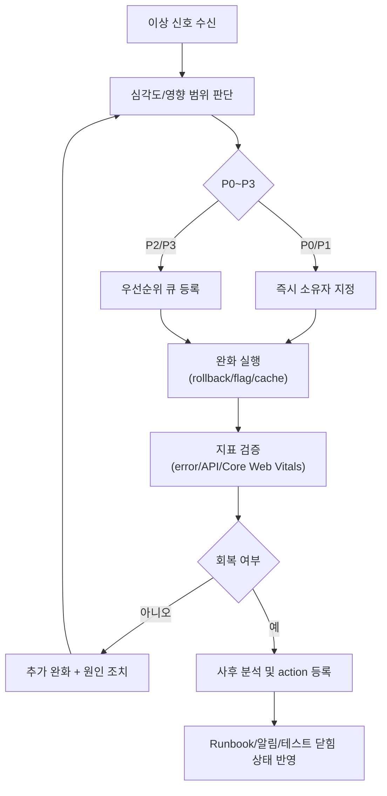
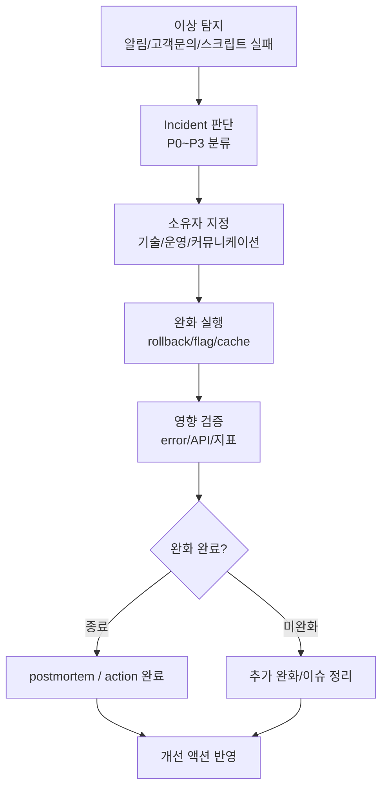
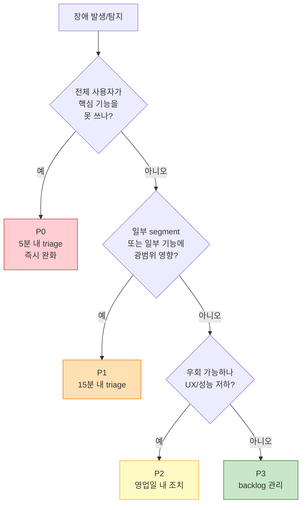
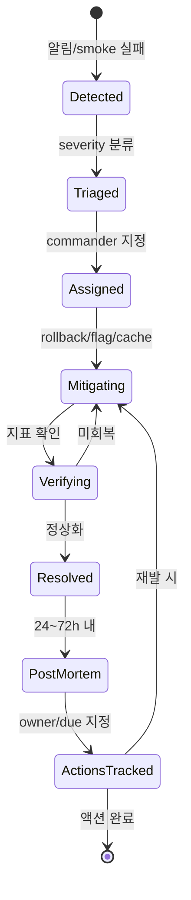
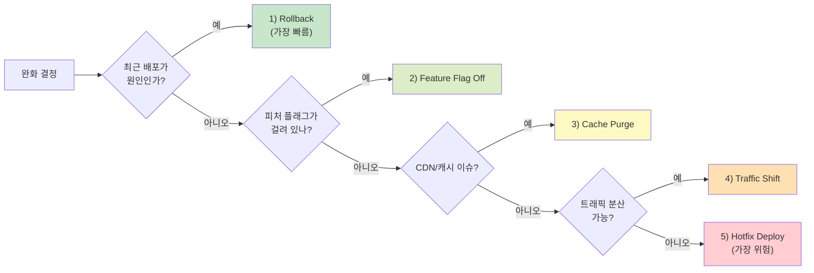
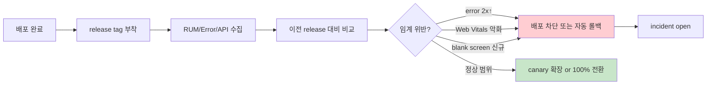

# 09. 장애 대응 및 관측성 표준

## 0. 먼저 알고 가기 (30초 요약)

- 장애는 `발견`보다 `격리`와 `복구 속도`가 더 중요합니다.
- 경보는 노이즈를 줄이고 실제 사용자 영향에 맞춰 단계적으로 경보하세요.
- 사후 복구만이 아니라 같은 장애가 다시 안 나게 `원인-조치-재발방지`를 남기세요.

## 초심자용 한눈에 보기

문제는 “발견 빠르게, 영향 제한, 복구 빨리”가 핵심입니다.

### 핵심 용어 빠르게 정리

| 용어            | 쉬운 뜻                                      |
| --------------- | -------------------------------------------- |
| `관측성`        | 로그/지표/추적으로 문제 원인을 추적하는 체계 |
| `심각도(P0~P3)` | 장애의 긴급성과 사용자 영향 크기 구분        |
| `알림`          | 문제가 감지되었을 때 자동 통보 체계          |
| `postmortem`    | 장애 종료 후 원인과 개선안을 정리하는 회고   |
| `SLA`           | 약속된 가용성/복구 시간 같은 운영 기준       |

| 분류            | 품질 & 운영                                                                                                                                                          | 상태          | Stable    |
| :-------------- | :------------------------------------------------------------------------------------------------------------------------------------------------------------------- | :------------ | :-------- |
| **연관 가이드** | [07. 테스팅](./07_테스팅_가이드.md), [08. 성능](./08_성능_최적화_가이드.md), [11. CI/CD](./11_CICD_파이프라인_표준.md), [14. 배포](./14_배포_프로세스_체크리스트.md) | **도구 원칙** | 벤더 중립 |
| **핵심 테마**   | 관측성, 알림, 장애 분류, 복구, 사후 분석, 재발 방지                                                                                                                  | **Update**    | 최신 기준 |

---

> 장애 대응 표준은 특정 모니터링 제품 사용법이 아니라 **사용자 영향 탐지, 의사결정 속도, 복구 가능성, 재발 방지**를 일관되게 만드는 운영 계약입니다.

---

## 추천 항목 (실무 우선순위)

- **시작 추천**: 관측성 삼각형(로그, 지표, 추적)을 하나의 링크드된 대시보드로 묶습니다.
- **안정 추천**: 장애 분류(P0~P3)와 대응 우선순위를 문서화해 대응자가 즉시 판단하게 합니다.
- **운영 추천**: postmortem 템플릿을 24시간 내 자동 생성해 재발 방지 액션까지 포함하세요.

## 추천 항목 고도화 체크

- `첫 적용` — severity, alert, postmortem action 중 하나를 실제 PR이나 운영 이슈에 붙이고, 변경 전 기준을 먼저 적는다.
- `증거 정리` — incident timeline, alert rule, dashboard link, action owner를 같은 작업 기록에 남긴다.
- `재점검` — MTTD, MTTR, 재발 이슈 수, action 지연일가 나아졌는지 30일 안에 확인하고 기준을 유지, 수정, 폐기 중 하나로 판정한다.

## 추천 항목 실행 기록 템플릿

- `작업` : severity, alert, postmortem action 적용 범위를 어느 화면, 패키지, 문서에 둘지 적는다.
- `증거` : incident timeline, alert rule, dashboard link, action owner 중 실제로 남긴 항목만 링크한다.
- `판정` : 유지/수정/폐기 중 하나와 이유를 한 문장으로 남긴다.
- `다음 점검` : MTTD, MTTR, 재발 이슈 수, action 지연일를 다시 볼 날짜와 담당자를 지정한다.

## 문서 책임 범위

| 이 문서가 결정하는 것                                   | 단일 출처로 따르는 문서                                                                                                             |
| :------------------------------------------------------ | :---------------------------------------------------------------------------------------------------------------------------------- |
| error/RUM/trace/release health 데이터 모델과 alert 기준 | [08. 성능](./08_성능_최적화_가이드.md), [11. CI/CD](./11_CICD_파이프라인_표준.md)                                                   |
| incident severity, runbook, postmortem action 관리      | [14. 배포](./14_배포_프로세스_체크리스트.md), [15. 의사결정](./15_RFC_의사결정_프로세스.md)                                         |
| CDN/cache, API, PWA 장애의 도메인별 완화 기준           | [12. CDN 캐시](./12_CDN_캐시_전략.md), [05. API 통신](./05_API_통신_및_모킹_가이드.md), [26. PWA](./26_PWA_오프라인_전략_가이드.md) |
| AI를 활용한 incident 초안/분석의 검증 책임              | [18. AI 개발 워크플로우](./18_AI_개발_워크플로우_종합.md)                                                                           |

---

## 0. 모든 프론트엔드 그룹 공통 Baseline

| 영역             | 공통 기준                                                                                                           | 문서화 산출물                |
| :--------------- | :------------------------------------------------------------------------------------------------------------------ | :--------------------------- |
| **탐지**         | 에러율, 핵심 API 실패율, Core Web Vitals, JS crash, blank screen, 배포 후 신규 오류를 p75/p95와 release 단위로 추적 | 대시보드 링크, 알림 조건     |
| **분류**         | 사용자 영향도와 복구 시급도 기준으로 P0~P3 severity를 정의                                                          | severity 표, escalation rule |
| **대응**         | 감지, triage, owner 지정, 완화, 복구, 검증, 종료를 단일 runbook으로 운영                                            | incident runbook             |
| **커뮤니케이션** | 내부 대응 채널, 의사결정자, 상태 공유 주기, 고객 공지 필요 조건을 명시                                              | comms template               |
| **증적**         | 로그, trace, release, feature flag, 배포 이력, 사용자 영향 수치를 타임라인에 남김                                   | incident timeline            |
| **재발 방지**    | 액션 아이템은 테스트, 알림, 런북, 코드 수정, 배포 절차 중 하나로 닫음                                               | postmortem, follow-up PR     |

### 0.0 장애 대응 시작점



### 0.1 교차 검증 매트릭스

| 권고              | 1차 출처                                         | 실행 증거                                 | 운영 증거                                  | 철회 조건                                   |
| :---------------- | :----------------------------------------------- | :---------------------------------------- | :----------------------------------------- | :------------------------------------------ |
| OpenTelemetry/RUM | OpenTelemetry JS 상태 문서, Core Web Vitals 기준 | trace id 전파 test, RUM event schema test | error rate, release health, p75 Web Vitals | 브라우저 수집이 과도하면 sampling/필드 축소 |
| Severity/runbook  | incident management best practice와 내부 SLA     | incident drill, rollback drill            | MTTA, MTTR, 재발률                         | 반복 오탐은 알림 조건 재설계                |
| Postmortem action | 장애 대응 표준                                   | follow-up PR/test/alert 연결              | action item 완료율                         | owner/due 없는 action은 유효하지 않음       |

### 0.2 운영 게이트

| Gate          | Evidence                                              | Owner              | Rollback                                     |
| :------------ | :---------------------------------------------------- | :----------------- | :------------------------------------------- |
| Incident open | 알림, 고객 영향, smoke 실패 중 하나 이상의 증적       | Incident commander | 오탐이면 severity downgrade와 알림 조건 수정 |
| 완화/복구     | rollback, feature flag, cache purge, hotfix 실행 기록 | Tech lead          | 이전 artifact 복구 또는 flag off 유지        |
| 종료 승인     | error rate, 핵심 flow, Web Vitals 정상화 확인         | Incident commander | 지표 재상승 시 incident reopen               |
| 재발 방지     | follow-up PR, 테스트, 알림, runbook 링크              | Action owner       | due date 초과 시 action 재분류와 escalation  |

---

### 0.3 대응 플로우 한눈에 보기

관측성 데이터가 쌓여 있어도 대응 경로가 없으면 대응이 늦어집니다.

```text
이상 탐지 (알림/고객문의/스크립트 실패)
            |
            v
      +----------------+
      | Incident 판단  |
      | - P0~P3 분류    |
      +----------------+
            |
            v
    +-----------------------+
    | 소유자 지정           |
    | 기술/운영/커뮤니케이션  |
    +-----------------------+
            |
            v
    +-----------------------+
    | 완화 실행             |
    | rollback/flag/cache   |
    +-----------------------+
            |
            v
      +----------------+
      | 영향 검증       |
      | error/API/지표   |
      +----------------+
            |
      +-----------+-----------+
      |                   |
      v                   v
 종료               미완화
  |                  |
  v                  v
postmortem       추가 완화/이슈 정리
action 완료

```

```text
데이터 축적 순서

release/version -> route/feature -> trace_id -> segment -> error fingerprint -> 사용자 영향
       │              │               │            │            │                │
       v              v               v            v            v                v
관측성 대시보드      알림 룰         대응 우선순위   Runbook 호출   postmortem         개선 액션
```





```mermaid
flowchart LR
  A2["release/version"] --> B2["route/feature"]
  B2 --> C2["trace_id"]
  C2 --> D2["segment"]
  D2 --> E2["error fingerprint"]
  E2 --> F2["사용자 영향"]
  F2 --> G2["관측성 대시보드"]
  G2 --> H2["알림 룰"]
  H2 --> I2["대응 우선순위"]
  I2 --> J2["Runbook 호출"]
  J2 --> K2["postmortem"]
  K2 --> L2["개선 액션"]
```

## 1. 관측성 데이터 모델

프론트엔드 관측성은 도구보다 데이터 모델이 먼저입니다. 어떤 제품을 쓰더라도 아래 필드는 동일하게 수집되어야 합니다.

| 필드                | 목적                     | 예시                         |
| :------------------ | :----------------------- | :--------------------------- |
| `release`           | 배포 버전별 회귀 추적    | git SHA, semantic version    |
| `environment`       | 환경별 오탐 분리         | production, staging, preview |
| `route`             | 영향 화면 식별           | `/checkout`, `/dashboard`    |
| `feature`           | 기능 단위 ownership 연결 | payment, search, editor      |
| `user_segment`      | 영향 범위 판단           | anonymous, paid, admin       |
| `trace_id`          | 백엔드/API 로그와 연결   | W3C Trace Context            |
| `error_fingerprint` | 같은 오류 그룹화         | message + stack + cause      |

민감정보는 수집 전에 제거해야 합니다. 이메일, 전화번호, 주소, 토큰, 쿠키, 결제 정보, 자유 입력값 원문은 관측성 이벤트에 그대로 들어가면 안 됩니다.

---

## 2. 알림 설계

알림은 "알 수 있음"이 아니라 "행동해야 함"을 기준으로 만듭니다.

| 알림 유형          | 권장 조건                                       | 즉시 행동                            |
| :----------------- | :---------------------------------------------- | :----------------------------------- |
| **P0 사용자 차단** | 로그인, 결제, 핵심 CTA 등 주요 흐름 실패율 급등 | 즉시 owner 지정, 완화 또는 롤백 판단 |
| **P1 배포 회귀**   | 새 release에서만 error/crash/INP/LCP 회귀 발생  | 배포 중지, canary 확대 중단          |
| **P2 성능 저하**   | Core Web Vitals p75가 예산 초과                 | 원인 분석, 다음 배포 전 수정         |
| **P3 노이즈/품질** | 비핵심 오류 반복, fallback 성공                 | backlog 등록, 알림 임계값 조정       |

알림에는 항상 `무엇이`, `어디서`, `얼마나`, `언제부터`, `최근 배포와 관련 있는지`, `첫 대응자가 할 다음 행동`이 포함되어야 합니다.

---

## 3. Severity 표준

> 비유: **병원 응급실 트리아지**와 같습니다 — 환자(장애)의 위험도에 따라 즉시(P0), 우선(P1), 일반(P2), 대기(P3)로 분류해 의료진(엔지니어)이 효율적으로 대응합니다.

| 등급   | 기준                                              | 응답 목표                | 예시                           |
| :----- | :------------------------------------------------ | :----------------------- | :----------------------------- |
| **P0** | 다수 사용자가 핵심 기능을 사용할 수 없음          | 5분 내 triage, 즉시 완화 | 앱 진입 불가, 결제 전체 실패   |
| **P1** | 주요 기능 일부 장애 또는 특정 segment 광범위 영향 | 15분 내 triage           | 특정 브라우저에서 주문 실패    |
| **P2** | 우회 경로가 있으나 사용자 경험/성능 저하          | 영업일 내 조치 계획      | 검색 지연, 일부 화면 오류      |
| **P3** | 운영 품질 개선 또는 노이즈 정리                   | backlog 관리             | 비핵심 warning, 낮은 빈도 오류 |

severity는 "코드의 심각함"이 아니라 사용자 영향과 복구 시급도로 판단합니다.

### Severity 판단 결정 트리



### Severity별 응답 시간 비교 (MTTA 목표)

```mermaid
gantt
  title Severity별 대응 시간 기준
  dateFormat HH:mm
  axisFormat %H:%M
  section P0 (즉시)
  triage      :p0a, 00:00, 5m
  완화 시작   :p0b, after p0a, 10m
  section P1 (15분)
  triage      :p1a, 00:00, 15m
  완화 시작   :p1b, after p1a, 30m
  section P2 (영업일)
  triage      :p2a, 00:00, 4h
  조치 계획   :p2b, after p2a, 4h
  section P3 (backlog)
  분류        :p3a, 00:00, 1d
```



---

## 4. Incident Runbook

> 비유: **항공기 비상 매뉴얼**과 같습니다 — 순간적 판단을 줄이고, 사전에 약속된 단계대로 동작하게 만들어 실수를 줄입니다.

1. **감지**: 알림, 고객 문의, 배포 smoke test 중 하나로 incident를 엽니다.
2. **확인**: 재현 여부, 영향 범위, 최근 배포/설정 변경 여부를 확인합니다.
3. **소유자 지정**: incident commander, tech lead, comms owner를 분리합니다.
4. **완화**: rollback, feature flag off, traffic shift, cache purge, hotfix 중 가장 빠르고 안전한 조치를 선택합니다.
5. **검증**: error rate, 주요 flow, Core Web Vitals, synthetic check가 정상화되었는지 확인합니다.
6. **종료**: 영향 시간, 원인, 복구 조치, 남은 리스크를 기록하고 incident를 닫습니다.
7. **사후 분석**: 24~72시간 안에 postmortem을 작성하고 액션 아이템 owner와 due date를 지정합니다.

### Incident Lifecycle 상태 다이어그램



### 완화 옵션 우선순위 (가장 빠르고 안전한 순)



---

## 5. Postmortem 템플릿

```markdown
# Incident Postmortem

## Summary

- Severity:
- Started at:
- Detected at:
- Mitigated at:
- Resolved at:
- User impact:

## Timeline

| Time | Event | Evidence |
| :--- | :---- | :------- |
|      |       |          |

## Root Cause

- Direct cause:
- Contributing factors:
- Why existing tests/alerts did not catch it:

## Resolution

- Immediate mitigation:
- Permanent fix:
- Verification:

## Action Items

| Action | Owner | Due | Category                                |
| :----- | :---- | :-- | :-------------------------------------- |
|        |       |     | test / alert / runbook / code / release |

## Lessons

- What worked:
- What did not:
- What to change in the standard:
```

Postmortem은 책임 추궁 문서가 아니라 시스템 개선 문서입니다. 사람 이름보다 실패한 방어선, 누락된 검증, 모호한 소유권을 기록합니다.

---

## 6. Error Boundary와 사용자 복구 UX

프론트엔드 장애 대응은 관측성 이벤트 전송으로 끝나지 않습니다. 사용자가 스스로 복구할 수 있는 UX가 필요합니다.

| 상황             | 사용자 메시지                                   | 기술 조치                       |
| :--------------- | :---------------------------------------------- | :------------------------------ |
| 화면 렌더링 실패 | 새로고침 또는 이전 화면으로 돌아갈 수 있는 안내 | route-level error boundary      |
| API 일시 실패    | 재시도 버튼과 저장 상태 안내                    | retry with backoff, idempotency |
| 권한/세션 만료   | 다시 로그인 유도                                | auth refresh, redirect          |
| 부분 데이터 실패 | 가능한 영역만 표시하고 실패 영역 분리           | component-level fallback        |

Error Boundary는 화면 전체를 흰 화면으로 만들지 않도록 route, layout, widget 단위로 분리합니다.

---

## 7. Release Health 기준

> 비유: **건강 검진 결과지**처럼 — 배포한 코드가 "정상 범위"인지 한 화면에서 확인할 수 있어야 합니다.

배포 단위로 최소 다음 지표를 비교합니다.

| 지표               | 비교 방식              | 차단 조건 예시          |
| :----------------- | :--------------------- | :---------------------- |
| JS error rate      | 이전 안정 release 대비 | 2배 이상 증가           |
| crash-free session | release별 p95          | 기준선 하락             |
| LCP / INP / CLS    | Core Web Vitals p75    | good 기준 이탈          |
| API failure rate   | route/feature별        | 핵심 flow 실패율 급등   |
| blank screen       | synthetic + RUM        | 신규 release에서만 발생 |

릴리스 태그와 배포 시각이 관측성 데이터에 연결되어야 자동 롤백과 postmortem이 정확해집니다.

### Release Health 모니터링 흐름



---

## 8. AI 활용 기준

AI는 incident commander를 대체하지 않습니다. 다음 작업에만 보조로 사용합니다.

- 로그와 trace에서 공통 패턴 요약
- 최근 변경 diff와 오류 발생 시점 대조
- postmortem 초안 작성
- 재발 방지 테스트 케이스 제안
- runbook 누락 항목 점검

AI에 민감 로그 원문, 고객 식별 정보, 토큰, 내부 URL을 전달하지 않습니다. 필요한 경우 익명화된 샘플과 구조화된 요약만 사용합니다.

---

## 9. 체크리스트

- [ ] release, environment, route, feature, trace id가 모든 오류 이벤트에 포함되는가
- [ ] 민감정보가 SDK/collector 전송 전에 제거되는가
- [ ] P0~P3 severity와 응답 목표가 문서화되어 있는가
- [ ] 핵심 사용자 flow마다 synthetic check 또는 E2E smoke가 있는가
- [ ] 배포 후 신규 오류와 Core Web Vitals 회귀가 release 단위로 보이는가
- [ ] rollback, feature flag off, cache purge 중 최소 하나의 완화 경로가 검증되어 있는가
- [ ] postmortem 액션 아이템이 테스트/알림/런북/코드/배포 절차로 닫히는가

---

## 10. 제외한 벤더 종속 항목

공통 개발 가이드에는 특정 에러 트래킹 SaaS의 SDK 초기화 코드, 콘솔 메뉴 경로, 전용 AI 기능, 전용 웹훅 payload, 가격/플랜, 특정 인시던트 관리 제품의 자동화 절차를 포함하지 않습니다. 이 문서에는 어떤 도구를 쓰더라도 유지되어야 하는 관측성 데이터 모델, 알림 기준, 대응 절차, 사후 분석 기준만 남깁니다.

Sentry를 실제 프로젝트에 적용할 때는 [28. Sentry 모니터링 활용](./28_Sentry_모니터링_활용_가이드.md)을 실행 문서로 사용합니다.

---

## 실무 적용 가이드

### 언제 이 문서를 펼칠까

- 배포 후 오류가 나도 어느 release, route, user segment 문제인지 모를 때
- 알림은 많은데 실제 행동으로 이어지지 않을 때
- postmortem action이 코드나 테스트로 닫히지 않을 때

### 적용 순서

1. error/RUM/trace 이벤트에 release, route, feature, environment, trace id를 넣는다.
2. P0-P3 severity를 사용자 영향 기준으로 정의한다.
3. 알림은 다음 행동과 owner가 있을 때만 만든다.
4. rollback, flag off, cache purge, hotfix 순서를 runbook에 적는다.
5. postmortem action을 test, alert, runbook, code 중 하나로 닫는다.

### 함께 두는 파일

- feature별 error boundary, fallback UI, recovery test를 기능 폴더에 둔다.
- 공통 observability client는 shared에 두되 event schema는 기능 가까이에 둔다.
- runbook은 배포/장애 문서와 링크한다.

### 흔한 실수

- console error 수만 보고 사용자 영향을 판단한다.
- release tag 없이 오류를 수집한다.
- postmortem을 작성만 하고 follow-up PR이 없다.
- 민감 로그 원문을 관측성 도구나 AI에 전달한다.

### PR 완료 기준

- [ ] release health dashboard가 있다.
- [ ] incident runbook과 severity 기준이 있다.
- [ ] postmortem action owner/due가 있다.
- [ ] 복구 UX와 fallback 테스트가 있다.

## 추천 항목 실행 우선순위 매핑

- `P1(7일 내)` — severity, alert, postmortem action 중 하나를 작은 변경 1건에 적용하고 증거(incident timeline)를 남긴다.
- `P2(30일 내)` — 장애 대응 기준을 팀 템플릿, 체크리스트, CI 중 한 곳에 고정한다.
- `P3(90일 내)` — MTTD, MTTR, 재발 이슈 수, action 지연일 추이를 보고 기준을 유지할지 조정할지 결정한다.
- `완료 기준` — 운영 오너가 증거와 철회 조건을 확인했다는 기록을 남긴다.

## 추천 항목 실행 체크리스트

- [ ] `1단계(7일)` : severity, alert, postmortem action 적용 대상을 1개로 좁힌다.
- [ ] `2단계(30일)` : 증거(incident timeline, alert rule, dashboard link, action owner)를 PR, ADR, 회고 중 한 곳에 연결한다.
- [ ] `3단계(60일)` : MTTD, MTTR, 재발 이슈 수, action 지연일가 기준 안에 들어왔는지 확인한다.
- [ ] `문제 대응` : 미달성 사유와 다음 조치, 중단 여부를 같은 기록에 남긴다.

## 추천 항목 실행 운영 규칙

- `실행 게이트` : 사용자 영향과 rollback 가능 시간을 먼저 분류한다.
- `승인 체계` : 운영 오너가 영향 범위와 rollback 담당자를 적용 전에 확인한다.
- `재개 조건` : 임시 완화와 재발 방지 action owner가 정해지면 정상 운영으로 돌린다.
- `정지 조건` : 원인 추정만 있고 사용자 영향 증거가 없으면 결론을 보류한다.
- `리스크 점수` : 영향 사용자 수, 지속 시간, 재발 가능성으로 산정한다.
- `리더 승인자` : 온콜 리드가 최종 승인 책임을 맡는다.
- `승인 역할` : 장애 대응 작성자, 검토자, 운영 확인자를 분리해 기록한다.
- `재평가 주기` : 장애 종료 후 7일 안에 action 상태를 다시 본다.
