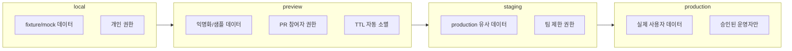
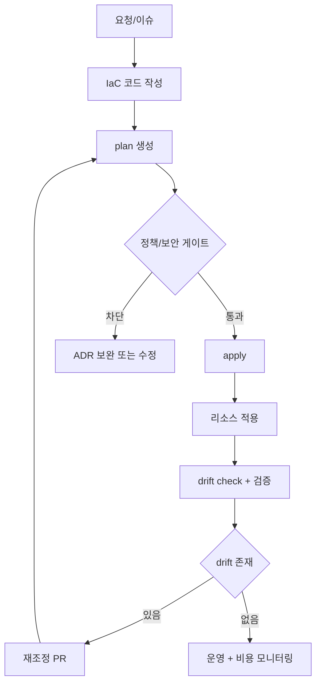
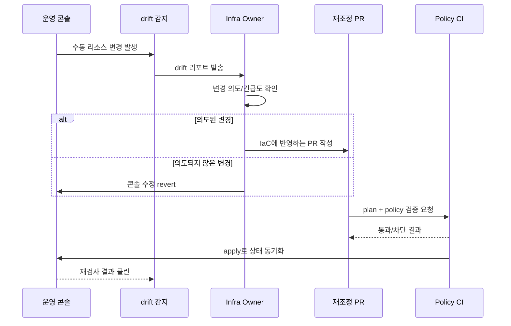
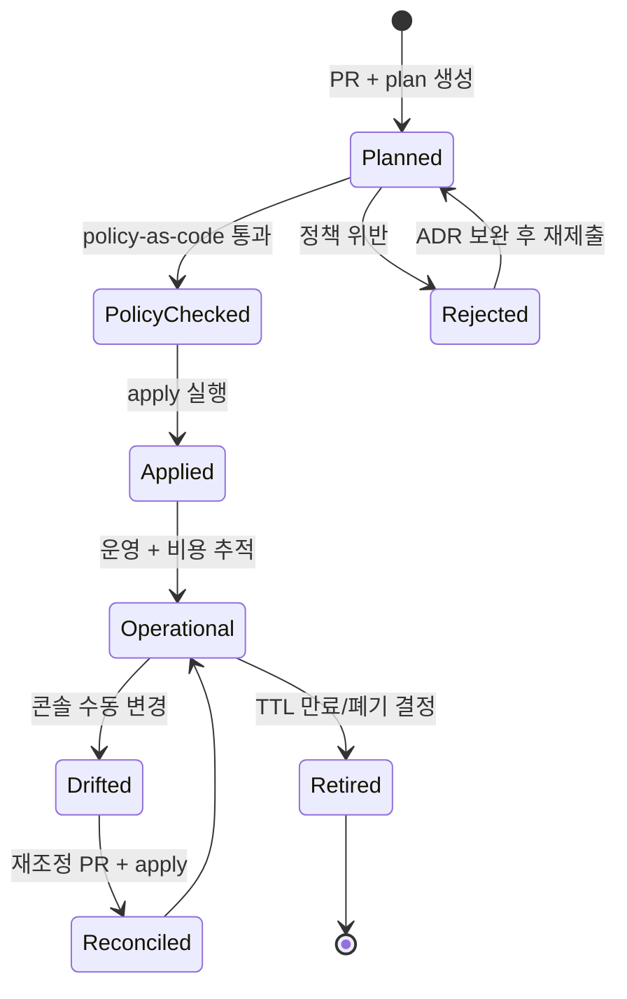
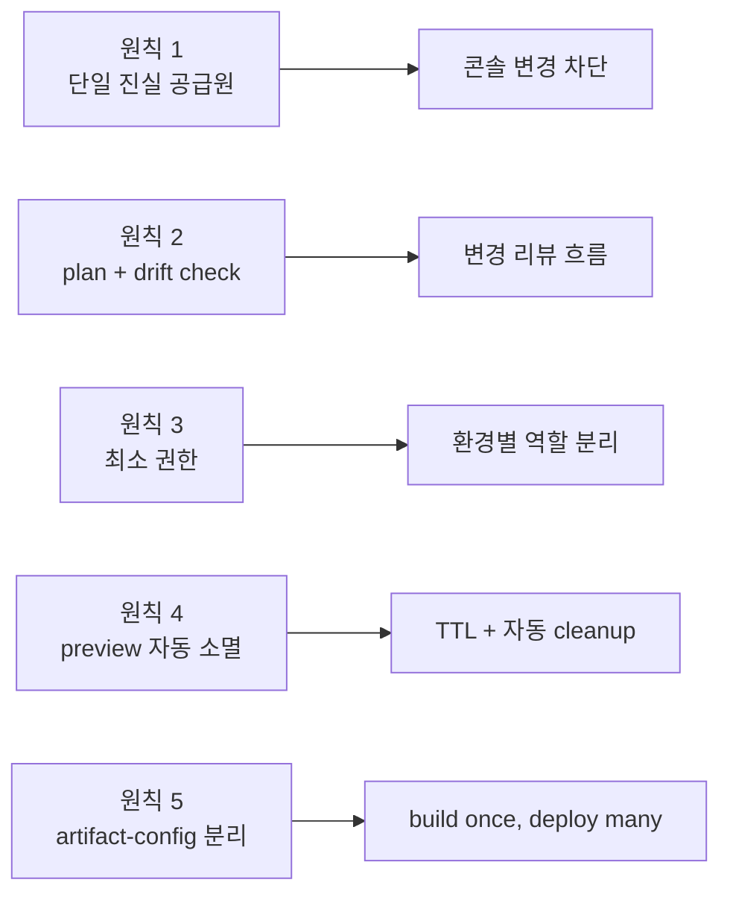
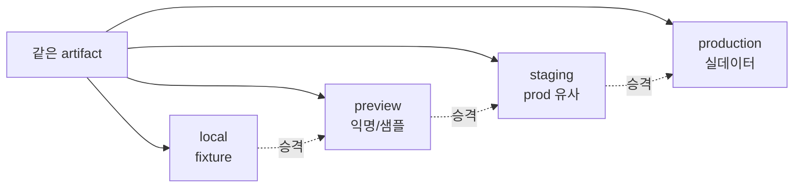
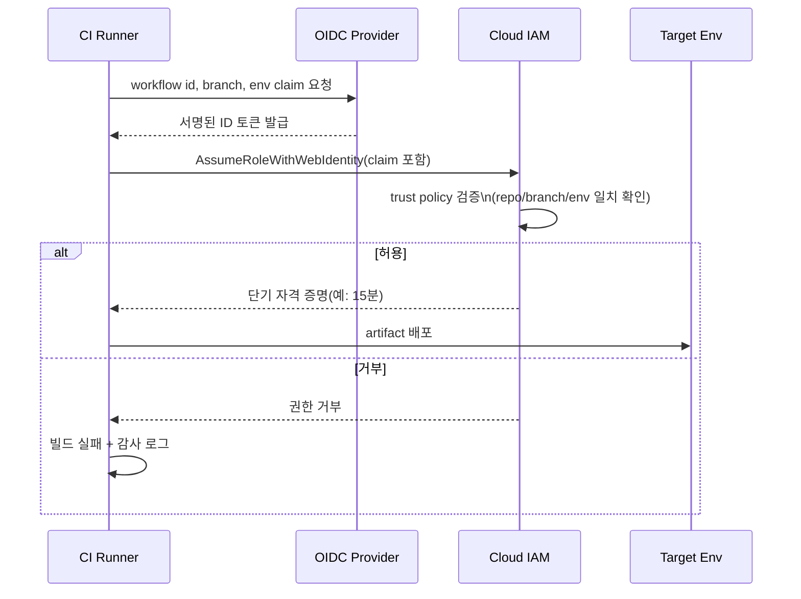
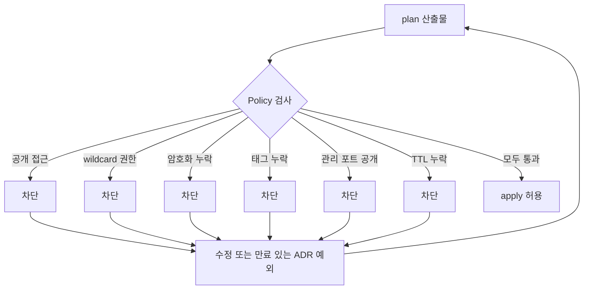
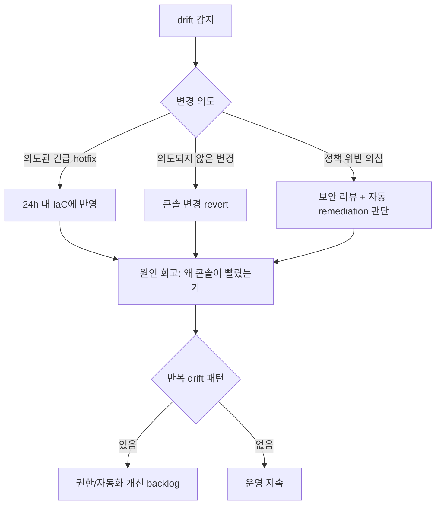

# 10. 인프라 및 IaC 가이드

## 0. 먼저 알고 가기 (30초 요약)

- 인프라는 코드처럼 버전 관리하고 PR로 변경하세요.
- 실제 환경 상태와 코드에 선언된 상태가 다르지 않게 드리프트를 점검하세요.
- 민감 정보는 코드 밖으로 분리해 승인·감사 흐름을 명확히 하세요.

## 초심자용 한눈에 보기

인프라는 코드처럼 다뤄야 합니다. 문서화되지 않은 규칙이 가장 위험합니다.

> 비유로 이해하기: 인프라를 "콘솔에서 클릭"으로 만드는 것은 종이 메모로 요리하는 것과 같습니다. 누구도 같은 요리를 재현할 수 없고, 잘못된 양념을 누가 넣었는지 추적할 수도 없습니다. IaC는 레시피를 코드 파일로 적어 두어, 같은 결과를 누구나 다시 만들 수 있게 합니다.

### 핵심 용어 빠르게 정리

| 용어         | 쉬운 뜻                                          |
| ------------ | ------------------------------------------------ |
| `IAC`        | 인프라를 코드로 관리하는 방식                    |
| `state`      | 현재 인프라의 실제 구성 상태                     |
| `권한 정책`  | 누가 어떤 환경/리소스를 만질 수 있는지 규칙      |
| `비밀 변수`  | 토큰/키 등 외부로 노출되면 안 되는 값            |
| `워크플로우` | 환경 준비~배포까지 자동으로 잇는 실행 순서       |
| `drift`      | 코드와 실제 인프라 상태가 어긋난 상황            |
| `OIDC`       | CI가 단기 토큰으로 클라우드에 접근하는 인증 방식 |

### 환경별 분리 한눈에 보기

> 왜 중요한가: 환경별 권한과 데이터를 분리하지 않으면 검증 중인 코드 한 줄이 실제 사용자 데이터를 변경할 수 있습니다.

| 분류            | 인프라 & CI/CD                                                                                                                                                                                                                   | 상태          | Stable    |
| :-------------- | :------------------------------------------------------------------------------------------------------------------------------------------------------------------------------------------------------------------------------- | :------------ | :-------- |
| **연관 가이드** | [08. 성능](./08_성능_최적화_가이드.md), [11. CI/CD](./11_CICD_파이프라인_표준.md), [12. CDN 캐시](./12_CDN_캐시_전략.md), [14. 배포](./14_배포_프로세스_체크리스트.md), [27. 다중 개발 서버](./27_다중_개발_서버_구축_가이드.md) | **도구 원칙** | 벤더 중립 |
| **핵심 테마**   | IaC, preview 환경, workload identity, 환경 분리, 비용 통제, drift detection, policy-as-code                                                                                                                                      | **Update**    | 최신 기준 |

---

> 프론트엔드 인프라 표준은 특정 클라우드 템플릿이 아니라 **재현 가능성, 최소 권한, 비용 가시성, 빠른 검증 환경, 안전한 변경 절차**를 보장하는 운영 규칙입니다.

---

## 추천 항목 (실무 우선순위)

- **시작 추천**: 환경별 state 파일과 권한/리소스 규칙을 코드로 먼저 정의하세요.
- **안정 추천**: 변경 시마다 drift check를 돌리고 누락 항목을 PR 설명에 포함합니다.
- **운영 추천**: 비용 태그/TTL/만료 정책을 표준 템플릿으로 고정해 청구 이슈를 미리 줄입니다.

## 추천 항목 고도화 체크

- `첫 적용` — plan, drift, least privilege, cost guard 중 하나를 실제 PR이나 운영 이슈에 붙이고, 변경 전 기준을 먼저 적는다.
- `증거 정리` — plan output, drift report, policy check, cost diff를 같은 작업 기록에 남긴다.
- `재점검` — drift 수, 권한 wildcard 수, 월 비용 변화가 나아졌는지 30일 안에 확인하고 기준을 유지, 수정, 폐기 중 하나로 판정한다.

## 추천 항목 실행 기록 템플릿

- `작업` : plan, drift, least privilege, cost guard 적용 범위를 어느 화면, 패키지, 문서에 둘지 적는다.
- `증거` : plan output, drift report, policy check, cost diff 중 실제로 남긴 항목만 링크한다.
- `판정` : 유지/수정/폐기 중 하나와 이유를 한 문장으로 남긴다.
- `다음 점검` : drift 수, 권한 wildcard 수, 월 비용 변화를 다시 볼 날짜와 담당자를 지정한다.

## 문서 책임 범위

| 이 문서가 결정하는 것                                      | 단일 출처로 따르는 문서                                                                       |
| :--------------------------------------------------------- | :-------------------------------------------------------------------------------------------- |
| IaC, 환경 분리, preview TTL, drift detection, 비용 태그    | [11. CI/CD](./11_CICD_파이프라인_표준.md), [14. 배포](./14_배포_프로세스_체크리스트.md)       |
| PR preview, branch deploy, S3 artifact 기반 다중 개발 서버 | [27. 다중 개발 서버](./27_다중_개발_서버_구축_가이드.md)                                      |
| workload identity, secret, 최소 권한 배포 권한             | [06. 보안](./06_웹_보안_심화_가이드.md), [11. CI/CD](./11_CICD_파이프라인_표준.md)            |
| CDN, edge, static hosting 인프라 계약                      | [12. CDN 캐시](./12_CDN_캐시_전략.md)                                                         |
| 인프라 변경의 워킹그룹/RFC/ADR와 rollback 기준             | [15. 의사결정](./15_RFC_의사결정_프로세스.md), [09. 관측성](./09_장애_대응_및_관측성_표준.md) |

---

## 0. 모든 프론트엔드 그룹 공통 Baseline

| 영역               | 공통 기준                                                            | 검증 방법                           |
| :----------------- | :------------------------------------------------------------------- | :---------------------------------- |
| **IaC 우선**       | 배포 대상, CDN, 저장소, 라우팅, 인증서, 권한, 알림은 코드로 선언     | 수동 생성 리소스 금지 정책          |
| **환경 분리**      | production, staging, preview, local의 권한·도메인·데이터를 분리      | 환경별 계정/프로젝트/namespace 점검 |
| **임시 자격 증명** | 장기 access key 대신 OIDC, workload identity, short-lived token 사용 | secret scan, token 만료 정책        |
| **Preview 환경**   | PR/branch별 검증 URL을 만들고 TTL과 자동 삭제를 둠                   | orphan resource report              |
| **정책 검증**      | IaC plan/synth 단계에서 보안, 태그, 공개 접근, 암호화 정책을 차단    | policy-as-code CI gate              |
| **Drift 감지**     | 콘솔 수동 변경과 실제 상태 차이를 주기적으로 탐지                    | drift report, reconciliation        |
| **비용 통제**      | 리소스 owner, environment, ttl, service 태그를 강제                  | budget alert, cost dashboard        |

### 0.0 인프라 변경 파이프라인

> 왜 중요한가: 변경 흐름이 한 줄로 보이지 않으면 어디서 위험을 차단해야 할지 합의가 어렵습니다.

### 0.0.1 drift 발생 시 협업 시퀀스

> 비유: 도서관에서 누군가 책 위치를 마음대로 바꾸면, 카탈로그가 더 이상 사실을 말하지 않습니다. drift는 카탈로그(코드)와 실제 책장(콘솔)의 차이가 벌어진 상태입니다.

### 0.0.2 상태 기반 IaC 라이프사이클

> 일상 비유: 인프라 리소스는 호텔 객실과 같습니다. 비어 있다가 예약(plan)되고, 손님이 들어와 사용(apply, 운영)하고, 청소(drift 재조정)와 체크아웃(폐기)을 거칩니다.

### 0.1 교차 검증 매트릭스

| 권고              | 1차 출처                              | 실행 증거                        | 운영 증거                             | 철회 조건                        |
| :---------------- | :------------------------------------ | :------------------------------- | :------------------------------------ | :------------------------------- |
| IaC 우선          | IaC 도구 공식 plan/apply 모델         | plan diff, policy-as-code gate   | drift count, manual change count      | 긴급 hotfix는 24시간 내 IaC 반영 |
| Workload identity | OIDC/workload identity 공식 보안 모델 | secret scan, token lifetime test | leaked secret incident, key inventory | 장기 키는 예외 ADR과 만료일 필요 |
| Preview TTL       | 비용/보안 운영 기준                   | orphan resource check            | preview cost, idle resource count     | TTL 없는 preview는 생성 차단     |

### 0.2 운영 게이트

| Gate              | Evidence                                 | Owner             | Rollback                              |
| :---------------- | :--------------------------------------- | :---------------- | :------------------------------------ |
| IaC plan          | plan diff, policy-as-code report         | Infra owner       | apply 차단 또는 이전 plan으로 복구    |
| Workload identity | token claim, secret scan, 만료 정책 확인 | Platform owner    | 장기 키 폐기, 임시 토큰 회수          |
| Preview TTL       | orphan resource report, cost dashboard   | Environment owner | preview 자동 삭제 또는 외부 접근 차단 |
| Drift 관리        | drift report, reconciliation PR          | Infra owner       | 수동 변경 revert 또는 긴급 ADR 작성   |

---

## 1. 인프라 설계 원칙

> 왜 중요한가: 다섯 가지 원칙은 "한 번 만들고 끝"이 아니라 "반복 변경에도 안전한 인프라"의 최소 토대입니다.

1. **코드가 단일 진실 공급원**이어야 합니다. 운영 콘솔에서 만든 리소스는 재현할 수 없고 리뷰도 어렵습니다.
2. **변경 전 plan, 변경 후 drift check**를 둡니다. 인프라 변경은 코드 변경과 같은 리뷰 과정을 거칩니다.
3. **권한은 배포 단위로 최소화**합니다. CI가 production 전체 권한을 갖지 않도록 환경별 역할을 분리합니다.
4. **preview는 자동 소멸**해야 합니다. 검증 환경은 오래 남을수록 비용과 보안 리스크가 됩니다.
5. **런타임 설정과 빌드 산출물을 분리**합니다. 동일한 artifact를 환경별 설정으로 승격할 수 있어야 합니다.

---

## 2. 환경 모델

> 왜 중요한가: 환경을 섞으면 "테스트가 통과한 코드"와 "사용자가 받는 코드"가 일치한다는 보장이 깨집니다.

| 환경           | 목적                   | 데이터                         | 접근          | 수명          |
| :------------- | :--------------------- | :----------------------------- | :------------ | :------------ |
| **local**      | 개발자 단위 개발       | fixture/mock                   | 개인          | 수동          |
| **preview**    | PR/branch 검증         | 익명화/샘플                    | PR 참여자     | TTL 자동 삭제 |
| **staging**    | release candidate 검증 | production 유사, 민감정보 제거 | 팀 제한       | 상시          |
| **production** | 실제 사용자 서비스     | 실제 데이터                    | 승인된 운영자 | 상시          |

preview 환경은 production 데이터를 복제하지 않는 것이 기본입니다. 불가피한 경우 익명화, 최소 범위, 시간 제한, 접근 감사가 필요합니다.

---

## 3. Workload Identity

> 일상 비유: 호텔 직원이 매일 같은 마스터키를 들고 다니는 것과, 필요한 객실 카드를 그때그때 발급받는 것의 차이입니다. workload identity는 후자에 가깝습니다.

CI/CD는 장기 비밀키를 저장하지 않는 구조가 기본입니다.

| 방식                     | 기준                                                                        |
| :----------------------- | :-------------------------------------------------------------------------- |
| **OIDC federation**      | CI 실행 주체, branch, environment, repository claim을 검증해 임시 권한 발급 |
| **short-lived token**    | 만료 시간이 짧고 scope가 좁은 토큰 사용                                     |
| **environment approval** | production 권한은 승인된 배포 단계에서만 발급                               |
| **secret inventory**     | 남아 있는 장기 secret은 owner, rotation 주기, 만료일을 기록                 |

권한 정책은 "누가 어느 환경에서 어떤 artifact를 어디에 배포할 수 있는지"를 문장으로 먼저 정의한 뒤 코드로 옮깁니다.

---

## 4. Preview 환경 표준

Preview 환경은 프론트엔드 팀의 품질 속도를 크게 높이지만, 자동 정리가 없으면 비용과 보안 부채가 됩니다.

| 항목          | 기준                                           |
| :------------ | :--------------------------------------------- |
| URL           | PR/branch 식별자가 포함된 고유 URL             |
| 배포 artifact | CI에서 생성한 immutable build artifact         |
| 데이터        | mock, fixture, 익명화된 샘플 우선              |
| TTL           | 기본 24~72시간, PR 종료 시 즉시 삭제           |
| 접근 제어     | 외부 공개가 필요 없으면 인증 또는 IP/rule 제한 |
| 관측성        | preview environment 태그로 로그/오류 분리      |
| 비용          | owner, ttl, repository 태그 필수               |

---

## 5. IaC 리뷰 체크리스트

- [ ] public 접근이 필요한 리소스와 그렇지 않은 리소스가 분리되어 있는가
- [ ] 저장소, 캐시, 로그, 백업에 암호화가 적용되어 있는가
- [ ] secret이 코드, state 파일, build log에 노출되지 않는가
- [ ] production 권한이 preview/staging 배포 경로에 섞이지 않는가
- [ ] deletion protection, retention, lifecycle rule이 환경별로 다른가
- [ ] 비용 태그와 TTL 태그가 모든 임시 리소스에 강제되는가
- [ ] plan 결과가 PR에 첨부되고 reviewer가 변경 범위를 볼 수 있는가
- [ ] drift 감지 결과가 운영 채널과 backlog에 연결되는가

---

## 6. Policy-as-Code Gate

> 일상 비유: 공항 보안검색대와 같습니다. "위험물 반입 금지"라는 안내문(문서)만 있으면 누군가는 통과시키지만, 게이트(자동 검사)가 있으면 예외 없이 막을 수 있습니다.

인프라 정책은 문서에만 있으면 지켜지지 않습니다. CI에서 자동 차단해야 합니다.

| 정책        | 차단 예시                                       |
| :---------- | :---------------------------------------------- |
| 공개 접근   | 정적 자산 외 객체 저장소 공개, 관리자 콘솔 공개 |
| 권한 과다   | wildcard action/resource, production 전체 권한  |
| 암호화 누락 | 저장소, 로그, secret store 암호화 미설정        |
| 태그 누락   | owner, environment, service, ttl 없음           |
| 네트워크    | 관리 포트 공개, 허용 목록 없는 admin endpoint   |
| 수명 관리   | preview 리소스 TTL 없음                         |

정책 예외는 만료일과 owner가 있는 RFC/ADR로 관리합니다.

---

## 7. 비용 운영

프론트엔드 인프라 비용은 대부분 CDN 전송량, build minutes, preview 환경, 로그/trace 저장량에서 증가합니다.

| 비용 항목     | 통제 기준                                                  |
| :------------ | :--------------------------------------------------------- |
| CDN egress    | 이미지 최적화, 압축, cache hit ratio, 지역별 트래픽 추적   |
| Build/CI      | dependency cache, test sharding, 변경 영향 기반 실행       |
| Preview       | TTL, idle cleanup, branch 종료 webhook                     |
| Observability | sampling, retention, environment별 수집량 제한             |
| Storage       | lifecycle rule, source map 접근 제한, 오래된 artifact 삭제 |

비용 알림은 단순 월말 예산 초과가 아니라 "일일 증가율", "preview orphan", "로그 수집량 급증"처럼 조기 탐지 가능한 지표로 둡니다.

---

## 8. Drift와 변경 관리

> 왜 중요한가: drift는 단순 실수가 아니라 "정상 경로가 너무 불편하다"는 신호입니다. 반복 drift는 도구나 권한 모델을 고치라는 경고로 읽어야 합니다.

| 이벤트              | 필수 조치                                    |
| :------------------ | :------------------------------------------- |
| 콘솔 수동 수정 감지 | 원인 확인 후 IaC에 반영하거나 원복           |
| 정책 위반 drift     | 즉시 보안 review, 자동 remediation 여부 판단 |
| production hotfix   | 24시간 안에 IaC와 runbook 업데이트           |
| 반복 drift          | 권한 모델 또는 자동화 누락으로 보고 개선     |

수동 수정 자체를 탓하기보다, 왜 코드 경로보다 수동 경로가 쉬웠는지 개선해야 합니다.

---

## 9. AI 활용 기준

AI는 IaC 초안 작성, 정책 누락 점검, 비용 최적화 후보 도출에 유용하지만 다음 제약을 둡니다.

- production credential, 계정 ID, 내부 도메인, state 파일 원문을 AI에 전달하지 않습니다.
- AI가 만든 IaC는 plan, policy-as-code, 최소 권한 리뷰를 통과해야 합니다.
- "최신 권장 설정"은 클라우드별 공식 문서로 재확인한 뒤 적용합니다.
- 인프라 변경 설명에는 blast radius, rollback, drift 가능성을 포함합니다.

---

## 10. 제외한 벤더 종속 항목

공통 개발 가이드에는 특정 클라우드의 리소스 이름, 전용 IaC construct, 특정 CDN 원본 접근 제어 방식, 특정 DNS/인증서 콘솔 절차, 특정 비용 콘솔 사용법을 표준으로 포함하지 않습니다. 이 문서는 어떤 클라우드와 IaC 도구를 쓰더라도 유지되어야 하는 재현성, 권한, 환경 분리, 비용, drift, 정책 검증 기준만 남깁니다.

---

## 실무 적용 가이드

### 언제 이 문서를 펼칠까

- preview 환경이 쌓여 비용과 보안 문제가 생길 때
- 수동 콘솔 변경 때문에 실제 상태와 코드가 달라질 때
- CI가 production 장기 키를 들고 배포할 때

### 적용 순서

1. 환경을 local, preview, staging, production으로 나누고 데이터/권한을 분리한다.
2. 배포 대상, CDN, 권한, 알림을 IaC로 선언한다.
3. CI에는 OIDC/workload identity 기반 임시 권한을 사용한다.
4. preview는 owner, environment, ttl 태그와 자동 삭제를 강제한다.
5. plan, policy-as-code, drift report를 PR 증거로 남긴다.

### 함께 두는 파일

- 앱별 IaC 모듈, 환경 변수 schema, preview 설정을 같은 service 폴더에 둔다.
- 공통 module은 여러 서비스에서 검증된 뒤 shared infra package로 승격한다.
- runbook과 rollback 절차는 배포 문서와 연결한다.

### 흔한 실수

- 콘솔에서 만든 리소스를 코드로 되돌리지 않는다.
- preview에 production 데이터를 복제한다.
- 장기 cloud key를 CI secret으로 저장한다.
- 비용 태그와 TTL 없이 임시 리소스를 만든다.

### PR 완료 기준

- [ ] IaC plan과 policy report가 있다.
- [ ] 장기 키 없이 배포된다.
- [ ] preview cleanup이 자동화되어 있다.
- [ ] drift 감지와 복구 절차가 있다.

## 추천 항목 실행 우선순위 매핑

- `P1(7일 내)` — plan, drift, least privilege, cost guard 중 하나를 작은 변경 1건에 적용하고 증거(plan output)를 남긴다.
- `P2(30일 내)` — IaC 변경 기준을 팀 템플릿, 체크리스트, CI 중 한 곳에 고정한다.
- `P3(90일 내)` — drift 수, 권한 wildcard 수, 월 비용 변화 추이를 보고 기준을 유지할지 조정할지 결정한다.
- `완료 기준` — 인프라 오너가 증거와 철회 조건을 확인했다는 기록을 남긴다.

## 추천 항목 실행 체크리스트

- [ ] `1단계(7일)` : plan, drift, least privilege, cost guard 적용 대상을 1개로 좁힌다.
- [ ] `2단계(30일)` : 증거(plan output, drift report, policy check, cost diff)를 PR, ADR, 회고 중 한 곳에 연결한다.
- [ ] `3단계(60일)` : drift 수, 권한 wildcard 수, 월 비용 변화가 기준 안에 들어왔는지 확인한다.
- [ ] `문제 대응` : 미달성 사유와 다음 조치, 중단 여부를 같은 기록에 남긴다.

## 추천 항목 실행 운영 규칙

- `실행 게이트` : 적용 전 plan과 rollback 경로가 같은 PR에 있어야 한다.
- `승인 체계` : 인프라 오너가 영향 범위와 rollback 담당자를 적용 전에 확인한다.
- `재개 조건` : plan과 policy check가 통과하고 drift가 설명되면 apply한다.
- `정지 조건` : 수동 콘솔 변경이나 wildcard 권한이 설명되지 않으면 중단한다.
- `리스크 점수` : 변경 리소스 수, 권한 범위, 비용 증가율로 산정한다.
- `리더 승인자` : 플랫폼 리드가 최종 승인 책임을 맡는다.
- `승인 역할` : IaC 변경 작성자, 검토자, 운영 확인자를 분리해 기록한다.
- `재평가 주기` : 월 1회 drift와 비용 report를 같이 본다.
