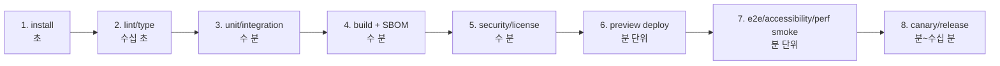
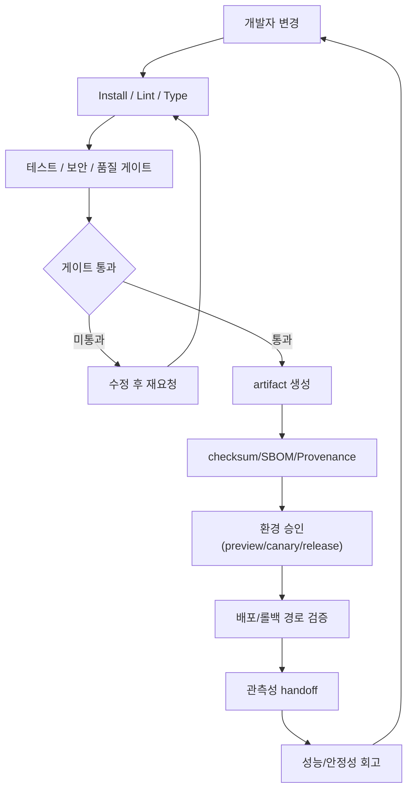
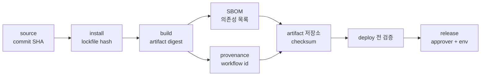
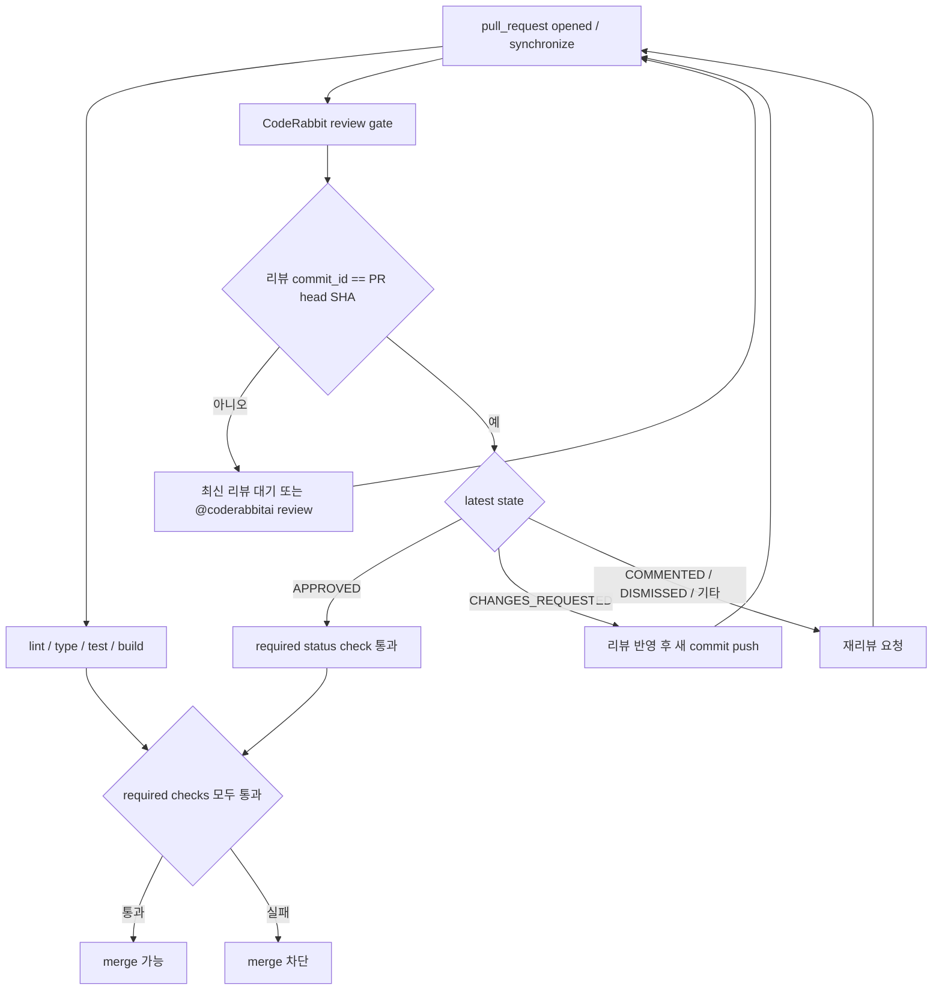
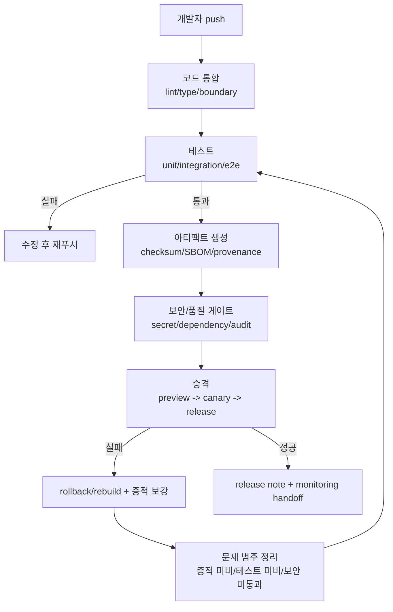
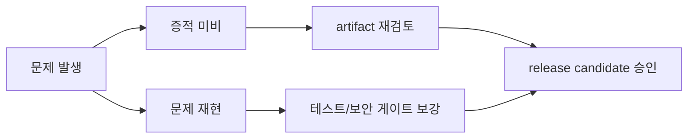
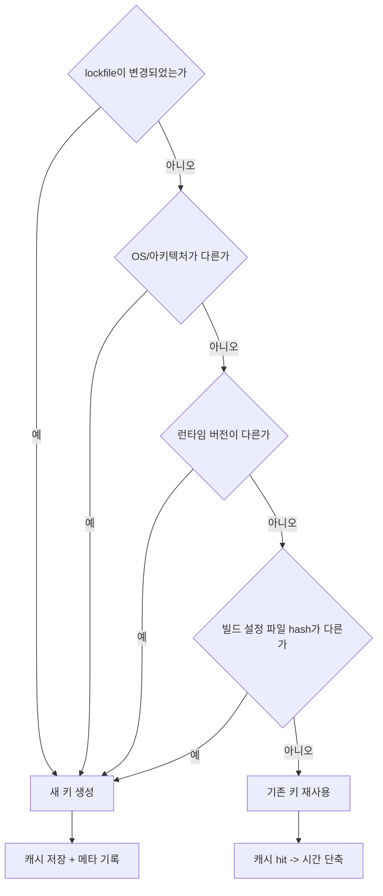
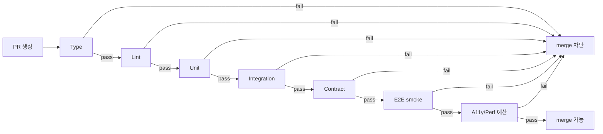
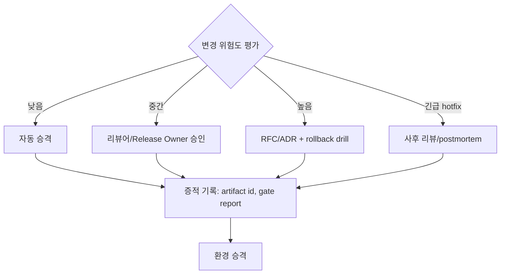

# 11. CI/CD 파이프라인 표준

> **쉽게 읽기 안내**: 이 문서는 전문 용어가 많을 수 있어요.
> 이해가 어려우면 [공통 용어사전](../참고자료/개발가이드_용어사전.md)에서 먼저 용어 뜻을 확인하고 본문을 이어서 읽으면 이해가 훨씬 빨라집니다.
> 특히 실무에서 자주 쓰이는 `배포`, `CI/CD`, `롤백`, `스키마`처럼 동작이 중요한 용어부터 먼저 익혀보세요.
## 0. 먼저 알고 가기 (30초 요약)

- CI는 변경 검증, CD는 배포/확장 규칙을 지키게 하는 게이트입니다.
- 테스트 실패/보안 실패/품질 규칙은 자동으로 배포를 막게 설계하세요.
- 배포 실패시 자동 롤백 경로가 준비되어 있어야 합니다.

## 초심자용 한눈에 보기

CI/CD는 "자동으로 검증하고, 위험이 보이면 멈추는" 라인입니다.

> 일상 비유: 공장의 컨베이어 벨트와 같습니다. 각 검사 구역(게이트)에서 불량을 발견하면 라인을 멈추고, 통과한 제품(아티팩트)만 포장 단계로 보냅니다. 같은 라인을 매번 똑같이 통과하므로 결과를 신뢰할 수 있습니다.

### 핵심 용어 빠르게 정리

| 용어 | 쉬운 뜻 |
| --- | --- |
| `파이프라인` | 커밋 후 실행되는 자동 검증/배포 단계 |
| `아티팩트` | 빌드 결과물(배포 가능한 산출물) |
| `빌드 게이트` | 실패하면 배포를 막는 필수 검사 |
| `브랜치 정책` | 어떤 브랜치에서 어떤 동작을 허용할지 규칙 |
| `원복` | 배포 실패 시 이전 상태로 되돌리는 절차 |
| `SBOM` | 빌드 산출물에 들어간 의존성/버전 명세 |
| `provenance` | 어떤 commit·workflow에서 만들어졌는지 증명 |

### 빠른 실패 -> 느린 검증 단계 한눈에

> 왜 중요한가: 비싼 검증을 일찍 실행하면 피드백 시간이 길어집니다. 비용이 낮은 검사를 앞에 두면 개발자가 더 빨리 수정할 수 있습니다.




| 분류 | 인프라 & 배포 | 상태 | Stable |
| :--- | :--- | :--- | :--- |
| **연관 가이드** | [07. 테스팅](./07_테스팅_가이드.md), [10. 인프라](./10_인프라_IaC_가이드.md), [12. CDN 캐시](./12_CDN_캐시_전략.md), [14. 배포](./14_배포_프로세스_체크리스트.md), [27. 다중 개발 서버](./27_다중_개발_서버_구축_가이드.md) | **도구 원칙** | 벤더 중립 |
| **핵심 테마** | 재현 가능한 빌드, 품질 게이트, 보안 검사, artifact, approval, 배포 자동화 | **Update** | 최신 기준 |

---

> CI/CD 표준은 특정 자동화 플랫폼의 YAML이 아니라 **변경이 안전하게 통합되고, 검증된 artifact만 승격되며, 배포와 릴리즈가 통제되는 흐름**입니다.

---


## 추천 항목 (실무 우선순위)

- **시작 추천**: 최소 하나의 실패 게이트를 정해 merge/deploy 조건으로 만듭니다.
- **안정 추천**: artifact 무결성(SBOM/체크섬) 점검을 필수 단계로 추가합니다.
- **운영 추천**: 롤백 시나리오는 배포 전 dry run로 한 번 확인해 실제 장애 대응 시간을 단축하세요.


## 추천 항목 고도화 체크

- `즉시 적용` — 추천 항목 1개를 이번 주 내에 실제 작업 1건에 반영한다.
- `1주 내 정리` — 적용 결과를 PR 본문이나 회고 노트에 간단히 기록한다.
- `1개월 내 점검` — 재작업률/리뷰 충돌/배포 이슈 중 적어도 한 항목이 개선되었는지 확인한다.


## 추천 항목 실행 기록 템플릿

- `담당자` : 항목 적용 주체(문서 오너/팀원)를 명시
- `적용일` : 실제 반영된 날짜 및 작업 ID를 남김
- `측정 지표` : 리뷰 충돌/재작업/버그 재발 중 1개 이상 수치로 기록
- `보류 사유` : 적용을 못한 경우 이유를 1줄 기록하고 다음 액션을 지정

## 문서 책임 범위

| 이 문서가 결정하는 것 | 단일 출처로 따르는 문서 |
| :--- | :--- |
| install/lint/type/test/build/security/artifact 품질 게이트 | [07. 테스팅](./07_테스팅_가이드.md), [06. 보안](./06_웹_보안_심화_가이드.md) |
| artifact provenance, SBOM, checksum, environment approval | [10. 인프라](./10_인프라_IaC_가이드.md), [14. 배포](./14_배포_프로세스_체크리스트.md) |
| cache, CDN, preview deploy와 release 증적 | [12. CDN 캐시](./12_CDN_캐시_전략.md), [09. 관측성](./09_장애_대응_및_관측성_표준.md) |
| PR preview, branch environment, S3 artifact deploy workflow | [27. 다중 개발 서버](./27_다중_개발_서버_구축_가이드.md) |
| CI 예외와 flaky gate의 리뷰/승인 기준 | [16. 코드리뷰](./16_AI_협업_코드리뷰_가이드.md), [15. RFC](./15_RFC_의사결정_프로세스.md) |

---

## 0. 모든 프론트엔드 그룹 공통 Baseline

| 단계 | 최소 기준 | 실패 시 |
| :--- | :--- | :--- |
| **Install** | lockfile 기반 frozen install, 런타임 버전 고정 | 즉시 실패 |
| **Static check** | format, lint, type check, import boundary | merge 차단 |
| **Test** | unit, integration, contract, 핵심 E2E smoke | merge 또는 deploy 차단 |
| **Build** | production build, sourcemap 정책, bundle budget | deploy 차단 |
| **Security** | secret scan, dependency audit, license policy, SBOM/attestation | severity 기준 차단 |
| **Artifact** | immutable artifact 생성, checksum, 보관 기간 명시 | deploy 차단 |
| **Deploy** | 환경별 승인, canary/preview, rollback path | 자동 중단 |
| **Evidence** | 테스트 결과, trace, coverage, accessibility/performance report 보관 | 감사 불가 시 실패 |

### 0.0 파이프라인 순환 고리

> 왜 중요한가: 파이프라인은 일회성 검사가 아니라 회고를 거쳐 다음 PR에 다시 적용되는 순환 구조입니다.



### 0.1 교차 검증 매트릭스

| 권고 | 1차 출처 | 실행 증거 | 운영 증거 | 철회 조건 |
| :--- | :--- | :--- | :--- | :--- |
| Artifact provenance | SLSA specification | SBOM/provenance 생성, checksum 검증 | 배포 artifact 추적성 | provenance 없는 artifact는 production 승격 금지 |
| Frozen install | package manager 공식 lockfile 정책 | frozen install CI | dependency drift incident | emergency patch는 lockfile PR 필수 |
| Quality gate | 각 도구 공식 CLI와 팀 위험 모델 | lint/type/test/build report | escaped defect, rollback rate | flaky gate는 owner/expiry로 격리 |

### 0.2 운영 게이트

| Gate | Evidence | Owner | Rollback |
| :--- | :--- | :--- | :--- |
| 품질 검증 | lint, type, test, build, security report | CI owner | merge/deploy 차단 |
| Artifact provenance | checksum, SBOM, provenance, source revision | Release owner | artifact 폐기와 재빌드 |
| 환경 승격 | approval record, environment policy | Release manager | promotion 중단 또는 이전 환경으로 회귀 |
| Flaky gate 관리 | retry log, quarantine issue, 만료일 | QA owner | owner 없는 quarantine 해제와 gate 복구 |

---

### 0.3 공급망 증적 계약

> 일상 비유: 식품 포장에 원산지·유통기한·제조번호가 적혀 있어야 안심하고 먹을 수 있는 것과 같습니다. 코드도 어떤 commit에서 누가 어느 도구로 만들었는지 라벨이 붙어야 안전하게 배포할 수 있습니다.

CI/CD의 공급망 보안은 "취약점 스캔을 실행했다"가 아니라, 소스에서 artifact까지 이어지는 증거 체인을 남기는 것입니다. SLSA v1.2는 provenance와 artifact 검증을, NIST SSDF는 secure SDLC 활동을 구조화하는 기준으로 사용합니다.



| 증적 | 필수 필드 | 생성 시점 | 검증 시점 |
| :--- | :--- | :--- | :--- |
| Source revision | commit SHA, branch/tag, author/reviewer, protected status | merge | build 시작 전 |
| Dependency evidence | lockfile hash, package manager version, audit/signature result | install | PR과 release |
| SBOM | package name/version/license, transitive dependency, artifact id | build 직후 | release 승인, incident triage |
| Provenance/attestation | source repository, workflow id, runner/builder, subject digest | artifact 생성 직후 | deploy 승격 전 |
| Checksum | artifact digest, signing/attestation reference | artifact 업로드 | rollback/download 전 |
| Deployment evidence | environment, approver, release id, rollback artifact | promotion | incident/postmortem |

| 통제 | 기준 | 실패 시 |
| :--- | :--- | :--- |
| 최소 권한 token | job별 `contents: read`, 필요한 경우에만 `id-token: write`, `attestations: write` | workflow permission 축소 전 merge 보류 |
| OIDC | 장기 cloud key 대신 job 단위 short-lived token | secret 기반 배포는 만료일 있는 예외로만 허용 |
| Action/재사용 workflow 고정 | mutable ref 대신 SHA pin 또는 검증된 immutable release 정책 | high-risk workflow는 실행 차단 |
| Artifact 검증 | deploy job이 checksum/provenance를 검증한 artifact만 사용 | artifact 폐기와 재빌드 |

---

### 0.4 PR 리뷰 게이트 계약

> 일상 비유: 출고 전 마지막 검사자는 이전 제품을 승인한 기록이 아니라, 지금 컨베이어 위에 올라온 바로 그 제품을 확인해야 합니다. PR도 최신 commit에 대한 리뷰 증거가 필요합니다.

CodeRabbit 같은 AI 리뷰 도구를 도입한 저장소는 리뷰를 "참고 코멘트"로만 두지 말고 merge gate로 연결합니다. 핵심은 PR에 CodeRabbit 리뷰가 하나 있었는지가 아니라, **현재 PR head SHA에 달린 최신 CodeRabbit 리뷰가 승인 상태인지** 확인하는 것입니다.



| 항목 | 기준 | 실패 시 |
| :--- | :--- | :--- |
| CodeRabbit 설정 | `.coderabbit.yaml`이 있는 저장소만 리뷰 게이트를 둔다 | 미설치 저장소에 게이트만 추가하면 PR이 영구적으로 막힐 수 있음 |
| 최신성 | `pulls.listReviews` 결과 중 CodeRabbit 리뷰의 `commit_id`가 PR `head.sha`와 같아야 함 | 새 commit push 후 과거 approve 재사용 금지 |
| 상태 | 최신 head SHA의 CodeRabbit 리뷰 state가 `APPROVED`여야 함 | `CHANGES_REQUESTED`, `COMMENTED`, `DISMISSED`는 merge 차단 |
| 브랜치 보호 | required status check에 `CodeRabbit review gate`와 저장소의 quality aggregator 체크를 추가하고 required conversation resolution을 켠다 | workflow 파일만 있으면 실패 체크나 미해결 리뷰 스레드를 무시하고 merge할 수 있음 |
| PR 템플릿 | `CodeRabbit review gate` 통과 여부와 finding disposition을 기록 | accept/reject/follow-up 근거 없이 merge 금지 |
| 자동 머지 | Dependabot은 safe bump 정책으로, 일반 PR은 `automerge`/`auto-merge` 라벨로만 auto-merge 후보로 둔다 | production dependency major나 명시적 의도 없는 일반 PR 자동 병합 금지 |

```yaml
name: CodeRabbit review gate

on:
  pull_request:
    types: [opened, synchronize, reopened, ready_for_review]
  pull_request_review:
    types: [submitted, edited, dismissed]

permissions:
  contents: read
  pull-requests: read

jobs:
  review-gate:
    name: CodeRabbit review gate
    runs-on: ubuntu-latest
    timeout-minutes: 5
```

자동 머지는 이 게이트와 충돌하지 않게 설계합니다. Dependabot PR은 patch/minor, GitHub Actions 업데이트, direct development major처럼 blast radius가 낮은 범위만 auto-merge 후보로 둡니다. 일반 PR은 `automerge`/`auto-merge` 라벨이 붙은 경우에만 후보로 두고, 실제 병합은 브랜치 보호의 required checks와 conversation resolution이 모두 통과할 때만 일어나게 합니다. production dependency major나 아키텍처 변경 PR은 CodeRabbit과 사람 reviewer가 모두 확인한 뒤 수동 병합합니다.

CodeRabbit을 쓰는 저장소는 수동 실행용 `.github/workflows/branch-protection.yml`을 둡니다. 이 워크플로우는 `GH_ADMIN_TOKEN` 시크릿이 있을 때만 실행되며, GitHub Branch Protection API로 아래 조건을 적용합니다.

- required status checks: 저장소별 quality aggregator, `CodeRabbit review gate`
- `strict: true`: base branch 최신화 후 merge
- `required_conversation_resolution: true`: 미해결 리뷰 스레드가 있으면 merge 대기
- `required_approving_review_count`: 기본 `0`, 사람 승인까지 강제하려면 workflow dispatch 입력값으로 `1` 이상 지정
- GitHub Branch Protection API에는 `required_status_checks.contexts`만 넣는다. `contexts`와 `checks`를 동시에 넣으면 일부 API schema에서 422가 발생할 수 있다.

---

### 0.5 GitHub Actions 운영 표준

> 왜 중요한가: CI는 "돌아가는 YAML"보다 "반복 가능한 운영 계약"이어야 합니다. timeout, concurrency, permission, required check 이름이 저장소마다 흔들리면 같은 실패도 다른 방식으로 처리되어 merge 정책이 약해집니다.

워크스페이스 하위 git 프로젝트는 아래 공통 규칙을 따른다.

| 항목 | 표준 | 이유 |
| :--- | :--- | :--- |
| 실행 진입점 | package 프로젝트는 `pnpm run verify`를 로컬/CI 공통 검증 명령으로 둔다 | 개발자와 CI가 같은 계약을 실행 |
| 설치 | lockfile 기반 `pnpm install --frozen-lockfile` | dependency drift 차단 |
| 권한 | workflow 또는 job에 `permissions`를 명시하고 기본은 `contents: read` | `GITHUB_TOKEN` 최소 권한 유지 |
| 동시성 | 모든 workflow에 top-level `concurrency`를 둔다 | 오래된 PR 실행 취소, deploy race 방지 |
| 시간 제한 | 모든 job에 `timeout-minutes`를 둔다 | 무한 대기와 runner 비용 누수 차단 |
| lint | CI용 `lint`는 검사만 하고 자동 수정은 `lint:fix`로 분리 | CI가 PR 소스를 몰래 바꾸지 않게 함 |
| Action 버전 | 검증된 최신 major를 쓰고, 구버전 major가 남으면 audit에서 실패시킨다 | deprecated runtime/보안 경고 조기 제거 |
| 자동 머지 | Dependabot safe bump 또는 명시적 `automerge`/`auto-merge` 라벨만 사용 | 의도 없는 일반 PR 자동 병합 방지 |

현재 표준화한 GitHub Actions 버전 baseline은 다음과 같다.

| 용도 | 기준 |
| :--- | :--- |
| checkout | `actions/checkout@v6` |
| Node.js | `actions/setup-node@v6` |
| pnpm | `pnpm/action-setup@v6` |
| artifact | `actions/upload-artifact@v7` |
| GitHub API script | `actions/github-script@v9` |
| CodeQL | `github/codeql-action@v4` |
| Dependabot metadata | `dependabot/fetch-metadata@v3` |
| Docker build/publish | `docker/setup-qemu-action@v4`, `docker/setup-buildx-action@v4`, `docker/login-action@v4`, `docker/metadata-action@v6`, `docker/build-push-action@v7` |
| Google Cloud deploy | `google-github-actions/auth@v3`, `google-github-actions/setup-gcloud@v3` |

공통 workflow 파일은 저장소군별로 아래처럼 배치한다.

| 파일 | 대상 | 역할 |
| :--- | :--- | :--- |
| `.github/workflows/dependabot-auto-merge.yml` | 모든 git 프로젝트 | Dependabot safe bump만 auto-merge 후보로 등록 |
| `.github/workflows/coderabbit-gate.yml` | `.coderabbit.yaml`이 있는 프로젝트 | 최신 PR head SHA의 CodeRabbit `APPROVED` 리뷰를 required check로 노출 |
| `.github/workflows/auto-merge-on-green.yml` | `.coderabbit.yaml`이 있는 프로젝트 | `automerge`/`auto-merge` 라벨이 붙은 일반 PR에 auto-merge 활성화 |
| `.github/workflows/branch-protection.yml` | `.coderabbit.yaml`이 있는 프로젝트 | `GH_ADMIN_TOKEN`으로 required checks와 conversation resolution 적용 |

브랜치 보호 워크플로우는 저장소별 quality aggregator 이름을 정확히 사용해야 한다. required check 이름이 실제 job 이름과 다르면 GitHub가 영구 대기 상태로 남길 수 있다.

| 저장소 | required status checks |
| :--- | :--- |
| `PromptMarket` | `Quality gate`, `CodeRabbit review gate` |
| `spa-seo-gateway` | `Quality gate`, `CodeRabbit review gate` |
| `orbit-ui` | `빌드 및 테스트`, `린트`, `CodeRabbit review gate` |
| `remote-devtools` | `CI pass gate`, `enforce-pr-checklist`, `CodeRabbit review gate` |
| `pettography` | `Frontend verify`, `Backend verify`, `CodeRabbit review gate` |
| `react-boilerplates` | `Verify`, `CodeRabbit review gate` |

Dependabot 자동 머지는 아래 조건 중 하나만 만족할 때 auto-merge를 활성화한다.

- `version-update:semver-patch`
- `version-update:semver-minor`
- `package-ecosystem == github_actions`
- `version-update:semver-major` 이면서 `dependency-type == direct:development`

production dependency major는 자동 머지하지 않는다. breaking change, migration, runtime risk를 PR 본문에 남기고 사람 reviewer가 확인한 뒤 병합한다.

---

### 0.6 파이프라인 상태 기계도

빌드/검증/배포 각 단계의 실패 포인트를 도식으로 고정하면 변경 승인 기준이 더 명확해집니다.

```text
개발자 push
   |
   v
[코드 통합]
   |-- lint/type/lint boundary -- 실패 시 merge hold
   |
   v
[테스트]
   |-- unit/integration -> 실패: 수정 후 재푸시
   |-- e2e/smoke -> 실패: 테스트 보강 + 재검증
   |
   v
[아티팩트 생성]
   |-- checksum / SBOM / provenance
   |-- artifact immutable 저장
   |
   v
[보안/품질 게이트]
   |-- secret/dependency/audit pass
   |
   v
[승격]
   |-- preview 배포 -> canary -> release
   |-- 각 단계에서 지표/알림/이력 보존
   |
   v
[완료]
   ├─ 성공: release note + monitoring handoff
   └─ 실패: rollback/rebuild + 증적 보강
```

```text
승격 실패 시 기본 되돌림 우선순위

문제 발생
  → 증적 미비 → artifact 재검토
 → 증적 충분/문제 재현 → 테스트나 보안 게이트 보강
  → 모두 통과 후 release candidate 승인
```





## 1. 파이프라인 구조

권장 순서는 빠른 실패에서 느린 검증으로 이동합니다.

```text
change
  -> install
  -> lint / type / unit
  -> integration / contract
  -> build artifact
  -> security / license / SBOM
  -> preview deploy
  -> E2E / accessibility / performance smoke
  -> staging or canary
  -> production release
```

`build once, deploy many`를 원칙으로 합니다. 환경별로 다시 빌드하면 "검증한 코드"와 "배포한 코드"가 달라질 수 있습니다.

---

## 2. 재현성 기준

> 왜 중요한가: 같은 commit이 어제는 통과했는데 오늘은 실패한다면, 그것은 코드가 아니라 환경의 문제입니다. 재현성은 디버깅 시간을 가장 크게 줄여 줍니다.

| 항목 | 기준 |
| :--- | :--- |
| 런타임 | Node/Bun/pnpm 등 실행 버전을 파일로 고정 |
| 의존성 | lockfile 변경은 리뷰 대상, install은 frozen 모드 |
| 환경 변수 | build-time과 runtime 변수를 분리 |
| 캐시 | lockfile, OS, 런타임 버전을 cache key에 포함 |
| 산출물 | checksum, build metadata, source revision 포함 |
| 시간 의존성 | 테스트에서 현재 시간, locale, timezone 고정 |

### 2.1 캐시 키 결정 트리

> 비유: 도서관 분류 라벨과 같습니다. 너무 좁으면 새 책마다 라벨이 달라져 캐시가 거의 비고, 너무 넓으면 다른 책끼리 같은 라벨이 붙어 잘못된 책을 꺼냅니다.



---

## 3. 품질 게이트

> 일상 비유: 병원에서 수술 전 체크리스트와 같습니다. 의사가 외워서 챙기는 게 아니라, 통과해야 다음 단계로 넘어가는 강제 절차여야 환자 안전이 보장됩니다.

| 게이트 | 최소 요구사항 |
| :--- | :--- |
| Type | `tsc --noEmit` 또는 동등한 type check 통과 |
| Lint | React Hooks/Compiler, 접근성, import boundary 규칙 포함 |
| Unit | 핵심 유틸, hooks, reducers, domain logic |
| Integration | API mocking, form validation, error handling |
| Contract | OpenAPI/GraphQL/schema breaking change 검출 |
| E2E | 로그인, 탐색, 주요 전환, 결제/저장 등 핵심 flow |
| Accessibility | 자동 검사 + 핵심 flow keyboard smoke |
| Performance | bundle budget, Core Web Vitals smoke, Lighthouse/trace budget |

게이트는 "권장"이 아니라 merge/deploy 조건이어야 합니다. 예외는 owner, 만료일, 보완 계획이 있는 RFC로만 허용합니다.



---

## 4. 리액트 빌드 도입 가이드

React 앱을 새로 열거나 major 업그레이드를 할 때는 릴리스보다 먼저 아래 체크리스트를 고정합니다.

### 4.1 스크립트 표준

#### 4.1.1 앱 패키지 기본 스크립트

```json
{
  "scripts": {
    "build": "tsc -b && vite build",
    "typecheck": "tsc -b --noEmit",
    "preview": "vite preview",
    "lint": "eslint .",
    "test": "vitest run",
    "build-storybook": "storybook build"
  }
}
```

- 앱/서비스 패키지는 `build`와 `typecheck`를 같은 커밋 기준에서 함께 운영합니다.
- 라이브러리 패키지는 `build`를 먼저, `typecheck`(`tsc --noEmit` 또는 `tsc -b`)를 다음 단계로 분리해 잡아둡니다.
- Storybook 10이 있는 리포지토리는 `build-storybook`을 PR 게이트에서 `build`와 분리 실행합니다.

#### 4.1.2 라이브러리/컴포넌트 패키지 기본 스크립트

```json
{
  "scripts": {
    "build": "tsc -b",
    "typecheck": "tsc -b --noEmit",
    "lint": "eslint .",
    "test": "vitest run",
    "build-storybook": "storybook build"
  }
}
```

- 라이브러리는 `build` 산출물의 품질 검증을 위해 `typecheck`를 독립 job 또는 단계로 둡니다.
- Storybook이 의존성 캐시를 크게 쓰는 모노레포에서는 `storybook` 관련 의존성 캐시를 앱 캐시와 분리합니다.
- `build-storybook`은 `--webpack-stats-json` 또는 `--ci` 플래그를 프로젝트 정책에 맞춰 고정하고, 실패 로그를 artifact로 남깁니다.

#### 4.1.3 monorepo 실행 패턴

```bash
# 앱/라이브러리 타입 혼합 monorepo
pnpm --filter @scope/app run lint
pnpm --filter @scope/app run typecheck
pnpm --filter @scope/app run build
pnpm --filter @scope/storybook run build-storybook
pnpm --filter @scope/app run test
```

- `--filter`는 변경 영향 범위를 좁히되, 실패 시 어떤 패키지가 첫 실패인지 바로 추적 가능하게 합니다.
- `build`와 `build-storybook`는 서로 다른 캐시 키(`hashOfFiles`)로 분리해 분쟁 없이 재시도합니다.
- 공통 번들러/TS 설정을 바꾸면 `pnpm install --force`를 먼저 실행해 lockfile 동기화를 맞춥니다.

#### 4.1.4 Storybook 10 고정 규칙

- Storybook runtime은 `storybook` 10 기반으로 고정하고 `framework: "@storybook/react-vite"`를 앱 런타임과 동일한 `react`/`vite` 버전 선에서 관리합니다.
- CI에서 storybook 빌드 실패는 **컴포넌트 호환성 이슈**와 **번들러/alias 이슈**를 각각 분리해 라벨링합니다.
- Storybook 타입 오류는 앱 타입스크립트 설정(`types`, `paths`, `baseUrl`)과 동일한 경로 규칙을 적용한 뒤 재시도합니다.

  ```bash
  # Storybook 10 + React + Vite 템플릿 기준 최소 명령
  pnpm install
  pnpm lint
  pnpm typecheck
  pnpm build
  pnpm build-storybook
  ```

### 4.2 PR 제출 표준

리액트 변경 PR은 아래 네 증거를 `PR 설명`에 포함합니다.

- `pnpm lint`, `pnpm typecheck`, `pnpm build` 로그
- Storybook이 있으면 `pnpm build-storybook` 로그
- 실패 시 `rollback` 포인트(플래그/경로)와 복원 계획
- `dist/` 또는 `storybook-static/` 산출물 위치

### 4.3 도입 순서

1. 루트 빌드 가드 정비
   - `lint` → `typecheck` → `test` → `build` 순서를 PR 필수 단계로 둡니다.
2. 프로젝트별 적용
   - 앱 패키지는 최소 `build`,`typecheck`,`preview`를 맞춥니다.
   - monorepo 패키지는 의존 관계 순서대로 `pnpm --filter <pkg> run build` 형태로 분해합니다.
3. 증거 수집
   - 번들 산출물 크기/수명, Storybook 빌드 결과, 실패 로그를 함께 저장해 공유합니다.

### 4.4 CI 권장 파이프라인 (분리 실행)

```yaml
jobs:
  build:
    name: React Build
    runs-on: ubuntu-latest
    timeout-minutes: 40
    steps:
      - uses: actions/checkout@v4
      - uses: pnpm/action-setup@v4
      - run: pnpm install --frozen-lockfile
      - run: pnpm lint
      - run: pnpm typecheck
      - run: pnpm test
      - run: pnpm build

  build_storybook:
    name: Storybook Build
    runs-on: ubuntu-latest
    timeout-minutes: 25
    needs: build
    steps:
      - uses: actions/checkout@v4
      - uses: pnpm/action-setup@v4
      - run: pnpm install --frozen-lockfile
      - run: pnpm build-storybook
```

- 앱 빌드와 Storybook 빌드를 분리하면 회귀 원인을 빨리 가릴 수 있습니다.
- 실패가 잦은 프로젝트는 Storybook job에 별도 `--quiet`/`--output-dir` 정책을 두고 로그 보존 기간을 늘립니다.
- `build`는 릴리스 승격 경로의 유일한 입력으로 쓰이고, Storybook은 문서/컴포넌트 공유 경로로만 취급합니다.

```bash
# 예시: 프로젝트별 단계 실행
pnpm --filter @scope/app run typecheck
pnpm --filter @scope/app run build
pnpm --filter @scope/app run build-storybook
```

### 4.5 리액트 빌드 실제 도입 체크리스트

아래 체크리스트는 리액트가 있는 패키지로 확장되는 프로젝트에 공통 적용합니다.

- [ ] `build`, `typecheck`, `lint` 스크립트가 변경 패키지 기준으로 모두 존재한다.
- [ ] Storybook이 있는 패키지는 `storybook`/`build-storybook`가 함께 존재하고, 실행 시 `@storybook/react` 계열을 10.x로 맞췄다.
- [ ] 루트 CI에서 `pnpm install --frozen-lockfile` 후 `lint -> typecheck -> test -> build`가 기본 게이트로 실행된다.
- [ ] `build`와 `build-storybook`는 실패 원인 추적을 위해 별도 job/job step으로 실행한다.
- [ ] PR 본문에 `dist/`, `storybook-static/` 산출물 경로와 실패 재현 명령을 남긴다.

```bash
# 실제 적용 시점 권장 순서
pnpm install --frozen-lockfile
pnpm lint
pnpm typecheck
pnpm test
pnpm build
pnpm build-storybook   # 필요한 경우만
```

- 릴리스용 빌드 산출물은 항상 `dist/`를 단일 기준으로 고정하고, Storybook 산출물은 증적 보조 자료로만 활용한다.
- 실패가 빈번한 프로젝트는 `storybook` job을 따로 분리해 재시도 회복 탄력성을 높인다.

### 4.6 신규/마이그레이션 프로젝트용 도입 템플릿

React 리포지토리를 처음 열 때는 다음 3단계 템플릿으로 시작하세요.  
`react + vite + react-router + storybook + vitest`를 기준으로 작성했습니다.

1. **빌드 레이어 고정**

```json
{
  "scripts": {
    "build": "tsc -b && vite build",
    "typecheck": "tsc -p tsconfig.app.json --noEmit",
    "lint": "eslint .",
    "lint:security": "eslint . --max-warnings=0 && pnpm lint:secrets && pnpm audit:security",
    "test": "vitest run",
    "test:e2e": "playwright test",
    "storybook": "storybook dev -p 6006",
    "build-storybook": "storybook build",
    "preview": "vite preview",
    "verify": "pnpm format:check && pnpm lint && pnpm typecheck && pnpm test && pnpm build && pnpm build-storybook",
    "prepare": "husky"
  }
}
```

- `verify`는 로컬/CI에서 같은 순서를 사용해 “로컬 통과 = CI 통과”를 맞춥니다.
- 라이브러리 패키지는 `build`를 `tsc -b`로 시작하고, 앱은 `vite build`와 함께 쓰는 것을 기본값으로 둡니다.
- Storybook은 `build`와 분리 실행하고, 실패 시 `storybook build` 로그를 artifact에 붙입니다.

2. **루트 CI/훅 계약 정합성**

```yaml
jobs:
  verify:
    runs-on: ubuntu-latest
    steps:
      - uses: actions/checkout@v6
        with: { persist-credentials: false }
      - uses: pnpm/action-setup@v6
      - run: corepack pnpm --version
      - run: pnpm install --frozen-lockfile
      - run: pnpm lint
      - run: pnpm typecheck
      - run: pnpm test
      - run: pnpm build
      - run: pnpm build-storybook
```

- 예시 훅:
  - `.husky/pre-commit`: `pnpm exec lint-staged`
  - `.husky/commit-msg`: `pnpm exec commitlint --edit "$1"`

- CI는 lockfile 고정, `frozen-lockfile`, `verify` 흐름이 핵심입니다.
- Husky `pre-commit`, `commit-msg`는 빠른 피드백을 책임지고, 전체 검증은 CI가 책임집니다.

3. **도입 완료 판정**

- `dist/` 경로가 단일 release 기준인지 확인한다.
- `storybook-static/` 산출물의 경로, 용량 제한, 업로드 정책을 정의한다.
- 새로 추가한 `build`/`typecheck`/`lint`/`build-storybook` 로그를 PR 본문에 첨부한다.
- 회귀가 잦은 패키지는 job 분리 후 `timeout-minutes`, `concurrency`, `retry-on-fail` 정책을 추가한다.

이 템플릿은 모든 React 패키지에서 동일 순서를 유지하면 PR 검증 재현성에 가장 유리합니다.

```bash
# 도입 완료 후 팀 공통 실행 커맨드
pnpm install --frozen-lockfile
pnpm lint
pnpm typecheck
pnpm test
pnpm build
pnpm build-storybook   # Storybook 사용 시만
pnpm verify            # 위 명령을 한 번에 점검
```

필요시 프로젝트 운영팀 문서에 “성공 기준 임계치”를 추가해 PR 기준을 고정하세요.

> 기준 임계치 예시: `vite build` 실패 0건, storybook build 실패 0건, 5분 이상 걸리는 빌드는 성능 리스크 리뷰.


---

## 5. 보안과 공급망

| 영역 | 기준 |
| :--- | :--- |
| Secret | commit, build log, artifact, client bundle에 secret 노출 금지 |
| Dependency | 심각도와 exploitability 기준으로 차단 정책 운영 |
| SBOM | production artifact와 함께 생성 및 보관 |
| Provenance | artifact가 어떤 commit과 workflow에서 나왔는지 증명 |
| Permission | CI token은 job별 최소 권한 |
| OIDC | 장기 cloud key 대신 임시 workload identity 사용 |

보안 검사는 가장 늦은 production 직전에 처음 돌리면 비용이 큽니다. PR 단계에서 빠른 secret/dependency scan을 먼저 실행합니다.

### 5.1 provenance 검증 예시

아래 예시는 특정 플랫폼 문법을 표준으로 강제하기 위한 것이 아니라, 어떤 CI에서도 필요한 permission과 검증 흐름을 보여주기 위한 참고입니다.

React 빌드 도입 가이드는 [02. React 19 실무 가이드의 13. 리액트 빌드 도입 가이드](./02_React19_실무_가이드.md#13-%EB%A6%AC%EC%95%A1%ED%8A%B8-%EB%B9%8C%EB%93%9C-%EB%8F%84%EC%9E%85-%EA%B0%80%EC%9D%B4%EB%93%9C)도 함께 참조하세요.

```yaml
permissions:
  contents: read
  id-token: write
  attestations: write

steps:
  - run: build-command
  - run: sha256sum dist/app.tar.gz > dist/app.sha256
  - name: Generate artifact attestation
    uses: actions/attest@v4
    with:
      subject-path: dist/app.tar.gz
  - name: Verify artifact attestation before deploy
    run: gh attestation verify dist/app.tar.gz -R ORG/REPO
```

배포 job은 build job에서 생성한 artifact를 다운로드하고, checksum과 provenance를 확인한 뒤에만 환경 승격을 수행합니다. 환경별 재빌드는 금지합니다.

---

## 6. Branch와 Release 전략

| 전략 | 기준 |
| :--- | :--- |
| Trunk-based | 작은 PR, feature flag, 빠른 통합 |
| Release branch | 규제/검증 기간이 긴 제품에서만 제한적으로 사용 |
| Feature flag | deploy와 release 분리, kill switch 필수 |
| Canary | 일부 사용자/트래픽/환경에서 지표 확인 후 확대 |
| Rollback | artifact rollback과 flag off를 모두 준비 |

긴 수명 feature branch는 merge conflict와 테스트 공백을 만들기 쉽습니다. 큰 기능은 작은 PR과 feature flag로 나눕니다.

---

## 7. Artifact 보관

| 산출물 | 보관 기준 |
| :--- | :--- |
| Build output | release와 rollback 기간 동안 보관 |
| Test report | 실패 원인 분석 가능한 기간 동안 보관 |
| E2E trace/video | 실패 시 항상 보관 |
| Coverage | 추세 분석 목적의 요약 보관 |
| SBOM/provenance | 감사 요구 기간에 맞춰 보관 |
| Source map | 접근 제한, 업로드 후 public 노출 금지 |

artifact 보관 기간은 비용과 감사 요구의 균형으로 정하되, rollback 가능한 기간보다 짧아서는 안 됩니다.

---

## 8. 배포 승인

> 왜 중요한가: 승인 단계가 단순한 "관습"이 되면 사고 후 원인 파악이 어렵습니다. 어떤 증적을 보고 결정했는지가 책임 추적의 핵심입니다.

production 배포는 자동화되어야 하지만 자동 승인까지 요구하지는 않습니다.

| 조건 | 승인 정책 |
| :--- | :--- |
| 낮은 위험 | 모든 게이트 통과 시 자동 승격 |
| 중간 위험 | reviewer 또는 release owner 승인 |
| 높은 위험 | RFC/ADR, rollback drill, 변경 창 필요 |
| 긴급 hotfix | 사후 리뷰와 postmortem 필수 |

승인은 "누가 버튼을 눌렀는가"보다 "어떤 증적을 보고 승인했는가"가 중요합니다.



---

## 9. 체크리스트

- [ ] lockfile 기반 frozen install을 강제하는가
- [ ] lint/type/unit이 PR마다 빠르게 실행되는가
- [ ] 핵심 flow E2E와 preview smoke가 있는가
- [ ] secret scan과 dependency audit이 merge 전에 실행되는가
- [ ] build artifact가 immutable이고 재사용되는가
- [ ] deploy job이 checksum과 provenance/attestation을 검증하는가
- [ ] 장기 cloud key 대신 OIDC 기반 short-lived credential을 사용하는가
- [ ] sourcemap이 public artifact에 노출되지 않는가
- [ ] production 배포에는 승인 조건과 rollback 경로가 있는가
- [ ] 실패 trace, test report, SBOM, provenance가 보관되는가

---

## 10. 제외한 벤더 종속 항목

공통 개발 가이드에는 특정 CI 플랫폼의 action 이름, 특정 패키지 매니저만을 전제로 한 캐시 설정, 특정 알림 도구, 특정 secret manager, 특정 클라우드 배포 명령을 표준으로 포함하지 않습니다. 이 문서는 어떤 자동화 플랫폼에서도 구현 가능한 파이프라인 단계, 게이트, 증적, 승인 기준만 남깁니다.

---

## 11. 로컬 Hook과 Commit Gate

로컬 hook은 CI를 대체하지 않습니다. 개발자가 push 전에 빠르게 알 수 있는 오류만 잡고, 권위 있는 판정은 CI가 담당합니다.

### 11.1 Husky 기본 설정

```bash
pnpm add --save-dev husky lint-staged @commitlint/cli @commitlint/config-conventional secretlint @secretlint/secretlint-rule-preset-recommend
pnpm exec husky init
```

Husky `init`은 `.husky/pre-commit`을 만들고 `package.json`의 `prepare` script를 갱신합니다. hook에는 POSIX shell에서 동작하는 짧은 명령만 둡니다.

```sh
# .husky/pre-commit
pnpm exec lint-staged
pnpm exec secretlint "**/*"
```

```sh
# .husky/commit-msg
pnpm exec commitlint --edit "$1"
```

### 11.2 commitlint 기준

```javascript
export default {
  extends: ['@commitlint/config-conventional'],
  rules: {
    'type-enum': [
      2,
      'always',
      ['feat', 'fix', 'docs', 'refactor', 'test', 'chore', 'ci', 'perf', 'revert'],
    ],
  },
};
```

- commitlint 설정 파일은 `commitlint.config.js`, `commitlint.config.mjs`, `.commitlintrc.*` 중 하나로 둡니다.
- `export default` 형식은 `type: "module"` 프로젝트의 `commitlint.config.js` 또는 `commitlint.config.mjs`로 둡니다. CommonJS 프로젝트는 `commitlint.config.cjs`와 `module.exports`를 사용해 Node 로딩 차이를 피합니다.
- squash merge를 쓰더라도 PR title과 merge commit message가 같은 규칙을 통과해야 release note 자동화가 안정적입니다.

### 11.3 hook에 넣을 것과 CI에 둘 것

| 위치 | 넣을 작업 | 제외할 작업 |
| :--- | :--- | :--- |
| `pre-commit` | staged lint/format, secretlint, 빠른 타입 단서 검사 | 전체 build, 전체 E2E, 외부 API 의존 테스트 |
| `commit-msg` | commitlint | branch policy, PR title 검증 |
| PR CI | frozen install, lint, type, unit, MSW integration, build, secret scan | 개인 환경에만 있는 editor task |
| protected branch | required checks, review approval, provenance | 로컬 hook 성공 여부 |

`HUSKY=0`으로 hook을 우회한 commit은 PR 본문에 이유와 CI 결과를 남깁니다. 반복 우회가 생기면 hook이 너무 느리거나 noisy하다는 신호로 보고 명령을 재조정합니다.

---

## 실무 적용 가이드

### 언제 이 문서를 펼칠까

- 로컬에서는 되는데 CI나 배포 환경에서만 깨질 때
- 검증한 artifact와 배포한 artifact가 다를 때
- 보안/성능/접근성 검사가 배포 직전에야 실패할 때

### 적용 순서

1. 런타임과 package manager 버전을 고정한다.
2. frozen install, lint, type, unit, integration, build 순서로 빠르게 실패하게 만든다.
3. build once, deploy many 원칙으로 immutable artifact를 만든다.
4. SBOM/provenance/checksum을 artifact에 연결한다.
5. preview와 canary에서 핵심 flow smoke를 실행한다.

### 함께 두는 파일

- 서비스별 pipeline 설정과 검증 명령은 서비스 폴더의 package script와 맞춘다.
- 공통 reusable workflow는 입력/출력 계약과 함께 관리한다.
- 테스트 fixture와 CI artifact 경로는 기능/서비스 단위로 추적 가능해야 한다.

### 흔한 실수

- 환경별로 다시 빌드한다.
- lockfile 변경을 리뷰하지 않는다.
- flaky gate를 조용히 retry로 숨긴다.
- artifact provenance 없이 production에 승격한다.

### PR 완료 기준

- [ ] frozen install과 quality gate가 통과한다.
- [ ] artifact checksum/provenance가 있다.
- [ ] preview smoke 결과가 있다.
- [ ] rollback 가능한 이전 artifact가 있다.

## 추천 항목 실행 우선순위 매핑

- `P1(7일 내)` — 추천 항목 1개를 우선 적용하고 1회 사용자 관측 신호(에러율/실패율/지연)와 연결한다.
- `P2(30일 내)` — 추천 항목 1개를 팀 내 표준/템플릿에 반영해 재사용성을 확보한다.
- `P3(90일 내)` — 추천 항목 1개를 다른 관련 문서에 역링크로 연동해 중복 작업을 줄인다.
- `완료 기준` — 각 항목별 산출물(예: PR 링크/체크리스트/회고 노트)을 1개 이상 남긴다.

## 추천 항목 실행 체크리스트

- [ ] `1단계(7일)` : 추천 항목 1개를 실제 작업으로 전환
- [ ] `2단계(30일)` : 전환 결과를 팀 산출물(ADR/PR/체크리스트)에 반영
- [ ] `3단계(60일)` : 정적 지표 1개 이상으로 효과 검증
- [ ] `문제 대응` : 미달성 시 보류 사유와 다음 실행 액션을 문서화


## 추천 항목 실행 운영 규칙

- `실행 게이트` : 위험, 비용, 기대 효과가 1회 이상 정량화되어야 적용한다.
- `승인 체계` : 적용 전 사전 승인자(팀 리드/보안/운영)와 rollback 담당자를 확인한다.
- `재개 조건` : 실패 신호가 기준치 이내로 돌아오면 다음 단계로 확장한다.
- `정지 조건` : 회귀 지표 악화가 1개 이상이면 즉시 중단하고 보류 사유를 갱신한다.
- `리스크 점수` : 1~5 등급으로 현재 위험도를 기록하고 정량 기준을 남긴다.
- `리더 승인자` : 최종 승인 책임자(예: 팀 리드/PO/보안리더)를 명시한다.
- `승인 역할` : 승인자, 실행자, 모니터링 주체 역할을 분리해 적는다.
- `재평가 주기` : 최소 2주 단위로 상태를 리뷰하고 조정한다.
