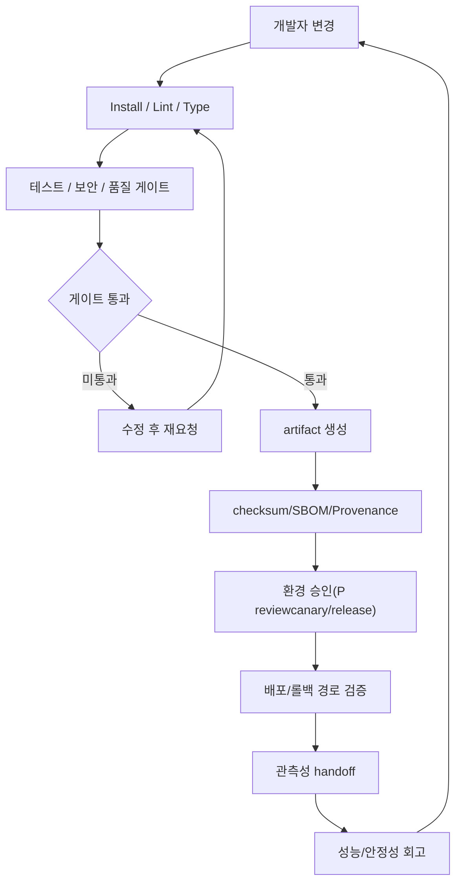
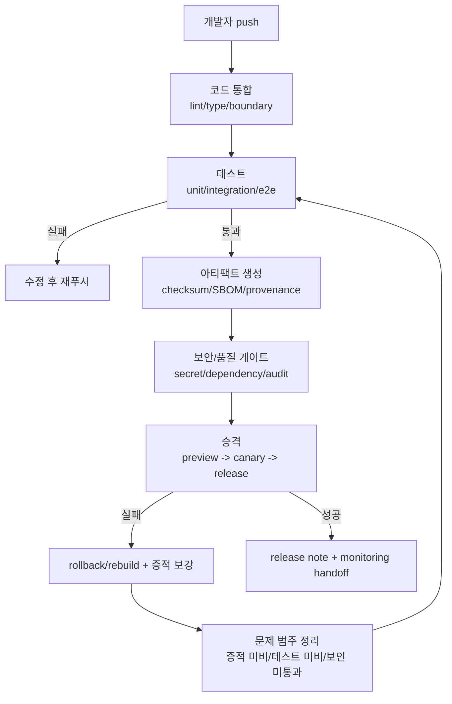
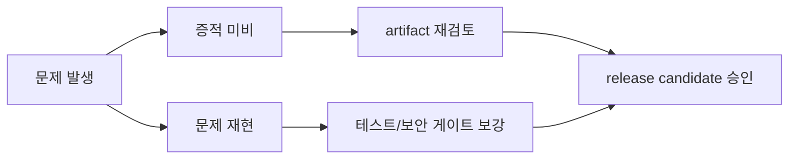

# 11. CI/CD 파이프라인 표준

> **쉽게 읽기 안내**: 이 문서는 전문 용어가 많을 수 있어요.
> 이해가 어려우면 [공통 용어사전](./00_개발가이드_용어사전.md)에서 먼저 용어 뜻을 확인하고 본문을 이어서 읽으면 이해가 훨씬 빨라집니다.
> 특히 실무에서 자주 쓰이는 `배포`, `CI/CD`, `롤백`, `스키마`처럼 동작이 중요한 용어부터 먼저 익혀보세요.
## 0. 먼저 알고 가기 (30초 요약)

- CI는 변경 검증, CD는 배포/확장 규칙을 지키게 하는 게이트입니다.
- 테스트 실패/보안 실패/품질 규칙은 자동으로 배포를 막게 설계하세요.
- 배포 실패시 자동 롤백 경로가 준비되어 있어야 합니다.

## 초심자용 한눈에 보기

CI/CD는 “자동으로 검증하고, 위험이 보이면 멈추는” 라인입니다.

### 핵심 용어 빠르게 정리

| 용어 | 쉬운 뜻 |
| --- | --- |
| `파이프라인` | 커밋 후 실행되는 자동 검증/배포 단계 |
| `아티팩트` | 빌드 결과물(배포 가능한 산출물) |
| `빌드 게이트` | 실패하면 배포를 막는 필수 검사 |
| `브랜치 정책` | 어떤 브랜치에서 어떤 동작을 허용할지 규칙 |
| `원복` | 배포 실패 시 이전 상태로 되돌리는 절차 |


| 분류 | 인프라 & 배포 | 상태 | Stable |
| :--- | :--- | :--- | :--- |
| **연관 가이드** | [07. 테스팅](./07_테스팅_가이드.md), [10. 인프라](./10_인프라_IaC_가이드.md), [12. CDN 캐시](./12_CDN_캐시_전략.md), [14. 배포](./14_배포_프로세스_체크리스트.md), [27. 다중 개발 서버](./27_다중_개발_서버_구축_가이드.md) | **도구 원칙** | 벤더 중립 |
| **핵심 테마** | 재현 가능한 빌드, 품질 게이트, 보안 검사, artifact, approval, 배포 자동화 | **Update** | 최신 기준 |

---

> CI/CD 표준은 특정 자동화 플랫폼의 YAML이 아니라 **변경이 안전하게 통합되고, 검증된 artifact만 승격되며, 배포와 릴리즈가 통제되는 흐름**입니다.

---


## 추천 항목 (실무 우선순위)

- **시작 추천**: 최소 하나의 실패 게이트를 정해 merge/deploy 조건으로 만듭니다.
- **안정 추천**: artifact 무결성(SBOM/체크섬) 점검을 필수 단계로 추가합니다.
- **운영 추천**: 롤백 시나리오는 배포 전 dry run로 한 번 확인해 실제 장애 대응 시간을 단축하세요.


## 추천 항목 고도화 체크

- `즉시 적용` — 추천 항목 1개를 이번 주 내에 실제 작업 1건에 반영한다.
- `1주 내 정리` — 적용 결과를 PR 본문이나 회고 노트에 간단히 기록한다.
- `1개월 내 점검` — 재작업률/리뷰 충돌/배포 이슈 중 적어도 한 항목이 개선되었는지 확인한다.


## 추천 항목 실행 기록 템플릿

- `담당자` : 항목 적용 주체(문서 오너/팀원)를 명시
- `적용일` : 실제 반영된 날짜 및 작업 ID를 남김
- `측정 지표` : 리뷰 충돌/재작업/버그 재발 중 1개 이상 수치로 기록
- `보류 사유` : 적용을 못한 경우 이유를 1줄 기록하고 다음 액션을 지정

## 문서 책임 범위

| 이 문서가 결정하는 것 | 단일 출처로 따르는 문서 |
| :--- | :--- |
| install/lint/type/test/build/security/artifact 품질 게이트 | [07. 테스팅](./07_테스팅_가이드.md), [06. 보안](./06_웹_보안_심화_가이드.md) |
| artifact provenance, SBOM, checksum, environment approval | [10. 인프라](./10_인프라_IaC_가이드.md), [14. 배포](./14_배포_프로세스_체크리스트.md) |
| cache, CDN, preview deploy와 release 증적 | [12. CDN 캐시](./12_CDN_캐시_전략.md), [09. 관측성](./09_장애_대응_및_관측성_표준.md) |
| PR preview, branch environment, S3 artifact deploy workflow | [27. 다중 개발 서버](./27_다중_개발_서버_구축_가이드.md) |
| CI 예외와 flaky gate의 리뷰/승인 기준 | [16. 코드리뷰](./16_AI_협업_코드리뷰_가이드.md), [15. RFC](./15_RFC_의사결정_프로세스.md) |

---

## 0. 모든 프론트엔드 그룹 공통 Baseline

| 단계 | 최소 기준 | 실패 시 |
| :--- | :--- | :--- |
| **Install** | lockfile 기반 frozen install, 런타임 버전 고정 | 즉시 실패 |
| **Static check** | format, lint, type check, import boundary | merge 차단 |
| **Test** | unit, integration, contract, 핵심 E2E smoke | merge 또는 deploy 차단 |
| **Build** | production build, sourcemap 정책, bundle budget | deploy 차단 |
| **Security** | secret scan, dependency audit, license policy, SBOM/attestation | severity 기준 차단 |
| **Artifact** | immutable artifact 생성, checksum, 보관 기간 명시 | deploy 차단 |
| **Deploy** | 환경별 승인, canary/preview, rollback path | 자동 중단 |
| **Evidence** | 테스트 결과, trace, coverage, accessibility/performance report 보관 | 감사 불가 시 실패 |

### 0.0 파이프라인 순환 고리



### 0.1 교차 검증 매트릭스

| 권고 | 1차 출처 | 실행 증거 | 운영 증거 | 철회 조건 |
| :--- | :--- | :--- | :--- | :--- |
| Artifact provenance | SLSA specification | SBOM/provenance 생성, checksum 검증 | 배포 artifact 추적성 | provenance 없는 artifact는 production 승격 금지 |
| Frozen install | package manager 공식 lockfile 정책 | frozen install CI | dependency drift incident | emergency patch는 lockfile PR 필수 |
| Quality gate | 각 도구 공식 CLI와 팀 위험 모델 | lint/type/test/build report | escaped defect, rollback rate | flaky gate는 owner/expiry로 격리 |

### 0.2 운영 게이트

| Gate | Evidence | Owner | Rollback |
| :--- | :--- | :--- | :--- |
| 품질 검증 | lint, type, test, build, security report | CI owner | merge/deploy 차단 |
| Artifact provenance | checksum, SBOM, provenance, source revision | Release owner | artifact 폐기와 재빌드 |
| 환경 승격 | approval record, environment policy | Release manager | promotion 중단 또는 이전 환경으로 회귀 |
| Flaky gate 관리 | retry log, quarantine issue, 만료일 | QA owner | owner 없는 quarantine 해제와 gate 복구 |

---

### 0.3 공급망 증적 계약

CI/CD의 공급망 보안은 “취약점 스캔을 실행했다”가 아니라, 소스에서 artifact까지 이어지는 증거 체인을 남기는 것입니다. SLSA v1.2는 provenance와 artifact 검증을, NIST SSDF는 secure SDLC 활동을 구조화하는 기준으로 사용합니다.

| 증적 | 필수 필드 | 생성 시점 | 검증 시점 |
| :--- | :--- | :--- | :--- |
| Source revision | commit SHA, branch/tag, author/reviewer, protected status | merge | build 시작 전 |
| Dependency evidence | lockfile hash, package manager version, audit/signature result | install | PR과 release |
| SBOM | package name/version/license, transitive dependency, artifact id | build 직후 | release 승인, incident triage |
| Provenance/attestation | source repository, workflow id, runner/builder, subject digest | artifact 생성 직후 | deploy 승격 전 |
| Checksum | artifact digest, signing/attestation reference | artifact 업로드 | rollback/download 전 |
| Deployment evidence | environment, approver, release id, rollback artifact | promotion | incident/postmortem |

| 통제 | 기준 | 실패 시 |
| :--- | :--- | :--- |
| 최소 권한 token | job별 `contents: read`, 필요한 경우에만 `id-token: write`, `attestations: write` | workflow permission 축소 전 merge 보류 |
| OIDC | 장기 cloud key 대신 job 단위 short-lived token | secret 기반 배포는 만료일 있는 예외로만 허용 |
| Action/재사용 workflow 고정 | mutable ref 대신 SHA pin 또는 검증된 immutable release 정책 | high-risk workflow는 실행 차단 |
| Artifact 검증 | deploy job이 checksum/provenance를 검증한 artifact만 사용 | artifact 폐기와 재빌드 |

---


### 0.4 파이프라인 상태 기계도

빌드/검증/배포 각 단계의 실패 포인트를 도식으로 고정하면 변경 승인 기준이 더 명확해집니다.

```text
개발자 push
   |
   v
[코드 통합]
   |-- lint/type/lint boundary -- 실패 시 merge hold
   |
   v
[테스트]
   |-- unit/integration -> 실패: 수정 후 재푸시
   |-- e2e/smoke -> 실패: 테스트 보강 + 재검증
   |
   v
[아티팩트 생성]
   |-- checksum / SBOM / provenance
   |-- artifact immutable 저장
   |
   v
[보안/품질 게이트]
   |-- secret/dependency/audit pass
   |
   v
[승격]
   |-- preview 배포 -> canary -> release
   |-- 각 단계에서 지표/알림/이력 보존
   |
   v
[완료]
   ├─ 성공: release note + monitoring handoff
   └─ 실패: rollback/rebuild + 증적 보강
```

```text
승격 실패 시 기본 되돌림 우선순위

문제 발생
  → 증적 미비 → artifact 재검토
 → 증적 충분/문제 재현 → 테스트나 보안 게이트 보강
  → 모두 통과 후 release candidate 승인
```





## 1. 파이프라인 구조

권장 순서는 빠른 실패에서 느린 검증으로 이동합니다.

```text
change
  -> install
  -> lint / type / unit
  -> integration / contract
  -> build artifact
  -> security / license / SBOM
  -> preview deploy
  -> E2E / accessibility / performance smoke
  -> staging or canary
  -> production release
```

`build once, deploy many`를 원칙으로 합니다. 환경별로 다시 빌드하면 "검증한 코드"와 "배포한 코드"가 달라질 수 있습니다.

---

## 2. 재현성 기준

| 항목 | 기준 |
| :--- | :--- |
| 런타임 | Node/Bun/pnpm 등 실행 버전을 파일로 고정 |
| 의존성 | lockfile 변경은 리뷰 대상, install은 frozen 모드 |
| 환경 변수 | build-time과 runtime 변수를 분리 |
| 캐시 | lockfile, OS, 런타임 버전을 cache key에 포함 |
| 산출물 | checksum, build metadata, source revision 포함 |
| 시간 의존성 | 테스트에서 현재 시간, locale, timezone 고정 |

---

## 3. 품질 게이트

| 게이트 | 최소 요구사항 |
| :--- | :--- |
| Type | `tsc --noEmit` 또는 동등한 type check 통과 |
| Lint | React Hooks/Compiler, 접근성, import boundary 규칙 포함 |
| Unit | 핵심 유틸, hooks, reducers, domain logic |
| Integration | API mocking, form validation, error handling |
| Contract | OpenAPI/GraphQL/schema breaking change 검출 |
| E2E | 로그인, 탐색, 주요 전환, 결제/저장 등 핵심 flow |
| Accessibility | 자동 검사 + 핵심 flow keyboard smoke |
| Performance | bundle budget, Core Web Vitals smoke, Lighthouse/trace budget |

게이트는 "권장"이 아니라 merge/deploy 조건이어야 합니다. 예외는 owner, 만료일, 보완 계획이 있는 RFC로만 허용합니다.

---

## 4. 보안과 공급망

| 영역 | 기준 |
| :--- | :--- |
| Secret | commit, build log, artifact, client bundle에 secret 노출 금지 |
| Dependency | 심각도와 exploitability 기준으로 차단 정책 운영 |
| SBOM | production artifact와 함께 생성 및 보관 |
| Provenance | artifact가 어떤 commit과 workflow에서 나왔는지 증명 |
| Permission | CI token은 job별 최소 권한 |
| OIDC | 장기 cloud key 대신 임시 workload identity 사용 |

보안 검사는 가장 늦은 production 직전에 처음 돌리면 비용이 큽니다. PR 단계에서 빠른 secret/dependency scan을 먼저 실행합니다.

### 4.1 provenance 검증 예시

아래 예시는 특정 플랫폼 문법을 표준으로 강제하기 위한 것이 아니라, 어떤 CI에서도 필요한 permission과 검증 흐름을 보여주기 위한 참고입니다.

```yaml
permissions:
  contents: read
  id-token: write
  attestations: write

steps:
  - run: build-command
  - run: sha256sum dist/app.tar.gz > dist/app.sha256
  - name: Generate artifact attestation
    uses: actions/attest@v4
    with:
      subject-path: dist/app.tar.gz
  - name: Verify artifact attestation before deploy
    run: gh attestation verify dist/app.tar.gz -R ORG/REPO
```

배포 job은 build job에서 생성한 artifact를 다운로드하고, checksum과 provenance를 확인한 뒤에만 환경 승격을 수행합니다. 환경별 재빌드는 금지합니다.

---

## 5. Branch와 Release 전략

| 전략 | 기준 |
| :--- | :--- |
| Trunk-based | 작은 PR, feature flag, 빠른 통합 |
| Release branch | 규제/검증 기간이 긴 제품에서만 제한적으로 사용 |
| Feature flag | deploy와 release 분리, kill switch 필수 |
| Canary | 일부 사용자/트래픽/환경에서 지표 확인 후 확대 |
| Rollback | artifact rollback과 flag off를 모두 준비 |

긴 수명 feature branch는 merge conflict와 테스트 공백을 만들기 쉽습니다. 큰 기능은 작은 PR과 feature flag로 나눕니다.

---

## 6. Artifact 보관

| 산출물 | 보관 기준 |
| :--- | :--- |
| Build output | release와 rollback 기간 동안 보관 |
| Test report | 실패 원인 분석 가능한 기간 동안 보관 |
| E2E trace/video | 실패 시 항상 보관 |
| Coverage | 추세 분석 목적의 요약 보관 |
| SBOM/provenance | 감사 요구 기간에 맞춰 보관 |
| Source map | 접근 제한, 업로드 후 public 노출 금지 |

artifact 보관 기간은 비용과 감사 요구의 균형으로 정하되, rollback 가능한 기간보다 짧아서는 안 됩니다.

---

## 7. 배포 승인

production 배포는 자동화되어야 하지만 자동 승인까지 요구하지는 않습니다.

| 조건 | 승인 정책 |
| :--- | :--- |
| 낮은 위험 | 모든 게이트 통과 시 자동 승격 |
| 중간 위험 | reviewer 또는 release owner 승인 |
| 높은 위험 | RFC/ADR, rollback drill, 변경 창 필요 |
| 긴급 hotfix | 사후 리뷰와 postmortem 필수 |

승인은 "누가 버튼을 눌렀는가"보다 "어떤 증적을 보고 승인했는가"가 중요합니다.

---

## 8. 체크리스트

- [ ] lockfile 기반 frozen install을 강제하는가
- [ ] lint/type/unit이 PR마다 빠르게 실행되는가
- [ ] 핵심 flow E2E와 preview smoke가 있는가
- [ ] secret scan과 dependency audit이 merge 전에 실행되는가
- [ ] build artifact가 immutable이고 재사용되는가
- [ ] deploy job이 checksum과 provenance/attestation을 검증하는가
- [ ] 장기 cloud key 대신 OIDC 기반 short-lived credential을 사용하는가
- [ ] sourcemap이 public artifact에 노출되지 않는가
- [ ] production 배포에는 승인 조건과 rollback 경로가 있는가
- [ ] 실패 trace, test report, SBOM, provenance가 보관되는가

---

## 9. 제외한 벤더 종속 항목

공통 개발 가이드에는 특정 CI 플랫폼의 action 이름, 특정 패키지 매니저만을 전제로 한 캐시 설정, 특정 알림 도구, 특정 secret manager, 특정 클라우드 배포 명령을 표준으로 포함하지 않습니다. 이 문서는 어떤 자동화 플랫폼에서도 구현 가능한 파이프라인 단계, 게이트, 증적, 승인 기준만 남깁니다.

---

## 10. 로컬 Hook과 Commit Gate

로컬 hook은 CI를 대체하지 않습니다. 개발자가 push 전에 빠르게 알 수 있는 오류만 잡고, 권위 있는 판정은 CI가 담당합니다.

### 10.1 Husky 기본 설정

```bash
pnpm add --save-dev husky lint-staged @commitlint/cli @commitlint/config-conventional secretlint @secretlint/secretlint-rule-preset-recommend
pnpm exec husky init
```

Husky `init`은 `.husky/pre-commit`을 만들고 `package.json`의 `prepare` script를 갱신합니다. hook에는 POSIX shell에서 동작하는 짧은 명령만 둡니다.

```sh
# .husky/pre-commit
pnpm exec lint-staged
pnpm exec secretlint "**/*"
```

```sh
# .husky/commit-msg
pnpm exec commitlint --edit "$1"
```

### 10.2 commitlint 기준

```javascript
export default {
  extends: ['@commitlint/config-conventional'],
  rules: {
    'type-enum': [
      2,
      'always',
      ['feat', 'fix', 'docs', 'refactor', 'test', 'chore', 'ci', 'perf', 'revert'],
    ],
  },
};
```

- commitlint 설정 파일은 `commitlint.config.js`, `commitlint.config.mjs`, `.commitlintrc.*` 중 하나로 둡니다.
- `export default` 형식은 `type: "module"` 프로젝트의 `commitlint.config.js` 또는 `commitlint.config.mjs`로 둡니다. CommonJS 프로젝트는 `commitlint.config.cjs`와 `module.exports`를 사용해 Node 로딩 차이를 피합니다.
- squash merge를 쓰더라도 PR title과 merge commit message가 같은 규칙을 통과해야 release note 자동화가 안정적입니다.

### 10.3 hook에 넣을 것과 CI에 둘 것

| 위치 | 넣을 작업 | 제외할 작업 |
| :--- | :--- | :--- |
| `pre-commit` | staged lint/format, secretlint, 빠른 타입 단서 검사 | 전체 build, 전체 E2E, 외부 API 의존 테스트 |
| `commit-msg` | commitlint | branch policy, PR title 검증 |
| PR CI | frozen install, lint, type, unit, MSW integration, build, secret scan | 개인 환경에만 있는 editor task |
| protected branch | required checks, review approval, provenance | 로컬 hook 성공 여부 |

`HUSKY=0`으로 hook을 우회한 commit은 PR 본문에 이유와 CI 결과를 남깁니다. 반복 우회가 생기면 hook이 너무 느리거나 noisy하다는 신호로 보고 명령을 재조정합니다.

---

## 실무 적용 가이드

### 언제 이 문서를 펼칠까

- 로컬에서는 되는데 CI나 배포 환경에서만 깨질 때
- 검증한 artifact와 배포한 artifact가 다를 때
- 보안/성능/접근성 검사가 배포 직전에야 실패할 때

### 적용 순서

1. 런타임과 package manager 버전을 고정한다.
2. frozen install, lint, type, unit, integration, build 순서로 빠르게 실패하게 만든다.
3. build once, deploy many 원칙으로 immutable artifact를 만든다.
4. SBOM/provenance/checksum을 artifact에 연결한다.
5. preview와 canary에서 핵심 flow smoke를 실행한다.

### 함께 두는 파일

- 서비스별 pipeline 설정과 검증 명령은 서비스 폴더의 package script와 맞춘다.
- 공통 reusable workflow는 입력/출력 계약과 함께 관리한다.
- 테스트 fixture와 CI artifact 경로는 기능/서비스 단위로 추적 가능해야 한다.

### 흔한 실수

- 환경별로 다시 빌드한다.
- lockfile 변경을 리뷰하지 않는다.
- flaky gate를 조용히 retry로 숨긴다.
- artifact provenance 없이 production에 승격한다.

### PR 완료 기준

- [ ] frozen install과 quality gate가 통과한다.
- [ ] artifact checksum/provenance가 있다.
- [ ] preview smoke 결과가 있다.
- [ ] rollback 가능한 이전 artifact가 있다.

## 추천 항목 실행 우선순위 매핑

- `P1(7일 내)` — 추천 항목 1개를 우선 적용하고 1회 사용자 관측 신호(에러율/실패율/지연)와 연결한다.
- `P2(30일 내)` — 추천 항목 1개를 팀 내 표준/템플릿에 반영해 재사용성을 확보한다.
- `P3(90일 내)` — 추천 항목 1개를 다른 관련 문서에 역링크로 연동해 중복 작업을 줄인다.
- `완료 기준` — 각 항목별 산출물(예: PR 링크/체크리스트/회고 노트)을 1개 이상 남긴다.

## 추천 항목 실행 체크리스트

- [ ] `1단계(7일)` : 추천 항목 1개를 실제 작업으로 전환
- [ ] `2단계(30일)` : 전환 결과를 팀 산출물(ADR/PR/체크리스트)에 반영
- [ ] `3단계(60일)` : 정적 지표 1개 이상으로 효과 검증
- [ ] `문제 대응` : 미달성 시 보류 사유와 다음 실행 액션을 문서화
