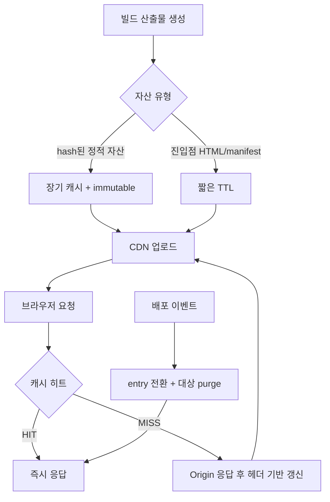

# 12. CDN 캐시 전략

| 분류 | 성능 & 배포 | 상태 | Stable |
| :--- | :--- | :--- | :--- |
| **연관 가이드** | [08. 성능](./08_성능_최적화_가이드.md), [10. 인프라](./10_인프라_IaC_가이드.md), [11. CI/CD](./11_CICD_파이프라인_표준.md), [14. 배포](./14_배포_프로세스_체크리스트.md) | **도구 원칙** | 벤더 중립 |
| **핵심 테마** | HTTP caching, immutable assets, cache key, invalidation, compression, security headers, edge routing | **Update** | 최신 기준 |

---

> CDN 캐시 표준은 특정 CDN 제품의 기능 목록이 아니라 **정적 자산을 오래 캐시하고, 엔트리 문서는 즉시 갱신하며, 캐시 키와 무효화를 통제하는 배포 계약**입니다.

---

## 문서 책임 범위

| 이 문서가 결정하는 것 | 단일 출처로 따르는 문서 |
| :--- | :--- |
| HTTP cache header, immutable asset, entry freshness, invalidation 계약 | [14. 배포](./14_배포_프로세스_체크리스트.md), [11. CI/CD](./11_CICD_파이프라인_표준.md) |
| cache key, compression, security headers, edge routing 기준 | [06. 보안](./06_웹_보안_심화_가이드.md), [10. 인프라](./10_인프라_IaC_가이드.md) |
| 캐시가 Core Web Vitals와 RUM에 미치는 영향 | [08. 성능](./08_성능_최적화_가이드.md), [09. 관측성](./09_장애_대응_및_관측성_표준.md) |
| Service Worker/PWA cache와 CDN cache의 책임 분리 | [26. PWA](./26_PWA_오프라인_전략_가이드.md) |

---

## 0. 모든 프론트엔드 그룹 공통 Baseline

| 영역 | 공통 기준 | 검증 방법 |
| :--- | :--- | :--- |
| **Immutable assets** | 파일명에 content hash가 있는 JS/CSS/image/font는 장기 캐시 + immutable | response header 검사 |
| **Entry document** | `index.html`, app shell, manifest 중 배포 전환에 민감한 파일은 no-cache 또는 짧은 TTL | smoke test |
| **Cache key 최소화** | 캐시에 필요한 header, cookie, query만 포함 | cache hit ratio |
| **무효화 최소화** | 전체 purge 대신 entry document와 변경 경로만 무효화 | deploy log |
| **압축** | Brotli/gzip 전송 또는 사전 압축을 적용 | `content-encoding` 검사 |
| **보안 헤더** | HSTS, CSP, X-Content-Type-Options, Referrer-Policy 등 공통 헤더 적용 | header audit |
| **관측성** | hit/miss, origin latency, 4xx/5xx, regional anomaly 추적 | CDN dashboard/RUM |

### 0.0 캐시 요청/무효화 흐름

### 0.1 교차 검증 매트릭스

| 권고 | 1차 출처 | 실행 증거 | 운영 증거 | 철회 조건 |
| :--- | :--- | :--- | :--- | :--- |
| HTTP cache contract | HTTP caching 표준과 브라우저 동작 | header smoke, asset hash check | cache hit ratio, stale asset incident | HTML/asset mismatch 발생 시 TTL 재설계 |
| 최소 cache key | CDN/HTTP 캐시 원리 | key diff review, hit ratio test | origin request rate | 개인화 오류 발생 시 key 확장 |
| 보안 헤더 | OWASP/W3C 보안 권고 | header audit, CSP report-only | CSP violation, mixed content | 위반 폭증 시 report-only로 회귀 |

### 0.2 운영 게이트

| Gate | Evidence | Owner | Rollback |
| :--- | :--- | :--- | :--- |
| Cache contract | response header smoke, hash asset 검사 | Platform owner | TTL 축소 또는 entry 문서 rollback |
| Cache key 변경 | key diff, hit ratio, origin request 변화 | CDN owner | key 확장/축소 rollback |
| Invalidation | purge log, route list, release id | Release owner | targeted purge 또는 이전 entry 복구 |
| Security headers | header audit, CSP report-only 결과 | Security owner | report-only 전환 또는 policy rollback |

---

## 1. Cache-Control 표준

| 파일 유형 | 권장 정책 | 이유 |
| :--- | :--- | :--- |
| `assets/*.[hash].js` | `public, max-age=31536000, immutable` | 파일명이 바뀌면 새 버전이므로 장기 캐시 가능 |
| `assets/*.[hash].css` | `public, max-age=31536000, immutable` | JS와 동일 |
| image/font with hash | `public, max-age=31536000, immutable` | 사용자 재방문 성능 개선 |
| `index.html` | `no-cache` 또는 `max-age=0, must-revalidate` | 새 배포 진입점 즉시 반영 |
| `manifest.json` | 짧은 TTL 또는 `no-cache` | 앱 이름/아이콘/시작 URL 변경 가능 |
| `service-worker.js` | `no-cache` | 업데이트 감지를 늦추면 오프라인 캐시가 꼬임 |
| API response | 데이터 특성별 `private`, `no-store`, `s-maxage`, `stale-while-revalidate` | 개인화와 freshness 요구가 다름 |

`no-store`는 브라우저와 CDN 모두 저장하지 말아야 하는 민감 응답에 사용합니다. 단순히 새 버전 확인이 필요한 엔트리 문서에는 `no-cache`가 더 적합한 경우가 많습니다.

---

## 2. Cache Key 설계

캐시 키는 작을수록 hit ratio가 좋아집니다. 필요한 값만 포함합니다.

| 요소 | 기본 기준 | 포함해야 하는 경우 |
| :--- | :--- | :--- |
| Query string | 제외 | 이미지 변환, 검색 결과, pagination처럼 응답이 실제로 달라질 때 |
| Cookie | 제외 | 로그인 상태별 HTML, A/B bucket처럼 응답이 달라질 때 |
| Header | 제외 | `Accept-Language`, device class, image format 협상 등 |
| Path | 포함 | 기본 캐시 식별자 |
| Host | 멀티 도메인일 때 포함 | tenant/domain별 콘텐츠가 다를 때 |

무의식적으로 모든 query, cookie, header를 cache key에 넣으면 CDN cache hit ratio가 크게 떨어집니다.

---

## 3. SPA/MPA 배포 계약

프론트엔드 배포에서 가장 흔한 장애는 "HTML은 새 버전, JS는 이전 버전" 또는 그 반대입니다.

| 계약 | 기준 |
| :--- | :--- |
| Artifact | 한 번 만든 build artifact는 수정하지 않고 승격 |
| Asset hash | 모든 JS/CSS chunk는 content hash 포함 |
| Entry freshness | entry HTML은 항상 최신 확인 |
| Backward compatibility | 새 HTML이 참조하는 asset이 CDN에 업로드된 뒤 HTML을 전환 |
| Rollback | 이전 HTML과 이전 asset이 보존되어야 함 |
| Service Worker | SW 캐시 정책과 CDN TTL을 별도 문서로 맞춤 |

배포 순서는 일반적으로 `assets 업로드 -> assets 검증 -> entry 문서 전환 -> entry 무효화 -> smoke test`입니다.

---

## 4. Invalidation 원칙

| 상황 | 권장 무효화 |
| :--- | :--- |
| 일반 SPA 배포 | entry HTML, manifest, service worker |
| 해시 자산 변경 | 무효화 불필요 |
| 잘못된 정적 파일 배포 | 해당 경로만 purge |
| 보안/개인정보 노출 | 즉시 purge + 원본 삭제 + postmortem |
| API 캐시 오염 | affected key만 purge, 원인 수정 전 전체 purge 반복 금지 |

`/*` 전체 무효화는 비용, 지연, cache warm-up 손실을 만들기 때문에 긴급 상황이 아니라면 피합니다.

---

## 5. 보안 헤더

CDN 또는 origin 중 한 곳에서 일관되게 보안 헤더를 적용합니다.

| 헤더 | 기준 |
| :--- | :--- |
| `Strict-Transport-Security` | HTTPS 강제, preload는 도메인 소유권과 서브도메인 영향 검토 후 적용 |
| `Content-Security-Policy` | `default-src 'self'`에서 시작해 필요한 출처만 allowlist |
| `X-Content-Type-Options` | `nosniff` |
| `Referrer-Policy` | `strict-origin-when-cross-origin` 이상 |
| `Permissions-Policy` | 사용하지 않는 브라우저 기능 비활성화 |
| `Cross-Origin-Opener-Policy` | 격리가 필요한 앱에서 적용 |

보안 헤더는 모든 환경에서 동일한 정책을 쓰기보다, report-only에서 위반 로그를 확인한 뒤 enforce로 전환합니다.

---

## 6. Compression과 이미지 전송

| 대상 | 기준 |
| :--- | :--- |
| Text assets | Brotli 우선, gzip fallback |
| Large JS/CSS | 사전 압축 또는 CDN 압축 중 하나를 명확히 선택 |
| Images | AVIF/WebP 지원, 원본 보관, width/quality 제한 |
| Fonts | subset, preload 최소화, `font-display` 적용 |

압축은 성능 최적화지만 CPU 비용과 빌드 시간을 늘릴 수 있습니다. 큰 트래픽 서비스는 사전 압축과 CDN 자동 압축의 비용/효과를 측정합니다.

---

## 7. Edge Logic 사용 기준

Edge function/worker는 강력하지만 남용하면 디버깅이 어려워집니다.

| 적합 | 부적합 |
| :--- | :--- |
| SPA fallback rewrite | 복잡한 비즈니스 로직 |
| 단순 redirect | 대규모 DB 조회 |
| 언어/지역 기반 routing | 개인정보 처리 |
| A/B bucket header 부여 | 긴 실행 시간 작업 |
| 보안 헤더 보정 | 상태ful workflow |

Edge logic은 테스트, 로그, 롤백 경로가 있는 경우에만 production에 적용합니다.

---

## 8. 관측 지표

| 지표 | 의미 | 개선 방향 |
| :--- | :--- | :--- |
| Cache hit ratio | CDN이 origin 요청을 얼마나 줄이는지 | cache key 축소, TTL 조정 |
| Origin latency | 캐시 미스 시 사용자 영향 | origin 성능, shield/cache layer |
| 4xx/5xx by path | 잘못된 라우팅/배포 탐지 | rewrite rule, asset 업로드 검증 |
| Bytes transferred | 비용과 성능 | 압축, 이미지 최적화 |
| Purge count | 배포 안정성 | immutable asset, entry-only invalidation |
| Regional anomaly | 특정 지역 장애 | routing, provider status, fallback |

성능 가이드는 Core Web Vitals를 사용자 관점에서 보고, CDN 가이드는 전송 계층의 원인을 분리해 봅니다.

---

## 9. 체크리스트

- [ ] 모든 JS/CSS chunk 파일명에 content hash가 포함되는가
- [ ] `index.html`과 `service-worker.js`가 장기 캐시되지 않는가
- [ ] cache key에 불필요한 cookie/header/query가 포함되지 않는가
- [ ] 배포 시 전체 purge가 아니라 entry 중심 무효화를 하는가
- [ ] rollback할 이전 HTML과 asset이 보존되는가
- [ ] CSP/HSTS/Referrer-Policy 등 보안 헤더가 적용되는가
- [ ] hit ratio, origin latency, 4xx/5xx, purge count를 추적하는가
- [ ] SW 캐시와 CDN TTL의 충돌을 테스트했는가

---

## 10. 제외한 벤더 종속 항목

공통 개발 가이드에는 특정 CDN 제품의 함수 런타임, 전용 key-value store, 전용 continuous deployment 기능, 전용 WAF managed rule, 전용 CLI 명령, 특정 DNS/인증서 서비스 절차를 표준으로 포함하지 않습니다. 이 문서에는 어떤 CDN을 쓰더라도 유지되어야 하는 HTTP 캐시, cache key, 무효화, 보안 헤더, 압축, 관측성 기준만 남깁니다.

---

## 실무 적용 가이드

### 언제 이 문서를 펼칠까

- 배포 후 사용자가 오래된 JS/CSS를 받거나 blank screen이 생길 때
- 캐시 hit ratio는 높은데 개인화/보안 문제가 의심될 때
- cache purge와 rollback 순서가 정해져 있지 않을 때

### 적용 순서

1. HTML/entry는 짧게, 해시 자산은 immutable로 캐시한다.
2. cache key에서 cookie/header/query를 최소화한다.
3. 개인화 응답과 public asset 경계를 분리한다.
4. 배포 후 header scan과 stale asset synthetic check를 돌린다.
5. purge, rollback, 이전 asset 보관 기간을 문서화한다.

### 함께 두는 파일

- route별 cache policy와 배포 설정을 같은 service/config 폴더에 둔다.
- CDN header test는 배포 pipeline 가까이에 둔다.
- PWA cache와 CDN cache 정책은 서로 링크하되 책임을 분리한다.

### 흔한 실수

- HTML에 immutable cache를 준다.
- 사용자별 응답을 public cache에 섞는다.
- cache key에 모든 cookie를 포함해 hit ratio를 망친다.
- purge만 믿고 rollback asset을 보관하지 않는다.

### PR 완료 기준

- [ ] cache-control 정책표가 있다.
- [ ] header scan이 통과한다.
- [ ] stale asset/rollback 테스트가 있다.
- [ ] 개인화 응답 캐시 위험이 검토되었다.
