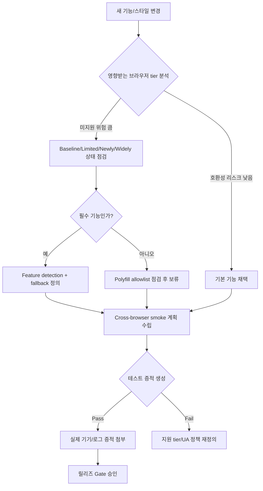

# 13. 브라우저 호환성 가이드

> **쉽게 읽기 안내**: 이 문서는 전문 용어가 많을 수 있어요.
> 이해가 어려우면 [공통 용어사전](./00_개발가이드_용어사전.md)에서 먼저 용어 뜻을 확인하고 본문을 이어서 읽으면 이해가 훨씬 빨라집니다.
> 특히 실무에서 자주 쓰이는 `배포`, `CI/CD`, `롤백`, `스키마`처럼 동작이 중요한 용어부터 먼저 익혀보세요.
## 초심자용 한눈에 보기

브라우저가 다르므로 “기능이 꼭 필요한 곳만” 안정적으로 노출시키는 접근이 중요합니다.

### 핵심 용어 빠르게 정리

| 용어 | 쉬운 뜻 |
| --- | --- |
| `브라우저 호환성` | 어떤 브라우저에서 동작 보장하는 범위 |
| `feature detection` | 기능이 있는지 실행 전 확인하는 방식 |
| `polyfill` | 없는 기능을 보완하는 코드 |
| `fallback` | 기능이 안 되면 대체로 보여줄 동작 |
| `지원 tier` | 지원을 약속한 브라우저 조합 |


| 분류 | 품질 & 사용자 환경 | 상태 | Stable |
| :--- | :--- | :--- | :--- |
| **연관 가이드** | [07. 테스팅](./07_테스팅_가이드.md), [08. 성능](./08_성능_최적화_가이드.md), [11. CI/CD](./11_CICD_파이프라인_표준.md), [19. 접근성](./19_웹_접근성_가이드.md) | **도구 원칙** | 벤더 중립 |
| **핵심 테마** | 지원 범위, feature detection, polyfill allowlist, progressive enhancement, cross-browser CI | **Update** | 최신 기준 |

---

> 브라우저 호환성 표준은 특정 브라우저 취향이 아니라 **지원 범위, 감지 방식, fallback, 테스트 매트릭스**를 명문화하는 품질 계약입니다.

---

## 문서 책임 범위

| 이 문서가 결정하는 것 | 단일 출처로 따르는 문서 |
| :--- | :--- |
| 지원 tier, browserslist, feature detection, polyfill allowlist | [07. 테스팅](./07_테스팅_가이드.md), [11. CI/CD](./11_CICD_파이프라인_표준.md) |
| cross-browser smoke와 real device evidence 기준 | [08. 성능](./08_성능_최적화_가이드.md), [09. 관측성](./09_장애_대응_및_관측성_표준.md) |
| 접근성/RTL/motion 호환성 검증 | [19. 웹 접근성](./19_웹_접근성_가이드.md), [23. 국제화](./23_국제화_가이드.md), [25. 웹 애니메이션](./25_웹_애니메이션_모션_가이드.md) |
| 디자인 시스템 컴포넌트의 브라우저 지원 기준 | [20. 디자인 시스템](./20_디자인_시스템_가이드.md) |

---

## 0. 모든 프론트엔드 그룹 공통 Baseline

| 영역 | 공통 기준 | 검증 방법 |
| :--- | :--- | :--- |
| **지원 tier** | Tier 1, Tier 2, unsupported browser를 명시 | 실제 사용자 분포 + 제품 요구 |
| **browserslist** | 코드 변환/폴리필/테스트 기준을 repo에 고정 | CI에서 출력 확인 |
| **Feature detection** | UA sniffing보다 `@supports`, capability check 우선 | fallback test |
| **Polyfill allowlist** | 필요한 API만 조건부 로드, 공급망 위험 검토 | bundle audit |
| **Cross-browser CI** | 핵심 flow는 Chromium/Firefox/WebKit 계열에서 smoke | E2E matrix |
| **Fallback UX** | 미지원 기능은 기능 축소, 안내, 대체 flow 제공 | manual QA |
| **Real device evidence** | 모바일/터치/저성능 환경 이슈는 실제 기기 증적 확보 | screenshot/trace |

### 0.0 브라우저 호환성 처리 흐름



### 0.1 교차 검증 매트릭스

| 권고 | 1차 출처 | 실행 증거 | 운영 증거 | 철회 조건 |
| :--- | :--- | :--- | :--- | :--- |
| Baseline 기반 기능 채택 | web.dev/MDN Baseline 상태 | feature detection test, browser smoke | browser-specific error rate | Tier 1 실패 시 fallback 필수 |
| Polyfill allowlist | Web API/TC39/W3C 상태 | conditional import test, bundle diff | long task, load time | 지원률 상승 시 polyfill 제거 |
| 지원 tier | 실제 사용자 분석 + 제품 요구 | browserslist output, E2E matrix | unsupported traffic share | 사용률/계약 변동 시 tier 재검토 |

### 0.2 운영 게이트

| Gate | Evidence | Owner | Rollback |
| :--- | :--- | :--- | :--- |
| 지원 범위 변경 | browser usage, 제품 요구, browserslist diff | FE owner | 기존 tier 유지 또는 fallback 제공 |
| Feature adoption | feature detection test, unsupported smoke | Feature owner | capability check 기반 no-op/fallback |
| Polyfill allowlist | bundle diff, 공급망 검토, 조건부 로드 테스트 | Platform owner | polyfill 제거 또는 lazy loading 전환 |
| Cross-browser smoke | Chromium/Firefox/WebKit 핵심 flow report | QA owner | release 차단 또는 tier별 제한 공지 |

---

### 0.3 Baseline 단계별 채택 기준

web.dev Baseline은 기능을 `Limited availability`, `Newly available`, `Widely available`로 구분합니다. 이 문서는 그 상태를 그대로 표준화하지 않고, 제품 tier와 fallback 비용을 함께 봅니다.

| Baseline 상태 | 기본 등급 | production 채택 조건 | 테스트/폴리필 기준 |
| :--- | :--- | :--- | :--- |
| Limited availability | Experimental Watch | 핵심 flow가 아니고 capability check와 대체 UX가 있을 때만 허용 | feature flag, Tier 1 smoke, fallback 필수 |
| Newly available | Conditional 또는 Recommended | Tier 1 사용자가 모두 지원하고, 실패 시 기능 축소가 가능한 경우 | `@supports`/runtime check, WebKit/Firefox smoke |
| Widely available | Baseline | 제품 지원 tier와 browserslist가 모두 만족할 때 기본 사용 가능 | polyfill 제거 후보, regression test 유지 |

새 기능을 채택할 때는 Baseline 상태, MDN/Can I Use 지원표, 실제 사용자 브라우저 분포, 접근성 영향, 번들/INP 비용을 한 PR에 함께 남깁니다.

---


## 1. 지원 범위 정의

| Tier | 기준 | 지원 수준 |
| :--- | :--- | :--- |
| **Tier 1** | 핵심 사용자 비중이 높고 매출/업무 영향이 큰 브라우저 | 모든 핵심 flow 자동/수동 검증 |
| **Tier 2** | 사용자 비중은 낮지만 지원 필요성이 있는 브라우저 | 주요 flow smoke와 graceful fallback |
| **Unsupported** | 보안 업데이트 종료, 사용률 매우 낮음, 기술적 제약 큼 | 안내 페이지 또는 기능 제한 |

지원 범위는 개발팀 선호가 아니라 실제 사용자 데이터, 법적/계약 요구, 제품 전략, 유지보수 비용으로 결정합니다.

---

## 2. Feature Detection

기능 지원 여부는 브라우저 이름보다 실제 capability로 판단합니다.

```typescript
export function supportsViewTransition(): boolean {
  return typeof document !== "undefined" && "startViewTransition" in document;
}

export function supportsContainerQuery(): boolean {
  return typeof CSS !== "undefined" && CSS.supports("container-type", "inline-size");
}
```

```css
@supports (container-type: inline-size) {
  .card-list {
    container-type: inline-size;
  }
}

@supports not (container-type: inline-size) {
  .card-list {
    display: grid;
  }
}
```

UA sniffing은 분석, 특정 알려진 엔진 버그 우회, 임시 hotfix처럼 제한된 경우에만 사용하고 만료일을 둡니다.

---

## 3. Polyfill 원칙

| 원칙 | 기준 |
| :--- | :--- |
| 조건부 로드 | 네이티브 지원 시 다운로드하지 않음 |
| 최소 범위 | 전체 polyfill bundle보다 필요한 API만 |
| 공급망 검토 | 외부 CDN 임의 로드 금지, lockfile/해시/자체 호스팅 검토 |
| 성능 측정 | polyfill 추가 전후 bundle size와 INP/LCP 확인 |
| 제거 계획 | browserslist 변경 시 더 이상 필요 없는 polyfill 제거 |

```typescript
export async function ensureIntlSegmenter(): Promise<void> {
  if ("Segmenter" in Intl) return;
  await import("./polyfills/intl-segmenter");
}
```

---

## 4. CSS 호환성 기준

| 기능 | 적용 기준 |
| :--- | :--- |
| 최신 layout 기능 | fallback layout을 함께 제공 |
| 애니메이션 | `prefers-reduced-motion` 준수 |
| 색상/테마 | forced-colors, contrast mode 확인 |
| form control | native behavior와 keyboard 접근성 유지 |
| viewport units | 모바일 주소창 변화 대응 |

새 CSS 기능은 design system primitive에서 먼저 흡수하고, 제품 화면마다 개별 fallback을 만들지 않습니다.

---

## 5. Cross-Browser 테스트 매트릭스

| 테스트 | 브라우저 범위 | 빈도 |
| :--- | :--- | :--- |
| Unit/DOM | 기본 런타임 | PR마다 |
| Component smoke | 주요 렌더링 엔진 1개 이상 | PR마다 |
| 핵심 E2E | Chromium/Firefox/WebKit 계열 | PR 또는 merge 전 |
| 접근성 keyboard | Tier 1 브라우저 | release 전 |
| 실제 기기 QA | 모바일/터치 주요 조합 | 주요 release 전 |

모든 테스트를 모든 브라우저에서 돌리는 것은 비용이 큽니다. 핵심 flow와 호환성 위험이 높은 영역을 우선합니다.

---

## 6. 호환성 이슈 triage

| 질문 | 판단 |
| :--- | :--- |
| 특정 브라우저에서만 실패하는가 | 호환성 또는 엔진 버그 가능성 |
| 동일 브라우저의 특정 버전만 실패하는가 | 버전별 미구현/버그 가능성 |
| polyfill 추가로 해결되는가 | API 미지원 가능성 |
| CSS fallback으로 해결되는가 | progressive enhancement 적용 |
| 제품 핵심 flow를 막는가 | P0/P1로 승격 |

이슈에는 브라우저 버전, OS, 기기, 스크린샷, trace, 최소 재현 코드, fallback 방안을 함께 남깁니다.

---

## 7. 체크리스트

- [ ] repo에 browserslist 또는 동등한 지원 범위 정의가 있는가
- [ ] Tier 1/2/unsupported 기준이 사용자 데이터와 연결되어 있는가
- [ ] 최신 Web API 사용 시 feature detection이 있는가
- [ ] Limited/Newly/Widely available 상태에 따라 채택 등급과 fallback을 기록했는가
- [ ] polyfill이 allowlist 방식으로 관리되는가
- [ ] 외부 polyfill CDN을 무검증으로 로드하지 않는가
- [ ] 핵심 flow가 주요 렌더링 엔진에서 자동 검증되는가
- [ ] 미지원 브라우저 사용자에게 fallback 또는 안내가 제공되는가
- [ ] 실제 기기 이슈는 screenshot/trace 증적이 남는가

---

## 8. 제외한 벤더 종속 항목

공통 개발 가이드에는 특정 브라우저 테스트 SaaS, 특정 디바이스 클라우드, 특정 브라우저 벤더의 콘솔 절차, 특정 상용 호환성 리포트 사용법을 표준으로 포함하지 않습니다. 이 문서는 어떤 테스트 인프라를 쓰더라도 유지되어야 하는 지원 범위, feature detection, polyfill, fallback, 테스트 매트릭스 기준만 남깁니다.

---

## 실무 적용 가이드

### 언제 이 문서를 펼칠까

- 새 Web API를 쓰고 싶지만 일부 브라우저 지원이 불확실할 때
- polyfill이 bundle size를 크게 늘릴 때
- 특정 브라우저에서만 핵심 flow가 깨질 때

### 적용 순서

1. 지원 browser tier와 사용자 비중을 정한다.
2. Baseline, MDN, 공식 문서로 API 상태를 확인한다.
3. feature detection과 fallback을 먼저 구현한다.
4. polyfill은 allowlist와 bundle budget 안에서만 추가한다.
5. Playwright matrix 또는 실제 기기 smoke 결과를 남긴다.

### 함께 두는 파일

- feature detection helper는 사용 feature 가까이에 둔다.
- 공통 browser capability util은 테스트와 함께 shared로 둔다.
- fallback UI와 E2E는 기능 폴더에 둔다.

### 흔한 실수

- UA sniffing만으로 분기한다.
- 지원하지 않는 브라우저에서 기능이 조용히 실패한다.
- polyfill 비용을 route별로 보지 않는다.
- 접근성 보조기술 조합을 브라우저 테스트에서 제외한다.

### PR 완료 기준

- [ ] 지원 tier가 명시되어 있다.
- [ ] feature detection/fallback 테스트가 있다.
- [ ] polyfill bundle diff가 확인되었다.
- [ ] 핵심 flow cross-browser smoke가 있다.
