# 14. 배포 프로세스 체크리스트

## 0. 먼저 알고 가기 (30초 요약)

- 배포는 “준비-승인-실행-확인-복구” 순서에서만 움직입니다.
- 카나리아/점진 배포로 리스크를 쪼개고 문제를 조기에 잡으세요.
- 체크리스트를 누락 없이 통과해야만 다음 단계로 넘어가는 구조로 만드세요.

## 초심자용 한눈에 보기

배포는 준비-검증-승인-출시-회복(롤백)의 순서가 핵심입니다.

> 일상 비유: 우편 배달과 같습니다. 분류(빌드/검증) -> 차량 적재(아티팩트) -> 일부 지역 시범 배달(canary) -> 전 지역 배달(릴리스) -> 반송 처리(롤백) 순서가 흔들리면 잘못된 우편이 모든 집에 한꺼번에 도착합니다.

### 핵심 용어 빠르게 정리

| 용어          | 쉬운 뜻                                        |
| ------------- | ---------------------------------------------- |
| `릴리스`      | 사용자에게 배포되는 정식 버전 공개             |
| `카나리 배포` | 일부 사용자에게 먼저 내보내 위험을 줄이는 배포 |
| `피처 플래그` | 기능을 조건부로 켜고 끄는 스위치               |
| `롤백`        | 문제 발견 시 이전 버전으로 되돌리는 동작       |
| `확인 지표`   | 배포 후 오류율/지연/로그를 확인하는 지표       |
| `deploy`      | 코드/아티팩트를 환경에 올리는 동작             |
| `release`     | 그 코드가 실제 사용자에게 노출되는 시점        |

### deploy와 release 분리 한눈에 보기

> 왜 중요한가: deploy와 release를 같이 두면 "노출 직후 발견된 결함" 때문에 전체 롤백이 강제됩니다. 분리하면 코드는 그대로 두고 노출만 끌 수 있습니다.

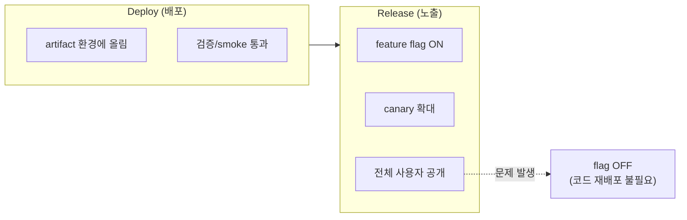

| 분류            | 배포 & 운영                                                                                                                                                                                                                           | 상태          | Stable    |
| :-------------- | :------------------------------------------------------------------------------------------------------------------------------------------------------------------------------------------------------------------------------------ | :------------ | :-------- |
| **연관 가이드** | [08. 성능](./08_성능_최적화_가이드.md), [09. 장애 대응](./09_장애_대응_및_관측성_표준.md), [11. CI/CD](./11_CICD_파이프라인_표준.md), [12. CDN 캐시](./12_CDN_캐시_전략.md), [27. 다중 개발 서버](./27_다중_개발_서버_구축_가이드.md) | **도구 원칙** | 벤더 중립 |
| **핵심 테마**   | deploy/release 분리, progressive delivery, rollback, feature flag, post-deploy monitoring                                                                                                                                             | **Update**    | 최신 기준 |

---

> 배포는 파일을 서버에 올리는 작업이 아니라 **검증된 artifact를 안전하게 사용자에게 노출하고, 문제가 생기면 빠르게 되돌리는 운영 절차**입니다.

---

## 추천 항목 (실무 우선순위)

- **시작 추천**: release 전 5단계 체크(빌드, 테스트, 보안, 모니터링, 롤백 준비)를 정형화하세요.
- **안정 추천**: 카나리아는 기능 단위로 좁게 시작해 이슈 전파 범위를 제한하세요.
- **운영 추천**: 각 배포에 대한 승인 근거와 롤백 근거를 템플릿으로 남깁니다.

## 추천 항목 고도화 체크

- `첫 적용` — canary, flag, rollback artifact, release health 중 하나를 실제 PR이나 운영 이슈에 붙이고, 변경 전 기준을 먼저 적는다.
- `증거 정리` — release note, deployment log, rollback artifact, health dashboard를 같은 작업 기록에 남긴다.
- `재점검` — rollback 시간, canary error rate, release failure 수가 나아졌는지 30일 안에 확인하고 기준을 유지, 수정, 폐기 중 하나로 판정한다.

## 추천 항목 실행 기록 템플릿

- `작업` : canary, flag, rollback artifact, release health 적용 범위를 어느 화면, 패키지, 문서에 둘지 적는다.
- `증거` : release note, deployment log, rollback artifact, health dashboard 중 실제로 남긴 항목만 링크한다.
- `판정` : 유지/수정/폐기 중 하나와 이유를 한 문장으로 남긴다.
- `다음 점검` : rollback 시간, canary error rate, release failure 수를 다시 볼 날짜와 담당자를 지정한다.

## 문서 책임 범위

| 이 문서가 결정하는 것                                         | 단일 출처로 따르는 문서                                                                                                    |
| :------------------------------------------------------------ | :------------------------------------------------------------------------------------------------------------------------- |
| deploy/release 분리, canary, rollback, post-deploy monitoring | [11. CI/CD](./11_CICD_파이프라인_표준.md), [09. 관측성](./09_장애_대응_및_관측성_표준.md)                                  |
| artifact, cache purge, CDN entry 전환과 release 증적          | [12. CDN 캐시](./12_CDN_캐시_전략.md), [10. 인프라](./10_인프라_IaC_가이드.md)                                             |
| preview/staging/production 환경 승격과 URL 기반 smoke         | [27. 다중 개발 서버](./27_다중_개발_서버_구축_가이드.md)                                                                   |
| 접근성/성능/보안 release gate                                 | [19. 웹 접근성](./19_웹_접근성_가이드.md), [08. 성능](./08_성능_최적화_가이드.md), [06. 보안](./06_웹_보안_심화_가이드.md) |
| 고위험 변경의 승인/철회 기준                                  | [15. RFC](./15_RFC_의사결정_프로세스.md)                                                                                   |

---

## 0. 모든 프론트엔드 그룹 공통 Baseline

| 영역                  | 공통 기준                                                      | 증적                      |
| :-------------------- | :------------------------------------------------------------- | :------------------------ |
| **Deploy != Release** | 코드 배포와 사용자 노출을 분리                                 | feature flag, canary 설정 |
| **Preflight**         | type/test/build/security/perf/accessibility gate 통과          | CI report                 |
| **Artifact**          | 검증된 immutable artifact만 승격                               | checksum, release id      |
| **Canary**            | 일부 환경/사용자/트래픽에서 먼저 확인                          | release health            |
| **Rollback**          | rollback, flag off, cache purge 경로를 사전 검증               | rollback runbook          |
| **Monitoring**        | 배포 후 error, latency, Core Web Vitals, conversion smoke 확인 | dashboard                 |
| **Communication**     | 배포 owner, 승인자, 변경 요약, 영향 범위 공유                  | release note              |

### 0.0 배포 실행 경로

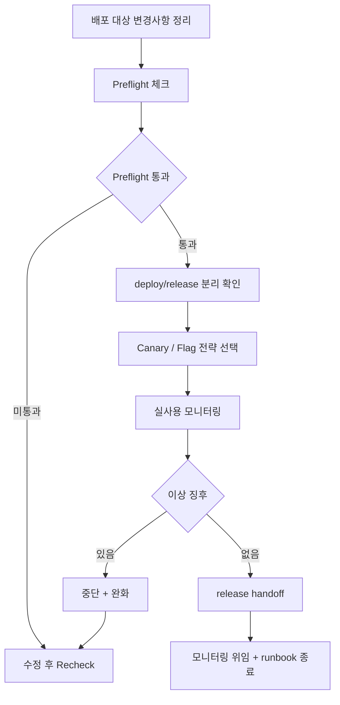

### 0.1 교차 검증 매트릭스

| 권고                   | 1차 출처                       | 실행 증거                        | 운영 증거                     | 철회 조건                         |
| :--------------------- | :----------------------------- | :------------------------------- | :---------------------------- | :-------------------------------- |
| Deploy/Release 분리    | Progressive delivery 운영 원칙 | flag/canary smoke                | release health, rollback rate | flag debt가 누적되면 cleanup gate |
| Rollback readiness     | incident/runbook 표준          | rollback drill, artifact restore | MTTR, failed rollback count   | rollback 불가 변경은 RFC 필요     |
| Post-deploy monitoring | Core Web Vitals/관측성 기준    | synthetic smoke, dashboard link  | error p95, RUM p75            | 회귀 감지 시 자동 확대 중단       |

### 0.2 운영 게이트

| Gate               | Evidence                                           | Owner         | Rollback                               |
| :----------------- | :------------------------------------------------- | :------------ | :------------------------------------- |
| Preflight          | type/test/build/security/perf/accessibility report | Release owner | 배포 보류와 수정 PR 요구               |
| Canary 확대        | release health, error rate, Core Web Vitals        | On-call owner | 확대 중단, flag off, artifact rollback |
| Rollback readiness | rollback drill, artifact restore, cache purge 증적 | Tech lead     | 이전 artifact와 entry 문서 복구        |
| Handoff            | release note, dashboard, monitoring owner          | Release owner | monitoring window 연장                 |

---

### 0.3 배포 의사결정 지도

배포는 기능 공개 시점과 rollback 비용을 동시에 고려해야 합니다.

```text
배포 전 승인 필요성 판단
       ┌────────────────────────────┐
       │ 변경이 사용자 노출까지 가는가? │
       └──────────────┬─────────────┘
                      │
             아니오    │     예
               +------+         +------+
               | 데모/PR |      | deploy/release 분리 점검 |
               +------+         +------+
                                 |
                                 v
                       ┌───────────────────────────┐
                       | preflight gate 통과 여부   |
                       | - type/test/build/security |
                       | - perf/accessibility      |
                       └─────────────┬─────────────┘
                                     │ 미통과
                                     v
                             롤백/수정 후 게이트 재실행
                                     ^
                                     │ 통과
                                     |
                     ┌───────────────────────────────────┐
                     | 점진 노출 전략 선택               |
                     | canary / flag / blue-green        |
                     +───────────────────────────────────+
                                     |
                                     v
                            post-deploy 모니터링
                                     |
                                     v
                          이상 징후 감지? ---> yes -> 중단 + 완화 + 재평가
                                     |
                                     no
                                     v
                              release handoff
```

```text
배포 단계 책임 맵

빌드 오너   => artifact + checksum 책임
릴리즈 오너 => canary/rollback 판단
관측성     => 모니터링 지표와 dashboard 유지
커뮤니케이션 => 사용자 공지/상태 공유
```

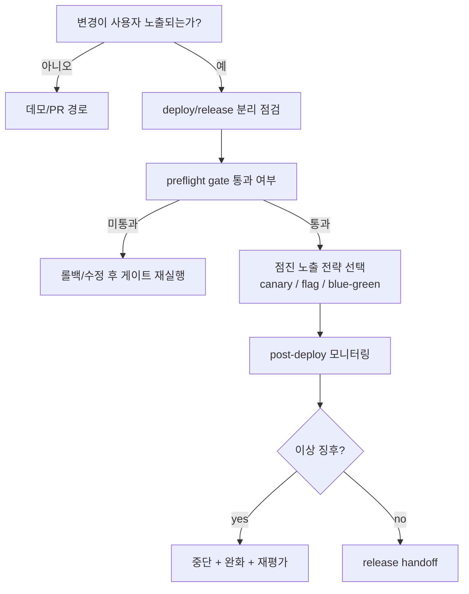

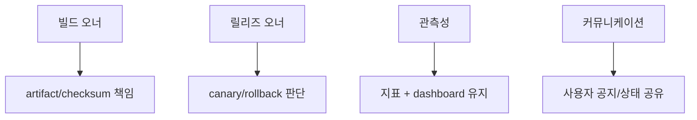

## 1. 배포 전 체크리스트

| 항목      | 기준                                                       |
| :-------- | :--------------------------------------------------------- |
| 변경 범위 | 사용자 영향 화면, API, 데이터, 캐시, 권한 변경을 요약      |
| 위험도    | P0/P1 가능성, rollback 난이도, 피크 시간 영향 평가         |
| 테스트    | 핵심 flow E2E, 변경 영역 regression, 브라우저 smoke 통과   |
| 성능      | bundle budget, Core Web Vitals 예산, 이미지/font 변경 확인 |
| 접근성    | 키보드 이동, focus, aria, contrast 변경 확인               |
| 보안      | secret, auth, CSP, dependency, supply-chain 검사           |
| 운영      | 알림, dashboard, feature flag, rollback owner 확인         |

---

## 2. 배포 전략 선택

> 일상 비유: 새 다리를 개통할 때 통행을 일부 차량에만 먼저 허용(canary)할지, 옆에 새 다리를 짓고 한번에 통행을 옮길지(blue/green)는 사고 시 우회 비용이 결정합니다.

| 전략                | 적합한 경우                         | 주의점                     |
| :------------------ | :---------------------------------- | :------------------------- |
| **Blue/Green**      | 빠른 전체 전환과 즉시 rollback 필요 | 두 환경의 설정 drift 관리  |
| **Canary**          | 사용자 영향이 큰 기능을 점진 노출   | 지표와 자동 중단 조건 필요 |
| **Feature flag**    | 기능 release를 배포 이후 통제       | 오래된 flag 정리 필요      |
| **Release train**   | 여러 팀 변경을 정해진 창에 묶음     | 긴급 hotfix 경로 별도 필요 |
| **Manual approval** | 규제/고위험 변경                    | 승인 증적과 책임 명확화    |

전략은 조직 문화가 아니라 변경 위험과 복구 가능성에 따라 고릅니다.

### 2.0 blue/green 전환 흐름

이 그림은 blue 환경에서 green 환경으로 트래픽을 전환하면서 문제가 생기면 즉시 되돌리는 흐름을 보여줍니다.

> **일상 비유**: 호텔이 새 객실 동(green)을 짓고 손님을 받기 전 청소·점검을 마친 뒤 단 한 번의 키 발급 시스템 변경(라우터 스위치)으로 손님을 옮기는 방식입니다. 문제가 생기면 키를 다시 옛 객실 동(blue)으로 돌려주면 됩니다.

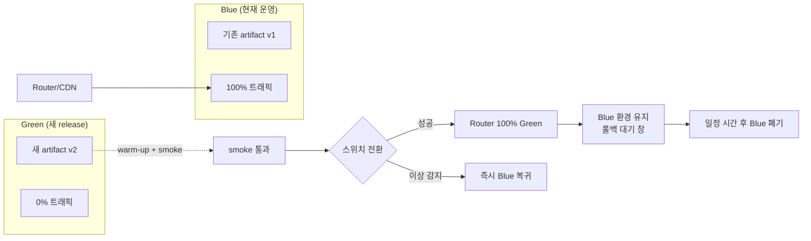

### 2.1 canary 점진 롤아웃 단계

> 왜 중요한가: 한 번에 100%를 노출하면 문제 영향 범위가 즉시 전체로 퍼집니다. 단계별 확대는 "조기 발견 + 작은 폭발 반경"을 만듭니다.

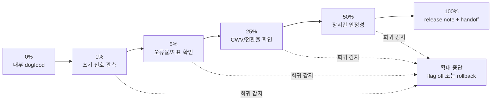

---

## 3. 배포 중 확인

| 시점      | 확인 항목                                                    |
| :-------- | :----------------------------------------------------------- |
| 시작      | release id, artifact checksum, target environment            |
| 배포 직후 | HTML/asset 버전 일치, CDN cache header, health endpoint      |
| canary    | 신규 오류, API 실패율, LCP/INP/CLS, blank screen             |
| 확대      | segment별 지표, 브라우저별 오류, 주요 전환                   |
| 완료      | rollback window 유지, release note, monitoring owner handoff |

배포 중 이상 징후가 있으면 "원인 분석을 끝낼 때까지 확대 중단"이 기본입니다.

---

## 4. 롤백 기준

> 일상 비유: 비행기 조종사의 "go-around" 결정과 비슷합니다. 무리하게 착륙을 강행하기보다 다시 상승해 안전을 확보하는 것이 훈련된 절차입니다. 롤백은 실패가 아니라 설계된 비상 경로입니다.

| 조건                   | 조치                                 |
| :--------------------- | :----------------------------------- |
| 핵심 flow 실패         | 즉시 rollback 또는 flag off          |
| 신규 JS error 급증     | canary 중단, 영향 release rollback   |
| Core Web Vitals 급락   | 확대 중단, 원인 확인                 |
| 잘못된 HTML/asset 조합 | entry 문서 rollback + cache 재검증   |
| 보안/개인정보 노출     | 즉시 노출 차단, purge, incident open |

롤백은 실패가 아니라 준비된 복구 절차입니다. rollback을 어렵게 만드는 schema/cache/auth 변경은 배포 전에 별도 RFC가 필요합니다.

### 4.1 롤백 의사결정 트리

> 왜 중요한가: 장애 중에 의사결정 기준이 머릿속에만 있으면 사람마다 판단이 달라집니다. 분기를 미리 정해두면 30분 내에 일관된 결정을 내릴 수 있습니다.

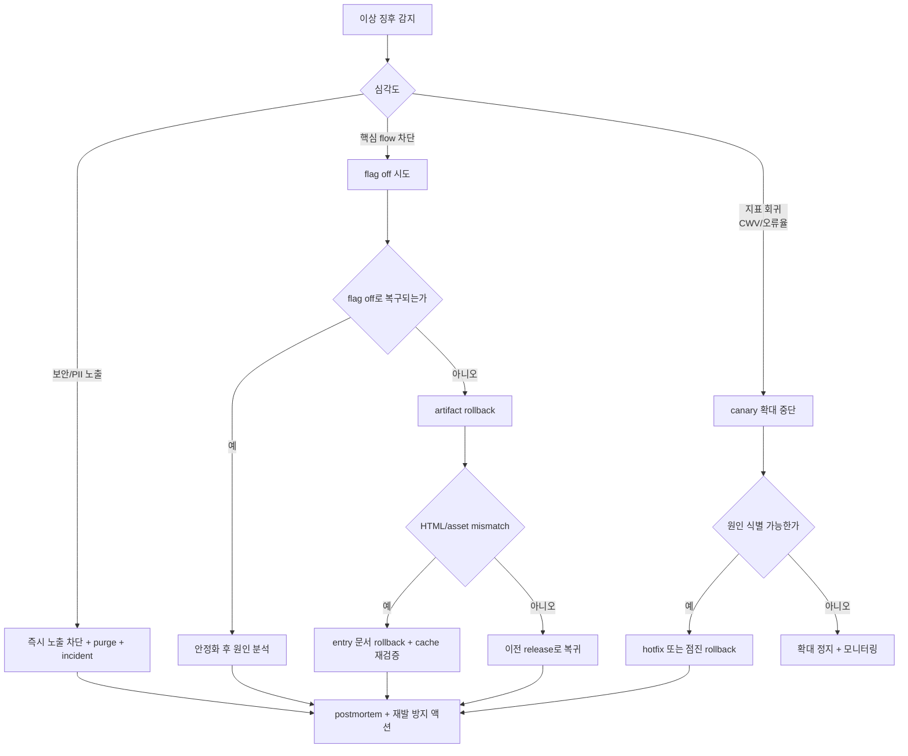

### 4.2 롤백 실행 시퀀스

> 비유: 응급실에서 의사가 환자에게 처치할 때 "절차서대로" 움직이는 것과 같습니다. 누가 무엇을 언제 하는지를 평소에 정해두지 않으면 실제 상황에서 늦습니다.

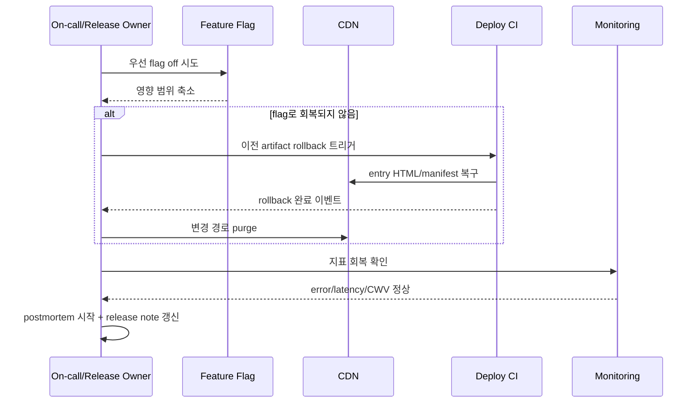

---

## 5. 배포 후 모니터링

> 왜 중요한가: "배포 성공"과 "기능 성공"은 다릅니다. 배포 직후 보지 않는 지표는 며칠 뒤에야 문제로 드러나, 원인 추적이 어렵습니다.

| 기간    | 기준                                                   |
| :------ | :----------------------------------------------------- |
| 0~15분  | error/crash/blank screen, synthetic smoke              |
| 15~60분 | Core Web Vitals, API 실패율, 주요 전환                 |
| 1일     | 사용자 문의, 브라우저/지역별 이상치, 비용 급증         |
| 1주     | 장기 성능 추세, feature flag 정리, post-release review |

monitoring owner는 배포자가 맡되, 장기 운영 지표는 기능 owner에게 인계합니다.

Sentry를 사용하는 배포에서는 [28. Sentry 모니터링 활용](./28_Sentry_모니터링_활용_가이드.md)의 release, source map, trace alert 기준을 이 monitoring window에 연결합니다.

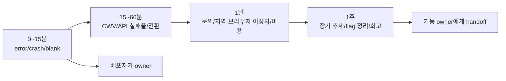

---

## 6. Feature Flag 운영

> 일상 비유: 전등 스위치를 방마다 다는 것은 편리하지만, 어느 스위치가 어느 방을 켜는지 잊으면 집 전체가 점점 어두워집니다. flag도 owner와 만료일이 없으면 코드 경로가 미로가 됩니다.

| 기준        | 설명                                     |
| :---------- | :--------------------------------------- |
| owner       | 모든 flag는 owner와 만료일을 가짐        |
| default     | 장애 시 안전한 기본값 정의               |
| kill switch | 서버/API 오류와 무관하게 끌 수 있어야 함 |
| audit       | 누가 언제 값을 바꿨는지 기록             |
| cleanup     | release 완료 후 제거 PR 생성             |

flag가 많아지면 코드 경로가 폭발합니다. 임시 flag는 만료일 없이 만들지 않습니다.

이 그림은 flag가 생성·실험·전체 노출·정리로 이동하는 단계별 상태와 전이 조건을 보여줍니다.

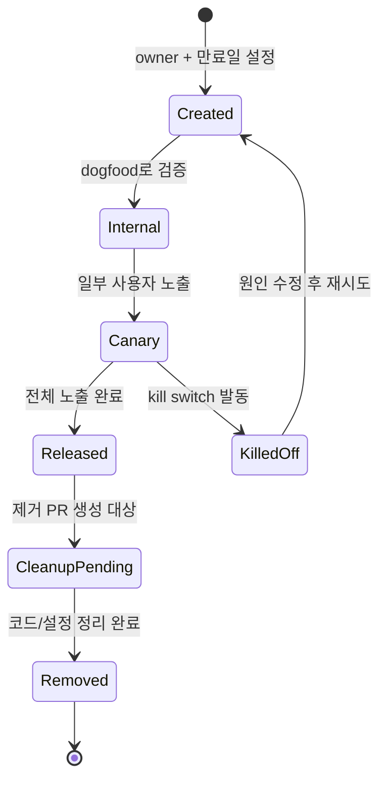

### 6.1 feature flag 사용 단계

이 그림은 flag를 코드에 도입한 시점부터 사용자에게 전체 노출하고 정리하기까지의 실무 작업 순서를 보여줍니다.

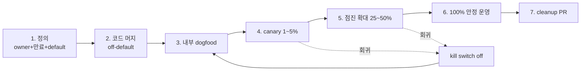

---

## 7. 체크리스트

- [ ] 배포 artifact와 테스트 artifact가 동일한 commit에서 생성되었는가
- [ ] deploy와 release가 분리되어 있는가
- [ ] 변경 위험도와 rollback 난이도가 PR 또는 release note에 적혀 있는가
- [ ] canary 또는 preview에서 핵심 flow가 검증되었는가
- [ ] 배포 후 볼 dashboard와 알림 조건이 준비되어 있는가
- [ ] rollback/flag off/cache purge 절차가 사전에 검증되었는가
- [ ] 배포 완료 후 owner가 30~60분 동안 release health를 확인하는가
- [ ] 임시 feature flag 제거 계획이 있는가

---

## 8. 제외한 벤더 종속 항목

공통 개발 가이드에는 특정 배포 플랫폼, 특정 progressive delivery 제품, 특정 feature flag SaaS, 특정 알림 도구, 특정 CDN/클라우드 명령을 표준으로 포함하지 않습니다. 이 문서에는 어떤 배포 시스템에서도 유지되어야 하는 사전 검증, 점진 노출, 롤백, 배포 후 관측 기준만 남깁니다.

---

## 실무 적용 가이드

### 언제 이 문서를 펼칠까

- 배포와 기능 공개가 같은 순간에 일어나 rollback이 어려울 때
- canary 지표 없이 전체 사용자에게 바로 노출할 때
- 장애 시 누가 어떤 순서로 되돌릴지 불명확할 때

### 적용 순서

1. deploy와 release를 feature flag로 분리한다.
2. preflight gate와 post-deploy smoke를 정한다.
3. canary 확대 기준과 중단 기준을 숫자로 둔다.
4. rollback artifact와 flag off 경로를 리허설한다.
5. release health를 배포 후 일정 시간 모니터링한다.

### 함께 두는 파일

- feature flag 정의와 사용처, fallback test를 feature 폴더에 둔다.
- release checklist와 rollback runbook은 서비스별 배포 문서에 둔다.
- 관측성 metric name은 기능/route와 연결한다.

### 흔한 실수

- 배포 성공을 기능 성공으로 착각한다.
- rollback artifact 없이 hotfix만 준비한다.
- flag off 후 UI 상태를 테스트하지 않는다.
- 배포 후 모니터링 기준이 없다.

### PR 완료 기준

- [ ] preflight와 post-deploy smoke가 있다.
- [ ] canary/rollback 기준이 있다.
- [ ] feature flag kill switch가 검증되었다.
- [ ] release health 결과가 남았다.

## 추천 항목 실행 우선순위 매핑

- `P1(7일 내)` — canary, flag, rollback artifact, release health 중 하나를 작은 변경 1건에 적용하고 증거(release note)를 남긴다.
- `P2(30일 내)` — 배포 절차 기준을 팀 템플릿, 체크리스트, CI 중 한 곳에 고정한다.
- `P3(90일 내)` — rollback 시간, canary error rate, release failure 수 추이를 보고 기준을 유지할지 조정할지 결정한다.
- `완료 기준` — 릴리스 오너가 증거와 철회 조건을 확인했다는 기록을 남긴다.

## 추천 항목 실행 체크리스트

- [ ] `1단계(7일)` : canary, flag, rollback artifact, release health 적용 대상을 1개로 좁힌다.
- [ ] `2단계(30일)` : 증거(release note, deployment log, rollback artifact, health dashboard)를 PR, ADR, 회고 중 한 곳에 연결한다.
- [ ] `3단계(60일)` : rollback 시간, canary error rate, release failure 수가 기준 안에 들어왔는지 확인한다.
- [ ] `문제 대응` : 미달성 사유와 다음 조치, 중단 여부를 같은 기록에 남긴다.

## 추천 항목 실행 운영 규칙

- `실행 게이트` : deploy와 release를 분리하고 rollback artifact를 먼저 확인한다.
- `승인 체계` : 릴리스 오너가 영향 범위와 rollback 담당자를 적용 전에 확인한다.
- `재개 조건` : canary health가 기준 안에 있으면 트래픽을 단계적으로 늘린다.
- `정지 조건` : rollback 경로가 없거나 health 지표가 비면 release를 멈춘다.
- `리스크 점수` : 트래픽 비중, 변경 파일 수, dependency 변경으로 산정한다.
- `리더 승인자` : 릴리스 매니저가 최종 승인 책임을 맡는다.
- `승인 역할` : 배포 절차 작성자, 검토자, 운영 확인자를 분리해 기록한다.
- `재평가 주기` : 배포 후 24시간 안에 release health를 회고한다.
