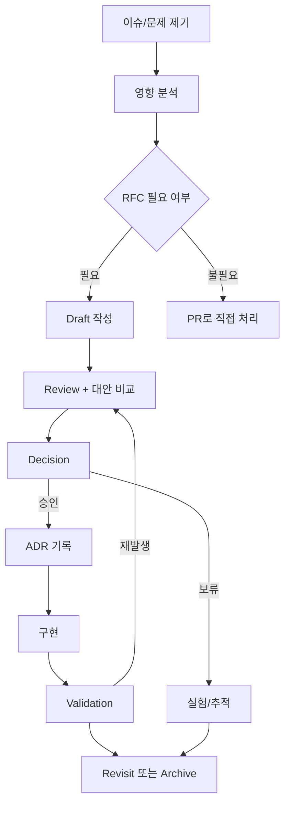

# 15. RFC 의사결정 프로세스

> **쉽게 읽기 안내**: 이 문서는 전문 용어가 많을 수 있어요.
> 이해가 어려우면 [공통 용어사전](./00_개발가이드_용어사전.md)에서 먼저 용어 뜻을 확인하고 본문을 이어서 읽으면 이해가 훨씬 빨라집니다.
> 특히 실무에서 자주 쓰이는 `배포`, `CI/CD`, `롤백`, `스키마`처럼 동작이 중요한 용어부터 먼저 익혀보세요.
## 0. 먼저 알고 가기 (30초 요약)

- 제안은 반대 주장까지 담아 기록해야 합의 비용이 줄어듭니다.
- 채택 기준, 반려 기준, 철회 기준을 문서 초기에 적어두세요.
- 나중에 추적할 수 있도록 결정 배경을 짧게라도 남기는 것이 핵심입니다.

## 초심자용 한눈에 보기

의사결정은 빠른 투표보다, 근거를 남기고 나중에 되돌릴 수 있는 형태로 만드는 것입니다.

### 핵심 용어 빠르게 정리

| 용어 | 쉬운 뜻 |
| --- | --- |
| `RFC` | 변경을 제안하고 논의하는 공식 문서 |
| `ADR` | 특정 기술/방식 채택 이유를 기록한 결정 문서 |
| `PoC` | 실제로 소규모로 검증해보는 실험 |
| `승인 조건` | 채택되기 위한 반드시 충족해야 할 근거 |
| `철회 조건` | 상황이 달라졌을 때 되돌릴 조건 |


| 분류 | 협업 & 표준화 | 상태 | Stable |
| :--- | :--- | :--- | :--- |
| **연관 가이드** | [04. 아키텍처](./04_아키텍처_설계_패턴.md), [14. 배포](./14_배포_프로세스_체크리스트.md), [16. 코드리뷰](./16_AI_협업_코드리뷰_가이드.md), [17. 온보딩](./17_신규_입사자_온보딩_가이드.md) | **도구 원칙** | 벤더 중립 |
| **핵심 테마** | RFC, ADR, 의사결정 기록, 표준 문서, 리뷰 cadence, 철회 조건 | **Update** | 최신 기준 |

---

> RFC 표준은 특정 협업 도구가 아니라 **중요한 결정을 충분한 맥락으로 검토하고, 승인된 결정을 이후에도 추적 가능한 기록으로 남기는 방식**입니다.

---


## 추천 항목 (실무 우선순위)

- **시작 추천**: 의사결정 문서는 목적·대안·영향·철회 조건 4요소를 기본 양식으로 고정하세요.
- **안정 추천**: 승인권자와 반려 기준을 미리 공개해 회의 시간을 줄입니다.
- **운영 추천**: 반영 후 결과를 ADR로 남겨 장기 검색성과 재검토를 쉽게 합니다.

## 문서 책임 범위

| 이 문서가 결정하는 것 | 단일 출처로 따르는 문서 |
| :--- | :--- |
| RFC 필요 조건, ADR 보존, 대안 비교, 철회 조건 | [04. 아키텍처](./04_아키텍처_설계_패턴.md), [14. 배포](./14_배포_프로세스_체크리스트.md) |
| 표준 문서의 owner, review cadence, deprecated/archive 처리 | [00. 종합 가이드](./00_종합_가이드_목차.md) |
| 리뷰와 merge 책임이 필요한 의사결정 기록 | [16. 코드리뷰](./16_AI_협업_코드리뷰_가이드.md) |
| AI decision support의 허용 범위와 검증 책임 | [18. AI 개발 워크플로우](./18_AI_개발_워크플로우_종합.md) |

---

## 0. 모든 프론트엔드 그룹 공통 Baseline

| 영역 | 공통 기준 | 산출물 |
| :--- | :--- | :--- |
| **RFC 필요 조건** | 아키텍처, 보안, 성능, 배포, 팀 간 계약, 장기 비용에 영향이 있으면 RFC 작성 | RFC 문서 |
| **ADR 기록** | 승인된 결정은 간결한 ADR로 보존 | ADR |
| **대안 비교** | 최소 2개 대안과 선택하지 않은 이유 기록 | trade-off 표 |
| **리스크** | blast radius, rollback, migration, 운영 비용 명시 | risk table |
| **검증** | PoC, benchmark, 테스트, 공식 문서 중 근거 제시 | evidence |
| **철회 조건** | 어떤 지표/상황이면 결정을 되돌릴지 명시 | rollback criteria |
| **검토 주기** | 표준 문서는 owner와 review cadence 보유 | maintenance plan |

### 0.0 RFC 운영 루프



### 0.1 교차 검증 매트릭스

| 권고 | 1차 출처 | 실행 증거 | 운영 증거 | 철회 조건 |
| :--- | :--- | :--- | :--- | :--- |
| RFC required decision | 아키텍처/보안/운영 영향 기준 | RFC checklist | decision churn, rework count | 작은 reversible 변경은 PR 기록으로 대체 |
| ADR 보존 | ADR/MADR 형식 | ADR 링크와 PR 연결 | onboarding/review 참조 빈도 | 결정 폐기 시 supersede ADR |
| AI decision support | [18. AI 워크플로우](./18_AI_개발_워크플로우_종합.md) 정책 | 근거 링크와 검증 결과 | 잘못된 결정 회고 | AI 단독 결정 금지 |

### 0.2 운영 게이트

| Gate | Evidence | Owner | Rollback |
| :--- | :--- | :--- | :--- |
| RFC intake | 영향 범위, 되돌림 난이도, 이해관계자 체크 | Decision owner | PR-only 변경으로 축소 |
| Decision evidence | 대안 비교, PoC, benchmark, 공식 근거 | RFC owner | 실험 단계로 되돌림 |
| ADR 보존 | ADR 링크, PR/RFC 연결, supersede 관계 | Architecture owner | 이전 ADR 유지 또는 supersede ADR 작성 |
| 표준 재검토 | owner, review date, 변경 이력 | Standards owner | deprecated/archive 처리 |

---


## 1. RFC가 필요한 경우

| RFC 필요 | RFC 불필요 |
| :--- | :--- |
| 프레임워크/상태관리/빌드 도구 교체 | 작은 컴포넌트 내부 리팩터 |
| API contract 또는 데이터 모델 변경 | 타입 이름 정리 |
| 배포/롤백 방식 변경 | 단일 테스트 추가 |
| 보안/개인정보 처리 방식 변경 | 문서 오탈자 수정 |
| 성능 예산 또는 캐시 전략 변경 | 로컬 개발 편의 스크립트 |
| 여러 팀의 ownership에 영향 | isolated bug fix |

RFC는 모든 변경을 느리게 만들기 위한 절차가 아닙니다. 되돌리기 어려운 결정을 빠르게 잘하기 위한 장치입니다.

---

## 2. RFC 라이프사이클

```text
problem
  -> draft
  -> review
  -> decision
  -> ADR
  -> implementation
  -> validation
  -> revisit or archive
```

| 단계 | 완료 조건 |
| :--- | :--- |
| Draft | 문제, 목표, 비목표, 대안, 영향 범위 초안 작성 |
| Review | owner와 reviewer가 질문/리스크를 남김 |
| Decision | 승인, 보류, 기각, 실험 중 하나로 결정 |
| ADR | 최종 결정과 근거를 짧게 기록 |
| Implementation | 작업이 RFC 링크를 참조하고 범위를 벗어나지 않음 |
| Validation | 성공 지표와 철회 조건 확인 |

---

## 3. RFC 템플릿

```markdown
# RFC: 제목

## Status
Draft / In Review / Approved / Rejected / Superseded

## Context
- 어떤 문제를 해결하는가
- 현재 방식의 한계
- 영향을 받는 팀/서비스/사용자

## Goals
- 성공 조건

## Non-goals
- 이번 결정에서 다루지 않는 것

## Proposal
- 선택안 설명
- 아키텍처/흐름/계약 변경

## Alternatives
| Alternative | Pros | Cons | Why not |
| :--- | :--- | :--- | :--- |

## Risks
| Risk | Impact | Mitigation |
| :--- | :--- | :--- |

## Rollback / Exit Criteria
- 어떤 상황이면 중단하거나 되돌리는가

## Validation
- PoC, benchmark, test, 공식 문서, 운영 지표

## Decision
- 결정 내용
- decision maker
- date
```

---

## 4. ADR 템플릿

```markdown
# ADR-0000: 결정 제목

## Status
Accepted / Deprecated / Superseded

## Context
결정이 필요했던 배경

## Decision
우리가 선택한 것

## Consequences
좋아지는 점, 나빠지는 점, 운영 부담

## Confirmation
결정이 유효한지 확인할 지표나 테스트

## Links
- RFC:
- PR:
- Follow-up:
```

ADR은 RFC보다 짧아야 합니다. 이후 온보딩과 코드리뷰에서 빠르게 읽을 수 있어야 합니다.

---

## 5. 의사결정 원칙

| 원칙 | 기준 |
| :--- | :--- |
| Reversibility | 되돌리기 쉬운 결정은 가볍게, 어려운 결정은 신중하게 |
| Evidence | 선호보다 테스트, 공식 문서, 운영 지표를 우선 |
| Ownership | 결정 owner와 유지보수 owner를 분리하지 않음 |
| Timebox | 논의 기간과 결정일을 정함 |
| Dissent | 반대 의견과 선택하지 않은 이유를 기록 |
| Review | 결정이 낡으면 폐기하거나 대체 |

---

## 6. 표준 문서 분류

| 문서 | 목적 | 예시 |
| :--- | :--- | :--- |
| Guide | 학습과 권장 패턴 | TypeScript, React, 성능 |
| Standard | 반드시 지켜야 하는 기준 | CI gate, 배포 승인, 접근성 |
| Checklist | 반복 작업 확인 | 배포, 장애 대응 |
| Runbook | 장애/운영 절차 | rollback, cache purge |
| RFC | 결정 전 논의 | 상태관리 교체 |
| ADR | 승인된 결정 기록 | 채택한 아키텍처 |
| Postmortem | 사고 후 학습 | 장애 원인과 재발 방지 |

문서 유형이 섞이면 읽는 사람이 "권장"과 "필수"를 구분하기 어렵습니다.

---

## 7. AI 활용 기준

AI는 RFC 초안 작성, 대안 발굴, 리스크 체크리스트 생성, ADR 요약에 사용할 수 있습니다. 단, AI가 결정권자가 되어서는 안 됩니다.

- 공식 문서와 실제 코드 근거 없이 AI 답변만으로 승인하지 않습니다.
- 민감 회의록, 고객 데이터, 내부 URL, secret은 AI에 전달하지 않습니다.
- AI가 제안한 대안은 owner가 비용, 보안, 운영 영향 기준으로 검증합니다.
- 최종 결정에는 사람 decision maker를 기록합니다.

---

## 8. 체크리스트

- [ ] RFC 필요 조건에 해당하는 변경이 문서 없이 진행되지 않는가
- [ ] 대안과 선택하지 않은 이유가 기록되어 있는가
- [ ] rollback 또는 exit criteria가 있는가
- [ ] 승인된 RFC가 ADR로 전환되는가
- [ ] RFC/ADR 링크가 구현 PR과 연결되어 있는가
- [ ] 표준 문서 owner와 review cadence가 있는가
- [ ] 폐기된 결정이 archive/superseded 상태로 정리되는가

---

## 9. 제외한 벤더 종속 항목

공통 개발 가이드에는 특정 issue tracker, wiki, 문서 SaaS, 회의록 도구, AI 에이전트 제품의 워크플로우를 표준으로 포함하지 않습니다. 이 문서에는 어떤 협업 도구에서도 구현 가능한 RFC/ADR 구조, 검토 원칙, 문서 분류, 유지보수 기준만 남깁니다.

---

## 실무 적용 가이드

### 언제 이 문서를 펼칠까

- 되돌리기 어려운 기술 선택이나 구조 변경을 하려 할 때
- 리뷰에서 같은 논쟁이 반복될 때
- 실험을 언제 채택하거나 폐기할지 기준이 없을 때

### 적용 순서

1. 문제, 목표, non-goal을 한 문단씩 쓴다.
2. 대안 2개 이상과 선택하지 않는 이유를 적는다.
3. 비용, 위험, 보안/성능/접근성 영향을 분리한다.
4. 검증 방법과 exit criteria를 숫자 또는 명령으로 둔다.
5. 결정 후 ADR로 요약하고 후속 action을 연결한다.

### 함께 두는 파일

- 기능 RFC는 관련 feature 문서나 issue와 링크한다.
- 아키텍처 ADR은 코드 boundary와 package owner 가까이에 둔다.
- PoC 코드는 폐기/승격 경로가 보이는 별도 폴더에 둔다.

### 흔한 실수

- 이미 정한 결론을 포장하기 위해 RFC를 쓴다.
- 대안과 철회 조건이 없다.
- 실험 결과 없이 표준으로 승격한다.
- ADR을 남기지 않아 같은 논쟁이 반복된다.

### PR 완료 기준

- [ ] 대안, 위험, 검증, 철회 조건이 있다.
- [ ] owner와 due date가 있다.
- [ ] 후속 PR/issue가 연결되어 있다.
- [ ] 결정 상태가 accepted/deferred/superseded로 명확하다.
