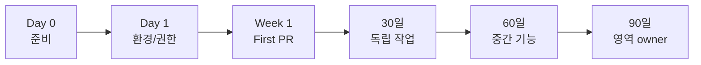
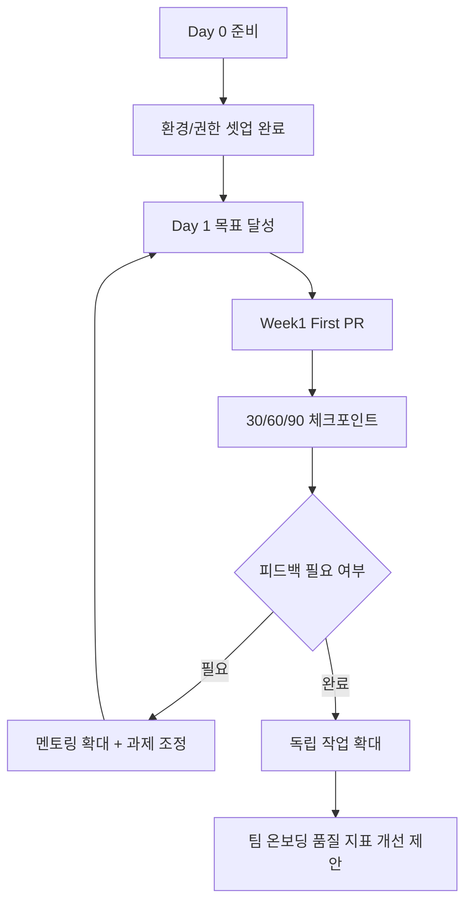
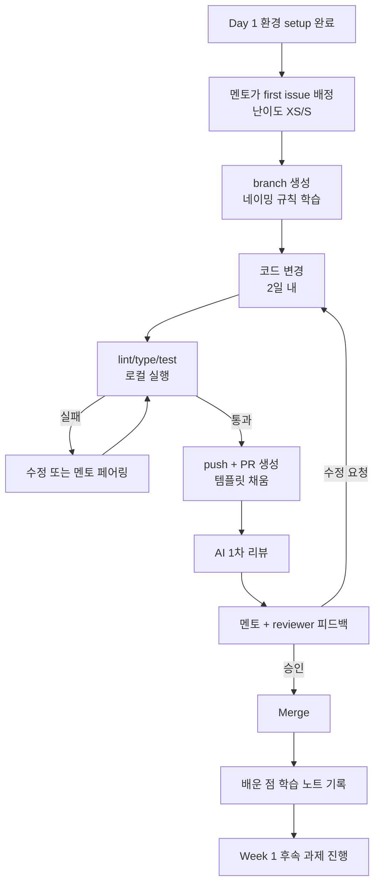
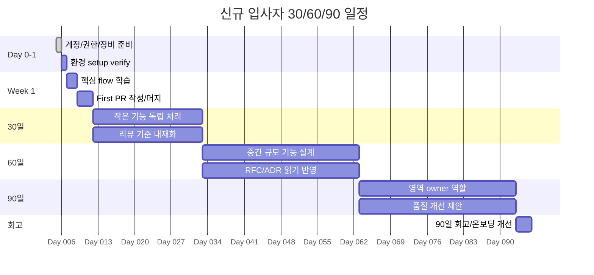
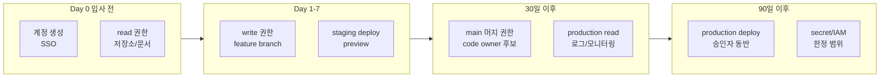
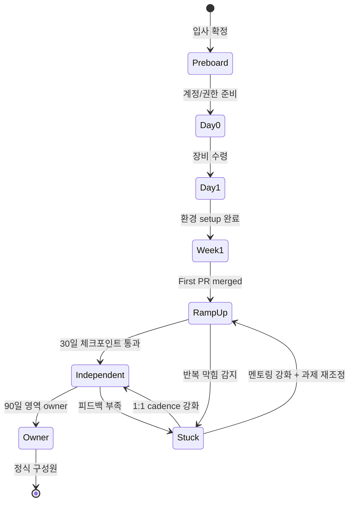
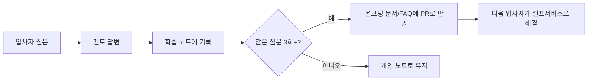

# 17. 신규 입사자 온보딩 가이드

## 0. 먼저 알고 가기 (30초 요약)

- 환경 설정을 끝내고, 본인 코드 소유권/권한을 정리한 뒤 첫 PR로 시작하세요.
- 초반엔 큰 변화보다 팀 규칙을 복제해 적용하는 것이 중요합니다.
- 매일 짧은 피드백으로 질문을 규칙으로 바꾸는 흐름을 유지하세요.

> **왜 중요한가**: 첫 2주의 경험이 입사자의 이후 6개월 기여 속도를 결정합니다. 단순 환영 행사가 아니라 "팀의 품질 기준을 손으로 익히는 시기"입니다.
>
> **일상 비유**: 새 직장의 사물함, 출입증, 매뉴얼, 첫 거래처 인사를 준비된 매뉴얼로 받느냐, 매번 물어가며 찾느냐가 첫 달의 만족도를 가르는 것과 같습니다.

## 초심자용 한눈에 보기

입사는 "설정 완료 + 첫 PR + 피드백 루프"의 3단계로 진행하면 실패 확률이 내려갑니다.



### 핵심 용어 빠르게 정리

| 용어          | 쉬운 뜻                                           |
| ------------- | ------------------------------------------------- |
| `Day 0`       | 입사 첫날 환경/권한을 정리하는 단계               |
| `first PR`    | 팀 규칙을 따라 첫 번째로 병합되는 PR              |
| `멘토링`      | 질문에 대한 즉시 답보다 방법을 같이 정리하는 지원 |
| `피드백 루프` | 피드백을 받아 기준을 빠르게 고치는 반복           |
| `30/60/90`    | 입사 후 목표 정렬을 위한 기간별 체크 포인트       |

| 분류            | 협업 & 성장                                                                                                                     | 상태          | Stable    |
| :-------------- | :------------------------------------------------------------------------------------------------------------------------------ | :------------ | :-------- |
| **연관 가이드** | [00. 목차](./00_종합_가이드_목차.md), [15. RFC](./15_RFC_의사결정_프로세스.md), [16. 코드리뷰](./16_AI_협업_코드리뷰_가이드.md) | **도구 원칙** | 벤더 중립 |
| **핵심 테마**   | 개발 환경, 권한, 첫 PR, 멘토링, 30/60/90 기대치, AI 사용 정책                                                                   | **Update**    | 최신 기준 |

---

> 온보딩 표준은 특정 협업 도구 초대 절차가 아니라 **신규 구성원이 안전하게 개발 환경을 만들고, 첫 기여를 하며, 팀의 품질 기준을 빠르게 이해하도록 돕는 시스템**입니다.

---

## 추천 항목 (실무 우선순위)

- **시작 추천**: Day0에 계정·접근권한·필수 도구를 하루 내 완료해 첫 주 활동을 지연 없이 시작하세요.
- **안정 추천**: 첫 PR까지 팀의 `공통 PR 기준`을 그대로 따라가고 피드백은 짧은 주기로 받습니다.
- **운영 추천**: 30/60/90 체크리스트는 팀 목표와 연동해 주기적으로 갱신하세요.

## 추천 항목 고도화 체크

- `첫 적용` — 개발 환경, 권한, 첫 PR, 멘토링 루프 중 하나를 실제 PR이나 운영 이슈에 붙이고, 변경 전 기준을 먼저 적는다.
- `증거 정리` — setup log, first PR, access checklist, 멘토 피드백를 같은 작업 기록에 남긴다.
- `재점검` — setup 소요 시간, 첫 PR lead time, 막힌 항목 수가 나아졌는지 30일 안에 확인하고 기준을 유지, 수정, 폐기 중 하나로 판정한다.

## 추천 항목 실행 기록 템플릿

- `작업` : 개발 환경, 권한, 첫 PR, 멘토링 루프 적용 범위를 어느 화면, 패키지, 문서에 둘지 적는다.
- `증거` : setup log, first PR, access checklist, 멘토 피드백 중 실제로 남긴 항목만 링크한다.
- `판정` : 유지/수정/폐기 중 하나와 이유를 한 문장으로 남긴다.
- `다음 점검` : setup 소요 시간, 첫 PR lead time, 막힌 항목 수를 다시 볼 날짜와 담당자를 지정한다.

## 문서 책임 범위

| 이 문서가 결정하는 것                              | 단일 출처로 따르는 문서                                                                      |
| :------------------------------------------------- | :------------------------------------------------------------------------------------------- |
| Day 0/Day 1/Week 1/30-60-90 onboarding 목표와 증적 | [00. 종합 가이드](./00_종합_가이드_목차.md), [16. 코드리뷰](./16_AI_협업_코드리뷰_가이드.md) |
| 개발 환경, 권한, 첫 PR, 멘토링 기준                | [10. 인프라](./10_인프라_IaC_가이드.md), [11. CI/CD](./11_CICD_파이프라인_표준.md)           |
| RFC/ADR와 팀 의사결정 학습 경로                    | [15. RFC](./15_RFC_의사결정_프로세스.md)                                                     |
| 신규 구성원의 AI 사용 정책과 검증 책임             | [18. AI 개발 워크플로우](./18_AI_개발_워크플로우_종합.md)                                    |

---

## 0. 모든 프론트엔드 그룹 공통 Baseline

| 영역          | 공통 기준                                         | 산출물            |
| :------------ | :------------------------------------------------ | :---------------- |
| **개발 환경** | 한 문서 또는 한 명령으로 로컬/원격 개발 환경 준비 | setup guide       |
| **권한**      | 최소 권한, 역할별 승인, 만료/회수 절차            | access checklist  |
| **첫 과제**   | 1~2일 안에 완료 가능한 first issue                | first PR          |
| **멘토링**    | 사람 멘토와 문서/AI 보조 채널 분리                | mentor plan       |
| **품질 기준** | 테스트, 리뷰, 배포, 접근성, 보안 기준 학습        | learning path     |
| **AI 정책**   | 민감정보, 코드 반출, 검증 책임 기준 명시          | AI usage policy   |
| **30/60/90**  | 기간별 기대 결과와 피드백 cadence 정의            | growth checkpoint |

### 0.0 온보딩 여정 한눈에 보기



### 0.1 교차 검증 매트릭스

| 권고             | 1차 출처                     | 실행 증거                  | 운영 증거            | 철회 조건                                  |
| :--------------- | :--------------------------- | :------------------------- | :------------------- | :----------------------------------------- |
| 개발 환경 자동화 | repo README와 toolchain 파일 | setup verification command | onboarding lead time | 반복 실패 항목은 setup 문서 수정           |
| 최소 권한        | 보안/권한 운영 기준          | access checklist           | 권한 누락/과다 이슈  | 임시 권한은 만료 없으면 금지               |
| First PR         | 코드리뷰/품질 표준           | first PR template          | time-to-first-PR     | 과제가 너무 크면 onboarding backlog 재분류 |

### 0.2 운영 게이트

| Gate                | Evidence                                   | Owner            | Rollback                              |
| :------------------ | :----------------------------------------- | :--------------- | :------------------------------------ |
| Day 0 readiness     | 계정, 권한, 장비, 문서, 첫 과제 체크리스트 | Manager          | 첫 과제 시작 보류 또는 임시 접근 제한 |
| Setup verification  | install/test/dev command 성공 기록         | Onboarding owner | setup guide 수정과 blocker 재검증     |
| First PR            | PR template, test result, review 기록      | Mentor           | 더 작은 issue로 재배정                |
| 30/60/90 checkpoint | checkpoint note, feedback, 다음 목표       | Manager/Mentor   | 기대치와 학습 경로 재조정             |

---

## 1. Day 0 준비

신규 멤버가 오기 전에 팀이 준비해야 할 항목입니다.

| 항목      | 기준                                               |
| :-------- | :------------------------------------------------- |
| 계정      | 필요한 시스템 목록, owner, 승인자                  |
| 권한      | read/write/admin 권한 분리, 임시 권한 만료일       |
| 장비/환경 | OS, 런타임, IDE, 패키지 매니저, 인증서             |
| 문서      | README, architecture map, runbook, coding standard |
| 첫 과제   | 난이도 낮고 테스트/리뷰를 경험할 수 있는 작업      |
| 멘토      | 기술 멘토, 도메인 멘토, 매니저 역할 분리           |

---

## 2. Day 1 목표

Day 1의 성공 기준은 "많은 정보를 전달했다"가 아니라 "스스로 검증 가능한 개발 루프를 만들었다"입니다.

| 목표        | 완료 기준                                     |
| :---------- | :-------------------------------------------- |
| 저장소 이해 | 주요 app/package, ownership, 실행 명령 파악   |
| 개발 환경   | install, test, dev server 또는 storybook 실행 |
| 품질 게이트 | lint/type/unit test 하나 이상 직접 실행       |
| 제품 흐름   | 핵심 사용자 flow를 staging/preview에서 확인   |
| 질문 경로   | 어디에 어떤 질문을 올릴지 파악                |

---

## 3. Week 1 목표

> **왜 중요한가**: 첫 PR을 너무 늦게 시작하면 환경 셋업 단계의 사소한 막힘을 발견하지 못하고, 너무 일찍 큰 일을 맡기면 리뷰 부담만 늘어납니다.

| 목표          | 완료 기준                                     |
| :------------ | :-------------------------------------------- |
| First PR      | 작은 변경을 작성하고 코드리뷰를 받음          |
| 테스트 작성   | 변경에 맞는 unit/integration/e2e 중 하나 추가 |
| 코드리뷰 참여 | 다른 PR에 question 또는 suggestion 남김       |
| 도메인 학습   | 핵심 용어와 주요 API 흐름 설명 가능           |
| 운영 이해     | 배포와 장애 대응 runbook 위치 파악            |

첫 PR은 생산성 평가가 아니라 팀의 개발 루프를 체험하는 과제입니다.

### 3.1 첫 PR까지의 흐름



비유: 자전거 보조바퀴와 같습니다. 첫 PR은 멘토가 옆에서 손잡이를 잡아주는 시간이지, 시속 30km로 달리는 시험이 아닙니다.

---

## 4. 30/60/90 기대치

> **왜 중요한가**: 기대치가 입사자 머릿속에만 있으면 매니저와의 평가 기준이 어긋나고, 첫 평가 시점에 동상이몽이 됩니다.

| 시점 | 기대 결과                                                  |
| :--- | :--------------------------------------------------------- |
| 30일 | 작은 기능/버그를 독립적으로 처리, 테스트와 리뷰 기준 이해  |
| 60일 | 중간 규모 기능을 설계부터 배포까지 수행, RFC/ADR 읽고 반영 |
| 90일 | 도메인 영역 하나의 owner 역할 수행, 품질 개선 제안 가능    |

기대치는 직무 레벨에 따라 조정하되, 기준과 피드백 주기는 사전에 공유합니다.

### 4.1 30/60/90 타임라인 (gantt)



### 4.2 권한 부여 단계별 흐름



비유: 운전면허 단계와 같습니다. 학원(read), 임시 면허(write+staging), 정식 면허(main 머지), 영업용 면허(production)로 점진적으로 확장합니다.

---

## 5. 개발 환경 표준

| 항목            | 기준                                 |
| :-------------- | :----------------------------------- |
| Runtime         | 버전 파일로 고정                     |
| Package manager | lockfile 기반 설치                   |
| Env             | 예제 파일과 필수/선택 변수 설명      |
| Seed data       | 민감정보 없는 샘플 데이터            |
| Troubleshooting | 자주 깨지는 설치/권한/포트 문제 해결 |
| Verification    | setup 완료를 확인하는 명령 제공      |

```bash
install
typecheck
test
dev
```

위 명령은 실제 팀의 스크립트명으로 바꾸되, 온보딩 문서에는 "무엇을 검증하는 명령인지"를 함께 적습니다.

---

## 6. 권한 관리

| 원칙      | 기준                                            |
| :-------- | :---------------------------------------------- |
| 최소 권한 | 첫 주에는 read 중심, write/admin은 필요 시 부여 |
| 역할 기반 | 개인 예외보다 역할/그룹 기반 권한               |
| 만료      | 임시 권한은 만료일 필수                         |
| 감사      | 민감 시스템 접근은 승인 이력 보관               |
| 회수      | 이동/퇴사/역할 변경 시 체크리스트 기반 회수     |

신규 멤버가 작업을 못 할 정도로 권한을 늦게 주는 것도 문제지만, production 권한을 초기에 넓게 주는 것은 더 큰 위험입니다.

---

## 7. AI 사용 정책

| 허용                       | 금지                             |
| :------------------------- | :------------------------------- |
| 공개 API 문서 요약         | secret, token, cookie 공유       |
| 테스트 케이스 초안 생성    | 고객 데이터 원문 입력            |
| 코드 설명 요청             | 내부 URL/인프라 정보 무분별 공유 |
| PR 설명 초안               | 검증 없이 AI 코드 merge          |
| 에러 메시지 익명화 후 분석 | 민감 로그 원문 전송              |

AI가 답한 내용은 공식 문서, 로컬 실행, 테스트 중 하나로 검증해야 합니다.

---

## 8. 멘토링 운영

> **왜 중요한가**: 멘토가 한 명에게 모든 부담이 쏠리면 멘토도 입사자도 지칩니다. 역할을 분리해 한 사람당 시간 부담을 작게 만들어야 지속됩니다.

| 역할        | 책임                                       |
| :---------- | :----------------------------------------- |
| 기술 멘토   | 코드베이스, 테스트, 리뷰, 배포 루프 지원   |
| 도메인 멘토 | 제품 용어, 사용자 흐름, 비즈니스 규칙 설명 |
| 매니저      | 기대치, 우선순위, 피드백 cadence 관리      |
| 신규 멤버   | 질문 기록, 학습 메모, 막힌 지점 공유       |

멘토링은 질문을 대신 해결해 주는 것이 아니라, 다음에 스스로 해결할 수 있는 경로를 알려주는 것입니다.

### 8.1 온보딩 상태 다이어그램



### 8.2 질문 → 규칙 변환 루프



비유: 도서관 사서가 자주 받는 질문은 안내판으로 만들어 두는 것과 같습니다. 같은 답을 100번 하지 않도록 시스템화합니다.

---

## 9. 온보딩 체크리스트

- [ ] 개발 환경 setup 문서가 최신인가
- [ ] 신규 멤버가 첫날 품질 게이트를 직접 실행했는가
- [ ] first issue와 reviewer가 사전에 지정되어 있는가
- [ ] 권한 목록과 만료/회수 절차가 있는가
- [ ] AI 사용 정책과 민감정보 기준을 설명했는가
- [ ] 30/60/90 기대치와 피드백 일정이 공유되었는가
- [ ] 신규 멤버가 개선해야 할 온보딩 문서를 PR로 제안할 수 있는가

---

## 10. 제외한 벤더 종속 항목

공통 개발 가이드에는 특정 원격 IDE, 특정 메신저, 특정 문서 도구, 특정 AI 코딩 도구, 특정 계정 자동화 workflow를 표준으로 포함하지 않습니다. 이 문서에는 어떤 회사와 도구에서도 적용 가능한 환경 준비, 권한, 첫 PR, 멘토링, 성장 체크포인트, AI 사용 정책만 남깁니다.

---

## 11. 로컬 품질 도구 온보딩

신규 구성원은 첫 PR 전에 품질 게이트를 "왜 실패하는지"까지 이해해야 합니다.

### 11.1 첫날 확인 명령

```bash
pnpm install --frozen-lockfile
pnpm exec husky init
pnpm exec commitlint --from=HEAD~1 --to=HEAD --verbose
pnpm exec secretlint "**/*"
pnpm test
```

- `husky init`으로 `.husky/pre-commit`과 `prepare` script가 만들어지는지 확인합니다.
- commitlint 실패 예시를 한 번 실행해 conventional commit type/scope/subject 규칙을 익힙니다.
- secretlint는 fixture나 문서 예시에서 false positive가 생길 수 있으므로 `.secretlintignore`와 허용 절차를 함께 설명합니다.
- MSW handler가 어디에 있고 local dev, unit/integration test, Storybook에서 어떻게 공유되는지 첫 PR에서 확인합니다.

### 11.2 첫 PR 리뷰 훈련

- CodeRabbit 같은 AI 리뷰 도구가 있다면 `.coderabbit.yaml`의 path instruction과 실제 comment를 함께 읽습니다.
- AI finding은 그대로 반영하지 않고 accept/reject/follow-up으로 분류합니다.
- `TODO`, `FIXME`, `eslint-disable` 주석이 필요한 경우 owner, issue, 제거 조건을 남기는 연습을 합니다.

---

## 실무 적용 가이드

### 언제 이 문서를 펼칠까

- 새 구성원이 환경 설정과 첫 PR에서 오래 막힐 때
- 권한, 보안, 배포 책임이 구두로만 전달될 때
- 도메인 학습 순서가 없어 질문이 반복될 때

### 적용 순서

1. Day 0에 계정, 권한, devcontainer/local setup을 준비한다.
2. Day 1에는 앱 실행, 테스트 실행, 문서 위치 찾기를 완료한다.
3. Week 1에는 작은 버그 수정 또는 문서 PR을 merge한다.
4. 30/60/90 목표를 코드, 운영, 도메인 이해로 나눈다.
5. 멘토링 질문과 막힌 지점을 문서 개선 backlog로 연결한다.

### 함께 두는 파일

- 온보딩 체크리스트와 setup script는 repository 루트에 둔다.
- 도메인별 학습 문서는 해당 feature/package README에 둔다.
- 첫 PR 예제는 실제 기능 폴더와 연결한다.

### 흔한 실수

- 권한을 너무 넓게 먼저 준다.
- 설정 실패를 개인 문제로 보고 자동화하지 않는다.
- AI 사용 정책과 데이터 반출 기준을 나중에 알려준다.
- 첫 PR 범위가 너무 커서 리뷰 학습이 어렵다.

### PR 완료 기준

- [ ] 환경 설정이 재현 가능하다.
- [ ] 권한과 보안 교육 증거가 있다.
- [ ] 첫 PR이 작은 범위로 완료되었다.
- [ ] 30/60/90 피드백이 문서 개선으로 이어졌다.

## 추천 항목 실행 우선순위 매핑

- `P1(7일 내)` — 개발 환경, 권한, 첫 PR, 멘토링 루프 중 하나를 작은 변경 1건에 적용하고 증거(setup log)를 남긴다.
- `P2(30일 내)` — 온보딩 기준을 팀 템플릿, 체크리스트, CI 중 한 곳에 고정한다.
- `P3(90일 내)` — setup 소요 시간, 첫 PR lead time, 막힌 항목 수 추이를 보고 기준을 유지할지 조정할지 결정한다.
- `완료 기준` — 온보딩 오너가 증거와 철회 조건을 확인했다는 기록을 남긴다.

## 추천 항목 실행 체크리스트

- [ ] `1단계(7일)` : 개발 환경, 권한, 첫 PR, 멘토링 루프 적용 대상을 1개로 좁힌다.
- [ ] `2단계(30일)` : 증거(setup log, first PR, access checklist, 멘토 피드백)를 PR, ADR, 회고 중 한 곳에 연결한다.
- [ ] `3단계(60일)` : setup 소요 시간, 첫 PR lead time, 막힌 항목 수가 기준 안에 들어왔는지 확인한다.
- [ ] `문제 대응` : 미달성 사유와 다음 조치, 중단 여부를 같은 기록에 남긴다.

## 추천 항목 실행 운영 규칙

- `실행 게이트` : 권한과 로컬 품질 도구가 같은 날에 확인됐는지 본다.
- `승인 체계` : 온보딩 오너가 영향 범위와 rollback 담당자를 적용 전에 확인한다.
- `재개 조건` : 첫 PR이 검증 게이트를 통과하면 다음 업무 범위를 넓힌다.
- `정지 조건` : 권한 누락이나 로컬 검증 실패가 반복되면 문서와 템플릿을 고친다.
- `리스크 점수` : 권한 범위, 미완료 setup, 멘토 부재로 산정한다.
- `리더 승인자` : 팀 리드/멘토가 최종 승인 책임을 맡는다.
- `승인 역할` : 온보딩 작성자, 검토자, 운영 확인자를 분리해 기록한다.
- `재평가 주기` : 30/60/90일 회고 때 체크리스트를 갱신한다.
