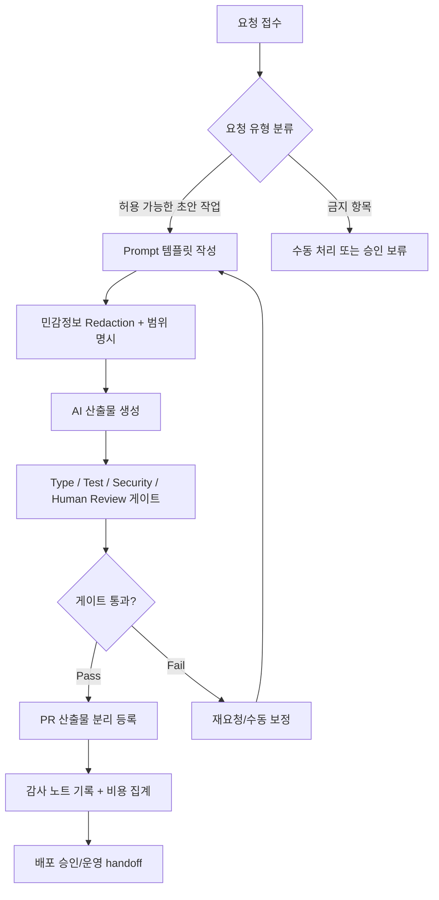

# 18. AI 개발 워크플로우 종합

> **쉽게 읽기 안내**: 이 문서는 전문 용어가 많을 수 있어요.
> 이해가 어려우면 [공통 용어사전](./00_개발가이드_용어사전.md)에서 먼저 용어 뜻을 확인하고 본문을 이어서 읽으면 이해가 훨씬 빨라집니다.
> 특히 실무에서 자주 쓰이는 `배포`, `CI/CD`, `롤백`, `스키마`처럼 동작이 중요한 용어부터 먼저 익혀보세요.
## 0. 먼저 알고 가기 (30초 요약)

- AI 워크플로우는 `요구사항 정리 -> 생성 -> 검증 -> 반영`의 4단계 루프입니다.
- 중요한 입력은 문맥/제약/기술 결정이므로 정확히 전달하세요.
- 마지막 검증(테스트, 리뷰, 보안)은 반드시 사람의 승인 게이트로 처리하세요.

## 초심자용 한눈에 보기

AI를 쓸 때 가장 중요한 건 “문맥을 관리하고, 결과를 검증”하는 체계입니다.

### 핵심 용어 빠르게 정리

| 용어 | 쉬운 뜻 |
| --- | --- |
| `프로젝트 문맥` | 과거 이슈/결정/제약을 요약해 AI에게 전달하는 정보 |
| `근거 기반` | 제안이 공식 문서/테스트/로그로 뒷받침되는지 여부 |
| `human-in-the-loop` | 사람 검토를 마지막에 반드시 거치는 절차 |
| `에이전트` | 특정 역할(요약, 생성, 정리)로 쪼갠 AI 수행 단위 |
| `권한 경계` | AI가 접근할 수 없는 민감 영역을 분리하는 규칙 |


| 분류 | AI 협업 & 생산성 | 상태 | Stable |
| :--- | :--- | :--- | :--- |
| **연관 가이드** | [07. 테스팅](./07_테스팅_가이드.md), [11. CI/CD](./11_CICD_파이프라인_표준.md), [15. RFC](./15_RFC_의사결정_프로세스.md), [16. 코드리뷰](./16_AI_협업_코드리뷰_가이드.md) | **도구 원칙** | 벤더 중립 |
| **핵심 테마** | AI 사용 정책, 컨텍스트 관리, 검증 책임, 보안, 비용, 자동화 경계 | **Update** | 최신 기준 |

---

> AI 개발 워크플로우 표준은 특정 코딩 에이전트 제품 사용법이 아니라 **AI가 만든 결과를 안전하게 검증하고, 민감정보를 보호하며, 사람의 책임을 유지하는 개발 운영 체계**입니다.

---


## 추천 항목 (실무 우선순위)

- **시작 추천**: 작업 의도/제한사항/성공 기준을 3문장으로 정리한 뒤에만 AI 입력을 전달하세요.
- **안정 추천**: 민감정보 redaction과 감사 로그를 고정 규칙으로 자동 검사합니다.
- **운영 추천**: AI 출력은 사람이 최종 승인 후 반영하고, 반려 사유는 템플릿에 기록하세요.


## 추천 항목 고도화 체크

- `즉시 적용` — 추천 항목 1개를 이번 주 내에 실제 작업 1건에 반영한다.
- `1주 내 정리` — 적용 결과를 PR 본문이나 회고 노트에 간단히 기록한다.
- `1개월 내 점검` — 재작업률/리뷰 충돌/배포 이슈 중 적어도 한 항목이 개선되었는지 확인한다.


## 추천 항목 실행 기록 템플릿

- `담당자` : 항목 적용 주체(문서 오너/팀원)를 명시
- `적용일` : 실제 반영된 날짜 및 작업 ID를 남김
- `측정 지표` : 리뷰 충돌/재작업/버그 재발 중 1개 이상 수치로 기록
- `보류 사유` : 적용을 못한 경우 이유를 1줄 기록하고 다음 액션을 지정

## 문서 책임 범위

| 이 문서가 결정하는 것 | 단일 출처로 따르는 문서 |
| :--- | :--- |
| AI 사용 정책, 허용/금지 데이터, redaction, 검증 책임 | [06. 보안](./06_웹_보안_심화_가이드.md), [16. 코드리뷰](./16_AI_협업_코드리뷰_가이드.md) |
| AI 산출물을 type/test/build/review gate에 연결하는 기준 | [07. 테스팅](./07_테스팅_가이드.md), [11. CI/CD](./11_CICD_파이프라인_표준.md) |
| AI가 RFC/ADR/incident/postmortem에 관여할 때의 기록 기준 | [15. RFC](./15_RFC_의사결정_프로세스.md), [09. 관측성](./09_장애_대응_및_관측성_표준.md) |
| 도메인별 AI 보조 시나리오의 최종 승인 기준 | 각 도메인 문서 01-26 |

---

## 0. 모든 프론트엔드 그룹 공통 Baseline

| 영역 | 공통 기준 | 증적 |
| :--- | :--- | :--- |
| **사용 정책** | 허용/금지 데이터와 작업 유형을 문서화 | AI usage policy |
| **컨텍스트** | 필요한 파일, 요구사항, 제약, 검증 명령을 명확히 제공 | prompt template |
| **검증** | AI 산출물은 type/test/build/review 중 하나 이상 통과 | CI report |
| **보안** | secret, 고객 데이터, 내부 URL, 비공개 로그 원문 전송 금지 | redaction checklist |
| **책임** | AI는 reviewer/approver가 될 수 없음 | human approval |
| **비용** | 자동화 호출량, 모델 등급, 실패 재시도 비용 추적 | usage report |
| **감사** | 중요한 AI 사용은 PR/RFC/incident에 근거와 검증 결과 기록 | audit note |

### 0.0 AI 워크플로우 운영 파이프라인



### 0.1 교차 검증 매트릭스

| 권고 | 1차 출처 | 실행 증거 | 운영 증거 | 철회 조건 |
| :--- | :--- | :--- | :--- | :--- |
| AI 사용 정책 | 도구 약관, 데이터 보존/학습 정책 | redaction checklist | policy violation count | 민감정보 처리 불명확 도구는 사용 금지 |
| AI 산출물 검증 | repo 품질 게이트 | type/test/build/review report | AI-induced defect rate | 검증 명령 없는 자동 수정 금지 |
| 비용 통제 | usage/export 기능 | monthly usage report | cost per merged PR | 예산 초과 시 자동 호출 범위 축소 |

### 0.2 운영 게이트

| Gate | Evidence | Owner | Rollback |
| :--- | :--- | :--- | :--- |
| AI 사용 정책 | 허용/금지 데이터, 작업 유형, 사용자 확인 기록 | Team lead | 도구 사용 중지 또는 scope 축소 |
| Redaction | 민감정보 제거 체크리스트, 샘플 로그 검토 | Requester | AI 제출 차단과 입력 재작성 |
| Output verification | type/test/build/review report, diff 검토 | Author | AI 산출물 폐기 또는 수동 재작성 |
| Cost/audit | usage report, audit note, 자동화 호출량 | Workflow owner | 자동 호출 비활성화 또는 저위험 작업으로 제한 |

---


## 1. AI에 맡겨도 되는 작업

| 작업 | 기준 |
| :--- | :--- |
| 코드 설명 | 공개 가능한 코드와 문맥만 제공 |
| 테스트 초안 | 사람이 edge case와 assertion을 검토 |
| 리팩터 후보 | 동작 보존 테스트가 있을 때 진행 |
| 문서 초안 | 공식 출처와 실제 코드로 검증 |
| 오류 분석 | 민감 로그를 익명화/요약한 뒤 사용 |
| 반복 작업 자동화 | 실패 시 되돌릴 수 있는 범위부터 시작 |

---

## 2. AI에 맡기면 안 되는 작업

| 작업 | 이유 |
| :--- | :--- |
| 비밀키/토큰이 포함된 디버깅 | 유출 위험 |
| 고객 데이터 원문 분석 | 개인정보/계약 위반 위험 |
| production 변경 단독 실행 | 책임과 승인 부재 |
| 보안 예외 승인 | 사람 decision maker 필요 |
| 법적/규제 판단 확정 | 전문가 검토 필요 |
| 테스트 없이 대규모 코드 변경 | 회귀 위험 |

---

## 3. Prompt 표준

```markdown
## Goal
무엇을 해결해야 하는가

## Context
- 관련 파일:
- 현재 동작:
- 원하는 동작:
- 제약:

## Quality Bar
- 타입:
- 테스트:
- 성능:
- 접근성:
- 보안:

## Verification
실행해야 할 명령과 기대 결과

## Output
원하는 산출물 형식
```

AI에게 "고쳐줘"라고만 요청하면 검증 기준이 빠집니다. 목표, 제약, 실패 조건, 검증 명령을 함께 전달합니다.

---

## 4. 컨텍스트 관리

| 원칙 | 기준 |
| :--- | :--- |
| 최소 충분 | 전체 저장소보다 관련 파일과 계약을 우선 |
| 최신성 | stale 문서보다 현재 코드와 테스트를 우선 |
| 경계 | secret, private config, 고객 데이터 제외 |
| 구조화 | 문제, 제약, 검증, 출력 형식 분리 |
| 추적 | 중요한 제안은 PR/RFC에 링크 |

컨텍스트가 클수록 정확해지는 것이 아닙니다. 관련 없는 파일은 비용과 오류 가능성을 모두 늘립니다.

---

## 5. AI 산출물 검증 게이트

| 산출물 | 필수 검증 |
| :--- | :--- |
| 코드 변경 | type, lint, test, 사람이 읽는 review |
| 테스트 코드 | 실패해야 할 버그에서 실제로 실패하는지 확인 |
| 성능 개선 | 측정 전후 비교 |
| 보안 수정 | threat model과 regression test |
| 문서 | 공식 출처, 현재 코드, 실행 결과 중 하나로 확인 |
| 인프라 변경 | plan, policy-as-code, rollback 검토 |

AI가 만든 코드는 "초안"입니다. merge 가능한 코드는 검증을 통과한 코드입니다.

---

## 6. AI 코드리뷰 흐름

```text
developer draft
  -> AI self-check
  -> local verification
  -> PR
  -> automated gates
  -> human review
  -> deploy monitoring
```

AI 리뷰는 사람 리뷰 전에 noise를 줄이는 데 유용합니다. 하지만 최종 승인과 책임은 사람에게 있습니다.

---

## 7. 보안과 데이터 보호

| 데이터 | 처리 기준 |
| :--- | :--- |
| Secret/token | 절대 입력 금지 |
| 고객 식별 정보 | 익명화 또는 합성 데이터로 대체 |
| 내부 URL/계정 ID | 필요한 경우 마스킹 |
| 로그/trace | 원문 대신 요약과 trace id 형태 |
| 소스코드 | 저장소/계약 정책에 맞는 도구에서만 사용 |
| 회의록 | 민감 회의는 전송 전 동의와 마스킹 |

AI 도구 도입 전 데이터 보존, 학습 사용 여부, 접근 권한, 감사 로그, 삭제 요청 절차를 확인합니다.

---

## 8. 비용 운영

| 비용 요인 | 통제 기준 |
| :--- | :--- |
| 긴 컨텍스트 | 필요한 파일만 제공 |
| 반복 실패 | 자동 재시도 상한 설정 |
| 고비용 모델 | 설계/리뷰 등 고난도 작업에만 사용 |
| CI 자동 호출 | 변경 범위 기반으로 제한 |
| 로그 분석 | 샘플링과 요약 후 호출 |

AI 비용은 개인 생산성 비용이 아니라 엔지니어링 운영 비용입니다. 팀 단위 예산과 사용량 리포트를 둡니다.

---

## 9. 체크리스트

- [ ] AI 사용 정책에 허용/금지 데이터가 명시되어 있는가
- [ ] prompt에 목표, 제약, 검증 명령이 포함되는가
- [ ] AI 산출물이 type/test/build/review 중 하나 이상으로 검증되는가
- [ ] AI가 만든 PR에 사람이 책임 reviewer로 기록되는가
- [ ] secret/고객 데이터/내부 URL이 AI 입력에 들어가지 않는가
- [ ] 자동화 호출량과 비용이 추적되는가
- [ ] 중요한 AI 기반 결정이 RFC/ADR/PR에 기록되는가

---

## 10. 제외한 벤더 종속 항목

공통 개발 가이드에는 특정 AI 코딩 도구, 특정 모델명, 특정 가격표, 특정 IDE 확장, 특정 MCP 서버 목록, 특정 SaaS 자동화 절차를 표준으로 포함하지 않습니다. 이 문서에는 어떤 AI 도구를 쓰더라도 유지되어야 하는 사용 정책, 보안, 검증, 책임, 비용 기준만 남깁니다.

---

## 실무 적용 가이드

### 언제 이 문서를 펼칠까

- AI에게 어떤 작업을 맡겨도 되는지 팀 기준이 없을 때
- AI가 만든 코드가 오래된 API나 보안 위험을 포함할 때
- 컨텍스트에 민감정보가 섞일 가능성이 있을 때

### 적용 순서

1. 작업을 초안 작성, 리팩터 후보, 테스트 보강, 위험 분석으로 분류한다.
2. 민감정보, 고객 데이터, secret, 내부 URL은 입력에서 제거한다.
3. AI 출력은 공식 문서, 테스트, 타입 검사, 사람 리뷰로 검증한다.
4. AI가 변경한 파일과 사람이 판단한 결정을 PR에 분리해 적는다.
5. 반복 오류는 prompt가 아니라 체크리스트와 자동화로 보완한다.

### 함께 두는 파일

- AI 작업 기록은 PR/issue에 남긴다.
- AI가 만든 테스트와 fixture는 기능 폴더에 둔다.
- 공통 AI 정책은 이 문서에 두고 도메인별 예외는 각 가이드에 둔다.

### 흔한 실수

- AI가 만든 코드를 검증 없이 merge한다.
- 최신 API 여부를 공식 문서로 확인하지 않는다.
- 민감 로그나 고객 데이터를 그대로 입력한다.
- 프롬프트만 고치고 코드 구조 문제를 방치한다.

### PR 완료 기준

- [ ] AI 입력 데이터 등급이 안전하다.
- [ ] 검증 명령 결과가 있다.
- [ ] 사람 reviewer가 위험 항목을 승인했다.
- [ ] AI output과 최종 결정이 구분되어 있다.

## 추천 항목 실행 우선순위 매핑

- `P1(7일 내)` — 추천 항목 1개를 우선 적용하고 1회 사용자 관측 신호(에러율/실패율/지연)와 연결한다.
- `P2(30일 내)` — 추천 항목 1개를 팀 내 표준/템플릿에 반영해 재사용성을 확보한다.
- `P3(90일 내)` — 추천 항목 1개를 다른 관련 문서에 역링크로 연동해 중복 작업을 줄인다.
- `완료 기준` — 각 항목별 산출물(예: PR 링크/체크리스트/회고 노트)을 1개 이상 남긴다.

## 추천 항목 실행 체크리스트

- [ ] `1단계(7일)` : 추천 항목 1개를 실제 작업으로 전환
- [ ] `2단계(30일)` : 전환 결과를 팀 산출물(ADR/PR/체크리스트)에 반영
- [ ] `3단계(60일)` : 정적 지표 1개 이상으로 효과 검증
- [ ] `문제 대응` : 미달성 시 보류 사유와 다음 실행 액션을 문서화


- `실행 게이트` : 위험, 비용, 기대 효과가 1회 이상 정량화되어야 적용한다.
- `승인 체계` : 적용 전 사전 승인자(팀 리드/보안/운영)와 rollback 담당자를 확인한다.
- `재개 조건` : 실패 신호가 기준치 이내로 돌아오면 다음 단계로 확장한다.
- `정지 조건` : 회귀 지표 악화가 1개 이상이면 즉시 중단하고 보류 사유를 갱신한다.
- `리스크 점수` : [작성 필요]
- `리더 승인자` : [작성 필요]
- `승인 역할` : [작성 필요]
- `재평가 주기` : [작성 필요]


## 추천 항목 실행 운영 규칙

- `실행 게이트` : 위험, 비용, 기대 효과가 1회 이상 정량화되어야 적용한다.
- `승인 체계` : 적용 전 사전 승인자(팀 리드/보안/운영)와 rollback 담당자를 확인한다.
- `리스크 점수` : 1~5 등급으로 현재 위험도를 기록하고 정량 기준을 남긴다.
- `리더 승인자` : 최종 승인 책임자(예: 팀 리드/PO/보안리더)를 명시한다.
- `승인 역할` : 승인자, 실행자, 모니터링 주체 역할을 분리해 적는다.
- `재개 조건` : 실패 신호가 기준치 이내로 돌아오면 다음 단계로 확장한다.
- `정지 조건` : 회귀 지표 악화가 1개 이상이면 즉시 중단하고 보류 사유를 갱신한다.
- `재평가 주기` : 최소 2주 단위로 상태를 리뷰하고 조정한다.
