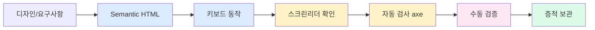
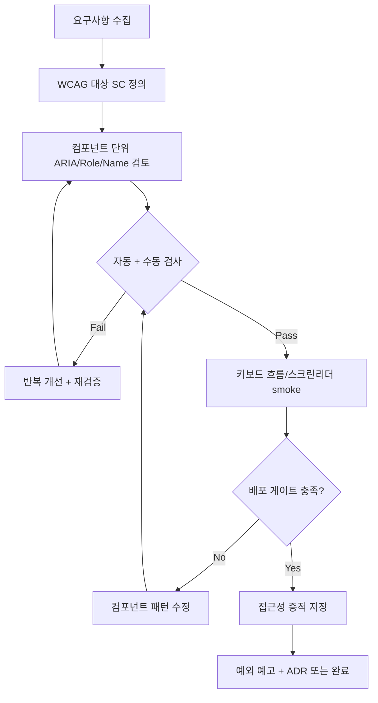
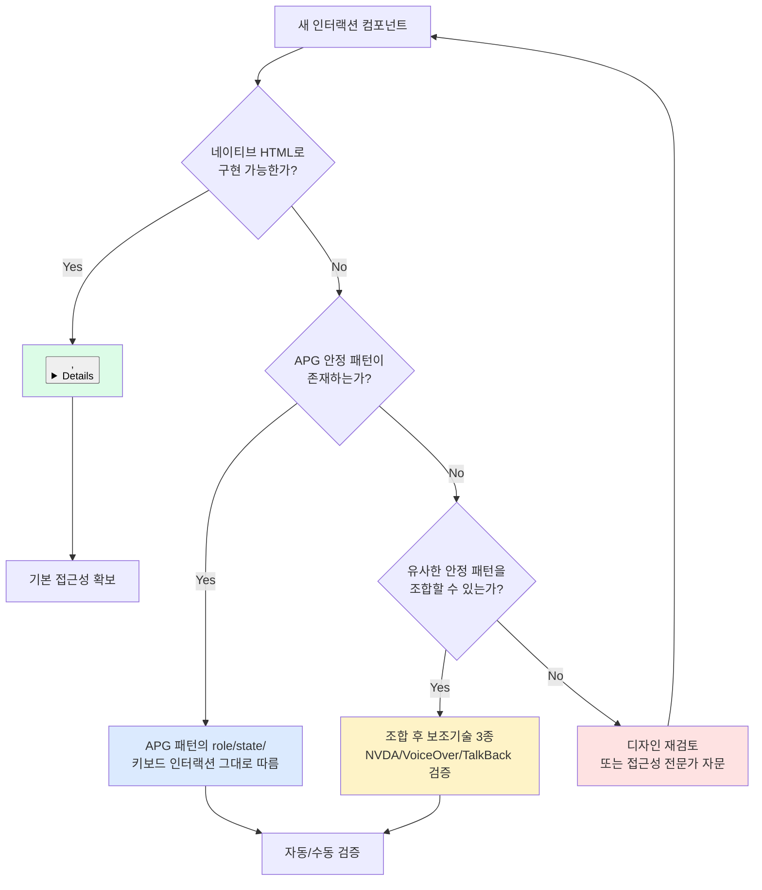
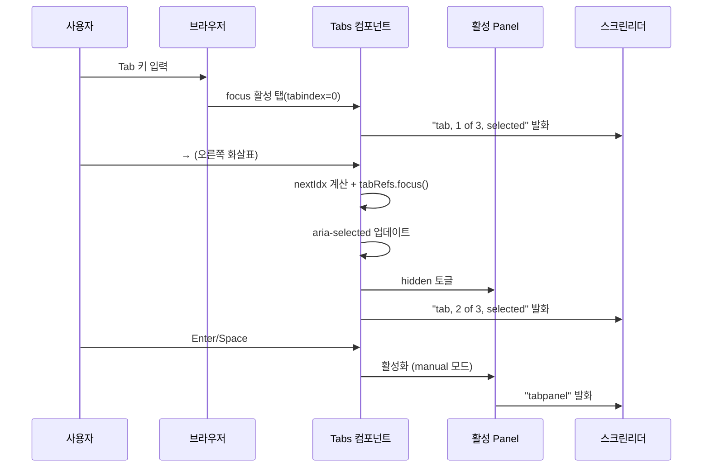
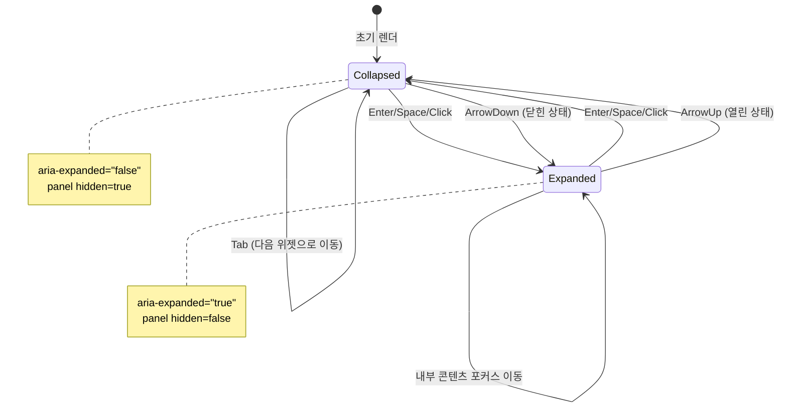
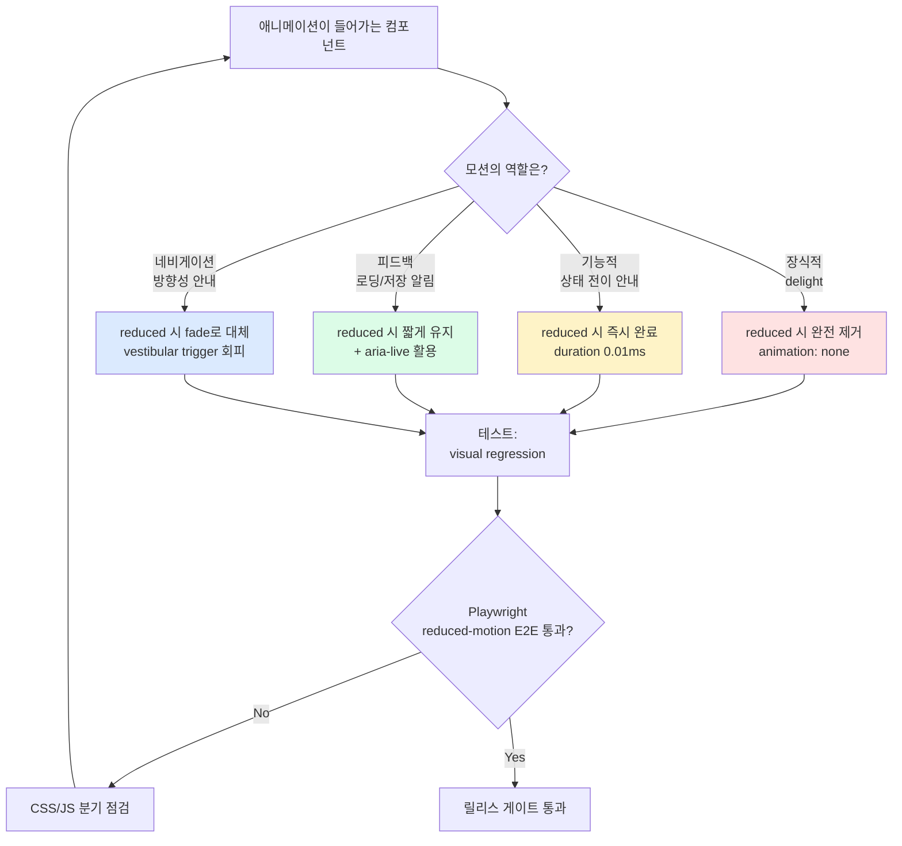
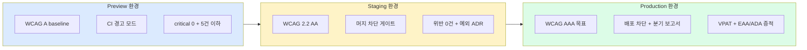
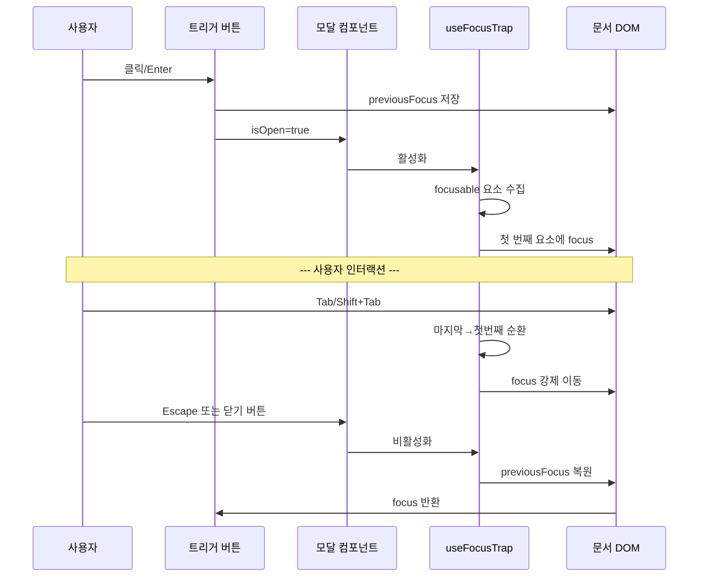
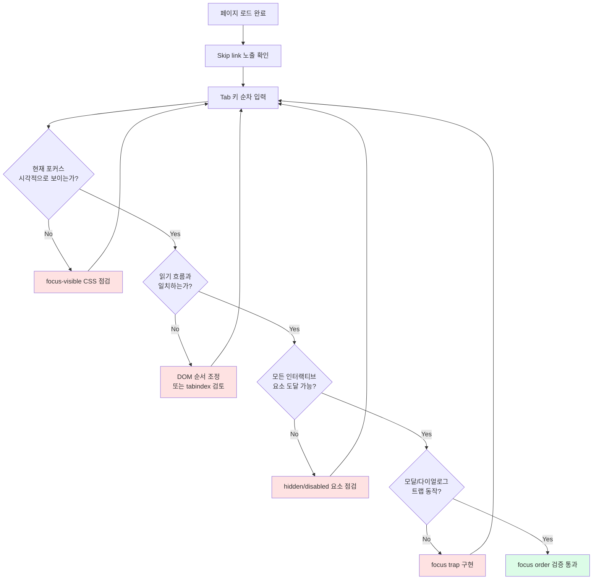

# 19. 웹 접근성 가이드

> **쉽게 읽기 안내**: 이 문서는 전문 용어가 많을 수 있어요.
> 이해가 어려우면 [공통 용어사전](../참고자료/개발가이드_용어사전.md)에서 먼저 용어 뜻을 확인하고 본문을 이어서 읽으면 이해가 훨씬 빨라집니다.
> 특히 실무에서 자주 쓰이는 `배포`, `CI/CD`, `롤백`, `스키마`처럼 동작이 중요한 용어부터 먼저 익혀보세요.
## 0. 먼저 알고 가기 (30초 요약)

- 접근성은 특정 사용자만 위한 기능이 아니라 기본 사용성의 전제 조건입니다.
- 키보드, 음성, 색각 등 다양한 사용 맥락에서 동작하는지 먼저 확인하세요.
- 디자인 의도와 HTML 시맨틱을 충돌 없이 맞추는 방식이 핵심입니다.

## 초심자용 한눈에 보기

접근성은 “장애인 대응 기능”이 아니라 “모든 사용자가 실패 없이 쓰는 인터페이스”를 만들기 위한 필수입니다.

> **일상 비유**: 접근성은 건물 입구의 자동문·계단 옆 경사로와 같습니다. 휠체어 이용자만을 위한 게 아니라, 짐을 든 사람·유모차·노인 모두에게 도움이 됩니다. 웹도 마찬가지로 키보드만 쓰는 사람, 시력이 약한 사람, 마우스가 고장 난 사람 등 다양한 상황에서 작동해야 합니다.

### 한눈에 보는 접근성 검증 흐름

왜 중요한가: "어디서부터 검증해야 할지" 모르는 신규 멤버에게 빠른 진입점을 제공합니다.



### 핵심 용어 빠르게 정리

| 용어 | 쉬운 뜻 | 일상 비유 |
| --- | --- | --- |
| `WCAG` | 웹 접근성 국제 기준 | 식품 위생 기준처럼 "최소 합격선"을 정의 |
| `키보드 내비게이션` | 마우스 없이 탭/키보드로 조작 가능한 기능 | 엘리베이터 버튼처럼 손 안 닿아도 누를 수 있어야 함 |
| `ARIA` | 스크린리더를 위한 추가적인 의미 표시 방법 | 박물관 도슨트가 그림 옆에서 설명해주는 음성 안내 |
| `포커스` | 현재 사용자 입력 대상이 있는 요소 표시 | 무대 위 조명이 비춰진 위치 |
| `색 대비` | 배경/텍스트 차이가 충분해 가독성을 확보하는 정도 | 노란 종이에 노란 글씨 vs 흰 종이에 검은 글씨의 차이 |


| 분류 | 핵심 기술 | 상태 | Stable |
| :--- | :--- | :--- | :--- |
| **연관 가이드** | [20. 디자인 시스템](./20_디자인_시스템_가이드.md), [07. 테스팅](./07_테스팅_가이드.md) | **도구 원칙** | 벤더 중립 |
| **핵심 테마** | WCAG 2.2 (ISO/IEC 40500:2025), EAA, ADA Title II, WAI-ARIA 1.2 stable + ARIA 1.3 draft watch, prefers-* 미디어 쿼리, 자동 게이트 | **Update** | 최신 기준 |

---

> **"접근성은 선택이 아니라, 모든 사용자가 동등하게 서비스를 경험할 수 있도록 보장하는 기본 품질 기준이다."**
> 본 가이드는 WCAG 2.2 AA/AAA 준수, EAA 및 ADA Title II 같은 규제 환경, WAI-ARIA 안정 패턴 구현, ARIA 1.3 Working Draft 감시, prefers-* 미디어 쿼리 통합, CI/CD 자동 게이트까지 실무에 필요한 접근성 전 영역을 다룹니다. 법적 해석은 관할권별 전문가 검토가 필요하며, 이 문서는 엔지니어링 증적과 품질 게이트를 중심으로 다룹니다.
>
> **현재 규제 환경 변화 요약 (현재 공식 문서 기준)**
> - **WCAG 2.2**: 2025년 10월 ISO/IEC 40500:2025로 표준화 완료 (October 2023 권고안과 동일)
> - **WAI-ARIA**: production baseline은 WAI-ARIA 1.2와 APG 안정 패턴입니다. WAI-ARIA 1.3은 2024년 First Public Working Draft이며, 신규 속성은 호환성 검증 후 제한적으로 사용합니다.
> - **EAA (European Accessibility Act)**: 2025년 6월 28일부터 적용. 실무 기준은 EN 301 549와 WCAG 계열 요구사항을 함께 확인합니다.
> - **ADA Title II**: ADA.gov와 Federal Register의 최신 공지를 기준으로 compliance date와 적용 대상을 확인합니다. 공공기관 규모와 관할에 따라 일정이 달라질 수 있으므로, 릴리즈 전 공식 링크와 법무 검토 결과를 PR에 남깁니다.
> - **AI 접근성 보조**: MCP 호환 AI 에이전트가 접근성 검사 결과를 IDE 안에서 읽고 수정 후보를 제안하는 흐름을 검토한다. 단, 최종 수정은 WCAG 기준과 수동 검증으로 확인한다.
> - **focus-visible polyfill 종료**: 모든 주요 브라우저(Safari 15.4+, Chrome 86+, Firefox 85+)가 네이티브 지원 → polyfill 제거

---


## 추천 항목 (실무 우선순위)

- **시작 추천**: 키보드·스크린리더 핵심 동선을 먼저 만들고, 텍스트 대체/라벨 규칙을 일괄 적용하세요.
- **안정 추천**: `prefers-reduced-motion`, 색 대비, focus 표시를 기본 가이드로 강제하세요.
- **운영 추천**: 접근성 테스트를 배포 단계 게이트와 연결해 회귀를 막습니다.


## 추천 항목 고도화 체크

- `즉시 적용` — 추천 항목 1개를 이번 주 내에 실제 작업 1건에 반영한다.
- `1주 내 정리` — 적용 결과를 PR 본문이나 회고 노트에 간단히 기록한다.
- `1개월 내 점검` — 재작업률/리뷰 충돌/배포 이슈 중 적어도 한 항목이 개선되었는지 확인한다.


## 추천 항목 실행 기록 템플릿

- `담당자` : 항목 적용 주체(문서 오너/팀원)를 명시
- `적용일` : 실제 반영된 날짜 및 작업 ID를 남김
- `측정 지표` : 리뷰 충돌/재작업/버그 재발 중 1개 이상 수치로 기록
- `보류 사유` : 적용을 못한 경우 이유를 1줄 기록하고 다음 액션을 지정

## 문서 책임 범위

| 이 문서가 결정하는 것 | 단일 출처로 따르는 문서 |
| :--- | :--- |
| WCAG 기준 매핑, ARIA 패턴, 키보드/스크린 리더 검증, 접근성 증적 | [00. 종합 가이드](./00_종합_가이드_목차.md)의 권고 등급 |
| 접근성 자동 검사와 수동 검사 조합 | [07. 테스팅](./07_테스팅_가이드.md)의 테스트 전략 |
| 접근성 gate를 배포 조건으로 연결하는 방식 | [11. CI/CD](./11_CICD_파이프라인_표준.md), [14. 배포](./14_배포_프로세스_체크리스트.md) |
| AI가 생성한 접근성 수정안의 검증 책임 | [18. AI 개발 워크플로우](./18_AI_개발_워크플로우_종합.md) |

---

## 0. 모든 프론트엔드 그룹 공통 Baseline

접근성 표준은 특정 규제 대응 문서가 아니라 제품 품질과 배포 안정성의 공통 게이트입니다.

| 기준 | 최소 적용 |
| :--- | :--- |
| **표준 기준** | WCAG 2.2 AA를 기본선으로 두고, 법/조달/공공 요구가 더 높으면 해당 기준을 추가합니다. |
| **자동 + 수동 검증** | axe/lint 같은 자동 검사와 키보드, 포커스 순서, 스크린 리더 smoke를 함께 수행합니다. |
| **컴포넌트 우선** | 디자인 시스템 컴포넌트에서 role/name/state, focus, reduced-motion 기준을 먼저 보장합니다. |
| **배포 증적** | 접근성 리포트, 수동 검증 메모, 예외 사유, 수정 backlog를 release evidence로 보관합니다. |
| **AI 보조 한계** | AI 수정안은 초안으로만 사용하고 WCAG 기준, 실제 DOM, 보조기술 조합으로 재검증합니다. |

### 0.0 접근성 기준 실행 흐름



### 0.1 교차 검증 매트릭스

| 권고 | 1차 출처 | 실행 증거 | 운영 증거 | 철회 조건 |
| :--- | :--- | :--- | :--- | :--- |
| WCAG 2.2 AA 기본선 | W3C WCAG 2.2 / ISO/IEC 40500:2025 | axe/lint + 키보드 + 스크린 리더 smoke | 접근성 결함, 고객 문의, 감사 지적 | 법/표준 변경 시 기준 재검토 |
| ARIA 1.2 stable 우선 | WAI-ARIA 1.2/APG, ARIA 1.3 draft 상태 | component interaction test | screen reader/browser issue | draft 속성은 호환성 실패 시 제거 |
| 배포 게이트화 | [11. CI/CD](./11_CICD_파이프라인_표준.md) | CI report, screenshot evidence | release accessibility defect | false positive는 rule 예외 ADR 필요 |

### 0.2 운영 게이트

| Gate | Evidence | Owner | Rollback |
| :--- | :--- | :--- | :--- |
| Release accessibility gate | axe report, keyboard smoke, screen reader note | QA + FE owner | gate false positive는 예외 ADR 후 rule scope 축소 |
| Component pattern approval | APG/WCAG mapping, interaction test | Design system owner | 네이티브 요소로 되돌리거나 ARIA 속성 제거 |
| Audit evidence archive | snapshot, screenshot, remediation issue | Accessibility owner | 기준 변경 시 evidence set 재생성 |

---


## 1. AI 보조 접근성 감사 검증 시나리오

이 섹션의 AI 입력 구조, 민감정보 제거, 검증 책임은 [18. AI 개발 워크플로우](./18_AI_개발_워크플로우_종합.md)를 단일 출처로 따릅니다. 여기서는 접근성 감사에 필요한 도메인별 질문과 산출물만 다룹니다.

AI는 접근성 감사 초안과 테스트 후보를 빠르게 만들 수 있지만, 접근성 통과 여부는 WCAG 기준 매핑, 실제 DOM, 키보드 조작, 스크린 리더 smoke test, CI 증적으로 판단합니다.

| 시나리오 | 입력 | AI 산출물 | 필수 검증 | 승인 조건 |
| :--- | :--- | :--- | :--- | :--- |
| WCAG 2.2 AA 감사 | URL, HTML snapshot, axe 결과 | 위반 항목 분류, 수정 후보, 증적 초안 | axe 재실행, 수동 키보드 탐색, 명암비 확인 | Critical/Major 0건 또는 예외 ADR |
| 스크린 리더 플로우 | 핵심 사용자 여정, 접근성 트리, 컴포넌트 코드 | 읽기 순서, accessible name, live region 위험 | 최소 1개 스크린 리더 smoke, focus order 확인 | 기능 완료까지 키보드만으로 진행 가능 |
| 컴포넌트 리팩터 | 컴포넌트 코드, APG 패턴명, 상태 전이 | 네이티브 요소 우선 수정안, ARIA 최소화 | role/name/state test, interaction test | ARIA가 동작을 보완하고 대체하지 않음 |
| 감사/소송 증적 | 자동 검사 리포트, 수동 검증 로그, 스크린샷 | VPAT/준수 현황 초안, remediation backlog | 법적 해석은 전문가 검토, 증적 링크 확인 | 기준·날짜·범위·예외가 추적 가능 |
| 자동화 테스트 | 페이지 URL, user flow, known issue 목록 | Playwright/axe 테스트 후보 | CI에서 실패/성공 재현, false positive triage | 배포 gate 또는 관찰 지표로 연결 |

금지 기준은 명확합니다. 민감 사용자 데이터, 고객 문의 원문, 법적 판단 확정, 검증되지 않은 준수 선언은 AI 입력 또는 산출물로 사용하지 않습니다.

접근성 수정 PR에는 최소한 다음 증거를 남깁니다.

- 변경 전/후 DOM 또는 컴포넌트 diff
- 관련 WCAG success criteria
- 자동 검사 결과와 수동 검증 메모
- 남은 예외와 후속 조치 owner

## 2. WAI-ARIA 안정 패턴 + ARIA 1.3 Draft Watch

왜 중요한가: ARIA를 잘못 쓰면 오히려 접근성이 망가집니다("first rule of ARIA: don't use ARIA"). 안정 패턴을 그대로 따라야 보조기술 호환성이 보장됩니다.

> **일상 비유**: ARIA는 음식 라벨의 알레르기 표시와 같습니다. 정확한 라벨은 안전을 보장하지만, 잘못된 라벨은 더 큰 위험을 만듭니다. 그래서 표준이 정한 형식(WAI-ARIA APG)을 그대로 따르는 것이 가장 안전합니다.

production baseline은 WAI-ARIA 1.2와 WAI-ARIA Authoring Practices 안정 패턴입니다. WAI-ARIA 1.3은 현재 공식 문서 기준 Working Draft이므로, 신규 속성은 접근성 트리, 브라우저, 스크린 리더 조합에서 검증한 뒤 제한적으로 사용합니다. 이 섹션은 Disclosure, Feed, Meter 같은 실무 패턴을 TypeScript로 구현하고, 키보드 인터랙션, 스크린 리더 호환성, 고대비 모드 대응을 함께 다룹니다.

### ARIA 사용 의사결정 트리

새 컴포넌트를 만들 때 "ARIA를 써야 할지" 빠르게 판단하는 흐름입니다. 가장 좋은 ARIA는 "쓰지 않는 ARIA"라는 W3C 원칙을 반영했습니다.



### 키보드 인터랙션 시퀀스 (Tabs 패턴 예시)

탭 컴포넌트에서 사용자 키 입력이 어떻게 처리되는지 보여줍니다. Roving Tabindex의 핵심은 "탭 키는 위젯 그룹 단위, 화살표 키는 위젯 안 이동"이라는 점입니다.



### 자주 쓰는 ARIA 패턴 상태 머신

Disclosure(아코디언) 컴포넌트의 상태 전이를 시각화했습니다. `aria-expanded`가 상태와 항상 동기화되어야 합니다.



> **ARIA 1.3 Draft Watch**
> - `aria-description`: 긴 설명 분리 용도로 검토하되, 기존 `aria-describedby`와 스크린 리더 발화 차이를 확인합니다.
> - `aria-braillelabel`, `aria-brailleroledescription`: 점자 디스플레이 사용자 지원 후보입니다. 실제 보조기술 지원 여부를 먼저 확인합니다.
> - `aria-actions`: 컨텍스트 액션 노출 후보입니다. production UI의 필수 상호작용을 이 속성에만 의존하지 않습니다.
> - `role="suggestion"`, `role="mark"`, `role="comment"`: 편집 컨텍스트용 draft 롤입니다. 안정 지원 전까지는 시맨틱 HTML과 보조 텍스트로 폴백합니다.
> - 기존 `aria-labelledby`/`aria-describedby` 우선순위 규칙 변경은 회귀 테스트 대상으로 관리합니다.

### Disclosure 패턴

아코디언, FAQ, 접을 수 있는 섹션 등에 사용되는 기본 패턴이다. `aria-expanded`와 `aria-controls`로 상태를 전달하고, 화살표 키로 열기/닫기를 지원한다.

```typescript
// components/a11y/Disclosure.tsx
'use client';

import { useState, useRef, useId, useCallback, type ReactNode, type KeyboardEvent } from 'react';

interface DisclosureProps {
  label: string;
  children: ReactNode;
  defaultOpen?: boolean;
  onToggle?: (isOpen: boolean) => void;
}

export function Disclosure({ label, children, defaultOpen = false, onToggle }: DisclosureProps) {
  const [isOpen, setIsOpen] = useState(defaultOpen);
  const contentId = useId();
  const buttonRef = useRef<HTMLButtonElement>(null);

  const toggle = useCallback(() => {
    const next = !isOpen;
    setIsOpen(next);
    onToggle?.(next);
  }, [isOpen, onToggle]);

  // APG 키보드 패턴: Enter/Space로 토글, 화살표로 열기/닫기
  const handleKeyDown = useCallback((e: KeyboardEvent<HTMLButtonElement>) => {
    switch (e.key) {
      case 'Enter':
      case ' ':
        e.preventDefault();
        toggle();
        break;
      case 'ArrowDown':
        if (!isOpen) {
          e.preventDefault();
          toggle();
        }
        break;
      case 'ArrowUp':
        if (isOpen) {
          e.preventDefault();
          toggle();
        }
        break;
    }
  }, [isOpen, toggle]);

  return (
    <div>
      <h3>
        <button
          ref={buttonRef}
          type="button"
          aria-expanded={isOpen}
          aria-controls={contentId}
          onClick={toggle}
          onKeyDown={handleKeyDown}
          style={{
            all: 'unset',
            cursor: 'pointer',
            display: 'flex',
            alignItems: 'center',
            gap: 8,
            padding: '8px 0',
            width: '100%',
          }}
        >
          {/* 회전 아이콘 -- aria-hidden으로 스크린 리더 중복 읽기 방지 */}
          <svg
            aria-hidden="true"
            width={16}
            height={16}
            viewBox="0 0 16 16"
            style={{
              transform: isOpen ? 'rotate(90deg)' : 'rotate(0deg)',
              transition: 'transform 0.2s',
            }}
          >
            <path d="M6 4l4 4-4 4" fill="none" stroke="currentColor" strokeWidth={2} />
          </svg>
          {label}
        </button>
      </h3>
      <div
        id={contentId}
        role="region"
        aria-labelledby={buttonRef.current?.id}
        hidden={!isOpen}
        style={{
          paddingInlineStart: 24,
          overflow: 'hidden',
        }}
      >
        {children}
      </div>
    </div>
  );
}
```

### Feed 패턴 (무한 스크롤 접근성)

SNS 타임라인, 뉴스 피드 등 무한 스크롤 UI에 적용한다. `role="feed"`, `aria-busy`, `aria-posinset`, `aria-setsize`로 스크린 리더에 컨텍스트를 전달하고, PageDown/PageUp으로 아이템 간 이동을 지원한다.

```typescript
// components/a11y/Feed.tsx
'use client';

import {
  useRef,
  useCallback,
  useEffect,
  type ReactNode,
  type KeyboardEvent,
} from 'react';

interface FeedItem {
  id: string;
  content: ReactNode;
  label: string;
}

interface FeedProps {
  items: FeedItem[];
  isLoading: boolean;
  hasMore: boolean;
  onLoadMore: () => void;
  label: string;
}

export function Feed({ items, isLoading, hasMore, onLoadMore, label }: FeedProps) {
  const feedRef = useRef<HTMLDivElement>(null);
  const observerRef = useRef<IntersectionObserver | null>(null);
  const sentinelRef = useRef<HTMLDivElement>(null);

  // 무한 스크롤 -- IntersectionObserver로 자동 로드
  useEffect(() => {
    if (!sentinelRef.current || !hasMore) return;

    observerRef.current = new IntersectionObserver(
      (entries) => {
        if (entries[0]?.isIntersecting && !isLoading) {
          onLoadMore();
        }
      },
      { threshold: 0.1 },
    );

    observerRef.current.observe(sentinelRef.current);
    return () => observerRef.current?.disconnect();
  }, [hasMore, isLoading, onLoadMore]);

  // Feed 키보드 네비게이션 (APG 패턴)
  // PageDown/PageUp: 다음/이전 아이템 포커스
  // Ctrl+Home/End: 처음/마지막 아이템 포커스
  const handleKeyDown = useCallback((e: KeyboardEvent<HTMLDivElement>) => {
    const articles = feedRef.current?.querySelectorAll<HTMLElement>('[role="article"]');
    if (!articles?.length) return;

    const focused = document.activeElement as HTMLElement;
    const currentIndex = Array.from(articles).indexOf(focused);

    switch (e.key) {
      case 'PageDown':
        e.preventDefault();
        if (currentIndex < articles.length - 1) {
          articles[currentIndex + 1]?.focus();
        }
        break;
      case 'PageUp':
        e.preventDefault();
        if (currentIndex > 0) {
          articles[currentIndex - 1]?.focus();
        }
        break;
      case 'Home':
        if (e.ctrlKey) {
          e.preventDefault();
          articles[0]?.focus();
        }
        break;
      case 'End':
        if (e.ctrlKey) {
          e.preventDefault();
          articles[articles.length - 1]?.focus();
        }
        break;
    }
  }, []);

  return (
    <div
      ref={feedRef}
      role="feed"
      aria-label={label}
      aria-busy={isLoading}
      onKeyDown={handleKeyDown}
    >
      {items.map((item, index) => (
        <article
          key={item.id}
          role="article"
          aria-label={item.label}
          aria-posinset={index + 1}
          aria-setsize={hasMore ? -1 : items.length}
          tabIndex={0}
          style={{ padding: '16px 0', borderBottom: '1px solid #e5e7eb' }}
        >
          {item.content}
        </article>
      ))}

      {/* 로딩 상태 알림 -- 스크린 리더에 polite로 전달 */}
      <div
        role="status"
        aria-live="polite"
        aria-atomic="true"
        style={{ position: 'absolute', clip: 'rect(0,0,0,0)' }}
      >
        {isLoading ? '추가 항목을 불러오는 중입니다' : ''}
      </div>

      {/* 무한 스크롤 감지 센티넬 */}
      {hasMore && <div ref={sentinelRef} style={{ height: 1 }} />}
    </div>
  );
}
```

### Meter 패턴

진행률, 점수, 사용량 등 측정값을 표시한다. 네이티브 `<meter>` 요소를 스크린 리더용으로 유지하면서, 시각적으로는 커스텀 바를 렌더링한다.

```typescript
// components/a11y/Meter.tsx
'use client';

import { useMemo, useId } from 'react';

interface MeterProps {
  value: number;
  min?: number;
  max?: number;
  low?: number;
  high?: number;
  optimum?: number;
  label: string;
  formatValue?: (value: number) => string;
}

export function Meter({
  value,
  min = 0,
  max = 100,
  low,
  high,
  optimum,
  label,
  formatValue = (v) => `${v}%`,
}: MeterProps) {
  const meterId = useId();

  // 퍼센트 계산 (min-max 범위 기준)
  const percentage = useMemo(() => {
    const clamped = Math.max(min, Math.min(max, value));
    return ((clamped - min) / (max - min)) * 100;
  }, [value, min, max]);

  // low/high/optimum 기준 상태 결정
  const status = useMemo((): 'low' | 'medium' | 'high' | 'optimum' => {
    if (optimum !== undefined && value === optimum) return 'optimum';
    if (low !== undefined && value <= low) return 'low';
    if (high !== undefined && value >= high) return 'high';
    return 'medium';
  }, [value, low, high, optimum]);

  const statusColors: Record<string, string> = {
    low: '#ef4444',     // 위험 (빨강)
    medium: '#f59e0b',  // 보통 (노랑)
    high: '#22c55e',    // 양호 (초록)
    optimum: '#3b82f6', // 최적 (파랑)
  };

  return (
    <div>
      <div
        id={`${meterId}-label`}
        style={{ fontSize: 14, fontWeight: 500, marginBottom: 4 }}
      >
        {label}
      </div>

      {/* 네이티브 meter -- 스크린 리더용 (시각적으로 숨김) */}
      <meter
        id={meterId}
        value={value}
        min={min}
        max={max}
        low={low}
        high={high}
        optimum={optimum}
        aria-labelledby={`${meterId}-label`}
        style={{ position: 'absolute', opacity: 0, width: 0, height: 0 }}
      >
        {formatValue(value)}
      </meter>

      {/* 시각적 표현 -- aria-hidden으로 중복 읽기 방지 */}
      <div
        aria-hidden="true"
        style={{
          width: '100%',
          height: 8,
          backgroundColor: '#e5e7eb',
          borderRadius: 4,
          overflow: 'hidden',
        }}
      >
        <div
          style={{
            width: `${percentage}%`,
            height: '100%',
            backgroundColor: statusColors[status],
            borderRadius: 4,
            transition: 'width 0.3s ease, background-color 0.3s ease',
          }}
        />
      </div>

      {/* 스크린 리더용 현재 값 실시간 알림 */}
      <div
        role="status"
        aria-live="polite"
        style={{ position: 'absolute', clip: 'rect(0,0,0,0)' }}
      >
        {label}: {formatValue(value)}
      </div>
    </div>
  );
}
```

### Tabs 패턴

탭 패널 인터페이스다. Roving tabindex로 탭 간 이동을 관리하고, 화살표 키로 탭을 전환한다. [02. React 19](./02_React19_실무_가이드.md) 컴포넌트 패턴과 함께 사용할 수 있다.

```typescript
// components/a11y/Tabs.tsx
'use client';

import { useState, useRef, useCallback, useId, type ReactNode, type KeyboardEvent } from 'react';

interface TabItem {
  id: string;
  label: string;
  content: ReactNode;
  disabled?: boolean;
}

interface TabsProps {
  tabs: TabItem[];
  defaultActiveId?: string;
  /** 자동 활성화: 포커스 이동 시 즉시 패널 전환 */
  automatic?: boolean;
  ariaLabel: string;
}

export function Tabs({ tabs, defaultActiveId, automatic = true, ariaLabel }: TabsProps) {
  const [activeId, setActiveId] = useState(defaultActiveId ?? tabs[0]?.id ?? '');
  const tabRefs = useRef<Map<string, HTMLButtonElement>>(new Map());
  const groupId = useId();

  // 활성화 가능한 탭만 필터링
  const enabledTabs = tabs.filter((t) => !t.disabled);

  // Roving tabindex: 화살표 키로 탭 간 이동
  const handleKeyDown = useCallback(
    (e: KeyboardEvent<HTMLDivElement>) => {
      const currentIdx = enabledTabs.findIndex((t) => t.id === activeId);
      let nextIdx = currentIdx;

      switch (e.key) {
        case 'ArrowRight':
        case 'ArrowDown':
          e.preventDefault();
          nextIdx = (currentIdx + 1) % enabledTabs.length;
          break;
        case 'ArrowLeft':
        case 'ArrowUp':
          e.preventDefault();
          nextIdx = (currentIdx - 1 + enabledTabs.length) % enabledTabs.length;
          break;
        case 'Home':
          e.preventDefault();
          nextIdx = 0;
          break;
        case 'End':
          e.preventDefault();
          nextIdx = enabledTabs.length - 1;
          break;
        default:
          return;
      }

      const nextTab = enabledTabs[nextIdx];
      if (!nextTab) return;

      // 포커스 이동
      tabRefs.current.get(nextTab.id)?.focus();

      // automatic 모드면 포커스 이동 시 즉시 활성화
      if (automatic) {
        setActiveId(nextTab.id);
      }
    },
    [activeId, enabledTabs, automatic],
  );

  return (
    <div>
      {/* 탭 리스트 */}
      <div
        role="tablist"
        aria-label={ariaLabel}
        onKeyDown={handleKeyDown}
        style={{ display: 'flex', borderBottom: '2px solid #e5e7eb' }}
      >
        {tabs.map((tab) => (
          <button
            key={tab.id}
            ref={(el) => {
              if (el) tabRefs.current.set(tab.id, el);
            }}
            role="tab"
            id={`${groupId}-tab-${tab.id}`}
            aria-selected={activeId === tab.id}
            aria-controls={`${groupId}-panel-${tab.id}`}
            aria-disabled={tab.disabled ?? undefined}
            tabIndex={activeId === tab.id ? 0 : -1}
            onClick={() => !tab.disabled && setActiveId(tab.id)}
            style={{
              padding: '12px 16px',
              border: 'none',
              borderBottom: activeId === tab.id ? '2px solid #2563eb' : '2px solid transparent',
              background: 'none',
              cursor: tab.disabled ? 'not-allowed' : 'pointer',
              opacity: tab.disabled ? 0.5 : 1,
              fontWeight: activeId === tab.id ? 600 : 400,
              color: activeId === tab.id ? '#2563eb' : '#6b7280',
            }}
          >
            {tab.label}
          </button>
        ))}
      </div>

      {/* 탭 패널 */}
      {tabs.map((tab) => (
        <div
          key={tab.id}
          role="tabpanel"
          id={`${groupId}-panel-${tab.id}`}
          aria-labelledby={`${groupId}-tab-${tab.id}`}
          hidden={activeId !== tab.id}
          tabIndex={0}
          style={{ padding: 16 }}
        >
          {tab.content}
        </div>
      ))}
    </div>
  );
}
```

---

## 3. CSS prefers-* 미디어 쿼리 통합

왜 중요한가: 사용자가 OS 설정으로 이미 "모션을 줄여달라" 또는 "고대비로 보여달라"고 요청했는데, 웹이 무시하면 접근성 결함입니다. `prefers-*`는 그 요청을 듣는 가장 표준화된 통로입니다.

> **일상 비유**: 식당에서 "매운 거 안 먹어요"라고 미리 말한 손님에게 매운 음식을 주면 안 되는 것과 같습니다. 사용자가 OS에서 "모션 줄이기"를 켰다면 웹도 그걸 따라야 합니다.

`prefers-reduced-motion`, `prefers-contrast`, `prefers-color-scheme`, `forced-colors`를 통합적으로 관리하는 시스템이다. 사용자의 OS/브라우저 설정을 존중하여 접근성을 자동으로 향상시킨다.

### prefers-reduced-motion 분기 결정 트리

모션이 들어간 컴포넌트마다 아래 흐름으로 reduced-motion 대응 방식을 결정합니다.



### 통합 사용자 선호 감지 훅

```typescript
// hooks/useUserPreferences.ts
'use client';

import { useState, useEffect, useMemo } from 'react';

interface UserPreferences {
  /** 모션 감소 요청 (전정 장애, 편두통 등) */
  reducedMotion: boolean;
  /** 고대비 요청 (저시력) */
  highContrast: boolean;
  /** 색상 스킴 (다크/라이트) */
  colorScheme: 'light' | 'dark';
  /** Windows 고대비 모드 활성 */
  forcedColors: boolean;
  /** 투명도 감소 요청 */
  reducedTransparency: boolean;
  /** 데이터 절약 모드 */
  reducedData: boolean;
}

function useMediaQuery(query: string): boolean {
  const [matches, setMatches] = useState(false);

  useEffect(() => {
    const mql = window.matchMedia(query);
    setMatches(mql.matches);

    function handler(e: MediaQueryListEvent) {
      setMatches(e.matches);
    }

    mql.addEventListener('change', handler);
    return () => mql.removeEventListener('change', handler);
  }, [query]);

  return matches;
}

export function useUserPreferences(): UserPreferences {
  const reducedMotion = useMediaQuery('(prefers-reduced-motion: reduce)');
  const highContrast = useMediaQuery('(prefers-contrast: more)');
  const darkScheme = useMediaQuery('(prefers-color-scheme: dark)');
  const forcedColors = useMediaQuery('(forced-colors: active)');
  const reducedTransparency = useMediaQuery('(prefers-reduced-transparency: reduce)');
  const reducedData = useMediaQuery('(prefers-reduced-data: reduce)');

  return useMemo(() => ({
    reducedMotion,
    highContrast,
    colorScheme: darkScheme ? 'dark' : 'light',
    forcedColors,
    reducedTransparency,
    reducedData,
  }), [reducedMotion, highContrast, darkScheme, forcedColors, reducedTransparency, reducedData]);
}
```

### CSS 변수 기반 통합 테마

모든 접근성 관련 미디어 쿼리를 하나의 CSS 파일에서 관리한다. 포커스 링, 애니메이션, 대비, 고대비 모드 등을 CSS 변수로 통제하여 일관된 접근성 경험을 보장한다.

```typescript
// styles/a11y-preferences.css.ts -- CSS-in-JS 또는 글로벌 CSS로 사용
export const accessibilityStyles = `
/* 기본 애니메이션 및 포커스 변수 */
:root {
  --animation-duration: 300ms;
  --transition-duration: 200ms;
  --animation-easing: cubic-bezier(0.4, 0, 0.2, 1);
  --focus-ring-width: 2px;
  --focus-ring-color: #2563eb;
  --focus-ring-offset: 2px;
}

/* ── 모션 감소 ── */
/* 전정 장애, 편두통 등 모션 민감 사용자를 위한 설정 */
@media (prefers-reduced-motion: reduce) {
  :root {
    --animation-duration: 0ms;
    --transition-duration: 0ms;
  }

  *,
  *::before,
  *::after {
    animation-duration: 0.01ms !important;
    animation-iteration-count: 1 !important;
    transition-duration: 0.01ms !important;
    scroll-behavior: auto !important;
  }
}

/* ── 고대비 모드 ── */
/* 저시력 사용자를 위한 경계선/대비 강화 */
@media (prefers-contrast: more) {
  :root {
    --focus-ring-width: 3px;
    --focus-ring-color: #000000;
    --border-width: 2px;
  }

  button, a, input, select, textarea {
    border: var(--border-width) solid currentColor !important;
  }

  /* 텍스트 대비 강화 */
  body {
    color: #000000;
    background-color: #ffffff;
  }
}

@media (prefers-contrast: more) and (prefers-color-scheme: dark) {
  body {
    color: #ffffff;
    background-color: #000000;
  }
}

/* ── Windows 고대비 (forced-colors) ── */
/* 시스템 색상만 사용 가능 -- 커스텀 색상 무시됨 */
@media (forced-colors: active) {
  :root {
    --focus-ring-color: Highlight;
  }

  /* 커스텀 컨트롤의 시각적 구분 보장 */
  button, [role="button"] {
    border: 1px solid ButtonText;
  }

  /* SVG 아이콘이 보이도록 currentColor 강제 */
  svg {
    fill: currentColor;
  }

  /* 비활성화 상태 표시 */
  [disabled], [aria-disabled="true"] {
    color: GrayText;
    border-color: GrayText;
  }

  /* 포커스 링 -- forced-colors에서 확실히 보이게 */
  :focus-visible {
    outline: 2px solid Highlight;
    outline-offset: 2px;
  }

  /* 선택 상태 시각적 표시 */
  [aria-selected="true"],
  [aria-checked="true"],
  [aria-pressed="true"] {
    background-color: Highlight;
    color: HighlightText;
  }
}

/* ── 투명도 감소 ── */
@media (prefers-reduced-transparency: reduce) {
  .glass-effect,
  .backdrop-blur {
    backdrop-filter: none !important;
    background-color: var(--bg-solid) !important;
  }
}

/* ── 공통 포커스 스타일 ── */
/* 키보드 포커스 시 명확한 시각적 표시 (WCAG 2.4.7) */
:focus-visible {
  outline: var(--focus-ring-width) solid var(--focus-ring-color);
  outline-offset: var(--focus-ring-offset);
}

/* 마우스 클릭 시에만 포커스 링 숨김 */
:focus:not(:focus-visible) {
  outline: none;
}
`;
```

### 접근성 선호 반영 컴포넌트

사용자 선호에 따라 애니메이션과 색상을 자동 조정하는 유틸리티 컴포넌트다.

```typescript
// components/a11y/AccessibleAnimation.tsx
'use client';

import { type ReactNode, type CSSProperties } from 'react';
import { useUserPreferences } from '@/hooks/useUserPreferences';

interface AccessibleAnimationProps {
  children: ReactNode;
  animation: string;
  duration?: number;
  /** 모션 감소 시 대체 동작 */
  reducedMotionFallback?: 'fade' | 'none' | 'instant';
}

export function AccessibleAnimation({
  children,
  animation,
  duration = 300,
  reducedMotionFallback = 'instant',
}: AccessibleAnimationProps) {
  const { reducedMotion } = useUserPreferences();

  const style: CSSProperties = reducedMotion
    ? {
        // 모션 감소 요청 시 대체 애니메이션 적용
        animation: reducedMotionFallback === 'none'
          ? 'none'
          : reducedMotionFallback === 'fade'
            ? 'fade-in 0.01ms ease-in-out'
            : 'none',
        opacity: 1,
      }
    : {
        animation: `${animation} ${duration}ms var(--animation-easing)`,
      };

  return <div style={style}>{children}</div>;
}

// components/a11y/ContrastAwareText.tsx
interface ContrastAwareTextProps {
  children: ReactNode;
  normalColor: string;
  highContrastColor: string;
  as?: keyof JSX.IntrinsicElements;
}

export function ContrastAwareText({
  children,
  normalColor,
  highContrastColor,
  as: Tag = 'span',
}: ContrastAwareTextProps) {
  const { highContrast, forcedColors } = useUserPreferences();

  // forced-colors 모드에서는 시스템 색상만 사용
  if (forcedColors) {
    return <Tag style={{ color: 'CanvasText' }}>{children}</Tag>;
  }

  return (
    <Tag style={{ color: highContrast ? highContrastColor : normalColor }}>
      {children}
    </Tag>
  );
}
```

---

## 4. 환경별 접근성 자동 게이트

axe-core 위반이 발견되면 PR 머지를 자동으로 차단하는 CI 게이트다. [11. CI/CD](./11_CICD_파이프라인_표준.md)와 연동하여 배포 파이프라인에 접근성 검증을 통합한다.

### CI 접근성 게이트

```yaml
# .ci/workflows/a11y-gate.yml
name: Accessibility Gate
on:
  pull_request:
    branches: [main, develop]

jobs:
  a11y-gate:
    runs-on: ubuntu-latest
    strategy:
      matrix:
        environment: [preview, staging]
    steps:
      - uses: actions/checkout@v4

      - uses: actions/setup-node@v4
        with:
          node-version: '22'

      - run: npm ci
      - run: npx playwright install --with-deps chromium

      - name: Build
        run: npm run build
        env:
          DEPLOY_ENV: ${{ matrix.environment }}

      - name: Run accessibility tests
        run: npx playwright test --project=a11y --reporter=json --output=a11y-results.json
        env:
          WCAG_LEVEL: ${{ matrix.environment == 'preview' && 'A' || matrix.environment == 'staging' && 'AA' || 'AAA' }}
          BASE_URL: ${{ matrix.environment == 'preview' && 'http://localhost:3000' || matrix.environment == 'staging' && 'https://staging.example.com' || 'https://example.com' }}

      - name: Check gate threshold
        run: |
          node -e "
            const results = require('./a11y-results.json');
            const violations = results.suites?.[0]?.specs?.filter(s => s.ok === false) ?? [];
            if (violations.length > 0) {
              console.error('A11y gate FAILED: ' + violations.length + ' violations');
              violations.forEach(v => console.error('  - ' + v.title));
              process.exit(1);
            }
            console.log('A11y gate PASSED');
          "

      - name: Comment PR with results
        if: always()
        uses: ci-script-action@v1
        with:
          script: |
            const fs = require('fs');
            const results = JSON.parse(fs.readFileSync('a11y-results.json', 'utf8'));
            const env = '${{ matrix.environment }}';
            const level = env === 'preview' ? 'A' : env === 'staging' ? 'AA' : 'AAA';
            const passed = results.suites?.[0]?.specs?.every(s => s.ok) ?? false;

            const body = `## Accessibility Gate: ${env} (WCAG ${level})
            Status: ${passed ? ':white_check_mark: PASSED' : ':x: FAILED'}
            Environment: \`${env}\`
            WCAG Level: \`${level}\``;

            commentClient.create({
              issue_number: context.issue.number,
              owner: context.repo.owner,
              repo: context.repo.repo,
              body
            });
```

### axe-core 환경별 룰 설정

```typescript
// e2e/a11y-config.ts
import type { RunOptions } from 'axe-core';

type WcagLevel = 'A' | 'AA' | 'AAA';

// WCAG 레벨별 axe-core 태그 매핑
const WCAG_TAG_MAP: Record<WcagLevel, string[]> = {
  A: ['wcag2a', 'wcag21a', 'wcag22a'],
  AA: ['wcag2a', 'wcag21a', 'wcag22a', 'wcag2aa', 'wcag21aa', 'wcag22aa'],
  AAA: [
    'wcag2a', 'wcag21a', 'wcag22a',
    'wcag2aa', 'wcag21aa', 'wcag22aa',
    'wcag2aaa', 'wcag21aaa',
  ],
};

// 환경 감지 -- WCAG_LEVEL 또는 DEPLOY_ENV 환경 변수 기반
function getWcagLevel(): WcagLevel {
  const envLevel = process.env.WCAG_LEVEL as WcagLevel | undefined;
  if (envLevel && ['A', 'AA', 'AAA'].includes(envLevel)) return envLevel;

  const deployEnv = process.env.DEPLOY_ENV ?? 'preview';
  switch (deployEnv) {
    case 'production': return 'AAA';
    case 'staging': return 'AA';
    default: return 'A';
  }
}

export function getAxeConfig(): RunOptions {
  const level = getWcagLevel();
  const tags = WCAG_TAG_MAP[level];

  return {
    runOnly: {
      type: 'tag',
      values: tags,
    },
    rules: {
      // AAA 레벨에서 추가 활성화 룰
      ...(level === 'AAA' && {
        'color-contrast-enhanced': { enabled: true },
        'meta-viewport': { enabled: true },
      }),
      // 공통 활성화 룰 (모든 레벨)
      'region': { enabled: true },
      'landmark-one-main': { enabled: true },
    },
  };
}

// 환경별 허용 위반 수 (점진적 강화 전략)
export function getMaxViolations(): number {
  const level = getWcagLevel();
  switch (level) {
    case 'A': return 5;    // preview: 경미한 위반 허용
    case 'AA': return 0;   // staging: 위반 불허
    case 'AAA': return 0;  // production: 위반 불허
  }
}

export { getWcagLevel };
export type { WcagLevel };
```

---

## 5. 환경별 WCAG 레벨 차등 적용

왜 중요한가: 모든 환경에서 똑같이 빡빡한 게이트를 걸면 개발 속도가 죽고, 모두 느슨하면 production에 결함이 새어 나갑니다. 환경별 차등 적용은 이 균형을 잡기 위한 핵심 전략입니다.

> **일상 비유**: 자동차 조립 라인에서 부품 검사를 비유로 생각해보세요. preview는 "샘플 검사", staging은 "출고 전 정밀 검사", production은 "감사 대응용 전수 검사"에 해당합니다.

### 환경별 WCAG 게이트 흐름



### 환경별 차등 게이트 비교표

| 항목 | Preview | Staging | Production |
| :--- | :--- | :--- | :--- |
| WCAG 레벨 | A baseline | **2.2 AA (필수)** | AAA 목표 |
| 검사 도구 | axe-core 경고 | axe + Playwright + 수동 | + VPAT + EAA/ADA 증적 |
| 위반 허용량 | 5건 이하 (critical 0) | 0건 | 0건 + 분기 감사 |
| 게이트 행위 | PR 코멘트 | 머지 차단 | 배포 차단 |
| 증적 보관 | 7일 | 30일 | 1년+ |
| 책임자 | 작성자 | QA + FE owner | Accessibility owner |


Preview에서는 Level A, Staging에서는 AA, Production에서는 AAA를 목표로 점진적으로 접근성을 강화하는 전략이다. [14. 배포 프로세스](./14_배포_프로세스_체크리스트.md)의 각 단계에 통합된다.

### 환경별 접근성 대시보드

```typescript
// components/admin/A11yDashboard.tsx
'use client';

import { useState, useEffect } from 'react';

interface A11yReport {
  environment: string;
  wcagLevel: string;
  totalPages: number;
  scannedPages: number;
  violations: A11yViolation[];
  passRate: number;
  lastScanDate: string;
}

interface A11yViolation {
  id: string;
  impact: 'critical' | 'serious' | 'moderate' | 'minor';
  description: string;
  wcagCriteria: string[];
  affectedPages: number;
  affectedElements: number;
}

export function A11yDashboard() {
  const [reports, setReports] = useState<A11yReport[]>([]);
  const [selectedEnv, setSelectedEnv] = useState('all');

  useEffect(() => {
    fetch('/api/a11y/reports')
      .then((r) => r.json())
      .then(setReports);
  }, []);

  const filtered = selectedEnv === 'all'
    ? reports
    : reports.filter((r) => r.environment === selectedEnv);

  const impactColors = {
    critical: '#dc2626',
    serious: '#ea580c',
    moderate: '#ca8a04',
    minor: '#65a30d',
  };

  return (
    <div>
      <h2>Accessibility Compliance Dashboard</h2>

      {/* 환경 필터 -- aria-pressed로 선택 상태 전달 */}
      <div role="group" aria-label="환경별 필터" style={{ display: 'flex', gap: 8, marginBottom: 24 }}>
        {['all', 'preview', 'staging', 'production'].map((env) => (
          <button
            key={env}
            onClick={() => setSelectedEnv(env)}
            aria-pressed={selectedEnv === env}
            style={{
              padding: '8px 16px',
              border: '2px solid',
              borderColor: selectedEnv === env ? '#2563eb' : '#d1d5db',
              background: selectedEnv === env ? '#2563eb' : 'transparent',
              color: selectedEnv === env ? '#fff' : '#374151',
              borderRadius: 6,
              cursor: 'pointer',
            }}
          >
            {env === 'all' ? 'All' : `${env} (WCAG ${env === 'preview' ? 'A' : env === 'staging' ? 'AA' : 'AAA'})`}
          </button>
        ))}
      </div>

      {filtered.map((report) => (
        <div
          key={report.environment}
          style={{
            border: '1px solid #e5e7eb',
            borderRadius: 8,
            padding: 24,
            marginBottom: 16,
          }}
        >
          <div style={{ display: 'flex', justifyContent: 'space-between', marginBottom: 16 }}>
            <div>
              <h3 style={{ margin: 0 }}>{report.environment}</h3>
              <span>Target: WCAG {report.wcagLevel}</span>
            </div>
            <div style={{
              fontSize: 32,
              fontWeight: 700,
              color: report.passRate >= 95 ? '#16a34a' : report.passRate >= 80 ? '#ca8a04' : '#dc2626',
            }}>
              {report.passRate.toFixed(1)}%
            </div>
          </div>

          <div style={{ marginBottom: 8 }}>
            Scanned: {report.scannedPages}/{report.totalPages} pages |
            Last scan: {new Date(report.lastScanDate).toLocaleDateString()}
          </div>

          {report.violations.length > 0 && (
            <table style={{ width: '100%', borderCollapse: 'collapse' }}>
              <caption className="sr-only">
                {report.environment} 환경의 접근성 위반 목록
              </caption>
              <thead>
                <tr>
                  <th scope="col" style={{ textAlign: 'left', padding: 8 }}>Impact</th>
                  <th scope="col" style={{ textAlign: 'left', padding: 8 }}>Description</th>
                  <th scope="col" style={{ textAlign: 'left', padding: 8 }}>WCAG</th>
                  <th scope="col" style={{ textAlign: 'right', padding: 8 }}>Pages</th>
                  <th scope="col" style={{ textAlign: 'right', padding: 8 }}>Elements</th>
                </tr>
              </thead>
              <tbody>
                {report.violations.map((v) => (
                  <tr key={v.id}>
                    <td style={{ padding: 8 }}>
                      <span style={{
                        color: impactColors[v.impact],
                        fontWeight: 600,
                        textTransform: 'capitalize',
                      }}>
                        {v.impact}
                      </span>
                    </td>
                    <td style={{ padding: 8 }}>{v.description}</td>
                    <td style={{ padding: 8 }}>{v.wcagCriteria.join(', ')}</td>
                    <td style={{ padding: 8, textAlign: 'right' }}>{v.affectedPages}</td>
                    <td style={{ padding: 8, textAlign: 'right' }}>{v.affectedElements}</td>
                  </tr>
                ))}
              </tbody>
            </table>
          )}
        </div>
      ))}
    </div>
  );
}
```

### AI 기반 위반 자동 수정 제안

[16. AI 협업 코드리뷰](./16_AI_협업_코드리뷰_가이드.md)와 연계하여 axe-core 위반을 자동으로 분석하고 수정 코드를 제안한다.

```typescript
// scripts/a11y-auto-fix.ts
import { readFileSync } from 'fs';

interface AxeViolation {
  id: string;
  impact: string;
  description: string;
  help: string;
  helpUrl: string;
  nodes: Array<{
    html: string;
    target: string[];
    failureSummary: string;
  }>;
}

interface FixSuggestion {
  violationId: string;
  originalHtml: string;
  fixedHtml: string;
  explanation: string;
  wcagCriteria: string;
  confidence: number;
}

interface AiReviewClient {
  generateJson(input: {
    system: string;
    prompt: string;
    maxTokens: number;
  }): Promise<FixSuggestion[]>;
}

function createApprovedAiReviewClient(): AiReviewClient {
  // 조직에서 승인한 AI API adapter를 주입한다. 특정 공급자 SDK를 표준 문서에 고정하지 않는다.
  throw new Error('AI review client adapter is not configured');
}

async function generateFixSuggestions(
  client: AiReviewClient,
  violations: AxeViolation[],
  componentCode: string,
): Promise<FixSuggestion[]> {
  return client.generateJson({
    maxTokens: 4096,
    system: `You are a web accessibility expert. Generate code fixes for axe-core violations.
Rules:
1. Prefer native HTML elements over ARIA
2. Follow stable WAI-ARIA Authoring Practices patterns
3. Ensure fixes work with NVDA, VoiceOver, and TalkBack
4. Consider forced-colors and prefers-reduced-motion
5. Return valid JSON array`,
    prompt: `Fix these accessibility violations in the component code.
Return JSON array with: violationId, originalHtml, fixedHtml, explanation, wcagCriteria, confidence (0-1).

Violations:
${JSON.stringify(violations, null, 2)}

Component code:
${componentCode}`,
  });
}

// CI에서 사용: axe 결과를 읽어 수정 제안 PR 코멘트 생성
async function main() {
  const axeResults = JSON.parse(readFileSync('axe-results.json', 'utf-8'));
  const violations: AxeViolation[] = axeResults.violations ?? [];

  if (violations.length === 0) {
    console.log('No violations found');
    return;
  }

  console.log(`Found ${violations.length} violations, generating fix suggestions...`);

  // 위반에 대한 수정 제안 생성
  const client = createApprovedAiReviewClient();
  const suggestions = await generateFixSuggestions(client, violations, '');

  // 마크다운 보고서 생성
  let report = '## Accessibility Fix Suggestions\n\n';
  for (const suggestion of suggestions) {
    report += `### ${suggestion.violationId} (${suggestion.wcagCriteria})\n`;
    report += `**Confidence:** ${(suggestion.confidence * 100).toFixed(0)}%\n\n`;
    report += `**Explanation:** ${suggestion.explanation}\n\n`;
    report += '**Before:**\n```html\n' + suggestion.originalHtml + '\n```\n\n';
    report += '**After:**\n```html\n' + suggestion.fixedHtml + '\n```\n\n';
    report += '---\n\n';
  }

  console.log(report);
}

main().catch(console.error);
```

---

## 6. Playwright + axe-core 자동화 테스트

[07. 테스팅 가이드](./07_테스팅_가이드.md)의 E2E 테스트 전략과 통합하여, 접근성 전용 테스트 스위트를 구성한다.

### 환경 인식 접근성 테스트

```typescript
// e2e/accessibility.spec.ts
import { test, expect } from '@playwright/test';
import AxeBuilder from '@axe-core/playwright';
import { getAxeConfig, getMaxViolations, getWcagLevel } from './a11y-config';

// 테스트 대상 페이지 목록
const PAGES_TO_TEST = [
  { path: '/', name: 'Home' },
  { path: '/login', name: 'Login' },
  { path: '/dashboard', name: 'Dashboard' },
  { path: '/checkout', name: 'Checkout' },
  { path: '/settings', name: 'Settings' },
];

test.describe(`Accessibility Tests (WCAG ${getWcagLevel()})`, () => {
  const axeConfig = getAxeConfig();
  const maxViolations = getMaxViolations();

  for (const { path, name } of PAGES_TO_TEST) {
    test(`${name} page should meet WCAG ${getWcagLevel()} standards`, async ({ page }) => {
      await page.goto(path);
      await page.waitForLoadState('networkidle');

      const results = await new AxeBuilder({ page })
        .options(axeConfig)
        .analyze();

      // 위반 상세 로그 출력
      if (results.violations.length > 0) {
        console.log(`[${name}] ${results.violations.length} violations:`);
        results.violations.forEach((v) => {
          console.log(`  [${v.impact}] ${v.id}: ${v.description}`);
          v.nodes.forEach((n) => {
            console.log(`    - ${n.target.join(' > ')}`);
            console.log(`      ${n.failureSummary}`);
          });
        });
      }

      expect(
        results.violations.length,
        `${name}: Expected max ${maxViolations} violations, got ${results.violations.length}`,
      ).toBeLessThanOrEqual(maxViolations);
    });

    test(`${name} page keyboard navigation`, async ({ page }) => {
      await page.goto(path);
      await page.waitForLoadState('networkidle');

      // Tab 키로 모든 인터랙티브 요소 순회 검증
      const focusableSelector = 'a[href], button, input, select, textarea, [tabindex]:not([tabindex="-1"])';
      const focusableCount = await page.locator(focusableSelector).count();

      const visitedElements: string[] = [];
      for (let i = 0; i < focusableCount + 2; i++) {
        await page.keyboard.press('Tab');
        const focused = await page.evaluate(() => {
          const el = document.activeElement;
          if (!el || el === document.body) return null;
          return {
            tag: el.tagName.toLowerCase(),
            role: el.getAttribute('role'),
            name: el.getAttribute('aria-label') || el.textContent?.trim().slice(0, 30),
            visible: el.getBoundingClientRect().width > 0,
          };
        });

        if (focused) {
          visitedElements.push(`${focused.tag}[${focused.role ?? ''}]: ${focused.name}`);
          // 포커스가 보이는 요소에 있는지 확인 (WCAG 2.4.7)
          expect(focused.visible, `Focus on hidden element: ${focused.tag}`).toBe(true);
        }
      }

      // 최소한 하나의 요소에 포커스 가능해야 함
      expect(visitedElements.length).toBeGreaterThan(0);
    });
  }
});

// prefers-reduced-motion 테스트
test.describe('Reduced Motion', () => {
  test.use({ reducedMotion: 'reduce' });

  test('animations are disabled with prefers-reduced-motion', async ({ page }) => {
    await page.goto('/');

    // 모든 요소의 애니메이션/트랜지션이 0ms 근처인지 확인
    const hasAnimations = await page.evaluate(() => {
      const elements = document.querySelectorAll('*');
      for (const el of elements) {
        const style = getComputedStyle(el);
        const duration = parseFloat(style.animationDuration);
        const transitionDuration = parseFloat(style.transitionDuration);
        if (duration > 0.01 || transitionDuration > 0.01) {
          return true;
        }
      }
      return false;
    });

    expect(hasAnimations, 'Animations should be disabled with reduced-motion').toBe(false);
  });
});

// 고대비 모드 테스트
test.describe('High Contrast', () => {
  test('forced-colors mode preserves interactive element visibility', async ({ page }) => {
    await page.emulateMedia({ forcedColors: 'active' });
    await page.goto('/');

    const buttons = page.locator('button, [role="button"], a[href]');
    const count = await buttons.count();

    for (let i = 0; i < count; i++) {
      const button = buttons.nth(i);
      const isVisible = await button.isVisible();
      if (isVisible) {
        // 요소가 보이면 경계선이 있어야 함 (forced-colors에서 구분 가능)
        const hasBorder = await button.evaluate((el) => {
          const style = getComputedStyle(el);
          return style.borderWidth !== '0px' || style.outlineWidth !== '0px';
        });
        // 경고만 출력 (strict 게이트는 아님)
        if (!hasBorder) {
          console.warn(`Button without border in forced-colors: ${await button.textContent()}`);
        }
      }
    }
  });
});
```

### 색상 대비 자동 검증

WCAG 1.4.3 (AA: 4.5:1) 및 1.4.6 (AAA: 7:1) 색상 대비 기준을 자동 검증한다.

```typescript
// e2e/contrast.spec.ts
import { test, expect } from '@playwright/test';

/**
 * 상대 휘도 계산 (WCAG 2.x 공식)
 * sRGB 채널을 선형화한 후 가중 합산
 */
function relativeLuminance(r: number, g: number, b: number): number {
  const [rs, gs, bs] = [r, g, b].map((c) => {
    const s = c / 255;
    return s <= 0.03928 ? s / 12.92 : Math.pow((s + 0.055) / 1.055, 2.4);
  });
  return 0.2126 * rs + 0.7152 * gs + 0.0722 * bs;
}

/** 대비율 계산 (1:1 ~ 21:1 범위) */
function contrastRatio(l1: number, l2: number): number {
  const lighter = Math.max(l1, l2);
  const darker = Math.min(l1, l2);
  return (lighter + 0.05) / (darker + 0.05);
}

test('모든 텍스트 요소의 색상 대비가 WCAG AA 기준 충족', async ({ page }) => {
  await page.goto('/');
  await page.waitForLoadState('networkidle');

  // 모든 텍스트 요소의 전경/배경 색상 추출
  const textElements = await page.evaluate(() => {
    const elements = document.querySelectorAll('p, span, h1, h2, h3, h4, h5, h6, a, button, label, li, td, th');
    const results: Array<{
      selector: string;
      text: string;
      color: string;
      bgColor: string;
      fontSize: string;
      fontWeight: string;
    }> = [];

    elements.forEach((el) => {
      const style = getComputedStyle(el);
      const text = el.textContent?.trim().slice(0, 50) ?? '';
      if (!text) return;

      results.push({
        selector: el.tagName.toLowerCase(),
        text,
        color: style.color,
        bgColor: style.backgroundColor,
        fontSize: style.fontSize,
        fontWeight: style.fontWeight,
      });
    });

    return results;
  });

  // 각 요소의 대비율 검증
  for (const el of textElements) {
    // rgba 파싱
    const parseRgb = (color: string) => {
      const match = color.match(/rgba?\((\d+),\s*(\d+),\s*(\d+)/);
      return match ? [+match[1], +match[2], +match[3]] as const : null;
    };

    const fg = parseRgb(el.color);
    const bg = parseRgb(el.bgColor);
    if (!fg || !bg) continue;

    const fgLum = relativeLuminance(...fg);
    const bgLum = relativeLuminance(...bg);
    const ratio = contrastRatio(fgLum, bgLum);

    // 큰 텍스트(18pt+ 또는 14pt+ bold): 3:1, 일반 텍스트: 4.5:1
    const fontSize = parseFloat(el.fontSize);
    const isBold = parseInt(el.fontWeight) >= 700;
    const isLargeText = fontSize >= 24 || (fontSize >= 18.66 && isBold);
    const minRatio = isLargeText ? 3 : 4.5;

    expect(
      ratio,
      `"${el.text}" (${el.selector}): 대비율 ${ratio.toFixed(2)}:1 < 최소 ${minRatio}:1`,
    ).toBeGreaterThanOrEqual(minRatio);
  }
});
```

---

## 7. 시맨틱 HTML과 네이티브 요소 우선 원칙

접근성의 첫 번째 규칙: **네이티브 HTML 요소를 사용할 수 있으면 ARIA를 사용하지 않는다.** [20. 디자인 시스템](./20_디자인_시스템_가이드.md)의 컴포넌트 설계와 통합하여 일관된 시맨틱 구조를 유지한다.

### 안티패턴 vs 올바른 패턴

```tsx
// ---- 안티패턴: div로 버튼을 만들고 ARIA로 보완 ----
function BadButton({ onClick, children }: { onClick: () => void; children: React.ReactNode }) {
  return (
    <div
      role="button"
      tabIndex={0}
      onClick={onClick}
      onKeyDown={(e) => {
        if (e.key === 'Enter' || e.key === ' ') {
          e.preventDefault();
          onClick();
        }
      }}
      style={{ cursor: 'pointer', padding: '8px 16px' }}
    >
      {children}
    </div>
  );
}

// ---- 올바른 패턴: 네이티브 <button> 사용 ----
// 키보드 지원, 포커스 관리, 스크린 리더 호환이 자동 제공됨
function GoodButton({ onClick, children }: { onClick: () => void; children: React.ReactNode }) {
  return (
    <button type="button" onClick={onClick} style={{ padding: '8px 16px' }}>
      {children}
    </button>
  );
}
```

### 시맨틱 랜드마크 구조

모든 페이지는 아래 랜드마크 구조를 따른다. 스크린 리더 사용자가 페이지 구조를 빠르게 파악할 수 있다.

```tsx
// layouts/PageLayout.tsx
export function PageLayout({ children }: { children: React.ReactNode }) {
  return (
    <>
      {/* Skip Navigation -- 키보드 사용자가 반복 네비게이션 건너뛰기 (WCAG 2.4.1) */}
      <a
        href="#main-content"
        style={{
          position: 'absolute',
          left: '-9999px',
          top: 'auto',
          width: '1px',
          height: '1px',
          overflow: 'hidden',
        }}
        onFocus={(e) => {
          // 포커스 시 화면에 표시
          e.currentTarget.style.position = 'fixed';
          e.currentTarget.style.left = '16px';
          e.currentTarget.style.top = '16px';
          e.currentTarget.style.width = 'auto';
          e.currentTarget.style.height = 'auto';
          e.currentTarget.style.zIndex = '9999';
          e.currentTarget.style.padding = '12px 24px';
          e.currentTarget.style.background = '#2563eb';
          e.currentTarget.style.color = '#fff';
          e.currentTarget.style.borderRadius = '8px';
        }}
        onBlur={(e) => {
          e.currentTarget.style.position = 'absolute';
          e.currentTarget.style.left = '-9999px';
          e.currentTarget.style.width = '1px';
          e.currentTarget.style.height = '1px';
        }}
      >
        본문으로 바로가기
      </a>

      <header role="banner">
        <nav aria-label="메인 네비게이션">
          {/* 네비게이션 링크들 */}
        </nav>
      </header>

      <main id="main-content" role="main">
        {children}
      </main>

      <footer role="contentinfo">
        {/* 푸터 정보 */}
      </footer>
    </>
  );
}
```

### 접근 가능한 폼 패턴

모든 폼 컨트롤은 명시적 레이블, 에러 메시지 연결, 필수 표시를 갖춰야 한다.

```tsx
// components/a11y/AccessibleInput.tsx
'use client';

import { useId, type InputHTMLAttributes } from 'react';

interface AccessibleInputProps extends InputHTMLAttributes<HTMLInputElement> {
  label: string;
  error?: string;
  hint?: string;
}

export function AccessibleInput({ label, error, hint, required, id: propId, ...props }: AccessibleInputProps) {
  const generatedId = useId();
  const id = propId ?? generatedId;
  const errorId = `${id}-error`;
  const hintId = `${id}-hint`;

  // aria-describedby: 힌트와 에러 메시지를 모두 연결
  const describedBy = [
    hint ? hintId : null,
    error ? errorId : null,
  ].filter(Boolean).join(' ') || undefined;

  return (
    <div style={{ marginBottom: 16 }}>
      {/* 명시적 레이블 연결 (WCAG 1.3.1) */}
      <label htmlFor={id} style={{ display: 'block', marginBottom: 4, fontWeight: 500 }}>
        {label}
        {required && <span aria-hidden="true" style={{ color: '#dc2626' }}> *</span>}
        {required && <span className="sr-only"> (필수)</span>}
      </label>

      {/* 힌트 텍스트 (입력 전 안내) */}
      {hint && (
        <div id={hintId} style={{ fontSize: 14, color: '#6b7280', marginBottom: 4 }}>
          {hint}
        </div>
      )}

      <input
        id={id}
        aria-required={required}
        aria-invalid={!!error}
        aria-describedby={describedBy}
        style={{
          width: '100%',
          padding: '8px 12px',
          border: `2px solid ${error ? '#dc2626' : '#d1d5db'}`,
          borderRadius: 6,
          fontSize: 16, // iOS 줌 방지: 16px 이상
        }}
        {...props}
      />

      {/* 에러 메시지 -- aria-live로 동적 알림 (WCAG 3.3.1) */}
      {error && (
        <div
          id={errorId}
          role="alert"
          aria-live="assertive"
          style={{ color: '#dc2626', fontSize: 14, marginTop: 4 }}
        >
          {error}
        </div>
      )}
    </div>
  );
}
```

---

## 8. 포커스 관리와 키보드 인터랙션

왜 중요한가: 포커스는 키보드 사용자의 "시선"입니다. 시선이 사라지거나 엉뚱한 곳으로 튀어버리면 사용자는 자신이 어디에 있는지 알 수 없게 됩니다.

> **일상 비유**: 모달 포커스 트랩은 회의실에 들어간 사람이 회의가 끝날 때까지 회의실 안에서 이동하다가, 회의가 끝나면 원래 자리로 돌아가는 것과 같습니다.

키보드 사용자와 스크린 리더 사용자의 핵심 경험인 포커스 관리 패턴을 다룬다.

### 모달 포커스 트랩 라이프사이클



### Focus Order 검증 흐름

페이지 안에서 Tab 키로 이동했을 때 논리적인 순서가 유지되는지 검증하는 절차입니다.



### 모달 포커스 트랩

모달이 열리면 포커스를 모달 안에 가두고, 닫히면 트리거 요소로 포커스를 복원한다 (WCAG 2.1.2).

```typescript
// hooks/useFocusTrap.ts
'use client';

import { useEffect, useRef, useCallback } from 'react';

/**
 * 포커스 트랩 훅 -- 모달, 다이얼로그, 사이드바 등에 사용
 * @param isActive - 트랩 활성 여부
 * @param options.initialFocusRef - 트랩 활성 시 초기 포커스 대상
 * @param options.returnFocusOnDeactivate - 비활성 시 이전 포커스 복원 여부
 */
export function useFocusTrap(
  isActive: boolean,
  options?: {
    initialFocusRef?: React.RefObject<HTMLElement>;
    returnFocusOnDeactivate?: boolean;
  },
) {
  const containerRef = useRef<HTMLDivElement>(null);
  const previousFocusRef = useRef<HTMLElement | null>(null);
  const { initialFocusRef, returnFocusOnDeactivate = true } = options ?? {};

  // 포커스 가능한 요소 선택자
  const FOCUSABLE_SELECTOR =
    'a[href], button:not([disabled]), input:not([disabled]), select:not([disabled]), textarea:not([disabled]), [tabindex]:not([tabindex="-1"])';

  const getFocusableElements = useCallback(() => {
    if (!containerRef.current) return [];
    return Array.from(containerRef.current.querySelectorAll<HTMLElement>(FOCUSABLE_SELECTOR));
  }, []);

  useEffect(() => {
    if (!isActive) return;

    // 현재 포커스 저장
    previousFocusRef.current = document.activeElement as HTMLElement;

    // 초기 포커스 설정
    requestAnimationFrame(() => {
      if (initialFocusRef?.current) {
        initialFocusRef.current.focus();
      } else {
        const focusable = getFocusableElements();
        focusable[0]?.focus();
      }
    });

    // Tab/Shift+Tab 키 가로채기
    function handleKeyDown(e: KeyboardEvent) {
      if (e.key !== 'Tab') return;

      const focusable = getFocusableElements();
      if (focusable.length === 0) return;

      const first = focusable[0];
      const last = focusable[focusable.length - 1];

      if (e.shiftKey) {
        // Shift+Tab: 첫 번째 요소에서 마지막으로 순환
        if (document.activeElement === first) {
          e.preventDefault();
          last?.focus();
        }
      } else {
        // Tab: 마지막 요소에서 첫 번째로 순환
        if (document.activeElement === last) {
          e.preventDefault();
          first?.focus();
        }
      }
    }

    document.addEventListener('keydown', handleKeyDown);

    return () => {
      document.removeEventListener('keydown', handleKeyDown);

      // 포커스 복원
      if (returnFocusOnDeactivate && previousFocusRef.current) {
        previousFocusRef.current.focus();
      }
    };
  }, [isActive, getFocusableElements, initialFocusRef, returnFocusOnDeactivate]);

  return containerRef;
}
```

### 접근 가능한 모달 컴포넌트

```typescript
// components/a11y/AccessibleModal.tsx
'use client';

import { useEffect, useCallback, type ReactNode, type KeyboardEvent } from 'react';
import { useFocusTrap } from '@/hooks/useFocusTrap';

interface AccessibleModalProps {
  isOpen: boolean;
  onClose: () => void;
  title: string;
  children: ReactNode;
  /** 닫기 버튼에 초기 포커스 여부 */
  focusCloseButton?: boolean;
}

export function AccessibleModal({ isOpen, onClose, title, children }: AccessibleModalProps) {
  const containerRef = useFocusTrap(isOpen);

  // Escape 키로 닫기
  const handleKeyDown = useCallback(
    (e: KeyboardEvent<HTMLDivElement>) => {
      if (e.key === 'Escape') {
        onClose();
      }
    },
    [onClose],
  );

  // 모달 열림 시 body 스크롤 방지
  useEffect(() => {
    if (isOpen) {
      document.body.style.overflow = 'hidden';
      return () => {
        document.body.style.overflow = '';
      };
    }
  }, [isOpen]);

  if (!isOpen) return null;

  return (
    <>
      {/* 배경 오버레이 -- 클릭 시 닫기 */}
      <div
        style={{
          position: 'fixed', inset: 0,
          backgroundColor: 'rgba(0, 0, 0, 0.5)',
          zIndex: 999,
        }}
        aria-hidden="true"
        onClick={onClose}
      />

      {/* 모달 본체 */}
      <div
        ref={containerRef}
        role="dialog"
        aria-modal="true"
        aria-labelledby="modal-title"
        onKeyDown={handleKeyDown}
        style={{
          position: 'fixed',
          top: '50%', left: '50%',
          transform: 'translate(-50%, -50%)',
          backgroundColor: '#fff',
          borderRadius: 12,
          padding: 24,
          maxWidth: 560,
          width: '90%',
          maxHeight: '85vh',
          overflow: 'auto',
          zIndex: 1000,
        }}
      >
        <div style={{ display: 'flex', justifyContent: 'space-between', marginBottom: 16 }}>
          <h2 id="modal-title" style={{ margin: 0 }}>{title}</h2>
          <button
            type="button"
            onClick={onClose}
            aria-label="닫기"
            style={{
              background: 'none', border: 'none',
              fontSize: 24, cursor: 'pointer', padding: 4,
            }}
          >
            &times;
          </button>
        </div>
        {children}
      </div>
    </>
  );
}
```

### Roving Tabindex 패턴

툴바, 메뉴바, 탭 리스트 등 관련 요소 그룹 내에서 화살표 키로 이동하는 패턴이다.

```typescript
// hooks/useRovingTabindex.ts
'use client';

import { useState, useCallback, type KeyboardEvent } from 'react';

/**
 * Roving Tabindex 훅
 * 그룹 내 하나의 요소만 tabIndex=0, 나머지는 tabIndex=-1
 * 화살표 키로 포커스 이동, Home/End로 처음/끝 이동
 */
export function useRovingTabindex<T extends HTMLElement>(itemCount: number) {
  const [activeIndex, setActiveIndex] = useState(0);

  const handleKeyDown = useCallback(
    (e: KeyboardEvent<T>) => {
      let nextIndex = activeIndex;

      switch (e.key) {
        case 'ArrowRight':
        case 'ArrowDown':
          e.preventDefault();
          nextIndex = (activeIndex + 1) % itemCount;
          break;
        case 'ArrowLeft':
        case 'ArrowUp':
          e.preventDefault();
          nextIndex = (activeIndex - 1 + itemCount) % itemCount;
          break;
        case 'Home':
          e.preventDefault();
          nextIndex = 0;
          break;
        case 'End':
          e.preventDefault();
          nextIndex = itemCount - 1;
          break;
        default:
          return;
      }

      setActiveIndex(nextIndex);
    },
    [activeIndex, itemCount],
  );

  const getTabIndex = useCallback(
    (index: number) => (index === activeIndex ? 0 : -1),
    [activeIndex],
  );

  return { activeIndex, setActiveIndex, handleKeyDown, getTabIndex };
}
```

---

## 9. 스크린 리더 호환성 실전 패턴

스크린 리더(NVDA, VoiceOver, TalkBack) 사용자 경험을 최적화하는 실전 패턴을 다룬다.

### 시각적으로 숨기되 스크린 리더에 노출

```css
/* 스크린 리더 전용 텍스트 클래스 (sr-only) */
.sr-only {
  position: absolute;
  width: 1px;
  height: 1px;
  padding: 0;
  margin: -1px;
  overflow: hidden;
  clip: rect(0, 0, 0, 0);
  white-space: nowrap;
  border-width: 0;
}

/* 포커스 시 화면에 표시 (skip link 등) */
.sr-only-focusable:focus {
  position: static;
  width: auto;
  height: auto;
  padding: inherit;
  margin: inherit;
  overflow: visible;
  clip: auto;
  white-space: normal;
}
```

### Live Region 패턴

동적 콘텐츠 변경을 스크린 리더에 알리는 패턴이다. `aria-live`의 `polite`와 `assertive` 사용을 정확히 구분해야 한다.

```tsx
// components/a11y/LiveAnnouncer.tsx
'use client';

import { useState, useCallback, useRef, useEffect, createContext, useContext, type ReactNode } from 'react';

interface Announcement {
  message: string;
  /** polite: 현재 읽기 완료 후 알림, assertive: 즉시 알림 (긴급 에러 등) */
  politeness: 'polite' | 'assertive';
}

interface LiveAnnouncerContextType {
  announce: (message: string, politeness?: 'polite' | 'assertive') => void;
}

const LiveAnnouncerContext = createContext<LiveAnnouncerContextType | null>(null);

/**
 * 전역 라이브 리전 프로바이더
 * 앱 루트에 한 번만 배치하면 어디서든 announce() 호출 가능
 */
export function LiveAnnouncerProvider({ children }: { children: ReactNode }) {
  const [politeMessage, setPoliteMessage] = useState('');
  const [assertiveMessage, setAssertiveMessage] = useState('');
  const clearTimerRef = useRef<ReturnType<typeof setTimeout>>();

  const announce = useCallback((message: string, politeness: 'polite' | 'assertive' = 'polite') => {
    // 이전 메시지 클리어 후 새 메시지 설정 (스크린 리더가 변경 감지)
    if (politeness === 'assertive') {
      setAssertiveMessage('');
      requestAnimationFrame(() => setAssertiveMessage(message));
    } else {
      setPoliteMessage('');
      requestAnimationFrame(() => setPoliteMessage(message));
    }

    // 5초 후 메시지 클리어
    clearTimeout(clearTimerRef.current);
    clearTimerRef.current = setTimeout(() => {
      setPoliteMessage('');
      setAssertiveMessage('');
    }, 5000);
  }, []);

  useEffect(() => {
    return () => clearTimeout(clearTimerRef.current);
  }, []);

  return (
    <LiveAnnouncerContext.Provider value={{ announce }}>
      {children}

      {/* Polite 라이브 리전 */}
      <div
        role="status"
        aria-live="polite"
        aria-atomic="true"
        className="sr-only"
      >
        {politeMessage}
      </div>

      {/* Assertive 라이브 리전 (긴급 알림) */}
      <div
        role="alert"
        aria-live="assertive"
        aria-atomic="true"
        className="sr-only"
      >
        {assertiveMessage}
      </div>
    </LiveAnnouncerContext.Provider>
  );
}

/** 컴포넌트에서 라이브 알림을 보내는 훅 */
export function useLiveAnnouncer() {
  const ctx = useContext(LiveAnnouncerContext);
  if (!ctx) throw new Error('LiveAnnouncerProvider가 필요합니다');
  return ctx;
}
```

### 사용 예시: 장바구니 추가 알림

```tsx
// components/product/AddToCartButton.tsx
'use client';

import { useLiveAnnouncer } from '@/components/a11y/LiveAnnouncer';

export function AddToCartButton({ productName }: { productName: string }) {
  const { announce } = useLiveAnnouncer();

  const handleAddToCart = async () => {
    await fetch('/api/cart', { method: 'POST', body: JSON.stringify({ productName }) });

    // 스크린 리더에 polite 알림 (현재 읽기 완료 후 전달)
    announce(`${productName}이(가) 장바구니에 추가되었습니다.`);
  };

  return (
    <button type="button" onClick={handleAddToCart}>
      장바구니에 담기
    </button>
  );
}
```

### 이미지 alt 텍스트 가이드라인

| 이미지 유형 | alt 처리 방법 | 예시 |
|---|---|---|
| 정보 전달 이미지 | 이미지가 전달하는 정보를 텍스트로 기술 | `alt="매출 증가 추이: 1월 100만, 2월 150만, 3월 200만"` |
| 장식용 이미지 | 빈 alt 또는 aria-hidden | `alt=""` 또는 `aria-hidden="true"` |
| 기능 이미지 (링크/버튼 내) | 기능을 설명 | `alt="홈으로 이동"`, `alt="검색"` |
| 복잡한 차트/그래프 | 요약 alt + 상세 설명 링크 | `alt="월별 매출 차트"` + `aria-describedby`로 상세 테이블 연결 |
| 텍스트 이미지 | 이미지에 포함된 텍스트 그대로 | `alt="회사 슬로건: 기술로 세상을 바꾸다"` |

---

## 10. 접근성 체크리스트 -- 소송 방어용 증적

### 개발 단계 체크리스트

| 항목 | WCAG 기준 | Level | 자동 테스트 가능 | 체크 |
|---|---|---|---|---|
| 모든 이미지에 alt 텍스트 | 1.1.1 | A | axe-core | |
| 색상만으로 정보 전달하지 않음 | 1.4.1 | A | 수동 | |
| 텍스트 대비 4.5:1 이상 | 1.4.3 | AA | axe-core | |
| 텍스트 대비 7:1 이상 (AAA) | 1.4.6 | AAA | axe-core | |
| 200% 확대 시 콘텐츠 손실 없음 | 1.4.4 | AA | Playwright | |
| 400% 확대 시 리플로우 정상 (1280px) | 1.4.10 | AA | Playwright | |
| 키보드로 모든 기능 사용 가능 | 2.1.1 | A | Playwright | |
| 키보드 트랩 없음 | 2.1.2 | A | Playwright | |
| 포커스 순서 논리적 | 2.4.3 | A | Playwright | |
| 포커스 표시 명확 | 2.4.7 | AA | Playwright | |
| 포커스 표시 최소 면적 충족 | 2.4.13 | AAA | 수동 | |
| Skip navigation 링크 | 2.4.1 | A | Playwright | |
| 페이지 제목 고유하고 설명적 | 2.4.2 | A | axe-core | |
| 폼 입력에 레이블 연결 | 1.3.1 | A | axe-core | |
| 에러 메시지 연결 및 제안 | 3.3.1, 3.3.3 | A, AA | axe-core | |
| 필수 입력 표시 | 3.3.2 | A | axe-core | |
| 페이지 언어 명시 | 3.1.1 | A | axe-core | |
| Heading 계층 구조 (h1 → h2 → h3) | 1.3.1 | A | axe-core | |
| 동적 콘텐츠 aria-live | 4.1.3 | AA | axe-core | |
| 타겟 크기 24x24px 이상 | 2.5.8 | AA | axe-core | |
| 드래그 대안 제공 | 2.5.7 | AA | 수동 | |
| prefers-reduced-motion 대응 | -- | 권장 | Playwright | |
| forced-colors 모드 대응 | -- | 권장 | Playwright | |
| 자동 재생 미디어 없음 또는 정지 가능 | 1.4.2 | A | 수동 | |
| 자막/대본 제공 (동영상) | 1.2.2, 1.2.3 | A | 수동 | |

### 코드 리뷰 체크리스트

PR 리뷰 시 아래 항목을 확인한다. [16. AI 협업 코드리뷰](./16_AI_협업_코드리뷰_가이드.md) 프로세스에 통합한다.

| 항목 | 확인 내용 |
|---|---|
| 네이티브 요소 우선 | `div[role="button"]` 대신 `<button>` 사용 여부 |
| ARIA 속성 정확성 | `aria-expanded`, `aria-selected` 등이 상태와 동기화되는지 |
| 키보드 인터랙션 | Enter/Space/Escape/화살표 키 지원 여부 |
| 포커스 관리 | 모달 포커스 트랩, 닫힘 시 복원 여부 |
| 이미지 alt | 정보 이미지에 의미 있는 alt, 장식 이미지에 빈 alt |
| 폼 접근성 | label-input 연결, 에러 메시지 aria-describedby |
| 색상 독립성 | 색상 외 추가 시각 단서 (아이콘, 텍스트, 패턴) |
| 동적 알림 | 상태 변경 시 aria-live 사용 여부 |

### 배포 단계 체크리스트

| 환경 | WCAG 레벨 | 게이트 기준 | 허용 위반 | 컴플라이언스 매핑 |
|---|---|---|---|---|
| Preview | A | CI 경고 | 5건 이하 (critical 0) | -- |
| Staging | AA | 머지 차단 | 0건 | **EAA (EU), ADA Title II (US) 최소 요건** |
| Production | AAA (목표) | 배포 차단 | 0건 | **EN 301 549 v3.2.x (WCAG 2.2 AA 반영), 일본 JIS X 8341-3:2016** |

> **글로벌 서비스 컴플라이언스 가이드 (현재 공식 문서 기준)**
> - **EU 시장 서비스**: EAA(2025.06.28 발효) 의무 적용. e-commerce, 은행, 미디어, 운송, 통신, 전자책 등 거의 모든 디지털 서비스가 대상. WCAG 2.1 AA를 최소 baseline, WCAG 2.2 AA를 권장. 현재 공식 문서 기준 프랑스/독일/스웨덴/네덜란드 등에서 실질 enforcement 활동 진행 중 (섹션 12 참고).
> - **US 정부 협력 서비스**: ADA Title II Web Accessibility Rule 적용 여부와 compliance date를 ADA.gov, Federal Register, 계약 문서에서 함께 확인합니다. 주/지방정부 협력사는 WCAG 2.1 AA 이상을 기본선으로 두고, 일정 변경이 있더라도 단계적 도입 로드맵과 증적을 유지합니다.
> - **민간 미국 서비스**: ADA Title III 관련 소송이 2025년 연방 법원 기준 3,117건(+27% YoY)으로 급증 → WCAG 2.1 AA 이상 준수 권장. 주별로는 New York 1,021건, Florida 961건, Illinois 585건 순으로 집중.

### 증적 보관 항목

```typescript
// lib/a11y-evidence.ts

/** 접근성 증적 데이터 구조 -- 분기별 보고서 생성에 사용 */
interface A11yEvidence {
  /** 스캔 일시 (ISO 8601) */
  scanDate: string;
  /** 대상 환경 (preview / staging / production) */
  environment: string;
  /** 목표 WCAG 레벨 */
  wcagLevel: string;
  /** 사용 도구 버전 (axe-core 버전 등) */
  toolVersion: string;
  /** 스캔 대상 페이지 URL 목록 */
  pagesScanned: string[];
  /** 총 위반 수 */
  totalViolations: number;
  /** Critical 위반 수 */
  criticalViolations: number;
  /** 통과한 룰 ID 목록 */
  passedRules: string[];
  /** 실패한 룰 ID 목록 */
  failedRules: string[];
  /** 수정 계획 및 완료 현황 */
  remediation: {
    planned: Array<{ violation: string; targetDate: string; assignee: string }>;
    completed: Array<{ violation: string; fixedDate: string; verifiedDate: string }>;
  };
  /** 장애 유형별 사용자 테스트 결과 */
  userTesting: {
    date: string;
    participants: number;
    disabilityTypes: string[];
    findings: string[];
  }[];
}

// 분기별 증적 보고서 생성
async function generateQuarterlyReport(
  evidences: A11yEvidence[],
): Promise<string> {
  const latest = evidences[evidences.length - 1];
  if (!latest) return '';

  return `
# Accessibility Compliance Report
## Q${Math.ceil(new Date().getMonth() / 3)} ${new Date().getFullYear()}

### Overview
- Target: WCAG ${latest.wcagLevel}
- Pages Scanned: ${latest.pagesScanned.length}
- Pass Rate: ${((latest.passedRules.length / (latest.passedRules.length + latest.failedRules.length)) * 100).toFixed(1)}%
- Critical Violations: ${latest.criticalViolations}

### Remediation Status
- Planned: ${latest.remediation.planned.length} items
- Completed: ${latest.remediation.completed.length} items

### User Testing
- Sessions: ${latest.userTesting.length}
- Total Participants: ${latest.userTesting.reduce((sum, t) => sum + t.participants, 0)}
  `.trim();
}

export { generateQuarterlyReport };
export type { A11yEvidence };
```

### 분기별 접근성 검증 일정

| 분기 | 활동 | 산출물 |
|---|---|---|
| Q1 | 자동 스캔 전체 실행 + 사용자 테스트 | VPAT 업데이트, 분기 보고서 |
| Q2 | 위반 수정 스프린트 + 재검증 | 수정 증적, 재스캔 결과 |
| Q3 | 신규 기능 접근성 감사 + 회귀 테스트 | 기능별 감사 보고서 |
| Q4 | 연간 종합 보고서 + 다음 연도 로드맵 | 연간 보고서, 개선 계획 |

---

## 11. axe DevTools Linter + MCP Server 통합

현재 접근성 자동화는 CI 게이트에서 IDE 단계로 확장되고 있다. 정적 검사, 런타임 검사, AI 보조 수정 제안을 함께 사용하되, AI가 만든 수정은 키보드 조작, 스크린 리더 흐름, WCAG 기준으로 다시 확인한다.

### 11.1 axe-linter.yml 설정

리포지토리 루트의 `axe-linter.yml`에서 룰셋, WCAG 표준, 커스텀 컴포넌트 매핑을 정의한다. 본 가이드의 환경별 WCAG 차등 적용 전략(섹션 5)과 일치시킨다.

```yaml
# axe-linter.yml
# 용도: axe DevTools Linter 4.x의 룰셋과 컴포넌트 매핑 정의
# 적용 도구: VS Code 확장(접근성 lint 확장), axe-linter CLI, CI action
global:
  # 본 가이드의 staging 환경 기준(WCAG 2.2 AA)을 기본 baseline으로 한다.
  # production은 별도 워크플로우에서 aaa 룰을 추가 활성화한다.
  rulesets:
    - wcag2a
    - wcag2aa
    - wcag21a
    - wcag21aa
    - wcag22a
    - wcag22aa
    - best-practices

  # 커스텀 컴포넌트 매핑 -- 사내 디자인 시스템이 native HTML을 래핑한 경우
  # axe Linter에게 "이 컴포넌트는 button/img/a 역할과 동일하다"라고 알린다.
  # (참고: [20. 디자인 시스템 가이드](./20_디자인_시스템_가이드.md))
  customComponents:
    Button:
      element: button
    LinkButton:
      element: a
      attributes:
        - href
    AccessibleImage:
      element: img
      attributes:
        - alt
    Heading:
      element: h1
      variants:
        - level: 1
          element: h1
        - level: 2
          element: h2
        - level: 3
          element: h3

  # 룰 단위 활성/비활성 -- 디자인 시스템 컨벤션과 충돌하는 경우만 예외
  rules:
    # 본 가이드 섹션 7의 시맨틱 우선 원칙을 강제하기 위해 'best-practice' 룰도 켠다
    region: error
    landmark-one-main: error
    page-has-heading-one: error
    # forced-colors 대비를 의도적으로 다루는 컴포넌트는 별도 어노테이션으로 제외
    color-contrast: error
    # AAA 룰: production 워크플로우에서만 활성화
    color-contrast-enhanced: off

# 파일 패턴별 오버라이드
# Storybook 파일은 의도적으로 anti-pattern을 시연할 수 있으므로 best-practice 완화
overrides:
  - files:
      - "**/*.stories.@(ts|tsx)"
    rules:
      region: off
      landmark-one-main: off
```

### 11.2 PR 차단용 axe-linter CI action

본 가이드 섹션 4의 `a11y-gate.yml`이 빌드 후 axe-core로 런타임 스캔을 수행한다면, 아래 워크플로우는 정적 코드 검사로 더 빠른 피드백을 준다. PR 변경 파일에만 실행하여 빠르게 반응한다.

```yaml
# .ci/workflows/axe-linter.yml
# 용도: PR에서 변경된 React/Vue/Angular/HTML 파일에 axe DevTools Linter를 실행
# 정책: error 레벨 위반이 1건이라도 있으면 차단, warning은 PR 코멘트로만 게시
name: Accessibility Linter

on:
  pull_request:
    paths:
      - "**/*.tsx"
      - "**/*.jsx"
      - "**/*.vue"
      - "**/*.html"
      - "axe-linter.yml"

permissions:
  contents: read
  pull-requests: write

jobs:
  axe-linter:
    runs-on: ubuntu-latest
    steps:
      - run: checkout-source --fetch-depth=0
      - run: setup-node 22

      - run: npm ci

      # 변경된 파일 목록만 추출하여 axe-linter에 전달 (전체 스캔 시간 절약)
      - name: Detect changed files
        id: changes
        run: |
          BASE_REF="${{ ci.event.pull_request.base.ref }}"
          CHANGED=$(git diff --name-only --diff-filter=AM "origin/${BASE_REF}"...HEAD \
            | grep -E '\.(tsx|jsx|vue|html)$' \
            | tr '\n' ' ')
          echo "files=${CHANGED}" >> "$CI_OUTPUT"
          echo "Changed files: ${CHANGED}"

      # axe DevTools Linter CLI 실행
      # 기본은 axe-linter.yml에 정의된 룰셋 사용
      - name: Run axe DevTools Linter
        id: linter
        if: steps.changes.outputs.files != ''
        run: |
          npx @axe-core/linter ${{ steps.changes.outputs.files }} \
            --format json \
            --output axe-linter-results.json
        continue-on-error: true  # 결과는 다음 step에서 직접 평가

      # 결과 평가 + PR 코멘트
      - name: Evaluate and comment
        if: steps.changes.outputs.files != ''
        uses: ci-script-action@v1
        with:
          script: |
            const fs = require('fs');
            const results = JSON.parse(fs.readFileSync('axe-linter-results.json', 'utf-8'));

            // axe-linter 결과 구조: { files: [{ path, results: [{ rule, severity, line, message }] }] }
            const errors = [];
            const warnings = [];
            for (const file of results.files ?? []) {
              for (const r of file.results ?? []) {
                const item = { ...r, file: file.path };
                if (r.severity === 'error') errors.push(item);
                else warnings.push(item);
              }
            }

            const lines = [
              `## axe DevTools Linter 결과`,
              ``,
              `- Errors: **${errors.length}**`,
              `- Warnings: ${warnings.length}`,
              ``,
            ];

            if (errors.length > 0) {
              lines.push('### Errors (PR 차단 사유)', '');
              for (const e of errors.slice(0, 20)) {
                lines.push(`- \`${e.file}:${e.line}\` -- **${e.rule}**: ${e.message}`);
              }
              if (errors.length > 20) lines.push(`- ...외 ${errors.length - 20}건`);
              lines.push('');
            }

            if (warnings.length > 0) {
              lines.push('### Warnings (참고)', '');
              for (const w of warnings.slice(0, 10)) {
                lines.push(`- \`${w.file}:${w.line}\` -- ${w.rule}: ${w.message}`);
              }
              if (warnings.length > 10) lines.push(`- ...외 ${warnings.length - 10}건`);
            }

            await commentClient.create({
              owner: context.repo.owner,
              repo: context.repo.repo,
              issue_number: context.issue.number,
              body: lines.join('\n'),
            });

            // error가 있으면 워크플로우 실패 처리
            if (errors.length > 0) {
              core.setFailed(`axe-linter: ${errors.length} error(s) found`);
            }
```

### 11.3 axe MCP Server 통합 (IDE 자동 수정)

MCP 호환 AI 에이전트는 IDE 내부에서 접근성 검사 결과와 수정 후보를 제안할 수 있다. 본 가이드의 AI 자동 수정 제안(섹션 5.2의 `a11y-auto-fix.ts`)과 결합하면, "감사 보고서 -> 사람이 PR 작성"이 아니라 "코드 작성 시점에 위반 후보를 확인"하는 흐름으로 앞당길 수 있다.

```jsonc
// MCP 설정 파일 예시
// 용도: 접근성 검사 서버를 MCP 호환 AI 보조 도구에서 사용하도록 등록
{
  "mcpServers": {
    "axe": {
      // axe DevTools for Web 라이선스에 포함된 MCP Server
      "command": "npx",
      "args": ["-y", "@axe-core/mcp-server"],
      "env": {
        // 유료/사내 접근성 검사 도구를 쓰는 경우 필요한 라이선스 키
        "AXE_API_KEY": "${AXE_API_KEY}",
        // 본 가이드의 axe-linter.yml 룰셋을 MCP Server도 동일하게 사용
        "AXE_LINTER_CONFIG": ".axe-linter.yml"
      }
    }
  }
}
```

도입 후 사용 흐름:

1. 개발자가 IDE에서 새 컴포넌트 작성
2. axe Accessibility Linter 확장(VS Code)이 작성 즉시 빨간 줄로 위반 표시 (Tier 1)
3. AI 에이전트가 axe MCP Server를 호출하여 동일 위반에 대한 1-클릭 수정 제안 (Tier 2)
4. 수정 적용 후 axe-linter PR 워크플로우(섹션 11.2)가 머지 전 한 번 더 검증 (Tier 3)
5. 빌드 후 axe-core 런타임 스캔(섹션 4의 `a11y-gate.yml`)이 최종 게이트 (Tier 4)

> **권장 원칙:** AI 자동 수정은 항상 사람이 diff를 검토한 후 커밋한다. ARIA 1.3 draft 속성(`aria-description`, `aria-braillelabel`)이나 `forced-colors` 처리처럼 의도가 중요한 영역은 AI가 단순 패턴 매칭으로 잘못 수정할 수 있다.

---

## 12. 최신 규제 운영 사례 박스

본 가이드의 컴플라이언스 매핑(섹션 10의 환경별 게이트)을 운영에 적용할 때 참고할 규제 리스크 패턴을 정리한다. 법적 판단은 각 국가의 공식 규정과 전문가 검토를 단일 출처로 삼고, 이 섹션은 개발 조직의 증적 준비 관점만 다룬다.

### 12.1 European Accessibility Act (EAA) 시행 후 경과

> **패턴 1 -- 민간 단체의 접근성 시정 요구**
> EAA 시행 이후 e-commerce와 금융성 서비스처럼 소비자 접점이 큰 웹 서비스는 시민단체, 사용자, 경쟁사, 규제기관의 시정 요구를 받을 수 있다. 본 가이드 섹션 10의 "Staging 단계에서 WCAG 2.2 AA를 머지 차단 게이트로 강제" 원칙은 시정 요구가 들어왔을 때 변경 전/후 증적을 빠르게 제출하기 위한 설계이다.

> **패턴 2 -- 접근성 요구와 소비자/경쟁 규정의 결합**
> 일부 시장에서는 접근성 미준수가 접근성 법령뿐 아니라 소비자 보호, 전자상거래, 경쟁 관련 규정과 함께 문제 될 수 있다. 본 가이드의 "VPAT + ADR + 수정 일정(due diligence 증적)" 보관 원칙은 개선 의사결정과 실행 내역을 추적 가능하게 만들기 위한 기준이다.

> **패턴 3 -- 규제기관의 직접 점검**
> 행정 규제기관이 직접 점검을 수행하는 시장에서는 분기별 자동 스캔, 수동 검증 메모, remediation issue, release gate 기록을 즉시 제출 가능한 형태로 보관해야 한다.

> **패턴 4 -- 보고서와 수정 계획 요구**
> 감사 대응에서는 자동 검사 점수보다 기준일, 범위, 제외 사유, 사용자 테스트 결과, 수정 계획, due date가 더 중요하다. 분기별 보고서와 remediation backlog를 연결해 감사 요청 시 재구성 비용을 낮춘다.

> **패턴 5 -- 국가별 제재 수위 차이**
> EU 시장은 국가별 국내법화와 제재 수위가 다를 수 있다. 특정 국가 출시 전에는 공식 법령, 규제기관 문서, 법무 검토 결과를 ADR에 연결하고, 접근성 예외는 owner와 만료일을 둔다.

### 12.2 미국 ADA Title II 운영 기준

> **사례 6 -- 일정 변경을 전제로 한 증적 운영**
> 미국 주/지방정부 또는 관련 협력 서비스는 ADA.gov와 Federal Register에서 최신 compliance date를 확인하고, 계약 범위, 적용 기관, 예외 사유, 단계별 개선 계획을 같은 PR이나 ADR에 남긴다. 일정이 조정되더라도 접근성 의무가 사라지는 것은 아니므로, WCAG 기준 테스트와 사용자 영향 평가를 계속 배포 게이트로 둔다.

### 12.3 axe DevTools/MCP 활용 사례

> **사례 7 -- axe MCP Server를 통한 IDE 자동 수정 표준화 **
> 접근성 자동화는 코드 작성 시점의 인라인 검사, 정적 lint, CI 게이트, 런타임 smoke를 함께 구성할 때 효과가 크다. AI 보조 도구는 수정 후보를 빠르게 만들 수 있지만, 수동 검증과 사용자 영향 판단을 대체하지 않는다.

> **사례 8 -- axe Linter VS Code 확장 600k+ 다운로드 (2025.10 기준)**
> 접근성 도구 제공자가 무료로 배포하는 axe Accessibility Linter for VS Code는 2025년 10월 기준 60만 다운로드를 돌파했다. 본 가이드는 이 무료 확장을 모든 신규 멤버의 Codespace `devcontainer.json`에 기본 포함시키는 것을 권장한다([17. 신규 입사자 온보딩 가이드](./17_신규_입사자_온보딩_가이드.md) 섹션 11의 듀얼 모드 devcontainer 예시 참고).

### 12.4 EAA/ADA 운영 체크리스트 (최신 추가)

본 가이드 섹션 10의 기존 체크리스트에 더해, 현재 규제 환경에서 신규로 점검할 항목:

- [ ] EU 시장 서비스의 경우, EAA 27개국 중 진출 국가별 국내법화 명칭과 시행일을 ADR로 보관하는가
- [ ] 독일 BFSG 적용 사이트의 경우, UWG 기반 사설 경고장 수신 시 30일 내 대응 가능한 증적 체계가 준비되어 있는가
- [ ] 프랑스 시장 서비스의 경우, 가처분 신청 시 24시간 내 제출 가능한 axe-core/Lighthouse 보고서가 자동 갱신되는가
- [ ] 아일랜드 시장 서비스의 경우, 시정 통지 수신 가능한 법적 대리인이 지정되어 있는가
- [ ] ADA Title II 적용 미국 자치단체의 경우, ADA.gov와 Federal Register 기준 compliance date에 맞춘 단계적 도입 로드맵이 있는가
- [ ] axe DevTools Linter `axe-linter.yml`이 staging WCAG 2.2 AA와 일치하는가
- [ ] IDE, lint, CI, 런타임 접근성 검사가 동일한 기준을 보는가
- [ ] 분기별 접근성 보고서가 EAA/ADA 감사 시 즉시 제출 가능한 형식(VPAT 2.5 + axe-core JSON)으로 보존되는가

---

## 13. 참고 자료

| 분류 | 링크 |
|---|---|
| 표준/명세 (WCAG) | [WCAG 2.2 Specification](https://www.w3.org/TR/WCAG22/) (ISO/IEC 40500:2025 동등) |
| 표준/명세 (ARIA) | [WAI-ARIA 1.3 Working Draft](https://www.w3.org/TR/wai-aria-1.3/) |
| 패턴 가이드 | [ARIA Authoring Practices Guide (APG)](https://www.w3.org/WAI/ARIA/apg/) |
| 자동 검증 (런타임) | [axe-core 4.10 Rules](https://dequeuniversity.com/rules/axe/) |
| 자동 검증 (정적) | 접근성 정적 lint 도구 |
| AI 자동 수정 | MCP 호환 접근성 검사 서버와 IDE 보조 도구 조합 |
| Storybook a11y | [@storybook/addon-a11y 9.x](https://storybook.js.org/docs/writing-tests/accessibility-testing) |
| 테스트 도구 | [Playwright Accessibility Testing](https://playwright.dev/docs/accessibility-testing) |
| 미디어 쿼리 | [CSS prefers-* media queries](https://developer.mozilla.org/en-US/docs/Web/CSS/@media/prefers-reduced-motion) |
| 고대비 | [Forced Colors Mode](https://developer.mozilla.org/en-US/docs/Web/CSS/@media/forced-colors) |
| 법적 증적 | [VPAT Template (ITIC)](https://www.itic.org/policy/accessibility/vpat) |
| 규제 (EU) | [European Accessibility Act (EAA) 2025.06.28 시행](https://eur-lex.europa.eu/eli/dir/2019/882/oj) |
| 규제 (EU 기술표준) | [EN 301 549 (WCAG 2.2 반영 진행 중)](https://www.etsi.org/standards#page=1&search=en+301+549) |
| 규제 (US) | [ADA Title II Web Accessibility Rule](https://www.ada.gov/resources/2024-03-08-web-rule/) |
| 규제 변경 확인 | [Federal Register](https://www.federalregister.gov/) |
| 대비 검사 | [WebAIM Contrast Checker](https://webaim.org/resources/contrastchecker/) |
| 내부 가이드 | [07. 테스팅 가이드](./07_테스팅_가이드.md), [20. 디자인 시스템 가이드](./20_디자인_시스템_가이드.md) |
| 내부 가이드 | [11. CI/CD 파이프라인](./11_CICD_파이프라인_표준.md), [13. 브라우저 호환성](./13_브라우저_호환성_가이드.md) |
| 내부 가이드 | [16. AI 협업 코드리뷰 가이드](./16_AI_협업_코드리뷰_가이드.md), [17. 온보딩 가이드](./17_신규_입사자_온보딩_가이드.md) |

---

## 실무 적용 가이드

### 언제 이 문서를 펼칠까

- 키보드만으로 핵심 flow가 완료되지 않을 때
- 컴포넌트가 시각적으로는 동작하지만 스크린리더에서 의미가 없을 때
- 법규/표준 대응을 배포 체크리스트와 연결해야 할 때

### 적용 순서

1. semantic HTML로 가능한지 먼저 확인한다.
2. 키보드 순서, focus 이동, visible focus를 점검한다.
3. form label, error, description 연결을 확인한다.
4. 스크린리더로 핵심 flow를 최소 1회 확인한다.
5. axe 자동 검사와 수동 증거를 release PR에 남긴다.

### 함께 두는 파일

- 컴포넌트의 a11y test와 story를 컴포넌트 가까이에 둔다.
- 디자인 시스템 primitive는 접근성 contract를 같은 폴더에 둔다.
- feature별 접근성 예외는 해당 feature 문서에 둔다.

### 흔한 실수

- div/button 대체 요소를 키보드 처리 없이 만든다.
- 아이콘 버튼에 접근 가능한 이름이 없다.
- 색 대비만 확인하고 focus order를 놓친다.
- 모션 감소 설정을 무시한다.

### PR 완료 기준

- [ ] axe 결과가 있다.
- [ ] keyboard smoke가 통과한다.
- [ ] focus order와 error announcement가 확인되었다.
- [ ] 컴포넌트 contract와 테스트가 함께 있다.

## 추천 항목 실행 우선순위 매핑

- `P1(7일 내)` — 추천 항목 1개를 우선 적용하고 1회 사용자 관측 신호(에러율/실패율/지연)와 연결한다.
- `P2(30일 내)` — 추천 항목 1개를 팀 내 표준/템플릿에 반영해 재사용성을 확보한다.
- `P3(90일 내)` — 추천 항목 1개를 다른 관련 문서에 역링크로 연동해 중복 작업을 줄인다.
- `완료 기준` — 각 항목별 산출물(예: PR 링크/체크리스트/회고 노트)을 1개 이상 남긴다.

## 추천 항목 실행 체크리스트

- [ ] `1단계(7일)` : 추천 항목 1개를 실제 작업으로 전환
- [ ] `2단계(30일)` : 전환 결과를 팀 산출물(ADR/PR/체크리스트)에 반영
- [ ] `3단계(60일)` : 정적 지표 1개 이상으로 효과 검증
- [ ] `문제 대응` : 미달성 시 보류 사유와 다음 실행 액션을 문서화


## 추천 항목 실행 운영 규칙

- `실행 게이트` : 위험, 비용, 기대 효과가 1회 이상 정량화되어야 적용한다.
- `승인 체계` : 적용 전 사전 승인자(팀 리드/보안/운영)와 rollback 담당자를 확인한다.
- `재개 조건` : 실패 신호가 기준치 이내로 돌아오면 다음 단계로 확장한다.
- `정지 조건` : 회귀 지표 악화가 1개 이상이면 즉시 중단하고 보류 사유를 갱신한다.
- `리스크 점수` : 1~5 등급으로 현재 위험도를 기록하고 정량 기준을 남긴다.
- `리더 승인자` : 최종 승인 책임자(예: 팀 리드/PO/보안리더)를 명시한다.
- `승인 역할` : 승인자, 실행자, 모니터링 주체 역할을 분리해 적는다.
- `재평가 주기` : 최소 2주 단위로 상태를 리뷰하고 조정한다.
