# 22. 모노레포 운영 가이드

> **쉽게 읽기 안내**: 이 문서는 전문 용어가 많을 수 있어요.
> 이해가 어려우면 [공통 용어사전](../참고자료/개발가이드_용어사전.md)에서 먼저 용어 뜻을 확인하고 본문을 이어서 읽으면 이해가 훨씬 빨라집니다.
> 특히 실무에서 자주 쓰이는 `배포`, `CI/CD`, `롤백`, `스키마`처럼 동작이 중요한 용어부터 먼저 익혀보세요.
## 0. 먼저 알고 가기 (30초 요약)

- 모노레포는 관리 포인트를 하나로 묶되, 책임을 패키지 단위로 나눠야 합니다.
- 빌드/테스트 캐시와 의존성 그래프를 기준으로 영향 범위를 계산하세요.
- 팀별 권한 경계가 흐려지면 변경 충돌이 급증합니다.

> **세 줄 요약 비유**: 모노레포는 한 건물에 여러 사무실(패키지)이 함께 입주한 구조입니다. 출입 통제(boundary), 공용 설비 관리(공유 패키지), 입주사 대표(owner)가 명확하지 않으면 사고가 잦아집니다.

## 초심자용 한눈에 보기

모노레포는 프로젝트가 커져도 소유권과 변경 범위를 잃지 않게 해주는 운영 구조입니다.

> **일상 비유**: 모노레포는 한 건물에 여러 회사가 입주한 오피스 빌딩과 같습니다. 같은 주소(저장소)를 공유하지만, 각 사무실(패키지)에는 입주사(owner)와 출입 규칙(boundary)이 분명히 있어야 충돌이 줄어듭니다.

### 핵심 용어 빠르게 정리

| 용어 | 쉬운 뜻 |
| --- | --- |
| `package` | 기능/도메인을 담은 개별 배포 단위 |
| `workspace` | 여러 패키지를 한 번에 관리하는 루트 설정 |
| `소유권` | 어떤 팀이 어떤 패키지를 책임지는지 범위 |
| `태스크 그래프` | 어떤 작업이 먼저/나중에 실행되어야 하는 의존성 맵 |
| `캐시 히트` | 이전 결과를 재사용해 빌드/테스트 시간을 줄인 상태 |

### 모노레포 구조 한눈에 보기

> 왜 중요한가: 패키지 간 책임 흐름을 시각화하면 "어디까지가 우리 팀 범위인지"가 분명해집니다.

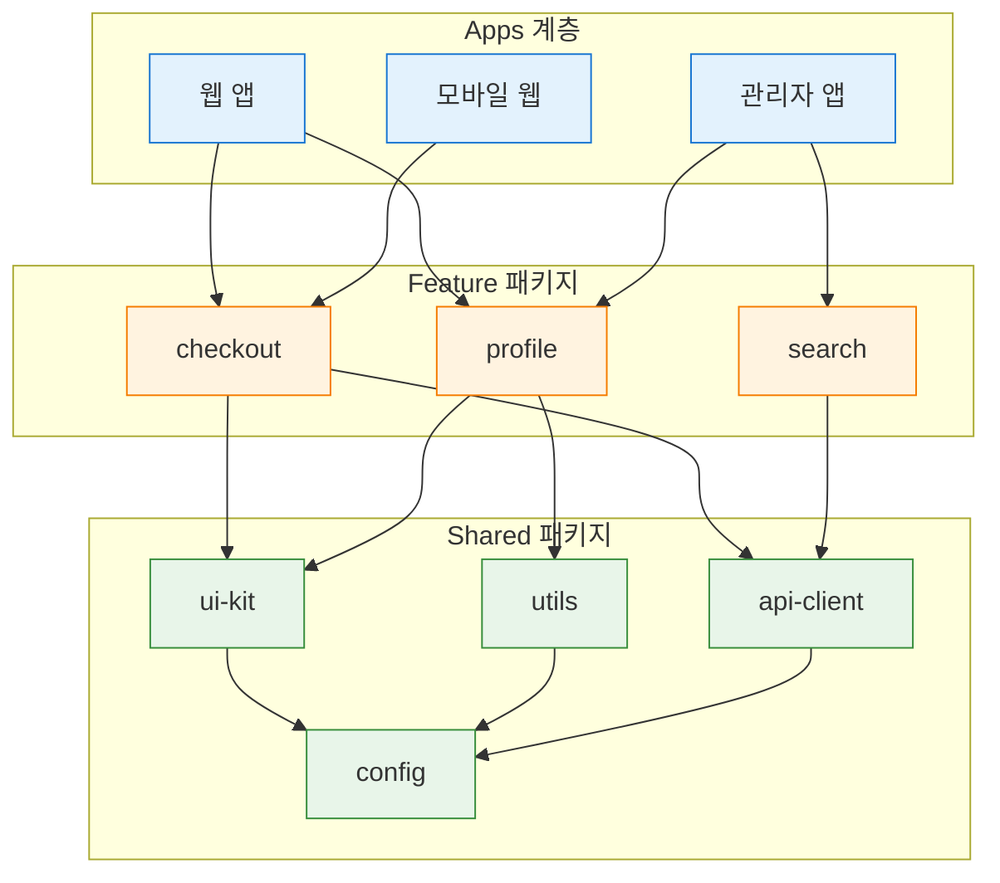

화살표는 의존 방향을 뜻하고, 반드시 위에서 아래로만 흘러야 합니다. 역방향 의존은 boundary lint로 차단합니다.

| 분류 | 아키텍처 & 운영 | 상태 | Stable |
| :--- | :--- | :--- | :--- |
| **연관 가이드** | [04. 아키텍처](./04_아키텍처_설계_패턴.md), [07. 테스팅](./07_테스팅_가이드.md), [11. CI/CD](./11_CICD_파이프라인_표준.md), [16. 코드리뷰](./16_AI_협업_코드리뷰_가이드.md) | **도구 원칙** | 벤더 중립 |
| **핵심 테마** | package boundary, ownership, task graph, cache, versioning, release, governance | **Update** | 최신 기준 |

---

> 모노레포 표준은 특정 빌드 플랫폼이나 원격 캐시 제품이 아니라 **여러 앱과 패키지를 한 저장소에서 안전하고 빠르게 변경하기 위한 ownership, 경계, 자동화 규칙**입니다.

---

## 추천 항목 (실무 우선순위)

- **시작 추천**: package별 소유권과 리뷰 책임자를 먼저 고정해 리뷰 충돌을 줄입니다.
- **안정 추천**: 의존성 그래프 기반 빌드 순서를 고정하고 병목이 큰 패키지부터 캐시 전략을 개선하세요.
- **운영 추천**: 브랜치 정책과 공용 CI 캐시 정책을 정기 점검해 비용/시간 낭비를 줄입니다.

## 추천 항목 고도화 체크

- `즉시 적용` — 추천 항목 1개를 이번 주 내에 실제 작업 1건에 반영한다.
- `1주 내 정리` — 적용 결과를 PR 본문이나 회고 노트에 간단히 기록한다.
- `1개월 내 점검` — 재작업률/리뷰 충돌/배포 이슈 중 적어도 한 항목이 개선되었는지 확인한다.

## 추천 항목 실행 기록 템플릿

- `담당자` : 항목 적용 주체(문서 오너/팀원)를 명시
- `적용일` : 실제 반영된 날짜 및 작업 ID를 남김
- `측정 지표` : 리뷰 충돌/재작업/버그 재발 중 1개 이상 수치로 기록
- `보류 사유` : 적용을 못한 경우 이유를 1줄 기록하고 다음 액션을 지정

## 문서 책임 범위

| 이 문서가 결정하는 것 | 단일 출처로 따르는 문서 |
| :--- | :--- |
| package boundary, task graph, cache, ownership | [04. 아키텍처](./04_아키텍처_설계_패턴.md), [11. CI/CD](./11_CICD_파이프라인_표준.md) |
| shared package release와 migration note | [14. 배포](./14_배포_프로세스_체크리스트.md), [16. 코드리뷰](./16_AI_협업_코드리뷰_가이드.md) |
| MFE와 monorepo의 책임 경계 | [21. 마이크로 프론트엔드](./21_마이크로_프론트엔드_가이드.md) |
| AI가 제안한 package split 검증 책임 | [18. AI 개발 워크플로우](./18_AI_개발_워크플로우_종합.md) |

---

## 0. 모든 프론트엔드 그룹 공통 Baseline

| 영역 | 공통 기준 | 검증 방법 |
| :--- | :--- | :--- |
| **Ownership** | app/package별 owner와 reviewer를 명시 | CODEOWNERS 또는 동등한 규칙 |
| **Boundary** | public API와 internal module을 분리 | import boundary lint |
| **Task graph** | build/test/lint 의존 관계를 선언 | affected command |
| **Cache** | deterministic output만 캐시 | cache key와 output 검증 |
| **Versioning** | 독립/고정 버전 전략을 문서화 | release note |
| **Release** | 변경 패키지와 영향 앱을 자동 계산 | change report |
| **Governance** | 새 패키지 생성, dependency 추가, breaking change 기준 | RFC/ADR |

### 0.0 모노레포 운영 실행 흐름

> 왜 중요한가: 변경 한 줄이 어떤 패키지·앱에 영향을 주는지 그래프로 추적해야 "혹시 모르는데"라는 막연한 두려움이 사라집니다.

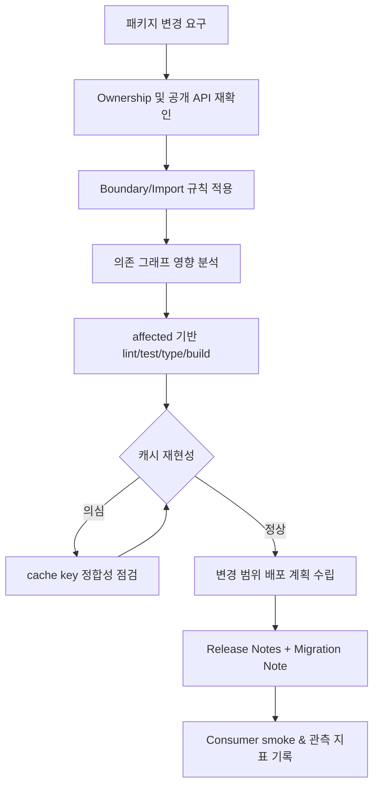

#### Affected 실행 결정 트리

> 일상 비유: 도시락 공장에서 반찬 한 종류만 바꿨다고 모든 도시락을 다시 만들 필요는 없습니다. 그 반찬을 쓰는 메뉴(소비 앱)만 다시 만들면 됩니다.

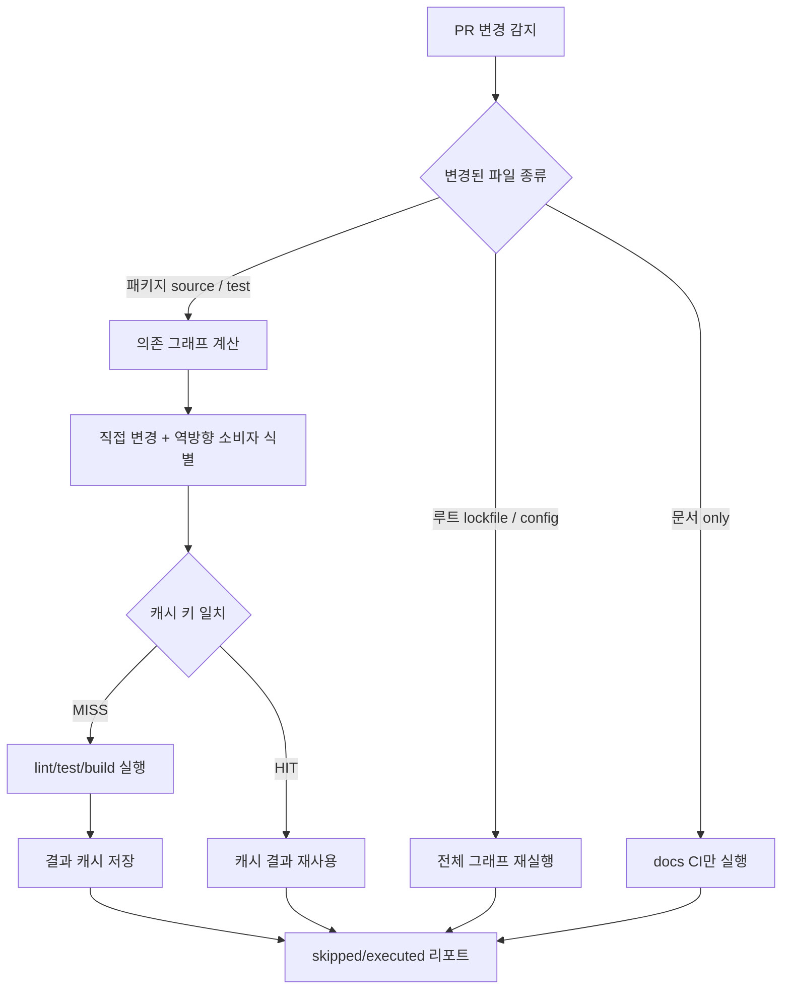

#### 캐시 키 결정 트리

> 캐시 키는 "지문"과 같습니다. 입력이 같으면 같은 출력을 보장해야 하므로 시간·랜덤·외부 네트워크 같은 변동 요소는 키에서 빠져야 합니다.

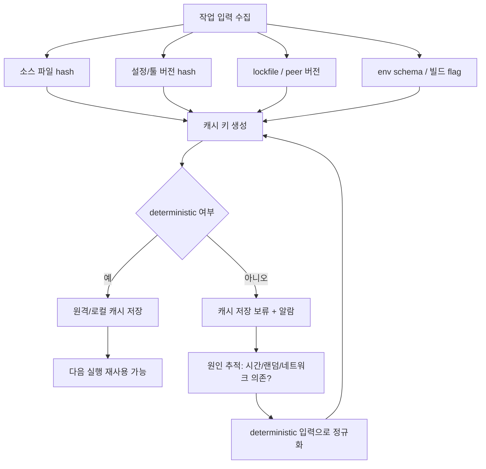

### 0.1 교차 검증 매트릭스

| 권고 | 1차 출처 | 실행 증거 | 운영 증거 | 철회 조건 |
| :--- | :--- | :--- | :--- | :--- |
| package boundary는 lint와 graph로 강제한다 | workspace/package manager 공식 문서 | boundary lint, circular dependency check | cross-package defect, review delay | 저장소 규모가 작아 규칙 비용이 더 큰 경우 |
| affected execution은 CI 기본 경로로 둔다 | 빌드 도구 task graph 문서 | changed package test, cache key audit | CI duration, skipped failure rate | graph 정확도를 신뢰할 수 없을 때 |
| 캐시는 deterministic output만 저장한다 | 빌드 도구 cache 문서 | cache replay test, output hash diff | flaky build, cache miss ratio | 외부 네트워크/시간 의존 output을 제거할 수 없을 때 |
| shared package release는 migration note와 owner를 요구한다 | semver, package release 표준 | changeset/release note validation | breaking change incident | app-only release가 더 단순하고 안전할 때 |

### 0.2 운영 게이트

| Gate | Evidence | Owner | Rollback |
| :--- | :--- | :--- | :--- |
| 패키지 생성 | owner, public API, dependency policy, RFC/ADR 링크 | Package owner | 패키지 생성 보류 또는 app 내부 구현 유지 |
| Boundary 검증 | import boundary lint, circular dependency report | Architecture owner | 잘못된 import revert 또는 public API 보강 |
| Affected 실행 | changed package report, cache key audit, skipped task 목록 | CI owner | full CI 실행으로 회귀 |
| Shared release | changeset, migration note, 영향 앱 테스트 | Release owner | 이전 버전 pin 또는 app-only rollback |

---

## 1. 패키지 분류

> 왜 중요한가: 같은 모노레포 안에서도 "패키지의 정체성"이 달라 책임 범위와 릴리스 주기가 달라집니다. 분류가 흐리면 utils 패키지가 모든 변경의 진앙이 됩니다.

| 유형 | 예시 | 기준 |
| :--- | :--- | :--- |
| App | 사용자에게 배포되는 애플리케이션 | 독립 build/deploy 가능 |
| Feature package | 특정 도메인 기능 | app 간 공유 전 owner 지정 |
| UI package | 디자인 시스템/컴포넌트 | 접근성/테마/RTL 기준 포함 |
| Utility package | 순수 함수, 타입, 설정 | side effect 최소화 |
| Config package | lint, tsconfig, test preset | 변경 영향 범위 명확화 |

공유 패키지는 편의가 아니라 계약입니다. owner, 버전, 테스트, breaking change 정책이 없으면 공유하지 않습니다.

### 1.1 새 패키지 생성 의사결정

> 일상 비유: 새 가게를 같은 상가에 낼지(패키지 신설), 기존 가게의 메뉴로 추가할지(앱 내부 모듈)는 손님 동선과 매출 영향에 달려 있습니다.

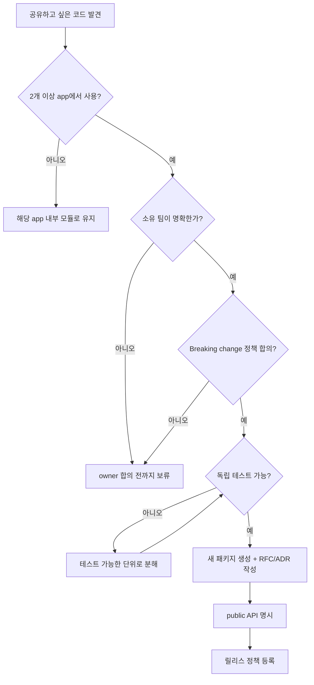

---

## 2. Boundary 규칙

> 왜 중요한가: boundary 없이 자라는 모노레포는 "어디서 무엇을 import 했는지" 추적이 불가능해지고, 패키지 하나의 변경이 예측 못 한 곳까지 번집니다.

| 규칙 | 기준 |
| :--- | :--- |
| Public API | 패키지 root export만 외부 사용 |
| Internal import | 다른 패키지의 `src/internal` 직접 import 금지 |
| Layering | app -> feature -> shared 방향 유지 |
| Circular dependency | CI에서 차단 |
| Side effect | 초기화 코드는 명시적 함수로 분리 |

boundary 위반은 코드 리뷰에서 잡기보다 lint/graph 검사로 자동 차단합니다.

### 2.1 허용 vs 금지 import 패턴

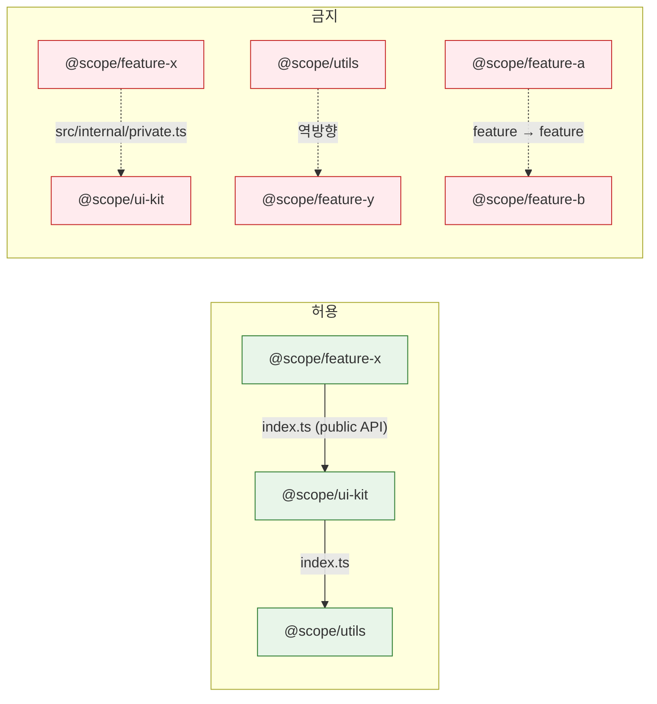

이 그림의 점선(금지)이 한 줄이라도 통과하면 boundary lint가 PR을 막아야 합니다.

---

## 3. Task Graph와 캐시

> 왜 중요한가: 작업의 입력과 출력을 명시해야 "이 일을 다시 할 필요가 있는가"를 기계가 판단할 수 있습니다. task graph는 일의 순서이고, 캐시는 반복 노동을 줄이는 메모입니다.

| 작업 | 입력 | 출력 |
| :--- | :--- | :--- |
| lint | source, config, lockfile | report |
| typecheck | source, tsconfig, generated types | report |
| test | source, test, fixtures | coverage/report |
| build | source, config, env schema | dist |
| storybook/docs | component, stories, tokens | static docs |

캐시는 deterministic해야 합니다. 현재 시간, 랜덤 값, 외부 네트워크, 로컬 절대 경로가 output에 섞이면 캐시 신뢰도가 떨어집니다.

### 3.1 Task Graph 실행 순서

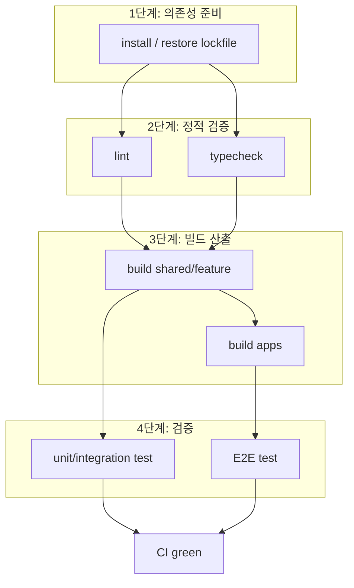

병렬 가능 지점(같은 stage)과 직렬 강제 지점(stage 간)을 분명히 둬야 캐시 hit이 극대화됩니다.

---

## 4. Dependency 운영

> 왜 중요한가: 의존성 한 줄이 번들 크기·보안 패치 SLA·라이선스 의무까지 동시에 결정합니다. 추가는 쉽지만 회수는 어렵습니다.

| 항목 | 기준 |
| :--- | :--- |
| 공통 버전 | 핵심 runtime과 build tool은 중앙에서 관리 |
| 중복 의존성 | bundle과 security 관점에서 주기적으로 확인 |
| 외부 패키지 | license, maintenance, bundle impact 확인 |
| peer dependency | UI/runtime 패키지는 peer 범위 명확화 |
| generated code | 생성 위치와 재생성 명령 문서화 |

의존성 추가는 "개발 편의"뿐 아니라 bundle, 보안, 소유권 비용을 함께 봅니다.

### 4.1 의존성 도입 검토 흐름

> 일상 비유: 새 가구를 사기 전 "치수, 청소 비용, 처분 비용"을 함께 보는 것과 같습니다.

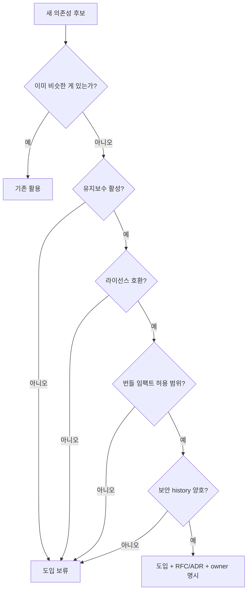

---

## 5. Release 전략

> 왜 중요한가: 같은 모노레포라도 "전체 동기 출시"인지 "팀별 개별 출시"인지에 따라 변경 위험과 협업 비용이 완전히 달라집니다.

| 전략 | 적합한 경우 |
| :--- | :--- |
| Fixed version | 전체 제품군을 같은 버전으로 배포 |
| Independent version | 패키지별 release cadence가 다름 |
| App-only release | 내부 패키지는 versioning 없이 app artifact로만 배포 |

어떤 전략이든 release note에는 변경 패키지, 영향 앱, migration 필요 여부, rollback 가능성을 포함합니다.

### 5.1 릴리스 전략 비교

| 항목 | Fixed | Independent | App-only |
| :--- | :--- | :--- | :--- |
| 버전 정렬 | 모든 패키지 동일 | 패키지별 상이 | 패키지 버전 없음 |
| 변경 추적 | 단순 (한 줄 changelog) | 패키지별 changelog | app 단위 changelog |
| 외부 공개 | 어려움 (강결합) | 가장 적합 | 불가능 |
| Migration 부담 | 모두 함께 이동 | 소비자가 시점 선택 | 항상 최신 |
| 적합 사례 | 단일 제품군 | 디자인 시스템 등 외부 공개 | 사내 전용 모노레포 |

### 5.2 릴리스 상태 머신

> 일상 비유: 출판사가 책을 인쇄하기 전 교정 → 시쇄 → 본인쇄 → 배포로 단계를 끊는 것과 같습니다. 단계마다 되돌릴 수 있어야 합니다.

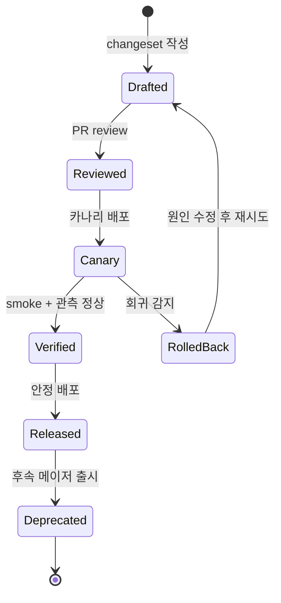

---

## 6. CI 최적화

> 왜 중요한가: 모노레포가 커지면 PR 한 건이 30분짜리 CI를 깨우는 일이 잦아집니다. 최적화의 목표는 "빠르게"가 아니라 "꼭 필요한 작업만 신뢰성 있게" 돌리는 것입니다.

| 최적화 | 기준 |
| :--- | :--- |
| Affected execution | 변경된 패키지와 의존 앱만 실행 |
| Remote/local cache | deterministic output만 저장 |
| Test sharding | 긴 테스트는 shard 분리 |
| Parallelism | task dependency를 지키는 범위에서 병렬화 |
| Artifact reuse | 한 번 만든 build artifact 재사용 |

빠른 CI보다 중요한 것은 신뢰할 수 있는 CI입니다. flaky 테스트와 잘못된 캐시는 전체 모노레포 생산성을 떨어뜨립니다.

### 6.1 CI 파이프라인 시퀀스

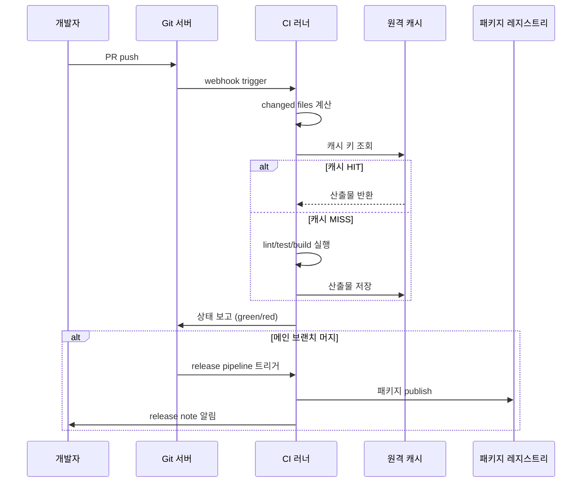

---

## 7. 체크리스트

- [ ] 모든 app/package에 owner가 있는가
- [ ] public API와 internal import 규칙이 자동 검증되는가
- [ ] circular dependency가 CI에서 차단되는가
- [ ] affected graph가 build/test/lint 범위를 계산하는가
- [ ] 캐시 output이 deterministic한가
- [ ] dependency 추가 기준과 license/security 검사가 있는가
- [ ] release note에 영향 앱과 migration 정보가 포함되는가

---

## 8. 제외한 벤더 종속 항목

공통 개발 가이드에는 특정 모노레포 SaaS, 특정 원격 캐시 제공자, 특정 CI 플랫폼, 특정 클라우드 스토리지, 특정 release bot의 설정을 표준으로 포함하지 않습니다. 이 문서에는 어떤 툴체인을 쓰더라도 유지되어야 하는 ownership, boundary, task graph, cache, release governance 기준만 남깁니다.

---

## 실무 적용 가이드

### 언제 이 문서를 펼칠까

- 패키지 경계가 흐려져 import가 얽힐 때
- CI가 모든 앱과 패키지를 매번 빌드해 느릴 때
- 공통 패키지 변경이 소비 앱을 예측 못 하게 깨뜨릴 때

### 적용 순서

1. package owner와 public API를 먼저 정한다.
2. 함께 수정되는 기능 코드는 같은 package 또는 feature 폴더에 둔다.
3. package 간 import rule과 dependency direction을 lint로 막는다.
4. affected graph로 test/build 범위를 계산한다.
5. changeset/changelog와 consumer smoke를 release gate로 둔다.

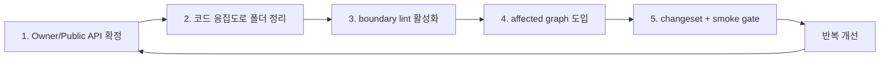

### 함께 두는 파일

- 패키지 안의 source, test, story, fixture, migration note를 함께 둔다.
- 앱 전용 코드는 공통 package로 올리지 않는다.
- 공통 package는 사용처, owner, release policy가 있을 때만 만든다.

### 흔한 실수

- 모든 shared 코드를 하나의 utils package에 넣는다.
- package 내부 파일 deep import를 허용한다.
- affected test 없이 캐시만 믿는다.
- breaking change에 consumer migration을 남기지 않는다.

### PR 완료 기준

- [ ] owner와 public API가 있다.
- [ ] boundary lint가 통과한다.
- [ ] affected test/build가 실행된다.
- [ ] release note와 consumer smoke가 있다.

## 추천 항목 실행 우선순위 매핑

- `P1(7일 내)` — 추천 항목 1개를 우선 적용하고 1회 사용자 관측 신호(에러율/실패율/지연)와 연결한다.
- `P2(30일 내)` — 추천 항목 1개를 팀 내 표준/템플릿에 반영해 재사용성을 확보한다.
- `P3(90일 내)` — 추천 항목 1개를 다른 관련 문서에 역링크로 연동해 중복 작업을 줄인다.
- `완료 기준` — 각 항목별 산출물(예: PR 링크/체크리스트/회고 노트)을 1개 이상 남긴다.

## 추천 항목 실행 체크리스트

- [ ] `1단계(7일)` : 추천 항목 1개를 실제 작업으로 전환
- [ ] `2단계(30일)` : 전환 결과를 팀 산출물(ADR/PR/체크리스트)에 반영
- [ ] `3단계(60일)` : 정적 지표 1개 이상으로 효과 검증
- [ ] `문제 대응` : 미달성 시 보류 사유와 다음 실행 액션을 문서화

## 추천 항목 실행 운영 규칙

- `실행 게이트` : 위험, 비용, 기대 효과가 1회 이상 정량화되어야 적용한다.
- `승인 체계` : 적용 전 사전 승인자(팀 리드/보안/운영)와 rollback 담당자를 확인한다.
- `재개 조건` : 실패 신호가 기준치 이내로 돌아오면 다음 단계로 확장한다.
- `정지 조건` : 회귀 지표 악화가 1개 이상이면 즉시 중단하고 보류 사유를 갱신한다.
- `리스크 점수` : 1~5 등급으로 현재 위험도를 기록하고 정량 기준을 남긴다.
- `리더 승인자` : 최종 승인 책임자(예: 팀 리드/PO/보안리더)를 명시한다.
- `승인 역할` : 승인자, 실행자, 모니터링 주체 역할을 분리해 적는다.
- `재평가 주기` : 최소 2주 단위로 상태를 리뷰하고 조정한다.
