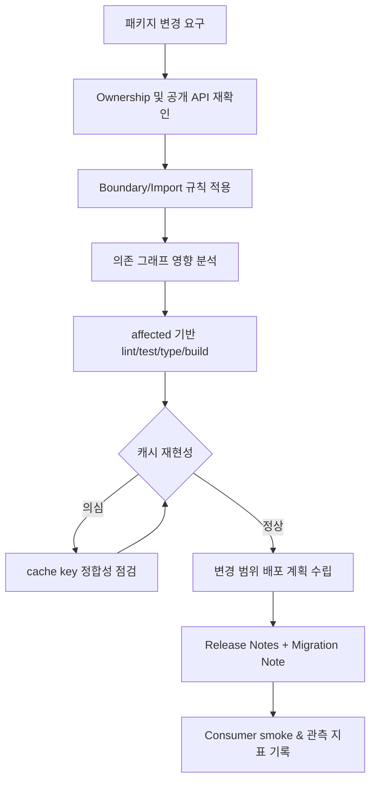

# 22. 모노레포 운영 가이드

> **쉽게 읽기 안내**: 이 문서는 전문 용어가 많을 수 있어요.
> 이해가 어려우면 [공통 용어사전](./00_개발가이드_용어사전.md)에서 먼저 용어 뜻을 확인하고 본문을 이어서 읽으면 이해가 훨씬 빨라집니다.
> 특히 실무에서 자주 쓰이는 `배포`, `CI/CD`, `롤백`, `스키마`처럼 동작이 중요한 용어부터 먼저 익혀보세요.
## 0. 먼저 알고 가기 (30초 요약)

- 모노레포는 관리 포인트를 하나로 묶되, 책임을 패키지 단위로 나눠야 합니다.
- 빌드/테스트 캐시와 의존성 그래프를 기준으로 영향 범위를 계산하세요.
- 팀별 권한 경계가 흐려지면 변경 충돌이 급증합니다.

## 초심자용 한눈에 보기

모노레포는 프로젝트가 커져도 소유권과 변경 범위를 잃지 않게 해주는 운영 구조입니다.

### 핵심 용어 빠르게 정리

| 용어 | 쉬운 뜻 |
| --- | --- |
| `package` | 기능/도메인을 담은 개별 배포 단위 |
| `workspace` | 여러 패키지를 한 번에 관리하는 루트 설정 |
| `소유권` | 어떤 팀이 어떤 패키지를 책임지는지 범위 |
| `태스크 그래프` | 어떤 작업이 먼저/나중에 실행되어야 하는 의존성 맵 |
| `캐시 히트` | 이전 결과를 재사용해 빌드/테스트 시간을 줄인 상태 |

| 분류 | 아키텍처 & 운영 | 상태 | Stable |
| :--- | :--- | :--- | :--- |
| **연관 가이드** | [04. 아키텍처](./04_아키텍처_설계_패턴.md), [07. 테스팅](./07_테스팅_가이드.md), [11. CI/CD](./11_CICD_파이프라인_표준.md), [16. 코드리뷰](./16_AI_협업_코드리뷰_가이드.md) | **도구 원칙** | 벤더 중립 |
| **핵심 테마** | package boundary, ownership, task graph, cache, versioning, release, governance | **Update** | 최신 기준 |

---

> 모노레포 표준은 특정 빌드 플랫폼이나 원격 캐시 제품이 아니라 **여러 앱과 패키지를 한 저장소에서 안전하고 빠르게 변경하기 위한 ownership, 경계, 자동화 규칙**입니다.

---

## 추천 항목 (실무 우선순위)

- **시작 추천**: package별 소유권과 리뷰 책임자를 먼저 고정해 리뷰 충돌을 줄입니다.
- **안정 추천**: 의존성 그래프 기반 빌드 순서를 고정하고 병목이 큰 패키지부터 캐시 전략을 개선하세요.
- **운영 추천**: 브랜치 정책과 공용 CI 캐시 정책을 정기 점검해 비용/시간 낭비를 줄입니다.

## 추천 항목 고도화 체크

- `즉시 적용` — 추천 항목 1개를 이번 주 내에 실제 작업 1건에 반영한다.
- `1주 내 정리` — 적용 결과를 PR 본문이나 회고 노트에 간단히 기록한다.
- `1개월 내 점검` — 재작업률/리뷰 충돌/배포 이슈 중 적어도 한 항목이 개선되었는지 확인한다.

## 추천 항목 실행 기록 템플릿

- `담당자` : 항목 적용 주체(문서 오너/팀원)를 명시
- `적용일` : 실제 반영된 날짜 및 작업 ID를 남김
- `측정 지표` : 리뷰 충돌/재작업/버그 재발 중 1개 이상 수치로 기록
- `보류 사유` : 적용을 못한 경우 이유를 1줄 기록하고 다음 액션을 지정

## 문서 책임 범위

| 이 문서가 결정하는 것 | 단일 출처로 따르는 문서 |
| :--- | :--- |
| package boundary, task graph, cache, ownership | [04. 아키텍처](./04_아키텍처_설계_패턴.md), [11. CI/CD](./11_CICD_파이프라인_표준.md) |
| shared package release와 migration note | [14. 배포](./14_배포_프로세스_체크리스트.md), [16. 코드리뷰](./16_AI_협업_코드리뷰_가이드.md) |
| MFE와 monorepo의 책임 경계 | [21. 마이크로 프론트엔드](./21_마이크로_프론트엔드_가이드.md) |
| AI가 제안한 package split 검증 책임 | [18. AI 개발 워크플로우](./18_AI_개발_워크플로우_종합.md) |

---

## 0. 모든 프론트엔드 그룹 공통 Baseline

| 영역 | 공통 기준 | 검증 방법 |
| :--- | :--- | :--- |
| **Ownership** | app/package별 owner와 reviewer를 명시 | CODEOWNERS 또는 동등한 규칙 |
| **Boundary** | public API와 internal module을 분리 | import boundary lint |
| **Task graph** | build/test/lint 의존 관계를 선언 | affected command |
| **Cache** | deterministic output만 캐시 | cache key와 output 검증 |
| **Versioning** | 독립/고정 버전 전략을 문서화 | release note |
| **Release** | 변경 패키지와 영향 앱을 자동 계산 | change report |
| **Governance** | 새 패키지 생성, dependency 추가, breaking change 기준 | RFC/ADR |

### 0.0 모노레포 운영 실행 흐름

### 0.1 교차 검증 매트릭스

| 권고 | 1차 출처 | 실행 증거 | 운영 증거 | 철회 조건 |
| :--- | :--- | :--- | :--- | :--- |
| package boundary는 lint와 graph로 강제한다 | workspace/package manager 공식 문서 | boundary lint, circular dependency check | cross-package defect, review delay | 저장소 규모가 작아 규칙 비용이 더 큰 경우 |
| affected execution은 CI 기본 경로로 둔다 | 빌드 도구 task graph 문서 | changed package test, cache key audit | CI duration, skipped failure rate | graph 정확도를 신뢰할 수 없을 때 |
| 캐시는 deterministic output만 저장한다 | 빌드 도구 cache 문서 | cache replay test, output hash diff | flaky build, cache miss ratio | 외부 네트워크/시간 의존 output을 제거할 수 없을 때 |
| shared package release는 migration note와 owner를 요구한다 | semver, package release 표준 | changeset/release note validation | breaking change incident | app-only release가 더 단순하고 안전할 때 |

### 0.2 운영 게이트

| Gate | Evidence | Owner | Rollback |
| :--- | :--- | :--- | :--- |
| 패키지 생성 | owner, public API, dependency policy, RFC/ADR 링크 | Package owner | 패키지 생성 보류 또는 app 내부 구현 유지 |
| Boundary 검증 | import boundary lint, circular dependency report | Architecture owner | 잘못된 import revert 또는 public API 보강 |
| Affected 실행 | changed package report, cache key audit, skipped task 목록 | CI owner | full CI 실행으로 회귀 |
| Shared release | changeset, migration note, 영향 앱 테스트 | Release owner | 이전 버전 pin 또는 app-only rollback |

---

## 1. 패키지 분류

| 유형 | 예시 | 기준 |
| :--- | :--- | :--- |
| App | 사용자에게 배포되는 애플리케이션 | 독립 build/deploy 가능 |
| Feature package | 특정 도메인 기능 | app 간 공유 전 owner 지정 |
| UI package | 디자인 시스템/컴포넌트 | 접근성/테마/RTL 기준 포함 |
| Utility package | 순수 함수, 타입, 설정 | side effect 최소화 |
| Config package | lint, tsconfig, test preset | 변경 영향 범위 명확화 |

공유 패키지는 편의가 아니라 계약입니다. owner, 버전, 테스트, breaking change 정책이 없으면 공유하지 않습니다.

---

## 2. Boundary 규칙

| 규칙 | 기준 |
| :--- | :--- |
| Public API | 패키지 root export만 외부 사용 |
| Internal import | 다른 패키지의 `src/internal` 직접 import 금지 |
| Layering | app -> feature -> shared 방향 유지 |
| Circular dependency | CI에서 차단 |
| Side effect | 초기화 코드는 명시적 함수로 분리 |

boundary 위반은 코드 리뷰에서 잡기보다 lint/graph 검사로 자동 차단합니다.

---

## 3. Task Graph와 캐시

| 작업 | 입력 | 출력 |
| :--- | :--- | :--- |
| lint | source, config, lockfile | report |
| typecheck | source, tsconfig, generated types | report |
| test | source, test, fixtures | coverage/report |
| build | source, config, env schema | dist |
| storybook/docs | component, stories, tokens | static docs |

캐시는 deterministic해야 합니다. 현재 시간, 랜덤 값, 외부 네트워크, 로컬 절대 경로가 output에 섞이면 캐시 신뢰도가 떨어집니다.

---

## 4. Dependency 운영

| 항목 | 기준 |
| :--- | :--- |
| 공통 버전 | 핵심 runtime과 build tool은 중앙에서 관리 |
| 중복 의존성 | bundle과 security 관점에서 주기적으로 확인 |
| 외부 패키지 | license, maintenance, bundle impact 확인 |
| peer dependency | UI/runtime 패키지는 peer 범위 명확화 |
| generated code | 생성 위치와 재생성 명령 문서화 |

의존성 추가는 "개발 편의"뿐 아니라 bundle, 보안, 소유권 비용을 함께 봅니다.

---

## 5. Release 전략

| 전략 | 적합한 경우 |
| :--- | :--- |
| Fixed version | 전체 제품군을 같은 버전으로 배포 |
| Independent version | 패키지별 release cadence가 다름 |
| App-only release | 내부 패키지는 versioning 없이 app artifact로만 배포 |

어떤 전략이든 release note에는 변경 패키지, 영향 앱, migration 필요 여부, rollback 가능성을 포함합니다.

---

## 6. CI 최적화

| 최적화 | 기준 |
| :--- | :--- |
| Affected execution | 변경된 패키지와 의존 앱만 실행 |
| Remote/local cache | deterministic output만 저장 |
| Test sharding | 긴 테스트는 shard 분리 |
| Parallelism | task dependency를 지키는 범위에서 병렬화 |
| Artifact reuse | 한 번 만든 build artifact 재사용 |

빠른 CI보다 중요한 것은 신뢰할 수 있는 CI입니다. flaky 테스트와 잘못된 캐시는 전체 모노레포 생산성을 떨어뜨립니다.

---

## 7. 체크리스트

- [ ] 모든 app/package에 owner가 있는가
- [ ] public API와 internal import 규칙이 자동 검증되는가
- [ ] circular dependency가 CI에서 차단되는가
- [ ] affected graph가 build/test/lint 범위를 계산하는가
- [ ] 캐시 output이 deterministic한가
- [ ] dependency 추가 기준과 license/security 검사가 있는가
- [ ] release note에 영향 앱과 migration 정보가 포함되는가

---

## 8. 제외한 벤더 종속 항목

공통 개발 가이드에는 특정 모노레포 SaaS, 특정 원격 캐시 제공자, 특정 CI 플랫폼, 특정 클라우드 스토리지, 특정 release bot의 설정을 표준으로 포함하지 않습니다. 이 문서에는 어떤 툴체인을 쓰더라도 유지되어야 하는 ownership, boundary, task graph, cache, release governance 기준만 남깁니다.

---

## 실무 적용 가이드

### 언제 이 문서를 펼칠까

- 패키지 경계가 흐려져 import가 얽힐 때
- CI가 모든 앱과 패키지를 매번 빌드해 느릴 때
- 공통 패키지 변경이 소비 앱을 예측 못 하게 깨뜨릴 때

### 적용 순서

1. package owner와 public API를 먼저 정한다.
2. 함께 수정되는 기능 코드는 같은 package 또는 feature 폴더에 둔다.
3. package 간 import rule과 dependency direction을 lint로 막는다.
4. affected graph로 test/build 범위를 계산한다.
5. changeset/changelog와 consumer smoke를 release gate로 둔다.

### 함께 두는 파일

- 패키지 안의 source, test, story, fixture, migration note를 함께 둔다.
- 앱 전용 코드는 공통 package로 올리지 않는다.
- 공통 package는 사용처, owner, release policy가 있을 때만 만든다.

### 흔한 실수

- 모든 shared 코드를 하나의 utils package에 넣는다.
- package 내부 파일 deep import를 허용한다.
- affected test 없이 캐시만 믿는다.
- breaking change에 consumer migration을 남기지 않는다.

### PR 완료 기준

- [ ] owner와 public API가 있다.
- [ ] boundary lint가 통과한다.
- [ ] affected test/build가 실행된다.
- [ ] release note와 consumer smoke가 있다.
