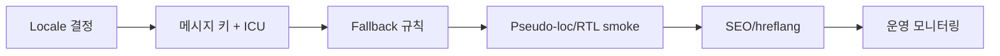
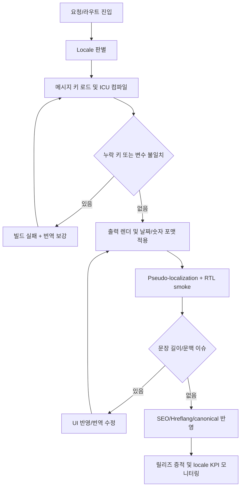
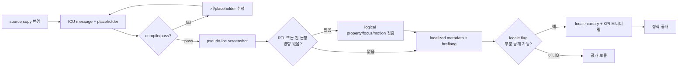
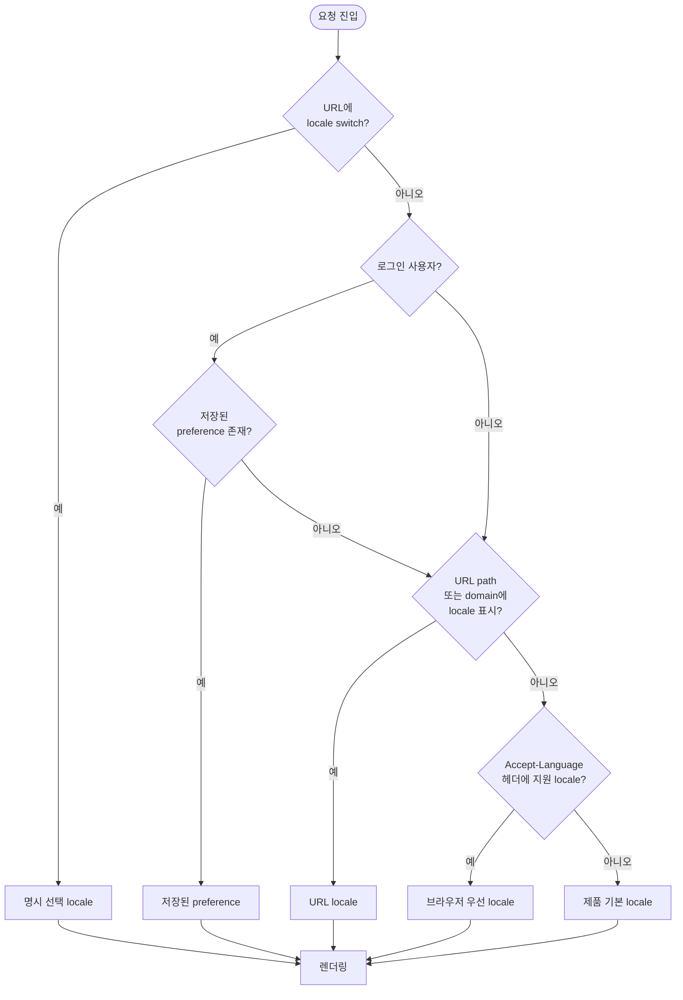
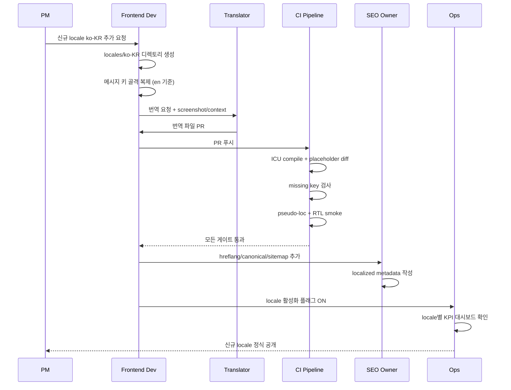
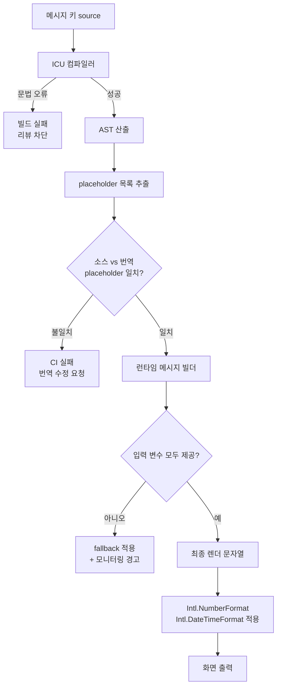
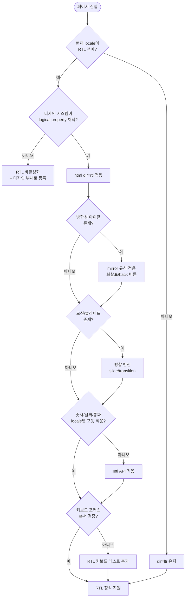
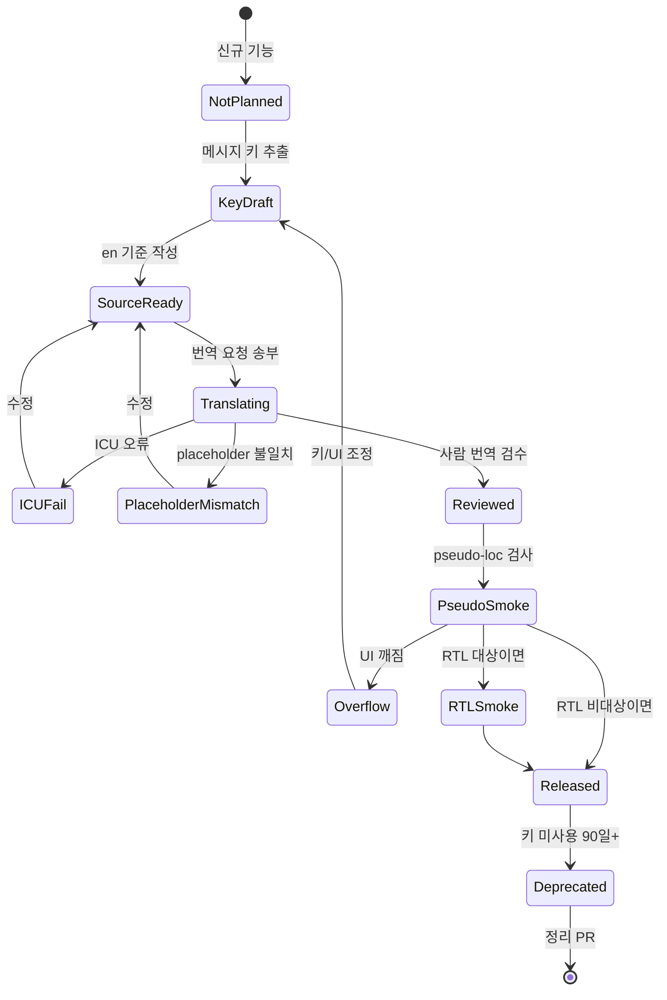
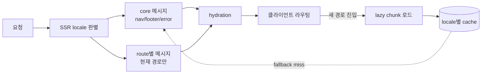

# 23. 국제화 가이드

## 0. 먼저 알고 가기 (30초 요약)

- 번역 키는 기능 요구보다 먼저 만들어져야 유지보수가 쉬워집니다.
- 숫자/날짜/문장 길이까지 언어별 차이를 먼저 반영하면 QA 비용이 줄어듭니다.
- 릴리즈마다 누락 키를 회귀 검사하도록 자동화하세요.

> **왜 중요한가**: 국제화는 "번역만 하면 끝"이 아닙니다. 문장 길이, 숫자/날짜 포맷, 방향성, SEO, 폰트, 캐시 키까지 영향을 받기 때문에, 나중에 추가하면 모든 화면을 재작업해야 하는 큰 부채가 됩니다.
>
> **일상 비유**: 옷 사이즈 표기와 같습니다. S/M/L만 적은 옷은 한국에서는 통해도, 유럽에서는 cm와 inch를 함께 표기해야 환불률이 줄어듭니다. "한 번 잘 설계하면 모든 시장에서 통하는" 영역입니다.

## 초심자용 한눈에 보기

국제화는 번역 품질뿐 아니라 운영까지 잡아야 하는 실무 주제입니다.



### 핵심 용어 빠르게 정리

| 용어          | 쉬운 뜻                                 |
| ------------- | --------------------------------------- |
| `locale`      | 지역/언어 설정 값(ko-KR 등)             |
| `번역 키`     | 다국어 문자열을 찾는 고유 식별자        |
| `placeholder` | 변수 치환 부분 예: `{name}`             |
| `RTL`         | 오른쪽에서 왼쪽으로 쓰는 언어 정렬 방향 |
| `용어집`      | 품질을 맞추기 위해 통일한 번역 사전     |

| 분류            | 제품 품질 & 글로벌                                                                                                                                                    | 상태          | Stable    |
| :-------------- | :-------------------------------------------------------------------------------------------------------------------------------------------------------------------- | :------------ | :-------- |
| **연관 가이드** | [02. React 19](./02_React19_실무_가이드.md), [08. 성능](./08_성능_최적화_가이드.md), [19. 접근성](./19_웹_접근성_가이드.md), [24. SEO](./24_SEO_메타데이터_가이드.md) | **도구 원칙** | 벤더 중립 |
| **핵심 테마**   | locale routing, ICU message, 번역 QA, pseudo-localization, RTL, fallback, SEO                                                                                         | **Update**    | 최신 기준 |

---

> 국제화 표준은 특정 번역 SaaS나 AI 모델 사용법이 아니라 **언어, 지역, 방향성, 포맷, 검색 노출, 번역 품질을 제품 구조 안에서 지속 가능하게 관리하는 방식**입니다.

---

## 추천 항목 (실무 우선순위)

- **시작 추천**: locale 우선순위(`URL`/`쿠키`/`헤더`)와 fallback 규칙을 먼저 정합니다.
- **안정 추천**: 번역 키 충돌/누락을 CI에서 잡고, 중요 문구는 번역 품질 샘플로 사전 검증하세요.
- **운영 추천**: RTL, 통화/날짜 포맷은 지역별 테스터 계정으로 주기 점검합니다.

## 추천 항목 고도화 체크

- `첫 적용` — locale routing, ICU message, fallback, RTL smoke 중 하나를 실제 PR이나 운영 이슈에 붙이고, 변경 전 기준을 먼저 적는다.
- `증거 정리` — message compile, placeholder diff, pseudo-loc screenshot, hreflang 검사를 같은 작업 기록에 남긴다.
- `재점검` — missing key, overflow defect, locale SEO mismatch가 나아졌는지 30일 안에 확인하고 기준을 유지, 수정, 폐기 중 하나로 판정한다.

## 추천 항목 실행 기록 템플릿

- `작업` : locale routing, ICU message, fallback, RTL smoke 적용 범위를 어느 화면, 패키지, 문서에 둘지 적는다.
- `증거` : message compile, placeholder diff, pseudo-loc screenshot, hreflang 검사 중 실제로 남긴 항목만 링크한다.
- `판정` : 유지/수정/폐기 중 하나와 이유를 한 문장으로 남긴다.
- `다음 점검` : missing key, overflow defect, locale SEO mismatch를 다시 볼 날짜와 담당자를 지정한다.

## 문서 책임 범위

| 이 문서가 결정하는 것                                      | 단일 출처로 따르는 문서                                                                      |
| :--------------------------------------------------------- | :------------------------------------------------------------------------------------------- |
| locale 결정, message format, fallback, pseudo-localization | [02. React 19](./02_React19_실무_가이드.md), [07. 테스팅](./07_테스팅_가이드.md)             |
| hreflang, canonical, localized metadata                    | [24. SEO 메타데이터](./24_SEO_메타데이터_가이드.md)                                          |
| RTL, accessible name, 번역 후 UI 접근성                    | [19. 웹 접근성](./19_웹_접근성_가이드.md), [20. 디자인 시스템](./20_디자인_시스템_가이드.md) |
| AI 번역 사용과 민감정보/검증 책임                          | [18. AI 개발 워크플로우](./18_AI_개발_워크플로우_종합.md)                                    |

---

## 0. 모든 프론트엔드 그룹 공통 Baseline

| 영역                    | 공통 기준                                                  | 검증 방법          |
| :---------------------- | :--------------------------------------------------------- | :----------------- |
| **Locale 전략**         | URL, 쿠키, 계정 설정, 브라우저 언어 우선순위 명시          | routing test       |
| **Message format**      | 변수, plural, select, date/number 포맷을 구조화            | compile check      |
| **Fallback**            | 누락 번역, 미지원 locale, 오래된 번역 fallback 정의        | missing key report |
| **Pseudo-localization** | UI overflow와 hard-coded text 검출                         | visual smoke       |
| **RTL**                 | layout, icon direction, focus order, motion direction 검증 | RTL test           |
| **SEO**                 | canonical, hreflang, localized metadata 관리               | SEO audit          |
| **QA**                  | placeholder 보존, 용어집, tone, 길이, 접근성 검수          | translation QA     |

### 0.0 국제화 처리 플로우



### 0.1 교차 검증 매트릭스

| 권고                                                     | 1차 출처                         | 실행 증거                                  | 운영 증거                          | 철회 조건                                 |
| :------------------------------------------------------- | :------------------------------- | :----------------------------------------- | :--------------------------------- | :---------------------------------------- |
| 메시지는 ICU/plural/select 같은 구조화 format을 사용한다 | Unicode CLDR/ICU MessageFormat   | compile check, placeholder diff            | 번역 오류, locale-specific bug     | 단일 언어 또는 극소수 정적 copy만 다룰 때 |
| URL locale, canonical, hreflang을 일관되게 관리한다      | 검색엔진/HTML link relation 문서 | route SEO test, sitemap validation         | indexed locale mismatch            | 검색 노출이 필요 없는 내부 도구일 때      |
| pseudo-localization을 release smoke에 포함한다           | i18n QA best practice            | visual overflow test, hard-coded text scan | overflow defect, missing key count | 번역 대상 UI가 아직 없을 때               |
| RTL은 logical property와 컴포넌트 테스트로 검증한다      | CSS logical properties, WAI/WCAG | RTL visual diff, keyboard navigation       | RTL-only defect, support ticket    | 지원 locale에 RTL 언어가 없을 때          |

### 0.2 운영 게이트

| Gate             | Evidence                                                     | Owner         | Rollback                               |
| :--------------- | :----------------------------------------------------------- | :------------ | :------------------------------------- |
| Locale 추가      | routing test, fallback rule, SEO metadata 확인               | I18n owner    | locale 비활성화 또는 제한 공개         |
| 메시지 변경      | ICU compile, placeholder diff, missing key report            | Content owner | 이전 번역 복구 또는 fallback 적용      |
| Pseudo/RTL smoke | overflow screenshot, hard-coded text scan, RTL keyboard test | QA owner      | release 차단 또는 affected locale 제외 |
| SEO 국제화       | canonical/hreflang/sitemap validation                        | SEO owner     | sitemap 제외 또는 canonical rollback   |

### 0.2.1 Locale 공개 전 증거 흐름



---

## 1. Locale 결정 규칙

> **왜 중요한가**: locale 우선순위가 서버/클라이언트/SEO마다 다르면 한 사용자가 한 페이지에서 서로 다른 언어가 섞여 보입니다. hydration 불일치 버그의 가장 흔한 원인입니다.

| 우선순위 | 기준                              |
| :------- | :-------------------------------- |
| 1        | 사용자가 명시적으로 선택한 locale |
| 2        | 로그인 사용자의 저장된 preference |
| 3        | URL path/domain의 locale          |
| 4        | 브라우저 `Accept-Language`        |
| 5        | 제품 기본 locale                  |

locale 결정 규칙은 서버 렌더링, 클라이언트 라우팅, API 호출, SEO metadata에서 동일하게 적용되어야 합니다.

### 1.1 Locale 결정 의사결정 트리



### 1.2 신규 언어/로케일 추가 시퀀스



비유: 새 매장을 오픈하는 것과 같습니다. 메뉴판(번역) → 가격표(숫자/통화) → 간판(SEO) → POS 시스템(라우팅) 순서로 준비해야 첫 손님이 헤매지 않습니다.

---

## 2. 메시지 작성 원칙

> **왜 중요한가**: 문장 조각을 이어 붙이는 방식은 영어에서는 자연스러워도, 어순/조사/관사가 다른 언어에서는 문법이 깨집니다. ICU 같은 구조화 포맷을 처음부터 쓰는 것이 가장 저렴한 보험입니다.

| 원칙               | 기준                                       |
| :----------------- | :----------------------------------------- |
| 문장 단위          | 단어 조각을 이어 붙이지 않음               |
| 변수 명확화        | `{count}`, `{userName}`처럼 의미 있는 이름 |
| plural/select 사용 | 수량과 성별/상태 분기를 문법적으로 처리    |
| HTML 분리          | 번역 문자열에 임의 HTML 삽입 금지          |
| 문맥 제공          | 번역자에게 화면, 목적, 제한 길이 제공      |

```json
{
  "cart.items": "{count, plural, =0 {No items} one {# item} other {# items}}",
  "order.status": "{status, select, paid {Paid} failed {Failed} pending {Pending} other {Unknown}}"
}
```

### 2.1 ICU 메시지 처리 흐름



비유: 케이크 데코레이션 틀과 같습니다. 글자 한 줄을 직접 짜내는 게 아니라, "이 자리에 이름, 이 자리에 나이"라는 틀(ICU)에 맞춰 짜야 모든 케이크가 일관됩니다.

---

## 3. 번역 키 구조

| 방식           | 기준                       |
| :------------- | :------------------------- |
| Domain 기반    | `checkout.payment.submit`  |
| Component 기반 | 재사용 컴포넌트 내부 label |
| Error 기반     | `error.network.timeout`    |
| Metadata 기반  | `seo.product.title`        |

키 이름은 화면 위치보다 의미를 담아야 합니다. `button.submit`보다 `checkout.payment.submit`이 추적과 변경에 유리합니다.

---

## 4. 번역 QA

| 검사        | 기준                                 |
| :---------- | :----------------------------------- |
| 누락 키     | build 또는 CI에서 실패               |
| 미사용 키   | 주기적으로 정리                      |
| placeholder | 원문과 번역의 변수 목록 일치         |
| ICU syntax  | compile 단계에서 검증                |
| 길이        | 버튼, 탭, 카드, 표에서 overflow 확인 |
| 용어집      | 제품 용어와 금지어 검사              |
| 접근성      | 번역 후 accessible name 의미 유지    |

AI 번역을 사용하더라도 placeholder, plural, tone, legal copy는 자동 검증과 사람 검토가 필요합니다.

---

## 5. Pseudo-localization

Pseudo-localization은 실제 번역 전에 UI 구조 문제를 찾는 가장 저렴한 방법입니다.

| 검출 대상       | 예시                                 |
| :-------------- | :----------------------------------- |
| hard-coded text | 번역 파일을 거치지 않는 문자열       |
| overflow        | 긴 문자열에서 버튼/카드 깨짐         |
| concatenation   | 문법이 깨지는 문자열 조합            |
| missing key     | fallback text 노출                   |
| bidi 문제       | RTL에서 punctuation/number 방향 문제 |

release 전 핵심 flow는 pseudo locale에서 한 번 이상 확인합니다.

---

## 6. RTL 지원

> **왜 중요한가**: 아랍어/히브리어 등 RTL 언어는 단순 텍스트 방향뿐 아니라 메뉴 위치, 아이콘 화살표, 모션 방향, 키보드 포커스 순서까지 영향을 줍니다. 뒤늦게 대응하면 거의 모든 컴포넌트를 재작업해야 합니다.

| 영역   | 기준                                          |
| :----- | :-------------------------------------------- |
| Layout | `left/right`보다 logical property 사용        |
| Icon   | 방향성이 있는 아이콘은 mirror 기준 정의       |
| Motion | slide/transition 방향 검토                    |
| Focus  | keyboard 이동 순서 확인                       |
| Data   | 전화번호, 날짜, 통화, 주소 포맷 locale별 처리 |

RTL은 단순히 `dir="rtl"`을 붙이는 작업이 아닙니다. 디자인 시스템 토큰과 컴포넌트 레벨에서 지원해야 합니다.

### 6.1 RTL 전환 결정 트리



### 6.2 i18n 상태 다이어그램



비유: RTL 지원은 거울 방에서 작업하는 것과 같습니다. 좌우 개념을 직접 박지 말고, "시작쪽(inline-start)/끝쪽(inline-end)"이라는 추상 좌표를 사용해야 거울 안에서도 의미가 유지됩니다.

---

## 7. SEO와 라우팅

| 항목      | 기준                                            |
| :-------- | :---------------------------------------------- |
| URL       | locale이 안정적으로 드러나는 URL 구조           |
| Canonical | 중복 URL 정리                                   |
| Hreflang  | 지역/언어 대체 페이지 연결                      |
| Metadata  | title, description, Open Graph 번역             |
| Sitemap   | locale별 URL 포함                               |
| Redirect  | 자동 redirect가 crawler 접근을 막지 않도록 설계 |

검색 노출이 중요한 페이지는 클라이언트에서만 번역하지 말고, 서버/빌드 단계에서 localized metadata를 제공해야 합니다.

---

## 8. 성능 기준

> **왜 중요한가**: 글로벌 제품에서 locale 데이터는 가장 빠르게 비대해지는 자산입니다. 초기에 lazy 로딩 전략을 박지 않으면, locale 추가마다 LCP가 선형으로 악화됩니다.

| 항목           | 기준                                       |
| :------------- | :----------------------------------------- |
| 번역 번들      | 현재 locale과 route에 필요한 메시지만 로드 |
| 폰트           | locale별 subset, fallback, preload 최소화  |
| 날짜/숫자 포맷 | 표준 Intl API 우선                         |
| 캐시           | locale별 cache key와 fallback 명확화       |
| hydration      | 서버/클라이언트 locale 불일치 방지         |

모든 locale 번역을 초기 번들에 넣으면 글로벌 제품일수록 성능이 급격히 나빠집니다.

### 8.1 번역 번들 로딩 전략



---

## 9. 체크리스트

- [ ] locale 결정 우선순위가 문서화되어 있는가
- [ ] 메시지가 plural/select/date/number 포맷을 지원하는가
- [ ] 누락/미사용 키와 placeholder 불일치가 CI에서 잡히는가
- [ ] pseudo-localization으로 overflow와 hard-coded text를 확인하는가
- [ ] RTL locale에서 layout, icon, focus, motion을 검증하는가
- [ ] hreflang/canonical/metadata/sitemap이 locale별로 생성되는가
- [ ] AI 번역 결과를 용어집, placeholder, 사람 검토로 검증하는가

---

## 10. 제외한 벤더 종속 항목

공통 개발 가이드에는 특정 번역 SaaS, 특정 AI 번역 모델, 특정 알림 도구, 특정 OTA 번역 SDK, 특정 배포 플랫폼의 워크플로우를 표준으로 포함하지 않습니다. 이 문서에는 어떤 국제화 도구를 쓰더라도 유지되어야 하는 locale, message format, QA, RTL, SEO, 성능 기준만 남깁니다.

---

## 실무 적용 가이드

### 언제 이 문서를 펼칠까

- 문자열 길이, 복수형, RTL, locale routing이 뒤늦게 문제될 때
- AI 번역 결과가 placeholder나 법무 문구를 깨뜨릴 때
- locale bundle이 성능을 악화시킬 때

### 적용 순서

1. locale 결정 규칙과 fallback 순서를 정한다.
2. ICU message로 plural/select/placeholder를 구조화한다.
3. 번역 키, source text, screenshot/context를 함께 관리한다.
4. pseudo-localization과 RTL smoke를 핵심 flow에 적용한다.
5. message compile, placeholder diff, locale SEO를 CI에서 확인한다.

### 함께 두는 파일

- feature별 메시지, screenshot context, test를 기능 폴더에 둔다.
- 전역 navigation/공통 컴포넌트 메시지만 shared i18n에 둔다.
- locale route metadata는 SEO 문서와 연결한다.

### 흔한 실수

- 문장 조각을 이어 붙인다.
- placeholder 검증 없이 번역을 merge한다.
- RTL에서 margin/padding 방향을 하드코딩한다.
- 모든 locale 메시지를 초기 번들에 넣는다.

### PR 완료 기준

- [ ] message compile이 통과한다.
- [ ] placeholder/plural 검증이 있다.
- [ ] pseudo-loc/RTL 핵심 flow가 통과한다.
- [ ] locale bundle 영향이 확인되었다.

## 추천 항목 실행 우선순위 매핑

- `P1(7일 내)` — locale routing, ICU message, fallback, RTL smoke 중 하나를 작은 변경 1건에 적용하고 증거(message compile)를 남긴다.
- `P2(30일 내)` — 국제화 기준을 팀 템플릿, 체크리스트, CI 중 한 곳에 고정한다.
- `P3(90일 내)` — missing key, overflow defect, locale SEO mismatch 추이를 보고 기준을 유지할지 조정할지 결정한다.
- `완료 기준` — i18n 오너가 증거와 철회 조건을 확인했다는 기록을 남긴다.

## 추천 항목 실행 체크리스트

- [ ] `1단계(7일)` : locale routing, ICU message, fallback, RTL smoke 적용 대상을 1개로 좁힌다.
- [ ] `2단계(30일)` : 증거(message compile, placeholder diff, pseudo-loc screenshot, hreflang 검사)를 PR, ADR, 회고 중 한 곳에 연결한다.
- [ ] `3단계(60일)` : missing key, overflow defect, locale SEO mismatch가 기준 안에 들어왔는지 확인한다.
- [ ] `문제 대응` : 미달성 사유와 다음 조치, 중단 여부를 같은 기록에 남긴다.

## 추천 항목 실행 운영 규칙

- `실행 게이트` : 번역 전에 변수, plural, fallback 규칙이 구조화됐는지 확인한다.
- `승인 체계` : i18n 오너가 영향 범위와 rollback 담당자를 적용 전에 확인한다.
- `재개 조건` : pseudo-loc/RTL smoke와 SEO metadata가 통과하면 locale을 공개한다.
- `정지 조건` : placeholder 깨짐이나 hard-coded text가 남으면 release를 막는다.
- `리스크 점수` : 지원 locale 수, 법적 문구, RTL 여부로 산정한다.
- `리더 승인자` : 글로벌 UX 리드가 최종 승인 책임을 맡는다.
- `승인 역할` : 국제화 작성자, 검토자, 운영 확인자를 분리해 기록한다.
- `재평가 주기` : locale 추가와 copy 변경 때마다 QA 샘플을 갱신한다.
