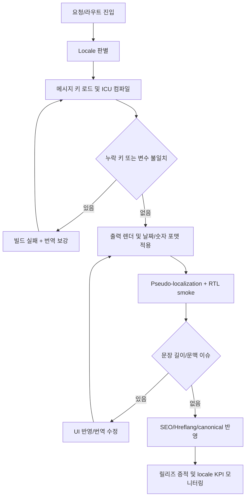

# 23. 국제화 가이드

> **쉽게 읽기 안내**: 이 문서는 전문 용어가 많을 수 있어요.
> 이해가 어려우면 [공통 용어사전](./00_개발가이드_용어사전.md)에서 먼저 용어 뜻을 확인하고 본문을 이어서 읽으면 이해가 훨씬 빨라집니다.
> 특히 실무에서 자주 쓰이는 `배포`, `CI/CD`, `롤백`, `스키마`처럼 동작이 중요한 용어부터 먼저 익혀보세요.
## 0. 먼저 알고 가기 (30초 요약)

- 번역 키는 기능 요구보다 먼저 만들어져야 유지보수가 쉬워집니다.
- 숫자/날짜/문장 길이까지 언어별 차이를 먼저 반영하면 QA 비용이 줄어듭니다.
- 릴리즈마다 누락 키를 회귀 검사하도록 자동화하세요.

## 초심자용 한눈에 보기

국제화는 번역 품질뿐 아니라 운영까지 잡아야 하는 실무 주제입니다.

### 핵심 용어 빠르게 정리

| 용어 | 쉬운 뜻 |
| --- | --- |
| `locale` | 지역/언어 설정 값(ko-KR 등) |
| `번역 키` | 다국어 문자열을 찾는 고유 식별자 |
| `placeholder` | 변수 치환 부분 예: `{name}` |
| `RTL` | 오른쪽에서 왼쪽으로 쓰는 언어 정렬 방향 |
| `용어집` | 품질을 맞추기 위해 통일한 번역 사전 |


| 분류 | 제품 품질 & 글로벌 | 상태 | Stable |
| :--- | :--- | :--- | :--- |
| **연관 가이드** | [02. React 19](./02_React19_실무_가이드.md), [08. 성능](./08_성능_최적화_가이드.md), [19. 접근성](./19_웹_접근성_가이드.md), [24. SEO](./24_SEO_메타데이터_가이드.md) | **도구 원칙** | 벤더 중립 |
| **핵심 테마** | locale routing, ICU message, 번역 QA, pseudo-localization, RTL, fallback, SEO | **Update** | 최신 기준 |

---

> 국제화 표준은 특정 번역 SaaS나 AI 모델 사용법이 아니라 **언어, 지역, 방향성, 포맷, 검색 노출, 번역 품질을 제품 구조 안에서 지속 가능하게 관리하는 방식**입니다.

---


## 추천 항목 (실무 우선순위)

- **시작 추천**: locale 우선순위(`URL`/`쿠키`/`헤더`)와 fallback 규칙을 먼저 정합니다.
- **안정 추천**: 번역 키 충돌/누락을 CI에서 잡고, 중요 문구는 번역 품질 샘플로 사전 검증하세요.
- **운영 추천**: RTL, 통화/날짜 포맷은 지역별 테스터 계정으로 주기 점검합니다.


## 추천 항목 고도화 체크

- `즉시 적용` — 추천 항목 1개를 이번 주 내에 실제 작업 1건에 반영한다.
- `1주 내 정리` — 적용 결과를 PR 본문이나 회고 노트에 간단히 기록한다.
- `1개월 내 점검` — 재작업률/리뷰 충돌/배포 이슈 중 적어도 한 항목이 개선되었는지 확인한다.


## 추천 항목 실행 기록 템플릿

- `담당자` : 항목 적용 주체(문서 오너/팀원)를 명시
- `적용일` : 실제 반영된 날짜 및 작업 ID를 남김
- `측정 지표` : 리뷰 충돌/재작업/버그 재발 중 1개 이상 수치로 기록
- `보류 사유` : 적용을 못한 경우 이유를 1줄 기록하고 다음 액션을 지정

## 문서 책임 범위

| 이 문서가 결정하는 것 | 단일 출처로 따르는 문서 |
| :--- | :--- |
| locale 결정, message format, fallback, pseudo-localization | [02. React 19](./02_React19_실무_가이드.md), [07. 테스팅](./07_테스팅_가이드.md) |
| hreflang, canonical, localized metadata | [24. SEO 메타데이터](./24_SEO_메타데이터_가이드.md) |
| RTL, accessible name, 번역 후 UI 접근성 | [19. 웹 접근성](./19_웹_접근성_가이드.md), [20. 디자인 시스템](./20_디자인_시스템_가이드.md) |
| AI 번역 사용과 민감정보/검증 책임 | [18. AI 개발 워크플로우](./18_AI_개발_워크플로우_종합.md) |

---

## 0. 모든 프론트엔드 그룹 공통 Baseline

| 영역 | 공통 기준 | 검증 방법 |
| :--- | :--- | :--- |
| **Locale 전략** | URL, 쿠키, 계정 설정, 브라우저 언어 우선순위 명시 | routing test |
| **Message format** | 변수, plural, select, date/number 포맷을 구조화 | compile check |
| **Fallback** | 누락 번역, 미지원 locale, 오래된 번역 fallback 정의 | missing key report |
| **Pseudo-localization** | UI overflow와 hard-coded text 검출 | visual smoke |
| **RTL** | layout, icon direction, focus order, motion direction 검증 | RTL test |
| **SEO** | canonical, hreflang, localized metadata 관리 | SEO audit |
| **QA** | placeholder 보존, 용어집, tone, 길이, 접근성 검수 | translation QA |

### 0.0 국제화 처리 플로우



### 0.1 교차 검증 매트릭스

| 권고 | 1차 출처 | 실행 증거 | 운영 증거 | 철회 조건 |
| :--- | :--- | :--- | :--- | :--- |
| 메시지는 ICU/plural/select 같은 구조화 format을 사용한다 | Unicode CLDR/ICU MessageFormat | compile check, placeholder diff | 번역 오류, locale-specific bug | 단일 언어 또는 극소수 정적 copy만 다룰 때 |
| URL locale, canonical, hreflang을 일관되게 관리한다 | 검색엔진/HTML link relation 문서 | route SEO test, sitemap validation | indexed locale mismatch | 검색 노출이 필요 없는 내부 도구일 때 |
| pseudo-localization을 release smoke에 포함한다 | i18n QA best practice | visual overflow test, hard-coded text scan | overflow defect, missing key count | 번역 대상 UI가 아직 없을 때 |
| RTL은 logical property와 컴포넌트 테스트로 검증한다 | CSS logical properties, WAI/WCAG | RTL visual diff, keyboard navigation | RTL-only defect, support ticket | 지원 locale에 RTL 언어가 없을 때 |

### 0.2 운영 게이트

| Gate | Evidence | Owner | Rollback |
| :--- | :--- | :--- | :--- |
| Locale 추가 | routing test, fallback rule, SEO metadata 확인 | I18n owner | locale 비활성화 또는 제한 공개 |
| 메시지 변경 | ICU compile, placeholder diff, missing key report | Content owner | 이전 번역 복구 또는 fallback 적용 |
| Pseudo/RTL smoke | overflow screenshot, hard-coded text scan, RTL keyboard test | QA owner | release 차단 또는 affected locale 제외 |
| SEO 국제화 | canonical/hreflang/sitemap validation | SEO owner | sitemap 제외 또는 canonical rollback |

---


## 1. Locale 결정 규칙

| 우선순위 | 기준 |
| :--- | :--- |
| 1 | 사용자가 명시적으로 선택한 locale |
| 2 | 로그인 사용자의 저장된 preference |
| 3 | URL path/domain의 locale |
| 4 | 브라우저 `Accept-Language` |
| 5 | 제품 기본 locale |

locale 결정 규칙은 서버 렌더링, 클라이언트 라우팅, API 호출, SEO metadata에서 동일하게 적용되어야 합니다.

---

## 2. 메시지 작성 원칙

| 원칙 | 기준 |
| :--- | :--- |
| 문장 단위 | 단어 조각을 이어 붙이지 않음 |
| 변수 명확화 | `{count}`, `{userName}`처럼 의미 있는 이름 |
| plural/select 사용 | 수량과 성별/상태 분기를 문법적으로 처리 |
| HTML 분리 | 번역 문자열에 임의 HTML 삽입 금지 |
| 문맥 제공 | 번역자에게 화면, 목적, 제한 길이 제공 |

```json
{
  "cart.items": "{count, plural, =0 {No items} one {# item} other {# items}}",
  "order.status": "{status, select, paid {Paid} failed {Failed} pending {Pending} other {Unknown}}"
}
```

---

## 3. 번역 키 구조

| 방식 | 기준 |
| :--- | :--- |
| Domain 기반 | `checkout.payment.submit` |
| Component 기반 | 재사용 컴포넌트 내부 label |
| Error 기반 | `error.network.timeout` |
| Metadata 기반 | `seo.product.title` |

키 이름은 화면 위치보다 의미를 담아야 합니다. `button.submit`보다 `checkout.payment.submit`이 추적과 변경에 유리합니다.

---

## 4. 번역 QA

| 검사 | 기준 |
| :--- | :--- |
| 누락 키 | build 또는 CI에서 실패 |
| 미사용 키 | 주기적으로 정리 |
| placeholder | 원문과 번역의 변수 목록 일치 |
| ICU syntax | compile 단계에서 검증 |
| 길이 | 버튼, 탭, 카드, 표에서 overflow 확인 |
| 용어집 | 제품 용어와 금지어 검사 |
| 접근성 | 번역 후 accessible name 의미 유지 |

AI 번역을 사용하더라도 placeholder, plural, tone, legal copy는 자동 검증과 사람 검토가 필요합니다.

---

## 5. Pseudo-localization

Pseudo-localization은 실제 번역 전에 UI 구조 문제를 찾는 가장 저렴한 방법입니다.

| 검출 대상 | 예시 |
| :--- | :--- |
| hard-coded text | 번역 파일을 거치지 않는 문자열 |
| overflow | 긴 문자열에서 버튼/카드 깨짐 |
| concatenation | 문법이 깨지는 문자열 조합 |
| missing key | fallback text 노출 |
| bidi 문제 | RTL에서 punctuation/number 방향 문제 |

release 전 핵심 flow는 pseudo locale에서 한 번 이상 확인합니다.

---

## 6. RTL 지원

| 영역 | 기준 |
| :--- | :--- |
| Layout | `left/right`보다 logical property 사용 |
| Icon | 방향성이 있는 아이콘은 mirror 기준 정의 |
| Motion | slide/transition 방향 검토 |
| Focus | keyboard 이동 순서 확인 |
| Data | 전화번호, 날짜, 통화, 주소 포맷 locale별 처리 |

RTL은 단순히 `dir="rtl"`을 붙이는 작업이 아닙니다. 디자인 시스템 토큰과 컴포넌트 레벨에서 지원해야 합니다.

---

## 7. SEO와 라우팅

| 항목 | 기준 |
| :--- | :--- |
| URL | locale이 안정적으로 드러나는 URL 구조 |
| Canonical | 중복 URL 정리 |
| Hreflang | 지역/언어 대체 페이지 연결 |
| Metadata | title, description, Open Graph 번역 |
| Sitemap | locale별 URL 포함 |
| Redirect | 자동 redirect가 crawler 접근을 막지 않도록 설계 |

검색 노출이 중요한 페이지는 클라이언트에서만 번역하지 말고, 서버/빌드 단계에서 localized metadata를 제공해야 합니다.

---

## 8. 성능 기준

| 항목 | 기준 |
| :--- | :--- |
| 번역 번들 | 현재 locale과 route에 필요한 메시지만 로드 |
| 폰트 | locale별 subset, fallback, preload 최소화 |
| 날짜/숫자 포맷 | 표준 Intl API 우선 |
| 캐시 | locale별 cache key와 fallback 명확화 |
| hydration | 서버/클라이언트 locale 불일치 방지 |

모든 locale 번역을 초기 번들에 넣으면 글로벌 제품일수록 성능이 급격히 나빠집니다.

---

## 9. 체크리스트

- [ ] locale 결정 우선순위가 문서화되어 있는가
- [ ] 메시지가 plural/select/date/number 포맷을 지원하는가
- [ ] 누락/미사용 키와 placeholder 불일치가 CI에서 잡히는가
- [ ] pseudo-localization으로 overflow와 hard-coded text를 확인하는가
- [ ] RTL locale에서 layout, icon, focus, motion을 검증하는가
- [ ] hreflang/canonical/metadata/sitemap이 locale별로 생성되는가
- [ ] AI 번역 결과를 용어집, placeholder, 사람 검토로 검증하는가

---

## 10. 제외한 벤더 종속 항목

공통 개발 가이드에는 특정 번역 SaaS, 특정 AI 번역 모델, 특정 알림 도구, 특정 OTA 번역 SDK, 특정 배포 플랫폼의 워크플로우를 표준으로 포함하지 않습니다. 이 문서에는 어떤 국제화 도구를 쓰더라도 유지되어야 하는 locale, message format, QA, RTL, SEO, 성능 기준만 남깁니다.

---

## 실무 적용 가이드

### 언제 이 문서를 펼칠까

- 문자열 길이, 복수형, RTL, locale routing이 뒤늦게 문제될 때
- AI 번역 결과가 placeholder나 법무 문구를 깨뜨릴 때
- locale bundle이 성능을 악화시킬 때

### 적용 순서

1. locale 결정 규칙과 fallback 순서를 정한다.
2. ICU message로 plural/select/placeholder를 구조화한다.
3. 번역 키, source text, screenshot/context를 함께 관리한다.
4. pseudo-localization과 RTL smoke를 핵심 flow에 적용한다.
5. message compile, placeholder diff, locale SEO를 CI에서 확인한다.

### 함께 두는 파일

- feature별 메시지, screenshot context, test를 기능 폴더에 둔다.
- 전역 navigation/공통 컴포넌트 메시지만 shared i18n에 둔다.
- locale route metadata는 SEO 문서와 연결한다.

### 흔한 실수

- 문장 조각을 이어 붙인다.
- placeholder 검증 없이 번역을 merge한다.
- RTL에서 margin/padding 방향을 하드코딩한다.
- 모든 locale 메시지를 초기 번들에 넣는다.

### PR 완료 기준

- [ ] message compile이 통과한다.
- [ ] placeholder/plural 검증이 있다.
- [ ] pseudo-loc/RTL 핵심 flow가 통과한다.
- [ ] locale bundle 영향이 확인되었다.

## 추천 항목 실행 우선순위 매핑

- `P1(7일 내)` — 추천 항목 1개를 우선 적용하고 1회 사용자 관측 신호(에러율/실패율/지연)와 연결한다.
- `P2(30일 내)` — 추천 항목 1개를 팀 내 표준/템플릿에 반영해 재사용성을 확보한다.
- `P3(90일 내)` — 추천 항목 1개를 다른 관련 문서에 역링크로 연동해 중복 작업을 줄인다.
- `완료 기준` — 각 항목별 산출물(예: PR 링크/체크리스트/회고 노트)을 1개 이상 남긴다.

## 추천 항목 실행 체크리스트

- [ ] `1단계(7일)` : 추천 항목 1개를 실제 작업으로 전환
- [ ] `2단계(30일)` : 전환 결과를 팀 산출물(ADR/PR/체크리스트)에 반영
- [ ] `3단계(60일)` : 정적 지표 1개 이상으로 효과 검증
- [ ] `문제 대응` : 미달성 시 보류 사유와 다음 실행 액션을 문서화


## 추천 항목 실행 운영 규칙

- `실행 게이트` : 위험, 비용, 기대 효과가 1회 이상 정량화되어야 적용한다.
- `승인 체계` : 적용 전 사전 승인자(팀 리드/보안/운영)와 rollback 담당자를 확인한다.
- `재개 조건` : 실패 신호가 기준치 이내로 돌아오면 다음 단계로 확장한다.
- `정지 조건` : 회귀 지표 악화가 1개 이상이면 즉시 중단하고 보류 사유를 갱신한다.
