# 24. SEO 및 메타데이터 가이드

> **쉽게 읽기 안내**: 이 문서는 전문 용어가 많을 수 있어요.
> 이해가 어려우면 [공통 용어사전](../참고자료/개발가이드_용어사전.md)에서 먼저 용어 뜻을 확인하고 본문을 이어서 읽으면 이해가 훨씬 빨라집니다.
> 특히 실무에서 자주 쓰이는 `배포`, `CI/CD`, `롤백`, `스키마`처럼 동작이 중요한 용어부터 먼저 익혀보세요.
## 0. 먼저 알고 가기 (30초 요약)

- 검색은 문장 구조보다 메타 정보 구조가 먼저입니다.
- title/description/canonical/url 우선순위를 정해 중복 페이지를 줄이세요.
- 스니펫 품질은 조회수보다 유지율(클릭률·이탈률)로 검증하세요.

## 초심자용 한눈에 보기

SEO는 “검색에 잘 보이는 정보”를 메타데이터로 구조화해 전달하는 작업입니다.

> **일상 비유**: SEO는 도서관 책의 청구기호와 색인카드 작업과 같습니다. 책 내용(콘텐츠)이 아무리 좋아도, 청구기호(URL)·표지 정보(title/description)·색인카드(structured data)가 없으면 사서(검색엔진)가 추천 목록에 올리지 못합니다.

### 핵심 용어 빠르게 정리

| 용어 | 쉬운 뜻 |
| --- | --- |
| `메타데이터` | 페이지 제목/설명/태그 같은 검색용 정보 |
| `sitemap` | 사이트 구조를 검색엔진에 알려주는 지도 파일 |
| `canonical` | 중복 URL의 대표 주소 지정 |
| `structured data` | 검색엔진이 이해하기 쉬운 구조화 마크업 |
| `크롤링` | 검색엔진이 사이트를 읽어가는 과정 |

### SEO 파이프라인 한눈에 보기

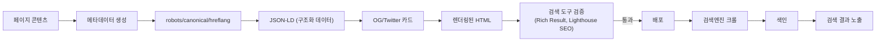


| 분류 | 핵심 기술 | 상태 | Stable |
| :--- | :--- | :--- | :--- |
| **연관 가이드** | [23. 국제화](./23_국제화_가이드.md), [08. 성능](./08_성능_최적화_가이드.md), [19. 접근성](./19_웹_접근성_가이드.md) | **도구 원칙** | 벤더 중립 |
| **핵심 테마** | 구조화 데이터, 동적 OG 이미지, 검색 AI 기능 대응, Core Web Vitals, 크롤링 제어 | **Update** | 최신 기준 |

---

> **"SEO는 마케팅이 아니라 엔지니어링이다. 현재의 SEO는 메타데이터 자동화, 구조화 데이터 타입 안전성, 환경별 격리, 그리고 AI 검색 기능 대응까지 코드로 보장한다."**
> 본 가이드는 특정 검색엔진이나 배포 플랫폼에 종속되지 않는 SEO 표준을 다룹니다. 프레임워크별 Metadata API, sitemap/robots 생성 방식, 동적 이미지 생성 방식은 프로젝트 스택에 맞춰 바꾸되, 검증 기준은 동일하게 유지합니다.
>
> **현재 5월 핵심 변화 요약**
> - 생성형 검색 기능은 별도 해킹이 아니라 기존 검색 품질, crawlability, 구조화 데이터, 페이지 경험 위에서 동작합니다.
> - `llms.txt`, AI 전용 schema, AI 전용 콘텐츠 청킹은 아직 모든 검색/AI 시스템이 합의한 웹 표준이 아닙니다. 도입하더라도 검색 표준을 대체하지 않는 보조 실험으로만 둡니다.
> - JSON-LD는 Schema.org 최신 vocabulary와 검색엔진별 rich result eligibility를 모두 검증합니다.
> - Core Web Vitals는 SEO만이 아니라 사용자 경험 지표이므로 field data 기반으로 관리합니다.
> - Preview/branch/development 환경은 기본 `noindex`와 인증/robots 정책으로 production index와 분리합니다.

---


## 추천 항목 (실무 우선순위)

- **시작 추천**: title/description/canonical을 중심으로 중복 페이지를 먼저 정리하세요.
- **안정 추천**: 구조화 데이터 스키마 테스트를 배포 전 단계에서 강제하세요.
- **운영 추천**: sitemap/robots/robots index 정책을 월 1회 점검해 노출 오류를 줄입니다.


## 추천 항목 고도화 체크

- `즉시 적용` — 추천 항목 1개를 이번 주 내에 실제 작업 1건에 반영한다.
- `1주 내 정리` — 적용 결과를 PR 본문이나 회고 노트에 간단히 기록한다.
- `1개월 내 점검` — 재작업률/리뷰 충돌/배포 이슈 중 적어도 한 항목이 개선되었는지 확인한다.


## 추천 항목 실행 기록 템플릿

- `담당자` : 항목 적용 주체(문서 오너/팀원)를 명시
- `적용일` : 실제 반영된 날짜 및 작업 ID를 남김
- `측정 지표` : 리뷰 충돌/재작업/버그 재발 중 1개 이상 수치로 기록
- `보류 사유` : 적용을 못한 경우 이유를 1줄 기록하고 다음 액션을 지정

## 문서 책임 범위

| 이 문서가 결정하는 것 | 단일 출처로 따르는 문서 |
| :--- | :--- |
| 메타데이터 계약, 구조화 데이터, sitemap/robots, canonical/hreflang | [23. 국제화](./23_국제화_가이드.md), [13. 브라우저 호환성](./13_브라우저_호환성_가이드.md) |
| 검색 품질과 Core Web Vitals 연결 | [08. 성능](./08_성능_최적화_가이드.md) |
| preview/production 색인 분리와 배포 전 검증 | [11. CI/CD](./11_CICD_파이프라인_표준.md), [14. 배포](./14_배포_프로세스_체크리스트.md) |
| AI가 생성한 metadata/JSON-LD 초안 검증 | [18. AI 개발 워크플로우](./18_AI_개발_워크플로우_종합.md) |

---

## 0. 모든 프론트엔드 그룹 공통 Baseline

| 기준 | 최소 적용 |
| :--- | :--- |
| **Indexability** | production URL만 색인 가능하고 preview/development는 `noindex`와 robots 정책으로 차단합니다. |
| **Metadata contract** | title, description, canonical, OG/Twitter card, locale metadata를 페이지 타입별로 자동 생성합니다. |
| **Structured data** | JSON-LD는 Schema.org와 검색엔진 rich result 테스트를 모두 통과해야 합니다. |
| **Crawlability** | 주요 콘텐츠와 링크는 SSR/SSG 또는 검색엔진이 처리 가능한 HTML 구조로 제공합니다. |
| **Field performance** | Core Web Vitals는 lab score가 아니라 field data와 release regression으로 관리합니다. |

### 0.0 SEO 메타데이터 생산 흐름

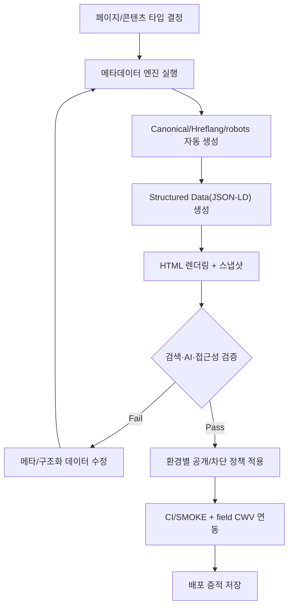

### 0.1 교차 검증 매트릭스

| 권고 | 1차 출처 | 실행 증거 | 운영 증거 | 철회 조건 |
| :--- | :--- | :--- | :--- | :--- |
| AI 검색 대응은 기존 SEO 원칙 위에서 처리한다 | 검색엔진 공식 generative AI/search guidance | crawl/render test, structured data validation | search traffic, indexed page, snippet eligibility | 특정 AI 플랫폼이 별도 표준을 공식 요구할 때 |
| structured data는 Schema.org와 rich result validator를 함께 통과한다 | Schema.org latest, 검색엔진 구조화 데이터 문서 | JSON-LD schema test, page snapshot | rich result error, enhancement report | rich result가 필요 없는 내부/비공개 페이지일 때 |
| preview 환경은 기본 noindex다 | robots/meta robots 문서 | preview E2E, header/meta assertion | accidental indexed URL count | 공개 staging이 제품 요구사항일 때 |
| Core Web Vitals는 field data로 release gate를 보정한다 | Web Vitals 공식 문서 | Lighthouse/WebPageTest + RUM 비교 | LCP/INP/CLS p75 | 트래픽이 부족해 field data 신뢰도가 낮을 때 |

### 0.2 운영 게이트

| Gate | Evidence | Owner | Rollback |
| :--- | :--- | :--- | :--- |
| Metadata contract gate | rendered HTML snapshot, duplicate title report | Page owner | metadata generator 이전 버전으로 rollback |
| Structured data gate | JSON-LD validation, visible content match | SEO + FE owner | rich result schema 제거 후 plain metadata 유지 |
| Environment isolation gate | noindex/header test, sitemap URL count | Release owner | offending route noindex hotfix, sitemap regenerate |
| Search health monitor | indexed URL, enhancement error, CWV p75 | Growth/SEO owner | release hold 또는 canonical/robots hotfix |

---


## 1. AI 기반 SEO 워크플로우

이 섹션의 AI 입력 구조, 민감정보 제거, 검증 책임은 [18. AI 개발 워크플로우](./18_AI_개발_워크플로우_종합.md)를 단일 출처로 따릅니다. 여기서는 검색 메타데이터와 구조화 데이터 검증에 필요한 도메인별 질문만 다룹니다.

> AI는 메타 태그 초안, 구조화 데이터 초안, SEO 회귀 테스트 후보를 빠르게 만들 수 있다. 목표는 검증 없는 자동 발행이 아니라, 공식 검색 가이드와 실제 렌더링 결과를 기준으로 누락과 형식 편차를 줄이는 것이다.

| 시나리오 | 입력 | AI 산출물 | 필수 검증 | 승인 조건 |
| :--- | :--- | :--- | :--- | :--- |
| 페이지 SEO 감사 | route manifest, rendered HTML, sitemap | 누락 metadata, heading, canonical 후보 | SSR/SSG HTML snapshot, crawler smoke | production 색인 가능 페이지만 노출 |
| 메타데이터 생성 | 페이지 타입, locale, canonical 규칙 | title/description/OG/Twitter 초안 | 길이, 중복, locale fallback test | 중복 title/description 없음 |
| JSON-LD 생성 | 콘텐츠 타입, schema 후보, required fields | 구조화 데이터 초안 | Schema.org validation, rich result eligibility | 필수 필드와 visible content가 일치 |
| SEO 회귀 테스트 | 핵심 route, known issue 목록 | metadata/heading/canonical 테스트 | CI에서 render 결과 기반 검증 | preview noindex와 production index 분리 |
| sitemap/robots | route source, 변경 빈도, 환경 목록 | sitemap 분할, robots 정책 초안 | URL count, status code, noindex smoke | 비공개/preview URL 미포함 |
| OG 이미지 | brand token, page data, locale | 이미지 템플릿 초안 | 이미지 렌더링, alt text, cache header | 실패 시 fallback 이미지 제공 |
| 콘텐츠 품질 분석 | 공개 콘텐츠, target intent, 내부 링크 | 개선 후보와 중복 콘텐츠 위험 | 사람이 사실성/법적 표현 검토 | keyword stuffing 없이 사용자 의도 충족 |

AI가 생성한 SEO 산출물은 다음 기준을 통과해야 병합합니다.

- 실제 페이지 HTML에서 확인 가능한 내용만 metadata에 사용
- canonical, hreflang, robots, sitemap이 서로 모순되지 않음
- preview/development URL은 색인 대상에서 제외
- 생성형 검색 대응은 기존 SEO 품질 기준을 대체하지 않음

## 2. 환경별 SEO 격리

> **왜 중요한가**: preview 환경이 색인되면 production과 동일 콘텐츠가 두 곳에 존재하게 되어 검색엔진이 어떤 URL을 정답으로 봐야 할지 혼란합니다. 결과적으로 production 순위도 떨어집니다.
>
> **일상 비유**: 시제품(preview)을 매장 진열대(검색 결과)에 함께 두면 손님이 어느 게 정식 제품인지 모릅니다. 시제품은 작업실(차단)에만 두고, 정식 제품에는 "정품(canonical)" 표시를 붙입니다.

### 환경별 색인 정책 흐름

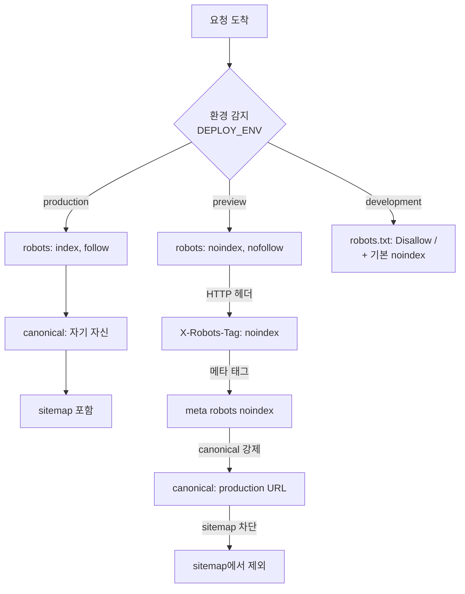

> Preview, staging, canary 환경이 검색 엔진에 인덱싱되면 중복 콘텐츠 문제가 발생한다. 환경별 SEO 격리는 모든 비프로덕션 환경의 필수 운영 기준이다.

### 2.1 환경 감지 유틸리티

```typescript
// lib/seo/environment.ts
// SEO 관련 환경 감지 — Production만 인덱싱 허용

type DeploymentEnv = 'production' | 'preview' | 'development';

interface SeoEnvironment {
  env: DeploymentEnv;
  baseUrl: string;
  isIndexable: boolean;
  robotsDirective: string;
}

export function getSeoEnvironment(): SeoEnvironment {
  const deployEnv = (process.env.DEPLOY_ENV ?? 'development') as DeploymentEnv;

  const isProduction = deployEnv === 'production';

  const baseUrl = isProduction
    ? process.env.NEXT_PUBLIC_SITE_URL!
    : deployEnv === 'preview'
      ? process.env.PREVIEW_URL!
      : 'http://localhost:3000';

  return {
    env: deployEnv,
    baseUrl,
    isIndexable: isProduction,
    robotsDirective: isProduction ? 'index, follow' : 'noindex, nofollow',
  };
}
```

### 2.2 Preview 환경 noindex 자동 설정

```typescript
// lib/seo/metadata.ts
// 환경별 메타데이터 빌더 — Preview 자동 noindex 처리

import { Metadata } from 'next';
import { getSeoEnvironment } from './environment';

interface PageSeoInput {
  title: string;
  description: string;
  path: string;
  ogImage?: string;
  type?: 'website' | 'article';
  publishedTime?: string;
  modifiedTime?: string;
  authors?: string[];
  keywords?: string[];
}

export function buildMetadata(input: PageSeoInput): Metadata {
  const { baseUrl, isIndexable, robotsDirective, env } = getSeoEnvironment();
  const url = `${baseUrl}${input.path}`;

  const ogImageUrl = input.ogImage
    ?? `${baseUrl}/api/og?title=${encodeURIComponent(input.title)}&env=${env}`;

  return {
    title: input.title,
    description: input.description,
    keywords: input.keywords,

    // Preview 환경 자동 noindex
    robots: {
      index: isIndexable,
      follow: isIndexable,
    },

    // canonical은 항상 Production URL
    alternates: {
      canonical: isIndexable
        ? url
        : `${process.env.NEXT_PUBLIC_SITE_URL}${input.path}`,
    },

    openGraph: {
      title: input.title,
      description: input.description,
      url,
      siteName: process.env.NEXT_PUBLIC_SITE_NAME,
      type: input.type ?? 'website',
      images: [
        {
          url: ogImageUrl,
          width: 1200,
          height: 630,
          alt: input.title,
        },
      ],
      ...(input.type === 'article' && {
        publishedTime: input.publishedTime,
        modifiedTime: input.modifiedTime,
        authors: input.authors,
      }),
    },

    twitter: {
      card: 'summary_large_image',
      title: input.title,
      description: input.description,
      images: [ogImageUrl],
    },

    other: {
      'robots': robotsDirective,
    },
  };
}
```

### 2.3 환경별 robots.txt 동적 생성

```typescript
// app/robots.ts
// 환경별 robots.txt — Preview/Development는 전체 크롤링 차단

import type { MetadataRoute } from 'next';
import { getSeoEnvironment } from '@/lib/seo/environment';

export default function robots(): MetadataRoute.Robots {
  const { isIndexable, baseUrl } = getSeoEnvironment();

  if (!isIndexable) {
    // Preview/Development: 전체 크롤링 차단
    return {
      rules: {
        userAgent: '*',
        disallow: '/',
      },
    };
  }

  // Production: 선택적 허용.
  // 모델 학습용 크롤러 차단 정책은 환경 변수로 관리하여 특정 사업자명을 문서에 고정하지 않는다.
  const trainingCrawlerUserAgents = (process.env.AI_TRAINING_CRAWLERS ?? '')
    .split(',')
    .map((value) => value.trim())
    .filter(Boolean);

  return {
    rules: [
      {
        userAgent: '*',
        allow: '/',
        disallow: ['/api/', '/admin/', '/_next/', '/auth/'],
      },
      ...trainingCrawlerUserAgents.map((userAgent) => ({
        userAgent,
        disallow: '/',
      })),
    ],
    sitemap: `${baseUrl}/sitemap.xml`,
  };
}
```

### 2.4 Preview URL SEO 영향 차단 (canonical 관리)

> **일상 비유**: canonical은 "이 사람의 본명은 누구입니까"라는 신원 카드입니다. 같은 사람이 별명(쿼리 파라미터), 가명(preview URL), 풀네임(production)으로 여러 곳에 나타나도, canonical 카드가 본명 하나를 가리키면 검색엔진은 중복 인격이 아니라 동일 인물로 합칩니다.

이 그림은 한 URL을 받았을 때 어떤 canonical을 출력할지 결정하는 흐름입니다.

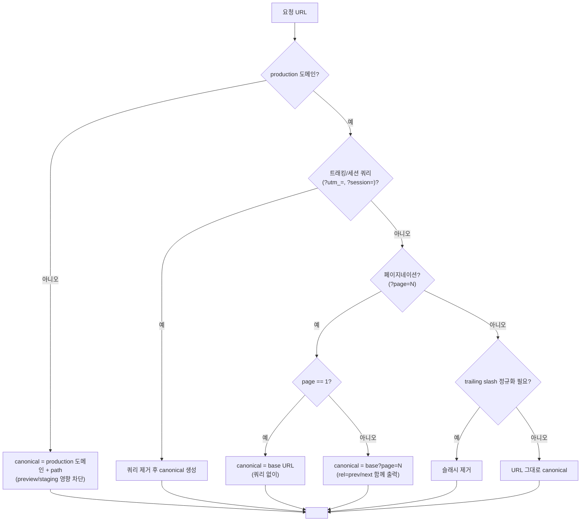

> **자주 하는 실수**: ① canonical을 절대 URL이 아닌 상대 경로로 출력 → 일부 크롤러가 다르게 해석합니다. ② preview URL을 그대로 canonical로 출력 → preview가 인덱싱되어 production과 중복 콘텐츠로 잡힙니다. ③ 페이지네이션 page=1을 `?page=1`로 출력 → base URL과 page=1이 동일 콘텐츠로 중복 인식됩니다.

```typescript
// lib/seo/canonical.ts
// canonical URL은 항상 Production 도메인을 가리킨다

import { getSeoEnvironment } from './environment';

/**
 * canonical URL은 항상 Production 도메인을 가리킨다.
 * Preview 환경의 URL이 검색 엔진에 유입되더라도
 * canonical을 통해 Production으로 통합된다.
 */
export function getCanonicalUrl(path: string): string {
  const productionUrl = process.env.NEXT_PUBLIC_SITE_URL!;
  const normalizedPath = path.startsWith('/') ? path : `/${path}`;

  // 쿼리 파라미터 제거 (tracking 등)
  const cleanPath = normalizedPath.split('?')[0];

  // 후행 슬래시 정규화
  const canonicalPath = cleanPath === '/' ? '' : cleanPath.replace(/\/$/, '');

  return `${productionUrl}${canonicalPath}`;
}

/** 페이지네이션 canonical 처리 */
export function getPaginatedCanonical(
  path: string,
  page: number,
): { canonical: string; prev?: string; next?: string } {
  const base = getCanonicalUrl(path);

  return {
    canonical: page === 1 ? base : `${base}?page=${page}`,
    prev: page > 1 ? (page === 2 ? base : `${base}?page=${page - 1}`) : undefined,
    next: `${base}?page=${page + 1}`,
  };
}
```

### 2.5 환경별 OG 이미지 차별화

```typescript
// app/api/og/route.tsx
// 동적 OG 이미지 — Preview 환경 워터마크 자동 표시

import { ImageResponse } from 'next/og';
import { NextRequest } from 'next/server';

export const runtime = 'edge';

export async function GET(request: NextRequest) {
  const { searchParams } = new URL(request.url);
  const title = searchParams.get('title') ?? 'Default Title';
  const env = searchParams.get('env') ?? 'production';
  const description = searchParams.get('desc') ?? '';

  const isPreview = env === 'preview';

  // 한글 폰트 로드
  const fontData = await fetch(
    new URL('/fonts/Pretendard-Bold.otf', request.url),
  ).then((res) => res.arrayBuffer());

  return new ImageResponse(
    (
      <div
        style={{
          width: '100%',
          height: '100%',
          display: 'flex',
          flexDirection: 'column',
          justifyContent: 'center',
          alignItems: 'flex-start',
          padding: '60px 80px',
          backgroundColor: isPreview ? '#1a1a2e' : '#ffffff',
          color: isPreview ? '#e0e0e0' : '#1a1a1a',
          fontFamily: 'Pretendard',
        }}
      >
        {/* Preview 워터마크 */}
        {isPreview && (
          <div
            style={{
              position: 'absolute',
              top: '20px',
              right: '30px',
              padding: '8px 16px',
              backgroundColor: '#ff6b35',
              color: '#ffffff',
              fontSize: '14px',
              fontWeight: 'bold',
              borderRadius: '4px',
              display: 'flex',
            }}
          >
            PREVIEW
          </div>
        )}

        {/* 사이트 로고 */}
        <div
          style={{
            fontSize: '18px',
            fontWeight: 'bold',
            marginBottom: '24px',
            color: isPreview ? '#888888' : '#666666',
            display: 'flex',
          }}
        >
          {process.env.NEXT_PUBLIC_SITE_NAME ?? 'My Site'}
        </div>

        {/* 제목 */}
        <div
          style={{
            fontSize: title.length > 30 ? '42px' : '56px',
            fontWeight: 'bold',
            lineHeight: 1.3,
            maxWidth: '900px',
            display: 'flex',
          }}
        >
          {title}
        </div>

        {/* 설명 */}
        {description && (
          <div
            style={{
              fontSize: '24px',
              marginTop: '20px',
              color: isPreview ? '#aaaaaa' : '#555555',
              maxWidth: '800px',
              lineHeight: 1.5,
              display: 'flex',
            }}
          >
            {description}
          </div>
        )}
      </div>
    ),
    {
      width: 1200,
      height: 630,
      fonts: [
        {
          name: 'Pretendard',
          data: fontData,
          style: 'normal',
          weight: 700,
        },
      ],
      headers: {
        'Cache-Control': isPreview
          ? 'no-cache'
          : 'public, max-age=86400, s-maxage=604800',
      },
    },
  );
}
```

---

## 3. Next.js 16 SEO 기본 설정

> **왜 중요한가**: Next.js Metadata API는 레이아웃 계층을 따라 자동으로 병합되기 때문에 "어디서 설정하면 어디까지 적용되는가"를 미리 정해야 중복/누락이 줄어듭니다.
>
> **일상 비유**: 가족 옷장 같습니다. 상위 옷장(루트 레이아웃)에 기본 옷이 있고, 자녀 옷장(라우트 그룹)이 보충하고, 개인 서랍(페이지)이 최종 결정합니다. 누가 무엇을 가졌는지 미리 알아야 옷을 두 번 사는 일이 없어집니다.

### 메타데이터 우선순위 계층

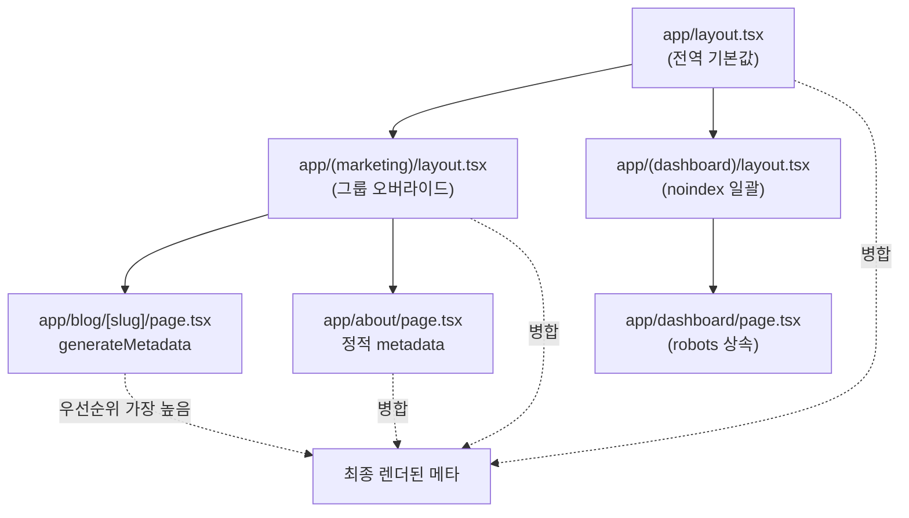

### 3.1 루트 레이아웃 메타데이터

```typescript
// app/layout.tsx
// 전역 메타데이터 설정 — 모든 페이지의 기본값

import type { Metadata, Viewport } from 'next';
import { getSeoEnvironment } from '@/lib/seo/environment';

const { baseUrl, isIndexable } = getSeoEnvironment();

function buildSearchEngineVerificationMetadata() {
  return JSON.parse(process.env.SEARCH_ENGINE_VERIFICATION_JSON ?? '{}');
}

export const metadata: Metadata = {
  metadataBase: new URL(baseUrl),
  title: {
    template: '%s | 사이트명',
    default: '사이트명 - 핵심 가치 설명',
  },
  description: '150-160자 이내의 사이트 설명. 핵심 키워드와 행동 유도 문구 포함.',
  robots: {
    index: isIndexable,
    follow: isIndexable,
  },
  openGraph: {
    type: 'website',
    locale: 'ko_KR',
    siteName: '사이트명',
  },
  twitter: {
    card: 'summary_large_image',
    creator: '@twitter_handle',
  },
  verification: buildSearchEngineVerificationMetadata(),
};

export const viewport: Viewport = {
  width: 'device-width',
  initialScale: 1,
  themeColor: [
    { media: '(prefers-color-scheme: light)', color: '#ffffff' },
    { media: '(prefers-color-scheme: dark)', color: '#0a0a0a' },
  ],
};
```

### 3.2 동적 페이지 generateMetadata

```typescript
// app/blog/[slug]/page.tsx
// 동적 메타데이터 생성 — 게시글별 SEO 최적화

import type { Metadata } from 'next';
import { notFound } from 'next/navigation';
import { buildMetadata } from '@/lib/seo/metadata';

interface PageProps {
  params: Promise<{ slug: string }>;
}

async function getPost(slug: string) {
  // DB/CMS에서 게시글 조회
  const res = await fetch(`${process.env.API_URL}/posts/${slug}`, {
    next: { revalidate: 3600 },
  });
  if (!res.ok) return null;
  return res.json();
}

export async function generateMetadata({ params }: PageProps): Promise<Metadata> {
  const { slug } = await params;
  const post = await getPost(slug);

  if (!post) return {};

  return buildMetadata({
    title: post.title,
    description: post.excerpt,
    path: `/blog/${slug}`,
    type: 'article',
    publishedTime: post.publishedAt,
    modifiedTime: post.updatedAt,
    authors: [post.author.name],
    keywords: post.tags,
  });
}

export async function generateStaticParams() {
  const res = await fetch(`${process.env.API_URL}/posts?fields=slug`);
  const posts: { slug: string }[] = await res.json();
  return posts.map((post) => ({ slug: post.slug }));
}

export default async function BlogPostPage({ params }: PageProps) {
  const { slug } = await params;
  const post = await getPost(slug);

  if (!post) notFound();

  return (
    <article>
      <h1>{post.title}</h1>
      <div>{post.content}</div>
    </article>
  );
}
```

### 3.3 Not Found 페이지 SEO 처리

검색 엔진이 404 페이지를 올바르게 인식하도록 처리한다. 잘못된 404 처리는 "소프트 404" 경고를 유발하여 검색 품질에 악영향을 준다.

```typescript
// app/not-found.tsx
// 404 페이지 — 검색 엔진이 올바르게 인식하도록 noindex 설정

import type { Metadata } from 'next';

export const metadata: Metadata = {
  title: '페이지를 찾을 수 없습니다',
  description: '요청하신 페이지가 존재하지 않습니다.',
  robots: {
    index: false,    // 404 페이지는 인덱싱하지 않음
    follow: true,    // 내부 링크는 따라감
  },
};

export default function NotFound() {
  return (
    <main>
      <h1>404 - 페이지를 찾을 수 없습니다</h1>
      <p>요청하신 페이지가 존재하지 않거나 이동되었습니다.</p>
      <a href="/">홈으로 돌아가기</a>
    </main>
  );
}
```

### 3.4 레이아웃 그룹별 메타데이터 상속

Next.js 16의 메타데이터 병합(merge) 전략을 활용하면 레이아웃 그룹별로 기본 메타데이터를 설정하고 하위 페이지에서 오버라이드할 수 있다. Next.js 15에서 도입한 App Router Metadata API 패턴은 그대로 유지된다.

```typescript
// app/(marketing)/layout.tsx
// 마케팅 페이지 그룹의 기본 메타데이터

import type { Metadata } from 'next';

export const metadata: Metadata = {
  openGraph: {
    type: 'website',
    locale: 'ko_KR',
    siteName: '사이트명',
  },
  // 마케팅 페이지 공통 키워드
  keywords: ['서비스명', '핵심기능', '사용사례'],
};

export default function MarketingLayout({
  children,
}: {
  children: React.ReactNode;
}) {
  return <>{children}</>;
}
```

```typescript
// app/(dashboard)/layout.tsx
// 대시보드는 SEO 불필요 — noindex 일괄 설정

import type { Metadata } from 'next';

export const metadata: Metadata = {
  robots: {
    index: false,    // 대시보드 전체 noindex
    follow: false,
  },
};

export default function DashboardLayout({
  children,
}: {
  children: React.ReactNode;
}) {
  return <>{children}</>;
}
```

---

## 4. 구조화 데이터 (JSON-LD)

> **왜 중요한가**: 구조화 데이터는 검색엔진이 페이지 내용을 "기계적으로 정확히" 이해하게 도와 풍부한 검색 결과(rich result)를 만들 수 있는 단서를 제공합니다. 페이지 클릭률에 직접 영향을 줍니다.
>
> **일상 비유**: JSON-LD는 책 표지에 붙은 "ISBN, 저자, 출판일, 카테고리" 정보 라벨과 같습니다. 본문(콘텐츠)을 다 읽지 않아도 사서가 어떤 책인지 즉시 분류할 수 있게 해 줍니다.

### 4.0 Structured Data 타입 선택 결정 트리

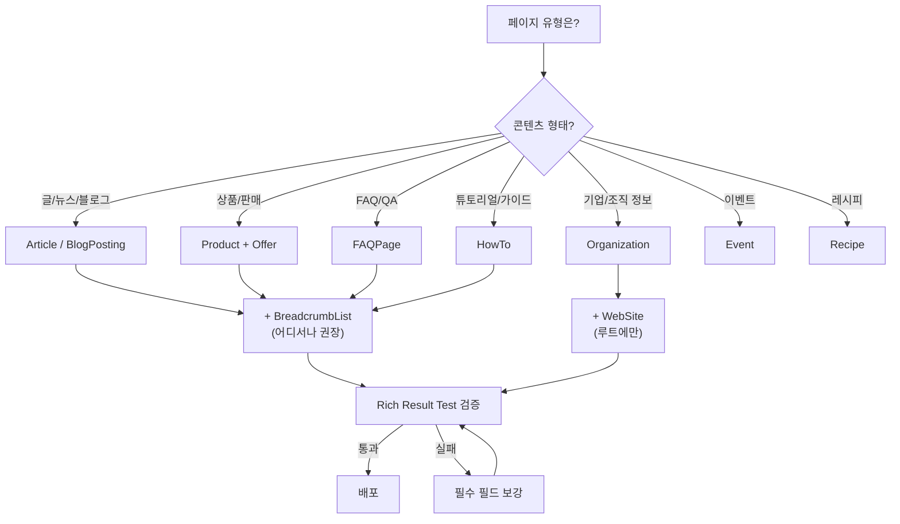

### 4.1 JSON-LD 컴포넌트

```typescript
// components/JsonLd.tsx
// 타입 안전한 JSON-LD 컴포넌트 — XSS 방지 포함

interface JsonLdProps {
  data: Record<string, unknown>;
}

export function JsonLd({ data }: JsonLdProps) {
  // JSON 문자열 내 </script> 삽입 방지 (XSS 대응)
  const safeJson = JSON.stringify(data).replace(/</g, '\\u003c');

  return (
    <script
      type="application/ld+json"
      dangerouslySetInnerHTML={{ __html: safeJson }}
    />
  );
}
```

### 4.2 스키마 빌더

```typescript
// lib/seo/schema.ts
// Schema.org 기반 구조화 데이터 빌더 모음

import { getSeoEnvironment } from './environment';

interface OrganizationInput {
  name: string;
  url: string;
  logo: string;
  sameAs?: string[];
}

interface ArticleInput {
  title: string;
  description: string;
  url: string;
  imageUrl: string;
  publishedTime: string;
  modifiedTime: string;
  authorName: string;
  authorUrl?: string;
}

interface BreadcrumbItem {
  name: string;
  url: string;
}

interface ProductInput {
  name: string;
  description: string;
  imageUrl: string;
  price: number;
  currency: string;
  availability: 'InStock' | 'OutOfStock' | 'PreOrder';
  ratingValue?: number;
  reviewCount?: number;
}

interface FaqItem {
  question: string;
  answer: string;
}

/** Organization 스키마 — 회사/서비스 정보 */
export function buildOrganizationSchema(input: OrganizationInput) {
  return {
    '@context': 'https://schema.org',
    '@type': 'Organization',
    name: input.name,
    url: input.url,
    logo: input.logo,
    sameAs: input.sameAs ?? [],
  };
}

/** WebSite 스키마 — Sitelinks Search Box 활성화 */
export function buildWebSiteSchema() {
  const { baseUrl } = getSeoEnvironment();

  return {
    '@context': 'https://schema.org',
    '@type': 'WebSite',
    url: baseUrl,
    name: process.env.NEXT_PUBLIC_SITE_NAME,
    potentialAction: {
      '@type': 'SearchAction',
      target: {
        '@type': 'EntryPoint',
        urlTemplate: `${baseUrl}/search?q={search_term_string}`,
      },
      'query-input': 'required name=search_term_string',
    },
  };
}

/** Article 스키마 — 블로그 글, 뉴스 기사 */
export function buildArticleSchema(input: ArticleInput) {
  return {
    '@context': 'https://schema.org',
    '@type': 'Article',
    headline: input.title,
    description: input.description,
    url: input.url,
    image: input.imageUrl,
    datePublished: input.publishedTime,
    dateModified: input.modifiedTime,
    author: {
      '@type': 'Person',
      name: input.authorName,
      ...(input.authorUrl && { url: input.authorUrl }),
    },
    publisher: {
      '@type': 'Organization',
      name: process.env.NEXT_PUBLIC_SITE_NAME,
      logo: {
        '@type': 'ImageObject',
        url: `${getSeoEnvironment().baseUrl}/logo.png`,
      },
    },
  };
}

/** BreadcrumbList 스키마 — 네비게이션 경로 */
export function buildBreadcrumbSchema(items: BreadcrumbItem[]) {
  return {
    '@context': 'https://schema.org',
    '@type': 'BreadcrumbList',
    itemListElement: items.map((item, index) => ({
      '@type': 'ListItem',
      position: index + 1,
      name: item.name,
      item: item.url,
    })),
  };
}

/** Product 스키마 — 상품/서비스 페이지 */
export function buildProductSchema(input: ProductInput) {
  return {
    '@context': 'https://schema.org',
    '@type': 'Product',
    name: input.name,
    description: input.description,
    image: input.imageUrl,
    offers: {
      '@type': 'Offer',
      price: input.price,
      priceCurrency: input.currency,
      availability: `https://schema.org/${input.availability}`,
    },
    ...(input.ratingValue && {
      aggregateRating: {
        '@type': 'AggregateRating',
        ratingValue: input.ratingValue,
        reviewCount: input.reviewCount,
      },
    }),
  };
}

/** FAQPage 스키마 — FAQ 페이지 */
export function buildFaqSchema(items: FaqItem[]) {
  return {
    '@context': 'https://schema.org',
    '@type': 'FAQPage',
    mainEntity: items.map((item) => ({
      '@type': 'Question',
      name: item.question,
      acceptedAnswer: {
        '@type': 'Answer',
        text: item.answer,
      },
    })),
  };
}

/** HowTo 스키마 — 가이드/튜토리얼 페이지 */
export function buildHowToSchema(input: {
  name: string;
  description: string;
  steps: { name: string; text: string; imageUrl?: string }[];
  totalTime?: string; // ISO 8601 duration (예: "PT30M")
}) {
  return {
    '@context': 'https://schema.org',
    '@type': 'HowTo',
    name: input.name,
    description: input.description,
    ...(input.totalTime && { totalTime: input.totalTime }),
    step: input.steps.map((step, index) => ({
      '@type': 'HowToStep',
      position: index + 1,
      name: step.name,
      text: step.text,
      ...(step.imageUrl && { image: step.imageUrl }),
    })),
  };
}
```

### 4.3 JSON-LD 사용 예시

```typescript
// app/blog/[slug]/page.tsx (JSON-LD 적용 부분)
// 블로그 글에 Article + Breadcrumb 구조화 데이터 삽입

import { JsonLd } from '@/components/JsonLd';
import { buildArticleSchema, buildBreadcrumbSchema } from '@/lib/seo/schema';
import { getSeoEnvironment } from '@/lib/seo/environment';

export default async function BlogPostPage({ params }: PageProps) {
  const { slug } = await params;
  const post = await getPost(slug);
  if (!post) notFound();

  const { baseUrl } = getSeoEnvironment();

  const articleSchema = buildArticleSchema({
    title: post.title,
    description: post.excerpt,
    url: `${baseUrl}/blog/${slug}`,
    imageUrl: post.coverImage,
    publishedTime: post.publishedAt,
    modifiedTime: post.updatedAt,
    authorName: post.author.name,
  });

  const breadcrumbSchema = buildBreadcrumbSchema([
    { name: '홈', url: baseUrl },
    { name: '블로그', url: `${baseUrl}/blog` },
    { name: post.title, url: `${baseUrl}/blog/${slug}` },
  ]);

  return (
    <>
      <JsonLd data={articleSchema} />
      <JsonLd data={breadcrumbSchema} />
      <article>
        <h1>{post.title}</h1>
        <div>{post.content}</div>
      </article>
    </>
  );
}
```

### 4.4 JSON-LD 유효성 검증 유틸리티

개발 환경에서 구조화 데이터를 자동 검증하여 배포 전 오류를 방지한다.

```typescript
// lib/seo/schema-validator.ts
// 개발 환경 전용 JSON-LD 유효성 검증기

interface ValidationResult {
  valid: boolean;
  errors: string[];
  warnings: string[];
}

const REQUIRED_FIELDS: Record<string, string[]> = {
  Article: ['headline', 'datePublished', 'author', 'image'],
  Product: ['name', 'offers'],
  FAQPage: ['mainEntity'],
  BreadcrumbList: ['itemListElement'],
  Organization: ['name', 'url'],
  WebSite: ['url', 'name'],
  HowTo: ['name', 'step'],
};

/** JSON-LD 스키마의 필수 필드 존재 여부 검증 */
export function validateJsonLd(data: Record<string, unknown>): ValidationResult {
  const errors: string[] = [];
  const warnings: string[] = [];

  // @context 검증
  if (data['@context'] !== 'https://schema.org') {
    errors.push('@context가 "https://schema.org"이어야 합니다.');
  }

  // @type 검증
  const type = data['@type'] as string;
  if (!type) {
    errors.push('@type이 누락되었습니다.');
    return { valid: false, errors, warnings };
  }

  // 필수 필드 검증
  const requiredFields = REQUIRED_FIELDS[type];
  if (requiredFields) {
    for (const field of requiredFields) {
      if (!(field in data) || data[field] === null || data[field] === undefined) {
        errors.push(`${type}에 필수 필드 "${field}"가 누락되었습니다.`);
      }
    }
  } else {
    warnings.push(`알 수 없는 스키마 타입: ${type} (검증 규칙 없음)`);
  }

  return { valid: errors.length === 0, errors, warnings };
}
```

---

## 5. 동적 OG 이미지 (동적 이미지 생성 API)

### 5.1 기본 OG 이미지 생성기

> 환경별 OG 이미지 차별화는 [2.5 환경별 OG 이미지 차별화](#25-환경별-og-이미지-차별화) 참고.

### 5.2 페이지 유형별 템플릿

```typescript
// lib/seo/og-templates.ts
// OG 이미지 URL 빌더 — 페이지 유형별 파라미터 자동 설정

interface OgTemplateProps {
  title: string;
  description?: string;
  type: 'default' | 'blog' | 'product';
  category?: string;
  date?: string;
  price?: string;
}

/** OG 이미지 URL 빌더 */
export function buildOgImageUrl(props: OgTemplateProps): string {
  const params = new URLSearchParams({
    title: props.title,
    type: props.type,
    ...(props.description && { desc: props.description }),
    ...(props.category && { category: props.category }),
    ...(props.date && { date: props.date }),
    ...(props.price && { price: props.price }),
    env: process.env.DEPLOY_ENV ?? 'development',
  });

  return `/api/og?${params}`;
}
```

### 5.3 메타데이터에 OG 이미지 통합

```typescript
// 사용 예시: generateMetadata에서 OG 이미지 연동

import { buildOgImageUrl } from '@/lib/seo/og-templates';
import { buildMetadata } from '@/lib/seo/metadata';

export async function generateMetadata({ params }: PageProps): Promise<Metadata> {
  const { slug } = await params;
  const post = await getPost(slug);
  if (!post) return {};

  const ogImage = buildOgImageUrl({
    title: post.title,
    type: 'blog',
    category: post.category,
    date: post.publishedAt,
  });

  return buildMetadata({
    title: post.title,
    description: post.excerpt,
    path: `/blog/${slug}`,
    ogImage,
    type: 'article',
    publishedTime: post.publishedAt,
    modifiedTime: post.updatedAt,
  });
}
```

### 5.4 OG 이미지 디버깅 도구

소셜 미디어 공유 시 OG 이미지가 올바르게 표시되는지 확인하는 도구 목록과 디버깅 방법이다.

```typescript
// scripts/validate-og-images.ts
// OG 이미지 일괄 검증 스크립트 — CI에서 실행 가능

import { JSDOM } from 'jsdom';

interface OgValidationResult {
  url: string;
  status: 'pass' | 'fail';
  issues: string[];
}

const OG_REQUIRED_TAGS = ['og:title', 'og:description', 'og:image', 'og:url'];

/** 주어진 URL의 OG 태그 완성도를 검증 */
async function validateOgTags(url: string): Promise<OgValidationResult> {
  const issues: string[] = [];

  try {
    const response = await fetch(url);
    const html = await response.text();
    const dom = new JSDOM(html);
    const doc = dom.window.document;

    // 필수 OG 태그 검증
    for (const tag of OG_REQUIRED_TAGS) {
      const meta = doc.querySelector(`meta[property="${tag}"]`);
      if (!meta) {
        issues.push(`${tag} 태그 누락`);
      } else if (!meta.getAttribute('content')?.trim()) {
        issues.push(`${tag} 태그 내용 비어있음`);
      }
    }

    // OG 이미지 크기 검증 (1200x630 권장)
    const ogImage = doc.querySelector('meta[property="og:image"]');
    if (ogImage) {
      const imageWidth = doc.querySelector('meta[property="og:image:width"]');
      const imageHeight = doc.querySelector('meta[property="og:image:height"]');
      if (!imageWidth || !imageHeight) {
        issues.push('og:image:width 또는 og:image:height 누락 (1200x630 권장)');
      }
    }

    // Twitter Card 검증
    const twitterCard = doc.querySelector('meta[name="twitter:card"]');
    if (!twitterCard) {
      issues.push('twitter:card 태그 누락');
    }
  } catch (error) {
    issues.push(`페이지 접근 실패: ${error}`);
  }

  return {
    url,
    status: issues.length === 0 ? 'pass' : 'fail',
    issues,
  };
}

// 디버깅 도구 URL 참고:
// - Facebook Sharing Debugger: https://developers.facebook.com/tools/debug/
// - Twitter Card Validator: https://cards-dev.twitter.com/validator
// - LinkedIn Post Inspector: https://www.linkedin.com/post-inspector/
// - Open Graph Preview: https://www.opengraph.xyz/
```

---

## 6. 사이트맵 및 robots.txt

> **일상 비유**: 사이트맵은 도서관 도서 목록과 같습니다. 사서(검색엔진 크롤러)가 들어왔을 때 어디에 어떤 책이 있는지, 언제 새로 들어왔는지를 한눈에 안내합니다. robots.txt는 "사서 전용 통로"와 "일반 출입 금지" 표지판입니다.

이 그림은 sitemap이 생성되어 검색엔진에 도달하는 전체 파이프라인을 보여줍니다.

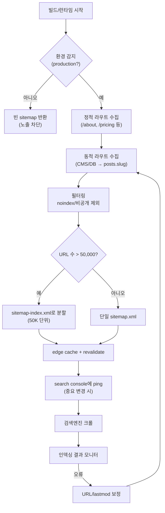

> **운영 팁**: `lastModified`는 진짜 콘텐츠가 변경된 시점이어야 합니다. 모든 URL이 `new Date()`로 같은 시각이면 크롤러는 "이 사이트는 신뢰할 수 없는 메타데이터를 준다"고 학습합니다.

### 6.1 정적 + 동적 사이트맵

```typescript
// app/sitemap.ts
// 정적 + 동적 사이트맵 생성 — Preview 환경 자동 제외

import type { MetadataRoute } from 'next';
import { getSeoEnvironment } from '@/lib/seo/environment';

export default async function sitemap(): Promise<MetadataRoute.Sitemap> {
  const { baseUrl, isIndexable } = getSeoEnvironment();

  // Preview 환경에서는 빈 사이트맵
  if (!isIndexable) return [];

  // 정적 페이지
  const staticPages: MetadataRoute.Sitemap = [
    {
      url: baseUrl,
      lastModified: new Date(),
      changeFrequency: 'daily',
      priority: 1.0,
    },
    {
      url: `${baseUrl}/about`,
      lastModified: new Date(),
      changeFrequency: 'monthly',
      priority: 0.8,
    },
  ];

  // 동적 페이지 (DB/CMS에서 조회)
  const postsResponse = await fetch(
    `${process.env.API_URL}/posts?fields=slug,updatedAt`,
    { next: { revalidate: 3600 } },
  );
  const posts: { slug: string; updatedAt: string }[] = await postsResponse.json();

  const dynamicPages: MetadataRoute.Sitemap = posts.map((post) => ({
    url: `${baseUrl}/blog/${post.slug}`,
    lastModified: new Date(post.updatedAt),
    changeFrequency: 'weekly' as const,
    priority: 0.7,
  }));

  return [...staticPages, ...dynamicPages];
}
```

### 6.2 대규모 사이트맵 인덱스 분할

50,000 URL을 초과하는 대규모 사이트에서는 사이트맵 인덱스를 사용하여 분할한다.

```typescript
// app/sitemap/[id]/route.ts
// 사이트맵 인덱스 분할 — 50,000 URL 초과 시 자동 분할

import { NextRequest, NextResponse } from 'next/server';
import { getSeoEnvironment } from '@/lib/seo/environment';

const URLS_PER_SITEMAP = 50000;

export async function GET(
  _request: NextRequest,
  { params }: { params: Promise<{ id: string }> },
) {
  const { id } = await params;
  const sitemapIndex = parseInt(id, 10);
  const { baseUrl, isIndexable } = getSeoEnvironment();

  if (!isIndexable) {
    return new NextResponse('', { status: 404 });
  }

  // 전체 URL 수 조회
  const countResponse = await fetch(`${process.env.API_URL}/posts/count`);
  const { total } = await countResponse.json();

  // 페이지네이션으로 해당 범위의 URL 조회
  const offset = sitemapIndex * URLS_PER_SITEMAP;
  const postsResponse = await fetch(
    `${process.env.API_URL}/posts?offset=${offset}&limit=${URLS_PER_SITEMAP}&fields=slug,updatedAt`,
  );
  const posts: { slug: string; updatedAt: string }[] = await postsResponse.json();

  // XML 사이트맵 생성
  const xml = `<?xml version="1.0" encoding="UTF-8"?>
<urlset xmlns="http://www.sitemaps.org/schemas/sitemap/0.9">
  ${posts.map((post) => `
  <url>
    <loc>${baseUrl}/blog/${post.slug}</loc>
    <lastmod>${new Date(post.updatedAt).toISOString()}</lastmod>
    <changefreq>weekly</changefreq>
    <priority>0.7</priority>
  </url>`).join('')}
</urlset>`;

  return new NextResponse(xml, {
    headers: {
      'Content-Type': 'application/xml',
      'Cache-Control': 'public, max-age=3600, s-maxage=86400',
    },
  });
}
```

### 6.3 robots.txt

> 환경별 robots.txt 동적 생성은 [2.3 환경별 robots.txt 동적 생성](#23-환경별-robotstxt-동적-생성) 참고.

---

## 7. SSR / SSG / ISR SEO 전략 비교

> **왜 중요한가**: 검색 크롤러는 자바스크립트를 실행하긴 하지만 우선순위와 정확도가 떨어집니다. HTML이 즉시 도착하는 페이지가 색인되기 가장 안전합니다.
>
> **일상 비유**: SSG/SSR은 "음식을 미리 만들어 두는 즉석 식당", CSR은 "주문 후 처음부터 조리하는 정통 식당"입니다. 검색엔진은 빨리 받아 보는 즉석 식당을 선호합니다.

### 렌더링 전략별 SEO 적합도

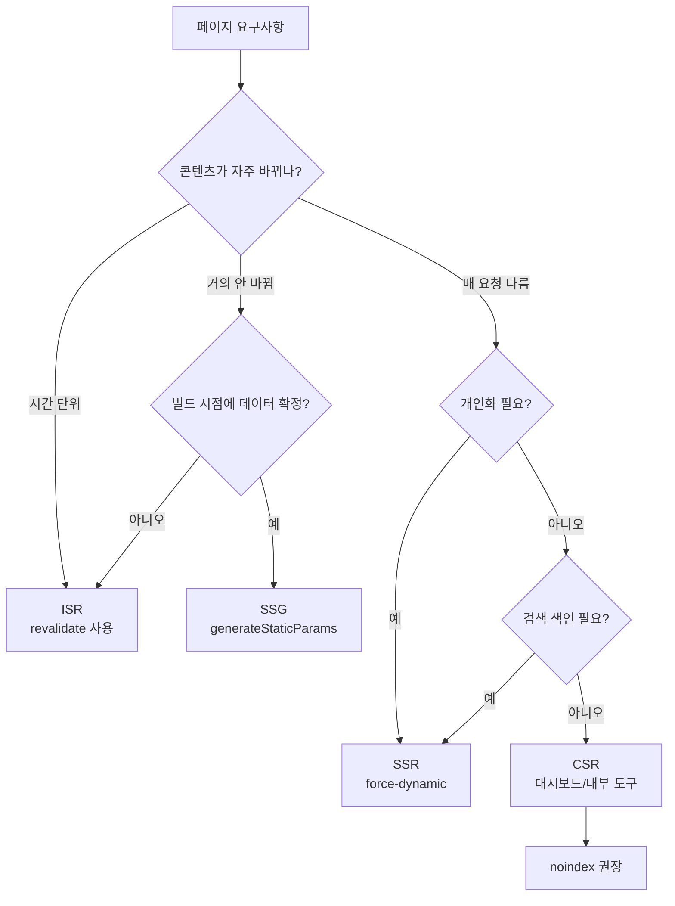

| 전략 | 크롤링 대응 | 초기 로딩 | 데이터 최신성 | 적합한 페이지 |
|---|---|---|---|---|
| **SSG** | 최적 (HTML 즉시 제공) | 가장 빠름 | 빌드 시점 고정 | 블로그, 문서, about |
| **ISR** | 최적 (캐시된 HTML) | 빠름 | revalidate 주기 | 제품 목록, 카테고리 |
| **SSR** | 양호 (실시간 HTML) | 보통 | 항상 최신 | 검색 결과, 개인화 |
| **CSR** | 불리 (JS 실행 필요) | 느림 | 항상 최신 | 대시보드 (SEO 불필요) |

### 7.1 전략별 구현 패턴

```typescript
// SSG - 빌드 시 생성
// app/docs/[slug]/page.tsx
export async function generateStaticParams() {
  const docs = await getAllDocs();
  return docs.map((doc) => ({ slug: doc.slug }));
}

// ISR - 주기적 재생성
// app/products/[id]/page.tsx
async function getProduct(id: string) {
  return fetch(`${process.env.API_URL}/products/${id}`, {
    next: { revalidate: 3600 }, // 1시간마다 재검증
  }).then((res) => res.json());
}

// SSR - 매 요청마다 생성
// app/search/page.tsx
export const dynamic = 'force-dynamic';

async function getSearchResults(query: string) {
  return fetch(`${process.env.API_URL}/search?q=${query}`, {
    cache: 'no-store',
  }).then((res) => res.json());
}
```

### 7.2 ISR + On-Demand Revalidation

```typescript
// app/api/revalidate/route.ts
// CMS 웹훅에서 호출 — 콘텐츠 변경 시 즉시 재생성

import { NextRequest, NextResponse } from 'next/server';
import { revalidatePath, revalidateTag } from 'next/cache';

export async function POST(request: NextRequest) {
  const secret = request.headers.get('x-revalidation-secret');

  if (secret !== process.env.REVALIDATION_SECRET) {
    return NextResponse.json({ error: 'Unauthorized' }, { status: 401 });
  }

  const { path, tag } = await request.json();

  if (tag) {
    revalidateTag(tag);
  } else if (path) {
    revalidatePath(path);
  }

  return NextResponse.json({ revalidated: true, now: Date.now() });
}
```

### 7.3 Streaming SSR과 SEO

Next.js 16의 Streaming SSR과 Cache Components/PPR 조합은 사용자 경험을 개선하면서도 검색 엔진 호환성을 유지한다. `<Suspense>`로 감싼 영역은 서버에서 렌더링된 HTML 스트림으로 전달되므로 크롤러가 핵심 콘텐츠를 정상적으로 인식할 수 있게 설계해야 한다.

```typescript
// app/products/[id]/page.tsx
// Streaming SSR — SEO 핵심 콘텐츠는 Suspense 밖에 배치

import { Suspense } from 'react';

export default async function ProductPage({ params }: PageProps) {
  const { id } = await params;
  const product = await getProduct(id);

  return (
    <article>
      {/* SEO 핵심 콘텐츠는 Suspense 밖 — 크롤러가 즉시 인식 */}
      <h1>{product.name}</h1>
      <p>{product.description}</p>

      {/* 부가 정보는 Streaming으로 지연 로딩 */}
      <Suspense fallback={<div>리뷰 로딩 중...</div>}>
        <ProductReviews productId={id} />
      </Suspense>

      <Suspense fallback={<div>추천 상품 로딩 중...</div>}>
        <RelatedProducts productId={id} />
      </Suspense>
    </article>
  );
}
```

---

## 8. Core Web Vitals와 SEO

> **일상 비유**: CWV는 식당의 위생 등급과 비슷합니다. 음식 맛(콘텐츠 품질)이 아무리 좋아도 위생 점수가 낮으면 손님이 줄어듭니다. LCP는 음식 나오는 속도, INP는 종업원 응대 속도, CLS는 식탁이 흔들리지 않는 정도입니다.

이 그림은 CWV 데이터가 어디서 수집되어 어떤 결정으로 이어지는지 보여줍니다.

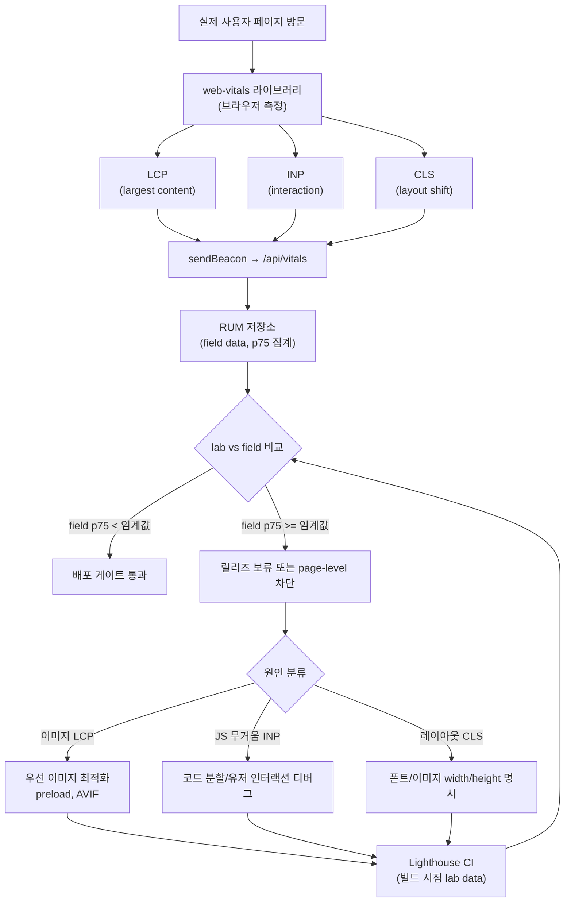

> **핵심 원칙**: field data(실사용자 측정)는 lab data(빌드 시점 시뮬레이션)를 항상 이깁니다. 트래픽이 적어 field 신뢰도가 낮은 페이지만 lab을 fallback으로 사용합니다.

### 8.1 Web Vitals 수집 및 리포팅

```typescript
// lib/seo/web-vitals.ts
// Core Web Vitals 자동 수집 — Beacon API로 비동기 전송

import { onCLS, onINP, onLCP, onFCP, onTTFB, type Metric } from 'web-vitals';

interface VitalsReport {
  name: string;
  value: number;
  rating: 'good' | 'needs-improvement' | 'poor';
  path: string;
}

function sendToAnalytics(metric: Metric): void {
  const report: VitalsReport = {
    name: metric.name,
    value: metric.value,
    rating: metric.rating,
    path: window.location.pathname,
  };

  // Beacon API로 비동기 전송
  if (navigator.sendBeacon) {
    navigator.sendBeacon('/api/vitals', JSON.stringify(report));
  }
}

export function initWebVitals(): void {
  onCLS(sendToAnalytics);
  onINP(sendToAnalytics);
  onLCP(sendToAnalytics);
  onFCP(sendToAnalytics);
  onTTFB(sendToAnalytics);
}
```

### 8.2 SEO 영향 임계값

| 지표 | Good | Needs Improvement | Poor | SEO 영향 |
|---|---|---|---|---|
| LCP | < 2.5s | 2.5s - 4.0s | > 4.0s | 직접 순위 요소 |
| INP | < 200ms | 200ms - 500ms | > 500ms | 직접 순위 요소 |
| CLS | < 0.1 | 0.1 - 0.25 | > 0.25 | 직접 순위 요소 |
| FCP | < 1.8s | 1.8s - 3.0s | > 3.0s | 간접 영향 |
| TTFB | < 800ms | 800ms - 1.8s | > 1.8s | 간접 영향 |

### 8.3 CWV 개선을 위한 SEO 친화적 이미지 최적화

이미지는 LCP와 CLS에 직접적인 영향을 미친다. Next.js의 `<Image>` 컴포넌트를 올바르게 사용하면 자동으로 최적화된다.

```typescript
// components/SeoImage.tsx
// SEO 친화적 이미지 — LCP 최적화 + CLS 방지 + alt 필수

import Image from 'next/image';

interface SeoImageProps {
  src: string;
  alt: string;          // alt 텍스트 필수 (빈 문자열 불가)
  width: number;
  height: number;
  priority?: boolean;   // LCP 후보 이미지는 true
  className?: string;
}

export function SeoImage({ src, alt, width, height, priority, className }: SeoImageProps) {
  if (!alt || alt.trim() === '') {
    // 개발 환경에서 alt 누락 경고
    if (process.env.NODE_ENV === 'development') {
      console.warn(`[SEO] 이미지 alt 텍스트가 비어있습니다: ${src}`);
    }
  }

  return (
    <Image
      src={src}
      alt={alt}
      width={width}
      height={height}
      priority={priority}       // LCP 이미지는 preload
      loading={priority ? 'eager' : 'lazy'}
      sizes="(max-width: 768px) 100vw, (max-width: 1200px) 50vw, 33vw"
      className={className}
      // width/height 명시로 CLS 방지
    />
  );
}
```

> **참고**: 성능 최적화 상세 내용은 [08. 성능 최적화 가이드](./08_성능_최적화_가이드.md) 참조.

---

## 9. 국제화 SEO (hreflang)

> **왜 중요한가**: 같은 콘텐츠를 여러 언어로 제공할 때 검색엔진은 "어느 언어 페이지가 누구를 위한 것인지" 알아야 합니다. hreflang이 없으면 한국어 사용자에게 영어 페이지가, 영어 사용자에게 한국어 페이지가 노출됩니다.
>
> **일상 비유**: hreflang은 다국어 식당의 메뉴판 표지와 같습니다. 한국어 손님에게 한국어 메뉴, 일본어 손님에게 일본어 메뉴를 정확히 안내하려면 표지에 "이 메뉴는 한국어/일본어/영어 버전이 있습니다"를 명시해야 합니다.

### hreflang 양방향 연결 구조

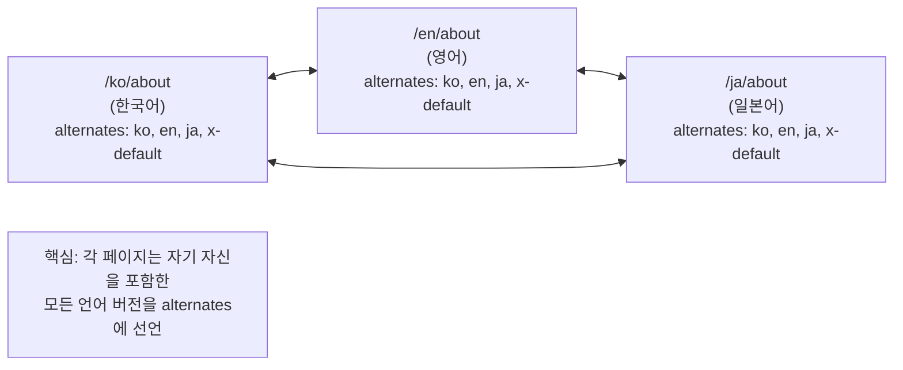

> **핵심 원칙**: 각 페이지는 자기 자신을 포함한 모든 언어 버전을 alternates로 선언해야 합니다. 한쪽만 선언하면 검색엔진이 무시할 수 있습니다.

다국어 사이트에서는 `hreflang` 태그를 통해 검색 엔진에 언어/지역별 대체 페이지를 알려줘야 한다. 누락 시 중복 콘텐츠 패널티를 받을 수 있다.

### 9.1 hreflang 메타데이터 설정

```typescript
// lib/seo/i18n-seo.ts
// hreflang 메타데이터 빌더 — 다국어 SEO 지원

import { Metadata } from 'next';
import { getSeoEnvironment } from './environment';

// 지원 언어 목록
const SUPPORTED_LOCALES = ['ko', 'en', 'ja'] as const;
type SupportedLocale = typeof SUPPORTED_LOCALES[number];

interface I18nSeoInput {
  path: string;
  currentLocale: SupportedLocale;
}

/** 다국어 페이지의 alternates (hreflang) 메타데이터 생성 */
export function buildI18nAlternates(input: I18nSeoInput): Metadata['alternates'] {
  const { baseUrl } = getSeoEnvironment();

  // 언어별 대체 URL 매핑
  const languages: Record<string, string> = {};
  for (const locale of SUPPORTED_LOCALES) {
    languages[locale] = `${baseUrl}/${locale}${input.path}`;
  }

  return {
    canonical: `${baseUrl}/${input.currentLocale}${input.path}`,
    languages: {
      ...languages,
      'x-default': `${baseUrl}/ko${input.path}`, // 기본 언어
    },
  };
}
```

### 9.2 다국어 사이트맵

```typescript
// app/sitemap.ts (다국어 확장)
// 다국어 사이트맵 — 각 언어별 URL을 alternates로 연결

import type { MetadataRoute } from 'next';
import { getSeoEnvironment } from '@/lib/seo/environment';

const LOCALES = ['ko', 'en', 'ja'];

export default async function sitemap(): Promise<MetadataRoute.Sitemap> {
  const { baseUrl, isIndexable } = getSeoEnvironment();
  if (!isIndexable) return [];

  const pages = ['', '/about', '/pricing'];

  // 각 언어별 정적 페이지 생성
  const entries: MetadataRoute.Sitemap = [];

  for (const page of pages) {
    for (const locale of LOCALES) {
      entries.push({
        url: `${baseUrl}/${locale}${page}`,
        lastModified: new Date(),
        changeFrequency: 'weekly',
        priority: locale === 'ko' ? 1.0 : 0.8,
        alternates: {
          languages: Object.fromEntries(
            LOCALES.map((l) => [l, `${baseUrl}/${l}${page}`]),
          ),
        },
      });
    }
  }

  return entries;
}
```

> **참고**: 국제화 상세 구현은 [23. 국제화 가이드](./23_국제화_가이드.md) 참조.

---

## 10. SEO 모니터링 및 자동화 테스트

> **일상 비유**: SEO 모니터링은 호텔의 청소 후 점검 카트와 같습니다. 객실(페이지)을 새로 단장(배포)한 뒤, 점검 체크리스트(메타·OG·JSON-LD·CWV)를 들고 한 바퀴 돌아 빠진 부분을 잡아냅니다. 모든 객실이 매번 점검을 통과해야 손님(검색엔진/사용자)이 들어옵니다.

이 그림은 한 페이지가 배포되어 검색엔진에 인덱싱되기까지의 전체 sequence입니다.

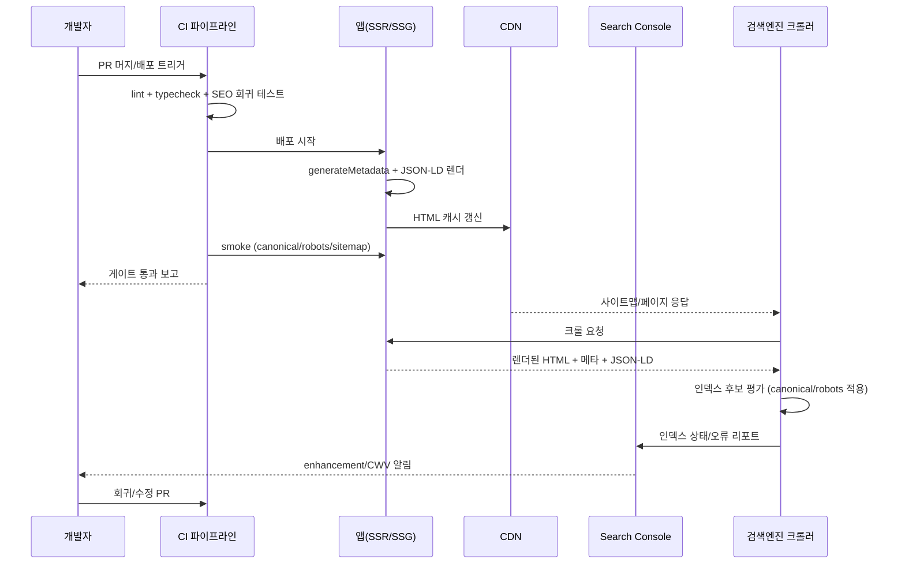

> **핵심 관문**: ① CI smoke에서 canonical과 robots를 환경별로 검증, ② Search Console에서 인덱싱 거부 사유를 주기적으로 점검, ③ CWV field data가 lab data보다 우선합니다.

### 10.1 Playwright SEO 회귀 테스트

CI 파이프라인에 SEO 회귀 테스트를 포함하여 배포 전 자동 검증한다.

```typescript
// e2e/seo.spec.ts
// SEO 회귀 테스트 — Playwright 기반 자동 검증

import { test, expect } from '@playwright/test';

const PAGES_TO_TEST = ['/', '/about', '/blog', '/pricing'];

for (const path of PAGES_TO_TEST) {
  test.describe(`SEO 검증: ${path}`, () => {
    test('필수 메타 태그가 존재해야 한다', async ({ page }) => {
      await page.goto(path);

      // title 존재 및 길이 검증
      const title = await page.title();
      expect(title).toBeTruthy();
      expect(title.length).toBeGreaterThanOrEqual(10);
      expect(title.length).toBeLessThanOrEqual(70);

      // description 메타 태그 검증
      const description = await page.getAttribute(
        'meta[name="description"]',
        'content',
      );
      expect(description).toBeTruthy();
      expect(description!.length).toBeGreaterThanOrEqual(50);
      expect(description!.length).toBeLessThanOrEqual(170);
    });

    test('OG 태그가 완전해야 한다', async ({ page }) => {
      await page.goto(path);

      const ogTags = ['og:title', 'og:description', 'og:image', 'og:url'];
      for (const tag of ogTags) {
        const content = await page.getAttribute(
          `meta[property="${tag}"]`,
          'content',
        );
        expect(content, `${tag} 태그 누락`).toBeTruthy();
      }
    });

    test('h1 태그가 정확히 1개여야 한다', async ({ page }) => {
      await page.goto(path);

      const h1Count = await page.locator('h1').count();
      expect(h1Count).toBe(1);
    });

    test('canonical URL이 설정되어야 한다', async ({ page }) => {
      await page.goto(path);

      const canonical = await page.getAttribute(
        'link[rel="canonical"]',
        'href',
      );
      expect(canonical).toBeTruthy();
      // canonical은 항상 Production URL이어야 함
      expect(canonical).not.toContain('preview');
      expect(canonical).not.toContain('localhost');
    });

    test('이미지에 alt 텍스트가 있어야 한다', async ({ page }) => {
      await page.goto(path);

      // 장식용 이미지(role="presentation")를 제외한 모든 이미지 검증
      const images = page.locator('img:not([role="presentation"])');
      const count = await images.count();

      for (let i = 0; i < count; i++) {
        const alt = await images.nth(i).getAttribute('alt');
        const src = await images.nth(i).getAttribute('src');
        expect(alt, `alt 누락: ${src}`).toBeTruthy();
      }
    });
  });
}

test('robots.txt가 올바르게 생성되어야 한다', async ({ request }) => {
  const response = await request.get('/robots.txt');
  expect(response.status()).toBe(200);

  const text = await response.text();
  expect(text).toContain('User-agent');
});

test('sitemap.xml이 유효한 XML이어야 한다', async ({ request }) => {
  const response = await request.get('/sitemap.xml');
  expect(response.status()).toBe(200);

  const contentType = response.headers()['content-type'];
  expect(contentType).toContain('xml');
});

test('JSON-LD가 유효한 JSON이어야 한다', async ({ page }) => {
  await page.goto('/');

  const jsonLdScripts = page.locator('script[type="application/ld+json"]');
  const count = await jsonLdScripts.count();

  for (let i = 0; i < count; i++) {
    const content = await jsonLdScripts.nth(i).textContent();
    expect(() => JSON.parse(content!)).not.toThrow();

    const data = JSON.parse(content!);
    expect(data['@context']).toBe('https://schema.org');
    expect(data['@type']).toBeTruthy();
  }
});
```

### 10.2 Lighthouse CI SEO 점수 게이트

CI에서 Lighthouse SEO 점수가 기준 이하면 배포를 차단한다.

```yaml
# .ci/workflows/lighthouse-seo.yml
# Lighthouse CI — SEO 점수 90점 미만 시 배포 차단

name: Lighthouse SEO Gate
on:
  pull_request:
    branches: [main]

jobs:
  lighthouse:
    runs-on: ubuntu-latest
    steps:
      - run: checkout-source
      - run: setup-node 20

      - name: 의존성 설치 및 빌드
        run: |
          npm ci
          npm run build

      - name: 프로덕션 서버 시작
        run: npm start &

      - name: Lighthouse CI 실행
        run: |
          lhci autorun \
            --collect.url=http://localhost:3000/ \
            --collect.url=http://localhost:3000/about \
            --collect.url=http://localhost:3000/blog \
            --assert.budgetFile=./lighthouse-budget.json

      - name: SEO 점수 검증
        run: |
          # SEO 카테고리 90점 미만이면 실패
          SCORE=$(cat .lighthouseci/lhr-*.json | jq '.categories.seo.score * 100' | head -1)
          echo "SEO Score: $SCORE"
          if [ "$SCORE" -lt 90 ]; then
            echo "SEO 점수가 90점 미만입니다. 배포를 차단합니다."
            exit 1
          fi
```

> **참고**: CI/CD 파이프라인 상세 설정은 [11. CI/CD 파이프라인 표준](./11_CICD_파이프라인_표준.md) 참조.

---

## 11. 생성형 검색과 크롤링 제어

> **왜 중요한가**: 생성형 검색은 별도 표준이 따로 있는 게 아니라, 기존 검색 품질 기준(발견 가능성, 구조화, 신뢰성)을 동일하게 더 엄격히 봅니다. 기존 SEO를 잘 한 페이지가 자동으로 유리합니다.
>
> **일상 비유**: 생성형 검색은 도서관 사서가 책 본문을 빠르게 발췌·요약해 손님에게 전달하는 일과 같습니다. 책에 색인카드(JSON-LD)와 명확한 표지(metadata)가 잘 정리돼 있어야 사서가 정확히 인용합니다.

### 검색엔진 인덱싱 파이프라인

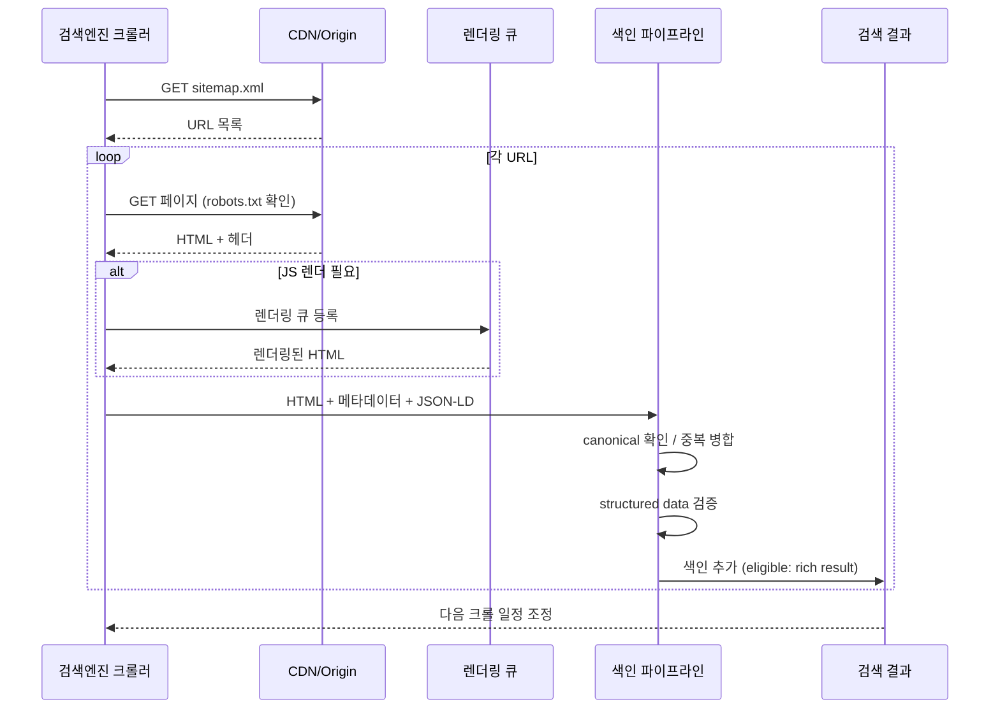

생성형 검색 대응은 별도 “AI SEO” 전술을 추가하는 문제가 아니라, 검색엔진이 페이지를 발견하고 이해하고 신뢰할 수 있게 만드는 기존 원칙을 더 엄격하게 적용하는 문제입니다. 검색 사업자별 기능은 계속 바뀌므로, 표준 문서와 Search Console/로그 데이터를 함께 확인합니다.

### 11.1 생성형 검색 대응 기준

| 기준 | 권장 구현 | 검증 방법 |
|---|---|---|
| **유용한 원본성** | 단순 요약보다 직접 경험, 실험, 데이터, 비교 근거를 제공합니다. | 콘텐츠 리뷰, 중복/저품질 페이지 audit |
| **명확한 구조** | H1/H2, 요약, 단계, 표, FAQ를 사용자 의도에 맞게 구성합니다. | 렌더된 HTML snapshot, heading audit |
| **기술적 접근성** | indexable URL, canonical, sitemap, 내부 링크를 안정적으로 유지합니다. | crawl test, sitemap diff |
| **멀티미디어 품질** | 이미지/영상에는 의미 있는 alt, caption, metadata를 둡니다. | image/video SEO audit |
| **정책 준수** | 검색 spam policy와 저작권/출처 표기 기준을 지킵니다. | content policy review |

### 11.2 AI/검색 크롤러 정책 매트릭스

| 범주 | 목적 | 기본 정책 |
|---|---|---|
| 검색 색인 크롤러 | 일반 검색 노출 | 허용 |
| 검색 기능 보조 크롤러 | 요약, 미리보기, rich result 생성 | 허용하되 snippet/preview 정책 관리 |
| 모델 학습 크롤러 | 모델 학습 데이터 수집 | 법무/콘텐츠 정책에 따라 허용 또는 제한 |
| 비식별 범용 수집 크롤러 | 공개 데이터셋 수집 | 서버 비용과 콘텐츠 정책에 따라 제한 |

`robots.txt`, meta robots, `X-Robots-Tag`, snippet 관련 directive는 검색 사업자별 지원 범위가 다릅니다. 중요한 차단 정책은 문서만 믿지 말고 access log와 실제 색인 상태로 확인합니다.

### 11.3 Web Crawler Verification

사칭 봇이 SSR/동적 렌더링 경로를 과도하게 호출하면 비용과 보안 위험이 커집니다. 크롤러 검증은 특정 검색엔진 전용 코드가 아니라 **공식 검증 절차를 adapter로 분리**합니다.

```typescript
// lib/seo/verify-crawler.ts
// 검색 사업자별 공식 검증 방식(DNS 역조회, IP range JSON 등)을 adapter로 분리합니다.

interface CrawlerVerifier {
  name: string;
  verify(remoteIp: string, userAgent: string): Promise<boolean>;
}

export async function isAllowedCrawler(
  remoteIp: string,
  userAgent: string,
  verifiers: CrawlerVerifier[],
): Promise<boolean> {
  const results = await Promise.allSettled(
    verifiers.map((verifier) => verifier.verify(remoteIp, userAgent)),
  );

  return results.some((result) => result.status === 'fulfilled' && result.value);
}
```

### 11.4 실시간 색인 알림 프로토콜

일부 검색엔진은 URL 갱신 알림 프로토콜을 지원합니다. 이 기능은 sitemap을 대체하지 않으며, 지원 사업자와 정책이 다르므로 **조건부 최적화**로 둡니다.

| 적용 조건 | 기준 |
|---|---|
| 적합 | 뉴스, 재고, 가격, 문서처럼 갱신 빈도가 높고 빠른 재크롤이 중요한 페이지 |
| 부적합 | 정적 랜딩, 내부 도구, 미완성 preview URL |
| 검증 | 제출 성공률, 재크롤 시간, 색인 반영 시간을 로그로 확인 |

### 11.5 Open Graph 운영 기준

Open Graph 자체는 오래된 메타데이터 사양이지만, 소셜 미리보기와 검색/AI 기능의 페이지 이해에 여전히 도움이 됩니다. 표준이 아닌 “비공식 확장명”은 production 기준으로 삼지 않습니다.

| 권장 사항 | 이유 |
|---|---|
| `og:title`은 페이지 H1과 의미적으로 일치 | 미리보기와 실제 콘텐츠 불일치 방지 |
| `og:description`은 meta description과 충돌하지 않음 | 검색/공유 문구 일관성 |
| `og:image`와 `og:image:alt` 제공 | 접근성 및 공유 품질 |
| `article:published_time`, `article:modified_time` 정확히 기재 | 콘텐츠 최신성 표현 |
| canonical URL과 `og:url` 일치 | 중복 URL 신호 축소 |

### 11.6 Schema.org 주목 타입

Schema.org vocabulary는 계속 확장됩니다. 타입 선택은 “검색 노출을 더 받기 위해서”가 아니라 페이지의 실제 의미를 정확히 표현하기 위해 사용합니다.

| 타입 | 용도 |
|---|---|
| `Article` / `BlogPosting` | 글, 기술 문서, 분석 콘텐츠 |
| `BreadcrumbList` | 사이트 계층과 탐색 경로 |
| `WebSite` / `WebPage` | 사이트 및 페이지 기본 설명 |
| `Person` / `Organization` | 저자, 발행 주체, 책임 소재 |
| `LearningResource` | 강의, 튜토리얼, 학습 자료 |
| `Trip` / `Itinerary` | 여행 콘텐츠 |
| `Dataset` + `SoftwareApplication` | 오픈 데이터·API 페이지 |

---

## 12. 체크리스트

### 기본 SEO

- [ ] 모든 페이지에 고유한 title (50-60자)과 description (150-160자)이 있는가
- [ ] h1 태그가 각 페이지에 정확히 1개 있는가
- [ ] heading 계층 구조가 올바른가 (h1 > h2 > h3, 건너뛰기 없음)
- [ ] 모든 이미지에 의미 있는 alt 텍스트가 있는가
- [ ] canonical URL이 올바르게 설정되어 있는가
- [ ] sitemap.xml이 생성되고 최신 상태인가
- [ ] robots.txt가 올바르게 설정되어 있는가
- [ ] 404 페이지가 올바른 HTTP 상태 코드를 반환하는가
- [ ] URL 구조가 사람이 읽을 수 있는 형태인가 (slug 기반)

### 구조화 데이터

- [ ] 주요 페이지에 JSON-LD가 포함되어 있는가
- [ ] Schema.org Validator로 유효성이 확인되었는가
- [ ] 주요 검색엔진 rich result 테스트를 통과하는가
- [ ] BreadcrumbList가 네비게이션 계층과 일치하는가
- [ ] JSON-LD 내 `</script>` 삽입이 방지되는가 (XSS 대응)
- [ ] Article, Product, FAQ 등 페이지 유형별 적절한 스키마가 적용되었는가

### OG / Social

- [ ] 모든 페이지에 OG 태그 (title, description, image, url)가 있는가
- [ ] OG 이미지 크기가 1200x630인가
- [ ] 주요 소셜 미리보기 card metadata가 설정되어 있는가
- [ ] OG 이미지에 한글이 정상 렌더링되는가
- [ ] 공유 미리보기 디버거에서 렌더링이 정상인가
- [ ] 페이지 유형별 OG 이미지 템플릿이 구분되어 있는가

### 환경별 SEO 격리

- [ ] Preview 환경에서 noindex, nofollow가 자동 적용되는가
- [ ] Preview robots.txt가 전체 크롤링을 차단하는가
- [ ] Preview 페이지의 canonical이 Production URL을 가리키는가
- [ ] Preview OG 이미지에 PREVIEW 워터마크가 표시되는가
- [ ] 사이트맵에 Preview URL이 포함되지 않는가
- [ ] Development 환경에서도 동일한 격리가 적용되는가

### 국제화 SEO

- [ ] hreflang 태그가 모든 다국어 페이지에 설정되어 있는가
- [ ] x-default hreflang이 기본 언어를 가리키는가
- [ ] 다국어 사이트맵에 alternates가 포함되어 있는가
- [ ] 각 언어 페이지의 canonical이 해당 언어 URL을 가리키는가

### 성능 / CWV

- [ ] LCP < 2.5s인가
- [ ] INP < 200ms인가
- [ ] CLS < 0.1인가
- [ ] 이미지에 width/height 또는 aspect-ratio가 설정되어 있는가
- [ ] 폰트에 font-display: swap이 적용되어 있는가
- [ ] LCP 후보 이미지에 priority (preload)가 적용되어 있는가
- [ ] 불필요한 JavaScript가 페이지 로딩을 지연시키지 않는가

### CI/CD 자동화

- [ ] SEO 회귀 테스트가 CI 파이프라인에 포함되어 있는가
- [ ] Lighthouse CI SEO 점수 게이트가 설정되어 있는가 (최소 90점)
- [ ] OG 태그 완성도 검증이 자동화되어 있는가
- [ ] JSON-LD 유효성 검증이 자동화되어 있는가
- [ ] 배포 후 사이트맵 갱신이 자동화되어 있는가

### AI 검색 / 생성형 검색 대응

- [ ] 검색 색인, 검색 기능 보조, 모델 학습, 범용 수집 크롤러 정책을 구분했는가
- [ ] `robots.txt`, meta robots, `X-Robots-Tag` 지원 범위를 검색 사업자별로 확인했는가
- [ ] `llms.txt` 같은 비표준 파일을 production SEO 필수 요건으로 두지 않았는가
- [ ] 저자(Person/Organization) JSON-LD에 책임 주체가 명확히 연결되어 있는가
- [ ] `article:modified_time`이 OG/Schema 양쪽에서 일치하는가
- [ ] 사용자 질문에 답하는 구조(H2 질문 → 짧은 답변 → 근거)를 유지하는가
- [ ] 공식 검증 절차 기반 crawler verification adapter가 있는가
- [ ] 실시간 색인 알림을 사용할 경우 지원 사업자와 반영 시간을 측정하는가
- [ ] 생성형 검색 유입/노출 변화 모니터링 대시보드가 있는가

---

> **연관 가이드**: [08. 성능 최적화](./08_성능_최적화_가이드.md) | [11. CI/CD 파이프라인](./11_CICD_파이프라인_표준.md) | [12. CDN 캐시](./12_CDN_캐시_전략.md) | [19. 웹 접근성](./19_웹_접근성_가이드.md) | [23. 국제화](./23_국제화_가이드.md)

---

## 실무 적용 가이드

### 언제 이 문서를 펼칠까

- 검색 유입 페이지의 title, canonical, structured data가 일관되지 않을 때
- 동적 route metadata가 사용자 입력이나 환경별 설정에 따라 깨질 때
- sitemap/robots/indexing 변경을 배포와 연결해야 할 때

### 적용 순서

1. route별 index 목적과 canonical source를 정한다.
2. metadata, Open Graph, structured data를 타입과 schema로 검증한다.
3. sitemap과 robots를 환경별로 분리한다.
4. locale이 있으면 hreflang과 canonical 충돌을 확인한다.
5. crawl smoke와 structured data 결과를 PR에 남긴다.

### 함께 두는 파일

- route metadata builder와 test를 route/feature 가까이에 둔다.
- 공통 schema helper는 shared SEO lib로 두되 entity별 값은 feature에 둔다.
- sitemap 생성 규칙은 배포 pipeline과 연결한다.

### 흔한 실수

- 모든 페이지 title을 같은 값으로 둔다.
- 사용자 입력을 metadata에 escape 없이 넣는다.
- staging이 index되거나 production이 noindex된다.
- structured data warning을 무시한다.

### PR 완료 기준

- [ ] canonical/hreflang 검증이 있다.
- [ ] structured data test가 있다.
- [ ] sitemap/robots diff가 확인되었다.
- [ ] 검색 landing route 성능이 확인되었다.

## 추천 항목 실행 우선순위 매핑

- `P1(7일 내)` — 추천 항목 1개를 우선 적용하고 1회 사용자 관측 신호(에러율/실패율/지연)와 연결한다.
- `P2(30일 내)` — 추천 항목 1개를 팀 내 표준/템플릿에 반영해 재사용성을 확보한다.
- `P3(90일 내)` — 추천 항목 1개를 다른 관련 문서에 역링크로 연동해 중복 작업을 줄인다.
- `완료 기준` — 각 항목별 산출물(예: PR 링크/체크리스트/회고 노트)을 1개 이상 남긴다.

## 추천 항목 실행 체크리스트

- [ ] `1단계(7일)` : 추천 항목 1개를 실제 작업으로 전환
- [ ] `2단계(30일)` : 전환 결과를 팀 산출물(ADR/PR/체크리스트)에 반영
- [ ] `3단계(60일)` : 정적 지표 1개 이상으로 효과 검증
- [ ] `문제 대응` : 미달성 시 보류 사유와 다음 실행 액션을 문서화


## 추천 항목 실행 운영 규칙

- `실행 게이트` : 위험, 비용, 기대 효과가 1회 이상 정량화되어야 적용한다.
- `승인 체계` : 적용 전 사전 승인자(팀 리드/보안/운영)와 rollback 담당자를 확인한다.
- `재개 조건` : 실패 신호가 기준치 이내로 돌아오면 다음 단계로 확장한다.
- `정지 조건` : 회귀 지표 악화가 1개 이상이면 즉시 중단하고 보류 사유를 갱신한다.
- `리스크 점수` : 1~5 등급으로 현재 위험도를 기록하고 정량 기준을 남긴다.
- `리더 승인자` : 최종 승인 책임자(예: 팀 리드/PO/보안리더)를 명시한다.
- `승인 역할` : 승인자, 실행자, 모니터링 주체 역할을 분리해 적는다.
- `재평가 주기` : 최소 2주 단위로 상태를 리뷰하고 조정한다.
