# 25. 웹 애니메이션 & 모션 가이드

> **쉽게 읽기 안내**: 이 문서는 전문 용어가 많을 수 있어요.
> 이해가 어려우면 [공통 용어사전](../참고자료/개발가이드_용어사전.md)에서 먼저 용어 뜻을 확인하고 본문을 이어서 읽으면 이해가 훨씬 빨라집니다.
> 특히 실무에서 자주 쓰이는 `배포`, `CI/CD`, `롤백`, `스키마`처럼 동작이 중요한 용어부터 먼저 익혀보세요.
## 0. 먼저 알고 가기 (30초 요약)

- 모션은 기능 전달을 돕는 선에서만 사용하면 효과가 큽니다.
- 과도한 애니메이션은 지연/피로를 키우므로 기본값은 짧고 안정적으로 둡니다.
- 사용자가 움직임을 줄이겠다는 설정에 반응하도록 배려하세요.

## 초심자용 한눈에 보기

모션은 예쁘기만 하면 좋은 것이 아니라, 사용자의 작업 흐름을 돕는 범위에서만 써야 합니다.

### 핵심 용어 빠르게 정리

| 용어 | 쉬운 뜻 |
| --- | --- |
| `easing` | 애니메이션 속도 곡선(느리게/빠르게 변화) |
| `duration` | 애니메이션 지속 시간 |
| `motion budget` | 전체 화면에서 애니메이션이 허용되는 양 |
| `reduced-motion` | 애니메이션을 줄여달라는 사용자 선호 설정 |
| `interrupt` | 애니메이션 도중 다른 동작으로 중단되는 처리 |


| 분류 | 핵심 기술 | 상태 | Stable |
| :--- | :--- | :--- | :--- |
| **연관 가이드** | [20. 디자인 시스템](./20_디자인_시스템_가이드.md), [08. 성능](./08_성능_최적화_가이드.md) | **도구 원칙** | 벤더 중립 |
| **핵심 테마** | View Transitions, Scroll-driven Animations, reduced motion, 성능, motion token | **Update** | 최신 기준 |

---

> **"좋은 애니메이션은 사용자가 인식하지 못하지만, 없으면 즉시 어색함을 느끼는 보이지 않는 UX다."**
> 본 가이드는 특정 애니메이션 라이브러리보다 **브라우저 표준, 접근성, 성능 예산, motion token, 점진적 향상**을 우선합니다. 라이브러리는 복잡한 timeline, gesture, physics가 표준 API보다 명확한 이점을 줄 때 선택합니다.
>
> **현재 5월 핵심 변화 요약**
> - **View Transitions**: same-document View Transitions는 Baseline 2025로 넓어졌지만, cross-document와 framework 통합은 브라우저별 호환성을 계속 확인합니다.
> - **Scroll-driven Animations**: scroll/view timeline은 JS scroll handler를 줄일 수 있으나, 미지원 브라우저에는 IntersectionObserver 또는 no-motion fallback을 둡니다.
> - **CSS-first motion**: `linear()`, `@property`, transform/opacity 중심 animation으로 main-thread 비용을 낮춥니다.
> - **Reduced motion 기본값**: `prefers-reduced-motion`은 선택 옵션이 아니라 모든 motion system의 필수 분기입니다.
> - **Library conditional**: motion library, timeline library, Lottie renderer는 공식 release/라이선스/번들 크기/접근성 대응을 확인한 뒤 채택합니다.

---


## 추천 항목 (실무 우선순위)

- **시작 추천**: motion을 쓰는 요소만 골라 `duration`과 easing을 토큰화합니다.
- **안정 추천**: reduced motion 사용자 대응은 기본 동작으로 먼저 적용하세요.
- **운영 추천**: 전환/애니메이션은 성능 지표(프레임 드랍)와 사용자 회의감 기준으로만 확장하세요.


## 추천 항목 고도화 체크

- `즉시 적용` — 추천 항목 1개를 이번 주 내에 실제 작업 1건에 반영한다.
- `1주 내 정리` — 적용 결과를 PR 본문이나 회고 노트에 간단히 기록한다.
- `1개월 내 점검` — 재작업률/리뷰 충돌/배포 이슈 중 적어도 한 항목이 개선되었는지 확인한다.


## 추천 항목 실행 기록 템플릿

- `담당자` : 항목 적용 주체(문서 오너/팀원)를 명시
- `적용일` : 실제 반영된 날짜 및 작업 ID를 남김
- `측정 지표` : 리뷰 충돌/재작업/버그 재발 중 1개 이상 수치로 기록
- `보류 사유` : 적용을 못한 경우 이유를 1줄 기록하고 다음 액션을 지정

## 문서 책임 범위

| 이 문서가 결정하는 것 | 단일 출처로 따르는 문서 |
| :--- | :--- |
| motion 목적성, token, duration/easing, reduced-motion 분기 | [20. 디자인 시스템](./20_디자인_시스템_가이드.md), [19. 접근성](./19_웹_접근성_가이드.md) |
| animation 성능 예산과 회귀 측정 | [08. 성능](./08_성능_최적화_가이드.md) |
| 브라우저 표준 API 채택과 fallback | [13. 브라우저 호환성](./13_브라우저_호환성_가이드.md) |
| AI가 만든 모션 코드 초안 검증 | [18. AI 개발 워크플로우](./18_AI_개발_워크플로우_종합.md) |

---

## 0. 모든 프론트엔드 그룹 공통 Baseline

| 기준 | 최소 적용 |
| :--- | :--- |
| **목적성** | motion은 상태 변화, 공간 이동, 피드백, 주의 유도처럼 명확한 UX 목적이 있을 때만 사용합니다. |
| **성능 예산** | transform/opacity 중심, long task/INP 악화 없음, animation frame drop 기준을 둡니다. |
| **접근성** | `prefers-reduced-motion`, keyboard/focus visibility, vestibular trigger 회피를 기본으로 둡니다. |
| **토큰화** | duration, easing, delay, distance, choreography를 디자인 시스템 token으로 관리합니다. |
| **점진적 향상** | 표준 API 미지원 브라우저에서도 기능은 동작하고 motion만 생략됩니다. |

### 0.0 모션 설계·적용 흐름

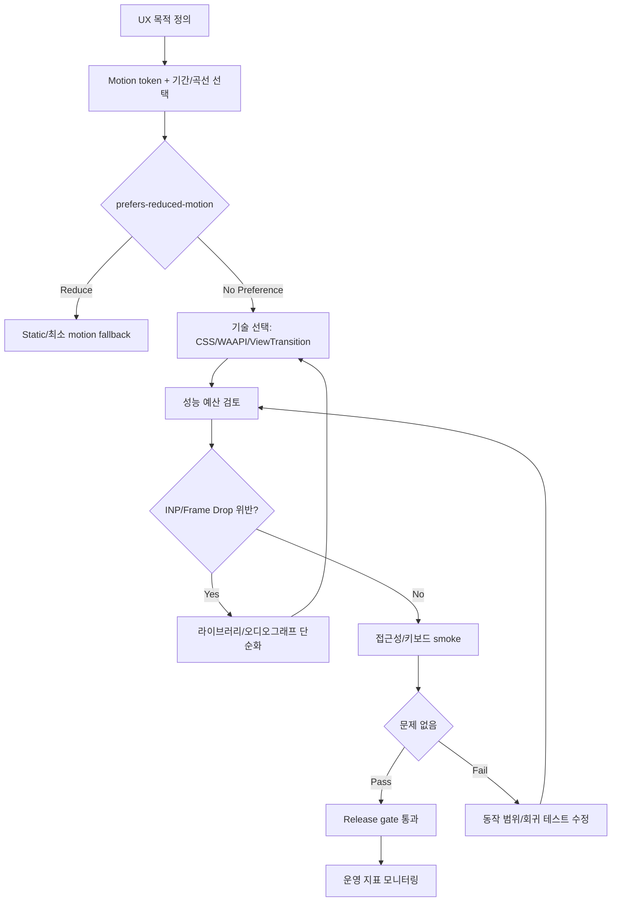

### 0.1 교차 검증 매트릭스

| 권고 | 1차 출처 | 실행 증거 | 운영 증거 | 철회 조건 |
| :--- | :--- | :--- | :--- | :--- |
| View Transitions는 Baseline/compat 확인 후 progressive enhancement로 둔다 | MDN Baseline, CSS View Transitions spec | feature detection, fallback E2E | navigation error, transition skip rate | 핵심 기능이 transition에 의존하게 될 때 |
| scroll animation은 CSS timeline 우선, JS는 fallback/고급 제어에 한정한다 | CSS Scroll-driven Animations spec/MDN | no-JS path, IntersectionObserver fallback | scroll jank, INP, dropped frame | 대상 브라우저가 CSS timeline을 충분히 지원하지 않을 때 |
| reduced motion은 모든 motion component의 필수 분기다 | WCAG/WAI, OS media query 문서 | reduced-motion visual test | motion-related complaint, accessibility issue | 사용자 설정을 무시해야 하는 안전/업무상 필수 motion일 때 |
| 외부 animation library는 bundle/license/a11y 검토 후 채택한다 | 라이브러리 공식 release/license | bundle diff, tree-shaking check | client JS size, runtime error | CSS/WAAPI로 동일 UX를 더 단순히 구현할 수 있을 때 |

### 0.2 운영 게이트

| Gate | Evidence | Owner | Rollback |
| :--- | :--- | :--- | :--- |
| Motion token gate | token diff, design review, usage lint | Design system owner | token 이전 값 복원 또는 component override 제거 |
| Performance gate | INP/long task comparison, frame drop trace | FE owner | motion flag off, simpler CSS transition |
| Reduced-motion gate | screenshot/video evidence, keyboard smoke | Accessibility owner | motion 제거 또는 static fallback |
| Library adoption gate | bundle diff, license check, a11y fallback | Platform owner | library 제거 후 CSS/WAAPI 구현으로 대체 |

---


## 1. AI 기반 애니메이션 자동화

이 섹션의 AI 입력 구조, 민감정보 제거, 검증 책임은 [18. AI 개발 워크플로우](./18_AI_개발_워크플로우_종합.md)를 단일 출처로 따릅니다. 여기서는 모션 설계, 성능, 접근성 검증에 필요한 도메인별 질문만 다룹니다.

**일상 비유**: 요리 레시피 초안을 AI에게 받아도, 손님 알레르기(접근성)·주방 화구 수(성능 예산)·식자재 보관 기준(브라우저 호환)을 셰프가 직접 검수해야 손님상에 낼 수 있다.

이 그림은 AI 모션 초안이 어떤 게이트를 거쳐 PR에 머지되는지 의사결정 흐름을 보여줍니다.

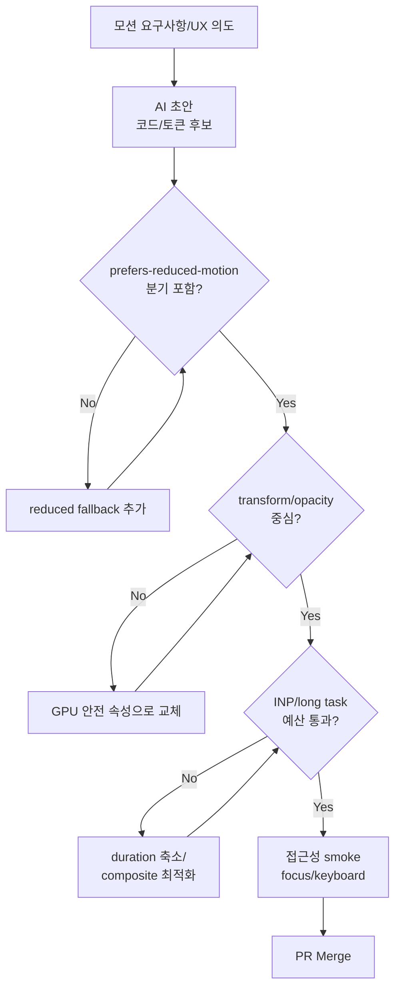

AI는 모션 코드 초안, 성능 개선 후보, 접근성 검증 항목을 빠르게 제안할 수 있다. 최종 모션 언어, 성능 예산, `prefers-reduced-motion` 대응은 디자인 시스템과 실제 브라우저 측정으로 검증한다.

| 시나리오 | 입력 | AI 산출물 | 필수 검증 | 승인 조건 |
| :--- | :--- | :--- | :--- | :--- |
| 컴포넌트 motion 초안 | 컴포넌트 코드, 상태 전이, motion token | CSS/Web Animations/motion library 후보 | interaction test, reduced-motion snapshot | motion이 기능 이해를 보조하고 방해하지 않음 |
| 성능 최적화 | animation code, DevTools trace, INP/LCP | transform/opacity 전환, layout thrash 제거안 | long task, dropped frame, INP 비교 | 성능 예산 악화 없음 |
| View Transitions | route/state transition, browser target | progressive enhancement 패턴 | feature detection, fallback E2E | 미지원 브라우저에서 기능 저하 없음 |
| Scroll animation | scroll trigger, content hierarchy | CSS scroll timeline 또는 IntersectionObserver 패턴 | scroll jank, accessibility smoke | scroll 없이도 콘텐츠 접근 가능 |
| Lottie/vector motion | asset size, renderer, fallback image | 최적화 후보, lazy load 전략 | bundle report, render cost, reduced-motion fallback | 핵심 경로를 막지 않음 |

모션 PR의 hard gate는 다음입니다.

- `prefers-reduced-motion`에서 불필요한 이동/반복 motion 제거
- transform/opacity 외 속성 animation은 성능 근거 필요
- layout shift 또는 focus visibility 회귀 없음
- motion token을 우회하는 임의 duration/easing 최소화

## 2. 환경별 모션 실험 및 검증

### 2.1 Preview 환경에서 모션 변형 검증

```typescript
// src/shared/lib/motion-ab-test.ts
import { useFeatureFlag } from '@/shared/lib/feature-flags';
import { envConfig } from '@/shared/config/environment';

type MotionVariant = 'default' | 'variant-a' | 'variant-b';

interface MotionABTestConfig {
  flagKey: string;
  variants: Record<MotionVariant, MotionPreset>;
}

interface MotionPreset {
  duration: number;
  ease: string;
  stagger: number;
  type: 'spring' | 'tween';
  spring?: { stiffness: number; damping: number };
}

const MOTION_PRESETS: Record<MotionVariant, MotionPreset> = {
  default: {
    duration: 0.3,
    ease: 'easeOut',
    stagger: 0.05,
    type: 'tween',
  },
  'variant-a': {
    duration: 0.4,
    ease: 'easeInOut',
    stagger: 0.08,
    type: 'spring',
    spring: { stiffness: 300, damping: 30 },
  },
  'variant-b': {
    duration: 0.2,
    ease: 'linear',
    stagger: 0.03,
    type: 'tween',
  },
};

export function useMotionVariant(flagKey: string): MotionPreset {
  const variant = useFeatureFlag(flagKey, false);
  const variantB = useFeatureFlag(`${flagKey}-b`, false);

  if (variantB) return MOTION_PRESETS['variant-b'];
  if (variant) return MOTION_PRESETS['variant-a'];
  return MOTION_PRESETS['default'];
}

// Preview 환경 전용: 모든 모션 변형을 나란히 비교
export function useMotionComparison(): {
  enabled: boolean;
  variants: Record<MotionVariant, MotionPreset>;
} {
  return {
    enabled: envConfig.deployEnv === 'preview',
    variants: MOTION_PRESETS,
  };
}
```

```tsx
// src/shared/ui/MotionComparisonPanel.tsx
// Preview 환경에서만 렌더링되는 모션 비교 패널

import { type ReactNode } from 'react';
import { motion, AnimatePresence } from 'motion/react';
import { useMotionComparison } from '@/shared/lib/motion-ab-test';

interface MotionComparisonPanelProps {
  children: (preset: { duration: number; ease: string; stagger: number }) => ReactNode;
}

export function MotionComparisonPanel({ children }: MotionComparisonPanelProps): ReactNode {
  const { enabled, variants } = useMotionComparison();

  if (!enabled) return null;

  return (
    <div style={{
      position: 'fixed',
      bottom: 0,
      left: 0,
      right: 0,
      background: 'rgba(0,0,0,0.9)',
      padding: '16px',
      zIndex: 9999,
      display: 'grid',
      gridTemplateColumns: 'repeat(3, 1fr)',
      gap: '16px',
    }}>
      {Object.entries(variants).map(([name, preset]) => (
        <div key={name} style={{ border: '1px solid #444', padding: '8px', borderRadius: '8px' }}>
          <p style={{ color: '#fff', fontSize: '12px', marginBottom: '8px' }}>
            {name} (duration: {preset.duration}s, ease: {preset.ease})
          </p>
          <AnimatePresence mode="wait">
            {children(preset)}
          </AnimatePresence>
        </div>
      ))}
    </div>
  );
}
```

### 2.2 Feature Flag로 모션 on/off

```typescript
// src/shared/lib/motion-feature-flags.ts
import { useFeatureFlag } from '@/shared/lib/feature-flags';

interface MotionConfig {
  /** 전체 애니메이션 활성화 여부 */
  animationsEnabled: boolean;
  /** 페이지 전환 애니메이션 */
  pageTransitions: boolean;
  /** 마이크로 인터랙션 (hover, tap) */
  microInteractions: boolean;
  /** 스크롤 애니메이션 */
  scrollAnimations: boolean;
  /** Lottie 애니메이션 */
  lottieAnimations: boolean;
  /** 로딩 스켈레톤 애니메이션 */
  skeletonAnimations: boolean;
}

export function useMotionConfig(): MotionConfig {
  const animationsEnabled = useFeatureFlag('motion-enabled', true);
  const pageTransitions = useFeatureFlag('motion-page-transitions', true);
  const microInteractions = useFeatureFlag('motion-micro-interactions', true);
  const scrollAnimations = useFeatureFlag('motion-scroll-animations', true);
  const lottieAnimations = useFeatureFlag('motion-lottie', true);
  const skeletonAnimations = useFeatureFlag('motion-skeleton', true);

  return {
    animationsEnabled,
    pageTransitions: animationsEnabled && pageTransitions,
    microInteractions: animationsEnabled && microInteractions,
    scrollAnimations: animationsEnabled && scrollAnimations,
    lottieAnimations: animationsEnabled && lottieAnimations,
    skeletonAnimations: animationsEnabled && skeletonAnimations,
  };
}

// Feature Flag 연동 모션 래퍼
export function useConditionalMotion(
  flagKey: keyof MotionConfig,
  animateProps: Record<string, unknown>,
  initialProps: Record<string, unknown> = {}
): Record<string, unknown> {
  const config = useMotionConfig();

  if (!config[flagKey]) {
    // 애니메이션 비활성화: 최종 상태를 즉시 적용
    return { ...initialProps, ...animateProps, transition: { duration: 0 } };
  }

  return animateProps;
}
```

### 2.3 환경별 reduced-motion 테스트

```typescript
// src/shared/lib/reduced-motion.ts
import { useEffect, useState } from 'react';
import { envConfig } from '@/shared/config/environment';

/**
 * reduced-motion 감지 훅
 * Preview 환경에서는 URL 파라미터로 강제 토글 가능
 * ?reduced-motion=true 또는 ?reduced-motion=false
 */
export function useReducedMotion(): boolean {
  const [reduced, setReduced] = useState(false);

  useEffect(() => {
    // 1. Preview 환경: URL 파라미터 우선
    if (envConfig.deployEnv === 'preview') {
      const params = new URLSearchParams(window.location.search);
      const forced = params.get('reduced-motion');
      if (forced !== null) {
        setReduced(forced === 'true');
        return;
      }
    }

    // 2. 시스템 설정 감지
    const mql = window.matchMedia('(prefers-reduced-motion: reduce)');
    setReduced(mql.matches);

    const handler = (e: MediaQueryListEvent): void => setReduced(e.matches);
    mql.addEventListener('change', handler);
    return () => mql.removeEventListener('change', handler);
  }, []);

  return reduced;
}

/**
 * reduced-motion 테스트 유틸 (Preview 환경 전용)
 * 화면에 토글 버튼을 표시하여 수동 테스트 가능
 */
export function useReducedMotionDebug(): {
  isReduced: boolean;
  toggle: () => void;
  setReduced: (value: boolean) => void;
} {
  const [overridden, setOverridden] = useState<boolean | null>(null);
  const systemReduced = useReducedMotion();

  const isReduced = overridden ?? systemReduced;

  return {
    isReduced,
    toggle: () => setOverridden((prev) => !(prev ?? systemReduced)),
    setReduced: (value: boolean) => setOverridden(value),
  };
}
```

```tsx
// src/shared/ui/ReducedMotionDebugPanel.tsx
// Preview 환경에서만 표시되는 reduced-motion 테스트 패널

import { type ReactNode } from 'react';
import { envConfig } from '@/shared/config/environment';
import { useReducedMotionDebug } from '@/shared/lib/reduced-motion';

export function ReducedMotionDebugPanel(): ReactNode {
  const { isReduced, toggle } = useReducedMotionDebug();

  if (envConfig.deployEnv !== 'preview') return null;

  return (
    <div style={{
      position: 'fixed',
      top: 8,
      right: 8,
      zIndex: 10000,
      background: isReduced ? '#ef4444' : '#22c55e',
      color: '#fff',
      padding: '6px 12px',
      borderRadius: '6px',
      fontSize: '12px',
      cursor: 'pointer',
      fontFamily: 'monospace',
    }} onClick={toggle}>
      Motion: {isReduced ? 'REDUCED' : 'FULL'}
    </div>
  );
}
```

---

## 3. 애니메이션 기술 비교

**일상 비유**: 카페에서 컵 그림을 그리는 방법과 같다. 칠판에 분필(CSS)은 빠르고 손쉽고, 종이에 펜(WAAPI)은 정밀 제어가 가능하며, 디지털 태블릿(GSAP/Timeline)은 정교한 시퀀스가 가능하지만 장비가 무겁다. 인스타용 짧은 영상(Lottie)은 사전 렌더링된 결과물에 가깝다.

이 그림은 사용 목적에 따라 어떤 애니메이션 기술을 골라야 하는지 결정 트리로 보여줍니다.

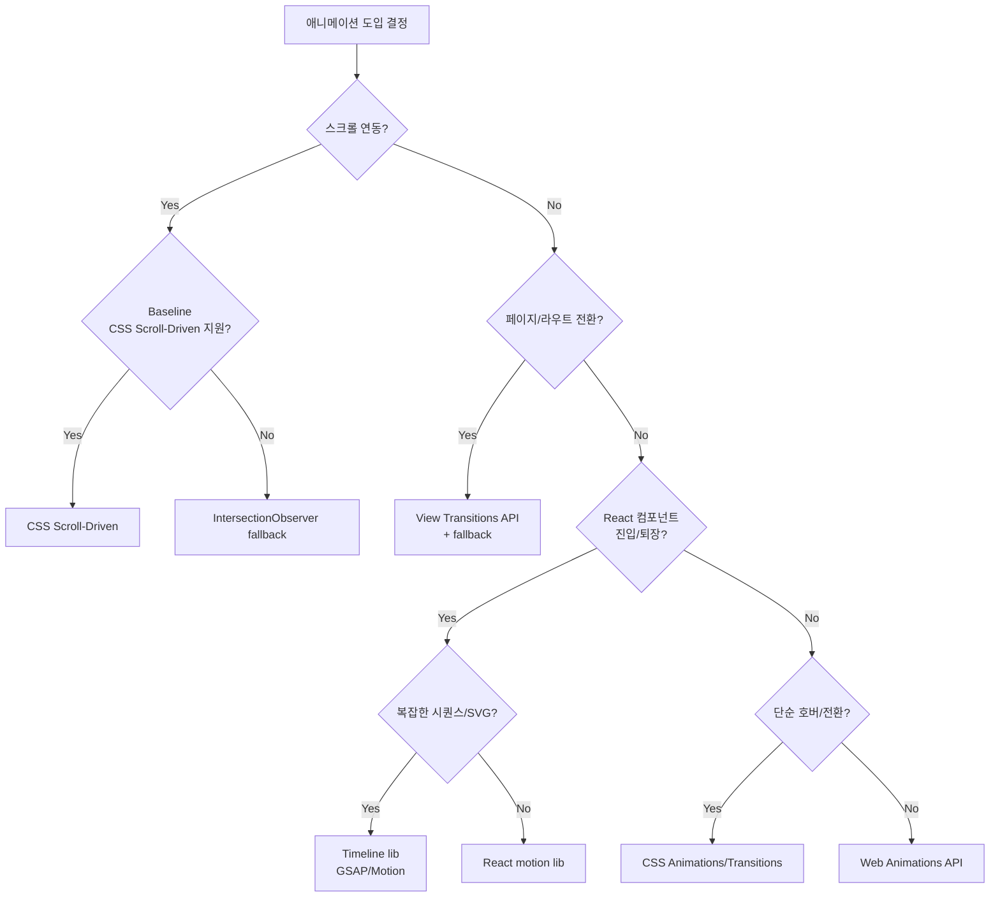

| 기술 | 적합 용도 | 번들 크기 | 성능 | 접근성 | 학습 곡선 |
|------|-----------|----------|------|--------|----------|
| **CSS Animations** | 간단한 전환, 호버 | 0 KB | 최고 | 기본 지원 | 낮음 |
| **CSS `linear()` easing** | 스프링 물리 곡선 | 0 KB | 최고 | 기본 지원 | 낮음 |
| **Web Animations API** | JS 제어 필요한 경우 | 0 KB | 높음 | 수동 | 중간 |
| **React motion library** | React 컴포넌트 애니메이션 | 라이브러리별 상이 | 높음 | 훅 제공 여부 확인 | 중간 |
| **Timeline library** | 복잡한 타임라인, SVG, 정밀 제어 | 라이브러리별 상이 | 높음 | 수동 | 높음 |
| **View Transitions L1** | SPA 페이지 전환 | 0 KB | 높음 | 브라우저 내장 | 낮음 |
| **View Transitions L2 (MPA)** | 다중 페이지 전환 (cross-document) | 0 KB | 높음 | 브라우저 내장 | 낮음 |
| **Vector animation renderer** | 일러스트/아이콘 애니메이션 | 렌더러별 상이 | 중간 | 수동 | 낮음 |
| **Lightweight timeline library** | 경량 타임라인 | 라이브러리별 상이 | 높음 | 수동 | 낮음 |
| **CSS Scroll-Driven** | 스크롤 연동 (Baseline 2025) | 0 KB | 최고 | 기본 지원 | 중간 |

### 선택 가이드

**일상 비유**: 시계의 째깍 소리(CSS)는 기계가 자동으로 내고, 음악 메트로놈(JS)은 사람이 박자를 직접 조절한다. 같은 60bpm을 내더라도 자동(CSS)이 배터리(메인스레드)를 덜 쓴다. 단, 사람이 박자를 도중에 바꾸려면 메트로놈(JS)이 필요하다.

이 그림은 CSS와 JS 애니메이션을 어떤 기준으로 나눠 쓸지 보여줍니다.

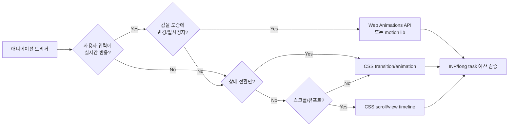

```
간단한 호버/전환 → CSS Animations (JS 불필요)
React 컴포넌트 진입/퇴장 → React motion library
페이지 전환 → View Transitions API (+ fallback)
스크롤 기반 → CSS scroll() / IntersectionObserver fallback
복잡한 시퀀스 → Timeline library
일러스트 애니메이션 → Vector animation renderer
스크롤 연동 (JS 없이) → CSS Scroll-Driven Animations
```

### CSS Animations 기본 패턴

```css
/* GPU 가속 속성만 사용하는 애니메이션 */

/* 1. fadeInUp - 가장 범용적인 진입 애니메이션 */
@keyframes fadeInUp {
  from {
    opacity: 0;
    transform: translateY(20px);
  }
  to {
    opacity: 1;
    transform: translateY(0);
  }
}

.animate-fade-in-up {
  animation: fadeInUp 0.3s ease-out both;
}

/* 2. 스켈레톤 로딩 - 콘텐츠 로드 전 시각적 피드백 */
@keyframes shimmer {
  from { transform: translateX(-100%); }
  to { transform: translateX(100%); }
}

.skeleton {
  position: relative;
  overflow: hidden;
  background: #e5e7eb;
}

.skeleton::after {
  content: '';
  position: absolute;
  inset: 0;
  background: linear-gradient(90deg, transparent, rgba(255,255,255,0.4), transparent);
  animation: shimmer 1.5s infinite;
}

/* 3. 스핀 로더 - transform만 사용하여 GPU 가속 */
@keyframes spin {
  to { transform: rotate(360deg); }
}

.spinner {
  width: 24px;
  height: 24px;
  border: 2px solid #e5e7eb;
  border-top-color: #3b82f6;
  border-radius: 50%;
  animation: spin 0.6s linear infinite;
}

/* 4. 펄스 효과 - 주의를 끄는 인터랙션 */
@keyframes pulse {
  0%, 100% { opacity: 1; }
  50% { opacity: 0.5; }
}

.animate-pulse {
  animation: pulse 2s cubic-bezier(0.4, 0, 0.6, 1) infinite;
}

/* 5. reduced-motion 대응 - 반드시 포함 */
@media (prefers-reduced-motion: reduce) {
  *, *::before, *::after {
    animation-duration: 0.01ms !important;
    animation-iteration-count: 1 !important;
    transition-duration: 0.01ms !important;
    scroll-behavior: auto !important;
  }
}
```

### Web Animations API 패턴

```typescript
// src/shared/lib/web-animations.ts
// 네이티브 Web Animations API 유틸리티 (번들 0KB)

interface AnimationOptions {
  duration?: number;
  easing?: string;
  fill?: FillMode;
  delay?: number;
}

/** fadeInUp 애니메이션 - 가장 범용적인 진입 효과 */
export function fadeInUp(
  element: HTMLElement,
  options: AnimationOptions = {}
): Animation {
  const { duration = 300, easing = 'ease-out', fill = 'forwards', delay = 0 } = options;

  return element.animate(
    [
      { opacity: 0, transform: 'translateY(20px)' },
      { opacity: 1, transform: 'translateY(0)' },
    ],
    { duration, easing, fill, delay }
  );
}

/** stagger 패턴 - 자식 요소를 순차적으로 등장시킴 */
export function staggerChildren(
  container: HTMLElement,
  selector: string,
  options: AnimationOptions & { stagger?: number } = {}
): Animation[] {
  const { stagger = 50, ...animOptions } = options;
  const children = container.querySelectorAll<HTMLElement>(selector);

  return Array.from(children).map((child, i) =>
    fadeInUp(child, { ...animOptions, delay: i * stagger })
  );
}

/** IntersectionObserver 연동: 뷰포트 진입 시 애니메이션 실행 */
export function animateOnScroll(
  elements: HTMLElement[],
  animationFn: (el: HTMLElement) => Animation,
  threshold: number = 0.2
): () => void {
  const observer = new IntersectionObserver(
    (entries) => {
      for (const entry of entries) {
        if (entry.isIntersecting) {
          animationFn(entry.target as HTMLElement);
          observer.unobserve(entry.target);
        }
      }
    },
    { threshold }
  );

  for (const el of elements) observer.observe(el);

  // 클린업 함수 반환
  return () => observer.disconnect();
}

/**
 * 키프레임 체이닝 - 복수 애니메이션을 순차 실행
 * Web Animations API의 finished Promise를 활용
 */
export async function chainAnimations(
  element: HTMLElement,
  keyframeSequence: Keyframe[][],
  options: AnimationOptions = {}
): Promise<void> {
  for (const keyframes of keyframeSequence) {
    const anim = element.animate(keyframes, {
      duration: options.duration ?? 300,
      easing: options.easing ?? 'ease-out',
      fill: 'forwards',
    });
    await anim.finished; // 이전 애니메이션 완료 후 다음 실행
  }
}
```

### React motion library 실전 패턴

> **채택 기준**: 특정 라이브러리를 표준으로 고정하지 않습니다. 공식 release note, 라이선스, 번들 크기, React/프레임워크 호환성, reduced motion 지원, SSR/RSC 호환성을 확인한 뒤 프로젝트별로 선택합니다.

```bash
# 예시: 선택한 motion library를 route-level로 지연 로드
pnpm add <motion-library>
```

```tsx
// src/shared/ui/AnimatedList.tsx
// 리스트 아이템 stagger 진입/퇴장 애니메이션

import { motion, AnimatePresence, type Variants } from 'motion/react';
import { type ReactNode } from 'react';
import { useReducedMotion } from '@/shared/lib/reduced-motion';
import { useMotionConfig } from '@/shared/lib/motion-feature-flags';

// 컨테이너: stagger로 자식 순차 등장
const containerVariants: Variants = {
  hidden: {},
  visible: {
    transition: { staggerChildren: 0.05 },
  },
  exit: {},
};

// 아이템: fadeInUp 진입 + fadeOut 퇴장
const itemVariants: Variants = {
  hidden: { opacity: 0, y: 20 },
  visible: {
    opacity: 1,
    y: 0,
    transition: { duration: 0.3, ease: 'easeOut' },
  },
  exit: {
    opacity: 0,
    y: -10,
    transition: { duration: 0.2 },
  },
};

// reduced-motion 사용자: opacity만 즉시 변경
const reducedVariants: Variants = {
  hidden: { opacity: 0 },
  visible: { opacity: 1, transition: { duration: 0.01 } },
  exit: { opacity: 0, transition: { duration: 0.01 } },
};

interface AnimatedListProps<T> {
  items: T[];
  keyExtractor: (item: T) => string;
  renderItem: (item: T) => ReactNode;
}

export function AnimatedList<T>({
  items,
  keyExtractor,
  renderItem,
}: AnimatedListProps<T>): ReactNode {
  const prefersReduced = useReducedMotion();
  const { animationsEnabled } = useMotionConfig();
  const shouldAnimate = animationsEnabled && !prefersReduced;

  const variants = shouldAnimate ? itemVariants : reducedVariants;

  return (
    <motion.ul
      variants={containerVariants}
      initial="hidden"
      animate="visible"
      exit="exit"
    >
      <AnimatePresence mode="popLayout">
        {items.map((item) => (
          <motion.li
            key={keyExtractor(item)}
            variants={variants}
            layout={shouldAnimate}
          >
            {renderItem(item)}
          </motion.li>
        ))}
      </AnimatePresence>
    </motion.ul>
  );
}
```

### Motion 12: Shared Layout Animation

```tsx
// src/shared/ui/SharedLayoutTabs.tsx
// 탭 전환 시 indicator가 부드럽게 이동하는 패턴

import { motion, AnimatePresence } from 'motion/react';
import { useState, type ReactNode } from 'react';
import { useReducedMotion } from '@/shared/lib/reduced-motion';

interface Tab {
  id: string;
  label: string;
  content: ReactNode;
}

interface SharedLayoutTabsProps {
  tabs: Tab[];
  defaultTab?: string;
}

export function SharedLayoutTabs({ tabs, defaultTab }: SharedLayoutTabsProps): ReactNode {
  const [activeTab, setActiveTab] = useState(defaultTab ?? tabs[0]?.id ?? '');
  const prefersReduced = useReducedMotion();

  return (
    <div>
      {/* 탭 헤더 */}
      <div style={{ display: 'flex', gap: '4px', borderBottom: '1px solid #e5e7eb' }}>
        {tabs.map((tab) => (
          <button
            key={tab.id}
            onClick={() => setActiveTab(tab.id)}
            style={{
              position: 'relative',
              padding: '8px 16px',
              background: 'none',
              border: 'none',
              cursor: 'pointer',
              color: activeTab === tab.id ? '#3b82f6' : '#6b7280',
              fontWeight: activeTab === tab.id ? 600 : 400,
            }}
          >
            {tab.label}
            {/* layoutId로 indicator가 탭 간 부드럽게 이동 */}
            {activeTab === tab.id && (
              <motion.div
                layoutId="tab-indicator"
                style={{
                  position: 'absolute',
                  bottom: -1,
                  left: 0,
                  right: 0,
                  height: 2,
                  background: '#3b82f6',
                }}
                transition={prefersReduced
                  ? { duration: 0 }
                  : { type: 'spring', stiffness: 500, damping: 30 }
                }
              />
            )}
          </button>
        ))}
      </div>

      {/* 탭 콘텐츠 */}
      <AnimatePresence mode="wait">
        <motion.div
          key={activeTab}
          initial={prefersReduced ? {} : { opacity: 0, y: 10 }}
          animate={{ opacity: 1, y: 0 }}
          exit={prefersReduced ? {} : { opacity: 0, y: -10 }}
          transition={{ duration: prefersReduced ? 0 : 0.2 }}
          style={{ padding: '16px 0' }}
        >
          {tabs.find((t) => t.id === activeTab)?.content}
        </motion.div>
      </AnimatePresence>
    </div>
  );
}
```

---

## 4. View Transitions API 실전 패턴

**일상 비유**: 뮤지컬 무대의 암전(snapshot)→세트 교체(DOM 변경)→조명 점등(animation)과 같다. 관객(사용자)은 깜빡임 없이 새 장면을 본다. 미지원 브라우저는 암전 없이 세트만 바뀌므로 fallback이 필요하다.

이 그림은 View Transitions API의 라이프사이클과 상태 전이를 보여줍니다.

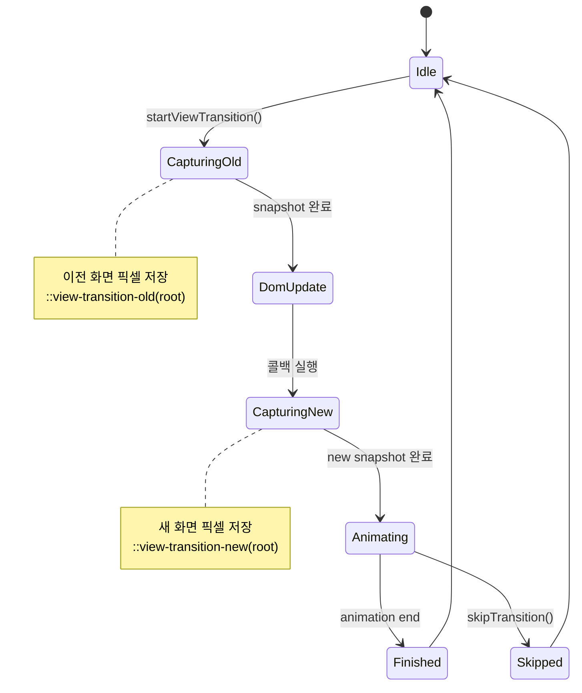

이 그림은 호출자 코드와 브라우저가 View Transition을 어떻게 주고받는지 보여줍니다.

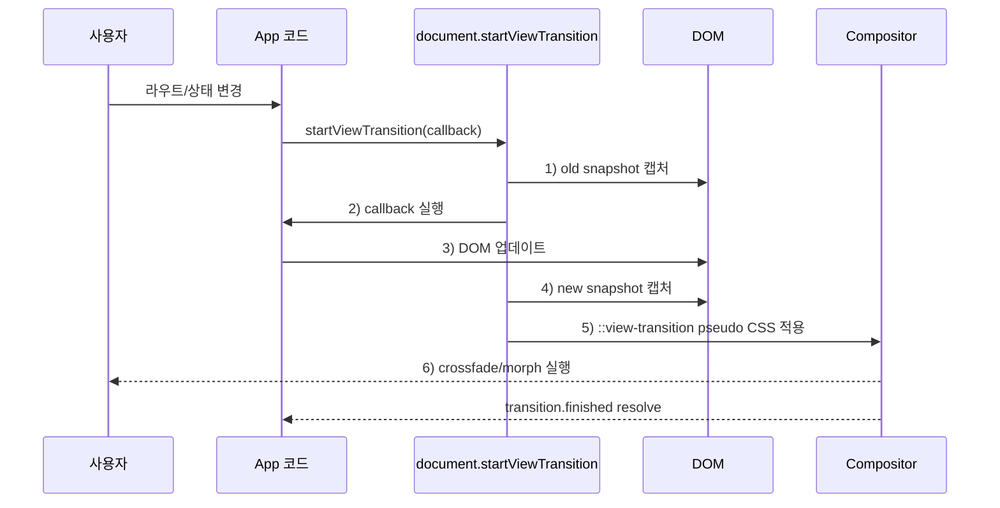

> **참고**: View Transitions API는 현재 공식 문서 기준 Chrome, Edge, Safari 18+에서 정식 지원되며, Firefox는 진행 중입니다(L1 부분 지원). 더 자세한 호환성 현황은 [13. 브라우저 호환성 가이드](./13_브라우저_호환성_가이드.md)에서 확인하세요.
>
> **Level 1 vs Level 2 차이**
> - **L1 (Same-Document)**: SPA 내에서 `document.startViewTransition()` 호출 -- 같은 문서 안에서 DOM 변경 전환.
> - **L2 (Cross-Document, 최신 안정화)**: MPA에서 `@view-transition { navigation: auto }` CSS 한 줄로 페이지 간 전환을 JS 없이 활성화. Next.js MPA 라우팅이나 Astro 같은 정적 페이지에서 즉시 활용 가능.

### Level 2 (Cross-Document) 최소 설정

```css
/* src/shared/styles/cross-document-transitions.css */
/* MPA -- HTML 페이지 간 자동 전환 */

@view-transition {
  navigation: auto;
}

/* 페이지 공통 전환 -- crossfade */
::view-transition-old(root),
::view-transition-new(root) {
  animation-duration: 300ms;
  /* 현재 Baseline -- 스프링 물리는 CSS만으로 표현 가능 */
  animation-timing-function: linear(
    0, 0.045, 0.18, 0.4, 0.7, 1.025, 1.205, 1.3,
    1.32, 1.3, 1.225, 1.135, 1.05, 0.985, 0.94, 0.92, 0.92,
    0.935, 0.965, 1, 1.03, 1.045, 1.045, 1.035, 1.02, 1.01,
    1, 0.995, 0.995, 1
  );
}

/* 특정 요소만 morph -- 공유 요소 애니메이션 */
.product-hero {
  view-transition-name: product-hero;
}
```

```html
<!-- HTML head에 활성화 메타가 필요한 경우 -->
<meta name="view-transition" content="same-origin" />
```

> Cross-document 전환은 **동일 출처(same-origin)** 페이지 간에만 작동하며, `prefers-reduced-motion` 사용자에게는 자동으로 비활성화된다.

### useViewTransition 훅

```typescript
// src/shared/lib/use-view-transition.ts
import { useCallback, useRef } from 'react';

type TransitionType = 'crossfade' | 'slide-left' | 'slide-right' | 'scale' | 'none';

interface ViewTransitionOptions {
  type?: TransitionType;
  duration?: number;
}

interface ViewTransitionResult {
  startTransition: (callback: () => void | Promise<void>) => Promise<void>;
  isSupported: boolean;
}

export function useViewTransition(options: ViewTransitionOptions = {}): ViewTransitionResult {
  const { type = 'crossfade', duration = 300 } = options;
  const transitionRef = useRef<ViewTransition | null>(null);

  const isSupported = typeof document !== 'undefined' && 'startViewTransition' in document;

  const startTransition = useCallback(
    async (callback: () => void | Promise<void>) => {
      if (!isSupported) {
        // 미지원 브라우저: 즉시 콜백 실행 (fallback)
        await callback();
        return;
      }

      // 전환 타입 CSS class 설정
      document.documentElement.dataset.transitionType = type;
      document.documentElement.style.setProperty('--transition-duration', `${duration}ms`);

      const transition = document.startViewTransition(async () => {
        await callback();
      });

      transitionRef.current = transition;

      try {
        await transition.finished;
      } finally {
        delete document.documentElement.dataset.transitionType;
      }
    },
    [isSupported, type, duration]
  );

  return { startTransition, isSupported };
}
```

### View Transition CSS

```css
/* src/shared/styles/view-transitions.css */

/* 기본: crossfade - 가장 자연스러운 페이지 전환 */
::view-transition-old(root),
::view-transition-new(root) {
  animation-duration: var(--transition-duration, 300ms);
}

/* slide-left - "다음 페이지" 느낌 */
[data-transition-type="slide-left"]::view-transition-old(root) {
  animation: slide-out-left var(--transition-duration) ease-in-out;
}
[data-transition-type="slide-left"]::view-transition-new(root) {
  animation: slide-in-right var(--transition-duration) ease-in-out;
}

/* slide-right - "뒤로 가기" 느낌 */
[data-transition-type="slide-right"]::view-transition-old(root) {
  animation: slide-out-right var(--transition-duration) ease-in-out;
}
[data-transition-type="slide-right"]::view-transition-new(root) {
  animation: slide-in-left var(--transition-duration) ease-in-out;
}

/* scale - 모달/다이얼로그 열기/닫기 */
[data-transition-type="scale"]::view-transition-old(root) {
  animation: scale-down var(--transition-duration) ease-in-out;
}
[data-transition-type="scale"]::view-transition-new(root) {
  animation: scale-up var(--transition-duration) ease-in-out;
}

@keyframes slide-out-left {
  to { transform: translateX(-100%); opacity: 0; }
}
@keyframes slide-in-right {
  from { transform: translateX(100%); opacity: 0; }
}
@keyframes slide-out-right {
  to { transform: translateX(100%); opacity: 0; }
}
@keyframes slide-in-left {
  from { transform: translateX(-100%); opacity: 0; }
}
@keyframes scale-down {
  to { transform: scale(0.95); opacity: 0; }
}
@keyframes scale-up {
  from { transform: scale(0.95); opacity: 0; }
}

/* reduced-motion 사용자: 전환 즉시 완료 */
@media (prefers-reduced-motion: reduce) {
  ::view-transition-old(root),
  ::view-transition-new(root) {
    animation-duration: 0.01ms !important;
  }
}
```

### React Router v7 + View Transitions 통합

```tsx
// src/app/router/TransitionLink.tsx
// React Router v7과 View Transitions API를 결합한 네비게이션 컴포넌트

import { useNavigate } from 'react-router';
import { useViewTransition } from '@/shared/lib/use-view-transition';
import { type ReactNode, type MouseEvent } from 'react';

interface TransitionLinkProps {
  to: string;
  transition?: 'crossfade' | 'slide-left' | 'slide-right' | 'scale';
  children: ReactNode;
  className?: string;
}

export function TransitionLink({
  to,
  transition = 'crossfade',
  children,
  className,
}: TransitionLinkProps): ReactNode {
  const navigate = useNavigate();
  const { startTransition, isSupported } = useViewTransition({ type: transition });

  const handleClick = async (e: MouseEvent<HTMLAnchorElement>): Promise<void> => {
    e.preventDefault();

    if (isSupported) {
      // View Transitions API 지원 시: 부드러운 전환
      await startTransition(() => {
        navigate(to);
      });
    } else {
      // 미지원 시: 즉시 이동
      navigate(to);
    }
  };

  return (
    <a href={to} onClick={handleClick} className={className}>
      {children}
    </a>
  );
}
```

### View Transition 디버그 오버레이 (Preview 전용)

```tsx
// src/shared/ui/ViewTransitionDebug.tsx
import { useEffect, useState, type ReactNode } from 'react';
import { envConfig } from '@/shared/config/environment';

interface TransitionLog {
  type: string;
  duration: string;
  timestamp: number;
}

export function ViewTransitionDebug(): ReactNode {
  const [logs, setLogs] = useState<TransitionLog[]>([]);

  useEffect(() => {
    if (envConfig.deployEnv !== 'preview') return;

    // data-transition-type 속성 변경을 감지하여 로그 수집
    const observer = new MutationObserver((mutations) => {
      for (const mutation of mutations) {
        if (mutation.attributeName === 'data-transition-type') {
          const type = document.documentElement.dataset.transitionType;
          const duration = getComputedStyle(document.documentElement)
            .getPropertyValue('--transition-duration');
          if (type) {
            setLogs((prev) => [...prev.slice(-9), { type, duration, timestamp: Date.now() }]);
          }
        }
      }
    });

    observer.observe(document.documentElement, { attributes: true });
    return () => observer.disconnect();
  }, []);

  if (envConfig.deployEnv !== 'preview' || logs.length === 0) return null;

  return (
    <div style={{
      position: 'fixed',
      bottom: 8,
      left: 8,
      background: 'rgba(0,0,0,0.85)',
      color: '#10b981',
      padding: '8px 12px',
      borderRadius: '6px',
      fontSize: '11px',
      fontFamily: 'monospace',
      zIndex: 10000,
      maxHeight: '200px',
      overflow: 'auto',
    }}>
      <strong>View Transitions</strong>
      {logs.map((log, i) => (
        <div key={i}>
          [{new Date(log.timestamp).toLocaleTimeString()}] {log.type} ({log.duration})
        </div>
      ))}
    </div>
  );
}
```

---

## 5. 스크롤 기반 애니메이션

**일상 비유**: 도서관에서 책장을 따라 걸어갈 때 책 제목이 또렷해지는 경험 같다. CSS Scroll-Driven은 책장이 직접 조명을 켜는 방식(브라우저 합성)이고, IntersectionObserver fallback은 사서(JS)가 옆에 서서 알려주는 방식이다.

이 그림은 스크롤 애니메이션 기술을 어떤 순서로 시도하고 어디서 fallback할지 보여줍니다.

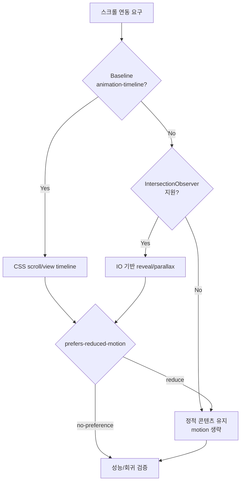

> **참고**: CSS Scroll-Driven Animations는 현재 공식 문서 기준 Chrome/Edge 115+, Safari 26+에서 정식 지원되며, Firefox 137부터 부분 지원이 시작되었습니다. 미지원 브라우저를 위해 IntersectionObserver 기반 JS 폴백을 함께 구현하세요. 성능 측정은 [08. 성능 최적화 가이드](./08_성능_최적화_가이드.md)를 참고합니다.
>
> **CSS `linear()` 스프링 물리 (최신 Baseline)**
> 기존 `cubic-bezier`로 표현하기 어려운 스프링/바운스 곡선을 CSS만으로 구현 가능하다. JavaScript Spring physics 라이브러리 의존도를 크게 줄일 수 있다.
>
> ```css
> /* 스프링 물리 -- React Spring 없이 CSS만으로 */
> .spring-in {
>   animation: spring-in 600ms forwards;
>   animation-timing-function: linear(
>     0, 0.009, 0.035 2.1%, 0.141, 0.281 6.7%, 0.723 12.9%,
>     0.938 16.7%, 1.017, 1.077, 1.121, 1.149 24.3%,
>     1.159, 1.163, 1.161, 1.154 29.9%, 1.129 32.8%,
>     1.051 39.6%, 1.017 43.1%, 0.991, 0.977 51%, 0.974,
>     0.975, 0.991 65.5%, 1
>   );
> }
> /* Scroll Timeline + linear() 조합 -- 스크롤에 스프링 반응 */
> .reveal-spring {
>   animation: reveal linear both;
>   animation-timeline: view();
>   animation-range: entry 10% cover 40%;
>   animation-timing-function: linear(0, 0.5 30%, 0.95 60%, 1);
> }
> ```

### CSS Scroll-Driven Animations (네이티브)

```css
/* 프로그레스 바: CSS만으로 구현 (JS 불필요, 최고 성능) */
.scroll-progress {
  position: fixed;
  top: 0;
  left: 0;
  width: 100%;
  height: 3px;
  background: #3b82f6;
  transform-origin: left;
  animation: progress-bar linear;
  animation-timeline: scroll(root); /* 루트 스크롤에 연동 */
}

@keyframes progress-bar {
  from { transform: scaleX(0); }
  to { transform: scaleX(1); }
}

/* 요소가 뷰포트를 통과하며 애니메이션 - view() 타임라인 */
.reveal-on-scroll {
  animation: reveal linear both;
  animation-timeline: view(); /* 요소의 뷰포트 가시성에 연동 */
  animation-range: entry 10% cover 40%; /* 진입 10%~40% 구간에서 실행 */
}

@keyframes reveal {
  from {
    opacity: 0;
    transform: translateY(40px);
  }
  to {
    opacity: 1;
    transform: translateY(0);
  }
}

/* 패럴랙스: CSS scroll()로 깊이감 표현 */
.parallax-layer {
  animation: parallax linear;
  animation-timeline: scroll(root);
}

@keyframes parallax {
  to { transform: translateY(-30%); }
}

/* 카드 스택 효과: 스크롤에 따라 카드가 겹치며 올라옴 */
.card-stack-item {
  animation: card-stack-reveal linear both;
  animation-timeline: view();
  animation-range: entry 0% cover 50%;
}

@keyframes card-stack-reveal {
  from {
    opacity: 0;
    transform: translateY(100px) scale(0.9) rotateX(10deg);
  }
  to {
    opacity: 1;
    transform: translateY(0) scale(1) rotateX(0deg);
  }
}

/* 텍스트 하이라이트 진행: 스크롤 위치에 따라 텍스트 강조 */
.highlight-on-scroll {
  background: linear-gradient(to right, #fbbf24, #fbbf24) no-repeat;
  background-size: 0% 100%;
  animation: highlight-progress linear both;
  animation-timeline: view();
  animation-range: entry 20% cover 60%;
}

@keyframes highlight-progress {
  to { background-size: 100% 100%; }
}
```

### React 스크롤 애니메이션 훅

```typescript
// src/shared/lib/use-scroll-animation.ts
// IntersectionObserver 기반 스크롤 애니메이션 (모든 브라우저 지원)

import { useEffect, useRef, useState, type RefObject } from 'react';

interface ScrollAnimationOptions {
  threshold?: number;    // 요소가 얼마나 보여야 트리거 (0~1)
  rootMargin?: string;   // 뷰포트 마진 (조기/지연 트리거)
  once?: boolean;        // 한 번만 실행 여부
}

export function useScrollAnimation<T extends HTMLElement>(
  options: ScrollAnimationOptions = {}
): { ref: RefObject<T | null>; isInView: boolean; progress: number } {
  const { threshold = 0.2, rootMargin = '-50px', once = true } = options;
  const ref = useRef<T | null>(null);
  const [isInView, setIsInView] = useState(false);
  const [progress, setProgress] = useState(0);

  useEffect(() => {
    const el = ref.current;
    if (!el) return;

    // 뷰포트 진입 감지
    const observer = new IntersectionObserver(
      ([entry]) => {
        if (entry.isIntersecting) {
          setIsInView(true);
          if (once) observer.unobserve(el);
        } else if (!once) {
          setIsInView(false);
        }
      },
      { threshold, rootMargin }
    );

    observer.observe(el);

    // 스크롤 진행률 추적 (패럴랙스 등에 활용)
    const handleScroll = (): void => {
      const rect = el.getBoundingClientRect();
      const viewHeight = window.innerHeight;
      const p = Math.max(0, Math.min(1, 1 - rect.top / viewHeight));
      setProgress(p);
    };

    window.addEventListener('scroll', handleScroll, { passive: true });

    return () => {
      observer.disconnect();
      window.removeEventListener('scroll', handleScroll);
    };
  }, [threshold, rootMargin, once]);

  return { ref, isInView, progress };
}
```

### useParallax 훅

```typescript
// src/shared/lib/use-parallax.ts
// JS 기반 패럴랙스 효과 (CSS Scroll-Driven 미지원 브라우저 폴백)

import { useEffect, useRef, type RefObject } from 'react';
import { useReducedMotion } from '@/shared/lib/reduced-motion';

interface ParallaxOptions {
  speed?: number;       // 스크롤 대비 이동 비율 (0.1~1.0, 기본 0.3)
  direction?: 'up' | 'down'; // 이동 방향
}

export function useParallax<T extends HTMLElement>(
  options: ParallaxOptions = {}
): RefObject<T | null> {
  const { speed = 0.3, direction = 'up' } = options;
  const ref = useRef<T | null>(null);
  const prefersReduced = useReducedMotion();

  useEffect(() => {
    const el = ref.current;
    if (!el || prefersReduced) return; // reduced-motion 시 비활성화

    let rafId: number;

    const handleScroll = (): void => {
      rafId = requestAnimationFrame(() => {
        const rect = el.getBoundingClientRect();
        const scrollProgress = (window.innerHeight - rect.top) / (window.innerHeight + rect.height);
        const offset = (scrollProgress - 0.5) * speed * 100;
        const sign = direction === 'up' ? -1 : 1;

        // transform만 사용하여 GPU 가속 보장
        el.style.transform = `translateY(${sign * offset}px)`;
      });
    };

    window.addEventListener('scroll', handleScroll, { passive: true });
    handleScroll(); // 초기 위치 설정

    return () => {
      window.removeEventListener('scroll', handleScroll);
      cancelAnimationFrame(rafId);
    };
  }, [speed, direction, prefersReduced]);

  return ref;
}
```

```tsx
// src/shared/ui/ScrollReveal.tsx
// 뷰포트 진입 시 애니메이션 실행 컴포넌트

import { motion, useInView } from 'motion/react';
import { useRef, type ReactNode } from 'react';
import { useReducedMotion } from '@/shared/lib/reduced-motion';

interface ScrollRevealProps {
  children: ReactNode;
  variant?: 'fadeUp' | 'fadeLeft' | 'scaleIn' | 'none';
  delay?: number;
  once?: boolean;
}

const variants = {
  fadeUp: {
    hidden: { opacity: 0, y: 40 },
    visible: { opacity: 1, y: 0 },
  },
  fadeLeft: {
    hidden: { opacity: 0, x: -40 },
    visible: { opacity: 1, x: 0 },
  },
  scaleIn: {
    hidden: { opacity: 0, scale: 0.9 },
    visible: { opacity: 1, scale: 1 },
  },
  none: {
    hidden: { opacity: 0 },
    visible: { opacity: 1 },
  },
};

export function ScrollReveal({
  children,
  variant = 'fadeUp',
  delay = 0,
  once = true,
}: ScrollRevealProps): ReactNode {
  const ref = useRef<HTMLDivElement | null>(null);
  const isInView = useInView(ref, { once, margin: '-50px' });
  const prefersReduced = useReducedMotion();

  // reduced-motion 사용자: transform 없이 opacity만
  const selectedVariant = prefersReduced ? 'none' : variant;

  return (
    <motion.div
      ref={ref}
      initial="hidden"
      animate={isInView ? 'visible' : 'hidden'}
      variants={variants[selectedVariant]}
      transition={{ duration: 0.5, ease: 'easeOut', delay }}
    >
      {children}
    </motion.div>
  );
}
```

---

## 6. 타임라인 라이브러리 & 고급 시퀀스

복잡한 멀티 스텝 애니메이션 시퀀스, SVG 모핑, 정밀한 타이밍 제어는 CSS/WAAPI만으로 유지보수가 어려울 수 있습니다. 이때는 타임라인 라이브러리를 검토하되, 라이브러리명 자체를 조직 표준으로 고정하지 않습니다.

> **선택 가이드 최신**
> - CSS Scroll-Driven 또는 Web Animations API로 충분한 케이스에서는 외부 라이브러리 도입을 자제합니다.
> - SVG path morph, FLIP, 복잡한 텍스트 분해, 정밀 타임라인처럼 표준 API만으로 비용이 큰 케이스에서만 채택합니다.
> - 무료/상용 라이선스, 플러그인 라이선스, tree-shaking, SSR 호환성을 PR에서 증거로 남깁니다.

### GSAP React 통합 훅

```typescript
// src/shared/lib/use-gsap.ts
// GSAP을 React에서 안전하게 사용하기 위한 훅

import { useEffect, useRef, useCallback } from 'react';
import gsap from 'gsap';
import { ScrollTrigger } from 'gsap/ScrollTrigger';
import { useReducedMotion } from '@/shared/lib/reduced-motion';

// GSAP 플러그인 등록 (한 번만 실행)
gsap.registerPlugin(ScrollTrigger);

interface UseGsapOptions {
  /** reduced-motion 시 애니메이션 비활성화 */
  respectReducedMotion?: boolean;
}

/**
 * GSAP 타임라인을 React 생명주기에 맞게 관리하는 훅
 * 컴포넌트 언마운트 시 자동으로 kill 처리
 */
export function useGsapTimeline(options: UseGsapOptions = {}) {
  const { respectReducedMotion = true } = options;
  const timelineRef = useRef<gsap.core.Timeline | null>(null);
  const prefersReduced = useReducedMotion();

  // 타임라인 생성 함수
  const createTimeline = useCallback(
    (config?: gsap.TimelineVars): gsap.core.Timeline => {
      // 기존 타임라인 정리
      timelineRef.current?.kill();

      const tl = gsap.timeline({
        ...config,
        // reduced-motion 시 즉시 완료
        ...(respectReducedMotion && prefersReduced ? { duration: 0 } : {}),
      });

      timelineRef.current = tl;
      return tl;
    },
    [prefersReduced, respectReducedMotion]
  );

  // 클린업: 컴포넌트 언마운트 시 타임라인 제거
  useEffect(() => {
    return () => {
      timelineRef.current?.kill();
    };
  }, []);

  return { createTimeline, timeline: timelineRef };
}
```

### GSAP 히어로 섹션 애니메이션

```tsx
// src/features/hero/HeroAnimation.tsx
// 랜딩 페이지 히어로 섹션의 복잡한 시퀀스 애니메이션

import { useEffect, useRef, type ReactNode } from 'react';
import { useGsapTimeline } from '@/shared/lib/use-gsap';

export function HeroAnimation(): ReactNode {
  const containerRef = useRef<HTMLDivElement>(null);
  const { createTimeline } = useGsapTimeline();

  useEffect(() => {
    const container = containerRef.current;
    if (!container) return;

    // 멀티 스텝 시퀀스: 배경 → 제목 → 부제목 → CTA 버튼 순서
    const tl = createTimeline({ defaults: { ease: 'power3.out' } });

    tl
      // 1단계: 배경 커튼 열기
      .from('[data-hero-bg]', {
        scaleY: 0,
        transformOrigin: 'top',
        duration: 0.8,
      })
      // 2단계: 제목 글자 단위 stagger 진입
      .from('[data-hero-title] .char', {
        y: 100,
        opacity: 0,
        stagger: 0.03,
        duration: 0.6,
      }, '-=0.3') // 이전 애니메이션과 0.3초 겹침
      // 3단계: 부제목 페이드인
      .from('[data-hero-subtitle]', {
        y: 30,
        opacity: 0,
        duration: 0.5,
      }, '-=0.2')
      // 4단계: CTA 버튼 바운스 진입
      .from('[data-hero-cta]', {
        scale: 0.8,
        opacity: 0,
        duration: 0.4,
        ease: 'back.out(1.7)', // 탄성 바운스 효과
      });
  }, [createTimeline]);

  return (
    <div ref={containerRef}>
      <div data-hero-bg style={{ background: '#1e293b', minHeight: '60vh' }}>
        <h1 data-hero-title>
          {/* SplitText 등으로 글자 분리 시 .char 클래스 부여 */}
          <span className="char">W</span>
          <span className="char">e</span>
          <span className="char">l</span>
          <span className="char">c</span>
          <span className="char">o</span>
          <span className="char">m</span>
          <span className="char">e</span>
        </h1>
        <p data-hero-subtitle>부제목 텍스트</p>
        <button data-hero-cta>시작하기</button>
      </div>
    </div>
  );
}
```

### GSAP ScrollTrigger 스크롤 연동

```typescript
// src/shared/lib/use-gsap-scroll.ts
// ScrollTrigger를 활용한 스크롤 기반 애니메이션

import { useEffect, useRef, type RefObject } from 'react';
import gsap from 'gsap';
import { ScrollTrigger } from 'gsap/ScrollTrigger';
import { useReducedMotion } from '@/shared/lib/reduced-motion';

interface ScrollAnimationConfig {
  /** 트리거 시작 위치 (예: 'top 80%') */
  start?: string;
  /** 트리거 종료 위치 (예: 'bottom 20%') */
  end?: string;
  /** 스크롤에 고정 (pin) 여부 */
  pin?: boolean;
  /** 스크롤 진행률에 따라 애니메이션 스크러빙 */
  scrub?: boolean | number;
}

export function useGsapScrollTrigger<T extends HTMLElement>(
  animationFn: (el: T, tl: gsap.core.Timeline) => void,
  config: ScrollAnimationConfig = {}
): RefObject<T | null> {
  const ref = useRef<T | null>(null);
  const prefersReduced = useReducedMotion();
  const { start = 'top 80%', end = 'bottom 20%', pin = false, scrub = false } = config;

  useEffect(() => {
    const el = ref.current;
    if (!el || prefersReduced) return; // reduced-motion 시 비활성화

    const tl = gsap.timeline({
      scrollTrigger: {
        trigger: el,
        start,
        end,
        pin,
        scrub,
        // Preview 환경에서 마커 표시 (디버그용)
        markers: import.meta.env.MODE === 'preview',
      },
    });

    animationFn(el, tl);

    return () => {
      tl.kill();
      ScrollTrigger.getAll().forEach((st) => st.kill());
    };
  }, [animationFn, start, end, pin, scrub, prefersReduced]);

  return ref;
}
```

---

## 7. 성능 최적화

**일상 비유**: 60fps는 한 프레임당 약 16.67ms의 짧은 식사 시간이다. 이 시간 안에 스크립트 요리·스타일 차림·레이아웃 세팅·페인트 그리기·합성 서빙을 끝내야 다음 손님(다음 프레임)을 받을 수 있다. transform/opacity는 합성 단계만 사용하므로 식사 시간이 가장 짧다.

이 그림은 16.67ms 안에서 각 단계가 어떤 비중으로 시간을 잡아먹는지를 보여줍니다.

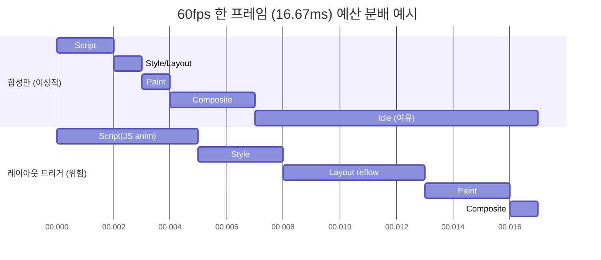

이 그림은 한 페이지의 motion budget이 어떻게 분배되는지를 보여줍니다.

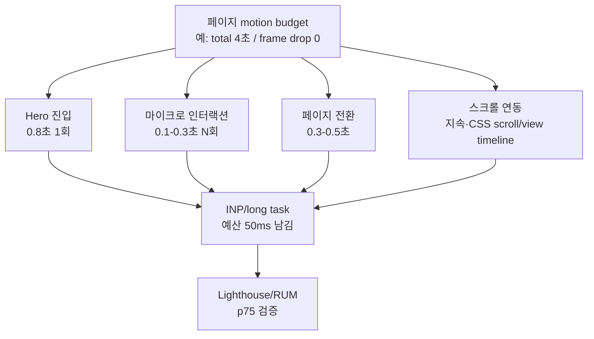

> **참고**: 애니메이션 성능은 Core Web Vitals의 INP(Interaction to Next Paint)에 직접 영향을 줍니다. [08. 성능 최적화 가이드](./08_성능_최적화_가이드.md)의 INP 섹션을 함께 참고하세요.

### 성능 규칙

| 규칙 | 설명 | 위반 시 영향 |
|------|------|-------------|
| **GPU 속성만 애니메이션** | `transform`, `opacity`만 사용. `width`, `height`, `top`, `left` 금지 | 레이아웃 리플로우 발생, 프레임 드롭 |
| **will-change 최소 사용** | 애니메이션 시작 직전 추가, 종료 후 제거 | 메모리 과다 소비, GPU 레이어 폭증 |
| **contain 활용** | `contain: layout style paint`로 리플로우 격리 | 부모/형제 요소까지 리플로우 전파 |
| **뷰포트 밖 정지** | IntersectionObserver로 보이지 않는 애니메이션 정지 | CPU/GPU 리소스 낭비 |
| **requestAnimationFrame** | JS 애니메이션은 반드시 rAF 사용 | 프레임 타이밍 불일치, 쟁크 |
| **composite 최적화** | Web Animations API의 `composite: 'add'` 활용 | 애니메이션 합성 비효율 |
| **CSS 우선 원칙** | CSS로 가능한 것은 JS 미사용 | 메인 스레드 차단, 번들 사이즈 증가 |

### will-change 안전 사용 패턴

```typescript
// src/shared/lib/will-change-manager.ts
// will-change를 안전하게 관리하는 유틸 (메모리 누수 방지)

/**
 * will-change는 브라우저에 "곧 이 속성이 변경될 것"이라고 알려주는 힌트.
 * 남용하면 GPU 레이어가 과도하게 생성되어 오히려 성능 저하 발생.
 * 이 유틸은 애니메이션 직전에 추가하고 완료 후 자동 제거한다.
 */
export function applyWillChange(
  element: HTMLElement,
  properties: string[],
  durationMs: number = 1000
): () => void {
  // will-change 속성 설정
  element.style.willChange = properties.join(', ');

  // 지정 시간 후 자동 제거 (메모리 보호)
  const timerId = window.setTimeout(() => {
    element.style.willChange = 'auto';
  }, durationMs);

  // 수동 정리 함수 반환
  return () => {
    window.clearTimeout(timerId);
    element.style.willChange = 'auto';
  };
}

/**
 * 호버/포커스 시에만 will-change 적용하는 이벤트 리스너
 * 상시 will-change보다 메모리 효율적
 */
export function applyWillChangeOnInteraction(
  element: HTMLElement,
  properties: string[]
): () => void {
  const handleEnter = (): void => {
    element.style.willChange = properties.join(', ');
  };
  const handleLeave = (): void => {
    element.style.willChange = 'auto';
  };

  element.addEventListener('mouseenter', handleEnter);
  element.addEventListener('mouseleave', handleLeave);
  element.addEventListener('focusin', handleEnter);
  element.addEventListener('focusout', handleLeave);

  return () => {
    element.removeEventListener('mouseenter', handleEnter);
    element.removeEventListener('mouseleave', handleLeave);
    element.removeEventListener('focusin', handleEnter);
    element.removeEventListener('focusout', handleLeave);
    element.style.willChange = 'auto';
  };
}
```

### 애니메이션 성능 모니터 (Preview 전용)

```typescript
// src/shared/lib/animation-performance-monitor.ts
import { envConfig } from '@/shared/config/environment';

interface AnimationMetric {
  name: string;
  fps: number;
  droppedFrames: number;
  duration: number;
}

/** 애니메이션 실행 중 실시간 FPS를 측정하는 유틸 */
export function measureAnimationPerformance(
  name: string,
  durationMs: number = 1000
): Promise<AnimationMetric> {
  // 프로덕션에서는 측정 생략 (성능 오버헤드 방지)
  if (envConfig.deployEnv !== 'preview') {
    return Promise.resolve({ name, fps: 60, droppedFrames: 0, duration: durationMs });
  }

  return new Promise((resolve) => {
    let frameCount = 0;
    let startTime = 0;

    const countFrame = (timestamp: number): void => {
      if (startTime === 0) startTime = timestamp;
      frameCount++;

      if (timestamp - startTime < durationMs) {
        requestAnimationFrame(countFrame);
      } else {
        const elapsed = timestamp - startTime;
        const fps = Math.round((frameCount / elapsed) * 1000);
        const expectedFrames = Math.round((elapsed / 1000) * 60);
        const droppedFrames = Math.max(0, expectedFrames - frameCount);

        const metric: AnimationMetric = { name, fps, droppedFrames, duration: elapsed };

        // 50fps 미만: 성능 경고 출력
        if (fps < 50) {
          console.warn(`[Animation Performance] "${name}": ${fps}fps (dropped ${droppedFrames} frames)`);
        }

        resolve(metric);
      }
    };

    requestAnimationFrame(countFrame);
  });
}

/**
 * Performance Observer로 long animation frame 감지
 * Chrome 123+의 LoAF(Long Animation Frames) API 활용
 */
export function observeLongAnimationFrames(
  callback: (entry: PerformanceEntry) => void
): () => void {
  if (envConfig.deployEnv !== 'preview') return () => {};

  try {
    const observer = new PerformanceObserver((list) => {
      for (const entry of list.getEntries()) {
        // 50ms 초과 프레임 감지 (16.7ms x 3)
        if (entry.duration > 50) {
          callback(entry);
        }
      }
    });

    observer.observe({ type: 'long-animation-frame', buffered: true });
    return () => observer.disconnect();
  } catch {
    // LoAF API 미지원 브라우저: 무시
    return () => {};
  }
}
```

---

## 8. 접근성 (prefers-reduced-motion)

**일상 비유**: 식당의 매운맛 선택과 같다. 사용자가 OS 설정에서 "맵게 빼주세요(reduce)"를 표시했는데도 매운 향신료(parallax/큰 이동)를 그대로 내면 손님이 불편(어지러움)을 호소한다. 메뉴(애니메이션)마다 "안 맵게(opacity만)"·"덜 맵게(짧은 duration)"·"빼기(none)" 3옵션을 준비한다.

이 그림은 한 애니메이션을 reduced-motion 사용자에게 어떻게 변환할지 결정하는 흐름을 보여줍니다.

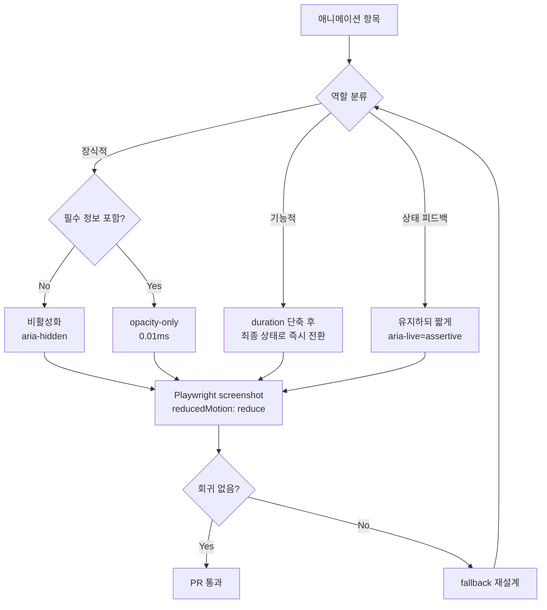

이 그림은 접근성 검증이 모션 PR의 어디서 자동/수동으로 발생하는지를 보여줍니다.

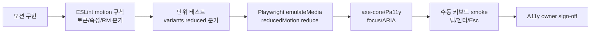

> **참고**: 접근성 관련 상세 가이드라인은 [19. 웹 접근성 가이드](./19_웹_접근성_가이드.md)를 참고하세요. 본 섹션은 애니메이션 특화 접근성에 집중합니다.

### 완전한 접근성 대응

```typescript
// src/shared/lib/motion-accessibility.ts
import { type Variants } from 'motion/react';

/**
 * reduced-motion 사용자를 위한 variant 생성 유틸
 * 모든 애니메이션에 적용하여 일관된 접근성 보장
 *
 * 사용 예시:
 *   const { full, reduced } = createAccessibleVariants(myVariants);
 *   const variants = prefersReduced ? reduced : full;
 */
export function createAccessibleVariants(
  fullMotion: Variants,
  reducedMotion?: Variants
): { full: Variants; reduced: Variants } {
  // reduced-motion 기본값: opacity만 변경, transform 제거
  const defaultReduced: Variants = {};

  for (const [key, value] of Object.entries(fullMotion)) {
    if (typeof value === 'object' && value !== null) {
      const v = value as Record<string, unknown>;
      defaultReduced[key] = {
        opacity: v.opacity ?? 1,
        transition: { duration: 0.01 },
      };
    }
  }

  return {
    full: fullMotion,
    reduced: reducedMotion ?? defaultReduced,
  };
}

/**
 * 애니메이션이 있는 요소에 필수 ARIA 속성 반환
 * 스크린 리더 사용자에게 애니메이션 콘텐츠의 존재를 알림
 */
export function getMotionAriaProps(description: string): Record<string, string> {
  return {
    'aria-live': 'polite',
    'aria-atomic': 'true',
    'aria-label': description,
  };
}

/**
 * 애니메이션 타입별 접근성 권장사항
 * 각 애니메이션 유형에 따라 적절한 접근성 처리를 안내
 */
export const MOTION_A11Y_GUIDELINES = {
  /** 장식적 애니메이션: reduced-motion 시 완전 비활성화 */
  decorative: {
    reducedBehavior: 'disable', // 완전 제거
    ariaHidden: true,           // 스크린 리더 무시
  },
  /** 기능적 애니메이션: reduced-motion 시 즉시 완료 */
  functional: {
    reducedBehavior: 'instant', // duration: 0으로 즉시 최종 상태
    ariaHidden: false,          // 콘텐츠 정보 유지
  },
  /** 상태 피드백: reduced-motion과 무관하게 유지 (짧은 duration) */
  feedback: {
    reducedBehavior: 'keep',    // 유지하되 짧게
    ariaLive: 'assertive',     // 즉시 알림
  },
} as const;
```

### 전역 reduced-motion CSS

```css
/* src/shared/styles/reduced-motion.css */
/* 전역 reduced-motion 스타일 */

@media (prefers-reduced-motion: reduce) {
  /* 모든 애니메이션 비활성화 */
  *, *::before, *::after {
    animation-duration: 0.01ms !important;
    animation-iteration-count: 1 !important;
    transition-duration: 0.01ms !important;
    scroll-behavior: auto !important;
  }

  /* Lottie 컨테이너: 정적 이미지로 대체 */
  [data-lottie-container] {
    display: none;
  }
  [data-lottie-fallback] {
    display: block;
  }

  /* 스켈레톤: 정적 회색 블록 (shimmer 제거) */
  .skeleton::after {
    animation: none !important;
  }

  /* 스크롤 프로그레스: 숨김 (장식적 요소) */
  .scroll-progress {
    display: none;
  }

  /* 패럴랙스: 비활성화 (어지러움 유발 가능) */
  .parallax-layer {
    animation: none !important;
    transform: none !important;
  }
}
```

### 접근성 테스트 E2E (Playwright)

```typescript
// tests/e2e/motion-accessibility.spec.ts
// 애니메이션 접근성 자동화 테스트 - 07. 테스팅 가이드 참고

import { test, expect } from '@playwright/test';

test.describe('애니메이션 접근성', () => {
  test('reduced-motion 설정 시 모든 애니메이션이 비활성화된다', async ({ page }) => {
    // 시스템 설정: reduced-motion 활성화
    await page.emulateMedia({ reducedMotion: 'reduce' });
    await page.goto('/');

    // 모든 요소의 animation-duration이 0에 가까운지 확인
    const animatedElements = await page.locator('[class*="animate"]').all();
    for (const el of animatedElements) {
      const duration = await el.evaluate((e) =>
        getComputedStyle(e).animationDuration
      );
      expect(parseFloat(duration)).toBeLessThanOrEqual(0.01);
    }
  });

  test('Lottie 대신 정적 이미지가 표시된다', async ({ page }) => {
    await page.emulateMedia({ reducedMotion: 'reduce' });
    await page.goto('/');

    // Lottie 컨테이너가 숨겨져야 함
    const lottieContainers = page.locator('[data-lottie-container]');
    await expect(lottieContainers).toHaveCount(0);

    // 폴백 이미지가 표시되어야 함
    const fallbacks = page.locator('[data-lottie-fallback]');
    const count = await fallbacks.count();
    if (count > 0) {
      await expect(fallbacks.first()).toBeVisible();
    }
  });

  test('Lottie 요소에 적절한 ARIA 속성이 있다', async ({ page }) => {
    await page.goto('/');

    const lottieElements = page.locator('[data-lottie-container], [data-lottie-fallback]');
    const count = await lottieElements.count();
    for (let i = 0; i < count; i++) {
      const el = lottieElements.nth(i);
      await expect(el).toHaveAttribute('role', 'img');
      await expect(el).toHaveAttribute('aria-label', /.+/);
    }
  });
});
```

---

## 9. 마이크로 인터랙션 & Lottie

### 마이크로 인터랙션 프리셋

```typescript
// src/shared/ui/micro-interactions.ts
// 재사용 가능한 마이크로 인터랙션 프리셋 모음
// 디자인 시스템 가이드(20)의 토큰과 연동하여 일관성 유지

import { type Variants, type MotionProps } from 'motion/react';

/** 버튼 탭 피드백 - 모든 버튼에 기본 적용 */
export const tapFeedback: MotionProps = {
  whileTap: { scale: 0.97 },
  transition: { type: 'spring', stiffness: 500, damping: 30 },
};

/** 카드 호버 - 인터랙티브 카드에 적용 */
export const cardHover: MotionProps = {
  whileHover: {
    scale: 1.02,
    boxShadow: '0 8px 30px rgba(0,0,0,0.12)',
    transition: { duration: 0.2 },
  },
  whileTap: { scale: 0.98 },
};

/** 토글 스위치 - on/off 상태 전환 */
export const toggleVariants: Variants = {
  off: { x: 0, backgroundColor: '#d1d5db' },
  on: { x: 20, backgroundColor: '#3b82f6' },
};

/** 알림 뱃지 진입 - 숫자 뱃지가 팝업되는 효과 */
export const badgePop: Variants = {
  hidden: { scale: 0, opacity: 0 },
  visible: {
    scale: 1,
    opacity: 1,
    transition: { type: 'spring', stiffness: 500, damping: 25, delay: 0.2 },
  },
};

/** 셰이크 (에러 피드백) - 폼 유효성 검증 실패 시 */
export const shakeVariants: Variants = {
  idle: { x: 0 },
  shake: {
    x: [0, -10, 10, -10, 10, 0],
    transition: { duration: 0.4 },
  },
};

/** 슬라이드 인 (알림/알림) - 화면 외부에서 진입 */
export const slideInVariants: Variants = {
  hidden: { x: '100%', opacity: 0 },
  visible: {
    x: 0,
    opacity: 1,
    transition: { type: 'spring', stiffness: 300, damping: 30 },
  },
  exit: {
    x: '100%',
    opacity: 0,
    transition: { duration: 0.2, ease: 'easeIn' },
  },
};

/** 스켈레톤 펄스 - 콘텐츠 로딩 대기 상태 */
export const skeletonPulse: MotionProps = {
  animate: { opacity: [0.5, 1, 0.5] },
  transition: { duration: 1.5, repeat: Infinity, ease: 'easeInOut' },
};

/** 포커스 링 확장 - 접근성 강화 포커스 표시 */
export const focusRing: MotionProps = {
  whileFocus: {
    boxShadow: '0 0 0 3px rgba(59, 130, 246, 0.5)',
    transition: { duration: 0.15 },
  },
};
```

### Lottie 최적화 래퍼

```tsx
// src/shared/ui/OptimizedLottie.tsx
// Lottie 애니메이션 프로덕션 최적화 래퍼
// - 지연 로딩 (Suspense + IntersectionObserver)
// - reduced-motion 시 정적 이미지 대체
// - Canvas 렌더러 (대형 애니메이션 성능 우수)

import { lazy, Suspense, useRef, useEffect, useState, type ReactNode } from 'react';
import { useReducedMotion } from '@/shared/lib/reduced-motion';
import { envConfig } from '@/shared/config/environment';

// dotLottie 플레이어 지연 로딩 (초기 번들에 포함하지 않음)
const DotLottiePlayer = lazy(() =>
  import('@dotlottie/react-player').then((m) => ({ default: m.DotLottiePlayer }))
);

interface OptimizedLottieProps {
  src: string;
  fallbackSrc: string; // 정적 이미지 (reduced-motion용)
  width?: number;
  height?: number;
  loop?: boolean;
  autoplay?: boolean;
  ariaLabel: string;   // 접근성 필수
  renderer?: 'svg' | 'canvas';
}

export function OptimizedLottie({
  src,
  fallbackSrc,
  width = 200,
  height = 200,
  loop = true,
  autoplay = true,
  ariaLabel,
  renderer = 'canvas', // Canvas가 대형 애니메이션에서 SVG보다 성능 우수
}: OptimizedLottieProps): ReactNode {
  const prefersReduced = useReducedMotion();
  const containerRef = useRef<HTMLDivElement | null>(null);
  const [isVisible, setIsVisible] = useState(false);

  // IntersectionObserver로 뷰포트 진입 시에만 로드
  useEffect(() => {
    const el = containerRef.current;
    if (!el) return;

    const observer = new IntersectionObserver(
      ([entry]) => {
        if (entry.isIntersecting) {
          setIsVisible(true);
          observer.unobserve(el); // 한 번 로드 후 관찰 중단
        }
      },
      { rootMargin: '100px' } // 100px 미리 로드 시작
    );

    observer.observe(el);
    return () => observer.disconnect();
  }, []);

  // reduced-motion 사용자: 정적 이미지로 완전 대체
  if (prefersReduced) {
    return (
      <div data-lottie-fallback="" role="img" aria-label={ariaLabel}>
        
      </div>
    );
  }

  return (
    <div
      ref={containerRef}
      data-lottie-container=""
      role="img"
      aria-label={ariaLabel}
      style={{ width, height }}
    >
      {isVisible && (
        <Suspense fallback={<div style={{ width, height, background: '#f3f4f6' }} />}>
          <DotLottiePlayer
            src={src}
            loop={loop}
            autoplay={autoplay}
            renderer={renderer}
            style={{ width, height }}
          />
        </Suspense>
      )}
      {/* Preview 환경: Lottie 디버그 정보 표시 */}
      {envConfig.deployEnv === 'preview' && isVisible && (
        <div style={{
          fontSize: '10px',
          color: '#6b7280',
          textAlign: 'center',
          fontFamily: 'monospace',
        }}>
          {src.split('/').pop()} | {renderer} | {loop ? 'loop' : 'once'}
        </div>
      )}
    </div>
  );
}
```

---

## 10. 모션 디자인 토큰 & 시스템 통합

> **참고**: 디자인 토큰 체계는 [20. 디자인 시스템 가이드](./20_디자인_시스템_가이드.md)의 토큰 섹션과 통합하여 사용합니다.

애니메이션의 일관성을 보장하기 위해 duration, easing, delay 등을 디자인 토큰으로 관리합니다. 하드코딩된 값 대신 토큰을 사용하면 전역 조정과 실험군 검증이 쉬워집니다.

### 모션 토큰 정의

```css
/* src/shared/styles/motion-tokens.css */
/* Tailwind v4 CSS-first 설정과 통합 */

@theme {
  /* ── Duration 토큰 ── */
  --duration-instant: 0ms;       /* 상태 변경 (즉시) */
  --duration-fast: 100ms;        /* 마이크로 인터랙션 (호버, 탭) */
  --duration-normal: 200ms;      /* 일반 전환 (토글, 드롭다운) */
  --duration-slow: 300ms;        /* 진입/퇴장 애니메이션 */
  --duration-slower: 500ms;      /* 페이지 전환, 모달 */
  --duration-slowest: 800ms;     /* 히어로 섹션, 랜딩 */

  /* ── Easing 토큰 ── */
  --ease-default: cubic-bezier(0.4, 0, 0.2, 1);   /* Material 기본 */
  --ease-in: cubic-bezier(0.4, 0, 1, 1);           /* 가속 (퇴장) */
  --ease-out: cubic-bezier(0, 0, 0.2, 1);          /* 감속 (진입) */
  --ease-in-out: cubic-bezier(0.4, 0, 0.2, 1);     /* 가속→감속 */
  --ease-spring: cubic-bezier(0.175, 0.885, 0.32, 1.275); /* 바운스 느낌 */
  --ease-bounce: cubic-bezier(0.68, -0.55, 0.265, 1.55);  /* 강한 바운스 */

  /* ── Stagger 토큰 ── */
  --stagger-fast: 30ms;          /* 리스트 아이템 */
  --stagger-normal: 50ms;        /* 카드 그리드 */
  --stagger-slow: 80ms;          /* 히어로 텍스트 */
}
```

### TypeScript 모션 토큰

```typescript
// src/shared/config/motion-tokens.ts
// CSS 토큰과 동기화된 TypeScript 상수

/** Duration 토큰 (초 단위 - Framer Motion 호환) */
export const DURATION = {
  instant: 0,
  fast: 0.1,
  normal: 0.2,
  slow: 0.3,
  slower: 0.5,
  slowest: 0.8,
} as const;

/** Easing 토큰 */
export const EASE = {
  default: [0.4, 0, 0.2, 1] as const,
  in: [0.4, 0, 1, 1] as const,
  out: [0, 0, 0.2, 1] as const,
  inOut: [0.4, 0, 0.2, 1] as const,
  spring: { type: 'spring' as const, stiffness: 300, damping: 30 },
  bounce: { type: 'spring' as const, stiffness: 500, damping: 25 },
} as const;

/** Stagger 토큰 (초 단위) */
export const STAGGER = {
  fast: 0.03,
  normal: 0.05,
  slow: 0.08,
} as const;

/**
 * 토큰 기반 transition 생성 헬퍼
 * 하드코딩 대신 토큰을 사용하여 일관성 보장
 */
export function createTransition(
  duration: keyof typeof DURATION = 'normal',
  ease: keyof Omit<typeof EASE, 'spring' | 'bounce'> = 'default'
) {
  return {
    duration: DURATION[duration],
    ease: EASE[ease],
  };
}
```

### ESLint 규칙: 하드코딩 방지

```typescript
// eslint-plugin-motion/no-hardcoded-duration.ts
// 애니메이션 duration 하드코딩을 감지하고 토큰 사용을 권장하는 ESLint 규칙

/*
 * 잘못된 예:
 *   transition={{ duration: 0.3 }}
 *
 * 올바른 예:
 *   import { DURATION } from '@/shared/config/motion-tokens';
 *   transition={{ duration: DURATION.slow }}
 */
```

---

## 11. 체크리스트

### 기본 품질 체크리스트

| # | 항목 | 확인 |
|---|------|------|
| 1 | GPU 가속 속성만 사용 (`transform`, `opacity`) | [ ] |
| 2 | `prefers-reduced-motion` 대응 완료 | [ ] |
| 3 | 뷰포트 밖 애니메이션 정지 (IntersectionObserver) | [ ] |
| 4 | `will-change` 최소 사용 (시작 전 추가, 종료 후 제거) | [ ] |
| 5 | Lottie 파일 dotLottie 변환 완료 | [ ] |
| 6 | 접근성 ARIA 속성 추가 (`role`, `aria-label`) | [ ] |
| 7 | Feature Flag로 모션 on/off 가능 | [ ] |
| 8 | Preview 환경에서 디버그 도구 동작 확인 | [ ] |
| 9 | 모션 실험군 설정 완료 | [ ] |
| 10 | 60fps 이상 유지 확인 (DevTools Performance 탭) | [ ] |

### 성능 체크리스트

| # | 항목 | 확인 |
|---|------|------|
| 1 | `left`/`top`/`width`/`height` 애니메이션 금지 (transform 사용) | [ ] |
| 2 | CSS로 가능한 애니메이션은 JS 미사용 | [ ] |
| 3 | Framer Motion tree-shaking 적용 (`import { motion }` 개별 임포트) | [ ] |
| 4 | Lottie 지연 로딩 (React.lazy + Suspense) | [ ] |
| 5 | `contain: layout style paint` 적용 (리플로우 격리) | [ ] |
| 6 | rAF 기반 JS 애니메이션 (setTimeout/setInterval 금지) | [ ] |
| 7 | 모션 토큰 사용 (하드코딩 duration/easing 금지) | [ ] |
| 8 | 번들 분석에서 미사용 GSAP 플러그인 제외 확인 | [ ] |

### 접근성 체크리스트

| # | 항목 | 확인 |
|---|------|------|
| 1 | `prefers-reduced-motion: reduce` 미디어 쿼리 전역 적용 | [ ] |
| 2 | 장식적 애니메이션: reduced-motion 시 완전 비활성화 | [ ] |
| 3 | 기능적 애니메이션: reduced-motion 시 즉시 완료 (duration: 0) | [ ] |
| 4 | Lottie/Canvas에 `role="img"` + `aria-label` 추가 | [ ] |
| 5 | 자동 재생 애니메이션에 일시정지 버튼 제공 (WCAG 2.2.2) | [ ] |
| 6 | 깜빡임 주파수 3Hz 이하 유지 (WCAG 2.3.1) | [ ] |
| 7 | Playwright E2E 테스트에 reduced-motion 시나리오 포함 | [ ] |

### 배포 전 체크리스트

| # | 항목 | 확인 |
|---|------|------|
| 1 | Preview 환경에서 모든 애니메이션 육안 검증 | [ ] |
| 2 | 디버그 패널/오버레이가 프로덕션에서 제거되는지 확인 | [ ] |
| 3 | View Transitions L1/L2 미지원 브라우저 ([13. 호환성 가이드](./13_브라우저_호환성_가이드.md)) 폴백 동작 확인 | [ ] |
| 4 | 모바일 디바이스 (저사양) 성능 확인 | [ ] |
| 5 | Feature Flag 기본값이 올바른지 확인 | [ ] |
| 6 | Core Web Vitals INP 영향 확인 ([08. 성능 가이드](./08_성능_최적화_가이드.md)) | [ ] |

### 최신 신기술 도입 체크리스트

| # | 항목 | 확인 |
|---|------|------|
| 1 | React motion library 사용 시 공식 release/라이선스/번들 크기 검증 완료 | [ ] |
| 2 | MPA 전환에 `@view-transition { navigation: auto }` 적용 (Level 2) | [ ] |
| 3 | 스프링 곡선을 `linear()` easing으로 표현 (JS 라이브러리 제거 가능 여부 확인) | [ ] |
| 4 | CSS Scroll-Driven Animations로 JS scroll library 대체 가능한 부분 식별 | [ ] |
| 5 | Timeline library 사용 시 플러그인별 라이선스와 tree-shaking 확인 | [ ] |
| 6 | LoAF(Long Animation Frames) PerformanceObserver로 50ms+ 프레임 모니터링 | [ ] |
| 7 | View Transitions L2와 `prefers-reduced-motion` 충돌 없음 확인 | [ ] |

---

## 연관 가이드

| 가이드 | 연관 내용 |
|--------|----------|
| [02. React 19 실무 가이드](./02_React19_실무_가이드.md) | React 19 호환 애니메이션 패턴, Suspense 연동 |
| [07. 테스팅 가이드](./07_테스팅_가이드.md) | Playwright E2E 애니메이션 테스트, reduced-motion 시나리오 |
| [08. 성능 최적화 가이드](./08_성능_최적화_가이드.md) | Core Web Vitals, INP, 번들 사이즈 최적화 |
| [13. 브라우저 호환성 가이드](./13_브라우저_호환성_가이드.md) | View Transitions API 지원 현황, 폴백 전략 |
| [19. 웹 접근성 가이드](./19_웹_접근성_가이드.md) | WCAG 모션 관련 기준, prefers-reduced-motion |
| [20. 디자인 시스템 가이드](./20_디자인_시스템_가이드.md) | 디자인 토큰, Tailwind v4, 컴포넌트 아키텍처 |

---

## 실무 적용 가이드

### 언제 이 문서를 펼칠까

- 모션이 UX를 돕는지 방해하는지 판단해야 할 때
- route transition이나 scroll animation이 성능/접근성을 악화시킬 때
- reduced motion 대응을 표준화해야 할 때

### 적용 순서

1. 모션의 목적을 feedback, continuity, hierarchy, delight 중 하나로 정한다.
2. duration, easing, interruption, cancel 조건을 정의한다.
3. prefers-reduced-motion 대응을 먼저 만든다.
4. INP, long task, frame time을 trace로 확인한다.
5. flag나 fallback으로 모션을 끌 수 있게 한다.

### 함께 두는 파일

- feature 전용 motion config와 component를 같은 폴더에 둔다.
- 공통 transition primitive는 접근성/성능 테스트와 함께 shared로 둔다.
- route transition fallback은 route 가까이에 둔다.

### 흔한 실수

- 장식 목적으로 모든 상태에 animation을 넣는다.
- 사용자 입력 중 애니메이션이 취소되지 않는다.
- reduced motion에서 opacity/transform만 줄이고 flow를 깨뜨린다.
- 무거운 motion library를 초기 번들에 넣는다.

### PR 완료 기준

- [ ] motion 목적과 off 조건이 있다.
- [ ] reduced motion 테스트가 있다.
- [ ] performance trace가 있다.
- [ ] fallback/rollback이 가능하다.

## 추천 항목 실행 우선순위 매핑

- `P1(7일 내)` — 추천 항목 1개를 우선 적용하고 1회 사용자 관측 신호(에러율/실패율/지연)와 연결한다.
- `P2(30일 내)` — 추천 항목 1개를 팀 내 표준/템플릿에 반영해 재사용성을 확보한다.
- `P3(90일 내)` — 추천 항목 1개를 다른 관련 문서에 역링크로 연동해 중복 작업을 줄인다.
- `완료 기준` — 각 항목별 산출물(예: PR 링크/체크리스트/회고 노트)을 1개 이상 남긴다.

## 추천 항목 실행 체크리스트

- [ ] `1단계(7일)` : 추천 항목 1개를 실제 작업으로 전환
- [ ] `2단계(30일)` : 전환 결과를 팀 산출물(ADR/PR/체크리스트)에 반영
- [ ] `3단계(60일)` : 정적 지표 1개 이상으로 효과 검증
- [ ] `문제 대응` : 미달성 시 보류 사유와 다음 실행 액션을 문서화


## 추천 항목 실행 운영 규칙

- `실행 게이트` : 위험, 비용, 기대 효과가 1회 이상 정량화되어야 적용한다.
- `승인 체계` : 적용 전 사전 승인자(팀 리드/보안/운영)와 rollback 담당자를 확인한다.
- `재개 조건` : 실패 신호가 기준치 이내로 돌아오면 다음 단계로 확장한다.
- `정지 조건` : 회귀 지표 악화가 1개 이상이면 즉시 중단하고 보류 사유를 갱신한다.
- `리스크 점수` : 1~5 등급으로 현재 위험도를 기록하고 정량 기준을 남긴다.
- `리더 승인자` : 최종 승인 책임자(예: 팀 리드/PO/보안리더)를 명시한다.
- `승인 역할` : 승인자, 실행자, 모니터링 주체 역할을 분리해 적는다.
- `재평가 주기` : 최소 2주 단위로 상태를 리뷰하고 조정한다.
