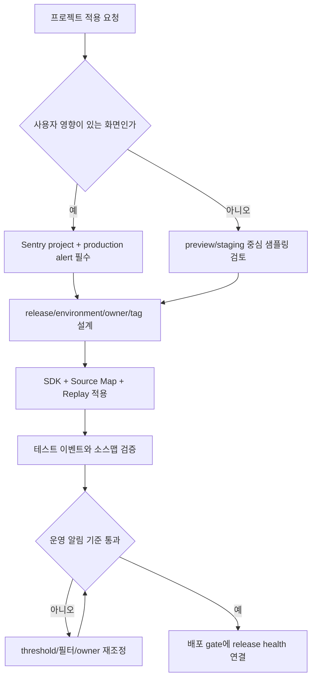
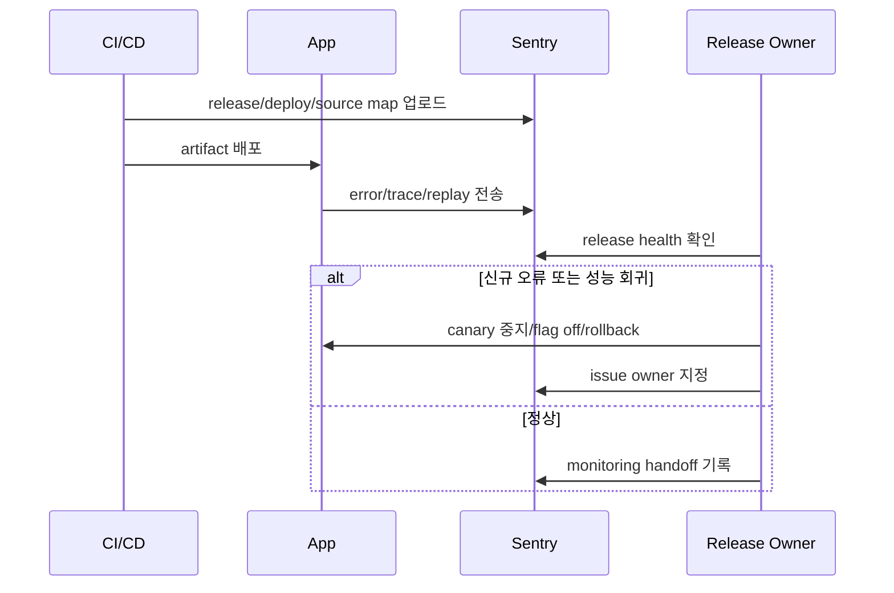
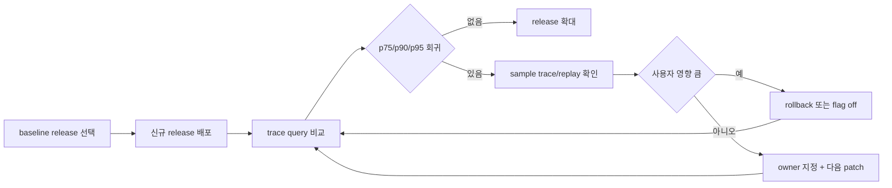
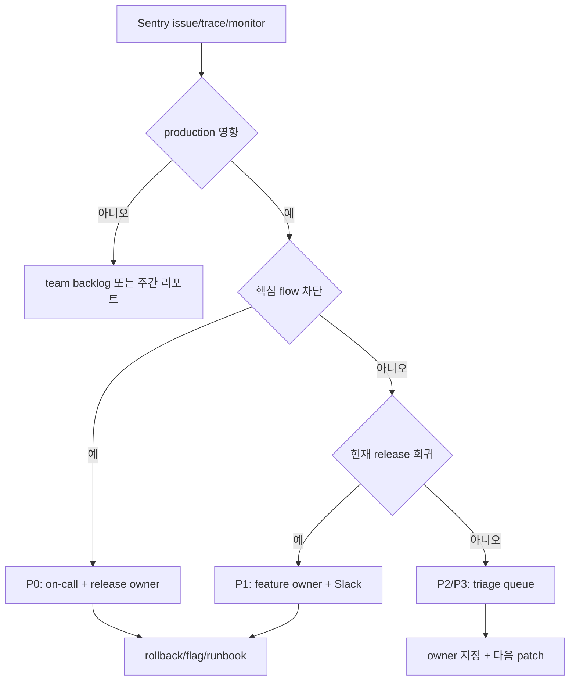

# Sentry 모니터링 활용 가이드

## 0. 문서 복원 배경

현재 저장소와 전체 Git 히스토리에서 `PDF_14_Sentry_모니터링.pdf` 파일은 발견되지 않았습니다. 대신 Sentry 전용 Markdown 가이드는 과거에 존재했습니다.

| 히스토리 단계          | 파일                                               | 상태                                                   |
| :--------------------- | :------------------------------------------------- | :----------------------------------------------------- |
| 초기 설정 커밋         | `public/개발가이드/04_Sentry_관리_표준.md`         | 최초 추가                                              |
| 개발가이드 고도화 커밋 | `public/개발가이드/32_장애_대응_및_Sentry_표준.md` | 장애 대응 문서 계열로 흡수                             |
| 번호 재정렬 커밋       | `public/개발가이드/09_장애_대응_및_Sentry_표준.md` | 번호 재정렬                                            |
| 표준화 커밋            | `public/개발가이드/09_장애_대응_및_관측성_표준.md` | 벤더 중립 관측성 문서로 교체되며 Sentry 상세 내용 삭제 |

이 문서는 삭제된 전용 가이드의 공백을 보완하되, 현재 Sentry 공식 문서 기준으로 SDK 버전과 기능명을 다시 정리한 실행 문서입니다. 공통 원칙은 [09. 장애 대응 및 관측성 표준](./09_장애_대응_및_관측성_표준.md)을 따르고, Sentry 제품별 설정은 이 문서에서만 다룹니다.

> 일상 비유: Sentry는 건물의 화재감지기와 CCTV, 출입 기록을 한 화면에 묶는 관제실과 같습니다. 경보가 울렸다는 사실보다 어느 층에서, 어떤 사람 흐름에서, 어떤 설비 변경 뒤에 문제가 났는지 빨리 좁히는 것이 핵심입니다.

## 추천 항목 (실무 우선순위)

- **시작 추천**: SDK, release, source map을 한 PR에서 먼저 연결하고 테스트 이벤트로 원본 stack trace를 확인하세요.
- **안정 추천**: trace/replay sampling은 트래픽과 개인정보 위험을 보고 조정하되, error replay는 초기에 넉넉히 확보하세요.
- **운영 추천**: P0/P1 alert는 owner, channel, rollback runbook이 같이 있을 때만 production 알림으로 승격하세요.

## 추천 항목 고도화 체크

- `첫 적용` — Sentry SDK, source map upload, production alert 중 하나를 실제 배포 PR에 붙이고 변경 전 기준을 먼저 적는다.
- `증거 정리` — Sentry issue link, release health, trace query, replay masking 확인 중 실제로 남긴 항목만 같은 작업 기록에 연결한다.
- `재점검` — 신규 오류 탐지 시간, source map 매핑 실패, 알림 오탐이 나아졌는지 30일 안에 확인하고 기준을 유지, 수정, 폐기 중 하나로 판정한다.

## 추천 항목 실행 기록 템플릿

- `작업` : Sentry 적용 범위를 어느 앱, route, feature, CI workflow에 둘지 적는다.
- `증거` : test event, release detail, source map upload log, alert dry-run 중 실제로 남긴 항목만 링크한다.
- `판정` : 유지/수정/폐기 중 하나와 이유를 한 문장으로 남긴다.
- `다음 점검` : 알림 오탐, event volume, Replay masking, source map 실패를 다시 볼 날짜와 담당자를 지정한다.

## 문서 책임 범위

| 이 문서가 결정하는 것                                   | 단일 출처로 따르는 문서                                          |
| :------------------------------------------------------ | :--------------------------------------------------------------- |
| Sentry SDK 초기화, source map 업로드, release 연결 방식 | 이 문서                                                          |
| 장애 severity, incident runbook, postmortem 기준        | [09. 장애 대응 및 관측성 표준](./09_장애_대응_및_관측성_표준.md) |
| 배포 전후 gate, rollback, canary 기준                   | [14. 배포 프로세스 체크리스트](./14_배포_프로세스_체크리스트.md) |
| CI secret, artifact, source map upload job 처리         | [11. CI/CD 파이프라인 표준](./11_CICD_파이프라인_표준.md)        |
| 성능 예산과 Core Web Vitals 판정                        | [08. 성능 최적화 가이드](./08_성능_최적화_가이드.md)             |

## 0.1 교차 검증 매트릭스

| 권고                                                | 1차 출처                   | 실행 증거                       | 운영 증거                           | 철회 조건                                    |
| :-------------------------------------------------- | :------------------------- | :------------------------------ | :---------------------------------- | :------------------------------------------- |
| DSN과 auth token은 코드에 쓰지 않는다               | Sentry SDK docs            | env schema, CI secret diff      | secret scan 통과                    | token 노출 또는 local 파일 commit            |
| source map은 release와 같은 artifact에서 업로드한다 | Sentry source map docs     | build log, uploaded artifact id | 원본 stack trace 표시               | minified stack만 보이거나 upload 실패        |
| release health는 canary/rollback 판단에 연결한다    | Sentry releases docs       | release/deploy 기록             | error rate, crash-free session 비교 | release tag가 비어 있거나 rollback 기준 없음 |
| trace alert는 p75/p90/p95 기준으로 만든다           | Sentry tracing docs        | Trace Explorer query            | alert history, sample trace         | 평균만 보고 판단하거나 owner 없음            |
| Replay는 기본 masking을 유지한다                    | Sentry Replay privacy docs | SDK config, 검증 replay         | PII scrub 점검 기록                 | 입력값, 결제, 주소, token 노출               |

## 0.2 운영 게이트

| Gate              | Evidence                                   | Owner          | Rollback                                        |
| :---------------- | :----------------------------------------- | :------------- | :---------------------------------------------- |
| SDK 적용          | error event, trace, replay test link       | Feature owner  | DSN 비활성화 또는 SDK import 제거               |
| Source map upload | CI log, Sentry release artifact            | Release owner  | 이전 artifact 재배포 또는 upload job 중단       |
| Production alert  | P0/P1/P2 rule, channel, runbook link       | On-call owner  | alert disable이 아니라 threshold/filter 조정    |
| Release health    | 이전 release 대비 error/latency 비교       | Release owner  | canary 중지, flag off, rollback                 |
| Privacy review    | beforeSend, Replay masking, scrubbing rule | Security owner | sampling 축소, Replay 비활성화, event 필터 추가 |

## 0.3 기존 PDF 대조 결과

다운로드 폴더의 `PDF_14_Sentry_모니터링.pdf`는 운영 문화와 대시보드 사례가 강점이었고, 일부 SDK 예시는 현재 공식 문서 기준과 달랐습니다. 이 문서에는 아래 기준으로 반영했습니다.

| PDF 주제                   | 반영 위치           | 처리 기준                                                          |
| :------------------------- | :------------------ | :----------------------------------------------------------------- |
| 주간 Sentry 리포트         | 15. 운영 리포트     | 절대 건수보다 전주 대비 변화율과 owner 상태를 보는 방식으로 반영   |
| 이슈 생명주기              | 15.2 이슈 생명주기  | Detected, Investigating, Fixing, Resolved 단계로 정리              |
| 비용 최적화와 샘플링       | 6.1 샘플링과 비용   | `tracesSampleRate`, `tracesSampler`, replay sampling 기준으로 갱신 |
| Source Map 설정            | 3.4, 3.5 source map | Vite와 Webpack 공식 plugin 흐름으로 재작성                         |
| Session Replay             | 7. Replay           | 현재 `replayIntegration()` 기준과 masking 원칙만 유지              |
| Web Vitals와 성능 대시보드 | 6, 15.3 dashboard   | FID 중심 예시는 제외하고 INP/LCP/CLS, trace p75/p95 중심으로 반영  |
| 조직명, 도메인, 금액 예시  | 제외                | 특정 조직 값과 고정 비용은 공통 개발가이드에 넣지 않음             |

## 1. 적용 범위

| 범위          | 이 문서에서 정하는 것                                                    | 제외하는 것                        |
| :------------ | :----------------------------------------------------------------------- | :--------------------------------- |
| 에러 추적     | React/Next.js SDK 초기화, Error Boundary, 릴리스 태그, owner 라우팅      | 서비스별 비즈니스 예외 처리 정책   |
| 성능 검증     | tracing, pageload/navigation/API span 쿼리, 배포 전후 성능 판정          | Core Web Vitals 자체 예산 정의     |
| 프로젝트 적용 | org/project/environment/release 구조, 소스맵, CI secret                  | Sentry 요금제 선택                 |
| 알림 설정     | issue alert, trace alert, uptime/cron alert, Slack/on-call/ticket 라우팅 | 온콜 인사 정책                     |
| 개인정보      | SDK 전송 전 필터링, Replay 마스킹, server-side data scrubbing 점검       | 법무 검토와 개인정보 처리방침 작성 |

## 2. 도입 전 결정표

Sentry는 "에러를 모으는 도구"로만 붙이면 비용과 노이즈가 빠르게 늘어납니다. 먼저 프로젝트별 운영 목적을 정합니다.

| 질문                        | 권장 결정                                                                                                  |
| :-------------------------- | :--------------------------------------------------------------------------------------------------------- |
| 어떤 프로젝트를 만들까      | 사용자-facing 앱은 서비스 단위, 내부 도구는 도메인 단위로 project를 나눕니다.                              |
| 환경은 어떻게 나눌까        | `production`, `staging`, `preview`, `development`를 동일한 release naming 규칙으로 보냅니다.               |
| release 값은 무엇으로 둘까  | 배포 artifact와 1:1로 연결되는 git SHA 또는 `app@sha` 형식을 씁니다.                                       |
| 샘플링은 어디서 줄일까      | development는 높게, production은 트래픽과 quota를 보고 낮춥니다. error replay는 우선 100%로 둡니다.        |
| 누가 알림을 받을까          | Sentry team, project team, CODEOWNERS, feature tag가 같은 ownership 모델을 보게 합니다.                    |
| 어떤 데이터는 보내지 않을까 | token, cookie, authorization header, 주민번호/결제/주소/전화번호/자유 입력 원문은 SDK 단계에서 제거합니다. |



## 3. React/Vite 프로젝트 적용

최신 버전은 npm registry에서 확인합니다. 작업 시점에 확인한 `@sentry/react` 최신 버전은 `10.57.0`입니다. 문서에는 주버전을 고정하지 말고 `@latest` 또는 package lock으로 관리합니다.

### 3.1 설치

```bash
pnpm add @sentry/react
pnpm add -D @sentry/vite-plugin
```

### 3.2 SDK 초기화

Sentry 초기화 파일은 앱 진입점보다 먼저 import되어야 합니다. DSN은 코드에 직접 적지 말고 환경 변수로 둡니다.

```ts
// src/instrument.ts
import * as Sentry from '@sentry/react'

const appEnv = import.meta.env.VITE_APP_ENV ?? import.meta.env.MODE
const isProduction = appEnv === 'production'
const dsn = import.meta.env.VITE_SENTRY_DSN

Sentry.init({
  dsn,
  enabled: Boolean(dsn) && appEnv !== 'local',
  environment: appEnv,
  release: import.meta.env.VITE_RELEASE_VERSION ?? import.meta.env.VITE_COMMIT_SHA,

  integrations: [
    Sentry.browserTracingIntegration(),
    Sentry.replayIntegration({
      maskAllText: true,
      maskAllInputs: true,
      blockAllMedia: true,
    }),
  ],

  tracesSampleRate: isProduction ? 0.1 : 1.0,
  tracePropagationTargets: [/^\//, /^https:\/\/api\.example\.com/],

  replaysSessionSampleRate: isProduction ? 0.01 : 1.0,
  replaysOnErrorSampleRate: 1.0,

  beforeSend(event) {
    if (event.request?.headers) {
      delete event.request.headers.authorization
      delete event.request.headers.Authorization
      delete event.request.headers.cookie
      delete event.request.headers.Cookie
    }

    if (event.request) {
      delete event.request.cookies
    }

    if (event.user) {
      delete event.user.email
      delete event.user.ip_address
    }

    return event
  },
})
```

```ts
// src/main.tsx
import './instrument';

import { createRoot } from 'react-dom/client';
import App from './App';

createRoot(document.getElementById('root')!).render(<App />);
```

React 19 이상에서는 `createRoot`의 error hook을 Sentry와 연결합니다.

```tsx
import './instrument'

import * as Sentry from '@sentry/react'
import { createRoot } from 'react-dom/client'
import App from './App'

createRoot(document.getElementById('root')!, {
  onUncaughtError: Sentry.reactErrorHandler(),
  onCaughtError: Sentry.reactErrorHandler(),
  onRecoverableError: Sentry.reactErrorHandler(),
}).render(<App />)
```

### 3.3 Error Boundary

사용자에게 fallback을 주고, Sentry에는 boundary 이름과 feature tag를 붙입니다.

```tsx
import * as Sentry from '@sentry/react'
import type { ReactNode } from 'react'

export function FeatureErrorBoundary({
  feature,
  children,
}: {
  feature: string
  children: ReactNode
}) {
  return (
    <Sentry.ErrorBoundary
      fallback={({ resetError }) => (
        <section role="alert">
          <h2>일시적인 오류가 발생했습니다</h2>
          <button type="button" onClick={resetError}>
            다시 시도
          </button>
        </section>
      )}
      beforeCapture={(scope) => {
        scope.setTag('feature', feature)
        scope.setTag('boundary', `feature:${feature}`)
      }}
    >
      {children}
    </Sentry.ErrorBoundary>
  )
}
```

### 3.4 Vite 소스맵 업로드

Sentry Vite plugin은 source map 업로드와 release 생성을 빌드 과정에 연결합니다. plugin은 다른 Vite plugin 뒤에 둡니다.

```ts
// vite.config.ts
import { sentryVitePlugin } from '@sentry/vite-plugin'
import react from '@vitejs/plugin-react'
import { defineConfig, loadEnv } from 'vite'

export default defineConfig(({ mode }) => {
  const env = loadEnv(mode, process.cwd(), '')

  return {
    build: {
      sourcemap: 'hidden',
    },
    plugins: [
      react(),
      sentryVitePlugin({
        org: env.SENTRY_ORG,
        project: env.SENTRY_PROJECT,
        authToken: env.SENTRY_AUTH_TOKEN,
        sourcemaps: {
          filesToDeleteAfterUpload: ['./dist/**/*.map'],
        },
      }),
    ],
  }
})
```

운영 원칙은 간단합니다.

- `SENTRY_AUTH_TOKEN`은 CI secret에만 둡니다.
- `.env.sentry-build-plugin`을 쓰면 반드시 `.gitignore`에 포함합니다.
- source map은 production build에서만 업로드합니다.
- 배포 artifact에 `.map` 파일이 남지 않았는지 확인합니다.
- source map 업로드가 실패하면 배포 성공으로 보지 않습니다.

### 3.5 Webpack/legacy build 소스맵

기존 Webpack 프로젝트는 Vite로 옮기기 전에도 같은 release/source map 계약을 지켜야 합니다. PDF에 있던 `SourceMapDevToolPlugin` 중심 예시는 현재 공식 플러그인 흐름에 맞춰 아래처럼 정리합니다.

```bash
pnpm add -D @sentry/webpack-plugin
```

```js
// webpack.config.js
const { sentryWebpackPlugin } = require('@sentry/webpack-plugin')

module.exports = {
  devtool: 'hidden-source-map',
  plugins: [
    sentryWebpackPlugin({
      org: process.env.SENTRY_ORG,
      project: process.env.SENTRY_PROJECT,
      authToken: process.env.SENTRY_AUTH_TOKEN,
      sourcemaps: {
        filesToDeleteAfterUpload: ['./dist/**/*.map'],
      },
    }),
  ],
}
```

Webpack 프로젝트도 원칙은 같습니다.

- source map은 production build에서만 생성하고 업로드합니다.
- `SENTRY_AUTH_TOKEN`은 CI secret에서만 읽습니다.
- `.js.map` 파일은 Sentry 업로드 후 삭제하거나 CDN/server에서 접근을 차단합니다.
- watch/development mode upload를 운영 검증으로 보지 않습니다.
- `noSources`를 켜면 Sentry에서 원본 코드 context가 부족할 수 있으므로 stack trace 품질을 확인합니다.

## 4. Next.js 프로젝트 적용

Next.js는 전용 SDK가 runtime별 설정을 만듭니다. 공식 wizard를 우선 사용합니다.

```bash
npx @sentry/wizard@latest -i nextjs
```

wizard가 생성하는 기준 파일은 다음과 같습니다.

| 파일                        | 역할                                                 |
| :-------------------------- | :--------------------------------------------------- |
| `instrumentation-client.ts` | 브라우저 SDK 초기화                                  |
| `sentry.server.config.ts`   | Node.js runtime 초기화                               |
| `sentry.edge.config.ts`     | Edge runtime 초기화                                  |
| `instrumentation.ts`        | Next.js server/edge 등록                             |
| `app/global-error.tsx`      | App Router rendering error capture                   |
| `next.config.ts`            | `withSentryConfig`로 source map upload와 tunnel 설정 |

`next.config.ts`는 CI에서 source map을 업로드할 수 있게 `SENTRY_AUTH_TOKEN`을 읽습니다.

```ts
import { withSentryConfig } from '@sentry/nextjs'

const nextConfig = {}

export default withSentryConfig(nextConfig, {
  org: process.env.SENTRY_ORG,
  project: process.env.SENTRY_PROJECT,
  authToken: process.env.SENTRY_AUTH_TOKEN,
  tunnelRoute: '/sentry-tunnel',
  silent: !process.env.CI,
})
```

## 5. Release Health와 배포 게이트

Sentry release는 배포된 코드 버전입니다. release가 연결되면 새 이슈, 회귀, suspect commit, crash-free user/session, 배포 알림을 같은 화면에서 볼 수 있습니다.

| 항목          | 기준                                                                |
| :------------ | :------------------------------------------------------------------ |
| release 이름  | `app-name@${GITHUB_SHA}` 또는 tag 기반 semver                       |
| environment   | `production`, `staging`, `preview-pr-123`처럼 실제 노출 범위와 일치 |
| deploy 기록   | CI 배포 job에서 release/deploy를 남김                               |
| source map    | release와 같은 artifact에서 생성된 map만 업로드                     |
| rollback 기준 | 신규 issue 급증, crash-free session 하락, p75/p95 latency 회귀      |

배포 직후 확인 순서:

1. release detail에서 새 issue와 regression을 확인합니다.
2. crash-free users/sessions가 이전 release 대비 떨어졌는지 봅니다.
3. Trace Explorer에서 `release:<current>`와 이전 release를 비교합니다.
4. Session Replay가 error session과 연결되는지 확인합니다.
5. 문제가 있으면 canary 확대를 중지하고 flag off 또는 rollback을 실행합니다.



## 6. 성능 검증

`browserTracingIntegration()`을 켜면 page load, navigation, Fetch/XHR, long animation frame, resource loading이 자동 수집됩니다. 성능 검증은 평균보다 p75/p90/p95로 봅니다.

| 검증 대상       | Sentry query                                                              | 판정 예                                                             |
| :-------------- | :------------------------------------------------------------------------ | :------------------------------------------------------------------ |
| 느린 page load  | `span.op:pageload`                                                        | route별 `p90(span.duration)`가 3초를 넘으면 조사                    |
| 느린 API        | `span.op:http.client`                                                     | endpoint별 `p95(span.duration)`가 2초를 넘으면 backend/network 분리 |
| UI blocking     | `span.op:ui.long-animation-frame`                                         | `p75(span.duration)`가 200ms를 넘으면 main thread 작업 조사         |
| SPA navigation  | `span.op:navigation`                                                      | route 이동이 1초 이상이면 data fetch/render 병목 확인               |
| 무거운 resource | `span.op:resource.script`, `span.op:resource.css`, `span.op:resource.img` | 1초 이상 자산은 번들/캐시/CDN 점검                                  |

### 배포 전후 검증 루프



### 커스텀 span

자동 계측만으로 원인을 설명할 수 없는 구간에는 업무 단위 span을 넣습니다.

```ts
import * as Sentry from '@sentry/react'

export async function submitCheckout(orderId: string) {
  return Sentry.startSpan(
    {
      name: 'checkout.submit',
      op: 'ui.action',
      attributes: { feature: 'checkout', orderId },
    },
    async () => {
      return fetch('/api/checkout', { method: 'POST' })
    },
  )
}
```

### 6.1 샘플링과 비용 관리

Sentry 비용은 대부분 정상 trace, normal replay, 반복 이슈에서 늘어납니다. 에러 가시성은 유지하고 성능 데이터는 통계적으로 충분한 수준만 남기는 방식으로 조정합니다.

| 데이터                        | 시작 기준                                  | 높이는 경우                           | 낮추는 경우                                 |
| :---------------------------- | :----------------------------------------- | :------------------------------------ | :------------------------------------------ |
| Error event                   | SDK 필터링 후 전송 유지                    | 신규 release, canary, 핵심 flow       | bot/extension/noise는 inbound filter로 제외 |
| Performance trace             | production 5~20%, staging 100%             | checkout/payment/login 같은 핵심 flow | quota 초과, 충분한 표본 확보                |
| Error replay                  | error session은 100%에 가깝게 시작         | 재현 어려운 UI 오류, CS 문의 증가     | PII 위험 route, replay storage 과다         |
| Normal replay                 | 낮은 비율 또는 비활성화                    | 사용성 분석 목적이 명확할 때          | 비용 증가, 개인정보 검토 미완료             |
| Long animation frame/resource | 문제 route 중심으로 query와 alert를 만든다 | INP/LCP 회귀가 특정 release에 묶일 때 | 단순 참고 지표라 행동으로 이어지지 않을 때  |

샘플링 결정은 route 중요도와 트래픽을 함께 봅니다.

| route 유형              | trace sample | replay 기준                           | 운영 메모                             |
| :---------------------- | :----------- | :------------------------------------ | :------------------------------------ |
| 결제, 주문, 로그인      | 높게 시작    | error replay 유지                     | 작은 회귀도 P0/P1 후보로 본다         |
| 검색, 상품 목록, 홈     | 중간         | error replay 중심                     | p75/p95와 전환율을 같이 본다          |
| 관리자, 내부 도구       | 낮게 시작    | 필요 시 수동 활성화                   | 사용자 수가 적어 절대 건수보다 재현성 |
| 개인정보 입력 많은 화면 | trace 중심   | normal replay 비활성화 또는 추가 승인 | masking 검증 없이는 replay 확대 금지  |

route별로 비율을 달리해야 하면 `tracesSampleRate` 대신 `tracesSampler`를 둡니다.

```ts
Sentry.init({
  dsn,
  integrations: [Sentry.browserTracingIntegration()],
  tracesSampler: ({ name, attributes, inheritOrSampleWith }) => {
    if (name.includes('/checkout') || attributes?.flow === 'checkout') {
      return 1.0
    }

    if (name.includes('/login') || attributes?.flow === 'auth') {
      return inheritOrSampleWith(0.5)
    }

    if (name.includes('/metrics') || name.includes('/health')) {
      return 0
    }

    return inheritOrSampleWith(0.1)
  },
})
```

운영 원칙은 다음과 같습니다.

- 에러 이벤트를 줄일 때는 sampling보다 `ignoreErrors`, inbound filter, grouping/fingerprint 조정부터 검토합니다.
- 샘플링 변경은 비용 절감만 보지 말고 탐지 시간, 재현 성공률, P0/P1 누락 여부를 함께 봅니다.
- 샘플링 값은 코드 상수나 env config로 관리하고, 변경 사유와 재평가 날짜를 남깁니다.
- canary 기간에는 trace/replay 비율을 높이고, 안정화 후 traffic과 quota에 맞춰 낮춥니다.

## 7. Session Replay 활용

Replay는 stack trace만으로 알 수 없는 사용자 행동, 네트워크 실패, console log, route transition을 함께 봅니다.

| 상황                     | Replay에서 볼 것                            |
| :----------------------- | :------------------------------------------ |
| 에러 급증                | error 발생 직전 클릭, route, 실패 API       |
| 재현 안 되는 사용자 신고 | 사용자의 실제 이동 순서와 form 상태         |
| checkout/가입 전환 저하  | dead click, rage click, 긴 spinner          |
| 성능 저하                | 클릭 후 시각 반응까지 걸린 시간, trace 연결 |

개인정보 기준:

- 기본 masking(`maskAllText`, `maskAllInputs`, `blockAllMedia`)을 유지합니다.
- form input, 결제, 주소, 전화번호, 주민번호, token은 절대 unmask하지 않습니다.
- error session은 `replaysOnErrorSampleRate: 1.0`으로 시작하고, 전체 session sampling은 트래픽에 맞춰 낮춥니다.
- canvas/WebGL recording은 PII scrub이 어렵고 성능 영향이 있으므로 별도 승인 없이 켜지 않습니다.

## 8. 알림 설정

Sentry Alerts는 project 또는 monitor에서 생성된 issue가 조건에 맞을 때 notification, ticket, webhook, on-call action을 실행합니다. 알림은 "확인할 가치"가 아니라 "바로 행동할 가치"로 만듭니다.

| 알림              | 조건 예                                                         | 대상                    | 즉시 행동                            |
| :---------------- | :-------------------------------------------------------------- | :---------------------- | :----------------------------------- |
| P0 핵심 flow 차단 | checkout/login/search 신규 fatal issue, 5분 내 영향 사용자 급증 | on-call + release owner | canary 중지, flag off, rollback 판단 |
| P1 배포 회귀      | 현재 release에서만 new issue/regression 발생                    | feature owner + Slack   | 최근 diff와 source map stack 확인    |
| P2 성능 저하      | `p75(transaction.duration)` 또는 API p95 threshold 초과         | feature owner           | sample trace와 replay로 병목 분리    |
| P2 uptime         | uptime monitor 연속 실패                                        | infra/on-call           | DNS/CDN/API health 확인              |
| P3 반복 노이즈    | non-critical issue 빈도 증가                                    | backlog channel         | ignore/filter/grouping 재조정        |

Sentry UI 구성 순서:

1. Alerts에서 source project 또는 monitor를 선택합니다.
2. environment를 production 중심으로 제한합니다.
3. trigger는 issue created, escalated, regression, unresolved 전환처럼 상태 변화 중심으로 둡니다.
4. filter는 severity, assigned team, tag(`feature`, `route`, `release`)로 좁힙니다.
5. action은 Slack/email/on-call/ticket/webhook 중 하나 이상을 지정합니다.
6. 알림 메시지에는 release, environment, owner, rollback runbook, Sentry issue link가 포함되어야 합니다.

### 8.1 알림 성숙도 단계

알림은 처음부터 정교하게 맞추기 어렵습니다. 초기에 넓게 관찰하되, 운영 채널에는 행동 가능한 신호만 남기는 방식으로 줄입니다.

| 단계        | 목적                     | 설정 방향                                         | 종료 조건                            |
| :---------- | :----------------------- | :------------------------------------------------ | :----------------------------------- |
| 관찰        | 어떤 오류가 나는지 파악  | staging/preview 또는 backlog 채널에 넓게 수집     | 반복 패턴과 핵심 flow 영향이 분류됨  |
| 필터링      | 노이즈 제거              | browser extension, bot, known false positive 제외 | P0/P1 후보가 노이즈에 묻히지 않음    |
| 빈도 기준   | 대규모 장애만 즉시 알림  | 짧은 window의 급증, 사용자 영향, regression 중심  | 산발적 오류가 on-call을 깨우지 않음  |
| 심각도 기준 | 대응 속도와 채널 분리    | P0/P1은 on-call, P2는 feature owner, P3는 backlog | 알림마다 owner와 다음 행동이 정해짐  |
| 주간 조정   | 기준 유지 또는 폐기 판단 | 전주 오탐, 누락, 해결 시간, event volume 리뷰     | threshold, routing, runbook이 갱신됨 |

알림을 production on-call에 연결하기 전에는 다음을 확인합니다.

- 같은 조건으로 staging이나 backlog 채널에서 충분히 관찰했다.
- 알림 수신자가 즉시 할 수 있는 행동이 runbook에 있다.
- alert rule에 `release`, `environment`, `feature`, `route`, `team` 중 최소 두 개 이상의 필터가 있다.
- 오탐을 줄이는 방법이 issue ignore가 아니라 조건, grouping, ownership 조정으로 정리되어 있다.

Trace alert는 Explore > Traces에서 쿼리를 만든 뒤 Alert로 저장합니다. threshold는 static, percent change, anomaly 중 하나를 쓰되 처음에는 static으로 시작해 오탐을 줄입니다.



## 9. Ownership과 라우팅

Sentry ownership rule은 error issue에 적용됩니다. performance/replay issue에는 직접 적용되지 않을 수 있으므로 alert filter와 project/team routing을 함께 둡니다.

예시:

```text
path:src/features/checkout/* #checkout-team
url:https://www.example.com/checkout* #checkout-team
tags.feature:checkout #checkout-team
path:src/features/auth/* #auth-team
tags.route:/login #auth-team
```

운영 규칙:

- `feature`, `route`, `team` tag는 SDK나 API wrapper에서 일관되게 붙입니다.
- CODEOWNERS와 Sentry team 이름이 어긋나면 자동 할당이 실패합니다.
- 이미 수동 할당된 issue는 이후 auto-assignment가 바뀌지 않을 수 있으므로 첫 owner 지정이 중요합니다.
- 반복 이슈는 owner를 바꾸기보다 grouping/fingerprint와 root cause를 먼저 확인합니다.

## 10. Uptime과 Cron Monitoring

프론트엔드 앱도 외부 가용성 확인이 필요합니다.

| 기능              | 적용 대상                                            | 기준                                                          |
| :---------------- | :--------------------------------------------------- | :------------------------------------------------------------ |
| Uptime Monitoring | `/`, `/health`, 핵심 SSR/API route                   | interval, timeout, failure tolerance, recovery tolerance 지정 |
| Cron Monitoring   | sitemap 생성, 정산, notification batch, cache warmup | scheduled interval, max runtime, missed check-in alert        |

Uptime monitor는 기본 2xx 응답을 성공으로 보며, redirect와 timeout, DNS 실패를 구분합니다. header에 secret이나 PII를 넣지 않습니다.

## 11. AI 기능 활용

Sentry의 Seer와 AI summary는 root cause 분석, Autofix 제안, code review, query assistant, replay/user feedback summary에 활용할 수 있습니다. 단, 자동 PR이나 코드 생성은 운영 정책과 repository 권한을 확인한 뒤 켭니다.

운영 기준:

- AI 분석 결과는 issue triage 보조 자료입니다. incident commander나 reviewer 승인을 대체하지 않습니다.
- GitHub integration과 code mapping을 연결해야 stack trace, suspect commit, CODEOWNERS 흐름이 정확해집니다.
- generative AI 기능 사용 여부는 organization setting과 Seer setting에서 별도로 관리합니다.
- 민감 이벤트 원문을 외부 도구로 복사하지 않습니다. 필요한 경우 Sentry 링크와 익명화 요약만 공유합니다.

## 12. 보안과 개인정보

| 위험                | 방지책                                                                            |
| :------------------ | :-------------------------------------------------------------------------------- |
| token/cookie 유출   | SDK `beforeSend`에서 request header/cookie 제거                                   |
| 사용자 PII 전송     | `setUser`에는 내부 ID 또는 hash만 사용                                            |
| source map 공개     | `sourcemap: "hidden"`, upload 후 `.map` 삭제, CDN에서 `.map` 접근 차단            |
| Replay 개인정보     | default masking 유지, input unmask 금지                                           |
| CI token 노출       | `SENTRY_AUTH_TOKEN`은 CI secret, 로컬 파일은 `.gitignore`                         |
| 과도한 event volume | `tracesSampleRate`, `replaysSessionSampleRate`, inbound filter, ignoreErrors 조정 |

Sentry의 server-side data scrubbing과 advanced data scrubbing은 마지막 방어선입니다. 브라우저에서 보내기 전에 줄이는 SDK 필터링을 먼저 둡니다.

## 13. 검증 절차

### 13.1 로컬/스테이징 검증

1. DSN과 environment가 올바른지 확인합니다.
2. 테스트 버튼 또는 test route에서 `throw new Error('Sentry Test Error')`를 발생시킵니다.
3. Sentry Issues에서 원본 소스 위치가 보이는지 확인합니다.
4. Trace Explorer에서 pageload/navigation/fetch span이 들어오는지 확인합니다.
5. Replay에서 error session과 masking 상태를 확인합니다.
6. 로그를 켠 경우 `Sentry.logger.info/warn/error` 이벤트가 연결되는지 확인합니다.

### 13.2 프로덕션 canary 검증

| 단계            | 통과 기준                                            |
| :-------------- | :--------------------------------------------------- |
| release 확인    | current release가 Sentry Releases에 표시됨           |
| source map 확인 | minified stack이 원본 파일/라인으로 매핑됨           |
| issue 확인      | new issue가 release, environment, feature tag를 가짐 |
| trace 확인      | 핵심 route와 API span이 연결됨                       |
| replay 확인     | error replay가 저장되고 PII가 보이지 않음            |
| alert 확인      | P0/P1 rule이 지정 채널로만 전송됨                    |

## 14. 장애 대응 Runbook

1. 알림에서 release, environment, issue priority, affected users를 확인합니다.
2. issue detail에서 stack trace, suspect commit, ownership rule, recent events를 봅니다.
3. Replay가 있으면 error 직전 사용자 행동과 API 실패를 확인합니다.
4. Trace가 연결되어 있으면 frontend span과 backend span 중 병목을 분리합니다.
5. 현재 release에서만 발생하면 canary 확대를 중지합니다.
6. 핵심 flow 차단이면 rollback, flag off, hotfix 중 가장 빠른 완화책을 실행합니다.
7. 완화 후 error rate, crash-free session, p75/p95 latency가 회복됐는지 확인합니다.
8. issue를 resolved 처리할 때는 follow-up test, alert tuning, runbook 수정 중 하나를 같이 남깁니다.

## 15. 운영 리포트와 대시보드

운영 리포트의 핵심은 절대 건수가 아니라 변화율과 대응 상태입니다. 서비스 규모가 다르면 같은 1,000건도 의미가 달라지므로, 이전 기간 대비 변화와 핵심 flow 영향을 같이 봅니다.

### 15.1 주간 리포트

| 항목                | 볼 것                                       | 후속 조치                       |
| :------------------ | :------------------------------------------ | :------------------------------ |
| 전체 추세           | error event, transaction, error rate 변화   | 증가율이 큰 project/route 확인  |
| 신규/회귀 이슈      | new issue, regression, suspect commit       | owner 지정, severity 확정       |
| 핵심 flow           | checkout/login/search 등 route별 실패율     | P0/P1 여부 판단                 |
| 성능 회귀           | p75/p90/p95 trace, long animation frame     | sample trace와 replay 연결      |
| Replay 인사이트     | dead click, rage click, 긴 spinner, console | 재현 단계와 fallback 개선       |
| 알림 품질           | 오탐, 누락, 미해결 알림                     | threshold/filter/routing 조정   |
| 비용과 event volume | trace/replay/event quota 사용량             | sampling, inbound filter 재조정 |

주간 운영 리듬은 다음처럼 단순하게 둡니다.

- 월요일: 전주 Sentry 리포트를 발행하고 증가율이 큰 project와 route를 표시한다.
- 주중: P0/P1은 runbook으로 즉시 처리하고, P2/P3는 owner와 다음 patch를 지정한다.
- 금요일: 해결된 issue, 미해결 issue, 알림 오탐, sampling 변경 필요성을 리뷰한다.

### 15.2 이슈 생명주기

| 단계          | 정의                           | Sentry 증거                                  | 종료 조건                          |
| :------------ | :----------------------------- | :------------------------------------------- | :--------------------------------- |
| Detected      | 새 패턴 또는 회귀가 포착됨     | issue link, release, affected users          | owner와 severity가 지정됨          |
| Investigating | 원인과 영향 범위를 확인 중     | stack trace, replay, trace, recent deploy    | root cause 후보가 좁혀짐           |
| Fixing        | 수정 PR 또는 완화 조치 진행 중 | PR link, canary result, alert silence reason | production 배포 또는 flag off 완료 |
| Resolved      | 발생 중단과 지표 회복이 확인됨 | error rate, crash-free session, p75/p95 회복 | follow-up test/runbook이 남음      |

이슈를 닫을 때는 단순히 resolved 처리만 하지 않습니다. 재발 방지 테스트, alert tuning, runbook 수정, grouping/fingerprint 조정 중 하나를 같이 남깁니다.

### 15.3 프로젝트/그룹 대시보드

| 대시보드              | 포함할 항목                                                                 |
| :-------------------- | :-------------------------------------------------------------------------- |
| Project dashboard     | 일일 error, transaction, error rate, top errors, slow transactions, release |
| Feature dashboard     | route/feature tag별 신규 이슈, 핵심 flow 실패율, replay sample              |
| Performance dashboard | LCP/INP/CLS, page load, navigation, API span, long animation frame          |
| Group dashboard       | project별 error rate, 전주 대비 변화율, P0/P1 미해결 수, alert 오탐률       |
| Cost dashboard        | event volume, trace sample, replay sample, quota burn rate                  |

대시보드는 보는 화면이 아니라 행동을 만드는 화면이어야 합니다.

- Top error는 affected users와 release 회귀 여부를 같이 표시합니다.
- 성능 대시보드는 평균보다 p75/p95와 특정 route 회귀를 먼저 보여줍니다.
- group dashboard는 프로젝트 순위를 절대 건수가 아니라 error rate와 증가율 기준으로 봅니다.
- 비용 대시보드는 sampling 조정의 근거로만 쓰고, P0/P1 탐지를 줄이는 방식으로 비용을 낮추지 않습니다.

## 16. 체크리스트

- [ ] `@sentry/react` 또는 `@sentry/nextjs` 최신 버전을 package lock으로 고정했다.
- [ ] DSN은 환경 변수에서 읽고, `SENTRY_AUTH_TOKEN`은 CI secret에만 둔다.
- [ ] `release`, `environment`, `feature`, `route`, `team` tag가 들어간다.
- [ ] source map upload가 production build에 연결되어 있고, `.map` 파일이 배포 artifact에 남지 않는다.
- [ ] error session replay는 켜져 있고, text/input/media masking을 유지한다.
- [ ] Trace Explorer에서 pageload, navigation, API, long animation frame 쿼리가 가능하다.
- [ ] P0/P1/P2 알림 rule이 environment, severity, feature tag로 필터링된다.
- [ ] ownership rule 또는 CODEOWNERS mapping으로 issue owner가 자동 제안된다.
- [ ] release health를 배포 gate와 rollback 판단에 사용한다.
- [ ] server-side data scrubbing과 SDK `beforeSend` 필터링을 모두 점검했다.
- [ ] 주간 Sentry 리포트 owner와 발행 주기가 정해져 있다.
- [ ] project/feature/performance/group/cost dashboard가 같은 tag 기준을 쓴다.
- [ ] Detected -> Investigating -> Fixing -> Resolved 생명주기가 issue 상태에 반영된다.
- [ ] 알림 오탐, event volume, sampling 변경 필요성을 정기 리뷰한다.

## 실무 적용 가이드

### 언제 이 문서를 펼칠까

- 기존 관측성 기준은 있지만 Sentry SDK와 release/source map 적용 방법이 빠져 있을 때
- 배포 후 신규 오류, 성능 회귀, Replay 증거를 release 단위로 묶고 싶을 때
- 알림은 오지만 owner, rollback, runbook으로 이어지지 않을 때
- `09`의 벤더 중립 장애 대응 기준을 실제 Sentry 프로젝트에 연결해야 할 때

### 적용 순서

1. Sentry org/project/environment/release naming을 먼저 정한다.
2. React/Vite 또는 Next.js SDK를 최소 설정으로 붙이고 DSN을 환경 변수에서 읽는다.
3. source map upload를 CI production build에 연결하고 upload 실패를 배포 실패로 본다.
4. error, trace, replay, release health가 같은 release/environment로 묶이는지 검증한다.
5. P0/P1/P2 alert와 ownership rule을 만든 뒤 canary/rollback runbook에 연결한다.
6. 개인정보 필터링, Replay masking, server-side scrubbing을 운영 전 점검한다.

### 함께 두는 파일

- `src/instrument.ts` 또는 `instrumentation-client.ts`는 앱 진입점 가까이에 둔다.
- feature별 Error Boundary와 fallback UI는 해당 feature 폴더에 둔다.
- Sentry release/source map upload job은 배포 workflow와 같은 CI 디렉토리에 둔다.
- alert rule, ownership rule, rollback runbook은 서비스 운영 문서에 링크한다.
- event tag schema(`feature`, `route`, `team`, `release`)는 API wrapper나 observability client와 함께 둔다.

### 흔한 실수

- SDK만 붙이고 release 값을 보내지 않아 배포 회귀를 찾지 못한다.
- source map upload가 실패했는데 배포를 성공으로 처리한다.
- Replay masking을 풀어 자유 입력, 결제, 주소, token이 노출된다.
- 알림을 너무 넓게 만들어 on-call이 실제 장애를 놓친다.
- ownership rule과 CODEOWNERS 이름이 달라 자동 할당이 실패한다.
- trace sampling만 낮추고 error replay 기준을 따로 두지 않는다.

### PR 완료 기준

- [ ] error, trace, replay test event가 같은 release/environment로 보인다.
- [ ] minified stack이 source map으로 원본 파일/라인에 매핑된다.
- [ ] production alert rule이 owner, channel, runbook, rollback 기준을 포함한다.
- [ ] Replay masking과 SDK `beforeSend` 필터가 검증됐다.
- [ ] 배포 문서 또는 PR에 release health 확인 링크가 남았다.

## 추천 항목 실행 우선순위 매핑

- `P1(7일 내)` — SDK, release, source map upload 중 하나를 작은 변경 1건에 적용하고 증거(test issue)를 남긴다.
- `P2(30일 내)` — Sentry alert와 ownership rule을 팀 runbook, 배포 체크리스트, CI 중 한 곳에 고정한다.
- `P3(90일 내)` — 신규 오류 탐지 시간, 알림 오탐률, source map 매핑 실패 추이를 보고 기준을 유지할지 조정할지 결정한다.
- `완료 기준` — 운영 오너가 release health, alert routing, 개인정보 필터 증거를 확인했다는 기록을 남긴다.

## 추천 항목 실행 체크리스트

- [ ] `1단계(7일)` : SDK, release, source map upload 적용 대상을 1개 앱으로 좁힌다.
- [ ] `2단계(30일)` : 증거(test issue, release detail, alert dry-run, replay masking)를 PR, ADR, 회고 중 한 곳에 연결한다.
- [ ] `3단계(60일)` : 신규 오류 탐지 시간, 알림 오탐률, source map 매핑 실패가 기준 안에 들어왔는지 확인한다.
- [ ] `문제 대응` : 미달성 사유와 다음 조치, 중단 여부를 같은 기록에 남긴다.

## 추천 항목 실행 운영 규칙

- `실행 게이트` : release, environment, source map, 개인정보 필터가 함께 검증되어야 production 적용한다.
- `승인 체계` : feature owner, release owner, security owner가 영향 범위와 rollback 담당자를 적용 전에 확인한다.
- `재개 조건` : test issue, trace, replay, alert dry-run이 통과하면 canary 또는 다음 route로 확장한다.
- `정지 조건` : PII 노출, source map 실패, P0 알림 누락, event volume 급증 중 하나가 있으면 확대를 멈춘다.
- `리스크 점수` : 사용자 영향 route, 개인정보 입력, event volume, rollback 난이도로 산정한다.
- `리더 승인자` : 운영 리드 또는 보안 리드가 최종 승인 책임을 맡는다.
- `승인 역할` : 작성자, 검토자, release owner, 모니터링 담당자를 분리해 기록한다.
- `재평가 주기` : 2주 단위로 알림 오탐, sampling, 개인정보 필터, source map 상태를 확인한다.

## 17. 공식 문서 기준

- [Sentry React SDK](https://docs.sentry.io/platforms/javascript/guides/react/)
- [Sentry Next.js SDK](https://docs.sentry.io/platforms/javascript/guides/nextjs/)
- [React Source Maps](https://docs.sentry.io/platforms/javascript/guides/react/sourcemaps/)
- [Vite Source Map Upload](https://docs.sentry.io/platforms/javascript/guides/react/sourcemaps/uploading/vite/)
- [Querying Traces](https://docs.sentry.io/guides/querying-traces/)
- [Session Replay](https://docs.sentry.io/platforms/javascript/guides/react/session-replay/)
- [Alerts](https://docs.sentry.io/product/monitors-and-alerts/alerts/)
- [Releases](https://docs.sentry.io/product/releases/)
- [Ownership Rules](https://docs.sentry.io/product/issues/ownership-rules/)
- [Uptime Monitoring](https://docs.sentry.io/product/monitors-and-alerts/monitors/uptime-monitoring/)
- [Cron Monitoring](https://docs.sentry.io/product/monitors-and-alerts/monitors/crons/)
- [Data Scrubbing](https://docs.sentry.io/security-legal-pii/scrubbing/)
- [AI in Sentry](https://docs.sentry.io/product/ai-in-sentry/)
