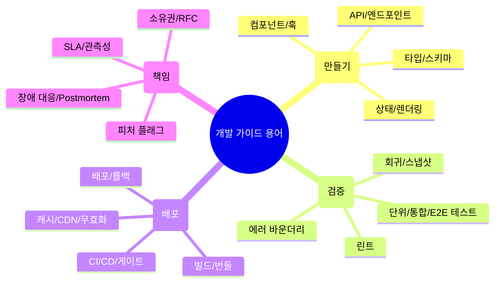
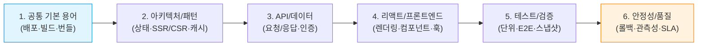
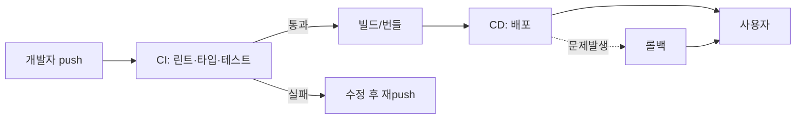
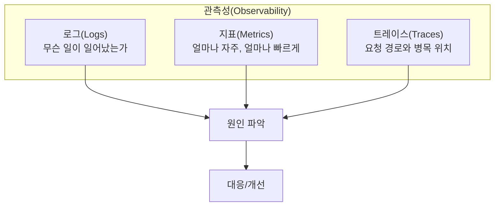
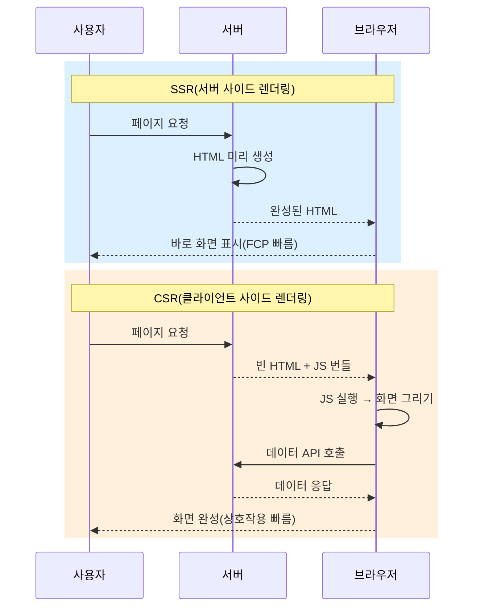
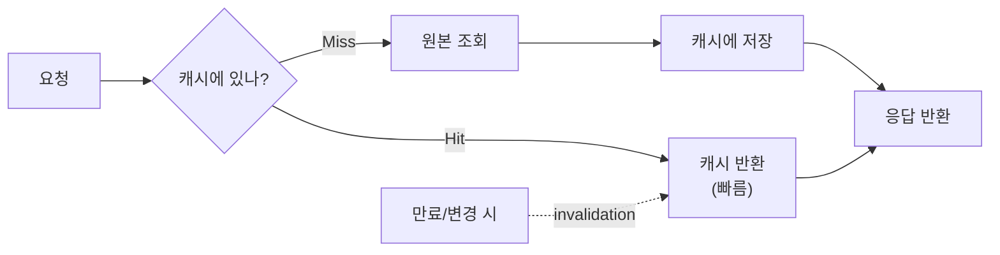
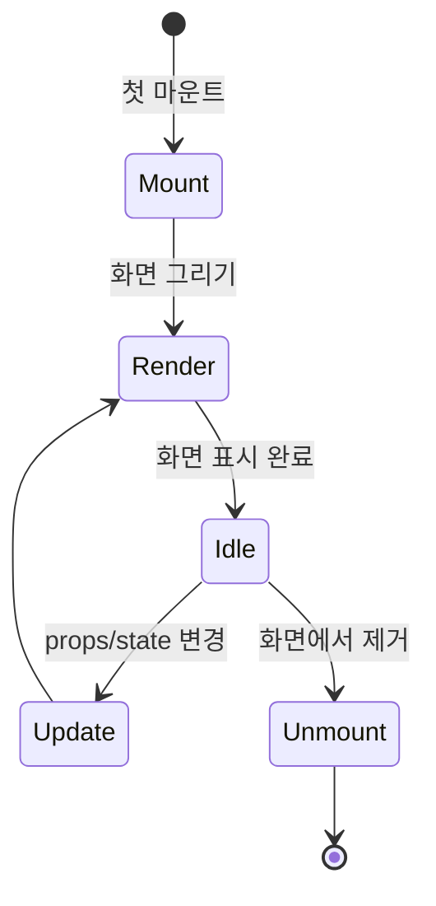
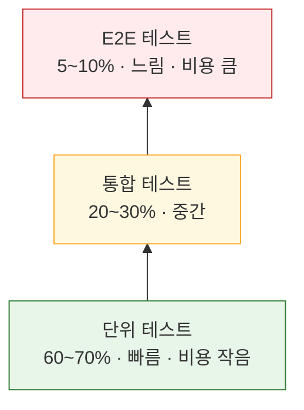
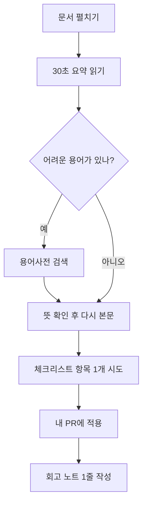

# 개발 가이드 용어 사전(초보자용)

문서 전체가 어렵게 느껴지는 가장 큰 이유는 용어가 먼저 나오기 때문입니다. 먼저 용어를 쉬운 말로 잡고 가면, 본문 내용이 훨씬 빨리 들어옵니다.

본 용어사전은 프로젝트 전반에서 자주 쓰는 용어를 **짧고 쉬운 뜻**으로 정리했습니다.

## 30초 핵심 요약

> 모든 용어는 결국 **"무엇을 만들고(개발) → 어떻게 검증하고(품질) → 어떻게 배포하며(운영) → 어떻게 책임지는가(거버넌스)"** 의 4단계에 속합니다.

## 추천 학습 순서 (초보자 시작점)

- 먼저 **공통 기본 용어 5개**(`배포`, `빌드`, `CI/CD`, `스키마`, `타입`)만 외워두면 실무 용어의 70%는 이해할 수 있습니다.
- 문서를 읽을 때는 `스키마` → `배포` → `보안` → `관측성` → `장애 대응` 순으로 이동해 보세요.
- 모르는 용어는 이 문서를 검색해 뜻을 확인하고, 본문 판단 근거와 연결해 사용하세요.

## 용어 빈도 안내 (실무 등장 빈도)

| 빈도 | 용어 | 처음 만나는 문서 |
| :---: | :--- | :--- |
| ★★★★★ | `배포`, `빌드`, `타입`, `CI/CD`, `테스트` | 거의 모든 문서 |
| ★★★★☆ | `스키마`, `상태`, `캐시`, `롤백`, `렌더링` | 03/04/05/12/14 |
| ★★★☆☆ | `관측성`, `SLA`, `피처 플래그`, `게이트` | 09/11/14/15 |
| ★★☆☆☆ | `idempotent`, `IaC`, `에러 바운더리`, `오프라인` | 10/26 |

---

## 공통 기본 용어

> 비유: **요리책**으로 비교하면 — `소스코드`는 레시피, `빌드`는 재료 손질, `번들`은 한 그릇 담기, `배포`는 손님 식탁에 내기, `CI/CD`는 자동 주방 라인입니다.

- `배포(Deployment)`
  - 새로 만든 코드를 실제 사용자에게 공개되는 환경으로 올리는 과정.
- `빌드(Build)`
  - 소스 코드를 브라우저가 실행할 수 있는 형태로 변환하는 과정.
- `번들(Bundle)`
  - 여러 파일의 코드를 하나로 합쳐 최적화한 결과물.
- `린트(Lint)`
  - 코드의 문법/스타일 규칙을 검사해 실수를 미리 잡는 과정.
- `CI/CD`
  - 코드가 푸시될 때 자동으로 테스트, 빌드, 배포를 이어서 처리하는 자동화 파이프라인.
- `스키마(Schema)`
  - 데이터의 모양(어떤 항목이 있고, 타입은 무엇인지)을 규칙으로 적어둔 약속.
- `타입(Type)`
  - 변수/함수/객체가 어떤 형태인지 미리 정해 둔 설계도.
- `런타임(Runtime)`
  - 코드를 실제로 실행하는 시점(브라우저/서버에서 동작하는 순간).
- `컴파일(Compile)`
  - 작성한 코드를 브라우저/노드가 이해하는 코드로 변환하는 과정.
- `테스트(Test)`
  - 기능이 의도대로 동작하는지 확인하는 검증 활동.

### CI/CD 흐름 한눈에 보기

---

## 안정성과 품질 용어

> 비유: **놀이공원 안전요원** 처럼 생각하면 쉽습니다 — `회귀`는 이전에 멀쩡하던 놀이기구가 다시 고장, `롤백`은 위험 시 운행 중단, `피처 플래그`는 시범 운행 스위치, `게이트`는 안전 검사대, `SLA`는 정상 운행 약속입니다.

- `회귀(Regression)`
  - 새 변경이 들어온 뒤 이전에 잘 동작하던 기능이 다시 깨지는 현상.
- `롤백(Rollback)`
  - 배포 후 문제가 생겼을 때 이전 상태로 되돌리는 동작.
- `피처 플래그(Feature Flag)`
  - 기능을 코드에 남겨 둔 채 특정 사용자/환경에서만 켜고 끌 수 있게 하는 스위치.
- `게이트(Gate)`
  - 다음 단계로 넘어가기 전에 반드시 통과해야 할 검사.
- `SLA`
  - 서비스가 만족해야 하는 가용성/지연시간 같은 약속 기준.
- `관측성(Observability)`
  - 문제가 생겼을 때 로그, 지표, 추적으로 원인을 찾는 능력.
- `장애 대응(PIR/Incident)`
  - 장애가 났을 때 탐지, 완화, 복구, 재발 방지까지의 일련 흐름.

### 관측성의 세 기둥(3 Pillars)

---

## 아키텍처/패턴 용어

> 비유: **건물 설계도**처럼 생각하세요 — `클라이언트`는 손님이 보는 매장, `서버`는 주방, `SSR`은 미리 만든 도시락, `CSR`은 주문 후 즉석 조리, `캐시`는 자주 쓰는 양념을 손 닿는 곳에 두기.

- `클라이언트(Client)`
  - 사용자 브라우저에서 동작하는 화면(프론트엔드) 쪽 로직.
- `서버(Server)`
  - API, 데이터 저장, 인증 등을 처리하는 백엔드 쪽 로직.
- `SSR` / `CSR`
  - SSR: 서버에서 HTML을 미리 만들어 보여주는 방식. CSR: 브라우저가 실행 후 화면을 완성하는 방식.
- `상태(State)`
  - 지금 어떤 화면/데이터가 어떻게 보여야 하는지에 대한 현재 값.
- `캐시(Cache)`
  - 같은 요청/데이터를 다시 계산하지 않기 위한 임시 저장소.
- `무효화(Invalidation)`
  - 오래된 캐시를 지우거나 갱신해 최신 데이터가 보이게 하는 동작.
- `오프라인(Offline)`
  - 네트워크가 안 좋거나 끊겨도 앱이 기본 동작을 유지하는 상태.
- `모노레포(Monorepo)`
  - 여러 패키지/앱을 하나의 저장소에서 같이 관리하는 방식.
- `CDN`
  - 정적 자산을 전세계 캐시 노드에 저장해 빠르게 전달하는 서비스.
- `IaC`
  - 인프라(서버, 네트워크, 환경 설정)를 코드로 관리하는 방식.

### SSR vs CSR 비교

### 캐시 동작 원리

---

## API/데이터 용어

> 비유: **편의점 주문**으로 보면 — `API`는 카운터 메뉴, `요청`은 손님이 메뉴 주문, `응답`은 점원이 물건 전달, `엔드포인트`는 각 상품의 위치, `인증`은 회원 카드 확인, `인가`는 멤버십 등급별 할인 권한.

- `API`
  - 화면에서 서버와 데이터를 주고받기 위한 정해진 규약.
- `요청(Request)` / `응답(Response)`
  - 요청: 클라이언트가 서버에 보내는 행동, 응답: 서버가 돌려주는 결과.
- `엔드포인트(Endpoint)`
  - 특정 기능(API 요청)이 열려 있는 URL 경로.
- `인증(Auth)`
  - "누가 누구인지"를 확인하는 절차.
- `인가(Authorization)`
  - "무엇을 할 수 있는지"를 제한/허용하는 절차.
- `idempotent`
  - 여러 번 같은 요청을 보내도 결과가 한 번과 같은 성질.
- `동시성(Concurrency)`
  - 같은 자원을 여러 사용자가 동시에 다룰 때의 처리 방식.

### 인증 vs 인가 차이

| 구분 | 인증(Authentication) | 인가(Authorization) |
| :--- | :--- | :--- |
| 질문 | 너 누구야? | 너 뭐 할 수 있어? |
| 예시 | 로그인, OTP, 지문 | 관리자 페이지 접근, 결제 권한 |
| 실패 시 응답 | 401 Unauthorized | 403 Forbidden |
| 일상 비유 | 신분증 검사 | VIP실 출입 권한 |

---

## 리액트/프론트엔드 용어

> 비유: **레고 블록**으로 이해하기 — `컴포넌트`는 블록 한 조각, `훅`은 블록끼리 결합 기능, `렌더링`은 조립 완성품 보여주기, `폼`은 입력 정보 받는 우편함, `낙관적 업데이트`는 답장 전에 답을 미리 적어 두기.

- `렌더링(Render)`
  - 화면에 UI를 그리는 과정.
- `컴포넌트(Component)`
  - UI의 작은 조각(버튼, 카드, 입력폼 등)으로, 조립해서 화면을 만들 수 있음.
- `훅(Hook)`
  - 컴포넌트 로직을 재사용하기 위한 React 함수.
- `폼(Form)`
  - 사용자 입력을 한 번에 받아 서버로 전달하는 입력 영역 묶음.
- `낙관적 업데이트(Optimistic Update)`
  - 서버 응답 전에 화면을 먼저 반영해 체감 속도를 높이는 패턴.
- `트랜지션/Transition`
  - 화면 상태 전환을 사용자 체감이 좋게 매끄럽게 처리하는 방법.
- `폴더 구조(Directory)`
  - 코드를 어떤 기준으로 나눠 저장할지 정한 규칙.

### 컴포넌트 렌더링 사이클

---

## 테스트/검증 용어

> 비유: **공장 품질 검사**처럼 — `단위 테스트`는 부품 하나씩 점검, `통합 테스트`는 부품 결합 후 점검, `E2E 테스트`는 완성품을 실제 사용해 보기, `스냅샷`은 정상 상태 사진을 찍어 두기, `에러 바운더리`는 한 부품 고장이 전체 라인을 멈추지 않도록 격리하는 차단막.

- `단위 테스트(Unit Test)`
  - 작은 함수/컴포넌트 단위를 개별로 검증.
- `통합 테스트(Integration Test)`
  - 여러 컴포넌트/모듈이 함께 동작하는지를 검증.
- `E2E 테스트`
  - 실제 사용자 동선 기준으로 브라우저 끝에서 끝까지 검증.
- `스냅샷(Visual Snap)`
  - 화면 모양을 기준점으로 저장해 변경 여부를 비교.
- `에러 바운더리(Error Boundary)`
  - 하위 UI에서 나는 렌더링 오류를 붙잡아 앱 전체를 깨지 않게 하는 장치.

### 테스트 피라미드 (비중과 속도)

| 단계 | 비중 | 속도 | 비용 | 신뢰도 |
| :---: | :---: | :---: | :---: | :---: |
| 단위 | 60~70% | 매우 빠름 | 낮음 | 부분 |
| 통합 | 20~30% | 보통 | 중간 | 결합 |
| E2E | 5~10% | 느림 | 높음 | 전체 |

---

## 읽기 방법 팁

1. 어려운 문장이 나오면 바로 용어사전에서 용어를 찾아보세요.
2. 본문을 1회 빠르게 훑은 뒤, 두 번째에 실무 예시만 집중해서 다시 읽으면 이해 속도가 빨라집니다.
3. 각 문서의 체크리스트는 "완료 기준" 기준으로 우선 실행하고, 나머지는 선택적으로 확장해 읽으세요.

### 효율적 학습 흐름

## 추천 항목 고도화 체크

- `즉시 적용` — 추천 항목 1개를 이번 주 내에 실제 작업 1건에 반영한다.
- `1주 내 정리` — 적용 결과를 PR 본문이나 회고 노트에 간단히 기록한다.
- `1개월 내 점검` — 재작업률/리뷰 충돌/배포 이슈 중 적어도 한 항목이 개선되었는지 확인한다.

## 추천 항목 실행 기록 템플릿

- `담당자` : 항목 적용 주체(문서 오너/팀원)를 명시
- `적용일` : 실제 반영된 날짜 및 작업 ID를 남김
- `측정 지표` : 리뷰 충돌/재작업/버그 재발 중 1개 이상 수치로 기록
- `보류 사유` : 적용을 못한 경우 이유를 1줄 기록하고 다음 액션을 지정

## 추천 항목 실행 우선순위 매핑

- `P1(7일 내)` — 추천 항목 1개를 우선 적용하고 1회 사용자 관측 신호(에러율/실패율/지연)와 연결한다.
- `P2(30일 내)` — 추천 항목 1개를 팀 내 표준/템플릿에 반영해 재사용성을 확보한다.
- `P3(90일 내)` — 추천 항목 1개를 다른 관련 문서에 역링크로 연동해 중복 작업을 줄인다.
- `완료 기준` — 각 항목별 산출물(예: PR 링크/체크리스트/회고 노트)을 1개 이상 남긴다.

## 추천 항목 실행 체크리스트

- [ ] `1단계(7일)` : 추천 항목 1개를 실제 작업으로 전환
- [ ] `2단계(30일)` : 전환 결과를 팀 산출물(ADR/PR/체크리스트)에 반영
- [ ] `3단계(60일)` : 정적 지표 1개 이상으로 효과 검증
- [ ] `문제 대응` : 미달성 시 보류 사유와 다음 실행 액션을 문서화

## 추천 항목 실행 운영 규칙

- `실행 게이트` : 위험, 비용, 기대 효과가 1회 이상 정량화되어야 적용한다.
- `승인 체계` : 적용 전 사전 승인자(팀 리드/보안/운영)와 rollback 담당자를 확인한다.
- `재개 조건` : 실패 신호가 기준치 이내로 돌아오면 다음 단계로 확장한다.
- `정지 조건` : 회귀 지표 악화가 1개 이상이면 즉시 중단하고 보류 사유를 갱신한다.
- `리스크 점수` : 1~5 등급으로 현재 위험도를 기록하고 정량 기준을 남긴다.
- `리더 승인자` : 최종 승인 책임자(예: 팀 리드/PO/보안리더)를 명시한다.
- `승인 역할` : 승인자, 실행자, 모니터링 주체 역할을 분리해 적는다.
- `재평가 주기` : 최소 2주 단위로 상태를 리뷰하고 조정한다.
